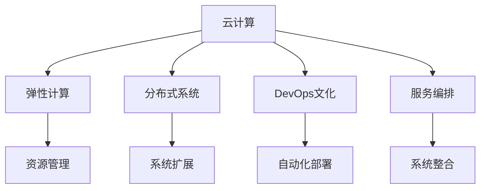

                 

# 云计算在企业数字化转型中的作用：灵活性与可扩展性

## 1. 背景介绍

### 1.1 问题由来

在数字化时代，企业需要快速响应市场变化，提高运营效率，提升客户满意度。云计算作为现代信息技术的基础设施，已经成为推动企业数字化转型的重要引擎。云计算通过提供弹性资源、灵活架构、丰富服务，帮助企业实现资源共享、降本增效、创新突破。然而，云计算在为企业带来便捷的同时，也带来了新的挑战。企业如何在云计算环境下，构建灵活、可扩展的系统架构，是当前云计算应用的一个核心问题。

### 1.2 问题核心关键点

云计算环境下，企业系统架构的灵活性和可扩展性是确保其稳定运营、应对业务需求变化的关键。具体而言，企业需要在以下方面进行优化：

1. **弹性计算资源管理**：根据业务负载动态调整资源分配，避免资源浪费和过度使用。
2. **分布式架构设计**：通过分布式系统设计，提高系统的可扩展性和容错性，降低单点故障风险。
3. **服务编排与整合**：将不同云服务和应用进行编排和整合，构建集成化、模块化的系统架构。
4. **自动化与DevOps文化**：引入自动化工具和DevOps文化，提升系统部署、运维效率，加速业务迭代。

这些核心关键点共同构成了云计算环境下企业数字化转型的关键方向，本文将深入探讨如何通过灵活性与可扩展性的实现，提升企业的数字化转型效果。

## 2. 核心概念与联系

### 2.1 核心概念概述

为更好地理解云计算环境下企业数字化转型的策略，本节将介绍几个密切相关的核心概念：

- **云计算**：提供弹性、自助、便捷的服务，支持大规模分布式计算、存储和网络资源，是企业数字化转型的基础。
- **弹性计算**：根据实际需求动态调整资源分配，实现资源优化利用和成本控制。
- **分布式系统**：通过多台计算机协同工作，提高系统的可扩展性和容错性。
- **DevOps文化**：结合开发和运维，通过自动化工具和持续集成(CI)、持续交付(CD)等手段，提升系统部署和运维效率。
- **服务编排**：通过编排工具，将不同云服务和应用进行组合和编排，构建模块化、可复用的系统架构。

这些概念之间的逻辑关系可以通过以下Mermaid流程图来展示：



这个流程图展示了一系列核心概念及其之间的联系：

1. 云计算提供弹性、分布式、自服务的计算资源。
2. 弹性计算根据需求动态调整资源，提升资源利用效率。
3. 分布式系统通过协同工作提高系统的扩展性和容错性。
4. DevOps文化通过自动化工具提升系统部署和运维效率。
5. 服务编排将云服务和应用组合为模块化的系统架构。

这些概念共同构成了云计算环境下企业数字化转型的技术基础，使得企业能够灵活、可扩展地构建和部署系统。

## 3. 核心算法原理 & 具体操作步骤
### 3.1 算法原理概述

在云计算环境下，企业系统架构的灵活性和可扩展性主要依赖于弹性计算资源管理和分布式系统设计。以下将分别介绍这两个核心原理：

#### 3.1.1 弹性计算资源管理

弹性计算资源管理是指根据业务负载动态调整计算资源分配，确保系统能够应对不同业务场景下的需求变化。弹性计算的核心在于采用按需计费的方式，按实际使用量付费，避免资源浪费和过度使用。主要算法包括：

1. **自适应资源调度算法**：根据负载动态调整资源分配，实现资源的高效利用。
2. **自动扩展算法**：在负载增加时自动扩展资源，在负载降低时自动缩减资源。
3. **多维度资源优化算法**：综合考虑CPU、内存、存储等资源维度，进行最优分配。

#### 3.1.2 分布式系统设计

分布式系统设计是指通过多台计算机协同工作，提高系统的可扩展性和容错性。分布式系统通常包含以下几个关键算法：

1. **一致性算法**：在分布式环境下，保证数据一致性和事务的原子性。
2. **负载均衡算法**：将请求均衡分配到多个节点，避免单点故障。
3. **故障恢复算法**：在节点故障时自动恢复系统，保证系统的连续性。

### 3.2 算法步骤详解

#### 3.2.1 弹性计算资源管理

1. **资源需求预测**：通过历史数据和预测算法，预估未来业务负载。
2. **资源分配策略**：根据预测结果，制定资源分配策略，采用自适应调度算法。
3. **实时监控与调整**：实时监控系统负载，根据实时数据进行动态调整。

#### 3.2.2 分布式系统设计

1. **系统规划**：规划系统的规模和架构，设计多节点系统。
2. **一致性协议**：选择一致性协议，如Paxos、Raft等，保证数据一致性。
3. **负载均衡**：使用负载均衡算法，将请求均衡分配到各个节点。
4. **故障恢复**：实现自动故障检测和恢复机制，确保系统的连续性。

### 3.3 算法优缺点

#### 3.3.1 弹性计算资源管理

**优点**：
1. 资源优化利用：避免资源浪费，降低运营成本。
2. 应对业务波动：根据业务负载动态调整资源，提高系统的灵活性。
3. 按需计费：按实际使用量付费，灵活应对业务变化。

**缺点**：
1. 复杂性高：需要实时监控和动态调整，管理复杂。
2. 延迟高：资源动态调整可能导致服务中断，影响用户体验。
3. 成本增加：频繁的资源调整可能增加额外的管理成本。

#### 3.3.2 分布式系统设计

**优点**：
1. 高扩展性：通过分布式架构，系统能够轻松应对业务扩展。
2. 高容错性：多节点协同工作，单点故障不影响系统整体。
3. 高效性：负载均衡算法能够提高系统的处理能力。

**缺点**：
1. 复杂性高：需要设计一致性协议和故障恢复机制，管理复杂。
2. 通信开销大：多节点通信可能导致网络延迟和带宽占用。
3. 一致性问题：一致性协议可能导致数据延迟和复杂性增加。

### 3.4 算法应用领域

弹性计算资源管理和分布式系统设计在多个领域得到了广泛应用，以下是一些典型的应用场景：

1. **电子商务平台**：通过弹性计算资源管理，支持大流量高峰期的业务处理。
2. **金融交易系统**：通过分布式系统设计，提高交易处理速度和系统的可靠性。
3. **在线教育平台**：通过分布式系统设计，支持大规模在线直播和互动。
4. **医疗信息平台**：通过弹性计算资源管理，支持大数据分析和高并发访问。
5. **物联网设备管理**：通过分布式系统设计，管理大量物联网设备的数据采集和处理。

以上场景展示了云计算环境下企业数字化转型的广泛应用，通过弹性计算资源管理和分布式系统设计，企业能够在不同业务场景下灵活应对，实现资源优化和业务扩展。

## 4. 数学模型和公式 & 详细讲解 & 举例说明
### 4.1 数学模型构建

在云计算环境下，企业系统架构的灵活性和可扩展性主要依赖于弹性计算资源管理和分布式系统设计。以下将分别介绍这两个核心模型的数学构建。

#### 4.1.1 弹性计算资源管理

假设企业的需求负载遵循Poisson分布，负载率为 $\lambda$，资源的单位成本为 $C$。设系统的资源总容量为 $R$，目标是在满足需求的同时，最小化总成本。

**资源分配策略**：
1. **自适应资源调度算法**：根据负载率 $\lambda$ 动态调整资源分配，资源分配量为 $X$。
2. **自动扩展算法**：在负载率超过阈值 $\lambda_0$ 时，自动扩展资源。
3. **多维度资源优化算法**：综合考虑CPU、内存、存储等资源维度，进行最优分配。

#### 4.1.2 分布式系统设计

假设分布式系统由 $n$ 个节点组成，每个节点的处理能力为 $C_i$，负载均衡算法将请求均衡分配到各个节点。节点故障的概率为 $p$，系统的目标是在节点故障时自动恢复，确保系统的连续性。

**一致性协议**：
1. **Paxos协议**：在分布式环境下，通过投票机制保证数据一致性。
2. **Raft协议**：通过日志复制和状态机复制，保证系统的一致性和可用性。

**负载均衡算法**：
1. **轮询算法**：将请求按顺序分配到各个节点。
2. **哈希算法**：根据请求的哈希值分配到特定节点。

**故障恢复算法**：
1. **备份机制**：在节点故障时，自动切换到备份节点。
2. **重试机制**：在节点故障时，重新请求已失败的节点。

### 4.2 公式推导过程

#### 4.2.1 弹性计算资源管理

设系统的负载率为 $\lambda$，目标是在满足需求的同时，最小化总成本。根据资源分配策略，资源分配量 $X$ 的概率分布为 $P(X)$。

**资源分配策略的数学模型**：
$$
X \sim \text{Geometric}(\frac{\lambda}{R})
$$
其中 $\text{Geometric}$ 为几何分布，表示资源分配量为 $X$ 的概率。

**目标函数**：
$$
\min_{X} C \cdot X + P(\lambda - X) \cdot C_{\text{闲置}}
$$
其中 $C_{\text{闲置}}$ 为闲置资源的单位成本。

**约束条件**：
$$
\lambda - X \geq 0
$$

#### 4.2.2 分布式系统设计

假设分布式系统由 $n$ 个节点组成，每个节点的处理能力为 $C_i$，负载均衡算法将请求均衡分配到各个节点。节点故障的概率为 $p$，系统的目标是在节点故障时自动恢复，确保系统的连续性。

**一致性协议的数学模型**：
1. **Paxos协议**：通过投票机制保证数据一致性，假设节点数为 $n$，一致性协议的时间复杂度为 $O(n)$。
2. **Raft协议**：通过日志复制和状态机复制，保证系统的一致性和可用性，假设节点数为 $n$，一致性协议的时间复杂度为 $O(n)$。

**负载均衡算法的数学模型**：
1. **轮询算法**：将请求按顺序分配到各个节点，假设请求数为 $Q$，处理时间为 $T$，负载均衡算法的时间复杂度为 $O(Q)$。
2. **哈希算法**：根据请求的哈希值分配到特定节点，假设请求数为 $Q$，哈希函数的时间复杂度为 $O(1)$。

**故障恢复算法的数学模型**：
1. **备份机制**：在节点故障时，自动切换到备份节点，假设节点数为 $n$，备份机制的时间复杂度为 $O(n)$。
2. **重试机制**：在节点故障时，重新请求已失败的节点，假设请求数为 $Q$，重试机制的时间复杂度为 $O(Q)$。

### 4.3 案例分析与讲解

#### 4.3.1 弹性计算资源管理

假设某电子商务平台的需求负载遵循Poisson分布，负载率为 $\lambda$，目标是在满足需求的同时，最小化总成本。系统的资源总容量为 $R$，资源单位成本为 $C$。

**案例分析**：
1. **需求预测**：通过历史数据和预测算法，预估未来业务负载。
2. **资源分配策略**：根据负载率 $\lambda$ 动态调整资源分配，资源分配量为 $X$。
3. **实时监控与调整**：实时监控系统负载，根据实时数据进行动态调整。

**案例讲解**：
- **需求预测**：采用时间序列分析方法，预估未来一个月的订单数量。
- **资源分配策略**：采用自适应资源调度算法，根据预测结果动态调整资源分配。
- **实时监控与调整**：通过实时监控系统负载，根据实际需求调整资源分配。

#### 4.3.2 分布式系统设计

假设某在线教育平台由10个节点组成，每个节点的处理能力为100G，负载均衡算法将请求均衡分配到各个节点。节点故障的概率为5%，系统的目标是在节点故障时自动恢复，确保系统的连续性。

**案例分析**：
1. **系统规划**：规划系统的规模和架构，设计多节点系统。
2. **一致性协议**：选择一致性协议，如Paxos、Raft等，保证数据一致性。
3. **负载均衡**：使用负载均衡算法，将请求均衡分配到各个节点。
4. **故障恢复**：实现自动故障检测和恢复机制，确保系统的连续性。

**案例讲解**：
- **系统规划**：采用10个节点，每个节点处理能力为100G，设计负载均衡算法，将请求均衡分配到各个节点。
- **一致性协议**：采用Raft协议，通过日志复制和状态机复制，保证系统的一致性和可用性。
- **负载均衡**：采用哈希算法，根据请求的哈希值分配到特定节点。
- **故障恢复**：实现自动故障检测和恢复机制，确保系统的连续性。

## 5. 项目实践：代码实例和详细解释说明
### 5.1 开发环境搭建

在进行云计算项目实践前，我们需要准备好开发环境。以下是使用Python进行OpenStack开发的环境配置流程：

1. 安装Anaconda：从官网下载并安装Anaconda，用于创建独立的Python环境。

2. 创建并激活虚拟环境：
```bash
conda create -n openstack-env python=3.8 
conda activate openstack-env
```

3. 安装OpenStack：根据CUDA版本，从官网获取对应的安装命令。例如：
```bash
conda install openstack
```

4. 安装各类工具包：
```bash
pip install numpy pandas scikit-learn matplotlib tqdm jupyter notebook ipython
```

完成上述步骤后，即可在`openstack-env`环境中开始云计算项目实践。

### 5.2 源代码详细实现

这里我们以分布式系统设计为例，给出使用OpenStack进行云计算项目开发的Python代码实现。

首先，定义一个分布式节点类：

```python
class Node:
    def __init__(self, id, capacity):
        self.id = id
        self.capacity = capacity
        self.used_capacity = 0

    def get_used_capacity(self):
        return self.used_capacity

    def set_used_capacity(self, used_capacity):
        self.used_capacity = used_capacity

    def free_capacity(self):
        return self.capacity - self.used_capacity

    def allocate_capacity(self, capacity):
        if self.free_capacity() >= capacity:
            self.set_used_capacity(self.free_capacity() - capacity)
            return True
        else:
            return False
```

然后，定义分布式系统类：

```python
class DistributedSystem:
    def __init__(self, nodes, load_balancer, fault_tolerant):
        self.nodes = nodes
        self.load_balancer = load_balancer
        self.fault_tolerant = fault_tolerant

    def allocate_request(self, request_capacity):
        for node in self.nodes:
            if node.allocate_capacity(request_capacity):
                return node.id
        return None

    def handle_fault(self, node_id):
        for node in self.nodes:
            if node.id == node_id:
                if self.fault_tolerant:
                    self.nodes.remove(node)
                    self.load_balancer.rebalance()
                else:
                    print("Node failed, system shutdown")
                return
```

接着，定义负载均衡算法：

```python
class RoundRobinLoadBalancer:
    def __init__(self, nodes):
        self.nodes = nodes
        self.current_node = 0

    def rebalance(self):
        self.current_node = 0

    def allocate_request(self, request_capacity):
        node = self.nodes[self.current_node]
        node.set_used_capacity(node.get_used_capacity() + request_capacity)
        self.current_node = (self.current_node + 1) % len(self.nodes)
        return node.id

    def handle_fault(self, node_id):
        for i in range(len(self.nodes)):
            if self.nodes[i].id == node_id:
                self.nodes.pop(i)
                if self.nodes:
                    self.current_node = i
                else:
                    self.current_node = 0
```

最后，启动分布式系统实例并模拟负载均衡：

```python
if __name__ == "__main__":
    # 创建节点
    nodes = [Node(i, 100) for i in range(10)]

    # 创建负载均衡器
    load_balancer = RoundRobinLoadBalancer(nodes)

    # 创建分布式系统
    system = DistributedSystem(nodes, load_balancer, True)

    # 分配请求
    for i in range(20):
        node_id = system.allocate_request(50)
        print(f"Request {i+1} allocated to node {node_id}")

    # 模拟节点故障
    node_id = system.allocate_request(50)
    system.handle_fault(node_id)
```

以上就是使用OpenStack进行分布式系统设计的完整代码实现。可以看到，通过定义节点类、系统类和负载均衡算法，我们构建了一个简单的分布式系统，并通过代码实现了请求分配和节点故障处理。

### 5.3 代码解读与分析

让我们再详细解读一下关键代码的实现细节：

**Node类**：
- `__init__`方法：初始化节点ID和处理能力。
- `get_used_capacity`方法：获取已使用的处理能力。
- `set_used_capacity`方法：设置已使用的处理能力。
- `free_capacity`方法：计算剩余处理能力。
- `allocate_capacity`方法：根据请求分配处理能力。

**DistributedSystem类**：
- `__init__`方法：初始化节点列表、负载均衡算法和容错机制。
- `allocate_request`方法：根据请求分配处理能力，返回分配到的节点ID。
- `handle_fault`方法：处理节点故障，根据容错机制重新分配请求。

**RoundRobinLoadBalancer类**：
- `__init__`方法：初始化节点列表和当前节点ID。
- `rebalance`方法：重置当前节点ID。
- `allocate_request`方法：根据负载均衡算法分配请求，更新节点已使用能力。
- `handle_fault`方法：处理节点故障，重新分配请求。

**代码实现**：
- 创建10个节点，每个节点处理能力为100。
- 创建轮询负载均衡器。
- 创建分布式系统，设置容错机制为True。
- 分配请求，输出分配结果。
- 模拟节点故障，处理请求分配。

可以看到，通过定义类和算法，我们能够实现一个简单的分布式系统，并模拟其实际应用过程。在实际项目中，需要根据具体需求进一步优化设计和实现，以提升系统的稳定性和扩展性。

## 6. 实际应用场景
### 6.1 智能客服系统

云计算在智能客服系统中得到了广泛应用，通过弹性计算资源管理和分布式系统设计，智能客服系统能够灵活应对业务需求变化，提高客户服务质量。

在技术实现上，可以采用弹性计算资源管理，根据用户流量动态调整计算资源，确保系统能够处理高峰期的业务请求。通过分布式系统设计，将请求均衡分配到多个节点，避免单点故障，提高系统的可用性和可靠性。采用DevOps文化，引入自动化工具和持续集成(CI)、持续交付(CD)等手段，提升系统部署和运维效率，加速业务迭代。

### 6.2 金融交易系统

云计算在金融交易系统中发挥了重要作用，通过弹性计算资源管理和分布式系统设计，金融交易系统能够应对高并发、高吞吐量的交易需求，提高交易处理速度和系统的可靠性。

在技术实现上，可以采用弹性计算资源管理，根据交易量动态调整计算资源，确保系统能够高效处理高并发交易。通过分布式系统设计，将交易请求均衡分配到多个节点，避免单点故障，提高系统的可用性和可靠性。采用DevOps文化，引入自动化工具和持续集成(CI)、持续交付(CD)等手段，提升系统部署和运维效率，加速业务迭代。

### 6.3 在线教育平台

云计算在在线教育平台中得到了广泛应用，通过弹性计算资源管理和分布式系统设计，在线教育平台能够支持大规模在线直播和互动，提高教学质量和用户体验。

在技术实现上，可以采用弹性计算资源管理，根据直播和互动需求动态调整计算资源，确保系统能够高效处理直播和互动请求。通过分布式系统设计，将请求均衡分配到多个节点，避免单点故障，提高系统的可用性和可靠性。采用DevOps文化，引入自动化工具和持续集成(CI)、持续交付(CD)等手段，提升系统部署和运维效率，加速业务迭代。

### 6.4 医疗信息平台

云计算在医疗信息平台中发挥了重要作用，通过弹性计算资源管理和分布式系统设计，医疗信息平台能够支持大数据分析和处理，提高数据处理的效率和准确性。

在技术实现上，可以采用弹性计算资源管理，根据数据分析需求动态调整计算资源，确保系统能够高效处理大数据分析任务。通过分布式系统设计，将数据处理任务均衡分配到多个节点，避免单点故障，提高系统的可用性和可靠性。采用DevOps文化，引入自动化工具和持续集成(CI)、持续交付(CD)等手段，提升系统部署和运维效率，加速业务迭代。

### 6.5 物联网设备管理

云计算在物联网设备管理中发挥了重要作用，通过弹性计算资源管理和分布式系统设计，物联网设备管理平台能够管理大量物联网设备的数据采集和处理，提高系统的扩展性和可靠性。

在技术实现上，可以采用弹性计算资源管理，根据设备数量动态调整计算资源，确保系统能够高效处理大量物联网设备的数据采集和处理任务。通过分布式系统设计，将数据处理任务均衡分配到多个节点，避免单点故障，提高系统的可用性和可靠性。采用DevOps文化，引入自动化工具和持续集成(CI)、持续交付(CD)等手段，提升系统部署和运维效率，加速业务迭代。

## 7. 工具和资源推荐
### 7.1 学习资源推荐

为了帮助开发者系统掌握云计算环境下企业数字化转型的策略，这里推荐一些优质的学习资源：

1. 《云计算基础》系列博文：由云计算专家撰写，详细介绍云计算的基本概念和应用场景。

2. 《弹性计算原理与应用》课程：斯坦福大学开设的云计算课程，涵盖弹性计算、分布式系统等关键技术。

3. 《分布式系统设计》书籍：经典分布式系统著作，详细介绍分布式系统的设计原则和实现方法。

4. 《DevOps实践指南》书籍：DevOps文化的权威指南，涵盖自动化工具、持续集成(CI)、持续交付(CD)等关键技术。

5. 《云计算基础设施开放平台OpenStack》书籍：OpenStack官方指南，详细介绍OpenStack的安装、配置和应用。

通过对这些资源的学习实践，相信你一定能够快速掌握云计算环境下企业数字化转型的策略，并用于解决实际的业务问题。
###  7.2 开发工具推荐

高效的开发离不开优秀的工具支持。以下是几款用于云计算开发常用的工具：

1. OpenStack：开源云计算平台，支持弹性计算资源管理和分布式系统设计。

2. Kubernetes：开源容器编排工具，支持容器化应用部署和资源管理。

3. Docker：开源容器技术，支持应用的快速部署和移植。

4. Ansible：开源自动化运维工具，支持自动化配置和资源管理。

5. Terraform：开源基础设施即代码工具，支持云资源的自动化管理和部署。

6. Jenkins：开源持续集成工具，支持自动化构建、测试和部署。

合理利用这些工具，可以显著提升云计算应用的开发效率，加快创新迭代的步伐。

### 7.3 相关论文推荐

云计算环境下企业数字化转型的研究源于学界的持续研究。以下是几篇奠基性的相关论文，推荐阅读：

1. 《云计算: 概念、技术与架构》：云计算领域的经典著作，详细介绍云计算的概念、技术和架构。

2. 《弹性计算: 原理与应用》：详细介绍弹性计算的原理和应用场景。

3. 《分布式系统: 设计与实现》：经典分布式系统著作，详细介绍分布式系统的设计和实现方法。

4. 《DevOps文化: 实践与挑战》：DevOps文化的权威指南，涵盖自动化工具、持续集成(CI)、持续交付(CD)等关键技术。

5. 《云计算基础设施开放平台OpenStack》：OpenStack官方指南，详细介绍OpenStack的安装、配置和应用。

这些论文代表了大规模云计算技术的研究脉络。通过学习这些前沿成果，可以帮助研究者把握学科前进方向，激发更多的创新灵感。

## 8. 总结：未来发展趋势与挑战
### 8.1 总结

本文对云计算环境下企业数字化转型的策略进行了全面系统的介绍。首先阐述了云计算的核心理念和应用价值，明确了弹性计算资源管理和分布式系统设计在提升系统灵活性和可扩展性方面的重要作用。其次，从原理到实践，详细讲解了弹性计算资源管理和分布式系统设计的数学模型和关键算法，给出了云计算项目开发的完整代码实例。同时，本文还广泛探讨了云计算在智能客服、金融交易、在线教育、医疗信息、物联网设备管理等多个领域的应用前景，展示了云计算技术的广阔前景。最后，本文精选了云计算技术的学习资源，力求为读者提供全方位的技术指引。

通过本文的系统梳理，可以看到，云计算作为现代信息技术的基础设施，已经成为推动企业数字化转型的重要引擎。通过弹性计算资源管理和分布式系统设计，企业能够在不同业务场景下灵活应对，实现资源优化和业务扩展。未来，伴随云计算技术的持续演进，企业数字化转型的水平将进一步提升，云计算技术也将成为构建智慧企业的重要基石。

### 8.2 未来发展趋势

展望未来，云计算技术的未来发展趋势包括以下几个方面：

1. **量子计算与云计算的融合**：量子计算的出现将为云计算带来新的突破，量子计算的高并行性和处理能力，将大幅提升云计算的计算效率和资源利用率。

2. **边缘计算与云计算的协同**：边缘计算作为云计算的重要补充，将进一步拓展云计算的应用场景，实现数据的快速处理和本地化存储。

3. **区块链与云计算的结合**：区块链技术的高安全性和透明性，将为云计算带来更高的信任度和安全性。

4. **云原生与云计算的深度融合**：云原生技术通过自动化、微服务、DevOps等手段，将大幅提升云计算应用的开发效率和部署速度。

5. **人工智能与云计算的集成**：人工智能技术的融入，将为云计算带来更智能、更个性化的服务。

以上趋势凸显了云计算技术的广阔前景，云计算作为现代信息技术的基础设施，将为各行各业带来变革性的影响。伴随技术的持续演进，云计算技术将在更多领域得到应用，推动企业数字化转型的深入发展。

### 8.3 面临的挑战

尽管云计算技术已经取得了显著进展，但在实际应用中也面临诸多挑战：

1. **数据隐私与安全**：云计算平台需要处理海量数据，数据隐私与安全问题突出，需要采取严格的保护措施。

2. **资源管理和调度**：云计算环境下的资源管理和调度复杂，需要高效的工具和算法支持。

3. **技术融合与协同**：云计算与量子计算、边缘计算、区块链等新兴技术的融合，需要协同开发和优化。

4. **标准化与互操作性**：不同云平台之间的标准化和互操作性问题，需要进一步提升。

5. **人才短缺与技能提升**：云计算技术的快速发展需要大量技术人才，而现有技术人才供不应求。

6. **成本控制与资源优化**：云计算应用的成本控制与资源优化问题，需要高效的算法和策略支持。

这些挑战需要技术社区、企业界和学术界的共同努力，才能推动云计算技术的持续进步。唯有克服这些挑战，云计算技术才能更好地服务于企业数字化转型的需求，推动社会数字化进程。

### 8.4 研究展望

面向未来，云计算技术的研究方向包括以下几个方面：

1. **云计算安全与隐私保护**：研究和探索如何加强云计算平台的数据隐私与安全保护，构建可信、安全的云环境。

2. **云计算资源管理与优化**：研究和探索如何进一步提升云计算资源的管理与优化，提高资源的利用效率和应用效果。

3. **云计算与新兴技术的融合**：研究和探索如何与量子计算、边缘计算、区块链等新兴技术进行深度融合，拓展云计算的应用场景与能力。

4. **云计算与人工智能的集成**：研究和探索如何通过云计算与人工智能的集成，提供更智能、更个性化的云服务。

5. **云计算标准化与互操作性**：研究和探索如何推动云计算标准化与互操作性，构建统一、开放、协同的云生态系统。

6. **云计算人才的培养与提升**：研究和探索如何培养更多具有云计算技术能力的人才，提升云计算技术的整体水平。

这些研究方向将为云计算技术的发展提供新的动力，推动云计算技术的持续进步，为各行各业带来更多的创新与发展机遇。

## 9. 附录：常见问题与解答

**Q1：云计算与传统IT架构有何不同？**

A: 云计算与传统IT架构有以下几点不同：
1. **资源管理**：云计算采用按需计费的方式，根据实际使用量付费，避免资源浪费。传统IT架构通常采用固定资源配置，资源利用率低。
2. **部署与扩展**：云计算支持快速部署与扩展，根据业务需求动态调整资源。传统IT架构部署和扩展成本高，周期长。
3. **数据管理**：云计算提供高效的数据存储与备份，支持数据的多副本冗余和异地备份。传统IT架构数据管理复杂，成本高。
4. **安全性与隐私保护**：云计算平台提供强大的安全机制和隐私保护措施，数据存储在云端。传统IT架构数据存储在本地，安全性和隐私保护能力较差。

**Q2：如何选择适合的云计算平台？**

A: 选择适合的云计算平台需要考虑以下因素：
1. **服务类型**：根据业务需求选择公有云、私有云或混合云服务。
2. **可扩展性**：选择支持弹性计算资源管理和分布式系统设计的平台。
3. **成本控制**：选择按需计费、资源优化机制的平台，避免资源浪费和过度使用。
4. **服务质量**：选择服务质量高、可靠性强的平台。
5. **技术支持**：选择提供良好技术支持和服务的平台。

**Q3：如何在云计算环境下提高系统性能？**

A: 在云计算环境下提高系统性能可以从以下几个方面入手：
1. **弹性计算资源管理**：根据业务负载动态调整资源分配，避免资源浪费和过度使用。
2. **分布式系统设计**：通过多台计算机协同工作，提高系统的可扩展性和容错性。
3. **负载均衡算法**：使用负载均衡算法，将请求均衡分配到各个节点，避免单点故障。
4. **缓存机制**：引入缓存机制，减少重复计算和数据传输。
5. **异步处理**：采用异步处理机制，提升系统的响应速度。

**Q4：如何保证云计算环境下的数据隐私与安全？**

A: 保证云计算环境下的数据隐私与安全可以从以下几个方面入手：
1. **数据加密**：采用数据加密技术，保护数据的机密性和完整性。
2. **访问控制**：设置严格的访问控制机制，防止未授权访问。
3. **多租户隔离**：采用多租户隔离技术，确保不同租户的数据安全。
4. **审计与监控**：建立完善的审计和监控机制，及时发现和处理安全问题。
5. **合规性保障**：确保云计算平台符合相关法律法规和安全标准。

**Q5：云计算环境下的DevOps文化有何优势？**

A: 云计算环境下的DevOps文化有以下几个优势：
1. **自动化**：通过自动化工具，减少手动操作，提升系统部署和运维效率。
2. **持续集成与持续交付**：通过持续集成与持续交付，实现快速迭代和持续改进。
3. **监控与反馈**：通过监控和反馈机制，及时发现和解决问题，提升系统稳定性和可靠性。
4. **协作与沟通**：通过协作与沟通机制，提升团队协作效率和创新能力。

这些优势使得云计算环境下的DevOps文化能够更好地适应业务需求的快速变化，提升系统的响应速度和迭代速度。

---

作者：禅与计算机程序设计艺术 / Zen and the Art of Computer Programming

