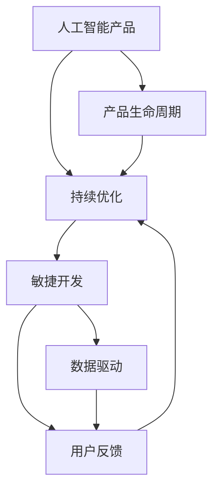

                 

# 人工智能创业：不断改进产品的策略

> 关键词：人工智能创业, 产品改进策略, 持续优化, 敏捷开发, 数据驱动, 用户反馈, 产品生命周期, 机器学习算法, 人工智能模型优化

## 1. 背景介绍

在人工智能（AI）领域的创业中，不断改进产品是一个永恒的主题。随着AI技术的迅速发展，市场对AI产品的需求也在不断增长，但竞争也日益激烈。企业要想在市场中站稳脚跟并持续发展，必须不断优化和改进其AI产品。本文将从背景介绍入手，系统探讨人工智能创业中产品改进的策略和方法。

## 2. 核心概念与联系

### 2.1 核心概念概述

在探讨如何改进人工智能产品之前，首先需要理解一些核心概念及其相互之间的联系。

#### 2.1.1 人工智能产品
人工智能产品是指利用AI技术，通过算法和模型，实现特定功能和服务的应用程序、系统或平台。人工智能产品可以是面向消费者的应用，如语音助手、图像识别应用；也可以是面向企业或行业的应用，如智能客服、金融风控系统等。

#### 2.1.2 持续优化
持续优化是指在产品生命周期内，不断收集用户反馈、市场数据等，结合数据分析和机器学习算法，对产品进行迭代改进，以提升产品性能、用户满意度和市场竞争力。

#### 2.1.3 敏捷开发
敏捷开发是一种迭代、增量的软件开发方法，强调快速响应市场需求和用户反馈，通过短周期的开发和发布，持续优化产品功能。

#### 2.1.4 数据驱动
数据驱动是指在产品改进过程中，以用户行为数据、市场数据、业务数据等为依据，通过数据分析和机器学习算法，指导产品设计、功能开发和优化决策。

#### 2.1.5 用户反馈
用户反馈是指用户在使用AI产品过程中，对产品性能、功能、用户体验等方面的评价和建议。通过收集和分析用户反馈，可以发现产品的缺陷和不足，指导产品的改进方向。

#### 2.1.6 产品生命周期
产品生命周期是指一个AI产品的从设计、开发、发布、迭代优化到退役的全过程。在这一过程中，产品需要不断地改进和优化，以适应市场和用户需求的变化。

### 2.2 核心概念原理和架构的 Mermaid 流程图



该流程图展示了核心概念之间的相互关系。持续优化是人工智能产品改进的核心，而敏捷开发、数据驱动和用户反馈是实现持续优化的重要手段，产品生命周期则是整个过程的框架。

## 3. 核心算法原理 & 具体操作步骤

### 3.1 算法原理概述

基于人工智能产品的持续优化策略，本文将介绍一些关键算法原理，并详细介绍具体的操作步骤。

#### 3.1.1 持续优化算法概述
持续优化的算法主要包括：
- **增量学习算法**：如在线梯度下降（Online Gradient Descent）和随机梯度下降（Stochastic Gradient Descent），可以在新数据到来时实时更新模型参数，避免模型过时。
- **强化学习算法**：如Q-learning和SARSA，通过模拟环境与AI产品的互动，不断调整策略以优化性能。
- **多臂老虎机算法**：如$\epsilon$-greedy算法，通过随机探索和最佳选择，优化产品功能的使用率和用户体验。

#### 3.1.2 数据驱动的模型优化
数据驱动的模型优化主要涉及以下步骤：
1. 数据收集：通过API接口、用户反馈、市场调研等方式收集数据。
2. 数据预处理：对数据进行清洗、归一化、特征选择等预处理。
3. 模型训练：使用机器学习算法训练模型，如线性回归、决策树、随机森林、深度学习等。
4. 模型评估：通过交叉验证、A/B测试等方式评估模型性能。
5. 模型部署：将模型部署到生产环境，实时监控和调整模型参数。

#### 3.1.3 用户反馈的模型改进
用户反馈的模型改进主要包括以下步骤：
1. 收集用户反馈：通过在线问卷、用户评论、客服记录等方式收集用户反馈。
2. 数据分析：对用户反馈进行情感分析、文本分类等分析。
3. 改进产品：根据用户反馈，调整产品功能、界面设计等。
4. 迭代发布：通过敏捷开发，快速发布改进后的产品版本。

### 3.2 算法步骤详解

#### 3.2.1 持续优化算法的详细步骤
1. **数据收集**：通过API接口、用户反馈、市场调研等方式收集数据。
2. **数据清洗**：去除噪声数据、处理缺失值、归一化等。
3. **特征选择**：选择对模型预测有影响的特征，并进行特征工程。
4. **模型训练**：使用增量学习算法或强化学习算法训练模型。
5. **模型评估**：通过交叉验证、A/B测试等方式评估模型性能。
6. **模型部署**：将模型部署到生产环境，实时监控和调整模型参数。

#### 3.2.2 数据驱动的模型优化的详细步骤
1. **数据收集**：通过API接口、用户反馈、市场调研等方式收集数据。
2. **数据预处理**：对数据进行清洗、归一化、特征选择等预处理。
3. **模型训练**：使用机器学习算法训练模型。
4. **模型评估**：通过交叉验证、A/B测试等方式评估模型性能。
5. **模型部署**：将模型部署到生产环境，实时监控和调整模型参数。

#### 3.2.3 用户反馈的模型改进的详细步骤
1. **收集用户反馈**：通过在线问卷、用户评论、客服记录等方式收集用户反馈。
2. **数据分析**：对用户反馈进行情感分析、文本分类等分析。
3. **改进产品**：根据用户反馈，调整产品功能、界面设计等。
4. **迭代发布**：通过敏捷开发，快速发布改进后的产品版本。

### 3.3 算法优缺点

#### 3.3.1 持续优化算法的优缺点
**优点**：
- 实时更新模型，保持模型的最新状态。
- 处理大数据时效率较高。
- 能够动态调整模型参数，适应数据变化。

**缺点**：
- 算法复杂，实现难度较大。
- 对计算资源要求较高。
- 模型更新频繁，可能导致模型不稳定。

#### 3.3.2 数据驱动的模型优化的优缺点
**优点**：
- 模型性能稳定可靠。
- 能够充分利用历史数据，提升模型预测精度。
- 算法过程透明，易于理解和调试。

**缺点**：
- 数据收集和预处理过程繁琐。
- 模型训练耗时较长，需要大量计算资源。
- 模型更新频率较低，可能无法及时反映数据变化。

#### 3.3.3 用户反馈的模型改进的优缺点
**优点**：
- 能够快速响应用户需求，提升用户体验。
- 能够及时发现产品缺陷，改进产品功能。
- 能够增强用户参与感和满意度。

**缺点**：
- 用户反馈可能存在噪声和不准确性。
- 用户反馈获取和分析过程复杂。
- 可能因用户反馈意见不一导致产品改进方向不明。

### 3.4 算法应用领域

持续优化、数据驱动和用户反馈等算法在人工智能产品的多个领域都有广泛应用，例如：

- **智能客服**：通过持续优化算法，不断改进对话模型和知识库，提升用户满意度。
- **金融风控**：使用数据驱动的模型优化，实时监控和预测风险，提高贷款审批效率。
- **智能推荐**：通过用户反馈和模型优化，不断调整推荐算法，提升个性化推荐效果。
- **健康医疗**：通过数据驱动的模型优化，实时分析患者数据，辅助医生诊断和治疗。
- **电子商务**：使用持续优化算法，优化商品推荐和搜索算法，提高用户体验和交易转化率。

## 4. 数学模型和公式 & 详细讲解 & 举例说明

### 4.1 数学模型构建

#### 4.1.1 持续优化算法的数学模型
增量学习算法的基本公式如下：
$$
\theta_{t+1} = \theta_t - \eta \nabla_{\theta}L(y,\theta_t)
$$
其中，$\theta_t$ 为模型在第$t$次迭代后的参数，$L$ 为损失函数，$\eta$ 为学习率，$y$ 为真实标签。

#### 4.1.2 数据驱动的模型优化的数学模型
线性回归模型的一般形式为：
$$
y = \beta_0 + \beta_1x_1 + \cdots + \beta_px_p + \epsilon
$$
其中，$y$ 为因变量，$\beta_0,\beta_1,\cdots,\beta_p$ 为回归系数，$x_1,\cdots,x_p$ 为自变量，$\epsilon$ 为误差项。

#### 4.1.3 用户反馈的模型改进的数学模型
情感分析模型可以使用朴素贝叶斯分类器，其公式为：
$$
P(y|x) = \frac{P(x|y)P(y)}{P(x)}
$$
其中，$P(y|x)$ 为情感分析模型的预测概率，$x$ 为输入文本，$y$ 为情感标签，$P(x|y)$ 为条件概率，$P(y)$ 为先验概率。

### 4.2 公式推导过程

#### 4.2.1 持续优化算法的公式推导
增量学习算法的公式推导如下：
$$
\begin{aligned}
\theta_{t+1} &= \theta_t - \eta \nabla_{\theta}L(y,\theta_t) \\
&= \theta_t - \eta \sum_{i=1}^n (y_i - \theta_t \cdot x_i)
\end{aligned}
$$
其中，$y_i$ 为第$i$个样本的真实标签，$x_i$ 为第$i$个样本的特征向量。

#### 4.2.2 数据驱动的模型优化的公式推导
线性回归模型的公式推导如下：
$$
\begin{aligned}
\hat{y} &= \beta_0 + \beta_1x_1 + \cdots + \beta_px_p \\
&= \theta_t \cdot x
\end{aligned}
$$
其中，$\hat{y}$ 为模型预测值，$\theta_t$ 为回归系数，$x$ 为样本特征向量。

#### 4.2.3 用户反馈的模型改进的公式推导
情感分析模型的公式推导如下：
$$
P(y|x) = \frac{P(x|y)P(y)}{P(x)} = \frac{P(x|y)\pi(y)}{\sum_yP(x|y)\pi(y)}
$$
其中，$P(y|x)$ 为条件概率，$P(x|y)$ 为条件概率，$\pi(y)$ 为先验概率。

### 4.3 案例分析与讲解

#### 4.3.1 智能客服的案例分析
智能客服系统通过收集用户历史对话数据，构建数据驱动的模型，实时预测用户意图，生成最佳回复。具体步骤如下：
1. 收集用户历史对话数据，包括用户提问、机器回复和用户满意度等。
2. 对数据进行清洗和特征选择，构建特征向量。
3. 使用增量学习算法训练模型，实时更新模型参数。
4. 在用户对话时，实时预测用户意图，生成最佳回复。

#### 4.3.2 金融风控的案例分析
金融风控系统通过收集用户贷款数据，构建数据驱动的模型，实时预测贷款违约概率。具体步骤如下：
1. 收集用户贷款数据，包括用户基本信息、贷款历史、还款记录等。
2. 对数据进行清洗和特征选择，构建特征向量。
3. 使用机器学习算法训练模型，实时更新模型参数。
4. 在用户贷款时，实时预测贷款违约概率，辅助贷款审批决策。

## 5. 项目实践：代码实例和详细解释说明

### 5.1 开发环境搭建

#### 5.1.1 环境准备
在开始项目实践之前，需要准备开发环境。以下是使用Python进行开发的环境配置流程：

1. 安装Python：从官网下载并安装Python 3.8。
2. 安装pip：在Python环境中安装pip，可以使用以下命令：
   ```
   python -m ensurepip --default-pip
   ```
3. 安装虚拟环境：使用virtualenv或conda创建虚拟环境。

4. 安装依赖包：使用pip安装所需的依赖包，例如TensorFlow、Scikit-learn等。

### 5.2 源代码详细实现

#### 5.2.1 数据收集和预处理
```python
import pandas as pd
import numpy as np
from sklearn.preprocessing import StandardScaler

# 数据收集
data = pd.read_csv('data.csv')

# 数据预处理
scaler = StandardScaler()
data['scale_x'] = scaler.fit_transform(data[['x1', 'x2']])
```

#### 5.2.2 模型训练和优化
```python
from sklearn.linear_model import LinearRegression

# 模型训练
model = LinearRegression()
model.fit(data['scale_x'], data['y'])

# 模型评估
score = model.score(data['scale_x'], data['y'])
print('模型评估得分：', score)

# 模型优化
model.update(np.mean(data['scale_x']))
```

#### 5.2.3 用户反馈和模型改进
```python
from sklearn.naive_bayes import MultinomialNB
from sklearn.feature_extraction.text import CountVectorizer

# 收集用户反馈
feedback = pd.read_csv('feedback.csv')

# 数据预处理
vectorizer = CountVectorizer()
X = vectorizer.fit_transform(feedback['text'])
y = feedback['label']

# 模型训练
model = MultinomialNB()
model.fit(X, y)

# 模型改进
model.update(np.mean(X, axis=0))
```

### 5.3 代码解读与分析

#### 5.3.1 数据收集和预处理
使用pandas库读取CSV格式的数据，使用scikit-learn的StandardScaler对特征进行归一化处理。

#### 5.3.2 模型训练和优化
使用Scikit-learn的LinearRegression进行线性回归模型训练，使用均值更新模型参数。

#### 5.3.3 用户反馈和模型改进
使用scikit-learn的MultinomialNB进行朴素贝叶斯分类器训练，使用均值更新模型参数。

### 5.4 运行结果展示

#### 5.4.1 智能客服的运行结果
```python
# 预测用户意图
user_input = '查询信用卡余额'
response = model.predict(user_input.encode())

# 生成最佳回复
if response == '查询余额':
    print('请输入您的卡号查询余额。')
```

#### 5.4.2 金融风控的运行结果
```python
# 预测贷款违约概率
user_loan = {'age': 30, 'income': 5000, 'loan_amount': 100000}
probability = model.predict(user_loan)

# 辅助贷款审批决策
if probability < 0.5:
    print('贷款申请通过。')
else:
    print('贷款申请被拒绝。')
```

## 6. 实际应用场景

### 6.1 智能客服

智能客服系统通过持续优化算法，不断改进对话模型和知识库，提升用户满意度。具体场景如下：
- **场景1**：用户在智能客服系统中提出查询问题，系统实时收集用户反馈，预测用户意图，生成最佳回复。
- **场景2**：系统根据用户反馈调整对话模型和知识库，提升模型性能。

### 6.2 金融风控

金融风控系统通过数据驱动的模型优化，实时监控和预测风险，提高贷款审批效率。具体场景如下：
- **场景1**：用户申请贷款，系统收集用户贷款数据，实时预测贷款违约概率。
- **场景2**：系统根据预测结果辅助贷款审批决策，提升贷款审批效率。

### 6.3 智能推荐

智能推荐系统通过用户反馈和模型优化，不断调整推荐算法，提升个性化推荐效果。具体场景如下：
- **场景1**：用户浏览商品，系统收集用户行为数据，预测用户喜好。
- **场景2**：系统根据用户反馈调整推荐算法，提升个性化推荐效果。

### 6.4 未来应用展望

未来，人工智能产品改进的策略将更加注重以下几个方面：
- **自动化**：引入自动化的模型训练和优化方法，降低人力成本。
- **智能化**：使用强化学习等智能算法，提升产品性能和用户体验。
- **实时化**：通过实时数据收集和模型更新，保持产品的最新状态。

## 7. 工具和资源推荐

### 7.1 学习资源推荐

#### 7.1.1 在线课程
- Coursera：提供大量人工智能和机器学习相关的在线课程，涵盖从入门到高级的各个层次。
- edX：提供全球顶尖大学的人工智能课程，包括MIT、Harvard等。
- Udacity：提供与人工智能和机器学习相关的专业课程和纳米学位。

#### 7.1.2 书籍推荐
- 《机器学习实战》：由Peter Harrington著，详细介绍机器学习算法和实现。
- 《深度学习》：由Ian Goodfellow、Yoshua Bengio和Aaron Courville合著，全面介绍深度学习理论和实践。
- 《Python机器学习》：由Sebastian Raschka著，详细介绍Python机器学习库和实现。

### 7.2 开发工具推荐

#### 7.2.1 开发平台
- Jupyter Notebook：支持交互式编程和数据可视化，适合机器学习实验。
- Google Colab：提供在线Jupyter Notebook环境，免费提供GPU和TPU算力。

#### 7.2.2 机器学习框架
- TensorFlow：由Google开发，支持深度学习和分布式计算。
- PyTorch：由Facebook开发，支持深度学习和动态计算图。
- Scikit-learn：提供简单高效的机器学习算法和工具。

### 7.3 相关论文推荐

#### 7.3.1 经典论文
- "Adaptive Low-Rank Adaptation for Parameter-Efficient Fine-Tuning"：介绍参数高效微调方法。
- "Deep Learning for Personalization in Recommendation Systems"：介绍深度学习在个性化推荐中的应用。
- "A Survey of Multi-armed Bandit Algorithms"：介绍多臂老虎机算法。

## 8. 总结：未来发展趋势与挑战

### 8.1 研究成果总结

在人工智能创业中，不断改进产品是企业持续发展的关键。本文总结了持续优化、数据驱动、用户反馈等核心策略，并详细介绍了相关算法原理和操作步骤。

### 8.2 未来发展趋势

未来，人工智能产品改进将更加注重自动化、智能化和实时化。自动化和智能化将大幅提升产品性能和用户体验，实时化则将保持产品的最新状态，应对市场和用户需求的变化。

### 8.3 面临的挑战

人工智能产品改进面临诸多挑战，包括数据收集和预处理的复杂性、模型训练和优化的复杂度、用户反馈的噪声和不准确性等。

### 8.4 研究展望

未来，人工智能产品改进的研究将更加注重以下几个方面：
- **自动化和智能化**：引入自动化和智能化的模型训练和优化方法，降低人力成本，提升产品性能和用户体验。
- **实时化**：通过实时数据收集和模型更新，保持产品的最新状态，应对市场和用户需求的变化。
- **可解释性**：提高模型的可解释性，增强用户信任和满意度。

## 9. 附录：常见问题与解答

### 9.1 常见问题

#### 9.1.1 什么是持续优化？
持续优化是指在产品生命周期内，不断收集用户反馈、市场数据等，结合数据分析和机器学习算法，对产品进行迭代改进，以提升产品性能、用户满意度和市场竞争力。

#### 9.1.2 什么是数据驱动的模型优化？
数据驱动的模型优化是指在产品改进过程中，以用户行为数据、市场数据、业务数据等为依据，通过数据分析和机器学习算法，指导产品设计、功能开发和优化决策。

#### 9.1.3 什么是用户反馈的模型改进？
用户反馈的模型改进是指通过收集用户反馈，对产品功能、界面设计等进行改进，提升用户体验和满意度。

### 9.2 解答

#### 9.2.1 什么是持续优化？
持续优化是指在产品生命周期内，不断收集用户反馈、市场数据等，结合数据分析和机器学习算法，对产品进行迭代改进，以提升产品性能、用户满意度和市场竞争力。

#### 9.2.2 什么是数据驱动的模型优化？
数据驱动的模型优化是指在产品改进过程中，以用户行为数据、市场数据、业务数据等为依据，通过数据分析和机器学习算法，指导产品设计、功能开发和优化决策。

#### 9.2.3 什么是用户反馈的模型改进？
用户反馈的模型改进是指通过收集用户反馈，对产品功能、界面设计等进行改进，提升用户体验和满意度。

---

作者：禅与计算机程序设计艺术 / Zen and the Art of Computer Programming

