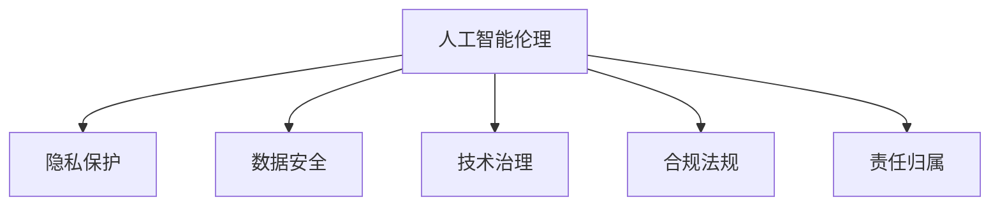

                 

# 人工智能创业：关注伦理和隐私

> 关键词：人工智能伦理,隐私保护,数据安全,技术治理,合规法规,责任归属

## 1. 背景介绍

### 1.1 问题由来
随着人工智能(AI)技术的飞速发展，AI创业企业如雨后春笋般涌现，涵盖自动驾驶、医疗影像分析、智能客服、金融风控等多个领域。然而，随着AI技术商业化的加速，伦理和隐私问题也日益凸显。近年的众多热点事件，如人脸识别技术被用于违法抓拍、个人隐私被侵犯、AI决策出现偏见等，使得伦理和隐私问题成为AI创业过程中不得不面对的重要挑战。

### 1.2 问题核心关键点
AI创业企业面临的主要伦理和隐私问题包括：
- **数据隐私**：如何合法合规地收集、使用和保护用户数据，防止数据泄露和滥用。
- **算法透明性**：确保算法的决策过程可解释，避免"黑盒"模型带来的误解和不公。
- **责任归属**：当AI系统出现错误或产生不良影响时，如何界定责任方，包括算法设计者、开发者、使用者等。
- **安全性与可靠性**：保证AI系统的安全性，防止攻击和滥用；同时确保算法的鲁棒性和可靠性，避免偏见和歧视。
- **伦理合规**：遵守各类行业规范和法律法规，如GDPR、CCPA、ISO/IEC 27001等，确保合规经营。

这些问题涉及多学科知识的交叉，涵盖法律、伦理、心理学、数据科学等多个领域，对AI创业企业的技术、管理和运营提出了全方位的要求。

### 1.3 问题研究意义
在AI创业的浪潮中，伦理和隐私问题已成为企业生存和发展的重要考量因素。合理处理这些问题，不仅可以规避法律风险，提升用户信任，还能为企业带来竞争优势和可持续发展。

1. **合法合规**：遵守伦理和隐私法规，是AI企业必须遵守的基本准则，避免因违反法律法规带来的高额罚款和信誉损失。
2. **用户信任**：保护用户隐私，增强算法透明度，可以增强用户对AI系统的信任，促进产品的商业化推广。
3. **品牌形象**：强调伦理和隐私保护，可以树立企业形象，增强市场竞争力。
4. **技术创新**：通过探索解决伦理和隐私问题的技术手段，推动AI技术的发展，提升系统性能。
5. **社会责任**：AI创业企业作为社会成员，应主动承担社会责任，推动技术公正公平应用。

## 2. 核心概念与联系

### 2.1 核心概念概述

为更好地理解AI创业中的伦理和隐私问题，本节将介绍几个核心概念及其相互关系：

- **人工智能伦理(AI Ethics)**：关注AI技术应用中的道德、法律和社会问题，确保AI系统的决策和行为符合伦理标准。
- **隐私保护(Privacy Protection)**：通过技术和管理手段，保护个人和组织的隐私信息不被未授权访问和滥用。
- **数据安全(Data Security)**：防范数据在收集、存储、传输和处理过程中的安全风险，确保数据不被未授权访问和篡改。
- **技术治理(Technical Governance)**：通过制定和管理技术标准，确保AI系统的安全、可靠和合规性，提升企业的技术管理水平。
- **合规法规(Regulation Compliance)**：遵循各类行业规范和法律法规，如GDPR、CCPA、ISO/IEC 27001等，确保企业的合法合规经营。
- **责任归属(Responsibility Attribution)**：当AI系统出现错误或不良影响时，界定各方责任，明确算法设计者、开发者和使用者之间的关系。

这些概念之间的关系可以通过以下Mermaid流程图来展示：



这个流程图展示了一系列核心概念之间的逻辑关系：

1. 人工智能伦理关注的是AI系统的道德、法律和社会影响。
2. 隐私保护和技术治理是确保数据安全的重要手段。
3. 合规法规为AI企业的合法合规经营提供了法律保障。
4. 责任归属是处理AI系统错误或不良影响的法律依据。

## 3. 核心算法原理 & 具体操作步骤

### 3.1 算法原理概述

AI创业企业在处理伦理和隐私问题时，需要从多个层面进行考虑。核心算法原理和技术步骤包括：

1. **数据收集与隐私保护**：
   - 采用匿名化、去标识化技术，防止个人数据被滥用。
   - 在数据收集过程中，明确告知用户数据用途，获取用户同意。
   - 使用差分隐私技术，对敏感数据进行噪声干扰，保护用户隐私。

2. **算法设计和透明性**：
   - 引入可解释AI技术，确保算法决策过程透明，便于用户理解和监督。
   - 设计公平性算法，避免算法偏见，确保系统公平。
   - 使用对抗训练技术，提升算法的鲁棒性，防止攻击和滥用。

3. **数据存储与访问控制**：
   - 采用加密存储技术，防止数据在存储过程中的泄露。
   - 实行严格的访问控制，仅授权人员和系统访问敏感数据。
   - 定期对数据访问日志进行审计，确保数据安全。

4. **合规性与责任归属**：
   - 遵循GDPR、CCPA等法律法规，确保数据处理合法合规。
   - 明确算法设计者、开发者、使用者的责任边界，制定责任归属机制。
   - 定期进行合规审计，发现问题及时纠正。

### 3.2 算法步骤详解

基于上述核心算法原理，AI创业企业在处理伦理和隐私问题时，可以遵循以下详细步骤：

**Step 1: 数据隐私评估**
- 对数据收集和使用流程进行全面评估，识别潜在隐私风险。
- 采用差分隐私等技术，对敏感数据进行噪声干扰，保护用户隐私。

**Step 2: 算法设计**
- 引入可解释AI技术，如LIME、SHAP等，确保算法决策透明。
- 设计公平性算法，如Adversarial De-biasing等，避免算法偏见。
- 使用对抗训练等技术，提升算法鲁棒性。

**Step 3: 数据存储与访问控制**
- 采用加密存储技术，确保数据在存储过程中的安全性。
- 实行严格的访问控制，确保只有授权人员和系统才能访问敏感数据。
- 定期审计数据访问日志，确保数据安全。

**Step 4: 合规与责任归属**
- 遵循GDPR、CCPA等法律法规，确保数据处理合法合规。
- 明确算法设计者、开发者、使用者的责任边界，制定责任归属机制。
- 定期进行合规审计，发现问题及时纠正。

### 3.3 算法优缺点

处理AI创业中的伦理和隐私问题，存在以下优缺点：

**优点：**
1. **提升用户信任**：通过保护用户隐私，增强算法透明性，可以提升用户对AI系统的信任，促进产品推广。
2. **降低法律风险**：遵循法律法规，合法合规经营，避免因违规带来的高额罚款和信誉损失。
3. **增强品牌形象**：强调伦理和隐私保护，树立企业形象，增强市场竞争力。
4. **推动技术创新**：通过探索解决伦理和隐私问题的技术手段，推动AI技术的发展，提升系统性能。

**缺点：**
1. **实施复杂**：涉及技术和管理多个方面，实施复杂，成本较高。
2. **数据获取困难**：部分隐私保护技术依赖于数据的匿名化处理，数据获取难度较大。
3. **技术开发成本高**：引入可解释AI、公平性算法、对抗训练等技术，需要较高的技术开发成本。

### 3.4 算法应用领域

AI创业企业在多个领域都需面对伦理和隐私问题，以下是几个典型的应用场景：

1. **医疗健康**：
   - **隐私保护**：保护患者隐私，确保医疗数据安全。
   - **合规法规**：遵守HIPAA、GDPR等医疗行业规范和隐私法规。
   - **伦理考虑**：确保AI诊断和治疗方案符合伦理标准，避免偏见和歧视。

2. **金融风控**：
   - **数据安全**：保护客户数据，防止数据泄露和滥用。
   - **公平性算法**：确保风险评估模型公平，避免歧视性偏见。
   - **合规法规**：遵循CCPA、ISO/IEC 27001等金融行业规范和隐私法规。

3. **智能客服**：
   - **隐私保护**：保护用户聊天记录，防止数据泄露。
   - **算法透明性**：确保客服机器人回答透明，便于用户监督。
   - **合规法规**：遵循GDPR等隐私法规，确保用户数据合法使用。

4. **自动驾驶**：
   - **数据安全**：保护车辆数据，防止数据泄露和篡改。
   - **伦理考虑**：确保自动驾驶系统安全可靠，避免因误判导致的交通事故。
   - **责任归属**：界定系统设计者、开发者、使用者的责任边界，制定责任归属机制。

以上应用场景展示了AI创业企业在不同领域面临的伦理和隐私问题，不同行业需根据具体情况进行定制化处理。

## 4. 数学模型和公式 & 详细讲解  
### 4.1 数学模型构建

以下是几个与AI伦理和隐私保护相关的数学模型及其应用：

1. **差分隐私**：
   - **定义**：差分隐私通过在数据集中加入噪声，确保在任意数据集上的统计结果差异不大，从而保护用户隐私。
   - **公式**：对于函数 $f$ 和任意相邻数据集 $D$ 和 $D'$，如果满足 $\forall x \in \text{Dom}(f), |Pr[f(D) = x] - Pr[f(D') = x]| \leq \epsilon$，则称 $f$ 为 $(\epsilon, \delta)$ 差分隐私算法。

2. **公平性算法**：
   - **定义**：公平性算法通过调整模型参数，确保模型在处理不同数据集时公平性不会降低，避免算法偏见。
   - **公式**：对于分类任务，设 $C$ 为类别集，$P(Y|X,X')$ 为在 $X$ 和 $X'$ 数据集上的条件概率，$P(Y|X,X')$ 为在 $X$ 和 $X'$ 数据集上的条件概率，则公平性算法需满足 $\forall C, P(Y|X,X') \leq \max(P(Y|X),P(Y|X'))$。

3. **对抗训练**：
   - **定义**：对抗训练通过在模型输入中添加对抗噪声，提升模型对攻击的鲁棒性，防止攻击和滥用。
   - **公式**：对于输入 $x$，对抗训练的公式为 $x' = x + \delta$，其中 $\delta$ 为对抗噪声。

### 4.2 公式推导过程

以下是差分隐私和公平性算法公式的推导过程：

**差分隐私推导**：
- **差分隐私定义**：差分隐私通过在数据集中加入噪声，使得任意两个相邻数据集上的统计结果差异不大。
- **公式推导**：
$$
\forall x \in \text{Dom}(f), |Pr[f(D) = x] - Pr[f(D') = x]| \leq \epsilon
$$
其中，$\epsilon$ 为隐私预算，控制噪声的强度。差分隐私的实际应用中，通常采用拉普拉斯噪声、高斯噪声等方法加入噪声，确保隐私保护。

**公平性算法推导**：
- **公平性定义**：公平性算法通过调整模型参数，确保模型在处理不同数据集时公平性不会降低。
- **公式推导**：
$$
\forall C, P(Y|X,X') \leq \max(P(Y|X),P(Y|X'))
$$
其中，$C$ 为类别集，$P(Y|X,X')$ 为在 $X$ 和 $X'$ 数据集上的条件概率。公平性算法的目标是确保模型对不同类别输出概率的差异最小，避免算法偏见。

## 5. 项目实践：代码实例和详细解释说明
### 5.1 开发环境搭建

在进行AI创业中的伦理和隐私处理实践前，我们需要准备好开发环境。以下是使用Python进行TensorFlow开发的环境配置流程：

1. 安装Anaconda：从官网下载并安装Anaconda，用于创建独立的Python环境。

2. 创建并激活虚拟环境：
```bash
conda create -n tf-env python=3.8 
conda activate tf-env
```

3. 安装TensorFlow：根据CUDA版本，从官网获取对应的安装命令。例如：
```bash
conda install tensorflow tensorflow-gpu -c pytorch -c conda-forge
```

4. 安装Keras：
```bash
pip install keras
```

5. 安装各类工具包：
```bash
pip install numpy pandas scikit-learn matplotlib tqdm jupyter notebook ipython
```

完成上述步骤后，即可在`tf-env`环境中开始实践。

### 5.2 源代码详细实现

这里我们以差分隐私的实现为例，给出使用TensorFlow进行差分隐私处理的PyTorch代码实现。

首先，定义差分隐私函数：

```python
import tensorflow as tf

def differential_privacy(f, epsilon, delta):
    """
    实现差分隐私算法
    :param f: 待处理函数
    :param epsilon: 隐私预算
    :param delta: 失败概率
    :return: 差分隐私处理后的结果
    """
    # 获取输入数据形状和类型
    input_shape = tf.shape(input)
    input_dtype = tf.dtypes.as_dtype(input.dtype)

    # 定义噪声分布
    noise_dtype = tf.float32
    noise_shape = input_shape
    noise = tf.random.normal(shape=noise_shape, mean=0.0, stddev=epsilon / 2.0, dtype=noise_dtype)

    # 加入噪声
    output = tf.cast(f(input + noise), input_dtype)

    # 计算概率差
    prob_diff = tf.reduce_max(tf.abs(tf.math.reduce_mean(output) - tf.math.reduce_mean(input)))

    # 判断是否满足隐私预算
    if prob_diff <= epsilon:
        return output
    else:
        raise Exception("隐私预算超限")

# 测试差分隐私函数
def test_differential_privacy():
    # 定义简单函数
    def simple_function(x):
        return tf.reduce_mean(x)

    # 创建输入数据
    input_data = tf.constant([[1, 2, 3], [4, 5, 6]], dtype=tf.float32)

    # 应用差分隐私
    epsilon = 0.1
    delta = 0.1
    output = differential_privacy(simple_function, epsilon, delta)

    # 输出结果
    print("原始数据:", tf.reduce_mean(input_data))
    print("差分隐私处理后:", tf.reduce_mean(output))

test_differential_privacy()
```

以上代码实现了简单的差分隐私算法，通过在输入数据中加入噪声，确保统计结果差异不大，保护用户隐私。

### 5.3 代码解读与分析

让我们再详细解读一下关键代码的实现细节：

**differential_privacy函数**：
- `input` 为待处理数据。
- 首先获取输入数据的形状和类型，定义噪声分布，并加入噪声。
- 计算加入噪声后的统计结果与原始数据的概率差，判断是否满足隐私预算。
- 如果满足隐私预算，则返回差分隐私处理后的结果，否则抛出异常。

**简单函数simple_function**：
- `simple_function` 为待差分隐私化的简单函数，实现对一个列表的平均计算。
- 使用TensorFlow的`tf.reduce_mean`函数实现列表平均计算。

**测试代码test_differential_privacy**：
- `input_data` 为测试数据，使用TensorFlow的`tf.constant`函数定义。
- `epsilon` 和 `delta` 为隐私预算，定义差分隐私算法参数。
- 调用`differential_privacy`函数，进行差分隐私处理。
- 输出原始数据和差分隐私处理后的结果，通过对比验证差分隐私算法的正确性。

可以看到，差分隐私算法的实现相对简单，但在实际应用中需根据具体情况调整隐私预算，确保隐私保护的同时，不显著影响统计结果的准确性。

## 6. 实际应用场景
### 6.1 智能客服系统

在智能客服系统中，隐私保护和算法透明性尤为重要。系统需保护用户聊天记录，防止数据泄露。同时，客服机器人需通过公开的API和算法，向用户展示推理过程，增加用户信任。

具体实现时，可以设计透明的客服机器人架构，将算法模型和推理过程封装为API，通过用户接口展示算法决策依据。同时，引入差分隐私技术，对用户聊天记录进行匿名化处理，防止数据泄露。

### 6.2 医疗影像分析

医疗影像分析涉及大量患者数据，隐私保护尤为关键。系统需确保患者数据在存储和处理过程中的安全，避免数据泄露和滥用。

在具体实现中，可以采用加密存储技术，将患者数据加密存储，确保数据在传输和存储过程中的安全性。同时，遵循GDPR等医疗行业规范和隐私法规，确保数据处理合法合规。

### 6.3 自动驾驶

自动驾驶系统涉及大量车辆数据，隐私保护和安全可靠尤为重要。系统需确保车辆数据在传输和存储过程中的安全，防止数据泄露和篡改。

具体实现时，可以采用加密存储技术，将车辆数据加密存储，确保数据在传输和存储过程中的安全性。同时，引入差分隐私技术，对车辆数据进行噪声干扰，保护用户隐私。

## 7. 工具和资源推荐
### 7.1 学习资源推荐

为了帮助开发者系统掌握AI创业中的伦理和隐私问题，这里推荐一些优质的学习资源：

1. **《人工智能伦理与隐私保护》系列博文**：由大模型技术专家撰写，深入浅出地介绍了人工智能伦理与隐私保护的基本概念和前沿技术。

2. **CS229《机器学习》课程**：斯坦福大学开设的机器学习明星课程，涵盖机器学习基础和前沿算法，是理解AI伦理和隐私保护的重要基础。

3. **《人工智能：一种现代的方法》书籍**：人工智能领域经典教材，全面介绍了人工智能的发展历程、伦理问题和隐私保护技术。

4. **AI伦理与隐私保护社区**：汇聚了国内外专家学者，定期发布相关论文和研究报告，是了解最新技术进展和前沿动态的好去处。

通过对这些资源的学习实践，相信你一定能够快速掌握AI创业中的伦理和隐私问题，并用于解决实际的AI应用问题。

### 7.2 开发工具推荐

高效的开发离不开优秀的工具支持。以下是几款用于AI创业中伦理和隐私处理开发的常用工具：

1. TensorFlow：基于Python的开源深度学习框架，灵活动态的计算图，适合快速迭代研究。广泛应用于AI创业中的数据处理和模型训练。

2. PyTorch：基于Python的开源深度学习框架，灵活的动态图设计，适合高效开发和部署。广泛应用于AI创业中的算法设计和模型优化。

3. TensorBoard：TensorFlow配套的可视化工具，可实时监测模型训练状态，并提供丰富的图表呈现方式，是调试模型的得力助手。

4. Weights & Biases：模型训练的实验跟踪工具，可以记录和可视化模型训练过程中的各项指标，方便对比和调优。

5. Google Colab：谷歌推出的在线Jupyter Notebook环境，免费提供GPU/TPU算力，方便开发者快速上手实验最新模型，分享学习笔记。

合理利用这些工具，可以显著提升AI创业中伦理和隐私处理的开发效率，加快创新迭代的步伐。

### 7.3 相关论文推荐

AI创业中的伦理和隐私问题涉及多学科知识的交叉，以下是几篇奠基性的相关论文，推荐阅读：

1. **《保护隐私的差分隐私算法》**：介绍差分隐私的基本概念和常用算法，是隐私保护领域的重要基础。

2. **《公平性算法综述》**：综述了公平性算法的研究进展和应用场景，是理解算法公平性的重要参考。

3. **《对抗训练与神经网络的安全性》**：探讨对抗训练在提升模型鲁棒性和安全性方面的作用，是理解对抗训练的重要理论基础。

这些论文代表了大模型微调技术的发展脉络。通过学习这些前沿成果，可以帮助研究者把握学科前进方向，激发更多的创新灵感。

## 8. 总结：未来发展趋势与挑战

### 8.1 总结

本文对AI创业中的伦理和隐私问题进行了全面系统的介绍。首先阐述了AI创业企业在处理伦理和隐私问题时面临的挑战和重要性，明确了隐私保护、算法透明性、责任归属等关键概念。其次，从原理到实践，详细讲解了差分隐私、公平性算法、对抗训练等核心技术，给出了代码实现实例。同时，本文还探讨了隐私保护和算法透明性在智能客服、医疗影像分析、自动驾驶等多个领域的实际应用，展示了伦理和隐私保护在AI创业中的重要价值。

通过本文的系统梳理，可以看到，AI创业企业在处理伦理和隐私问题时，需从数据隐私、算法透明性、责任归属等多个层面进行综合考虑，确保AI系统的合法合规和用户信任。未来，伴随AI技术的不断发展，伦理和隐私保护将成为AI创业过程中不可或缺的重要组成部分，推动AI技术走向更加安全、公正、公平的方向。

### 8.2 未来发展趋势

展望未来，AI创业中的伦理和隐私保护将呈现以下几个发展趋势：

1. **隐私保护技术的发展**：随着差分隐私、联邦学习等隐私保护技术的进步，未来的AI系统将能够更好地保护用户数据隐私，确保数据安全。
2. **算法透明性的提升**：引入更多的可解释AI技术，确保AI系统的决策过程透明，便于用户理解和监督。
3. **责任归属的明确**：通过立法和行业规范，进一步明确算法设计者、开发者、使用者的责任边界，确保系统安全和可靠。
4. **跨领域应用的推广**：隐私保护和算法透明性将不仅应用于单个领域，而是在更广泛的跨领域应用中得到推广，提升AI系统的普适性和安全性。
5. **法规标准的完善**：各国政府和企业将逐步完善隐私保护和算法透明性的法律法规和标准，为AI创业企业提供更清晰的指导和保障。

以上趋势凸显了AI创业中伦理和隐私保护的重要价值，也为企业技术创新和合规经营提供了方向指引。

### 8.3 面临的挑战

尽管AI创业企业在处理伦理和隐私问题上取得了一定的进展，但仍面临诸多挑战：

1. **数据获取难度**：部分隐私保护技术依赖于数据的匿名化处理，数据获取难度较大，导致算法效果受限。
2. **技术开发成本高**：引入差分隐私、公平性算法等技术，需要较高的技术开发成本，增加了企业负担。
3. **合规风险**：各国法律法规不断更新，企业需持续关注并遵循新的合规要求，避免违规风险。
4. **用户隐私保护与数据利用冲突**：如何平衡用户隐私保护和数据利用，提升AI系统的性能，仍是企业需要解决的重要问题。
5. **跨领域应用的复杂性**：不同领域的应用场景和要求各不相同，隐私保护和算法透明性需进行定制化处理，增加了实施难度。

面对这些挑战，AI创业企业需要持续关注技术进步和政策变化，不断探索和优化解决方案，确保系统的合规性和用户信任。

### 8.4 研究展望

未来，在AI创业中，伦理和隐私保护的研究方向将更加广泛和深入。以下是几个研究热点：

1. **差分隐私的优化**：研究更高效的差分隐私算法，降低隐私预算对统计结果的影响，提升隐私保护的实用性。
2. **公平性算法的改进**：探索更公平的算法模型，避免算法偏见，确保系统决策的公正性。
3. **对抗训练的增强**：研究更鲁棒的对抗训练方法，提升模型的安全性，防止攻击和滥用。
4. **跨领域应用的推广**：推动隐私保护和算法透明性在跨领域应用中的普及，提升AI系统的普适性。
5. **法规标准的完善**：推动各国政府和企业完善隐私保护和算法透明性的法律法规和标准，提供更清晰的指导和保障。

这些研究方向将进一步推动AI创业企业在伦理和隐私保护方面的技术进步和合规经营，为构建更加安全、公正、公平的AI系统提供新的思路和方法。

## 9. 附录：常见问题与解答

**Q1：AI创业企业如何保护用户隐私？**

A: AI创业企业可以通过以下方式保护用户隐私：
1. 采用差分隐私技术，对敏感数据进行噪声干扰，保护用户隐私。
2. 遵循GDPR、CCPA等法律法规，确保数据处理合法合规。
3. 采用加密存储技术，保护数据在存储过程中的安全性。

**Q2：AI创业企业如何进行算法透明性设计？**

A: AI创业企业可以通过以下方式进行算法透明性设计：
1. 引入可解释AI技术，如LIME、SHAP等，确保算法决策过程透明，便于用户理解和监督。
2. 设计公平性算法，避免算法偏见，确保系统公平。
3. 使用对抗训练等技术，提升算法鲁棒性，防止攻击和滥用。

**Q3：AI创业企业如何界定责任归属？**

A: AI创业企业可以通过以下方式界定责任归属：
1. 在算法设计和开发阶段，明确设计者、开发者、使用者的责任边界。
2. 建立责任归属机制，当AI系统出现错误或不良影响时，明确责任方。
3. 定期进行合规审计，发现问题及时纠正。

这些问题的答案展示了AI创业企业在处理伦理和隐私问题时需采取的多方面措施，确保系统的合法合规和用户信任。

---

作者：禅与计算机程序设计艺术 / Zen and the Art of Computer Programming

