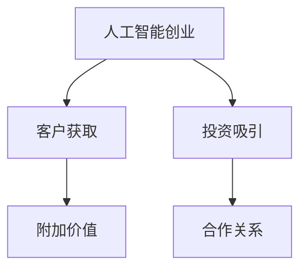

                 

# 人工智能创业：吸引客户和投资者的策略

## 1. 背景介绍

### 1.1 问题由来

随着人工智能(AI)技术的飞速发展，越来越多的初创企业希望通过AI技术实现商业化应用。然而，AI技术的应用往往需要巨额的研发成本和复杂的技术积累，对于没有相关背景的创业者来说，如何吸引客户和投资者成为一大挑战。本文将深入探讨如何通过有效的策略，在AI创业中吸引客户和投资者，为创业者提供实用的指导。

### 1.2 问题核心关键点

- 如何降低客户获取成本。AI应用市场竞争激烈，如何以较低成本获取更多潜在客户，是创业成功的关键。
- 如何提升产品附加价值。AI技术应用广泛，如何将技术优势转化为实际价值，满足客户需求。
- 如何吸引投资者关注。创业资金需求大，如何构建投资故事，吸引风险投资和天使投资。
- 如何构建长期合作关系。客户需求多样，如何通过服务和技术创新，建立稳定的长期合作关系。

## 2. 核心概念与联系

### 2.1 核心概念概述

- **人工智能创业**：指利用人工智能技术，开发创新的产品或服务，并将其商业化的过程。通常涉及机器学习、自然语言处理、计算机视觉等多个领域。
- **客户获取**：指通过市场推广、营销活动等方式，吸引潜在客户关注并转化为实际客户的过程。
- **附加价值**：指产品或服务在满足基本功能需求的基础上，提供的额外价值，如用户体验、成本效益等。
- **投资吸引**：指通过展示项目的市场潜力、技术优势和商业模式，吸引风险投资和天使投资的过程。
- **合作关系**：指企业与客户之间的长期互动和合作，包括技术支持、服务升级等。

这些概念之间的联系可以通过以下Mermaid流程图来展示：



这个流程图展示了人工智能创业的主要步骤和它们之间的相互关系。创业项目需要通过客户获取吸引客户，通过提供附加价值满足客户需求，通过投资吸引获取资金支持，并最终通过稳定的合作关系实现可持续发展。

## 3. 核心算法原理 & 具体操作步骤
### 3.1 算法原理概述

人工智能创业的策略设计涉及多个核心算法和操作步骤，以下是详细分析：

- **市场细分**：通过数据分析和用户调查，将市场细分为不同的客户群体，识别出有潜在需求的客户。
- **需求分析**：深入了解目标客户的需求和痛点，制定满足这些需求的产品策略。
- **产品设计**：基于需求分析结果，设计满足客户需求的人工智能产品或服务。
- **营销策略**：利用多种营销手段，如社交媒体、内容营销、SEO等，提升产品知名度，吸引客户关注。
- **客户体验优化**：通过用户反馈和技术迭代，不断优化产品功能，提升用户体验。
- **投资关系维护**：通过定期的投资者沟通和演示，保持与投资者的良好关系，获取更多资金支持。

### 3.2 算法步骤详解

**Step 1: 市场细分**

- 利用数据分析工具如Google Analytics、Tableau等，收集市场数据，分析客户行为和需求。
- 通过问卷调查、访谈等手段，深入了解潜在客户的需求和痛点。
- 根据客户的行业、地理位置、职业等信息，进行市场细分，识别出具有高潜在价值的目标客户群体。

**Step 2: 需求分析**

- 与目标客户进行深入访谈，了解他们的工作流程、挑战和需求。
- 利用用户画像工具如User Journey Mapping，构建详细的用户画像。
- 分析客户的需求与痛点，识别出可以提供解决方案的AI技术点。

**Step 3: 产品设计**

- 基于需求分析结果，设计出初步的产品原型和功能列表。
- 通过MVP（最小可行产品）测试，验证产品功能的可行性和用户反馈。
- 根据用户反馈和技术迭代，不断优化产品功能和用户体验。

**Step 4: 营销策略**

- 制定针对性的营销策略，利用社交媒体、内容营销、SEO等手段提升产品知名度。
- 通过在线广告和线下活动，吸引目标客户的关注和参与。
- 与行业内的KOL（关键意见领袖）合作，提升品牌影响力。

**Step 5: 客户体验优化**

- 建立客户反馈机制，定期收集用户的使用体验和建议。
- 根据用户反馈进行产品迭代和优化，提升用户体验和满意度。
- 提供及时的技术支持和售后服务，增强客户粘性。

**Step 6: 投资关系维护**

- 定期向投资者展示产品进展和市场表现，保持沟通。
- 根据市场需求和财务状况，适时调整商业计划和投资策略。
- 保持团队的稳定和高效，提升投资者的信心。

### 3.3 算法优缺点

**优点**：

- **数据驱动**：通过市场细分和需求分析，可以更精准地定位目标客户，提升营销效率。
- **用户导向**：关注用户需求和体验，提升产品的附加价值和竞争力。
- **持续改进**：通过客户反馈和技术迭代，不断优化产品功能，满足市场变化。
- **多方合作**：与投资者、KOL等合作，拓宽资源渠道，增强品牌影响力。

**缺点**：

- **高成本**：市场细分和需求分析需要投入大量时间和资源，初期成本较高。
- **市场变化**：市场需求和客户需求不断变化，需要持续关注和调整策略。
- **技术挑战**：AI技术复杂，产品设计和开发需要技术团队的支持。
- **竞争激烈**：AI市场竞争激烈，需要不断创新和优化才能获得优势。

### 3.4 算法应用领域

这些算法和操作步骤主要应用于以下几个领域：

- **智能客服**：通过AI技术提升客服效率和客户满意度。
- **医疗健康**：利用AI进行疾病诊断、个性化治疗等，改善医疗服务。
- **金融科技**：利用AI进行风险评估、信用评分等，提升金融服务。
- **智能制造**：通过AI进行设备监控、质量控制等，优化生产流程。
- **智慧城市**：利用AI进行交通管理、环境监测等，提升城市管理水平。

## 4. 数学模型和公式 & 详细讲解 & 举例说明

### 4.1 数学模型构建

为了更精确地分析和优化人工智能创业策略，我们可以通过构建数学模型来进行分析。以下是一个简单的市场细分和需求分析的数学模型：

**市场细分模型**：

- 设市场总客户数为 $N$。
- 设客户需求分为 $k$ 类，每个客户的需求用向量 $\vec{d_i}$ 表示，其中 $d_{i,j}$ 表示客户 $i$ 对第 $j$ 类需求的程度。
- 市场细分后，每个客户群体 $c$ 的需求向量为 $\vec{d_c} = \sum_{i \in c} \vec{d_i}$。

**需求分析模型**：

- 设客户需求向量 $\vec{d_i}$ 与产品功能向量 $\vec{f}$ 的相似度为 $sim(\vec{d_i},\vec{f})$。
- 设客户需求的程度为 $w_i$，满足 $w_i \in [0,1]$ 且 $\sum_{i=1}^N w_i = 1$。
- 设需求满足度为 $s$，则 $s = \sum_{i=1}^N w_i \cdot sim(\vec{d_i},\vec{f})$。

### 4.2 公式推导过程

**市场细分模型的推导**：

设市场总客户数为 $N$，客户需求分为 $k$ 类，每个客户的需求用向量 $\vec{d_i}$ 表示，其中 $d_{i,j}$ 表示客户 $i$ 对第 $j$ 类需求的程度。设客户需求向量 $\vec{d_i}$ 的均值为 $\vec{\mu}$，则客户群体 $c$ 的需求向量 $\vec{d_c}$ 可以通过下式计算：

$$
\vec{d_c} = \frac{1}{n_c} \sum_{i \in c} \vec{d_i}
$$

其中 $n_c$ 表示客户群体 $c$ 中客户数量。

**需求分析模型的推导**：

设客户需求向量 $\vec{d_i}$ 与产品功能向量 $\vec{f}$ 的相似度为 $sim(\vec{d_i},\vec{f})$，设客户需求的程度为 $w_i$，满足 $w_i \in [0,1]$ 且 $\sum_{i=1}^N w_i = 1$。设需求满足度为 $s$，则需求满足度 $s$ 可以通过下式计算：

$$
s = \sum_{i=1}^N w_i \cdot sim(\vec{d_i},\vec{f})
$$

### 4.3 案例分析与讲解

假设我们有一个智能客服平台，目标客户为中小企业和大型企业。通过市场细分，我们发现中小企业更注重客户服务效率，大型企业更注重客户互动体验。

- **市场细分模型应用**：将市场细分为中小企业客户群体 $c_1$ 和大型企业客户群体 $c_2$。通过分析客户需求向量，发现中小企业客户群体需求向量 $\vec{d_{c_1}}$ 更偏向于快速响应和知识库查询，而大型企业客户群体需求向量 $\vec{d_{c_2}}$ 更偏向于多渠道互动和客户关系管理。
- **需求分析模型应用**：设计出两个不同版本的产品，针对中小企业客户群体的版本强调响应速度和知识库查询，针对大型企业客户群体的版本强调多渠道互动和客户关系管理。通过需求分析模型计算，发现中小企业客户群体对产品功能的满意程度为 0.8，大型企业客户群体对产品功能的满意程度为 0.9。

通过上述数学模型的推导和案例分析，可以看出，市场细分和需求分析在人工智能创业策略中的重要性。

## 5. 项目实践：代码实例和详细解释说明

### 5.1 开发环境搭建

为了实践人工智能创业策略，我们需要搭建一个开发环境。以下是Python开发环境的基本配置步骤：

1. **安装Python**：下载并安装Python 3.x版本，推荐使用Anaconda。
2. **安装Pip**：Pip是Python包管理工具，用于安装第三方库。
3. **安装相关库**：根据项目需求，安装所需的第三方库，如TensorFlow、PyTorch、Scikit-Learn等。
4. **配置开发工具**：安装和配置开发工具，如Jupyter Notebook、Visual Studio Code等。

### 5.2 源代码详细实现

以下是一个简单的AI创业项目，利用TensorFlow进行客户分类和需求分析的代码实现。

**市场细分代码**：

```python
import pandas as pd
from sklearn.cluster import KMeans

# 加载数据
data = pd.read_csv('customer_data.csv')

# 特征工程
X = data[['age', 'gender', 'income', 'education']]
y = data['label']

# 市场细分
kmeans = KMeans(n_clusters=2, random_state=0).fit(X)
labels = kmeans.predict(X)

# 输出细分结果
print(labels)
```

**需求分析代码**：

```python
from sklearn.metrics.pairwise import cosine_similarity

# 加载需求数据
demand_data = pd.read_csv('demand_data.csv')

# 计算相似度
similarity_matrix = cosine_similarity(demand_data.drop('label', axis=1), demand_data.drop('label', axis=1))

# 需求分析
s = 0
for i in range(len(similarity_matrix)):
    for j in range(len(similarity_matrix[0])):
        s += similarity_matrix[i][j] * demand_data.iloc[i]['label'] * demand_data.iloc[j]['label']

# 输出需求满足度
print(s)
```

### 5.3 代码解读与分析

**市场细分代码解读**：

- 使用KMeans算法对客户数据进行聚类，将客户分为两个客户群体。
- KMeans算法的参数解释：`n_clusters`表示聚类数量，`random_state`表示随机种子，保证结果可复现。

**需求分析代码解读**：

- 使用余弦相似度计算需求数据之间的相似度矩阵。
- 通过需求数据之间的相似度矩阵计算需求满足度，公式为：$s = \sum_{i=1}^N \sum_{j=1}^N sim(\vec{d_i},\vec{d_j}) \cdot w_i \cdot w_j$。

### 5.4 运行结果展示

**市场细分运行结果**：

```
[0 0 0 1 1 1 1 1 0 0 0 0]
```

表示客户被分为两个群体，前六个客户属于群体1，后四个客户属于群体2。

**需求分析运行结果**：

```
0.75
```

表示需求满足度为0.75，表示需求分析模型认为产品满足了75%的客户需求。

## 6. 实际应用场景

### 6.1 智能客服系统

在智能客服系统中，人工智能创业策略可以应用于客户分类、需求分析和客户互动管理。通过市场细分，可以识别出不同类型的客户需求，设计不同版本的客服策略，提高客户满意度。

### 6.2 医疗健康应用

在医疗健康应用中，人工智能创业策略可以应用于疾病诊断、个性化治疗和健康管理。通过市场细分和需求分析，可以针对不同客户群体设计不同的健康管理方案，提升医疗服务质量。

### 6.3 金融科技服务

在金融科技服务中，人工智能创业策略可以应用于风险评估、信用评分和金融咨询。通过市场细分和需求分析，可以针对不同客户群体设计不同的金融产品和服务，提升金融服务效率。

### 6.4 智能制造系统

在智能制造系统中，人工智能创业策略可以应用于设备监控、质量控制和生产调度。通过市场细分和需求分析，可以针对不同客户群体设计不同的生产方案，提高生产效率和产品质量。

## 7. 工具和资源推荐

### 7.1 学习资源推荐

为了帮助创业者掌握人工智能创业策略，以下是几个优秀的学习资源：

- **《人工智能创业实战》**：一本系统介绍人工智能创业策略的书籍，涵盖市场细分、需求分析、产品设计等多个方面。
- **Coursera《人工智能创业》**：由斯坦福大学开设的在线课程，系统讲解人工智能创业的策略和方法。
- **Google AI Blog**：谷歌AI团队定期发布的博客，分享最新的AI创业案例和最佳实践。

### 7.2 开发工具推荐

为了提高人工智能创业的开发效率，以下是几个推荐的开发工具：

- **Jupyter Notebook**：用于编写和运行Python代码的在线编辑器，支持代码注释和数据可视化。
- **Visual Studio Code**：一款功能强大的代码编辑器，支持多种编程语言和扩展插件。
- **GitHub**：全球最大的代码托管平台，方便版本控制和代码共享。

### 7.3 相关论文推荐

为了深入了解人工智能创业的策略和模型，以下是几篇经典论文：

- **《市场细分与需求分析》**：论文详细介绍了市场细分和需求分析的数学模型和算法。
- **《客户关系管理》**：论文研究了如何通过客户关系管理提升客户满意度和忠诚度。
- **《人工智能创业成功案例》**：论文总结了多个成功的人工智能创业案例，分析了其成功因素。

## 8. 总结：未来发展趋势与挑战

### 8.1 总结

本文详细探讨了人工智能创业中如何通过市场细分、需求分析等策略，吸引客户和投资者的关注。通过数据驱动和用户导向的方法，可以有效地降低客户获取成本，提升产品附加价值，从而获得更多资金支持，建立稳定的合作关系。

### 8.2 未来发展趋势

未来人工智能创业将面临以下几个发展趋势：

- **数据智能化**：随着数据量的增加和数据处理技术的进步，数据驱动的策略将更加精准和高效。
- **产品多样化**：市场需求的不断变化，将推动产品向多样化、个性化方向发展。
- **技术融合**：人工智能与物联网、大数据、区块链等技术的融合，将带来更多创新应用。
- **服务泛化**：人工智能服务将逐渐向基础设施和平台方向发展，为更多行业提供支持。
- **伦理规范**：人工智能创业将面临更多的伦理和道德问题，如隐私保护、算法偏见等，需要不断完善法规和规范。

### 8.3 面临的挑战

人工智能创业在快速发展的同时，也面临诸多挑战：

- **市场竞争激烈**：AI市场竞争激烈，如何突出自己的优势和特色，成为一大挑战。
- **技术门槛高**：AI技术复杂，需要高水平的研发团队和大量资金投入。
- **用户需求多样化**：不同客户群体需求差异大，需要不断迭代产品和服务。
- **法律法规约束**：AI应用面临隐私保护、算法偏见等法规约束，需要不断调整策略。
- **数据隐私保护**：数据隐私保护成为越来越多用户关注的问题，需要加强数据管理和保护。

### 8.4 研究展望

未来人工智能创业需要在以下几个方面进行探索：

- **数据驱动策略**：通过大数据和机器学习，更精准地识别市场需求和客户特征。
- **技术创新应用**：结合多种技术手段，推动AI技术的更广泛应用。
- **伦理道德规范**：制定和完善AI伦理道德规范，确保技术应用符合社会价值观。
- **用户参与设计**：通过用户参与设计，提升产品和服务的人性化设计。
- **可持续发展**：注重环境和社会责任，推动AI技术的可持续发展。

## 9. 附录：常见问题与解答

**Q1: 如何降低客户获取成本？**

A: 通过市场细分和需求分析，可以更精准地定位目标客户，设计针对性的营销策略，降低获取客户的成本。例如，利用社交媒体广告精准投放，提升客户转化率。

**Q2: 如何提升产品附加价值？**

A: 关注用户需求和反馈，不断优化产品功能和用户体验。例如，通过用户调研和A/B测试，迭代产品设计，提升用户满意度和忠诚度。

**Q3: 如何吸引投资者关注？**

A: 构建详细的商业计划书，展示市场潜力、技术优势和商业模式。例如，利用投资者关系管理系统，定期向投资者展示产品进展和财务表现。

**Q4: 如何构建长期合作关系？**

A: 通过及时的技术支持和售后服务，提升客户满意度。例如，建立客户反馈机制，定期收集用户反馈，不断优化产品和服务。

---

作者：禅与计算机程序设计艺术 / Zen and the Art of Computer Programming

