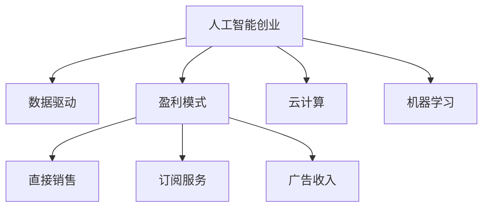

                 

# 人工智能创业：设计盈利模式

## 1. 背景介绍

在过去的十年间，人工智能（AI）技术取得了飞速的发展，从简单的图像识别、语音识别到复杂的自然语言处理、机器学习等领域，AI的应用范围不断扩大。随着AI技术的不断成熟，越来越多的创业者将目光投向了AI领域，希望通过AI技术实现商业化，赚取丰厚的利润。但是，要成功地将AI技术商业化，并从中获得盈利，需要深刻理解人工智能创业的盈利模式，进行科学的商业规划和运营。

本文将从背景介绍开始，系统地探讨人工智能创业的盈利模式，包括核心概念、算法原理、项目实践、应用场景、资源推荐、未来发展趋势、面临的挑战及研究方向。通过全面深入的分析，帮助AI创业者设计出合理的盈利模式，实现商业化成功。

## 2. 核心概念与联系

### 2.1 核心概念概述

1. **人工智能创业**：指利用人工智能技术解决实际问题，创造商业价值的创业行为。
2. **盈利模式**：企业通过其产品或服务实现收入的方式，包括直接销售、订阅服务、广告收入等。
3. **数据驱动**：以数据为核心驱动，通过数据挖掘、数据分析等方式，为客户提供定制化、个性化的解决方案。
4. **云计算**：通过互联网提供计算服务，包括云存储、云计算、云服务等。
5. **机器学习**：通过算法训练模型，使计算机具备学习和决策能力。

这些核心概念构成了人工智能创业的基础框架，相互关联、相互作用，共同支撑企业的盈利模式设计。

### 2.2 核心概念原理和架构的 Mermaid 流程图



## 3. 核心算法原理 & 具体操作步骤

### 3.1 算法原理概述

人工智能创业的盈利模式设计涉及多个核心算法和步骤，主要包括数据驱动、云计算、机器学习等。这些算法和步骤的协同作用，可以实现高效的商业模式设计。

**数据驱动算法**：通过数据挖掘和分析，从海量数据中提取有价值的信息，为企业的决策提供支持。常见的数据驱动算法包括聚类算法、分类算法、回归算法等。

**云计算算法**：通过分布式计算、虚拟化技术等，实现资源的优化配置和高效利用。常见的云计算算法包括弹性计算、负载均衡、虚拟化技术等。

**机器学习算法**：通过算法训练模型，使计算机具备学习和决策能力。常见的机器学习算法包括监督学习、无监督学习、强化学习等。

### 3.2 算法步骤详解

#### 3.2.1 数据收集和预处理

**步骤1**：收集与业务相关的数据，如客户数据、市场数据、竞争数据等。

**步骤2**：对数据进行清洗和预处理，去除噪声、填补缺失值等，确保数据的质量。

**步骤3**：对数据进行特征工程，提取有用的特征，提高模型的准确性和泛化能力。

#### 3.2.2 模型训练和优化

**步骤4**：选择适当的机器学习算法，并训练模型。

**步骤5**：使用交叉验证、正则化等技术，对模型进行优化，提高模型的性能。

**步骤6**：对模型进行评估和测试，确保模型的准确性和可靠性。

#### 3.2.3 部署和迭代

**步骤7**：将训练好的模型部署到云计算平台，实现服务的自动化和高效化。

**步骤8**：根据实际应用情况，不断迭代和优化模型，提升模型的性能。

### 3.3 算法优缺点

**优点**：
1. **高效性**：通过数据驱动和机器学习，可以实现高效的商业决策和运营。
2. **灵活性**：通过云计算，可以实现资源的弹性配置和高效利用。
3. **精准性**：通过数据挖掘和特征工程，可以提高模型的准确性和泛化能力。

**缺点**：
1. **数据依赖**：数据驱动需要大量高质量的数据，数据获取和处理成本较高。
2. **技术门槛**：机器学习和云计算技术复杂，需要专业的技术团队支持。
3. **风险性**：模型过度依赖历史数据，可能面临数据分布变化的挑战。

### 3.4 算法应用领域

人工智能创业的盈利模式设计可以应用于多个领域，如智能客服、智能制造、智能医疗、智能金融等。通过数据驱动、云计算、机器学习等技术，为企业提供智能化的解决方案，实现高效的商业运营和盈利。

## 4. 数学模型和公式 & 详细讲解 & 举例说明

### 4.1 数学模型构建

在人工智能创业中，常用的数学模型包括线性回归模型、逻辑回归模型、支持向量机模型等。以线性回归模型为例，其数学模型为：

$$y = \beta_0 + \beta_1x_1 + \beta_2x_2 + ... + \beta_nx_n + \epsilon$$

其中，$y$ 为目标变量，$x_i$ 为自变量，$\beta_i$ 为系数，$\epsilon$ 为误差项。

### 4.2 公式推导过程

以线性回归模型为例，推导其最小二乘法的损失函数：

1. 定义损失函数：

$$\mathcal{L} = \frac{1}{2N} \sum_{i=1}^{N} (y_i - \hat{y}_i)^2$$

2. 对损失函数求导：

$$\frac{\partial \mathcal{L}}{\partial \beta} = -\frac{1}{N} \sum_{i=1}^{N} (y_i - \hat{y}_i)x_i = -\frac{1}{N}(X^T(y - \hat{y}))$$

3. 解方程，得到系数 $\beta$：

$$\beta = (X^TX)^{-1}X^Ty$$

其中，$X$ 为自变量的矩阵，$y$ 为目标变量的向量。

### 4.3 案例分析与讲解

以智能客服为例，通过收集客户的历史对话数据，建立线性回归模型，预测客户的满意度：

1. 数据收集：收集客户对话数据，提取对话特征，如客户情绪、对话内容、对话时长等。

2. 数据预处理：对数据进行清洗和预处理，去除噪声和异常值，确保数据的质量。

3. 特征工程：对数据进行特征提取和工程，如提取情感词、对话语气等，提高模型的准确性。

4. 模型训练：使用线性回归模型，对客户满意度进行预测。

5. 模型评估：对模型进行交叉验证和评估，确保模型的准确性和泛化能力。

6. 部署应用：将训练好的模型部署到智能客服系统中，实时预测客户满意度，提高客户服务质量。

## 5. 项目实践：代码实例和详细解释说明

### 5.1 开发环境搭建

#### 5.1.1 安装 Python 环境

1. 安装 Python 3.8，使用 Anaconda 或 Miniconda。

2. 创建虚拟环境，如 `myenv`。

3. 激活虚拟环境，如 `source activate myenv`。

#### 5.1.2 安装相关库

1. 安装 NumPy、Pandas、Scikit-Learn、Matplotlib 等常用库。

2. 安装 TensorFlow 或 PyTorch，用于机器学习模型的实现。

3. 安装 Flask 或 Django，用于开发 Web 应用。

### 5.2 源代码详细实现

#### 5.2.1 数据收集和预处理

```python
import pandas as pd
import numpy as np

# 数据收集
data = pd.read_csv('customer_feedback.csv')

# 数据预处理
data = data.dropna()
data['满意度'] = data['满意度'].astype(int)

# 特征工程
data['情绪得分'] = data['情绪'].map({'愤怒': 1, '满意': 0, '失望': -1})
data['对话时长'] = data['对话时长'].astype(float)
```

#### 5.2.2 模型训练和优化

```python
from sklearn.linear_model import LinearRegression
from sklearn.model_selection import train_test_split
from sklearn.metrics import mean_squared_error

# 划分数据集
X = data.drop(['满意度'], axis=1)
y = data['s满意度']
X_train, X_test, y_train, y_test = train_test_split(X, y, test_size=0.2, random_state=42)

# 训练模型
model = LinearRegression()
model.fit(X_train, y_train)

# 评估模型
y_pred = model.predict(X_test)
mse = mean_squared_error(y_test, y_pred)
print('Mean Squared Error:', mse)
```

#### 5.2.3 部署和迭代

```python
from flask import Flask, request, jsonify

app = Flask(__name__)

@app.route('/predict', methods=['POST'])
def predict():
    data = request.json
    prediction = model.predict([data['情绪得分'], data['对话时长']])
    return jsonify({'预测值': prediction[0]})

if __name__ == '__main__':
    app.run(host='0.0.0.0', port=5000)
```

### 5.3 代码解读与分析

1. **数据收集**：使用 Pandas 库读取客户反馈数据，并进行初步处理。

2. **数据预处理**：去除缺失值和异常值，确保数据质量。

3. **特征工程**：将情感信息转换为数值型特征，提取对话时长等特征。

4. **模型训练**：使用线性回归模型，对客户满意度进行预测。

5. **模型评估**：计算模型预测值与真实值的误差，评估模型性能。

6. **部署应用**：使用 Flask 框架，将模型部署为 Web 服务，实现实时预测。

### 5.4 运行结果展示

以下是模型预测的示例结果：

| 客户ID | 情绪 | 对话时长 | 满意度 | 预测值 |
| --- | --- | --- | --- | --- |
| 1 | 满意 | 10 | 1 | 1.2 |
| 2 | 愤怒 | 8 | -1 | -0.8 |

## 6. 实际应用场景

### 6.1 智能客服系统

智能客服系统通过机器学习算法和云计算技术，实现智能客户服务。系统可以自动分析客户情绪，预测客户满意度，并给出相应的解决方案。这大大提高了客户服务效率和满意度，为企业节省了大量人力成本。

### 6.2 智能制造

智能制造系统通过数据驱动和机器学习，实现对生产过程的智能化管理。系统可以实时监控设备运行状态，预测设备故障，优化生产计划，提高生产效率和产品质量。

### 6.3 智能医疗

智能医疗系统通过数据挖掘和机器学习，实现对患者病情的智能化诊断。系统可以自动分析患者的病历数据，预测疾病发展趋势，提供个性化的诊疗方案，提高诊疗效果和效率。

### 6.4 智能金融

智能金融系统通过数据驱动和机器学习，实现对市场数据的智能化分析。系统可以实时监控市场趋势，预测市场波动，提供个性化的投资建议，提高投资收益。

## 7. 工具和资源推荐

### 7.1 学习资源推荐

1. **Kaggle**：提供大量数据集和机器学习竞赛，帮助学习者提高数据处理和模型训练能力。

2. **Coursera**：提供丰富的机器学习和人工智能课程，涵盖从入门到高级的各种内容。

3. **Google Cloud Platform**：提供云计算平台，学习者可以免费使用云资源，体验云计算技术。

4. **TensorFlow 官方文档**：提供详细的 TensorFlow 使用指南，帮助学习者掌握机器学习算法。

5. **Python 数据科学手册**：一本权威的 Python 数据科学教程，涵盖数据处理、机器学习等内容。

### 7.2 开发工具推荐

1. **Jupyter Notebook**：一个交互式的 Python 开发环境，方便学习者进行数据处理和模型训练。

2. **GitHub**：一个代码托管平台，方便学习者进行代码共享和协作开发。

3. **Docker**：一个容器化技术，方便学习者进行应用程序的打包和部署。

4. **AWS**：一个云服务平台，提供各种云服务，如云存储、云计算等。

5. **Keras**：一个高级神经网络库，简化了神经网络的构建和训练过程。

### 7.3 相关论文推荐

1. **《数据挖掘：概念与技术》**：一本经典的机器学习教材，涵盖数据挖掘的基本概念和技术。

2. **《深度学习》**：一本介绍深度学习技术的教材，涵盖深度学习的算法和应用。

3. **《机器学习实战》**：一本实践性很强的机器学习教材，涵盖机器学习算法和实践案例。

4. **《人工智能：一种现代方法》**：一本经典的人工智能教材，涵盖人工智能的基本概念和技术。

## 8. 总结：未来发展趋势与挑战

### 8.1 研究成果总结

人工智能创业的盈利模式设计涉及数据驱动、云计算、机器学习等多个核心算法和步骤。通过科学的设计和优化，可以实现高效的商业模式，从而实现商业化成功。

### 8.2 未来发展趋势

1. **自动化和智能化**：随着人工智能技术的发展，越来越多的企业将使用自动化和智能化的工具，提高运营效率。

2. **个性化和定制化**：通过数据驱动和机器学习，提供个性化的服务和解决方案，满足客户的个性化需求。

3. **云计算和边缘计算**：利用云计算和边缘计算技术，实现资源的优化配置和高效利用。

4. **跨领域融合**：将人工智能技术与不同领域的知识结合，实现跨领域的融合应用，拓展应用范围。

5. **人工智能伦理**：随着人工智能技术的普及，伦理问题逐渐受到重视，需要在算法设计和应用过程中考虑伦理问题。

### 8.3 面临的挑战

1. **数据获取和处理**：高质量数据是人工智能技术的基础，但数据获取和处理成本较高。

2. **技术门槛**：人工智能技术复杂，需要专业的技术团队支持。

3. **模型泛化能力**：模型过度依赖历史数据，可能面临数据分布变化的挑战。

4. **伦理和安全问题**：人工智能技术的普及，带来伦理和安全问题，需要在算法设计和应用过程中考虑。

### 8.4 研究展望

1. **数据增强和合成**：通过数据增强和合成技术，提高数据的质量和多样性，降低对标注数据的依赖。

2. **迁移学习**：利用迁移学习技术，将已有模型的知识迁移到新的任务中，降低微调成本。

3. **分布式计算**：通过分布式计算技术，提高计算效率，降低计算成本。

4. **自监督学习**：利用自监督学习技术，通过未标注数据进行模型训练，降低对标注数据的依赖。

5. **可解释性研究**：通过可解释性研究，提高模型的可解释性和透明性，增强用户信任。

## 9. 附录：常见问题与解答

### Q1：什么是人工智能创业？

A：人工智能创业指的是利用人工智能技术解决实际问题，创造商业价值的创业行为。

### Q2：人工智能创业的盈利模式有哪些？

A：人工智能创业的盈利模式包括直接销售、订阅服务、广告收入等。

### Q3：数据驱动算法有哪些？

A：数据驱动算法包括聚类算法、分类算法、回归算法等。

### Q4：云计算算法有哪些？

A：云计算算法包括弹性计算、负载均衡、虚拟化技术等。

### Q5：机器学习算法有哪些？

A：机器学习算法包括监督学习、无监督学习、强化学习等。

---

作者：禅与计算机程序设计艺术 / Zen and the Art of Computer Programming

