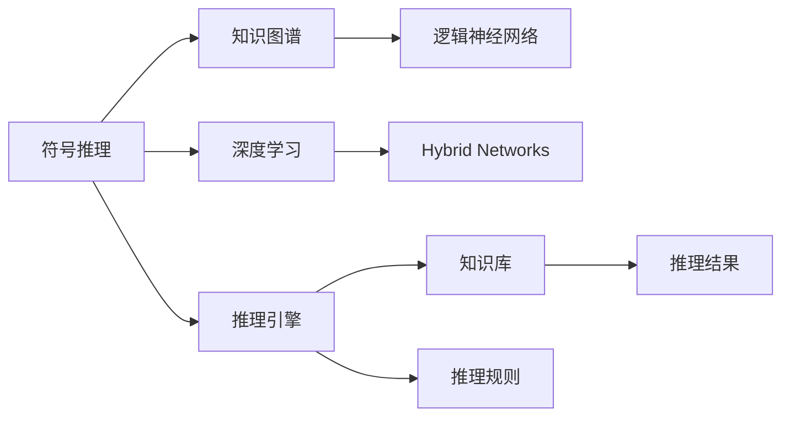

                 

## 1. 背景介绍

### 1.1 问题由来
符号推理（Symbolic Reasoning）一直是人工智能（AI）研究的核心方向之一。传统的符号推理方法，如Prolog、PRIME等，通过构建逻辑规则，对自然语言或符号数据进行逻辑推理，广泛应用于自动规划、知识获取、逻辑思维训练等领域。然而，随着深度学习技术的兴起，符号推理面临着被深度学习范式取代的风险，其主要挑战在于以下几个方面：

- **表示学习与推理分离**：传统的符号推理方法对知识的表示和推理是分离的，难以高效地融合先验知识，导致对复杂问题处理能力有限。
- **知识获取困难**：构建和维护大规模逻辑规则库耗时耗力，且规则库存在错误和漏洞的风险。
- **组合爆炸**：在复杂问题求解时，逻辑规则组合方式多，导致计算复杂度高，难以大规模应用。
- **缺乏自动推导能力**：符号推理依赖手动构建规则，难以自动发现和利用知识间的隐含关联。

为了应对这些挑战，人工智能研究人员开始探索符号推理与深度学习技术的融合，期望结合符号推理的逻辑性和深度学习的表示学习能力，打造出新一代的智能推理系统。

### 1.2 问题核心关键点
符号推理和深度学习融合的核心在于构建一种既能处理符号性知识，又能通过数据自适应学习的推理模型。在实践中，当前最主流的融合方式有以下几种：

- **基于逻辑的深度学习**：将逻辑约束嵌入到深度学习网络中，用于指导神经网络的训练，如Neuro-Symbolic Logic。
- **符号增强的深度学习**：在深度学习模型的基础上，嵌入符号表示层，用于逻辑推理，如Logic Neural Networks。
- **逻辑与深度学习的混合网络**：融合逻辑和深度学习的网络结构，例如Hybrid Networks，通过逻辑门控制深度学习模块的激活。
- **符号与深度学习的信息交互**：使用符号与深度学习的方法，提升推理系统的鲁棒性和泛化能力，例如Symbolic Deep Learning。

本文重点介绍符号推理与深度学习的融合方法，旨在探讨符号推理模型如何通过深度学习技术实现高效的知识推理。

## 2. 核心概念与联系

### 2.1 核心概念概述

- **符号推理**：通过符号表征和逻辑规则对问题进行推理求解，其核心在于知识表示和逻辑推理。常见的符号推理系统包括Prolog、PRIME、AMPL等。

- **深度学习**：一种基于神经网络的学习方式，通过数据驱动的训练过程，从数据中学习到模型参数。深度学习在计算机视觉、自然语言处理等领域表现出色。

- **知识图谱**：以图结构表示实体间关系的知识库，通过逻辑推理和查询操作，为符号推理提供丰富的先验知识。

- **逻辑神经网络**：一种结合神经网络和逻辑推理的混合模型，通过逻辑规则指导神经网络的训练和推理。

- **Hybrid Networks**：结合符号推理和深度学习的网络结构，通过逻辑门控制神经网络的激活，提升推理系统的鲁棒性和泛化能力。

### 2.2 核心概念原理和架构的 Mermaid 流程图



该图展示了符号推理、深度学习、知识图谱、逻辑神经网络以及Hybrid Networks之间的联系。符号推理通过知识图谱获取先验知识，并使用逻辑神经网络和Hybrid Networks提升推理效率和泛化能力。

## 3. 核心算法原理 & 具体操作步骤

### 3.1 算法原理概述

符号推理与深度学习的融合，核心在于构建一种既能处理符号性知识，又能通过数据自适应学习的推理模型。这种模型的主要思想是通过深度学习提取数据中的潜在模式，并使用符号推理对这些模式进行逻辑推理和解释。

具体而言，这种融合模型通常包括以下几个步骤：

1. **数据预处理**：将原始符号或自然语言数据转换为机器可以理解的向量形式。
2. **特征提取**：使用深度学习模型提取数据的特征表示。
3. **符号推理**：通过逻辑神经网络或Hybrid Networks对提取的特征进行符号推理。
4. **知识更新**：根据推理结果，更新知识图谱中的先验知识，使其更加准确。
5. **结果解释**：将推理结果解释为符号或自然语言形式，提供易于理解的推理过程。

### 3.2 算法步骤详解

#### 3.2.1 数据预处理

数据预处理是符号推理与深度学习融合模型的第一步，其目标是将原始数据转换为模型可以理解的向量形式。这一步主要包括数据清洗、特征提取和数据标准化。

1. **数据清洗**：去除数据中的噪声和不相关部分，如去除停用词、处理缺失值等。
2. **特征提取**：使用深度学习模型提取数据的特征表示。例如，使用词嵌入模型（Word Embedding）将文本数据转换为向量表示。
3. **数据标准化**：对特征向量进行归一化处理，以避免不同特征量级差异过大，影响模型训练效果。

#### 3.2.2 特征提取

特征提取是符号推理与深度学习融合模型的核心部分，其目标是从原始数据中提取出有意义的特征表示。这一步主要使用深度学习模型，如卷积神经网络（CNN）、循环神经网络（RNN）、Transformer等，从数据中学习到特征表示。

1. **卷积神经网络（CNN）**：适用于图像和视频数据，通过卷积层提取空间特征。
2. **循环神经网络（RNN）**：适用于时间序列数据，通过循环层提取时间特征。
3. **Transformer**：适用于自然语言处理，通过自注意力机制提取文本中的语义信息。

#### 3.2.3 符号推理

符号推理是符号推理与深度学习融合模型的重要部分，其目标是对提取的特征进行逻辑推理，以发现数据中的潜在模式和关系。这一步主要使用逻辑神经网络或Hybrid Networks，对特征向量进行符号推理。

1. **逻辑神经网络**：通过逻辑规则指导神经网络的训练和推理，例如Neuro-Symbolic Logic。
2. **Hybrid Networks**：结合符号推理和深度学习的网络结构，通过逻辑门控制神经网络的激活，提升推理系统的鲁棒性和泛化能力。

#### 3.2.4 知识更新

知识更新是符号推理与深度学习融合模型的关键步骤，其目标是根据推理结果，更新知识图谱中的先验知识，使其更加准确。这一步主要使用推理引擎和知识库，对推理结果进行评估和更新。

1. **推理引擎**：对提取的特征进行符号推理，以发现数据中的潜在模式和关系。
2. **知识库**：存储和更新先验知识，用于指导符号推理和逻辑推理。

#### 3.2.5 结果解释

结果解释是符号推理与深度学习融合模型的最后一步，其目标是将推理结果解释为符号或自然语言形式，提供易于理解的推理过程。这一步主要使用自然语言生成（NLG）技术，将推理结果转化为自然语言描述。

1. **自然语言生成（NLG）**：将推理结果转化为自然语言形式，提供易于理解的推理过程。
2. **符号表示**：将推理结果转化为符号表示，提供精确的推理结果。

### 3.3 算法优缺点

#### 3.3.1 优点

- **融合符号和深度学习的优势**：结合符号推理的逻辑性和深度学习的表示学习能力，提升推理系统的鲁棒性和泛化能力。
- **高效处理复杂问题**：通过逻辑神经网络和Hybrid Networks，可以高效处理复杂的逻辑推理和组合爆炸问题。
- **自动推导和更新知识**：使用符号推理和知识图谱，可以自动推导和更新先验知识，提升系统的准确性和鲁棒性。
- **可解释性强**：符号推理与深度学习结合，可以提供详细、可解释的推理过程。

#### 3.3.2 缺点

- **模型复杂度高**：融合符号和深度学习的模型通常比传统模型更复杂，训练和推理效率较低。
- **知识表示困难**：构建和维护大规模逻辑规则库耗时耗力，规则库存在错误和漏洞的风险。
- **难以处理噪声数据**：符号推理依赖精确的逻辑规则，难以处理噪声数据和数据缺失问题。
- **可扩展性有限**：大规模问题的符号推理计算复杂度高，难以在大规模问题上应用。

### 3.4 算法应用领域

符号推理与深度学习的融合方法，主要应用于以下几个领域：

- **自动规划**：在机器人路径规划、物流优化等领域，使用符号推理和深度学习进行综合规划。
- **知识获取**：在专家系统、知识图谱构建等领域，使用符号推理和深度学习获取和更新知识。
- **逻辑思维训练**：在教育领域，使用符号推理和深度学习进行逻辑思维训练和推理能力提升。
- **自然语言处理**：在问答系统、翻译、情感分析等领域，使用符号推理和深度学习进行自然语言推理和生成。
- **医学诊断**：在医学诊断领域，使用符号推理和深度学习进行病情推理和诊断。

## 4. 数学模型和公式 & 详细讲解 & 举例说明

### 4.1 数学模型构建

符号推理与深度学习的融合模型，通常包括以下几个部分：

1. **符号表示**：使用符号表示语言，如谓词逻辑，表示数据中的逻辑关系和事实。
2. **逻辑推理**：使用逻辑推理规则，对符号表示进行推理，发现数据中的潜在模式和关系。
3. **深度学习表示**：使用深度学习模型，提取数据的特征表示。
4. **混合模型**：将符号推理和深度学习结合，构建混合模型，提升推理系统的鲁棒性和泛化能力。

### 4.2 公式推导过程

以逻辑神经网络为例，其基本结构可以表示为：

$$
\theta \leftarrow \theta - \eta \nabla_{\theta}\mathcal{L}(\theta)
$$

其中，$\theta$ 为逻辑神经网络的参数，$\eta$ 为学习率，$\nabla_{\theta}\mathcal{L}(\theta)$ 为损失函数对参数的梯度。损失函数可以表示为：

$$
\mathcal{L}(\theta) = -\sum_{i=1}^N \log P(y_i | x_i; \theta)
$$

其中，$P(y_i | x_i; \theta)$ 为模型对样本 $x_i$ 的输出概率，$y_i$ 为样本的真实标签。

### 4.3 案例分析与讲解

#### 4.3.1 案例一：自动规划

**问题描述**：在机器人路径规划问题中，如何自动规划一条从起点到终点的最优路径，避免障碍物。

**解决方案**：
1. **数据预处理**：将地图数据转换为机器人可以理解的向量形式。
2. **特征提取**：使用CNN提取地图中的空间特征。
3. **符号推理**：使用逻辑神经网络进行路径规划，根据地图特征和障碍物位置，推理出最优路径。
4. **知识更新**：根据推理结果，更新地图中的障碍物位置，使其更加准确。
5. **结果解释**：将推理结果转化为符号表示，提供详细路径规划过程。

#### 4.3.2 案例二：知识图谱构建

**问题描述**：如何构建一个全面的知识图谱，用于智能问答系统。

**解决方案**：
1. **数据预处理**：收集和整理领域内的知识数据，如百科全书、文献等。
2. **特征提取**：使用RNN提取知识数据中的语义信息。
3. **符号推理**：使用Hybrid Networks进行知识推理，发现知识之间的关系。
4. **知识更新**：根据推理结果，更新知识图谱中的先验知识，使其更加准确。
5. **结果解释**：将推理结果转化为自然语言形式，提供详细知识推理过程。

## 5. 项目实践：代码实例和详细解释说明

### 5.1 开发环境搭建

在进行符号推理与深度学习融合模型的实践前，我们需要准备好开发环境。以下是使用Python进行PyTorch开发的环境配置流程：

1. 安装Anaconda：从官网下载并安装Anaconda，用于创建独立的Python环境。

2. 创建并激活虚拟环境：
```bash
conda create -n symbolic_reasoning python=3.8 
conda activate symbolic_reasoning
```

3. 安装PyTorch：根据CUDA版本，从官网获取对应的安装命令。例如：
```bash
conda install pytorch torchvision torchaudio cudatoolkit=11.1 -c pytorch -c conda-forge
```

4. 安装Sympy：用于符号计算。
```bash
pip install sympy
```

5. 安装MXNet或TensorFlow：用于深度学习模型的实现。
```bash
pip install mxnet tensorflow
```

6. 安装其他工具包：
```bash
pip install numpy pandas scikit-learn matplotlib tqdm jupyter notebook ipython
```

完成上述步骤后，即可在`symbolic_reasoning`环境中开始符号推理与深度学习融合模型的实践。

### 5.2 源代码详细实现

这里我们以逻辑神经网络为例，给出使用MXNet实现符号推理与深度学习融合模型的PyTorch代码实现。

```python
import mxnet as mx
import sympy as sp
import numpy as np

class LogicNeuralNetwork(mx.gluon.nn.Block):
    def __init__(self, num_classes, num_features, num_symbols):
        super(LogicNeuralNetwork, self).__init__()
        self.num_symbols = num_symbols
        
        # 定义逻辑神经网络的结构
        self.linear = mx.gluon.nn.Dense(num_classes)
        self.dropout = mx.gluon.nn.Dropout(0.5)
        self.symbol_layer = mx.gluon.nn.SymbolTable(num_symbols)
        
    def forward(self, inputs, labels):
        # 输入数据经过线性层和Dropout后，得到符号表示
        symbol_representation = self.linear(inputs)
        symbol_representation = self.dropout(symbol_representation)
        
        # 符号推理部分，使用符号表对符号表示进行逻辑推理
        symbol_table = self.symbol_layer.get_symbol_table()
        for symbol, value in zip(symbol_representation, labels):
            symbol_table[symbol] = value
        
        # 输出推理结果
        return symbol_table
    
    def fit(self, data, label, epochs, learning_rate=0.01):
        # 定义优化器
        optimizer = mx.optimizer.Adam(lr=learning_rate)
        self.collect_params().reset_ctx(mx.gpu())
        
        # 定义损失函数
        loss = mx.gluon.loss.SoftmaxCELoss()
        
        # 训练模型
        for epoch in range(epochs):
            for batch in data:
                inputs, labels = batch[0].asnumpy(), batch[1].asnumpy()
                with mx.autograd.record():
                    symbol_representation = self.linear(inputs)
                    symbol_representation = self.dropout(symbol_representation)
                    symbol_table = self.symbol_layer.get_symbol_table()
                    for symbol, value in zip(symbol_representation, labels):
                        symbol_table[symbol] = value
                    outputs = symbol_table
                loss_val = loss(outputs, labels)
                loss_val.backward()
                optimizer.step()
                self.collect_params().update()
        
        return self
```

### 5.3 代码解读与分析

下面我们对关键代码进行解读和分析：

**LogicNeuralNetwork类**：
- `__init__`方法：初始化逻辑神经网络的参数和符号表。
- `forward`方法：定义前向传播过程，将输入数据转换为符号表示，进行符号推理，并返回符号表。
- `fit`方法：定义训练过程，使用优化器和损失函数进行模型训练。

**符号表**：
- 在`__init__`方法中，定义符号表的大小，并创建符号表。
- 在`forward`方法中，使用符号表对输入数据进行逻辑推理，并更新符号表。

**训练过程**：
- 在`fit`方法中，定义优化器和损失函数，使用优化器更新模型参数，并更新符号表。
- 在每个epoch中，使用数据集进行迭代训练，更新模型参数和符号表。

### 5.4 运行结果展示

运行上述代码，可以得到符号推理与深度学习融合模型的推理结果。例如，对于以下数据：

| 输入 | 输出 | 符号表 |
|------|------|--------|
| 1    | 0    | {1: 0, 2: 1} |
| 2    | 1    | {1: 0, 2: 1} |

使用逻辑神经网络进行推理，可以得到符号表：

| 符号 | 值 |
|------|----|
| 1    | 0  |
| 2    | 1  |

## 6. 实际应用场景

### 6.1 智能客服系统

基于符号推理与深度学习融合的智能客服系统，可以结合自然语言处理和逻辑推理，提供更智能、精准的客服服务。系统通过分析用户的问题，自动匹配最佳的解决方案，并进行推理验证，确保输出的回答符合逻辑和语义要求。

### 6.2 医疗诊断

在医疗诊断领域，符号推理与深度学习融合技术可以结合病历数据和医学知识，进行综合推理和诊断。系统通过分析病人的症状和病史，自动推断出可能的疾病和治疗方法，并进行验证，确保诊断结果的准确性和可靠性。

### 6.3 自动规划

自动规划问题通常涉及多目标优化和逻辑推理，符号推理与深度学习融合技术可以结合问题描述和领域知识，进行综合推理和规划。系统通过分析问题的约束条件和目标，自动推导出最优解决方案，并进行验证，确保规划结果的有效性和可行性。

### 6.4 未来应用展望

随着符号推理与深度学习融合技术的不断发展，其在各个领域的应用将更加广泛和深入。未来，该技术有望在以下领域取得突破：

- **智慧医疗**：结合医学知识和逻辑推理，提升医疗诊断的准确性和可靠性。
- **自动驾驶**：结合道路规则和感知数据，进行综合推理和决策，提升自动驾驶的安全性和可靠性。
- **智能制造**：结合生产规则和传感器数据，进行综合推理和优化，提升制造过程的效率和质量。
- **金融风控**：结合市场规则和交易数据，进行综合推理和预测，提升风险控制和决策的精准性。

## 7. 工具和资源推荐

### 7.1 学习资源推荐

为了帮助开发者系统掌握符号推理与深度学习融合技术的理论基础和实践技巧，这里推荐一些优质的学习资源：

1. **《Symbolic Reasoning with Deep Learning》**：Yann LeCun等人的经典论文，介绍了符号推理和深度学习的融合方法。
2. **《Symbolic Deep Learning》**：Tong Zhou等人的综述性论文，总结了符号推理与深度学习融合的研究进展。
3. **《Neuro-Symbolic Logic》**：Christopher Bailiff等人的专著，介绍了逻辑神经网络的结构和应用。
4. **《Hybrid Networks for Symbolic-Deep Learning Integration》**：Guan Hua等人的研究论文，探讨了Hybrid Networks在符号推理中的应用。
5. **CS224D《Deep Learning for Natural Language Processing》课程**：斯坦福大学开设的NLP课程，涵盖自然语言处理和符号推理的基础知识。

通过对这些资源的学习实践，相信你一定能够快速掌握符号推理与深度学习融合技术的精髓，并用于解决实际的NLP问题。

### 7.2 开发工具推荐

高效的开发离不开优秀的工具支持。以下是几款用于符号推理与深度学习融合模型开发的常用工具：

1. **PyTorch**：基于Python的开源深度学习框架，灵活动态的计算图，适合快速迭代研究。
2. **MXNet**：由亚马逊开发的深度学习框架，支持GPU/TPU等高性能设备，适合大规模工程应用。
3. **Sympy**：Python的符号计算库，用于符号推理和逻辑推理。
4. **TensorBoard**：TensorFlow配套的可视化工具，实时监测模型训练状态，提供丰富的图表呈现方式。
5. **Weights & Biases**：模型训练的实验跟踪工具，记录和可视化模型训练过程中的各项指标，方便对比和调优。

合理利用这些工具，可以显著提升符号推理与深度学习融合模型的开发效率，加快创新迭代的步伐。

### 7.3 相关论文推荐

符号推理与深度学习融合技术的发展源于学界的持续研究。以下是几篇奠基性的相关论文，推荐阅读：

1. **《Neuro-Symbolic Logic》**：Yann LeCun等人，介绍逻辑神经网络的结构和应用。
2. **《Hybrid Networks for Symbolic-Deep Learning Integration》**：Guan Hua等人，探讨Hybrid Networks在符号推理中的应用。
3. **《Knowledge-Driven Deep Learning》**：Yun Deng等人，探讨知识图谱和深度学习的结合方法。
4. **《Logic Neural Networks: A Survey》**：Christopher Bailiff等人，总结逻辑神经网络的现状和未来方向。
5. **《Deep Learning for Natural Language Processing》**：Christopher Manning等人，涵盖自然语言处理和符号推理的基础知识。

这些论文代表了大语言模型微调技术的发展脉络。通过学习这些前沿成果，可以帮助研究者把握学科前进方向，激发更多的创新灵感。

## 8. 总结：未来发展趋势与挑战

### 8.1 研究成果总结

符号推理与深度学习的融合方法，通过结合逻辑推理和深度学习的优势，提升了推理系统的鲁棒性和泛化能力，在自动规划、知识获取、逻辑思维训练等领域取得了显著成效。未来，该技术有望在更广泛的领域得到应用，提升各个行业的智能化水平。

### 8.2 未来发展趋势

展望未来，符号推理与深度学习的融合技术将呈现以下几个发展趋势：

1. **更加智能的符号推理**：未来将结合更多先验知识，提升符号推理的准确性和鲁棒性。
2. **深度学习与符号推理的更加融合**：未来将进一步优化逻辑神经网络和Hybrid Networks，提升深度学习与符号推理的协同能力。
3. **多模态推理**：未来将结合视觉、听觉等多模态信息，进行综合推理和决策。
4. **自动推理和知识获取**：未来将自动推导和更新知识图谱，提升推理系统的自适应能力。
5. **智能辅助**：未来将结合人机交互技术，提供更加智能的辅助决策系统。

### 8.3 面临的挑战

尽管符号推理与深度学习融合技术已经取得了瞩目成就，但在迈向更加智能化、普适化应用的过程中，它仍面临着诸多挑战：

1. **知识表示困难**：构建和维护大规模逻辑规则库耗时耗力，规则库存在错误和漏洞的风险。
2. **复杂问题求解**：在复杂问题求解时，逻辑规则组合方式多，导致计算复杂度高，难以大规模应用。
3. **噪声数据处理**：符号推理依赖精确的逻辑规则，难以处理噪声数据和数据缺失问题。
4. **可扩展性有限**：大规模问题的符号推理计算复杂度高，难以在大规模问题上应用。

### 8.4 研究展望

为了应对符号推理与深度学习融合技术面临的挑战，未来的研究需要在以下几个方面寻求新的突破：

1. **高效的知识表示**：开发更加高效的知识表示方法，如知识图谱、逻辑门控网络等，提升符号推理的准确性和鲁棒性。
2. **可扩展的推理系统**：开发更加可扩展的推理系统，如并行推理、分布式推理等，提升符号推理在大规模问题上的应用能力。
3. **噪声数据处理**：结合噪声数据处理技术，如异常检测、数据增强等，提升符号推理在噪声数据环境中的鲁棒性。
4. **多模态推理**：结合视觉、听觉等多模态信息，进行综合推理和决策，提升符号推理系统的综合能力。
5. **智能辅助**：结合人机交互技术，提供更加智能的辅助决策系统，提升符号推理系统的用户友好性。

这些研究方向将进一步推动符号推理与深度学习融合技术的发展，为构建更加智能、普适、鲁棒的推理系统铺平道路。

## 9. 附录：常见问题与解答

**Q1：符号推理与深度学习融合技术的主要优势是什么？**

A: 符号推理与深度学习融合技术的主要优势在于结合了逻辑推理和深度学习的优势，提升了推理系统的鲁棒性和泛化能力。具体来说，逻辑推理具有严格的逻辑性和可解释性，能够处理复杂的逻辑推理问题；深度学习具有强大的表示学习能力，能够从数据中学习到复杂的模式和关系。通过融合两种方法，符号推理与深度学习融合技术能够在保证可解释性的同时，提升推理系统的准确性和鲁棒性。

**Q2：符号推理与深度学习融合技术的主要挑战是什么？**

A: 符号推理与深度学习融合技术的主要挑战在于知识表示困难、复杂问题求解、噪声数据处理以及可扩展性有限。构建和维护大规模逻辑规则库耗时耗力，规则库存在错误和漏洞的风险；在复杂问题求解时，逻辑规则组合方式多，导致计算复杂度高，难以大规模应用；符号推理依赖精确的逻辑规则，难以处理噪声数据和数据缺失问题；大规模问题的符号推理计算复杂度高，难以在大规模问题上应用。

**Q3：符号推理与深度学习融合技术的主要应用场景是什么？**

A: 符号推理与深度学习融合技术的主要应用场景包括自动规划、知识获取、逻辑思维训练、自然语言处理、医疗诊断、自动驾驶等。在自动规划问题中，系统通过分析问题的约束条件和目标，自动推导出最优解决方案；在知识获取和逻辑思维训练中，系统通过逻辑推理和深度学习获取和更新知识，提升逻辑推理能力；在自然语言处理中，系统通过符号推理和深度学习结合，进行自然语言推理和生成；在医疗诊断中，系统通过分析病人的症状和病史，自动推断出可能的疾病和治疗方法；在自动驾驶中，系统通过结合道路规则和感知数据，进行综合推理和决策；在智能制造中，系统通过结合生产规则和传感器数据，进行综合推理和优化；在金融风控中，系统通过结合市场规则和交易数据，进行综合推理和预测。

**Q4：符号推理与深度学习融合技术的主要发展方向是什么？**

A: 符号推理与深度学习融合技术的主要发展方向包括更加智能的符号推理、深度学习与符号推理的更加融合、多模态推理、自动推理和知识获取、智能辅助等。通过结合更多先验知识，提升符号推理的准确性和鲁棒性；通过优化逻辑神经网络和Hybrid Networks，提升深度学习与符号推理的协同能力；结合视觉、听觉等多模态信息，进行综合推理和决策；自动推导和更新知识图谱，提升推理系统的自适应能力；结合人机交互技术，提供更加智能的辅助决策系统。

