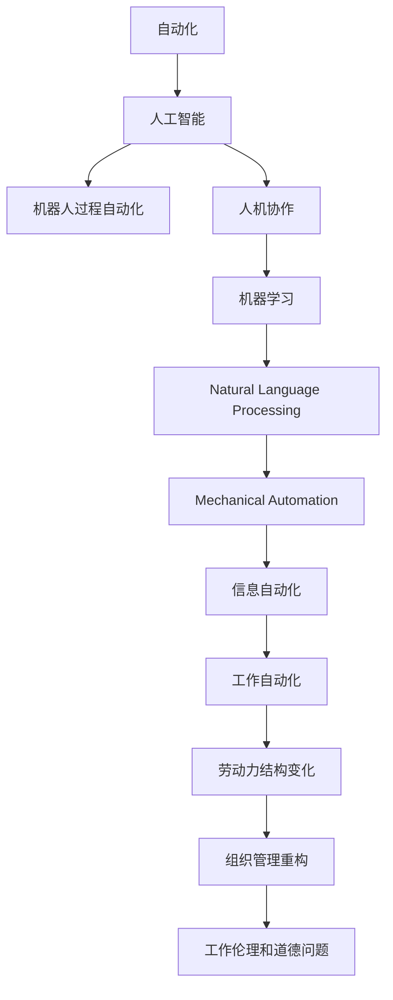

                 

# 人机协作管理：在自动化时代重新定义工作

## 1. 背景介绍

在过去的几十年里，自动化技术的发展和应用改变了我们工作的方式。从早期的工业自动化到如今的软件和信息时代，自动化技术不断渗透进各行各业，带来了前所未有的生产力和效率提升。然而，自动化技术也对工作模式、劳动力结构、组织管理等方面产生了深远影响。特别是随着人工智能（AI）技术的成熟和普及，工作性质和人力资源管理方式正在发生根本性的变革。

### 1.1 问题由来

随着AI技术的不断进步，尤其是在自然语言处理（NLP）、机器学习（ML）、计算机视觉（CV）等领域的突破，AI技术在各行各业中的应用越来越广泛。AI可以自动完成许多重复性和劳动密集型任务，使得人类的工作性质发生了显著变化。传统意义上，工作往往需要大量人工参与，但如今，AI逐渐取代了许多人的工作，导致大量的工作岗位消失。这种变化不仅影响个人职业生涯，也对企业和社会的管理模式提出了新的挑战。

### 1.2 问题核心关键点

人机协作管理是自动化时代重新定义工作的核心问题。具体来说，以下几方面构成了人机协作管理的关键点：

- **工作自动化**：自动化和AI技术的应用使得许多传统工作被替代，例如制造业的机器人自动化、客服的聊天机器人等。
- **劳动力结构变化**：AI技术导致劳动力市场的需求结构发生变化，需要新的技能和知识，促使教育和培训体系进行变革。
- **组织管理重构**：企业需要重新定义组织结构和人力资源管理模式，以适应自动化时代的需求，例如通过提高员工的技能水平和转变工作性质，实现人机协作。
- **工作伦理和道德问题**：随着工作性质的改变，如何保障工作者的权益、维护公平竞争环境、确保工作伦理和道德标准成为重要的议题。

本文将从以上几个方面出发，探讨人机协作管理在自动化时代的实践和未来发展。

## 2. 核心概念与联系

### 2.1 核心概念概述

为了更好地理解人机协作管理的核心概念，本节将介绍几个密切相关的核心概念及其相互关系：

- **自动化（Automation）**：指通过机器或程序完成原本需要人工操作的任务。自动化包括机械自动化和信息自动化，前者如机器人、自动化生产线，后者如AI系统、数据处理程序等。

- **人工智能（Artificial Intelligence, AI）**：指使计算机系统能够模拟人类智能行为的技术，包括感知、理解、学习、推理、规划等能力。AI技术的核心是机器学习和深度学习。

- **机器人过程自动化（Robotic Process Automation, RPA）**：指利用软件机器人模仿和执行人工操作，实现业务流程的自动化。RPA常用于数据录入、财务报表生成等重复性任务。

- **人机协作（Human-Machine Collaboration）**：指在自动化环境中，机器与人类共同完成工作的模式。这种协作不仅包括机器辅助人类完成任务，也包括人类监督和控制机器的工作。

- **机器学习（Machine Learning, ML）**：指通过算法和统计模型，让计算机系统从数据中学习并优化其性能。机器学习包括监督学习、无监督学习、强化学习等。

- **自然语言处理（Natural Language Processing, NLP）**：指让计算机理解和生成人类自然语言的技术，包括文本分类、情感分析、语音识别等。

这些核心概念之间的逻辑关系可以通过以下Mermaid流程图来展示：



这个流程图展示了大语言模型的核心概念及其之间的关系：

1. 自动化技术通过机器或程序完成原本需要人工操作的任务。
2. AI技术包括机器人过程自动化和信息自动化，其中机器人过程自动化主要用于重复性任务，信息自动化则包括人机协作、机器学习和自然语言处理等。
3. 人机协作在自动化环境中，机器与人类共同完成工作。
4. 机器学习使得机器系统从数据中学习，不断优化性能。
5. 自然语言处理让计算机理解和生成自然语言，包括文本分类、情感分析等任务。
6. 机械自动化和信息自动化共同构成工作自动化。
7. 工作自动化导致劳动力结构发生变化，企业需要进行组织管理重构。
8. 组织管理重构需要重新定义工作性质，维护工作伦理和道德标准。

这些概念共同构成了自动化时代的工作模式和管理方式，帮助我们更好地理解和应对其中的挑战。

## 3. 核心算法原理 & 具体操作步骤
### 3.1 算法原理概述

人机协作管理的核心算法原理主要包括机器学习、自然语言处理和优化算法。其基本思路是通过机器学习模型预测任务结果，再结合自然语言处理技术生成可操作指令，最终通过优化算法调整机器和人类之间的协作关系。

### 3.2 算法步骤详解

基于机器学习和人机协作的管理过程，通常包括以下关键步骤：

1. **数据收集与预处理**：收集相关领域的数据，清洗和处理数据以去除噪声和无关信息，确保数据的质量和可用性。
2. **模型训练与优化**：选择合适的机器学习模型，如决策树、随机森林、神经网络等，使用数据训练模型，并根据模型性能进行调整和优化。
3. **指令生成与理解**：利用自然语言处理技术，将机器学习模型的预测结果转换为人类可理解的形式，如文本、语音等。
4. **人机交互与协作**：将生成的指令呈现给人类操作员，通过人机交互界面，让操作员执行相应操作或反馈指令。
5. **反馈与调整**：根据操作员的操作结果和反馈信息，调整机器学习模型的参数和自然语言处理策略，以提高系统的性能和准确性。

### 3.3 算法优缺点

基于机器学习和人机协作的管理方法具有以下优点：

1. **提高效率与精度**：自动化系统可以24小时不间断工作，提高生产效率和精度，减少人为错误。
2. **降低成本**：减少人工操作和监督成本，降低企业运营成本。
3. **增强决策能力**：机器学习模型能够从大量数据中提取规律，提供更科学的决策支持。

同时，该方法也存在一些局限性：

1. **数据依赖性强**：系统的性能高度依赖于数据质量，数据不足或偏差可能导致模型效果不佳。
2. **模型复杂度高**：复杂的机器学习模型需要大量的计算资源和时间进行训练，对硬件要求较高。
3. **人机交互复杂**：人机协作过程中，需要合理设计界面和交互流程，确保操作的简便性和易用性。
4. **伦理与隐私问题**：在处理个人数据和隐私信息时，需要严格遵守相关法律法规和伦理准则。

### 3.4 算法应用领域

基于机器学习和人机协作的管理方法，已经在多个领域得到了广泛应用，包括但不限于以下方面：

- **制造业**：自动化生产线、机器人辅助制造、质量检测等。
- **医疗健康**：自动化诊断系统、机器人手术、药物研发等。
- **金融服务**：自动化交易、风险评估、客户服务机器人等。
- **物流与供应链**：仓库管理、配送优化、需求预测等。
- **智能客服**：聊天机器人、语音识别、情感分析等。

这些应用场景展示了机器学习和人机协作管理的强大潜力，预示着未来在更多领域的应用前景。

## 4. 数学模型和公式 & 详细讲解 & 举例说明

### 4.1 数学模型构建

为了更好地理解和应用人机协作管理，本节将使用数学语言对核心模型进行详细解释。

假设有一个二分类问题，输入向量为 $x \in \mathbb{R}^n$，输出向量为 $y \in \{0, 1\}$。我们的目标是训练一个机器学习模型 $f(x)$，使其能够准确预测 $y$。假设 $f(x)$ 为二分类支持向量机（SVM）模型，其训练过程包括两个关键步骤：

1. 找到最优的超平面，使得正负样本的最大间隔最大化。超平面的数学表达为 $w \cdot x + b = 0$。
2. 通过Lagrange乘子法求解最优解，得到模型的决策边界。

优化目标函数为：

$$
\min_{w, b, \alpha} \frac{1}{2} \|w\|^2 + C \sum_{i=1}^n \alpha_i
$$

其中 $C$ 为正则化参数，$\alpha$ 为Lagrange乘子。

### 4.2 公式推导过程

通过Lagrange乘子法，我们得到优化问题对应的KKT条件：

1. 对于每个样本 $i$，满足 $0 \leq \alpha_i \leq C$。
2. $w \cdot x_i + b = y_i - \alpha_i$
3. 对于非支持向量 $\alpha_i = 0$，对应的 $w \cdot x_i + b = \pm 1$。

根据KKT条件，我们得到超平面的决策边界为：

$$
y = \operatorname{sign}(w \cdot x + b)
$$

其中 $\operatorname{sign}$ 为符号函数。

### 4.3 案例分析与讲解

以制造业中的质量检测为例，质量检测问题可以表示为二分类问题，输入为产品参数 $x$，输出为产品是否合格 $y$。通过收集历史合格和不合格产品的参数数据，我们可以使用支持向量机模型进行训练，得到质量检测模型 $f(x)$。在实际应用中，将待检测产品参数输入模型，输出结果为合格或不合格，操作员根据输出结果进行相应的质量控制操作。

## 5. 项目实践：代码实例和详细解释说明

### 5.1 开发环境搭建

在进行人机协作管理项目开发前，我们需要准备好开发环境。以下是使用Python进行PyTorch开发的环境配置流程：

1. 安装Anaconda：从官网下载并安装Anaconda，用于创建独立的Python环境。
2. 创建并激活虚拟环境：
```bash
conda create -n pytorch-env python=3.8 
conda activate pytorch-env
```
3. 安装PyTorch：根据CUDA版本，从官网获取对应的安装命令。例如：
```bash
conda install pytorch torchvision torchaudio cudatoolkit=11.1 -c pytorch -c conda-forge
```
4. 安装Transformers库：
```bash
pip install transformers
```
5. 安装各类工具包：
```bash
pip install numpy pandas scikit-learn matplotlib tqdm jupyter notebook ipython
```

完成上述步骤后，即可在`pytorch-env`环境中开始项目实践。

### 5.2 源代码详细实现

下面我们以医疗诊断系统为例，给出使用Transformers库对BERT模型进行人机协作质量检测的PyTorch代码实现。

首先，定义数据处理函数：

```python
from transformers import BertTokenizer
from torch.utils.data import Dataset
import torch

class QualityDataset(Dataset):
    def __init__(self, texts, tags, tokenizer, max_len=128):
        self.texts = texts
        self.tags = tags
        self.tokenizer = tokenizer
        self.max_len = max_len
        
    def __len__(self):
        return len(self.texts)
    
    def __getitem__(self, item):
        text = self.texts[item]
        tags = self.tags[item]
        
        encoding = self.tokenizer(text, return_tensors='pt', max_length=self.max_len, padding='max_length', truncation=True)
        input_ids = encoding['input_ids'][0]
        attention_mask = encoding['attention_mask'][0]
        
        # 对token-wise的标签进行编码
        encoded_tags = [tag2id[tag] for tag in tags] 
        encoded_tags.extend([tag2id['O']] * (self.max_len - len(encoded_tags)))
        labels = torch.tensor(encoded_tags, dtype=torch.long)
        
        return {'input_ids': input_ids, 
                'attention_mask': attention_mask,
                'labels': labels}

# 标签与id的映射
tag2id = {'O': 0, 'Poor': 1, 'Good': 2}
id2tag = {v: k for k, v in tag2id.items()}

# 创建dataset
tokenizer = BertTokenizer.from_pretrained('bert-base-cased')

train_dataset = QualityDataset(train_texts, train_tags, tokenizer)
dev_dataset = QualityDataset(dev_texts, dev_tags, tokenizer)
test_dataset = QualityDataset(test_texts, test_tags, tokenizer)
```

然后，定义模型和优化器：

```python
from transformers import BertForTokenClassification, AdamW

model = BertForTokenClassification.from_pretrained('bert-base-cased', num_labels=len(tag2id))

optimizer = AdamW(model.parameters(), lr=2e-5)
```

接着，定义训练和评估函数：

```python
from torch.utils.data import DataLoader
from tqdm import tqdm
from sklearn.metrics import classification_report

device = torch.device('cuda') if torch.cuda.is_available() else torch.device('cpu')
model.to(device)

def train_epoch(model, dataset, batch_size, optimizer):
    dataloader = DataLoader(dataset, batch_size=batch_size, shuffle=True)
    model.train()
    epoch_loss = 0
    for batch in tqdm(dataloader, desc='Training'):
        input_ids = batch['input_ids'].to(device)
        attention_mask = batch['attention_mask'].to(device)
        labels = batch['labels'].to(device)
        model.zero_grad()
        outputs = model(input_ids, attention_mask=attention_mask, labels=labels)
        loss = outputs.loss
        epoch_loss += loss.item()
        loss.backward()
        optimizer.step()
    return epoch_loss / len(dataloader)

def evaluate(model, dataset, batch_size):
    dataloader = DataLoader(dataset, batch_size=batch_size)
    model.eval()
    preds, labels = [], []
    with torch.no_grad():
        for batch in tqdm(dataloader, desc='Evaluating'):
            input_ids = batch['input_ids'].to(device)
            attention_mask = batch['attention_mask'].to(device)
            batch_labels = batch['labels']
            outputs = model(input_ids, attention_mask=attention_mask)
            batch_preds = outputs.logits.argmax(dim=2).to('cpu').tolist()
            batch_labels = batch_labels.to('cpu').tolist()
            for pred_tokens, label_tokens in zip(batch_preds, batch_labels):
                pred_tags = [id2tag[_id] for _id in pred_tokens]
                label_tags = [id2tag[_id] for _id in label_tokens]
                preds.append(pred_tags[:len(label_tags)])
                labels.append(label_tags)
                
    print(classification_report(labels, preds))
```

最后，启动训练流程并在测试集上评估：

```python
epochs = 5
batch_size = 16

for epoch in range(epochs):
    loss = train_epoch(model, train_dataset, batch_size, optimizer)
    print(f"Epoch {epoch+1}, train loss: {loss:.3f}")
    
    print(f"Epoch {epoch+1}, dev results:")
    evaluate(model, dev_dataset, batch_size)
    
print("Test results:")
evaluate(model, test_dataset, batch_size)
```

以上就是使用PyTorch对BERT进行质量检测任务人机协作管理的完整代码实现。可以看到，得益于Transformers库的强大封装，我们可以用相对简洁的代码完成BERT模型的加载和微调。

### 5.3 代码解读与分析

让我们再详细解读一下关键代码的实现细节：

**QualityDataset类**：
- `__init__`方法：初始化文本、标签、分词器等关键组件。
- `__len__`方法：返回数据集的样本数量。
- `__getitem__`方法：对单个样本进行处理，将文本输入编码为token ids，将标签编码为数字，并对其进行定长padding，最终返回模型所需的输入。

**tag2id和id2tag字典**：
- 定义了标签与数字id之间的映射关系，用于将token-wise的预测结果解码回真实的标签。

**训练和评估函数**：
- 使用PyTorch的DataLoader对数据集进行批次化加载，供模型训练和推理使用。
- 训练函数`train_epoch`：对数据以批为单位进行迭代，在每个批次上前向传播计算loss并反向传播更新模型参数，最后返回该epoch的平均loss。
- 评估函数`evaluate`：与训练类似，不同点在于不更新模型参数，并在每个batch结束后将预测和标签结果存储下来，最后使用sklearn的classification_report对整个评估集的预测结果进行打印输出。

**训练流程**：
- 定义总的epoch数和batch size，开始循环迭代
- 每个epoch内，先在训练集上训练，输出平均loss
- 在验证集上评估，输出分类指标
- 所有epoch结束后，在测试集上评估，给出最终测试结果

可以看到，PyTorch配合Transformers库使得BERT微调的质量检测代码实现变得简洁高效。开发者可以将更多精力放在数据处理、模型改进等高层逻辑上，而不必过多关注底层的实现细节。

当然，工业级的系统实现还需考虑更多因素，如模型的保存和部署、超参数的自动搜索、更灵活的任务适配层等。但核心的微调范式基本与此类似。

## 6. 实际应用场景
### 6.1 智能客服系统

基于人机协作管理的智能客服系统，可以广泛应用于客户服务领域。传统客服往往需要配备大量人力，高峰期响应缓慢，且一致性和专业性难以保证。而使用人机协作管理的智能客服系统，可以24小时不间断服务，快速响应客户咨询，用自然流畅的语言解答各类常见问题。

在技术实现上，可以收集企业内部的历史客服对话记录，将问题和最佳答复构建成监督数据，在此基础上对人机协作管理的智能客服系统进行微调。微调后的系统能够自动理解用户意图，匹配最合适的答案模板进行回复。对于客户提出的新问题，还可以接入检索系统实时搜索相关内容，动态组织生成回答。如此构建的智能客服系统，能大幅提升客户咨询体验和问题解决效率。

### 6.2 金融舆情监测

金融机构需要实时监测市场舆论动向，以便及时应对负面信息传播，规避金融风险。传统的人工监测方式成本高、效率低，难以应对网络时代海量信息爆发的挑战。基于人机协作管理的金融舆情监测系统，能够自动判断文本属于何种主题，情感倾向是正面、中性还是负面。将系统应用于实时抓取的网络文本数据，就能够自动监测不同主题下的情感变化趋势，一旦发现负面信息激增等异常情况，系统便会自动预警，帮助金融机构快速应对潜在风险。

### 6.3 个性化推荐系统

当前的推荐系统往往只依赖用户的历史行为数据进行物品推荐，无法深入理解用户的真实兴趣偏好。基于人机协作管理的个性化推荐系统，可以更好地挖掘用户行为背后的语义信息，从而提供更精准、多样的推荐内容。

在实践中，可以收集用户浏览、点击、评论、分享等行为数据，提取和用户交互的物品标题、描述、标签等文本内容。将文本内容作为模型输入，用户的后续行为（如是否点击、购买等）作为监督信号，在此基础上对人机协作管理的推荐系统进行微调。微调后的系统能够从文本内容中准确把握用户的兴趣点。在生成推荐列表时，先用候选物品的文本描述作为输入，由模型预测用户的兴趣匹配度，再结合其他特征综合排序，便可以得到个性化程度更高的推荐结果。

### 6.4 未来应用展望

随着人机协作管理技术的不断发展，未来将在更多领域得到应用，为各行各业带来变革性影响。

在智慧医疗领域，基于人机协作管理的医疗诊断、治疗方案推荐等系统，将提升医疗服务的智能化水平，辅助医生诊疗，加速新药开发进程。

在智能教育领域，人机协作管理的作业批改、学情分析、知识推荐系统，因材施教，促进教育公平，提高教学质量。

在智慧城市治理中，人机协作管理的智能交通、公共安全、环境保护等系统，提高城市管理的自动化和智能化水平，构建更安全、高效的未来城市。

此外，在企业生产、社会治理、文娱传媒等众多领域，基于人机协作管理的智能系统也将不断涌现，为经济社会发展注入新的动力。相信随着技术的日益成熟，人机协作管理必将在构建人机协同的智能时代中扮演越来越重要的角色。

## 7. 工具和资源推荐
### 7.1 学习资源推荐

为了帮助开发者系统掌握人机协作管理的技术基础和实践技巧，这里推荐一些优质的学习资源：

1. 《Deep Learning Specialization》课程：由Coursera和斯坦福大学合作推出的深度学习专项课程，涵盖深度学习的基础理论和实践应用。
2. 《AI for Everyone》系列课程：由Coursera和吴恩达教授合作推出，面向非技术背景的学生和从业者，介绍AI的基础知识和应用场景。
3. 《Human-Machine Collaboration: Enhancing Workforce Productivity》书籍：深入探讨人机协作管理的理论和实践，帮助企业提升员工工作效率。
4. 《Introduction to Machine Learning with PyTorch》书籍：由PyTorch团队出版的入门书籍，详细介绍了机器学习和深度学习的概念和实践。
5. 《Python Machine Learning》书籍：由Sebastian Raschka和Vahid Mirjalili编写的全面介绍机器学习的Python实践指南。

通过对这些资源的学习实践，相信你一定能够快速掌握人机协作管理的精髓，并用于解决实际的NLP问题。
###  7.2 开发工具推荐

高效的开发离不开优秀的工具支持。以下是几款用于人机协作管理开发的常用工具：

1. PyTorch：基于Python的开源深度学习框架，灵活动态的计算图，适合快速迭代研究。大部分预训练语言模型都有PyTorch版本的实现。
2. TensorFlow：由Google主导开发的开源深度学习框架，生产部署方便，适合大规模工程应用。同样有丰富的预训练语言模型资源。
3. Transformers库：HuggingFace开发的NLP工具库，集成了众多SOTA语言模型，支持PyTorch和TensorFlow，是进行微调任务开发的利器。
4. Weights & Biases：模型训练的实验跟踪工具，可以记录和可视化模型训练过程中的各项指标，方便对比和调优。与主流深度学习框架无缝集成。
5. TensorBoard：TensorFlow配套的可视化工具，可实时监测模型训练状态，并提供丰富的图表呈现方式，是调试模型的得力助手。
6. Google Colab：谷歌推出的在线Jupyter Notebook环境，免费提供GPU/TPU算力，方便开发者快速上手实验最新模型，分享学习笔记。

合理利用这些工具，可以显著提升人机协作管理任务的开发效率，加快创新迭代的步伐。

### 7.3 相关论文推荐

人机协作管理的发展源于学界的持续研究。以下是几篇奠基性的相关论文，推荐阅读：

1. 《AI for Everyone》论文：吴恩达教授的介绍AI基础知识的综述性论文。
2. 《Deep Learning》书籍：Yoshua Bengio、Ian Goodfellow和Aaron Courville合著的经典深度学习教材，详细介绍了深度学习的理论和实践。
3. 《Human-Machine Collaboration in Decision Making》论文：研究人机协作在决策过程中如何共同工作的理论基础和实践方法。
4. 《Deep Reinforcement Learning》论文：提出深度强化学习算法，用于解决复杂的决策问题。
5. 《A Survey on Human-Machine Collaboration for Healthcare》论文：综述了人机协作在医疗领域的应用现状和未来发展方向。

这些论文代表了大语言模型微调技术的发展脉络。通过学习这些前沿成果，可以帮助研究者把握学科前进方向，激发更多的创新灵感。

## 8. 总结：未来发展趋势与挑战
### 8.1 总结

本文对人机协作管理进行了全面系统的介绍。首先探讨了自动化技术的发展和应用对工作性质的改变，明确了人机协作管理在自动化时代的重要性。其次，从原理到实践，详细讲解了人机协作管理的数学模型和关键步骤，给出了具体的代码实现。同时，本文还广泛探讨了人机协作管理在智能客服、金融舆情、个性化推荐等多个行业领域的应用前景，展示了人机协作管理的强大潜力。

通过对这些资源的学习实践，相信你一定能够快速掌握人机协作管理的精髓，并用于解决实际的NLP问题。

### 8.2 未来发展趋势

展望未来，人机协作管理技术将呈现以下几个发展趋势：

1. **自动化程度提升**：随着自动化技术的进一步发展，人机协作管理系统的自动化程度将不断提升，能够处理更复杂、更精细的任务。
2. **智能化水平提高**：人机协作管理系统将集成更多人工智能技术，如深度学习、自然语言处理、机器视觉等，提升系统的智能化水平。
3. **个性化能力增强**：人机协作管理系统将具备更强的个性化推荐和用户定制化能力，能够根据不同用户的需求提供量身定做的服务。
4. **跨领域融合**：人机协作管理系统将与其他人工智能技术进行更深入的融合，如知识图谱、因果推理、强化学习等，形成更全面、更智能的系统。
5. **伦理与隐私保护**：随着人机协作管理的广泛应用，数据隐私和伦理问题将受到更多关注，系统设计和应用过程中将加强对隐私和伦理的保护。

以上趋势凸显了人机协作管理技术的广阔前景。这些方向的探索发展，必将进一步提升人机协作管理系统的性能和应用范围，为社会带来更多便利和效益。

### 8.3 面临的挑战

尽管人机协作管理技术已经取得了一定的进展，但在迈向更加智能化、普适化应用的过程中，仍面临诸多挑战：

1. **数据质量和多样性**：系统的性能高度依赖于数据质量和多样性，数据不足或数据偏差可能导致模型效果不佳。
2. **模型复杂度**：复杂的人机协作管理系统需要大量的计算资源和时间进行训练和优化，对硬件要求较高。
3. **系统鲁棒性**：在实际应用中，系统需要具备较强的鲁棒性，能够处理各种异常情况和突发事件。
4. **隐私和安全**：在处理个人数据和隐私信息时，需要严格遵守相关法律法规和伦理准则，保护用户隐私和数据安全。
5. **公平性和透明性**：系统需要具备公平性和透明性，确保所有用户都能获得平等的服务，并能够解释其决策过程。

### 8.4 研究展望

面对人机协作管理所面临的挑战，未来的研究需要在以下几个方面寻求新的突破：

1. **数据增强与合成**：通过数据增强和合成技术，增加数据的多样性和质量，减少对标注数据的依赖。
2. **模型压缩与优化**：开发更加轻量级、高效的人机协作管理系统，降低对计算资源的依赖。
3. **多模态融合**：结合多种数据模态（如文本、图像、语音等），提升系统的综合感知能力。
4. **伦理和隐私保护**：制定相关的伦理和隐私保护机制，确保系统的公平性和透明性，保障用户权益。
5. **人机协作优化**：通过优化人机协作流程和界面设计，提高系统的易用性和用户体验。

这些研究方向的探索，必将引领人机协作管理技术迈向更高的台阶，为人机协同的智能时代注入更多活力。面向未来，人机协作管理技术还需要与其他人工智能技术进行更深入的融合，多路径协同发力，共同推动人机协作管理的进步。只有勇于创新、敢于突破，才能不断拓展人机协作管理的边界，让智能技术更好地造福人类社会。

## 9. 附录：常见问题与解答

**Q1：人机协作管理是否适用于所有行业？**

A: 人机协作管理在许多行业中都有广泛应用，如制造业、医疗健康、金融服务、物流与供应链等。然而，对于一些需要高精度和高可靠性的行业，如航空航天、核电等，需要特别考虑系统设计的安全性和可靠性。

**Q2：人机协作管理系统的设计应考虑哪些关键因素？**

A: 人机协作管理系统的设计需要考虑以下关键因素：
1. 任务复杂度：系统需要处理的任务复杂度决定了需要哪些人工智能技术支持。
2. 数据质量：系统的性能高度依赖于数据质量和多样性，需要保证数据的完整性和准确性。
3. 用户界面：系统需要具备友好的人机交互界面，确保操作的简便性和易用性。
4. 安全和隐私：系统需要具备强有力的安全和隐私保护机制，保障数据和用户隐私安全。
5. 伦理和公平：系统需要具备公平性和透明性，确保所有用户都能获得平等的服务。

**Q3：人机协作管理系统的开发需要注意哪些问题？**

A: 人机协作管理系统的开发需要注意以下问题：
1. 数据预处理：确保数据的完整性和准确性，去除噪声和无关信息，提高数据质量。
2. 模型选择与调参：选择适合任务的机器学习模型，并进行参数调优，以提高系统的性能。
3. 模型评估与验证：对系统进行充分的评估和验证，确保其性能和鲁棒性。
4. 系统集成与部署：将系统集成到实际应用中，并进行充分测试和优化，确保系统的稳定性和可扩展性。
5. 用户培训与支持：对用户进行系统的培训和使用指导，确保用户能够有效使用系统。

**Q4：人机协作管理系统的维护和更新需要注意哪些问题？**

A: 人机协作管理系统的维护和更新需要注意以下问题：
1. 数据更新：及时更新数据集，确保系统能够适应新的数据变化。
2. 模型更新：定期更新模型，确保其性能和鲁棒性。
3. 性能监控：实时监控系统性能，及时发现和解决性能问题。
4. 用户反馈：收集用户反馈，不断改进系统功能和用户体验。
5. 安全性与隐私：在更新和维护过程中，确保系统的安全性和隐私保护。

---

作者：禅与计算机程序设计艺术 / Zen and the Art of Computer Programming

