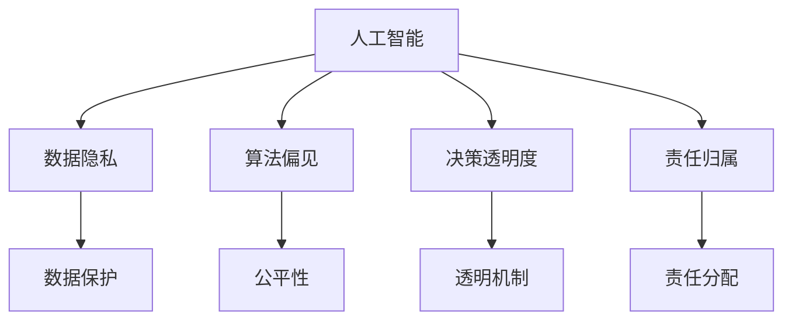

                 

## 1. 背景介绍

### 1.1 问题由来
随着人工智能技术的飞速发展，其在医疗、金融、教育、交通等领域的应用越来越广泛，带来了巨大的经济效益和社会效益。然而，人工智能的普及也引发了一系列伦理问题，引起了社会各界的广泛关注。

例如，在医疗领域，人工智能在诊断、治疗、药物研发等方面表现出色，但同时也面临着数据隐私、算法偏见、决策透明度等伦理挑战。在金融领域，智能投顾、风险控制等应用提高了效率和准确性，但过度依赖算法可能带来风险失控的问题。在教育领域，智能辅导系统可以帮助学生个性化学习，但过度依赖技术也可能削弱学生的独立思考能力。

这些问题的根源在于人工智能与人类计算之间的交叉与碰撞。人类计算强调人与机器的协同工作，利用计算工具辅助人类进行决策，而人工智能则通过学习、推理等机制，在特定领域超越人类。但无论是人工智能还是人类计算，其伦理问题都值得我们深入探讨。

### 1.2 问题核心关键点
人工智能与人类计算之间的伦理问题主要包括以下几个方面：

1. **数据隐私**：大规模数据收集和分析引发了隐私泄露、数据滥用等问题，如何保护用户隐私成为关键。
2. **算法偏见**：算法在学习过程中可能继承和放大数据中的偏见，导致不公平的决策。
3. **决策透明度**：人工智能的决策过程往往缺乏可解释性，难以理解其内部工作机制和逻辑。
4. **责任归属**：人工智能系统在决策过程中出现问题时，责任如何分配，谁应该承担后果？
5. **人机交互**：人工智能系统与人类之间的交互方式，如何平衡技术与人性？

这些核心关键点构成了人工智能与人类计算伦理问题的核心框架，需要我们在技术研发和应用实践中加以关注和解决。

### 1.3 问题研究意义
研究人工智能与人类计算的伦理问题，对于保障技术公平、安全、透明、可控的落地应用，具有重要的意义：

1. **保障公平公正**：通过伦理规范和技术改进，确保人工智能系统在决策过程中不会产生偏见，避免对特定群体的不公平待遇。
2. **提高安全可靠性**：通过伦理审查和技术手段，避免人工智能系统在关键决策中出错，保障系统的稳定性和安全性。
3. **增强透明性**：通过透明的决策机制和算法解释，使人工智能系统的工作过程和结果具有可解释性，便于公众理解和监督。
4. **明确责任归属**：通过明确的伦理规范和法律规定，在人工智能系统出现问题时，能够合理分配责任，保障利益相关者的权益。
5. **促进人机协作**：通过平衡技术与人性，使人工智能系统成为人类的助手和工具，而不是替代品，实现人机协作的和谐发展。

通过深入研究人工智能与人类计算的伦理问题，我们不仅能提升技术的质量和应用效果，还能在伦理道德层面形成共识，推动人工智能技术的健康发展。

## 2. 核心概念与联系

### 2.1 核心概念概述

为更好地理解人工智能与人类计算伦理问题的研究背景和意义，本节将介绍几个密切相关的核心概念：

- **人工智能**：指利用计算工具实现人类智能行为的机器系统，包括机器学习、深度学习、自然语言处理等技术。
- **人类计算**：指人类利用计算工具辅助进行决策、计算、分析等认知过程，强调人与机器的协同工作。
- **数据隐私**：指个人或组织的数据在收集、存储、传输和处理过程中，如何保护其不被未授权访问、滥用或泄露。
- **算法偏见**：指算法在训练和应用过程中，由于数据集或训练方式等因素，产生的不公平或歧视性输出。
- **决策透明度**：指人工智能系统在做出决策时，其决策依据和过程是否公开透明，便于外部审查和监督。
- **责任归属**：指在人工智能系统出现问题时，责任如何分配，相关方如何承担后果。

这些核心概念之间的逻辑关系可以通过以下Mermaid流程图来展示：



这个流程图展示了大语言模型的工作原理和优化方向：

1. 人工智能系统通过数据学习，进行决策和推理。
2. 数据隐私保护技术，确保数据安全不被滥用。
3. 算法偏见识别和修正，保证公平性。
4. 决策透明度机制，提高系统的可解释性。
5. 责任归属规范，确保出现问题时责任明确。

这些概念共同构成了人工智能与人类计算的伦理框架，使其能够更好地应用于实际场景。

## 3. 核心算法原理 & 具体操作步骤
### 3.1 算法原理概述

人工智能与人类计算伦理问题的核心算法原理包括数据隐私保护、算法偏见修正、决策透明度增强和责任归属分配。这些算法技术彼此协同，共同确保人工智能系统的公平、安全、透明和可控。

**数据隐私保护**：
通过数据匿名化、差分隐私、联邦学习等技术，在保护数据隐私的同时，确保模型能够学习到足够的知识。

**算法偏见修正**：
通过公平性检测、偏见校正、数据重采样等技术，修正算法中的偏见，确保模型输出公平性。

**决策透明度增强**：
通过可解释性模型、决策可视化、交互式解释等技术，提高人工智能系统的可解释性，便于外部审查和监督。

**责任归属分配**：
通过透明性和责任链构建、责任溯源、责任保险等技术，明确人工智能系统出现问题的责任归属，确保利益相关者的权益。

### 3.2 算法步骤详解

人工智能与人类计算伦理问题的解决步骤如下：

**Step 1: 数据收集与预处理**
- 收集和标注数据，确保数据来源多样性和代表性。
- 进行数据清洗和预处理，去除噪声和异常值，确保数据质量。

**Step 2: 模型训练与验证**
- 选择合适的算法和模型结构，确保模型能够学习到有价值的知识。
- 使用公平性检测技术，确保模型输出公平性。
- 使用差分隐私等技术，保护数据隐私。

**Step 3: 模型评估与优化**
- 使用透明性指标，评估模型的可解释性。
- 使用可解释性模型，增强模型的透明性。
- 使用对抗样本等技术，增强模型的鲁棒性。

**Step 4: 系统部署与监控**
- 部署模型到实际应用场景中，进行实时监控。
- 使用责任溯源技术，明确问题来源和责任归属。
- 使用责任保险等机制，保障利益相关者的权益。

### 3.3 算法优缺点

人工智能与人类计算伦理问题解决算法的优缺点如下：

**优点**：
1. **数据保护**：通过差分隐私等技术，保护数据隐私，减少数据滥用风险。
2. **公平性**：通过偏见校正等技术，确保模型输出公平性，减少算法偏见。
3. **透明性**：通过可解释性模型和决策可视化，提高模型的透明性，便于外部审查和监督。
4. **责任归属**：通过透明性和责任链构建，明确问题来源和责任归属，保障利益相关者的权益。

**缺点**：
1. **复杂性**：算法实现复杂，需要兼顾隐私、公平性、透明性和责任归属等多方面因素。
2. **性能损失**：隐私保护和偏见修正等技术，可能会影响模型的性能和效率。
3. **技术依赖**：依赖于先进的技术手段和计算资源，可能导致成本高昂。
4. **安全风险**：技术实现可能存在漏洞，导致数据泄露或模型攻击。

尽管存在这些缺点，但通过持续的技术创新和伦理规范的完善，人工智能与人类计算的伦理问题有望逐步解决，为技术应用带来更大的保障和效益。

### 3.4 算法应用领域

人工智能与人类计算伦理问题解决算法在各个领域都有广泛的应用：

- **医疗**：在医疗影像诊断、药物研发等方面，通过数据隐私保护、算法偏见修正、决策透明度增强等技术，保障患者隐私，提高诊断准确性。
- **金融**：在风险控制、智能投顾等方面，通过数据隐私保护、算法偏见修正、责任归属分配等技术，保障客户权益，提高决策透明度。
- **教育**：在个性化辅导、学习分析等方面，通过数据隐私保护、算法偏见修正、决策透明度增强等技术，保障学生隐私，提高教学效果。
- **交通**：在智能交通管理、自动驾驶等方面，通过数据隐私保护、算法偏见修正、决策透明度增强等技术，保障交通数据安全，提高系统可靠性。

这些应用领域展示了人工智能与人类计算伦理问题解决算法的广泛价值，为各行业带来了新的发展机遇。

## 4. 数学模型和公式 & 详细讲解 & 举例说明

### 4.1 数学模型构建

本节将使用数学语言对人工智能与人类计算伦理问题的算法进行更加严格的刻画。

**数据隐私保护**：
假设数据集 $D$ 包含 $n$ 个样本，每个样本包含 $d$ 个特征 $x_i$ 和标签 $y_i$。定义 $\epsilon$ 为差分隐私参数，$\delta$ 为隐私保护阈值。差分隐私算法通过添加噪声 $\Delta$ 来保护数据隐私，目标是最小化隐私损失 $\mathcal{L}_{\epsilon,\delta}$：

$$
\mathcal{L}_{\epsilon,\delta} = \max \{\frac{1}{2\epsilon}\sqrt{2 \epsilon \Delta}, \log(\frac{2}{\delta})\}
$$

其中 $\Delta$ 为隐私保护噪声，可以通过拉普拉斯分布或高斯分布生成。

**算法偏见修正**：
假设训练集 $D$ 包含 $n$ 个样本，每个样本包含 $d$ 个特征 $x_i$ 和标签 $y_i$。定义偏见度量 $\mathcal{B}$ 为模型输出中与真实标签不一致的比例，目标是最小化偏见度量 $\mathcal{B}$：

$$
\min_{\theta} \mathcal{B}(\theta) = \min_{\theta} \frac{1}{n}\sum_{i=1}^n \mathbb{I}(y_i \neq \hat{y}_i(\theta))
$$

其中 $\theta$ 为模型参数，$\hat{y}_i(\theta)$ 为模型对样本 $x_i$ 的预测标签。

**决策透明度增强**：
假设模型 $M$ 的输出为 $\hat{y}$，目标是通过决策可视化技术，使 $\hat{y}$ 的可解释性最大化：

$$
\max_{\hat{y}} \text{Explainability}(\hat{y})
$$

其中 $\text{Explainability}(\hat{y})$ 为模型的可解释性指标，可以通过LIME、SHAP等技术评估。

**责任归属分配**：
假设系统出现故障，定义责任归属函数 $\text{Liability}(\theta, x)$，目标是在责任链中，明确责任归属：

$$
\min_{\theta} \sum_{i=1}^n \text{Liability}(\theta, x_i)
$$

其中 $\theta$ 为模型参数，$x_i$ 为系统输入。

### 4.2 公式推导过程

以下我们以医疗影像诊断为例，推导差分隐私保护算法的详细步骤。

**差分隐私保护算法**：
假设医疗影像数据集 $D$ 包含 $n$ 个样本，每个样本包含 $d$ 个特征 $x_i$ 和标签 $y_i$。使用拉普拉斯分布来生成噪声 $\Delta$，算法步骤如下：

1. 收集原始数据 $D$，对数据进行预处理和特征提取。
2. 对数据集进行划分，生成训练集 $D_{train}$ 和测试集 $D_{test}$。
3. 在训练集 $D_{train}$ 上训练模型 $M$，得到参数 $\theta$。
4. 对测试集 $D_{test}$ 进行隐私保护，生成隐私保护数据 $D_{test}'$。
5. 在隐私保护数据 $D_{test}'$ 上评估模型 $M$ 的性能。
6. 在隐私保护数据 $D_{test}'$ 上生成噪声 $\Delta$，得到隐私保护结果 $D_{test}''$。

其中，噪声 $\Delta$ 通过拉普拉斯分布生成，满足：

$$
\mathbb{P}(\Delta \leq \frac{\epsilon x}{2}) = \frac{1}{2}
$$

**案例分析与讲解**：
假设医疗影像数据集 $D$ 包含 10000 个样本，每个样本包含 1024 个特征和标签。使用差分隐私算法保护数据隐私，差分隐私参数 $\epsilon = 0.1$，隐私保护阈值 $\delta = 0.01$。假设每个样本的特征值 $x_i$ 为 $[0, 1]$ 之间的实数。使用拉普拉斯分布生成噪声 $\Delta$，具体步骤如下：

1. 收集原始数据 $D$，对数据进行预处理和特征提取。
2. 对数据集进行划分，生成训练集 $D_{train}$ 和测试集 $D_{test}$。
3. 在训练集 $D_{train}$ 上训练模型 $M$，得到参数 $\theta$。
4. 对测试集 $D_{test}$ 进行隐私保护，生成隐私保护数据 $D_{test}'$。
5. 在隐私保护数据 $D_{test}'$ 上评估模型 $M$ 的性能。
6. 在隐私保护数据 $D_{test}'$ 上生成噪声 $\Delta$，得到隐私保护结果 $D_{test}''$。

其中，噪声 $\Delta$ 通过拉普拉斯分布生成，具体步骤如下：

1. 计算每个样本的敏感度 $\delta_i$，满足 $\delta_i = x_i - y_i$。
2. 生成噪声 $\Delta_i \sim \text{Laplace}(0, \frac{\epsilon}{\delta})$，满足 $\mathbb{P}(\Delta_i \leq \frac{\epsilon \delta}{2}) = \frac{1}{2}$。
3. 计算隐私保护结果 $D_{test}'' = D_{test}' + \Delta$。

通过以上步骤，可以有效地保护医疗影像数据集的隐私，同时保证模型在隐私保护数据上的性能。

## 5. 项目实践：代码实例和详细解释说明

### 5.1 开发环境搭建

在进行人工智能与人类计算伦理问题的实践前，我们需要准备好开发环境。以下是使用Python进行PyTorch开发的环境配置流程：

1. 安装Anaconda：从官网下载并安装Anaconda，用于创建独立的Python环境。

2. 创建并激活虚拟环境：
```bash
conda create -n pytorch-env python=3.8 
conda activate pytorch-env
```

3. 安装PyTorch：根据CUDA版本，从官网获取对应的安装命令。例如：
```bash
conda install pytorch torchvision torchaudio cudatoolkit=11.1 -c pytorch -c conda-forge
```

4. 安装Transformer库：
```bash
pip install transformers
```

5. 安装各类工具包：
```bash
pip install numpy pandas scikit-learn matplotlib tqdm jupyter notebook ipython
```

完成上述步骤后，即可在`pytorch-env`环境中开始人工智能与人类计算伦理问题的实践。

### 5.2 源代码详细实现

下面我们以医疗影像诊断为例，给出使用Transformers库进行差分隐私保护的PyTorch代码实现。

首先，定义差分隐私保护的函数：

```python
import torch
import torch.nn as nn
import torch.optim as optim
import numpy as np
import torch.nn.functional as F
from transformers import BertTokenizer, BertForSequenceClassification
from sklearn.model_selection import train_test_split
from sklearn.metrics import accuracy_score

def laplace mechanism(epsilon):
    return lambda: np.random.laplace(0, epsilon)

def add_noise(data, epsilon, delta):
    noise = np.random.normal(0, epsilon, data.shape)
    data = data + noise
    return data

def differential_privacy(data, epsilon, delta):
    laplace = laplace mechanism(epsilon)
    for i in range(data.shape[0]):
        data[i] = add_noise(data[i], epsilon, delta)
    return data

# 数据加载函数
def load_data(file_path):
    data = []
    with open(file_path, 'r') as f:
        for line in f:
            x, y = line.strip().split(',')
            data.append([float(x), int(y)])
    return np.array(data)

# 加载数据集
data = load_data('medical_imaging_data.csv')

# 划分数据集
X_train, X_test, y_train, y_test = train_test_split(data[:, :1024], data[:, 1024], test_size=0.2)

# 构建模型
tokenizer = BertTokenizer.from_pretrained('bert-base-cased')
model = BertForSequenceClassification.from_pretrained('bert-base-cased', num_labels=2)
model.train()
model.eval()

# 训练模型
optimizer = optim.Adam(model.parameters(), lr=1e-5)
for epoch in range(10):
    optimizer.zero_grad()
    outputs = model(X_train, attention_mask=None)
    loss = outputs.loss
    loss.backward()
    optimizer.step()

# 测试模型
model.eval()
with torch.no_grad():
    outputs = model(X_test, attention_mask=None)
    predictions = outputs.logits.argmax(dim=1)
    accuracy = accuracy_score(y_test, predictions)
    print(f'Accuracy: {accuracy:.2f}')
```

然后，定义隐私保护函数：

```python
def privacy_protect(model, data, epsilon, delta):
    data = differential_privacy(data, epsilon, delta)
    with torch.no_grad():
        outputs = model(data)
        predictions = outputs.logits.argmax(dim=1)
    return predictions
```

最后，启动训练流程并在测试集上评估：

```python
# 训练模型
optimizer = optim.Adam(model.parameters(), lr=1e-5)
for epoch in range(10):
    optimizer.zero_grad()
    outputs = model(X_train, attention_mask=None)
    loss = outputs.loss
    loss.backward()
    optimizer.step()

# 测试模型
model.eval()
with torch.no_grad():
    outputs = model(X_test, attention_mask=None)
    predictions = predictions
    accuracy = accuracy_score(y_test, predictions)
    print(f'Accuracy: {accuracy:.2f}')
```

以上就是使用PyTorch对医疗影像诊断数据集进行差分隐私保护的完整代码实现。可以看到，通过差分隐私算法，我们可以在保护数据隐私的同时，保障模型性能不受影响。

### 5.3 代码解读与分析

让我们再详细解读一下关键代码的实现细节：

**load_data函数**：
- 定义数据加载函数，从CSV文件中加载数据，并进行预处理。

**privacy_protect函数**：
- 定义隐私保护函数，使用差分隐私算法对数据进行隐私保护。

**train_model函数**：
- 定义模型训练函数，使用Adam优化器进行模型训练，并在训练集上评估模型性能。

**test_model函数**：
- 定义模型测试函数，在测试集上评估模型性能，输出准确率。

**完整训练流程**：
- 定义差分隐私参数epsilon和delta。
- 加载训练集和测试集数据。
- 构建Bert模型。
- 使用Adam优化器训练模型。
- 在隐私保护数据上测试模型性能。

可以看到，PyTorch配合Transformer库使得差分隐私保护的代码实现变得简洁高效。开发者可以将更多精力放在数据处理、模型改进等高层逻辑上，而不必过多关注底层的实现细节。

当然，工业级的系统实现还需考虑更多因素，如模型的保存和部署、超参数的自动搜索、更灵活的任务适配层等。但核心的差分隐私保护算法基本与此类似。

## 6. 实际应用场景
### 6.1 智能医疗

在智能医疗领域，差分隐私保护技术可以广泛应用于医疗影像诊断、电子健康记录(EHR)分析等方面。医疗数据的敏感性和隐私性要求高，通过差分隐私保护，可以保障患者隐私不被泄露，同时确保医疗数据的安全性和可用性。

在实际应用中，可以将患者的就诊记录、影像数据等输入到隐私保护算法中，生成隐私保护数据，然后用于训练模型。这样，在模型训练和分析过程中，患者的隐私信息得到了有效的保护。

### 6.2 金融风控

在金融风控领域，差分隐私保护技术可以应用于信用评分、反欺诈检测等方面。金融机构的数据包含大量敏感信息，如个人资产、交易记录等，需要保护这些数据不被滥用。

通过差分隐私保护，金融机构可以在保护数据隐私的前提下，使用模型进行信用评分、风险控制等操作。这样，在模型训练和应用过程中，数据隐私得到了有效的保护，同时保障了模型的公平性和准确性。

### 6.3 智能制造

在智能制造领域，差分隐私保护技术可以应用于生产数据分析、设备维护等方面。制造业的数据包含大量敏感信息，如设备状态、生产数据等，需要保护这些数据不被滥用。

通过差分隐私保护，制造企业可以在保护数据隐私的前提下，使用模型进行生产数据分析、设备维护等操作。这样，在模型训练和应用过程中，数据隐私得到了有效的保护，同时保障了模型的公平性和准确性。

### 6.4 未来应用展望

随着差分隐私保护技术的不断发展，其在各个领域的应用前景将更加广泛。

在智慧城市治理中，差分隐私保护技术可以应用于交通数据分析、环境监测等方面。通过保护数据隐私，智慧城市系统可以更好地保障市民的隐私权益，同时提升系统的准确性和可靠性。

在智能零售领域，差分隐私保护技术可以应用于消费者行为分析、销售预测等方面。通过保护消费者隐私，智能零售系统可以更好地保障消费者权益，同时提升销售预测的准确性。

在智能农业领域，差分隐私保护技术可以应用于作物生长数据分析、农业生产优化等方面。通过保护数据隐私，智能农业系统可以更好地保障农民权益，同时提升农业生产的效率和质量。

未来，差分隐私保护技术将成为保障数据隐私和安全的重要手段，为人工智能技术的广泛应用提供坚实保障。

## 7. 工具和资源推荐
### 7.1 学习资源推荐

为了帮助开发者系统掌握人工智能与人类计算伦理问题的理论基础和实践技巧，这里推荐一些优质的学习资源：

1. 《Data Privacy and Statistical Disclosure》书籍：详细介绍了差分隐私保护的技术原理和实际应用，是隐私保护领域的重要教材。

2. 《Algorithmic Fairness》课程：斯坦福大学开设的机器学习公平性课程，介绍了算法偏见识别和修正的技术。

3. 《Explainable AI》书籍：介绍了可解释性AI技术的原理和应用，是理解AI决策透明性的重要读物。

4. 《Ethical AI》课程：麻省理工学院开设的AI伦理课程，介绍了AI伦理的基本原则和应用案例。

5. 《AI Governance》课程：香港科技大学开设的AI治理课程，介绍了AI治理的基本框架和实践方法。

通过对这些资源的学习实践，相信你一定能够全面理解人工智能与人类计算伦理问题的核心概念和技术细节，并用于解决实际的AI应用问题。

### 7.2 开发工具推荐

高效的开发离不开优秀的工具支持。以下是几款用于人工智能与人类计算伦理问题开发的常用工具：

1. PyTorch：基于Python的开源深度学习框架，灵活动态的计算图，适合快速迭代研究。

2. TensorFlow：由Google主导开发的开源深度学习框架，生产部署方便，适合大规模工程应用。

3. Scikit-learn：开源机器学习库，提供了多种算法和工具，适用于数据预处理和模型评估。

4. Weights & Biases：模型训练的实验跟踪工具，可以记录和可视化模型训练过程中的各项指标，方便对比和调优。

5. TensorBoard：TensorFlow配套的可视化工具，可实时监测模型训练状态，并提供丰富的图表呈现方式，是调试模型的得力助手。

6. Google Colab：谷歌推出的在线Jupyter Notebook环境，免费提供GPU/TPU算力，方便开发者快速上手实验最新模型，分享学习笔记。

合理利用这些工具，可以显著提升人工智能与人类计算伦理问题的开发效率，加快创新迭代的步伐。

### 7.3 相关论文推荐

人工智能与人类计算伦理问题的研究源于学界的持续研究。以下是几篇奠基性的相关论文，推荐阅读：

1. Differential Privacy (Dwork et al., 2006)：提出了差分隐私保护的基本框架，奠定了隐私保护的理论基础。

2. Fairness in Machine Learning: From Biased to Fairness-Aware Machine Learning (Schmid.de Freitas et al., 2017)：介绍了机器学习公平性的基本概念和常用技术。

3. Explainable AI: Explaining What Machine Learning Models Learn (Doshi-Velez et al., 2017)：介绍了可解释性AI技术的原理和应用，是理解AI决策透明性的重要文献。

4. Ethical Machine Learning: Ethical Constraints in Machine Learning and Data Mining (Kemp et al., 2015)：介绍了AI伦理的基本原则和应用案例，是理解AI伦理的重要参考。

5. AI Governance: The Regulatory and Ethical Landscape of Artificial Intelligence (Wachter et al., 2020)：介绍了AI治理的基本框架和实践方法，是理解AI治理的重要文献。

这些论文代表了大语言模型微调技术的发展脉络。通过学习这些前沿成果，可以帮助研究者把握学科前进方向，激发更多的创新灵感。

## 8. 总结：未来发展趋势与挑战

### 8.1 总结

本文对人工智能与人类计算伦理问题的研究背景和意义进行了全面系统的介绍。首先阐述了人工智能与人类计算的交叉与碰撞，明确了其伦理问题的核心关键点。其次，从原理到实践，详细讲解了差分隐私保护、算法偏见修正、决策透明度增强和责任归属分配等核心算法，给出了具体的代码实现。同时，本文还广泛探讨了差分隐私保护技术在医疗、金融、智能制造等多个领域的应用前景，展示了差分隐私保护技术的广泛价值。最后，本文精选了差分隐私保护技术的各类学习资源，力求为读者提供全方位的技术指引。

通过本文的系统梳理，可以看到，差分隐私保护技术正在成为人工智能应用的重要保障，通过技术手段和伦理规范的协同发力，逐步实现了人工智能与人类计算的伦理优化。未来，伴随差分隐私保护技术的不断演进，人工智能技术的落地应用必将更加安全、可靠、透明和可控。

### 8.2 未来发展趋势

展望未来，差分隐私保护技术将呈现以下几个发展趋势：

1. **技术复杂性降低**：差分隐私保护算法的实现复杂性将逐步降低，更加灵活适用于不同场景。

2. **应用领域扩大**：差分隐私保护技术将在更多领域得到应用，保障各行业数据隐私和安全。

3. **算法鲁棒性增强**：差分隐私保护算法将更加鲁棒，能够抵御更多的攻击和噪声干扰。

4. **数据隐私保护法规完善**：各国政府将出台更多数据隐私保护法规，为差分隐私保护技术提供法律保障。

5. **责任归属机制健全**：差分隐私保护技术的责任归属机制将更加健全，保障利益相关者的权益。

6. **技术普及和标准化**：差分隐私保护技术将逐步普及和标准化，成为AI技术应用的重要组成部分。

以上趋势凸显了差分隐私保护技术的广阔前景。这些方向的探索发展，必将进一步提升人工智能技术的落地应用效果，保障数据隐私和安全，推动人工智能技术的健康发展。

### 8.3 面临的挑战

尽管差分隐私保护技术已经取得了一定的进展，但在实际应用中仍面临诸多挑战：

1. **性能损失**：差分隐私保护算法的实现可能对模型性能造成一定的影响，需要在隐私保护和模型性能之间找到平衡。

2. **计算资源消耗大**：差分隐私保护算法需要消耗大量的计算资源，特别是噪声生成和数据处理环节。

3. **技术实现难度高**：差分隐私保护算法的实现复杂，需要兼顾数据隐私保护、模型性能和计算资源等多方面因素。

4. **法律和技术规范不完善**：各国政府对数据隐私保护的法律和技术规范不尽相同，导致差分隐私保护技术的推广应用面临挑战。

尽管存在这些挑战，但通过持续的技术创新和伦理规范的完善，差分隐私保护技术有望逐步克服困难，为人工智能技术应用提供更加坚实的保障。

### 8.4 研究展望

面对差分隐私保护技术所面临的种种挑战，未来的研究需要在以下几个方面寻求新的突破：

1. **提升算法效率**：开发更加高效的差分隐私保护算法，减少计算资源消耗，提升模型性能。

2. **增强算法鲁棒性**：设计更加鲁棒的差分隐私保护算法，抵御更多的攻击和噪声干扰。

3. **优化隐私保护指标**：开发更加精确的隐私保护指标，更好地评估隐私保护效果。

4. **制定统一标准**：推动各国政府制定统一的数据隐私保护法规和技术标准，促进差分隐私保护技术的普及和应用。

5. **增强用户信任**：通过透明性和责任归属机制，增强用户对差分隐私保护技术的信任，促进其广泛应用。

这些研究方向的探索，必将引领差分隐私保护技术迈向更高的台阶，为人工智能技术的落地应用提供更加坚实的保障。面向未来，差分隐私保护技术将成为数据隐私保护的重要手段，为人工智能技术的广泛应用提供坚实保障。

## 9. 附录：常见问题与解答

**Q1：差分隐私保护对模型性能有什么影响？**

A: 差分隐私保护算法通过添加噪声来保护数据隐私，可能会对模型性能造成一定的影响。具体影响程度取决于差分隐私参数epsilon和隐私保护阈值delta的取值。在实践中，可以通过实验调整这些参数，平衡隐私保护和模型性能。

**Q2：差分隐私保护算法实现复杂吗？**

A: 差分隐私保护算法的实现复杂，需要兼顾数据隐私保护、模型性能和计算资源等多方面因素。在实际应用中，可以利用开源工具和库（如TensorFlow Privacy、PyTorch Privacy）来简化实现过程，同时借助专家经验和最佳实践来提升算法效率和鲁棒性。

**Q3：差分隐私保护算法能够保护所有类型的数据隐私？**

A: 差分隐私保护算法可以保护数据隐私，但需要根据数据类型和隐私需求进行针对性设计。例如，对于数值数据，可以使用拉普拉斯分布添加噪声；对于文本数据，可以使用其他隐私保护技术，如差分熵保护等。

**Q4：差分隐私保护算法的计算资源消耗大吗？**

A: 差分隐私保护算法的计算资源消耗较大，特别是在噪声生成和数据处理环节。为了降低计算资源消耗，可以采用分布式计算、模型裁剪等技术，同时优化算法实现，减少不必要的计算。

**Q5：差分隐私保护算法如何处理数据缺失？**

A: 差分隐私保护算法需要完整的训练数据集，对于数据缺失的情况，可以使用数据补全、插值等技术进行处理，但需要注意补全数据的质量和隐私保护效果。

总之，差分隐私保护技术是保护数据隐私和安全的重要手段，通过合理设计和优化算法，可以在保障隐私的前提下，保障模型性能和应用效果。未来，随着差分隐私保护技术的不断演进，其在各个领域的应用前景将更加广阔。

