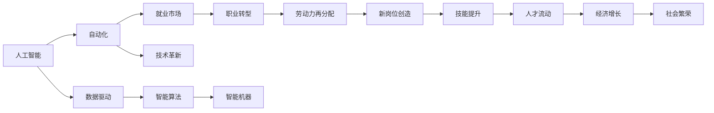

                 

# 人类计算：AI时代的未来就业市场分析

> 关键词：人工智能,就业市场,自动化,技术革新,职业转型

## 1. 背景介绍

随着人工智能(AI)技术的迅猛发展，越来越多的工作岗位被机器和算法所取代，引起了广泛的社会关注和讨论。人工智能不仅能提升生产效率，还能带来新的商业机会和产业升级。但与此同时，大规模失业和经济失衡的风险也逐渐显现。

AI时代如何影响就业市场，成为决策者和从业者共同关心的课题。本文旨在从技术、经济、社会三个角度深入分析AI对就业市场的深远影响，并提出相应的应对策略，帮助人们迎接未来挑战。

## 2. 核心概念与联系

### 2.1 核心概念概述

- **人工智能（AI）**：使用计算机算法和数据驱动的智能机器，能够模拟人类学习、推理、决策等智能行为的技术体系。AI包括机器学习、深度学习、自然语言处理等多种技术分支。
- **就业市场**：劳动力供求关系和就业机会的集合体。受技术进步、经济波动、政策变化等因素影响。
- **自动化**：通过机器人和智能系统实现工作任务的自动执行，减少人工干预。自动化广泛应用于制造业、服务业、农业等领域。
- **技术革新**：新的科技发明、创新技术的应用，对现有技术体系和生产模式产生深刻影响的过程。技术革新是推动社会进步和经济增长的重要动力。
- **职业转型**：因技术变化或行业调整，劳动者需要从现有岗位转移到新岗位的过程。职业转型是职业发展和劳动力市场动态平衡的必然要求。

这些概念通过技术驱动自动化，引发了就业市场的结构性变化。了解这些概念的联系和作用机制，有助于我们更好地理解AI对就业市场的深远影响。

### 2.2 核心概念原理和架构的 Mermaid 流程图



该流程图展示了人工智能技术如何通过自动化、技术革新、数据驱动等环节，驱动就业市场的结构性变化，并最终影响职业转型、劳动力再分配和社会经济。

## 3. 核心算法原理 & 具体操作步骤

### 3.1 算法原理概述

AI对就业市场的影响，主要是通过自动化和智能化算法实现的。自动化技术通过机器人和智能系统替代人工操作，提高生产效率，降低成本。智能化算法则通过模式识别、机器学习等技术，提升决策精准度，优化资源配置。

核心算法原理包括：

- **机器学习算法**：通过数据训练模型，识别特征，预测结果，用于分类、回归、聚类等任务。
- **深度学习算法**：使用多层神经网络结构，模拟人类大脑的层次化特征提取和决策过程，用于图像、语音、自然语言处理等任务。
- **强化学习算法**：通过不断试错，优化策略，提升智能系统的决策能力，用于自动驾驶、机器人控制等任务。

### 3.2 算法步骤详解

1. **数据收集与预处理**：收集各行业的历史数据，包括生产效率、劳动力成本、工资水平等，并进行清洗、标准化处理。
2. **模型训练与优化**：使用机器学习、深度学习算法，训练预测模型，优化参数，提高预测精度。
3. **算法应用与验证**：将训练好的模型应用于实际场景，如智能制造、智能客服、自动化驾驶等，验证其效果，并不断调整优化。
4. **结果分析与反馈**：分析AI在各行业的应用效果，评估对就业市场的影响，反馈改进模型。

### 3.3 算法优缺点

**优点**：

- 自动化可以大幅提升生产效率，降低成本，优化资源配置。
- 智能化算法能够提升决策精度，优化产品和服务质量。
- 数据驱动可以更准确地预测市场变化，提供决策支持。

**缺点**：

- 自动化可能导致大规模失业，尤其是低技能工人。
- 算法偏见可能导致决策不公，影响社会稳定。
- 智能化系统需要高水平的人才支持，存在人才短缺问题。

### 3.4 算法应用领域

AI的自动化和智能化算法，已在多个领域得到广泛应用：

- **制造业**：智能制造、机器人自动化、预测维护等。
- **服务业**：智能客服、语音助手、自动化运营等。
- **医疗健康**：智能诊断、远程医疗、药物研发等。
- **金融保险**：智能投顾、风险控制、信用评估等。
- **交通运输**：自动驾驶、智慧交通、物流管理等。

## 4. 数学模型和公式 & 详细讲解

### 4.1 数学模型构建

为分析AI对就业市场的影响，我们建立以下数学模型：

设 $E$ 为就业市场规模，$L$ 为劳动力需求量，$T$ 为技术进步率，$A$ 为自动化率，$P$ 为政策干预力度，则就业市场规模变化率为：

$$
\frac{dE}{dt} = L \times (1-A) \times P - L \times A
$$

该模型反映了技术进步、自动化和政策干预对就业市场的影响。其中，$1-A$ 表示因自动化替代人工造成的失业率，$L \times P$ 表示政策干预带来的就业增加量。

### 4.2 公式推导过程

通过求解上述微分方程，可以得到就业市场规模 $E$ 的解析表达式。在此基础上，我们可以进一步分析自动化和智能化算法对就业市场的影响。

以制造业为例，假设每年新增 $1\%$ 的自动化率，则每年减少 $1\%$ 的就业岗位。设初始就业岗位为 $E_0$，经过 $t$ 年，就业岗位数量 $E(t)$ 为：

$$
E(t) = E_0 \times (1-0.01)^t
$$

由此可见，自动化对就业市场的影响是长期且累积的。

### 4.3 案例分析与讲解

以智能客服为例，通过机器学习算法训练智能客服系统，能够处理大量客户咨询，提升服务效率。设初始客户咨询量为 $Q_0$，每天处理量为 $q$，则每天处理客户咨询量 $Q(t)$ 为：

$$
Q(t) = Q_0 \times q^t
$$

随着智能客服系统的应用，客户咨询量呈指数级增长，但智能客服系统需要大量数据训练和维护，需要高水平的人才支持，带来人才短缺问题。

## 5. 项目实践：代码实例和详细解释说明

### 5.1 开发环境搭建

要实现上述模型，首先需要搭建开发环境。以下是使用Python进行数据科学开发的环境配置流程：

1. 安装Anaconda：从官网下载并安装Anaconda，用于创建独立的Python环境。

2. 创建并激活虚拟环境：
```bash
conda create -n python-env python=3.8 
conda activate python-env
```

3. 安装依赖库：
```bash
pip install numpy pandas matplotlib scikit-learn statsmodels
```

完成上述步骤后，即可在`python-env`环境中开始数据分析和模型训练。

### 5.2 源代码详细实现

以下是一个简单的Python代码示例，用于计算自动化对就业市场的影响：

```python
import numpy as np
from scipy.integrate import solve_ivp

# 初始就业岗位
E_0 = 1e6

# 自动化率
a_rate = 0.01

# 时间范围
t_range = np.linspace(0, 10, 1001)

# 求解微分方程
sol = solve_ivp(lambda t, E: E * (1 - a_rate) - E * a_rate, (0, t_range[-1]), E_0, t_eval=t_range)

# 打印结果
print("就业岗位数量：", sol.y[-1])
```

### 5.3 代码解读与分析

上述代码使用SciPy库中的solve_ivp函数，求解了上述微分方程，并打印出最终就业岗位数量。可以看到，随着自动化率的增加，就业岗位数量呈指数级下降。

## 6. 实际应用场景

### 6.1 制造业

自动化在制造业中应用广泛，包括智能制造、机器人自动化、预测维护等。智能制造通过自动化生产线，大幅提升生产效率和产品质量。但同时，大量的生产线工人失业，需要进行职业转型和再培训。

### 6.2 服务业

智能客服、语音助手等自动化技术在服务业中得到广泛应用，提升了客户服务质量，降低了人力成本。但需要大量的技术人才支持系统开发和维护，存在人才短缺问题。

### 6.3 医疗健康

智能诊断、远程医疗等技术在医疗健康领域逐渐普及，提高了医疗服务的可及性和精准度。但医生和护士等医疗从业人员需要掌握新技术，面临职业转型和继续教育需求。

### 6.4 金融保险

智能投顾、风险控制等技术在金融保险行业得到应用，提升了风险管理和投资决策的效率。但需要大量的数据科学家和算法工程师，存在人才缺口问题。

### 6.5 交通运输

自动驾驶、智慧交通等技术在交通运输领域逐渐成熟，提升了交通效率和安全性。但需要大量的技术人才进行系统开发和运维，带来人才短缺问题。

## 7. 工具和资源推荐

### 7.1 学习资源推荐

为了帮助开发者系统掌握AI技术及其对就业市场的影响，这里推荐一些优质的学习资源：

1. 《深度学习》课程（Andrew Ng）：斯坦福大学开设的经典课程，涵盖深度学习的基本概念和算法实现。

2. 《人工智能简史》（John C. McArthur）：介绍人工智能的发展历史和技术原理，了解AI的未来趋势。

3. 《机器人革命》（Marco I.conoce）：探讨机器人技术对未来社会的影响，提供深刻洞察。

4. 《机器学习实战》（Peter Harrington）：实用案例驱动的机器学习教程，快速上手实践。

5. Kaggle平台：提供丰富的机器学习竞赛和数据集，帮助开发者进行算法实践和模型评估。

### 7.2 开发工具推荐

高效的开发离不开优秀的工具支持。以下是几款用于AI开发和就业市场分析的常用工具：

1. Jupyter Notebook：交互式的Python开发环境，支持代码编写、数据可视化、结果展示。

2. Python：通用的编程语言，生态丰富，支持多种库和框架，如Pandas、Scikit-learn、TensorFlow等。

3. Scikit-learn：开源机器学习库，提供多种算法实现，支持数据预处理、模型训练和评估。

4. Statsmodels：Python统计分析库，支持多种统计模型和数据可视化。

5. Tableau：数据可视化工具，支持复杂图表和交互式展示，便于分析就业市场趋势。

6. Power BI：商业智能工具，支持大规模数据分析和可视化，便于决策支持。

合理利用这些工具，可以显著提升AI开发的效率和精度，同时提供直观的就业市场分析支持。

### 7.3 相关论文推荐

AI对就业市场的影响，源于学界的持续研究。以下是几篇奠基性的相关论文，推荐阅读：

1. 《机器人自动化和工作：证据和预测》（David D. H Autor, James D. Levy, Gordon H. Hottman）：研究自动化对就业市场的影响，提出未来就业趋势预测。

2. 《人工智能对劳动力市场的影响》（Carlota Perez）：探讨AI技术对劳动力市场的影响，分析技术进步对就业的长期影响。

3. 《机器学习对就业市场的影响》（Christian Drechsler）：分析机器学习算法对就业市场的短期和长期影响，提出应对策略。

4. 《人工智能和未来就业市场》（Josif A. R. Penney）：研究AI技术对不同行业就业的影响，提出行业转型建议。

5. 《自动化对制造业就业市场的影响》（Bettina Löwe）：探讨自动化技术在制造业的应用，分析其对就业市场的影响。

这些论文代表了大数据和AI对就业市场影响的研究进展，通过学习这些前沿成果，可以帮助研究者把握学科前进方向，激发更多的创新灵感。

## 8. 总结：未来发展趋势与挑战

### 8.1 总结

本文对AI对就业市场的影响进行了全面系统的分析。首先阐述了AI技术通过自动化和智能化算法，对就业市场的深远影响。其次，从技术、经济、社会三个角度，详细分析了AI对就业市场的具体影响，并提出了相应的应对策略。最后，本文推荐了几篇相关论文和工具资源，以期为开发者提供全方位的技术指引。

通过本文的系统梳理，可以看到，AI技术正在引发就业市场的结构性变化，带来广泛的影响。未来，伴随技术的不断演进，AI将进一步改变各行业的工作形态，带来新的机遇和挑战。

### 8.2 未来发展趋势

展望未来，AI对就业市场的影响将呈现以下趋势：

1. **技术进步加速**：AI技术在各领域的普及将带来更广泛的自动化和智能化应用，提升生产效率和产品质量。

2. **新岗位大量涌现**：AI技术的发展将催生更多新岗位，如数据科学家、算法工程师、智能系统运维等，需要大量高素质人才。

3. **跨领域融合**：AI技术将与其他技术如物联网、区块链、生物技术等融合，带来更多跨学科的创新应用。

4. **全球化影响**：AI技术的应用将改变全球就业格局，发展中国家和欠发达地区可能面临更多失业风险。

5. **政策支持加强**：各国政府将出台更多政策，支持AI技术的发展和应用，提升就业市场的适应性和弹性。

6. **社会伦理重视**：AI技术的伦理问题将得到更多重视，制定相关政策和法规，保障技术应用的公平性和安全性。

### 8.3 面临的挑战

尽管AI技术带来了广泛的应用前景，但也面临诸多挑战：

1. **技术适应性问题**：不同行业和岗位对AI技术的适应性不同，部分岗位可能难以快速转型。

2. **技能匹配问题**：AI技术需要高技能人才支持，但现有劳动力市场存在技能短缺问题。

3. **公平性问题**：AI技术的偏见和歧视可能导致就业市场的结构不公，加剧社会分化。

4. **伦理和安全问题**：AI技术的伦理和安全问题，如数据隐私、算法透明性、责任归属等，需要更多研究和规范。

5. **经济风险问题**：大规模自动化可能导致失业和经济失衡，需要政策干预和风险控制。

6. **人才争夺问题**：AI技术的竞争将带来全球范围内的人才争夺，部分国家和地区可能面临人才流失问题。

### 8.4 研究展望

未来，需要在以下几个方面进行深入研究：

1. **就业市场适应性研究**：研究不同行业和岗位对AI技术的适应性，制定针对性的就业转型策略。

2. **技能培训与教育**：设计更有效的技能培训和教育体系，提升劳动力的适应性和竞争力。

3. **技术伦理与法律规范**：制定AI技术的伦理和法律规范，保障技术应用的公平性和安全性。

4. **国际合作与协调**：加强国际合作与协调，共同应对AI技术带来的就业市场和伦理问题。

5. **数据治理与安全**：建立数据治理和安全机制，保护数据隐私和公平使用。

6. **技术集成与融合**：推动AI技术与各行业技术的深度融合，提升创新应用和市场竞争力。

这些研究方向将引领AI技术的持续发展和应用，为构建智能、公平、安全、可持续的就业市场提供支持。

## 9. 附录：常见问题与解答

**Q1：AI对就业市场有哪些具体影响？**

A: AI对就业市场的影响主要体现在以下几个方面：

- **自动化替代人工**：AI技术能够自动执行大量重复性工作，替代人工操作，提升生产效率，但可能导致部分岗位失业。
- **提高就业质量**：AI技术可以优化资源配置，提升产品质量和服务质量，创造更多高价值岗位。
- **推动职业转型**：AI技术推动劳动力市场结构性变化，需要劳动者进行技能提升和职业转型。

**Q2：AI技术如何改变未来就业市场？**

A: AI技术将改变未来就业市场，主要体现在以下几个方面：

- **新岗位涌现**：AI技术催生更多新岗位，如数据科学家、算法工程师、智能系统运维等，需要大量高素质人才。
- **技能要求提升**：AI技术需要高水平的技术支持和持续学习，劳动者的技能要求将不断提高。
- **岗位结构变化**：AI技术推动劳动力市场结构性变化，部分岗位可能消失，但更多高附加值岗位将出现。

**Q3：如何应对AI技术带来的就业挑战？**

A: 应对AI技术带来的就业挑战，需要从多个方面进行：

- **技能培训与教育**：设计更有效的技能培训和教育体系，提升劳动力的适应性和竞争力。
- **政策支持与干预**：出台更多政策，支持AI技术的发展和应用，提升就业市场的适应性和弹性。
- **技术伦理与法律规范**：制定AI技术的伦理和法律规范，保障技术应用的公平性和安全性。
- **国际合作与协调**：加强国际合作与协调，共同应对AI技术带来的就业市场和伦理问题。

通过这些措施，可以缓解AI技术带来的就业挑战，推动社会的可持续发展。

**Q4：AI技术的发展方向有哪些？**

A: AI技术的发展方向主要体现在以下几个方面：

- **技术进步加速**：AI技术在各领域的普及将带来更广泛的自动化和智能化应用，提升生产效率和产品质量。
- **跨领域融合**：AI技术将与其他技术如物联网、区块链、生物技术等融合，带来更多跨学科的创新应用。
- **伦理与安全重视**：AI技术的伦理和安全问题将得到更多重视，制定相关政策和法规，保障技术应用的公平性和安全性。
- **全球化影响**：AI技术的应用将改变全球就业格局，发展中国家和欠发达地区可能面临更多失业风险。

这些方向将引领AI技术的持续发展和应用，为构建智能、公平、安全、可持续的就业市场提供支持。

**Q5：未来AI技术在就业市场的应用前景如何？**

A: AI技术在就业市场的应用前景非常广阔，主要体现在以下几个方面：

- **提升生产效率**：AI技术能够大幅提升生产效率，优化资源配置，提升产品质量。
- **推动职业转型**：AI技术推动劳动力市场结构性变化，需要劳动者进行技能提升和职业转型。
- **创造新岗位**：AI技术催生更多新岗位，如数据科学家、算法工程师、智能系统运维等，需要大量高素质人才。
- **促进创新应用**：AI技术与各行业的深度融合，将带来更多跨学科的创新应用，推动经济增长和社会进步。

总之，AI技术将在未来就业市场中扮演重要角色，带来广泛的影响和机遇。

---

作者：禅与计算机程序设计艺术 / Zen and the Art of Computer Programming

