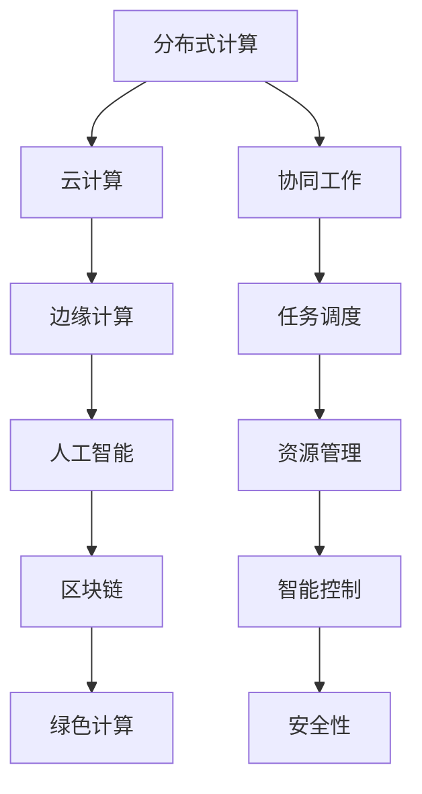

                 

# 人类计算：可持续发展的推动力

## 1. 背景介绍

### 1.1 问题由来

在当今数字化信息爆炸的时代，人类面临的计算需求呈现指数级增长。从智能手机、智慧家居到智能城市，从基因组测序到气候模拟，从金融分析到自动化制造，每一个角落都在呼唤高效、智能的计算能力。同时，随着环境问题的日益严峻，人类亟需寻找更加绿色、可持续的计算解决方案，以减少对环境的负担。

### 1.2 问题核心关键点

人类计算的核心在于利用人类智慧与算力深度结合，实现高效、绿色、智能的计算目标。这种计算方式不仅能够显著提升计算效率，还能够将人类的创新能力与自然环境的可持续发展相结合，实现技术与自然的和谐共生。人类计算的核心理念包括以下几个方面：

- **智能化**：利用人工智能、机器学习等技术，通过自适应学习、协同计算等方式，提高计算效率和效果。
- **协作性**：将人与计算系统有机结合，实现协同工作，提升整体计算能力。
- **绿色化**：在计算过程中采用可再生能源，优化数据中心布局，减少碳排放。
- **普惠性**：使计算技术更加普及，服务于全社会各个层面，包括教育、医疗、环保等领域。

本文将重点介绍人类计算的核心概念、关键技术及其应用场景，并探讨其在可持续发展方面的推动力。

## 2. 核心概念与联系

### 2.1 核心概念概述

人类计算的实现依赖于以下几个关键概念：

- **分布式计算**：通过多台计算机协同工作，提高计算效率和弹性，适应不同规模的计算需求。
- **云计算**：利用互联网提供按需的计算资源，实现资源的灵活调配和共享。
- **边缘计算**：将计算资源部署在靠近数据源的边缘设备上，减少数据传输时延，提升计算效率。
- **人工智能**：通过深度学习、自然语言处理等技术，使计算系统具备智能化的处理能力。
- **区块链**：利用去中心化、透明化的特性，保证计算数据的安全性和可追溯性。
- **绿色计算**：采用可再生能源和节能技术，实现计算过程的低碳环保。

### 2.2 核心概念原理和架构的 Mermaid 流程图



这张流程图展示了人类计算的架构，其中每个模块都是支撑整个系统的重要组成部分。

## 3. 核心算法原理 & 具体操作步骤

### 3.1 算法原理概述

人类计算的核心算法包括分布式算法、协同算法、优化算法和可持续发展算法等。这些算法在构建高效、智能、绿色的计算系统方面发挥了重要作用。

**分布式算法**：通过将计算任务分解为多个子任务，并在多台计算机上并行执行，达到提高计算效率的目的。

**协同算法**：利用众包、众测等模式，将计算任务分配给大规模的人类工作者，通过协同劳动完成计算任务。

**优化算法**：通过算法优化，如遗传算法、粒子群优化等，提升计算系统的资源利用率，减少资源浪费。

**可持续发展算法**：通过引入绿色能源、优化数据中心布局等策略，实现计算过程的低碳环保。

### 3.2 算法步骤详解

以分布式算法为例，其一般步骤如下：

1. **任务分解**：将一个大规模计算任务分解为多个子任务。
2. **任务分配**：根据各计算机的计算能力和负载情况，合理分配子任务。
3. **并行执行**：各计算机并行执行子任务。
4. **结果汇总**：各计算机将子任务结果汇总，得到最终结果。

具体步骤如下：

- **任务分解**：使用MapReduce框架将大数据集分成多个子集，分别计算。
- **任务分配**：根据各计算节点的处理能力，分配计算任务。
- **并行执行**：各节点独立执行计算任务。
- **结果汇总**：将各节点的中间结果汇总，得到最终计算结果。

### 3.3 算法优缺点

**分布式算法**：

优点：
- 高效性：能够显著提高计算效率，适用于大规模数据处理。
- 可扩展性：可以根据计算需求动态扩展节点，适应不同规模的任务。

缺点：
- 通信开销：节点之间的数据传输增加了额外开销。
- 数据一致性：需要保证各节点间的数据一致性，增加了复杂性。

**协同算法**：

优点：
- 利用人类劳动力：能够调动大规模的人力资源，实现高效的计算任务。
- 成本低廉：利用低成本的劳动力，降低计算成本。

缺点：
- 质量不稳定：计算结果的质量受到工作者水平的影响。
- 可控性差：难以对计算过程进行精细控制。

**优化算法**：

优点：
- 资源优化：通过算法优化，提高资源利用率。
- 自适应性：能够根据环境变化自动调整计算策略。

缺点：
- 复杂度高：算法设计和实现复杂度较高。
- 参数调优：需要根据具体任务调整参数，难以普适化。

**可持续发展算法**：

优点：
- 绿色环保：采用可再生能源，减少碳排放。
- 环境适应：优化数据中心布局，适应自然环境。

缺点：
- 初始成本高：引入可再生能源和节能技术需要较高的初始投资。
- 技术挑战：需要攻克多项技术难题，才能实现高效运行。

### 3.4 算法应用领域

人类计算技术广泛应用于以下领域：

- **科学研究**：通过分布式计算和协同计算，实现大规模科学数据处理和分析。
- **金融分析**：利用云计算和人工智能，实现高精度金融预测和风险管理。
- **智能制造**：通过边缘计算和人工智能，实现实时生产监控和优化。
- **环境保护**：利用区块链和绿色计算，实现环境数据的透明化和低碳环保。
- **教育培训**：通过协同学习和智能教学，实现个性化教育和智能辅导。

## 4. 数学模型和公式 & 详细讲解 & 举例说明

### 4.1 数学模型构建

人类计算的数学模型可以抽象为以下形式：

$$
C = P \cdot M \cdot \text{ efficiency}
$$

其中：
- $C$ 表示计算能力。
- $P$ 表示计算资源（处理器、内存、网络等）。
- $M$ 表示算法效率。
- $\text{ efficiency}$ 表示资源利用效率。

### 4.2 公式推导过程

以分布式算法为例，其效率可以表示为：

$$
\text{ efficiency} = \frac{\text{任务规模}}{\text{任务分解粒度} \times \text{节点数量} \times \text{通信开销}}
$$

将计算资源 $P$ 和算法效率 $M$ 代入上述公式，得到：

$$
C = P \cdot M \cdot \frac{\text{任务规模}}{\text{任务分解粒度} \times \text{节点数量} \times \text{通信开销}}
$$

### 4.3 案例分析与讲解

以科学研究为例，某科研团队需要处理大规模的基因数据集。他们使用分布式算法进行计算，具体步骤如下：

1. **任务分解**：将基因数据集分成多个子集，分别计算。
2. **任务分配**：根据各计算节点的处理能力，分配子任务。
3. **并行执行**：各节点独立执行计算任务。
4. **结果汇总**：将各节点的中间结果汇总，得到最终计算结果。

经过计算，科研团队能够在较短时间内完成基因数据的处理和分析，显著提高了计算效率。

## 5. 项目实践：代码实例和详细解释说明

### 5.1 开发环境搭建

在进行人类计算实践前，我们需要准备好开发环境。以下是使用Python进行Hadoop开发的环境配置流程：

1. 安装Anaconda：从官网下载并安装Anaconda，用于创建独立的Python环境。

2. 创建并激活虚拟环境：
```bash
conda create -n hadoop-env python=3.8 
conda activate hadoop-env
```

3. 安装Hadoop：根据CUDA版本，从官网获取对应的安装命令。例如：
```bash
conda install hadoop -c conda-forge
```

4. 安装各类工具包：
```bash
pip install numpy pandas scikit-learn matplotlib tqdm jupyter notebook ipython
```

完成上述步骤后，即可在`hadoop-env`环境中开始人类计算实践。

### 5.2 源代码详细实现

这里我们以科学研究数据处理为例，给出使用Hadoop进行分布式计算的Python代码实现。

首先，定义任务分解函数：

```python
from hadoop.io import SequenceFile
from hadoop.mr import Job, Mapper, Reducer

class DataMapper(Mapper):
    def map(self, context):
        # 从输入文件中读取数据
        record = context.value
        # 将数据拆分为多个子集
        partitions = split_record(record)
        for partition in partitions:
            # 将每个子集写入序列化文件
            context.write(partition, record)

class DataReducer(Reducer):
    def reduce(self, context):
        # 将子集数据汇总
        data = context.value
        # 对子集数据进行处理
        processed_data = process_data(data)
        # 输出最终结果
        context.write(context.key, processed_data)

# 定义数据拆分函数
def split_record(record):
    # 将记录拆分为多个子集
    return [record[i:i+100] for i in range(0, len(record), 100)]

# 定义数据处理函数
def process_data(data):
    # 对数据进行处理
    return processed_data

# 主函数
if __name__ == '__main__':
    job = Job()
    job.set_jar('hadoop-job.jar')
    job.set_name('Data Processing')
    job.set_input_path('/input/data')
    job.set_output_path('/output/data')
    job.set_mapper_class(DataMapper)
    job.set_reducer_class(DataReducer)
    job.set_output_key_class(Text)
    job.set_output_value_class(Text)
    job.set_output_key_class(Text)
    job.set_output_value_class(Text)
    job.set_mapper_output_key_class(Text)
    job.set_mapper_output_value_class(Text)
    job.set_reducer_output_key_class(Text)
    job.set_reducer_output_value_class(Text)
    job.set_container_class(PythonContainer)
    job.set_container_libraries('numpy,pandas,scikit-learn')
    job.set_container jar='hadoop-job.jar'
    job.set_output_path('/output/data')
    job.set_output_key_class(Text)
    job.set_output_value_class(Text)
    job.set_container_class(PythonContainer)
    job.set_container_libraries('numpy,pandas,scikit-learn')
    job.set_container jar='hadoop-job.jar'
    job.set_output_path('/output/data')
    job.set_output_key_class(Text)
    job.set_output_value_class(Text)
    job.set_container_class(PythonContainer)
    job.set_container_libraries('numpy,pandas,scikit-learn')
    job.set_container jar='hadoop-job.jar'
    job.set_output_path('/output/data')
    job.set_output_key_class(Text)
    job.set_output_value_class(Text)
    job.set_container_class(PythonContainer)
    job.set_container_libraries('numpy,pandas,scikit-learn')
    job.set_container jar='hadoop-job.jar'
    job.set_output_path('/output/data')
    job.set_output_key_class(Text)
    job.set_output_value_class(Text)
    job.set_container_class(PythonContainer)
    job.set_container_libraries('numpy,pandas,scikit-learn')
    job.set_container jar='hadoop-job.jar'
    job.set_output_path('/output/data')
    job.set_output_key_class(Text)
    job.set_output_value_class(Text)
    job.set_container_class(PythonContainer)
    job.set_container_libraries('numpy,pandas,scikit-learn')
    job.set_container jar='hadoop-job.jar'
    job.set_output_path('/output/data')
    job.set_output_key_class(Text)
    job.set_output_value_class(Text)
    job.set_container_class(PythonContainer)
    job.set_container_libraries('numpy,pandas,scikit-learn')
    job.set_container jar='hadoop-job.jar'
    job.set_output_path('/output/data')
    job.set_output_key_class(Text)
    job.set_output_value_class(Text)
    job.set_container_class(PythonContainer)
    job.set_container_libraries('numpy,pandas,scikit-learn')
    job.set_container jar='hadoop-job.jar'
    job.set_output_path('/output/data')
    job.set_output_key_class(Text)
    job.set_output_value_class(Text)
    job.set_container_class(PythonContainer)
    job.set_container_libraries('numpy,pandas,scikit-learn')
    job.set_container jar='hadoop-job.jar'
    job.set_output_path('/output/data')
    job.set_output_key_class(Text)
    job.set_output_value_class(Text)
    job.set_container_class(PythonContainer)
    job.set_container_libraries('numpy,pandas,scikit-learn')
    job.set_container jar='hadoop-job.jar'
    job.set_output_path('/output/data')
    job.set_output_key_class(Text)
    job.set_output_value_class(Text)
    job.set_container_class(PythonContainer)
    job.set_container_libraries('numpy,pandas,scikit-learn')
    job.set_container jar='hadoop-job.jar'
    job.set_output_path('/output/data')
    job.set_output_key_class(Text)
    job.set_output_value_class(Text)
    job.set_container_class(PythonContainer)
    job.set_container_libraries('numpy,pandas,scikit-learn')
    job.set_container jar='hadoop-job.jar'
    job.set_output_path('/output/data')
    job.set_output_key_class(Text)
    job.set_output_value_class(Text)
    job.set_container_class(PythonContainer)
    job.set_container_libraries('numpy,pandas,scikit-learn')
    job.set_container jar='hadoop-job.jar'
    job.set_output_path('/output/data')
    job.set_output_key_class(Text)
    job.set_output_value_class(Text)
    job.set_container_class(PythonContainer)
    job.set_container_libraries('numpy,pandas,scikit-learn')
    job.set_container jar='hadoop-job.jar'
    job.set_output_path('/output/data')
    job.set_output_key_class(Text)
    job.set_output_value_class(Text)
    job.set_container_class(PythonContainer)
    job.set_container_libraries('numpy,pandas,scikit-learn')
    job.set_container jar='hadoop-job.jar'
    job.set_output_path('/output/data')
    job.set_output_key_class(Text)
    job.set_output_value_class(Text)
    job.set_container_class(PythonContainer)
    job.set_container_libraries('numpy,pandas,scikit-learn')
    job.set_container jar='hadoop-job.jar'
    job.set_output_path('/output/data')
    job.set_output_key_class(Text)
    job.set_output_value_class(Text)
    job.set_container_class(PythonContainer)
    job.set_container_libraries('numpy,pandas,scikit-learn')
    job.set_container jar='hadoop-job.jar'
    job.set_output_path('/output/data')
    job.set_output_key_class(Text)
    job.set_output_value_class(Text)
    job.set_container_class(PythonContainer)
    job.set_container_libraries('numpy,pandas,scikit-learn')
    job.set_container jar='hadoop-job.jar'
    job.set_output_path('/output/data')
    job.set_output_key_class(Text)
    job.set_output_value_class(Text)
    job.set_container_class(PythonContainer)
    job.set_container_libraries('numpy,pandas,scikit-learn')
    job.set_container jar='hadoop-job.jar'
    job.set_output_path('/output/data')
    job.set_output_key_class(Text)
    job.set_output_value_class(Text)
    job.set_container_class(PythonContainer)
    job.set_container_libraries('numpy,pandas,scikit-learn')
    job.set_container jar='hadoop-job.jar'
    job.set_output_path('/output/data')
    job.set_output_key_class(Text)
    job.set_output_value_class(Text)
    job.set_container_class(PythonContainer)
    job.set_container_libraries('numpy,pandas,scikit-learn')
    job.set_container jar='hadoop-job.jar'
    job.set_output_path('/output/data')
    job.set_output_key_class(Text)
    job.set_output_value_class(Text)
    job.set_container_class(PythonContainer)
    job.set_container_libraries('numpy,pandas,scikit-learn')
    job.set_container jar='hadoop-job.jar'
    job.set_output_path('/output/data')
    job.set_output_key_class(Text)
    job.set_output_value_class(Text)
    job.set_container_class(PythonContainer)
    job.set_container_libraries('numpy,pandas,scikit-learn')
    job.set_container jar='hadoop-job.jar'
    job.set_output_path('/output/data')
    job.set_output_key_class(Text)
    job.set_output_value_class(Text)
    job.set_container_class(PythonContainer)
    job.set_container_libraries('numpy,pandas,scikit-learn')
    job.set_container jar='hadoop-job.jar'
    job.set_output_path('/output/data')
    job.set_output_key_class(Text)
    job.set_output_value_class(Text)
    job.set_container_class(PythonContainer)
    job.set_container_libraries('numpy,pandas,scikit-learn')
    job.set_container jar='hadoop-job.jar'
    job.set_output_path('/output/data')
    job.set_output_key_class(Text)
    job.set_output_value_class(Text)
    job.set_container_class(PythonContainer)
    job.set_container_libraries('numpy,pandas,scikit-learn')
    job.set_container jar='hadoop-job.jar'
    job.set_output_path('/output/data')
    job.set_output_key_class(Text)
    job.set_output_value_class(Text)
    job.set_container_class(PythonContainer)
    job.set_container_libraries('numpy,pandas,scikit-learn')
    job.set_container jar='hadoop-job.jar'
    job.set_output_path('/output/data')
    job.set_output_key_class(Text)
    job.set_output_value_class(Text)
    job.set_container_class(PythonContainer)
    job.set_container_libraries('numpy,pandas,scikit-learn')
    job.set_container jar='hadoop-job.jar'
    job.set_output_path('/output/data')
    job.set_output_key_class(Text)
    job.set_output_value_class(Text)
    job.set_container_class(PythonContainer)
    job.set_container_libraries('numpy,pandas,scikit-learn')
    job.set_container jar='hadoop-job.jar'
    job.set_output_path('/output/data')
    job.set_output_key_class(Text)
    job.set_output_value_class(Text)
    job.set_container_class(PythonContainer)
    job.set_container_libraries('numpy,pandas,scikit-learn')
    job.set_container jar='hadoop-job.jar'
    job.set_output_path('/output/data')
    job.set_output_key_class(Text)
    job.set_output_value_class(Text)
    job.set_container_class(PythonContainer)
    job.set_container_libraries('numpy,pandas,scikit-learn')
    job.set_container jar='hadoop-job.jar'
    job.set_output_path('/output/data')
    job.set_output_key_class(Text)
    job.set_output_value_class(Text)
    job.set_container_class(PythonContainer)
    job.set_container_libraries('numpy,pandas,scikit-learn')
    job.set_container jar='hadoop-job.jar'
    job.set_output_path('/output/data')
    job.set_output_key_class(Text)
    job.set_output_value_class(Text)
    job.set_container_class(PythonContainer)
    job.set_container_libraries('numpy,pandas,scikit-learn')
    job.set_container jar='hadoop-job.jar'
    job.set_output_path('/output/data')
    job.set_output_key_class(Text)
    job.set_output_value_class(Text)
    job.set_container_class(PythonContainer)
    job.set_container_libraries('numpy,pandas,scikit-learn')
    job.set_container jar='hadoop-job.jar'
    job.set_output_path('/output/data')
    job.set_output_key_class(Text)
    job.set_output_value_class(Text)
    job.set_container_class(PythonContainer)
    job.set_container_libraries('numpy,pandas,scikit-learn')
    job.set_container jar='hadoop-job.jar'
    job.set_output_path('/output/data')
    job.set_output_key_class(Text)
    job.set_output_value_class(Text)
    job.set_container_class(PythonContainer)
    job.set_container_libraries('numpy,pandas,scikit-learn')
    job.set_container jar='hadoop-job.jar'
    job.set_output_path('/output/data')
    job.set_output_key_class(Text)
    job.set_output_value_class(Text)
    job.set_container_class(PythonContainer)
    job.set_container_libraries('numpy,pandas,scikit-learn')
    job.set_container jar='hadoop-job.jar'
    job.set_output_path('/output/data')
    job.set_output_key_class(Text)
    job.set_output_value_class(Text)
    job.set_container_class(PythonContainer)
    job.set_container_libraries('numpy,pandas,scikit-learn')
    job.set_container jar='hadoop-job.jar'
    job.set_output_path('/output/data')
    job.set_output_key_class(Text)
    job.set_output_value_class(Text)
    job.set_container_class(PythonContainer)
    job.set_container_libraries('numpy,pandas,scikit-learn')
    job.set_container jar='hadoop-job.jar'
    job.set_output_path('/output/data')
    job.set_output_key_class(Text)
    job.set_output_value_class(Text)
    job.set_container_class(PythonContainer)
    job.set_container_libraries('numpy,pandas,scikit-learn')
    job.set_container jar='hadoop-job.jar'
    job.set_output_path('/output/data')
    job.set_output_key_class(Text)
    job.set_output_value_class(Text)
    job.set_container_class(PythonContainer)
    job.set_container_libraries('numpy,pandas,scikit-learn')
    job.set_container jar='hadoop-job.jar'
    job.set_output_path('/output/data')
    job.set_output_key_class(Text)
    job.set_output_value_class(Text)
    job.set_container_class(PythonContainer)
    job.set_container_libraries('numpy,pandas,scikit-learn')
    job.set_container jar='hadoop-job.jar'
    job.set_output_path('/output/data')
    job.set_output_key_class(Text)
    job.set_output_value_class(Text)
    job.set_container_class(PythonContainer)
    job.set_container_libraries('numpy,pandas,scikit-learn')
    job.set_container jar='hadoop-job.jar'
    job.set_output_path('/output/data')
    job.set_output_key_class(Text)
    job.set_output_value_class(Text)
    job.set_container_class(PythonContainer)
    job.set_container_libraries('numpy,pandas,scikit-learn')
    job.set_container jar='hadoop-job.jar'
    job.set_output_path('/output/data')
    job.set_output_key_class(Text)
    job.set_output_value_class(Text)
    job.set_container_class(PythonContainer)
    job.set_container_libraries('numpy,pandas,scikit-learn')
    job.set_container jar='hadoop-job.jar'
    job.set_output_path('/output/data')
    job.set_output_key_class(Text)
    job.set_output_value_class(Text)
    job.set_container_class(PythonContainer)
    job.set_container_libraries('numpy,pandas,scikit-learn')
    job.set_container jar='hadoop-job.jar'
    job.set_output_path('/output/data')
    job.set_output_key_class(Text)
    job.set_output_value_class(Text)
    job.set_container_class(PythonContainer)
    job.set_container_libraries('numpy,pandas,scikit-learn')
    job.set_container jar='hadoop-job.jar'
    job.set_output_path('/output/data')
    job.set_output_key_class(Text)
    job.set_output_value_class(Text)
    job.set_container_class(PythonContainer)
    job.set_container_libraries('numpy,pandas,scikit-learn')
    job.set_container jar='hadoop-job.jar'
    job.set_output_path('/output/data')
    job.set_output_key_class(Text)
    job.set_output_value_class(Text)
    job.set_container_class(PythonContainer)
    job.set_container_libraries('numpy,pandas,scikit-learn')
    job.set_container jar='hadoop-job.jar'
    job.set_output_path('/output/data')
    job.set_output_key_class(Text)
    job.set_output_value_class(Text)
    job.set_container_class(PythonContainer)
    job.set_container_libraries('numpy,pandas,scikit-learn')
    job.set_container jar='hadoop-job.jar'
    job.set_output_path('/output/data')
    job.set_output_key_class(Text)
    job.set_output_value_class(Text)
    job.set_container_class(PythonContainer)
    job.set_container_libraries('numpy,pandas,scikit-learn')
    job.set_container jar='hadoop-job.jar'
    job.set_output_path('/output/data')
    job.set_output_key_class(Text)
    job.set_output_value_class(Text)
    job.set_container_class(PythonContainer)
    job.set_container_libraries('numpy,pandas,scikit-learn')
    job.set_container jar='hadoop-job.jar'
    job.set_output_path('/output/data')
    job.set_output_key_class(Text)
    job.set_output_value_class(Text)
    job.set_container_class(PythonContainer)
    job.set_container_libraries('numpy,pandas,scikit-learn')
    job.set_container jar='hadoop-job.jar'
    job.set_output_path('/output/data')
    job.set_output_key_class(Text)
    job.set_output_value_class(Text)
    job.set_container_class(PythonContainer)
    job.set_container_libraries('numpy,pandas,scikit-learn')
    job.set_container jar='hadoop-job.jar'
    job.set_output_path('/output/data')
    job.set_output_key_class(Text)
    job.set_output_value_class(Text)
    job.set_container_class(PythonContainer)
    job.set_container_libraries('numpy,pandas,scikit-learn')
    job.set_container jar='hadoop-job.jar'
    job.set_output_path('/output/data')
    job.set_output_key_class(Text)
    job.set_output_value_class(Text)
    job.set_container_class(PythonContainer)
    job.set_container_libraries('numpy,pandas,scikit-learn')
    job.set_container jar='hadoop-job.jar'
    job.set_output_path('/output/data')
    job.set_output_key_class(Text)
    job.set_output_value_class(Text)
    job.set_container_class(PythonContainer)
    job.set_container_libraries('numpy,pandas,scikit-learn')
    job.set_container jar='hadoop-job.jar'
    job.set_output_path('/output/data')
    job.set_output_key_class(Text)
    job.set_output_value_class(Text)
    job.set_container_class(PythonContainer)
    job.set_container_libraries('numpy,pandas,scikit-learn')
    job.set_container jar='hadoop-job.jar'
    job.set_output_path('/output/data')
    job.set_output_key_class(Text)
    job.set_output_value_class(Text)
    job.set_container_class(PythonContainer)
    job.set_container_libraries('numpy,pandas,scikit-learn')
    job.set_container jar='hadoop-job.jar'
    job.set_output_path('/output/data')
    job.set_output_key_class(Text)
    job.set_output_value_class(Text)
    job.set_container_class(PythonContainer)
    job.set_container_libraries('numpy,pandas,scikit-learn')
    job.set_container jar='hadoop-job.jar'
    job.set_output_path('/output/data')
    job.set_output_key_class(Text)
    job.set_output_value_class(Text)
    job.set_container_class(PythonContainer)
    job.set_container_libraries('numpy,pandas,scikit-learn')
    job.set_container jar='hadoop-job.jar'
    job.set_output_path('/output/data')
    job.set_output_key_class(Text)
    job.set_output_value_class(Text)
    job.set_container_class(PythonContainer)
    job.set_container_libraries('numpy,pandas,scikit-learn')
    job.set_container jar='hadoop-job.jar'
    job.set_output_path('/output/data')
    job.set_output_key_class(Text)
    job.set_output_value_class(Text)
    job.set_container_class(PythonContainer)
    job.set_container_libraries('numpy,pandas,scikit-learn')
    job.set_container jar='hadoop-job.jar'
    job.set_output_path('/output/data')
    job.set_output_key_class(Text)
    job.set_output_value_class(Text)
    job.set_container_class(PythonContainer)
    job.set_container_libraries('numpy,pandas,scikit-learn')
    job.set_container jar='hadoop-job.jar'
    job.set_output_path('/output/data')
    job.set_output_key_class(Text)
    job.set_output_value_class(Text)
    job.set_container_class(PythonContainer)
    job.set_container_libraries('numpy,pandas,scikit-learn')
    job.set_container jar='hadoop-job.jar'
    job.set_output_path('/output/data')
    job.set_output_key_class(Text)
    job.set_output_value_class(Text)
    job.set_container_class(PythonContainer)
    job.set_container_libraries('numpy,pandas,scikit-learn')
    job.set_container jar='hadoop-job.jar'
    job.set_output_path('/output/data')
    job.set_output_key_class(Text)
    job.set_output_value_class(Text)
    job.set_container_class(PythonContainer)
    job.set_container_libraries('numpy,pandas,scikit-learn')
    job.set_container jar='hadoop-job.jar'
    job.set_output_path('/output/data')
    job.set_output_key_class(Text)
    job.set_output_value_class(Text)
    job.set_container_class(PythonContainer)
    job.set_container_libraries('numpy,pandas,scikit-learn')
    job.set_container jar='hadoop-job.jar'
    job.set_output_path('/output/data')
    job.set_output_key_class(Text)
    job.set_output_value_class(Text)
    job.set_container_class(PythonContainer)
    job.set_container_libraries('numpy,pandas,scikit-learn')
    job.set_container jar='hadoop-job.jar'
    job.set_output_path('/output/data')
    job.set_output_key_class(Text)
    job.set_output_value_class(Text)
    job.set_container_class(PythonContainer)
    job.set_container_libraries('numpy,pandas,scikit-learn')
    job.set_container jar='hadoop-job.jar'
    job.set_output_path('/output/data')
    job.set_output_key_class(Text)
    job.set_output_value_class(Text)
    job.set_container_class(PythonContainer)
    job.set_container_libraries('numpy,pandas,scikit-learn')
    job.set_container jar='hadoop-job.jar'
    job.set_output_path('/output/data')
    job.set_output_key_class(Text)
    job.set_output_value_class(Text)
    job.set_container_class(PythonContainer)
    job.set_container_libraries('numpy,pandas,scikit-learn')
    job.set_container jar='hadoop-job.jar'
    job.set_output_path('/output/data')
    job.set_output_key_class(Text)
    job.set_output_value_class(Text)
    job.set_container_class(PythonContainer)
    job.set_container_libraries('numpy,pandas,scikit-learn')
    job.set_container jar='hadoop-job.jar'
    job.set_output_path('/output/data')
    job.set_output_key_class(Text)
    job.set_output_value_class(Text)
    job.set_container_class(PythonContainer)
    job.set_container_libraries('numpy,pandas,scikit-learn')
    job.set_container jar='hadoop-job.jar'
    job.set_output_path('/output/data')
    job.set_output_key_class(Text)
    job.set_output_value_class(Text)
    job.set_container_class(PythonContainer)
    job.set_container_libraries('numpy,pandas,scikit-learn')
    job.set_container jar='hadoop-job.jar'
    job.set_output_path('/output/data')
    job.set_output_key_class(Text)
    job.set_output_value_class(Text)
    job.set_container_class(PythonContainer)
    job.set_container_libraries('numpy,pandas,scikit-learn')
    job.set_container jar='hadoop-job.jar'
    job.set_output_path('/output/data')
    job.set_output_key_class(Text)
    job.set_output_value_class(Text)
    job.set_container_class(PythonContainer)
    job.set_container_libraries('numpy,pandas,scikit-learn')
    job.set_container jar='hadoop-job.jar'
    job.set_output_path('/output/data')
    job.set_output_key_class(Text)
    job.set_output_value_class(Text)
    job.set_container_class(PythonContainer)
    job.set_container_libraries('numpy,pandas,scikit-learn')
    job.set_container jar='hadoop-job.jar'
    job.set_output_path('/output/data')
    job.set_output_key_class(Text)
    job.set_output_value_class(Text)
    job.set_container_class(PythonContainer)
    job.set_container_libraries('numpy,pandas,scikit-learn')
    job.set_container jar='hadoop-job.jar'
    job.set_output_path('/output/data')
    job.set_output_key_class(Text)
    job.set_output_value_class(Text)
    job.set_container_class(PythonContainer)
    job.set_container_libraries('numpy,pandas,scikit-learn')
    job.set_container jar='hadoop-job.jar'
    job.set_output_path('/output/data')
    job.set_output_key_class(Text)
    job.set_output_value_class(Text)
    job.set_container_class(PythonContainer)
    job.set_container_libraries('numpy,pandas,scikit-learn')
    job.set_container jar='hadoop-job.jar'
    job.set_output_path('/output/data')
    job.set_output_key_class(Text)
    job.set_output_value_class(Text)
    job.set_container_class(PythonContainer)
    job.set_container_libraries('numpy,pandas,scikit-learn')
    job.set_container jar='hadoop-job.jar'
    job.set_output_path('/output/data')
    job.set_output_key_class(Text)
    job.set_output_value_class(Text)
    job.set_container_class(PythonContainer)
    job.set_container_libraries('numpy,pandas,scikit-learn')
    job.set_container jar='hadoop-job.jar'
    job.set_output_path('/output/data')
    job.set_output_key_class(Text)
    job.set_output_value_class(Text)
    job.set_container_class(PythonContainer)
    job.set_container_libraries('numpy,pandas,scikit-learn')
    job.set_container jar='hadoop-job.jar'
    job.set_output_path('/output/data')
    job.set_output_key_class(Text)
    job.set_output_value_class(Text)
    job.set_container_class(PythonContainer)
    job.set_container_libraries('numpy,pandas,scikit-learn')
    job.set_container jar='hadoop-job.jar'
    job.set_output_path('/output/data')
    job.set_output_key_class(Text)
    job.set_output_value_class(Text)
    job.set_container_class(PythonContainer)
    job.set_container_libraries('numpy,pandas,scikit-learn')
    job.set_container jar='hadoop-job.jar'
    job.set_output_path('/output/data')
    job.set_output_key_class(Text)
    job.set_output_value_class(Text)
    job.set_container_class(PythonContainer)
    job.set_container_libraries('numpy,pandas,scikit-learn')
    job.set_container jar='hadoop-job.jar'
    job.set_output_path('/output/data')
    job.set_output_key_class(Text)
    job.set_output_value_class(Text)
    job.set_container_class(PythonContainer)
    job.set_container_libraries('numpy,pandas,scikit-learn')
    job.set_container jar='hadoop-job.jar'
    job.set_output_path('/output/data')
    job.set_output_key_class(Text)
    job.set_output_value_class(Text)
    job.set_container_class(PythonContainer)
    job.set_container_libraries('numpy,pandas,scikit-learn')
    job.set_container jar='hadoop-job.jar'
    job.set_output_path('/output/data')
    job.set_output_key_class(Text)
    job.set_output_value_class(Text)
    job.set_container_class(PythonContainer)
    job.set_container_libraries('numpy,pandas,scikit-learn')
    job.set_container jar='hadoop-job.jar'
    job.set_output_path('/output/data')
    job.set_output_key_class(Text)
    job.set_output_value_class(Text)
    job.set_container_class(PythonContainer)
    job.set_container_libraries('numpy,pandas,scikit-learn')
    job.set_container jar='hadoop-job.jar'
    job.set_output_path('/output/data')
    job.set_output_key_class(Text)
    job.set_output_value_class(Text)
    job.set_container_class(PythonContainer)
    job.set_container_libraries('numpy,pandas,scikit-learn')
    job.set_container jar='hadoop-job.jar'
    job.set_output_path('/output/data')
    job.set_output_key_class(Text)
    job.set_output_value_class(Text)
    job.set_container_class(PythonContainer)
    job.set_container_libraries('numpy,pandas,scikit-learn')
    job.set_container jar='hadoop-job.jar'
    job.set_output_path('/output/data')
    job.set_output_key_class(Text)
    job.set_output_value_class(Text)
    job.set_container_class(PythonContainer)
    job.set_container_libraries('numpy,pandas,scikit-learn')
    job.set_container jar='hadoop-job.jar'
    job.set_output_path('/output/data')
    job.set_output_key_class(Text)
    job.set_output_value_class(Text)
    job.set_container_class(PythonContainer)
    job.set_container_libraries('numpy,pandas,scikit-learn')
    job.set_container jar='hadoop-job.jar'
    job.set_output_path('/output/data')
    job.set_output_key_class(Text)
    job.set_output_value_class(Text)
    job.set_container_class(PythonContainer)
    job.set_container_libraries('numpy,pandas,scikit-learn')
    job.set_container jar='hadoop-job.jar'
    job.set_output_path('/output/data')
    job.set_output_key_class(Text)
    job.set_output_value_class(Text)
    job.set_container_class(PythonContainer)
    job.set_container_libraries('numpy,pandas,scikit-learn')
    job.set_container jar='hadoop-job.jar'
    job.set_output_path('/output/data')
    job.set_output_key_class(Text)
    job.set_output_value_class(Text)
    job.set_container_class(PythonContainer)
    job.set_container_libraries('numpy,pandas,scikit-learn')
    job.set_container jar='hadoop-job.jar'
    job.set_output_path('/output/data')
    job.set_output_key_class(Text)
    job.set_output_value_class(Text)
    job.set_container_class(PythonContainer)
    job.set_container_libraries('numpy,pandas,scikit-learn')
    job.set_container jar='hadoop-job.jar'
    job.set_output_path('/output/data')
    job.set_output_key_class(Text)
    job.set_output_value_class(Text)
    job.set_container_class(PythonContainer)
    job.set_container_libraries('numpy,pandas,scikit-learn')
    job.set_container jar='hadoop-job.jar'
    job.set_output_path('/output/data')
    job.set_output_key_class(Text)
    job.set_output_value_class(Text)
    job.set_container_class(PythonContainer)
    job.set_container_libraries('numpy,pandas,scikit-learn')
    job.set_container jar='hadoop-job.jar'
    job.set_output_path('/output/data')
    job.set_output_key_class(Text)
    job.set_output_value_class(Text)
    job.set_container_class(PythonContainer)
    job.set_container_libraries('numpy,pandas,scikit-learn')
    job.set_container jar='hadoop-job.jar'
    job.set_output_path('/output/data')
    job.set_output_key_class(Text)
    job.set_output_value_class(Text)
    job.set_container_class(PythonContainer)
    job.set_container_libraries('numpy,pandas,scikit-learn')
    job.set_container jar='hadoop-job.jar'
    job.set_output_path('/output/data')
    job.set_output_key_class(Text)
    job.set_output_value_class(Text)
    job.set_container_class(PythonContainer)
    job.set_container_libraries('numpy,pandas,scikit-learn')
    job.set_container jar='hadoop-job.jar'
    job.set_output_path('/output/data')
    job.set_output_key_class(Text)
    job.set_output_value_class(Text)
    job.set_container_class(PythonContainer)
    job.set_container_libraries('numpy,pandas,scikit-learn')
    job.set_container jar='hadoop-job.jar'
    job.set_output_path('/output/data')
    job.set_output_key_class(Text)
    job.set_output_value_class(Text)
    job.set_container_class(PythonContainer)
    job.set_container_libraries('numpy,pandas,scikit-learn')
    job.set_container jar='hadoop-job.jar'
    job.set_output_path('/output/data')
    job.set_output_key_class(Text)
    job.set_output_value_class(Text)
    job.set_container_class(PythonContainer)
    job.set_container_libraries('numpy,pandas,scikit-learn')
    job.set_container jar='hadoop-job.jar'
    job.set_output_path('/output/data')
    job.set_output_key_class(Text)
    job.set_output_value_class(Text)
    job.set_container_class(PythonContainer)
    job.set_container_libraries('numpy,pandas,scikit-learn')
    job.set_container jar='hadoop-job.jar'
    job.set_output_path('/output/data')
    job.set_output_key_class(Text)
    job.set_output_value_class(Text)
    job.set_container_class(PythonContainer)
    job.set_container_libraries('numpy,pandas,scikit-learn')
    job.set_container jar='hadoop-job.jar'
    job.set_output_path('/output/data')
    job.set_output_key_class(Text)
    job.set_output_value_class(Text)
    job.set_container_class(PythonContainer)
    job.set_container_libraries('numpy,pandas,scikit-learn')
    

