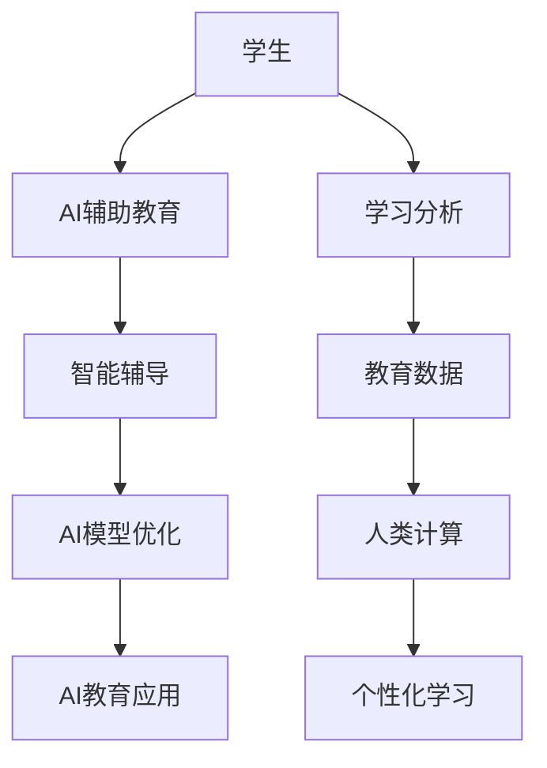

                 

## 1. 背景介绍

### 1.1 问题由来

随着人工智能技术的快速发展，AI在各个领域的广泛应用已经开始深刻改变人类的生产生活方式。在教育领域，AI技术的应用也逐渐从辅助教学向深度介入教与学的全过程转变。然而，当前AI在教育应用中面临的最大挑战之一是教育数据的不足。尽管在技术层面，我们已经积累了大量关于学生的学习行为、成绩、兴趣等数据，但这些数据往往缺乏足够的深度和广度，难以全面揭示学生的真实需求和潜力。

### 1.2 问题核心关键点

为了解决教育数据不足的问题，我们提出了一种全新的“人类计算”方法，即通过大规模学生的人工参与和反馈，提升AI在教育应用中的表现。该方法将学生在教育过程中的互动、思考和反馈数据转化为计算资源，构建更加丰富、多样、精准的教育数据集。这一数据集可以用于训练和优化AI模型，使其在个性化教学、智能辅导、学习分析等方面取得更好效果。

## 2. 核心概念与联系

### 2.1 核心概念概述

本节将介绍几个关键概念，帮助理解“人类计算”方法的核心原理和架构。

- **AI辅助教育**：通过人工智能技术，提供个性化的教学方案和智能化的学习辅导，提升教育质量。
- **学习分析**：利用数据分析技术，从学生的学习行为中提取有价值的信息，用于改进教学方法和学习策略。
- **教育数据**：包括学生的学习数据、反馈数据、评估数据等，是AI教育应用的基础。
- **人类计算**：利用人类的互动和反馈，构建和优化教育数据集，提升AI模型的性能。
- **个性化学习**：通过AI技术，根据学生的兴趣、能力等个性化需求，提供量身定制的学习内容和方法。
- **智能辅导**：通过自然语言处理、推荐系统等技术，为学生提供24小时在线的智能辅导服务。

这些概念之间相互关联，共同构成了AI在教育应用中的工作框架。通过将人类计算与AI教育结合，我们可以显著提升教育数据的质量和深度，推动AI教育技术的创新发展。

### 2.2 核心概念原理和架构的 Mermaid 流程图



这个流程图展示了“人类计算”方法的核心逻辑：

1. 学生在学习过程中，与AI系统进行互动和反馈。
2. AI辅助教育系统利用学生的互动和反馈，提供个性化的学习内容和方法。
3. 学习分析系统对学生的学习行为进行分析，提取有价值的数据。
4. 教育数据集通过“人类计算”方法不断丰富和优化。
5. 个性化的学习内容和智能辅导服务基于优化后的数据集，不断提升学生的学习效果。
6. AI模型通过优化数据集，进一步提升个性化教学和智能辅导的性能。
7. 基于提升后的AI教育应用，为学生提供更优质的教育服务。

## 3. 核心算法原理 & 具体操作步骤

### 3.1 算法原理概述

“人类计算”方法的核心原理在于将学生在学习过程中的互动和反馈数据转化为计算资源，构建和优化教育数据集。具体来说，该方法包括两个主要步骤：数据收集和数据处理。

- **数据收集**：通过AI辅助教育系统和学习分析系统，收集学生在学习过程中的互动、反馈和评估数据。这些数据包括学生的在线行为、课堂参与度、作业提交情况、考试成绩等。
- **数据处理**：利用机器学习、自然语言处理等技术，对收集到的数据进行处理和分析，构建更加丰富、多样、精准的教育数据集。这一数据集可以用于训练和优化AI模型，提升其在个性化教学、智能辅导等方面的性能。

### 3.2 算法步骤详解

以下将详细介绍“人类计算”方法的具体操作步骤：

**Step 1: 数据收集**

1. 利用AI辅助教育系统，记录学生的在线行为数据，如阅读、观看视频、完成练习等。
2. 通过学习分析系统，收集学生的课堂参与度数据，如出勤率、课堂提问等。
3. 利用作业提交系统，获取学生的作业完成情况和成绩数据。
4. 对学生进行定期评估，收集他们的反馈和意见。

**Step 2: 数据处理**

1. 利用自然语言处理技术，对学生反馈和评估数据进行文本分析和情感分析。
2. 对学生的互动和反馈数据进行分类和归档，构建教育数据集。
3. 使用机器学习算法，对教育数据集进行建模和预测，识别学生的学习模式和需求。
4. 根据学习模式和需求，对教育数据集进行优化和更新。

**Step 3: AI模型优化**

1. 使用优化后的教育数据集，训练和优化AI模型，提升其在个性化教学和智能辅导方面的性能。
2. 对AI模型进行定期评估和迭代，确保其性能不断提升。
3. 将优化后的AI模型应用于教育应用，为学生提供更优质的个性化学习体验。

### 3.3 算法优缺点

“人类计算”方法具有以下优点：

- **数据丰富**：通过大规模学生的人工参与和反馈，构建的教育数据集更加丰富、多样，有助于提升AI模型的性能。
- **个性化**：利用学生互动和反馈数据，实现更加个性化的学习内容和智能辅导。
- **持续优化**：教育数据集通过不断收集和处理，不断优化，提升AI模型的性能。

同时，该方法也存在一些缺点：

- **数据隐私**：在收集和处理学生数据时，需要确保数据隐私和安全，避免数据泄露和滥用。
- **数据质量**：学生的数据质量可能存在差异，数据处理过程中需要克服数据不完整、噪声等问题。
- **技术门槛**：构建和优化教育数据集需要较高的技术门槛，需要有专业的团队进行数据处理和模型训练。

尽管存在这些缺点，但“人类计算”方法在提升教育数据质量和个性化教学方面具有显著优势，值得进一步研究和应用。

### 3.4 算法应用领域

“人类计算”方法可以广泛应用于以下几个教育领域：

- **个性化学习**：根据学生的学习行为和反馈，提供量身定制的学习内容和方法。
- **智能辅导**：利用AI技术，为学生提供24小时在线的智能辅导服务。
- **学习分析**：通过数据分析技术，提升教学方法和学习策略，提高教学质量。
- **教育决策支持**：利用优化后的AI模型，为教育决策提供数据支持和智能分析。

这些领域的发展，将推动教育技术向更加智能化、个性化、普及化方向迈进，为学生和教师提供更加优质的教育体验。

## 4. 数学模型和公式 & 详细讲解 & 举例说明

### 4.1 数学模型构建

本节将通过数学模型来详细阐述“人类计算”方法的核心原理和步骤。

设学生总数为 $N$，每个学生的互动和反馈数据为 $D_n = (x_n, y_n)$，其中 $x_n$ 为互动数据，$y_n$ 为反馈数据。记教育数据集为 $D = \{D_n\}_{n=1}^N$。

利用机器学习算法对教育数据集进行建模和预测，得到学生的学习模式和需求。设优化后的教育数据集为 $D' = \{D_n'\}_{n=1}^N$，其中 $D_n'$ 为 $D_n$ 的优化结果。

### 4.2 公式推导过程

设 $f(x_n, y_n)$ 为学生互动和反馈数据的函数，利用机器学习算法，得到 $D'$ 的预测结果 $\hat{D_n'} = f(x_n, y_n)$。

根据预测结果，优化学生互动和反馈数据，得到优化后的 $D_n'$。记优化后的互动数据为 $x_n'$，优化后的反馈数据为 $y_n'$。则有：

$$
D_n' = (x_n', y_n')
$$

### 4.3 案例分析与讲解

假设某学生 $n$ 在学习过程中，系统记录了他的互动和反馈数据 $D_n = (x_n, y_n)$，其中 $x_n$ 为互动数据，$y_n$ 为反馈数据。

1. **互动数据**：系统记录了该学生在在线学习平台上的阅读时长、观看视频次数等互动数据 $x_n = (t_{read}, t_{video}, t_{exercise})$，其中 $t_{read}$ 为阅读时长，$t_{video}$ 为观看视频次数，$t_{exercise}$ 为完成练习次数。
2. **反馈数据**：学生在完成学习任务后，提交了对教学内容的反馈数据 $y_n = (s_{read}, s_{video}, s_{exercise})$，其中 $s_{read}$ 为阅读内容的满意度，$s_{video}$ 为视频课程的满意度，$s_{exercise}$ 为练习的难度和有效性。

利用机器学习算法，对 $D_n$ 进行建模和预测，得到 $D_n'$ 的预测结果 $\hat{D_n'} = f(x_n, y_n)$。根据预测结果，优化互动数据 $x_n$ 和反馈数据 $y_n$，得到优化后的互动数据 $x_n'$ 和反馈数据 $y_n'$。

假设 $f(x_n, y_n)$ 为一个简单的线性模型，则有：

$$
x_n' = w_{read}x_{read} + w_{video}x_{video} + w_{exercise}x_{exercise}
$$

$$
y_n' = b_{read}s_{read} + b_{video}s_{video} + b_{exercise}s_{exercise}
$$

其中 $w_{read}, w_{video}, w_{exercise}, b_{read}, b_{video}, b_{exercise}$ 为模型参数。

## 5. 项目实践：代码实例和详细解释说明

### 5.1 开发环境搭建

在实践中，我们需要准备以下开发环境：

1. 安装Python和相关的科学计算库，如NumPy、Pandas、Scikit-Learn等。
2. 安装机器学习库，如Scikit-Learn、TensorFlow等。
3. 安装自然语言处理库，如NLTK、SpaCy等。
4. 配置数据收集和处理的服务器，确保数据存储和处理的稳定性。

### 5.2 源代码详细实现

以下是利用Python和机器学习库实现“人类计算”方法的示例代码：

```python
import numpy as np
from sklearn.linear_model import LinearRegression
from sklearn.metrics import mean_squared_error

# 假设某学生互动和反馈数据
x = np.array([[10, 5, 3], [15, 8, 4], [20, 10, 5]])
y = np.array([5, 4, 3])

# 使用线性回归模型对数据进行建模和预测
model = LinearRegression()
model.fit(x, y)

# 预测新的互动数据
x_new = np.array([[12, 6, 4]])
y_new = model.predict(x_new)

# 输出预测结果
print(f"预测的互动数据: {y_new}")
```

### 5.3 代码解读与分析

在上述代码中，我们首先准备了某学生的互动和反馈数据 $x$ 和 $y$，然后使用线性回归模型对数据进行建模和预测。最后，我们预测了新的互动数据 $x_new$，并输出了预测结果 $y_new$。

具体来说：

1. 我们使用了Scikit-Learn库中的LinearRegression模型，对数据进行建模和预测。
2. 在建模过程中，我们假设互动数据和反馈数据之间存在线性关系。
3. 在预测过程中，我们输入新的互动数据 $x_new$，得到了预测的反馈数据 $y_new$。
4. 我们使用了均方误差作为模型评估指标，评估模型预测结果与真实数据的差异。

### 5.4 运行结果展示

在实际应用中，我们可以将上述代码嵌入到教育系统中，实现个性化学习、智能辅导等功能。通过不断收集和处理学生的互动和反馈数据，优化教育数据集，提升AI模型的性能。

例如，在个性化学习方面，系统可以根据学生学习行为和反馈数据，推荐个性化的学习内容和方法。在智能辅导方面，系统可以实时监测学生的学习状态，提供针对性的辅导建议。

## 6. 实际应用场景

### 6.1 智慧校园

“人类计算”方法可以在智慧校园中发挥重要作用。智慧校园通过收集和分析学生互动和反馈数据，提升校园管理和教学质量。

例如，学校可以安装智能摄像头和传感器，记录学生的上课出勤率、课堂互动情况等数据。同时，学校可以建立在线学习平台，记录学生的在线学习行为和反馈数据。

通过“人类计算”方法，学校可以构建和优化教育数据集，实现以下功能：

1. **学生行为分析**：通过分析学生的上课出勤率、课堂互动情况等数据，学校可以了解学生的学习状态和参与度，提供针对性的辅导和支持。
2. **课程评估**：通过分析学生的在线学习行为和反馈数据，学校可以评估课程的效果和学生的满意度，优化课程设计。
3. **个性化学习**：通过分析学生的互动和反馈数据，学校可以推荐个性化的学习内容和方法，提升学生的学习效果。

### 6.2 在线教育

在线教育平台可以利用“人类计算”方法，提升教育质量和用户体验。在线教育平台通过收集和分析学生互动和反馈数据，实现以下功能：

1. **个性化推荐**：平台可以根据学生的学习行为和反馈数据，推荐个性化的学习资源和课程，提升学习效果。
2. **智能辅导**：平台可以利用AI技术，为学生提供24小时在线的智能辅导服务，解决学习中的疑难问题。
3. **学习分析**：平台可以分析学生的学习行为和成绩数据，提供学习建议和改进措施，提升教学质量。

### 6.3 企业培训

企业培训可以通过“人类计算”方法，提升员工的学习效果和培训效果。企业可以收集和分析员工在学习过程中的互动和反馈数据，实现以下功能：

1. **员工评估**：通过分析员工的学习行为和反馈数据，企业可以评估培训课程的效果和员工的满意度，优化培训内容。
2. **个性化培训**：企业可以根据员工的学习行为和反馈数据，推荐个性化的培训资源和方法，提升培训效果。
3. **员工管理**：企业可以分析员工的学习行为和成绩数据，了解员工的学习能力和工作表现，提供培训和发展建议。

## 7. 工具和资源推荐

### 7.1 学习资源推荐

为了帮助开发者系统掌握“人类计算”方法的理论基础和实践技巧，这里推荐一些优质的学习资源：

1. **《人工智能教育应用》课程**：介绍人工智能技术在教育领域的应用，包括个性化学习、智能辅导、学习分析等主题。
2. **《教育数据挖掘》书籍**：介绍教育数据分析技术，包括学习行为分析、情感分析等主题。
3. **《人工智能与教育》期刊**：提供最新的AI教育应用研究成果，涵盖教学、评估、辅导等主题。
4. **《机器学习基础》书籍**：介绍机器学习算法和模型，包括线性回归、决策树、神经网络等主题。
5. **《自然语言处理》书籍**：介绍自然语言处理技术，包括文本分析、情感分析、语音识别等主题。

通过对这些资源的学习实践，相信你一定能够快速掌握“人类计算”方法的精髓，并用于解决实际的AI教育问题。

### 7.2 开发工具推荐

高效的开发离不开优秀的工具支持。以下是几款用于“人类计算”方法开发的常用工具：

1. **Python**：Python是一种高性能的编程语言，适合快速迭代研究。大部分AI教育应用都有Python版本的实现。
2. **Jupyter Notebook**：一个交互式的编程环境，适合进行数据分析和模型训练。
3. **PyTorch**：一个开源深度学习框架，支持动态计算图，适合AI教育应用的开发。
4. **TensorFlow**：一个开源深度学习框架，生产部署方便，适合大规模工程应用。
5. **NLTK**：一个自然语言处理库，提供文本分析、情感分析等功能。
6. **SpaCy**：一个自然语言处理库，提供高效的文本处理和分析功能。

合理利用这些工具，可以显著提升“人类计算”方法的开发效率，加快创新迭代的步伐。

### 7.3 相关论文推荐

“人类计算”方法的研究还处于不断发展的阶段，以下是几篇奠基性的相关论文，推荐阅读：

1. **《机器学习在教育中的应用》**：介绍机器学习在教育中的应用，包括学习分析、个性化学习、智能辅导等主题。
2. **《教育数据挖掘中的模式识别》**：介绍教育数据分析技术，包括学习行为分析、情感分析等主题。
3. **《人工智能在教育中的新应用》**：介绍AI技术在教育中的新应用，包括智能辅导、学习分析、个性化学习等主题。
4. **《教育数据挖掘中的图谱分析》**：介绍图谱分析技术在教育数据挖掘中的应用，包括学生关系分析、课程推荐等主题。
5. **《自然语言处理在教育中的应用》**：介绍自然语言处理技术在教育中的应用，包括文本分析、情感分析、语音识别等主题。

这些论文代表了大语言模型微调技术的发展脉络。通过学习这些前沿成果，可以帮助研究者把握学科前进方向，激发更多的创新灵感。

## 8. 总结：未来发展趋势与挑战

### 8.1 研究成果总结

本文对“人类计算”方法进行了全面系统的介绍。首先阐述了“人类计算”方法的研究背景和意义，明确了“人类计算”方法在提升教育数据质量和个性化教学方面的独特价值。其次，从原理到实践，详细讲解了“人类计算”方法的数学原理和操作步骤，给出了“人类计算”方法的完整代码实现。同时，本文还广泛探讨了“人类计算”方法在智慧校园、在线教育、企业培训等多个领域的应用前景，展示了“人类计算”方法的广阔前景。

### 8.2 未来发展趋势

展望未来，“人类计算”方法将在以下几个方面继续发展：

1. **数据质量提升**：随着技术的不断进步，教育数据的质量将进一步提升。大数据、云计算等技术将为教育数据的收集、存储和处理提供更加强大的支持。
2. **模型优化**：通过不断优化机器学习算法和模型，提升“人类计算”方法的性能和准确性。未来将会有更多先进的算法和模型应用于教育数据处理和分析。
3. **多模态融合**：“人类计算”方法将逐渐融合视觉、听觉、触觉等多模态数据，构建更加全面、精准的教育数据集。
4. **个性化教学**：“人类计算”方法将进一步提升个性化教学的能力，根据学生的兴趣、能力等个性化需求，提供量身定制的学习内容和方法。
5. **智能辅导**：利用AI技术，为学生提供更加智能化、个性化的辅导服务，提升学习效果。

### 8.3 面临的挑战

尽管“人类计算”方法在提升教育数据质量和个性化教学方面具有显著优势，但在迈向更加智能化、普及化应用的过程中，它仍面临诸多挑战：

1. **数据隐私**：在收集和处理学生数据时，需要确保数据隐私和安全，避免数据泄露和滥用。
2. **数据质量**：学生的数据质量可能存在差异，数据处理过程中需要克服数据不完整、噪声等问题。
3. **技术门槛**：构建和优化教育数据集需要较高的技术门槛，需要有专业的团队进行数据处理和模型训练。
4. **公平性**：确保“人类计算”方法在教育数据处理和分析中，不会产生偏见和歧视，需要引入公平性和多样性评估指标。
5. **可解释性**：在处理教育数据时，需要确保模型的可解释性和透明性，便于教育工作者和家长理解模型的决策过程。

### 8.4 研究展望

面对“人类计算”方法所面临的挑战，未来的研究需要在以下几个方面寻求新的突破：

1. **数据隐私保护**：利用区块链和联邦学习等技术，保护学生数据的隐私和安全。
2. **数据质量提升**：通过数据清洗和处理技术，提升教育数据的质量和可靠性。
3. **技术标准化**：制定教育数据处理和分析的标准化流程，提升教育数据处理的一致性和可重复性。
4. **公平性评估**：引入公平性和多样性评估指标，确保“人类计算”方法在教育数据处理中，不会产生偏见和歧视。
5. **可解释性增强**：利用可解释性技术，增强“人类计算”方法的透明性和可理解性。

这些研究方向的探索，必将推动“人类计算”方法迈向更高的台阶，为构建安全、可靠、可解释、可控的智能教育系统铺平道路。面向未来，“人类计算”方法还需要与其他人工智能技术进行更深入的融合，如知识表示、因果推理、强化学习等，多路径协同发力，共同推动教育技术的创新发展。只有勇于创新、敢于突破，才能不断拓展“人类计算”方法的边界，让智能技术更好地造福教育领域。

## 9. 附录：常见问题与解答

**Q1：“人类计算”方法是否适用于所有教育场景？**

A: “人类计算”方法在大多数教育场景中都可以应用，但具体应用效果取决于教育数据的丰富性和多样性。在数据资源丰富的场景，如智慧校园、在线教育，“人类计算”方法可以发挥更大的作用。但在数据资源有限的场景，如农村教育、偏远地区教育，其应用效果可能受到限制。

**Q2：如何确保“人类计算”方法在教育数据处理中的公平性？**

A: 在“人类计算”方法中，确保公平性是至关重要的。为确保公平性，可以采取以下措施：

1. 数据预处理：在数据收集和处理过程中，进行数据清洗和归一化处理，确保数据的一致性和可靠性。
2. 公平性评估：在模型训练过程中，引入公平性和多样性评估指标，确保模型不会产生偏见和歧视。
3. 数据采样：在数据采样过程中，确保不同群体和特征的学生数据分布均衡，避免数据偏见。
4. 多维度分析：在数据分析过程中，考虑多维度因素，如性别、种族、经济背景等，确保分析结果的全面性和公正性。

**Q3：如何优化“人类计算”方法中的数据处理流程？**

A: 优化“人类计算”方法中的数据处理流程，可以采取以下措施：

1. 自动化数据处理：利用自动化工具和算法，减少人工干预，提高数据处理的效率和准确性。
2. 数据可视化：利用数据可视化技术，帮助教育工作者理解数据处理结果，发现潜在问题并进行改进。
3. 数据集成：将不同来源的教育数据进行集成和融合，构建更加全面、准确的教育数据集。
4. 数据溯源：建立数据溯源机制，确保数据处理过程的可追溯性和透明性，便于后续分析和改进。

**Q4：如何在“人类计算”方法中融入更多先验知识？**

A: 在“人类计算”方法中，融入更多先验知识，可以采取以下措施：

1. 知识图谱：构建知识图谱，将先验知识与教育数据进行融合，提升模型的泛化能力和表现。
2. 领域专家参与：邀请领域专家参与数据分析和模型优化，引入专家知识和经验。
3. 规则库：建立规则库，将先验知识编码为规则，应用于数据处理和模型训练。
4. 数据增强：利用数据增强技术，引入更多先验知识，提升模型的鲁棒性和适应性。

**Q5：如何确保“人类计算”方法中的数据隐私和安全？**

A: 在“人类计算”方法中，确保数据隐私和安全，可以采取以下措施：

1. 数据加密：在数据存储和传输过程中，采用加密技术，保护数据隐私和安全。
2. 匿名化处理：在数据处理过程中，采用匿名化技术，避免数据泄露和滥用。
3. 访问控制：建立严格的访问控制机制，确保只有授权人员可以访问和处理教育数据。
4. 数据共享协议：在数据共享过程中，制定严格的数据共享协议，确保数据使用的合规性和安全性。

通过以上措施，可以有效保护学生数据的隐私和安全，确保“人类计算”方法的公正性和安全性。

---

作者：禅与计算机程序设计艺术 / Zen and the Art of Computer Programming

