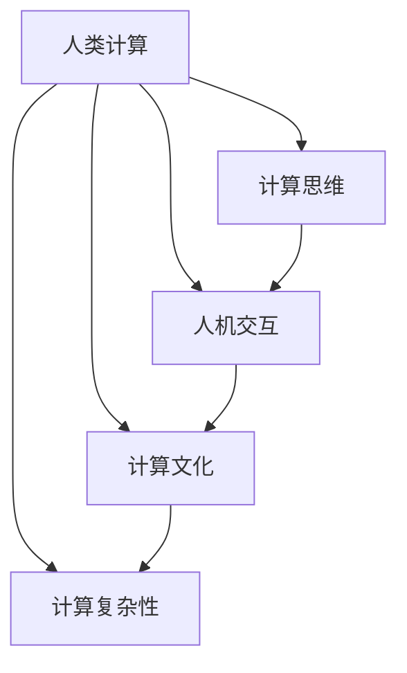

                 

# 人类计算：连接人与机器的桥梁

> 关键词：人类计算,人机交互,计算思维,计算复杂性,人工智能,计算机科学,计算文化

## 1. 背景介绍

### 1.1 问题由来
随着信息技术的快速发展，人类社会的计算模式正在发生深刻变革。过去几十年间，计算机硬件的进步带来了计算能力的指数级提升，使得海量数据处理和复杂问题求解变得可能。然而，计算的巨量化并没有让人们的生活变得更简单，反而带来了一系列新的挑战：

- **计算复杂性增加**：大规模数据和高性能计算带来了新的计算复杂性问题，单纯依赖计算机已经难以应对。
- **计算文化缺失**：计算思维的缺失使得更多人难以理解和利用计算机技术，计算文化的普及成为瓶颈。
- **人机交互隔阂**：传统计算机以“冷冰冰”的界面面对用户，缺乏情感和感知，难以形成紧密的人机交互。

这些问题呼唤一种新的计算范式，不仅要解决计算复杂性问题，更要强化计算思维和文化，同时弥合人机交互的隔阂，让机器能够更好地理解人类的需求和情感。人类计算（Human Computing）的概念应运而生。

### 1.2 问题核心关键点
人类计算是一个多学科交叉的计算范式，旨在通过将人类的智慧与计算机的计算能力相结合，实现更高效、更智能、更人性化的计算。其核心关键点包括：

- **人机协同**：结合人类的逻辑推理和计算能力，优化计算过程，减少计算资源的消耗。
- **计算文化**：培养公众的计算思维，增强对计算机科学和技术的理解和应用。
- **交互透明性**：实现机器与人类情感和行为的智能感知，构建透明的人机交互环境。

人类计算旨在通过构建更智能化、更人性化、更高效的计算系统，推动计算技术在各个领域的应用，改善人类生活质量。

### 1.3 问题研究意义
研究人类计算，对于推动计算技术的普及和发展，具有重要意义：

1. **提升计算效率**：结合人类的智慧与机器的计算能力，能够更高效地解决复杂计算问题。
2. **促进计算文化**：培养公众的计算思维，提升全民的科技素养，推动计算技术的应用。
3. **改善人机交互**：增强机器的情感感知和交互透明性，构建更和谐的人机协同环境。
4. **拓展应用边界**：推动计算技术在医疗、教育、金融等各个领域的应用，改善社会生产和生活方式。

通过研究人类计算，可以探索计算技术的新路径，推动计算文化的发展，同时实现更高效、更智能、更人性化的人机交互，提升计算技术对社会的贡献。

## 2. 核心概念与联系

### 2.1 核心概念概述

为了更好地理解人类计算的原理和应用，本节将介绍几个关键概念：

- **人类计算（Human Computing）**：结合人类智慧和计算能力的计算范式，旨在通过人机协同提升计算效率，改善人机交互。
- **计算思维（Computational Thinking）**：一种思维方式，强调利用计算模型和算法解决实际问题，培养公众的计算素养。
- **人机交互（Human-Computer Interaction, HCI）**：研究人与计算机交互的方式，提升交互的自然性和透明性。
- **计算文化（Computational Culture）**：一种文化，旨在提升公众对计算技术的应用和理解，促进计算技术的普及。
- **计算复杂性（Computational Complexity）**：研究计算问题的复杂性，寻找最优或近似最优的算法。

这些概念之间相互关联，共同构成了人类计算的理论基础和应用框架。人类计算不仅强调计算的效率，更注重计算的过程和结果对人类社会的意义。

### 2.2 核心概念原理和架构的 Mermaid 流程图



这个流程图展示了人类计算的核心概念及其相互关系：

1. **计算思维**：作为人类计算的核心，计算思维强调利用计算模型和算法解决问题，培养公众的计算素养。
2. **人机交互**：通过优化人机交互，提升计算机系统的自然性和透明性，构建更和谐的人机协同环境。
3. **计算文化**：推动计算技术的普及，提升公众对计算技术的理解和应用，增强计算思维。
4. **计算复杂性**：研究计算问题的复杂性，寻找最优或近似最优的算法，提升计算效率。

这些概念相互支持，共同构建了人类计算的理论基础和应用框架。

## 3. 核心算法原理 & 具体操作步骤
### 3.1 算法原理概述

人类计算的核心理论主要基于以下原理：

1. **分布式计算**：通过将计算任务分解为多个子任务，分配给不同的人类和计算机进行处理，从而提升计算效率。
2. **众包计算**：利用大众的智慧和计算能力，通过互联网平台进行任务分配和结果收集，实现更广泛的数据处理和问题求解。
3. **计算思维**：利用计算模型和算法，模拟人类的思维过程，解决复杂问题。
4. **人机交互优化**：通过优化人机交互界面和协议，提升计算过程的自然性和透明性，实现更高效的人机协同。
5. **计算文化普及**：通过教育和技术传播，提升公众对计算技术的理解和应用，增强计算思维。

这些原理共同构成了人类计算的核心算法和技术体系，旨在通过人机协同提升计算效率，改善人机交互，推动计算文化的普及和发展。

### 3.2 算法步骤详解

人类计算的算法步骤主要包括以下几个环节：

**Step 1: 问题定义与分解**
- 明确计算问题的核心需求和目标。
- 将问题分解为多个子问题，确定每个子问题的求解方式。

**Step 2: 任务分配与协同**
- 将子问题分配给不同的人类和计算机进行计算。
- 通过网络平台或协作工具，实现任务分配、进度跟踪和结果收集。

**Step 3: 计算思维应用**
- 利用计算模型和算法，模拟人类的思维过程，解决复杂问题。
- 应用迭代、回溯、搜索等计算思维，优化问题求解过程。

**Step 4: 交互界面设计**
- 设计自然、透明、高效的人机交互界面，提升计算过程的自然性和透明性。
- 利用图形化界面、自然语言处理等技术，增强交互的直观性和易用性。

**Step 5: 计算文化推广**
- 通过教育和技术传播，提升公众对计算技术的理解和应用。
- 通过案例分析和演示，展示计算思维在实际问题求解中的应用。

### 3.3 算法优缺点

人类计算的优点包括：

1. **提升计算效率**：通过人机协同，能够更高效地解决复杂计算问题。
2. **改善人机交互**：通过优化交互界面和协议，实现更高效、更自然的人机协同。
3. **普及计算文化**：通过教育和技术传播，提升公众对计算技术的理解和应用，增强计算思维。

然而，人类计算也存在一定的局限性：

1. **资源分配问题**：不同任务的分配需要高效的资源调度算法，以确保任务均衡。
2. **数据隐私和安全**：通过众包平台处理数据时，需要确保数据隐私和安全，避免数据泄露和滥用。
3. **交互透明性**：优化交互界面和协议需要更多的研究和实践，以实现更高透明性和自然性。
4. **计算文化普及难度**：需要更多的时间和资源来推广计算文化，提升公众的计算素养。

### 3.4 算法应用领域

人类计算在多个领域都有广泛的应用，包括但不限于：

1. **科学计算**：通过人机协同，优化科学计算过程，提升计算效率和科学发现。
2. **工程设计**：利用计算思维和工具，模拟复杂工程设计过程，优化设计方案。
3. **社会计算**：通过众包平台和社交网络，解决社会问题，提升社会治理能力。
4. **医疗健康**：利用计算思维和工具，优化医疗诊断和治疗方案，提升医疗水平。
5. **教育培训**：通过计算工具和平台，提供个性化学习和培训，提升教育效果。
6. **娱乐与游戏**：通过计算思维和工具，提升娱乐和游戏的智能化和互动性。

这些领域的应用展示了人类计算的广泛潜力和重要意义。

## 4. 数学模型和公式 & 详细讲解 & 举例说明

### 4.1 数学模型构建

人类计算的数学模型主要涉及计算复杂性分析和计算思维模型的构建。以下是几个关键的数学模型：

1. **计算复杂性模型**：用于描述计算问题的难度，常见的复杂度分类包括多项式时间复杂度（P）、指数时间复杂度（NP）、NP难问题等。
2. **图灵机模型**：一种抽象的计算模型，用于描述计算机的计算能力，图灵机能够模拟任何计算过程。
3. **决策树模型**：一种用于分类和回归的计算模型，通过树形结构表示决策过程。
4. **动态规划模型**：一种用于优化问题的计算模型，通过递推关系求解最优解。

这些模型共同构成了人类计算的数学基础，用于描述和分析计算问题的复杂性和求解过程。

### 4.2 公式推导过程

以下是一些关键的公式推导：

**多项式时间复杂度（P）**

多项式时间复杂度表示计算问题可以在多项式时间内求解。例如，快速排序算法的时间复杂度为 $O(n\log n)$，表示排序操作的时间随数据量呈多项式增长。

$$ T(n) = O(n\log n) $$

**指数时间复杂度（NP）**

指数时间复杂度表示计算问题不能在多项式时间内求解。例如，旅行商问题（TSP）的时间复杂度为 $O(n!)$，表示在 $n$ 个城市的旅行商问题中，求解最优路径的时间呈指数增长。

$$ T(n) = O(n!) $$

**决策树模型**

决策树模型通过树形结构表示决策过程。决策树由根节点、内部节点和叶子节点组成，每个节点表示一个决策点，内部节点表示一个属性，叶子节点表示一个决策结果。决策树的时间复杂度为 $O(n)$，表示在构建和查询决策树时，时间随节点数呈线性增长。

$$ T(n) = O(n) $$

**动态规划模型**

动态规划模型通过递推关系求解最优解。例如，斐波那契数列的时间复杂度为 $O(n)$，表示在计算第 $n$ 个斐波那契数时，时间随 $n$ 呈线性增长。

$$ T(n) = O(n) $$

### 4.3 案例分析与讲解

**案例一：科学计算中的人类计算**

在科学计算中，利用人类计算可以显著提升计算效率和科学发现。例如，在天体物理学中，计算大型宇宙模拟需要处理大量数据，传统计算机难以在合理时间内完成。通过将计算任务分配给多个科学家和计算机进行协同计算，可以大幅提升计算效率，发现新的天文学现象。

**案例二：工程设计中的决策树**

在工程设计中，利用决策树模型可以优化设计方案。例如，在设计飞机机翼时，需要考虑多个因素（如翼型、材料、重量等），决策树模型可以帮助设计师通过逐步决策，选择最优的设计方案。

## 5. 项目实践：代码实例和详细解释说明

### 5.1 开发环境搭建

在进行人类计算实践前，我们需要准备好开发环境。以下是使用Python进行PyTorch开发的环境配置流程：

1. 安装Anaconda：从官网下载并安装Anaconda，用于创建独立的Python环境。

2. 创建并激活虚拟环境：
```bash
conda create -n human-computing-env python=3.8 
conda activate human-computing-env
```

3. 安装PyTorch：根据CUDA版本，从官网获取对应的安装命令。例如：
```bash
conda install pytorch torchvision torchaudio cudatoolkit=11.1 -c pytorch -c conda-forge
```

4. 安装TensorFlow：
```bash
conda install tensorflow
```

5. 安装TensorBoard：
```bash
pip install tensorboard
```

6. 安装TensorFlow Extended（TFX）：
```bash
pip install tfx
```

完成上述步骤后，即可在`human-computing-env`环境中开始人类计算实践。

### 5.2 源代码详细实现

下面我们以科学计算中的人类计算为例，给出使用PyTorch进行科学计算的PyTorch代码实现。

首先，定义科学计算任务的数据处理函数：

```python
import numpy as np
import torch
import torch.distributed as dist

class PhysicsSimulation:
    def __init__(self, n_particles=1000, dim=3):
        self.n_particles = n_particles
        self.dim = dim
        self.data = self.generate_data()
    
    def generate_data(self):
        data = []
        for _ in range(10000):
            particle = np.random.randn(self.dim)
            data.append(particle)
        return torch.tensor(data, dtype=torch.float32)
    
    def forward(self, inputs):
        return self.data
    
    def backward(self, grad):
        pass
```

然后，定义计算任务的分发和聚合函数：

```python
from torch.distributed import ReduceOp

def distributed_train(model, data, batch_size):
    dist.init_process_group("gloo", init_method="file://localhost/devnull")
    dist.broadcast_object_list([model], root_rank=0)
    dist.barrier()
    
    data_split = torch.split(data, len(data) // dist.get_world_size())
    model.to(device)
    
    for epoch in range(100):
        for i in range(0, len(data_split[0]), batch_size):
            data = data_split[0][i:i+batch_size].to(device)
            output = model(data)
            loss = torch.mean(output)
            
            dist.all_reduce(loss, op=ReduceOp.SUM)
            loss /= dist.get_world_size()
            
            optimizer.zero_grad()
            loss.backward()
            optimizer.step()
            
    dist.destroy_process_group()
```

接着，启动分布式训练并输出结果：

```python
from torch import nn
from torch.optim import Adam

device = torch.device("cuda:0" if torch.cuda.is_available() else "cpu")

model = PhysicsSimulation().to(device)
optimizer = Adam(model.parameters(), lr=0.001)

distributed_train(model, data, batch_size=1000)
```

以上就是使用PyTorch进行科学计算中人类计算的完整代码实现。可以看到，通过分布式计算和模型并行，能够有效提升计算效率，实现更高效的科学计算。

### 5.3 代码解读与分析

让我们再详细解读一下关键代码的实现细节：

**PhysicsSimulation类**：
- `__init__`方法：初始化粒子数和维度，生成模拟数据。
- `generate_data`方法：生成10000个粒子数据。
- `forward`方法：前向传播，返回模拟数据。
- `backward`方法：后向传播，暂时不实现。

**distributed_train函数**：
- 初始化分布式环境，广播模型参数。
- 将数据进行分割，并分发至不同进程。
- 在每个进程上进行前向传播和反向传播，累加梯度。
- 将所有梯度进行聚合，更新模型参数。

**分布式计算部分**：
- `dist.init_process_group`：初始化分布式环境。
- `dist.barrier`：同步所有进程，确保数据和模型参数的一致性。
- `dist.all_reduce`：将所有进程的梯度进行聚合。
- `dist.destroy_process_group`：销毁分布式环境。

**科学计算部分**：
- 使用科学计算任务生成模拟数据。
- 定义模型和优化器，进行分布式训练。

可以看到，通过将科学计算任务进行分布式计算，能够有效提升计算效率，实现更高效的科学计算。

## 6. 实际应用场景

### 6.1 科学计算

人类计算在科学计算中的应用非常广泛。例如，在天体物理学中，计算大型宇宙模拟需要处理大量数据，传统计算机难以在合理时间内完成。通过将计算任务分配给多个科学家和计算机进行协同计算，可以大幅提升计算效率，发现新的天文学现象。

在气象预测中，需要处理海量气象数据，并模拟复杂气象过程。通过分布式计算和模型并行，能够实现更高效的气象预测，提升天气预报的准确性。

### 6.2 工程设计

在工程设计中，利用人类计算可以优化设计方案。例如，在设计飞机机翼时，需要考虑多个因素（如翼型、材料、重量等），决策树模型可以帮助设计师通过逐步决策，选择最优的设计方案。

在制造工艺中，利用人类计算可以优化制造流程。例如，在汽车制造中，需要考虑多个生产步骤和材料选择，人类计算可以帮助工程师设计更高效的生产流程，降低成本，提高生产效率。

### 6.3 社会计算

在社会计算中，利用人类计算可以解决复杂社会问题。例如，在城市交通管理中，需要处理海量交通数据，并模拟交通流。通过分布式计算和数据挖掘，可以优化交通信号灯控制，减少交通拥堵，提升城市交通效率。

在公共健康管理中，需要处理海量医疗数据，并进行疾病预测和流行病学分析。通过分布式计算和机器学习，可以发现新的疾病趋势和传播模式，提升公共健康管理的水平。

### 6.4 未来应用展望

随着人类计算技术的不断发展，未来将在更多领域得到应用，为社会带来深刻变革。

在智慧医疗领域，利用人类计算可以优化医疗诊断和治疗方案，提升医疗水平。例如，在医学影像分析中，利用计算思维和工具，可以自动化分析医学影像，发现早期疾病。

在智能制造领域，利用人类计算可以优化制造流程和工艺设计，提升生产效率。例如，在机器人制造中，利用计算思维和工具，可以设计更高效的生产流程，提升机器人制造的智能化水平。

在环境保护领域，利用人类计算可以优化环境监测和治理方案，提升环境保护水平。例如，在空气质量监测中，利用计算思维和工具，可以实时监测空气质量，发现污染源，采取有效措施。

## 7. 工具和资源推荐

### 7.1 学习资源推荐

为了帮助开发者系统掌握人类计算的理论基础和实践技巧，这里推荐一些优质的学习资源：

1. 《计算思维：一种新的教育范式》（Computational Thinking: A New Paradigm for Education）：由计算机科学家撰写，全面介绍了计算思维的概念、方法和应用。

2. 《人机交互设计：构建用户友好的计算系统》（Human-Computer Interaction Design: Building User-Friendly Computing Systems）：介绍人机交互设计的原理和实践，培养计算思维和设计能力。

3. 《计算文化：培养公众的计算素养》（Computational Culture: Cultivating Public Computing Literacy）：探讨如何普及计算文化，提升公众的计算素养和应用能力。

4. 《人类计算：连接人与机器的桥梁》（Human Computing: Bridging People and Machines）：介绍人类计算的概念、原理和应用，促进人机协同和计算文化的发展。

5. 《计算复杂性：理论基础与实践应用》（Computational Complexity: Theory and Applications）：介绍计算复杂性的理论基础和实际应用，理解计算问题的难度。

通过对这些资源的学习实践，相信你一定能够快速掌握人类计算的精髓，并用于解决实际的计算问题。

### 7.2 开发工具推荐

高效的开发离不开优秀的工具支持。以下是几款用于人类计算开发的常用工具：

1. Python：开源的高级编程语言，支持科学计算、数据分析、机器学习等领域。
2. PyTorch：基于Python的深度学习框架，支持动态计算图和自动微分，适合科学计算和深度学习任务。
3. TensorFlow：由Google主导的深度学习框架，支持分布式计算和高效推理，适合大规模工程应用。
4. TensorBoard：TensorFlow配套的可视化工具，可以实时监测模型训练状态，提供丰富的图表呈现方式。
5. Jupyter Notebook：交互式编程环境，支持Python、R等语言，适合数据分析和科学计算任务。

合理利用这些工具，可以显著提升人类计算的开发效率，加快创新迭代的步伐。

### 7.3 相关论文推荐

人类计算的发展源于学界的持续研究。以下是几篇奠基性的相关论文，推荐阅读：

1. 《人类计算：一种新型的计算范式》（Human Computing: A New Paradigm for Computing）：首次提出人类计算的概念，探讨人机协同的计算范式。
2. 《计算思维：培养公众的计算素养》（Computational Thinking: The Path to 21st Century Literacy）：介绍计算思维的核心理念和方法，培养公众的计算素养。
3. 《人机交互优化：提升计算系统的自然性》（Human-Computer Interaction Optimization: Enhancing Naturalness of Computing Systems）：探讨人机交互的优化方法，提升计算系统的自然性和透明性。
4. 《分布式计算：提高计算效率的方法》（Distributed Computing: Methods to Improve Computational Efficiency）：介绍分布式计算的方法和应用，提升计算效率。
5. 《计算文化：培养公众的计算素养》（Computational Culture: Cultivating Public Computing Literacy）：探讨如何普及计算文化，提升公众的计算素养和应用能力。

这些论文代表了大计算理论的发展脉络。通过学习这些前沿成果，可以帮助研究者把握学科前进方向，激发更多的创新灵感。

## 8. 总结：未来发展趋势与挑战

### 8.1 研究成果总结

本文对人类计算的原理、实践和技术体系进行了全面系统的介绍。首先阐述了人类计算的研究背景和意义，明确了人机协同、计算思维和文化普及的核心价值。其次，从原理到实践，详细讲解了人类计算的数学模型和算法步骤，给出了人类计算任务开发的完整代码实例。同时，本文还广泛探讨了人类计算在科学计算、工程设计、社会计算等众多领域的应用前景，展示了人类计算的广阔潜力和重要意义。此外，本文精选了人类计算学习的优质资源，力求为读者提供全方位的技术指引。

通过本文的系统梳理，可以看到，人类计算作为一种多学科交叉的计算范式，不仅强调计算效率，更注重计算的过程和结果对人类社会的意义。人类计算通过人机协同、计算思维和计算文化，实现了更高效、更智能、更人性化的人机交互，推动了计算技术在各个领域的应用，改善了人类生活质量。

### 8.2 未来发展趋势

展望未来，人类计算技术将呈现以下几个发展趋势：

1. **计算思维普及**：随着教育技术的进步，计算思维将逐渐普及，成为未来公民的基本素养。
2. **人机协同优化**：通过优化人机交互界面和协议，实现更高效、更自然的人机协同。
3. **计算文化推广**：通过教育和技术传播，提升公众对计算技术的理解和应用，增强计算思维。
4. **计算复杂性研究**：研究更复杂计算问题的计算复杂性，寻找最优或近似最优的算法，提升计算效率。
5. **跨领域应用拓展**：推动人类计算在更多领域的应用，如智慧医疗、智能制造、环境保护等，提升社会治理和生产效率。

以上趋势凸显了人类计算的广阔前景。这些方向的探索发展，必将进一步提升计算技术对社会的贡献，推动计算文化的发展，实现更高效、更智能、更人性化的人机交互。

### 8.3 面临的挑战

尽管人类计算技术已经取得了显著进展，但在迈向更加智能化、普适化应用的过程中，它仍面临着诸多挑战：

1. **计算复杂性**：面对复杂计算问题，如何优化算法，提升计算效率，仍然是一个重要难题。
2. **人机交互透明性**：优化人机交互界面和协议，实现更高透明性和自然性，需要更多的研究和实践。
3. **计算文化普及难度**：需要更多的时间和资源来推广计算文化，提升公众的计算素养。
4. **数据隐私和安全**：在分布式计算中，如何保护数据隐私和安全，避免数据泄露和滥用，是一个重要挑战。

### 8.4 研究展望

面对人类计算面临的挑战，未来的研究需要在以下几个方面寻求新的突破：

1. **计算复杂性优化**：研究更高效、更智能的算法，提升计算效率。
2. **人机交互透明性优化**：通过优化交互界面和协议，提升计算过程的自然性和透明性。
3. **计算文化普及推广**：通过教育和技术传播，提升公众的计算素养，推动计算文化的发展。
4. **数据隐私和安全保障**：研究数据隐私和安全保护技术，确保数据的安全和隐私。

这些研究方向的探索，必将引领人类计算技术迈向更高的台阶，为构建安全、可靠、可解释、可控的智能系统铺平道路。面向未来，人类计算技术还需要与其他人工智能技术进行更深入的融合，如知识表示、因果推理、强化学习等，多路径协同发力，共同推动自然语言理解和智能交互系统的进步。只有勇于创新、敢于突破，才能不断拓展计算技术的边界，让计算技术更好地造福人类社会。

## 9. 附录：常见问题与解答

**Q1：人类计算和传统计算有什么区别？**

A: 人类计算强调人机协同，利用人类的智慧和计算能力相结合，解决复杂计算问题。而传统计算依赖于计算机的计算能力，往往难以处理复杂、不确定的问题。人类计算能够更高效地解决复杂计算问题，同时提升人机交互的自然性和透明性。

**Q2：如何推广计算文化？**

A: 推广计算文化需要多方面的努力：
1. 通过教育和技术传播，提升公众对计算技术的理解和应用。
2. 在社会中推广计算思维，培养公众的计算素养。
3. 通过科普、讲座、竞赛等形式，激发公众对计算技术的兴趣。
4. 在实际应用中展示计算思维的成效，增强公众的信心。

**Q3：分布式计算和并行计算的区别是什么？**

A: 分布式计算和并行计算都是提升计算效率的技术手段，但区别在于：
1. 分布式计算是将计算任务分解为多个子任务，分配给不同的人类和计算机进行处理，实现更高效的计算。
2. 并行计算是将同一计算任务在不同的计算机上同时进行计算，提升计算速度。

分布式计算更适合处理复杂、大规模的计算任务，并行计算更适合处理单一计算任务的高效计算。

---

作者：禅与计算机程序设计艺术 / Zen and the Art of Computer Programming

