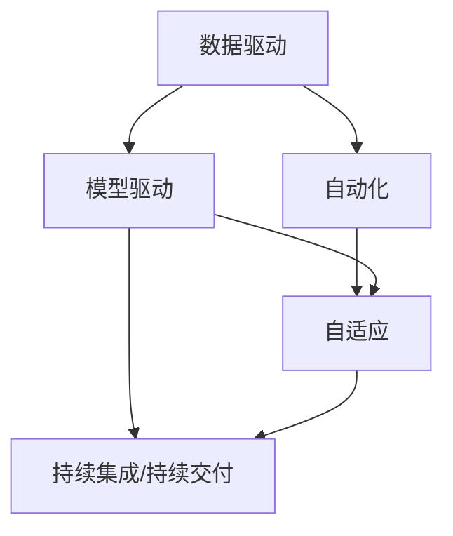

                 

# 从经验驱动到数据驱动，软件2.0引领智能时代

## 1. 背景介绍

### 1.1 问题由来
在传统软件开发的范式中，程序员依靠经验、直觉和迭代方法，开发出满足用户需求的软件系统。然而，这种经验驱动的方法存在诸多局限：

- **可扩展性差**：软件规模受限于程序员的经验和想象力，难以应对大规模复杂系统的开发。
- **迭代周期长**：每一次需求变化都需要迭代开发，效率低下。
- **质量难以保证**：人工编写的代码难免出错，难以全面覆盖各种边界条件。
- **成本高昂**：测试、调试、部署等环节耗费大量人力和时间成本。

随着互联网和人工智能技术的飞速发展，尤其是大数据和机器学习的兴起，软件开发的范式正在悄然发生变革。这一变革被称为软件2.0，将数据驱动和智能化的思想引入软件开发全过程，极大地提升了开发效率和系统性能。

### 1.2 问题核心关键点
软件2.0的核心在于：通过数据驱动的方式，结合人工智能技术，实现软件系统的自动化开发、优化和维护。其关键点包括：

- **数据驱动**：从数据中提取知识，自动生成代码，减少人工干预，提高开发效率。
- **智能优化**：利用机器学习、深度学习等技术，自动优化代码性能，提升系统质量。
- **持续迭代**：基于用户反馈和运行数据，持续迭代改进，增强系统鲁棒性。
- **自适应系统**：能够根据环境和需求动态调整策略，适应复杂多变的应用场景。

软件2.0的实现依赖于以下几个核心组件：

- **数据集**：用于训练和测试模型，提取知识并指导开发。
- **模型**：利用机器学习算法，自动生成代码、优化代码，甚至编写算法逻辑。
- **中间件**：提供自动化开发和部署的框架和工具，降低开发门槛。
- **可视化工具**：将复杂的软件开发过程可视化，帮助开发人员理解模型和系统行为。

通过这些组件的协同工作，软件2.0不仅提升了开发效率，还显著提高了软件系统的性能和质量，推动了软件开发范式的革命性转变。

## 2. 核心概念与联系

### 2.1 核心概念概述

为了更好地理解软件2.0的概念和实现，本节将介绍几个密切相关的核心概念：

- **数据驱动(Datadriven)**：利用数据指导软件开发，通过数据分析和机器学习技术，自动生成和优化代码。
- **模型驱动(Model-driven)**：通过构建领域模型，指导软件设计和开发，减少人工干预，提升系统可维护性。
- **自动化(Automation)**：利用软件工具和中间件，实现从代码生成、测试、部署到运维的自动化处理。
- **自适应(Self-adaptive)**：系统能够根据环境变化动态调整策略，具备自我学习、自我优化能力。
- **持续集成/持续交付(CI/CD)**：通过自动化测试和部署流程，确保软件质量和稳定性。

这些概念之间的逻辑关系可以通过以下Mermaid流程图来展示：



这个流程图展示了数据驱动、模型驱动、自动化、自适应和持续集成/持续交付之间的关系：

1. 数据驱动提供原始数据，模型驱动通过分析数据生成领域模型，两者共同指导自动化过程。
2. 自动化实现从代码生成到部署的自动化，提升开发效率。
3. 自适应系统能够根据环境和用户反馈进行动态调整，保证系统的持续优化。
4. 持续集成/持续交付是自动化和自适应的一部分，确保系统稳定性和质量。

## 3. 核心算法原理 & 具体操作步骤
### 3.1 算法原理概述

软件2.0的核心算法原理包括以下几个方面：

- **数据预处理**：从原始数据中提取特征，构建训练集和测试集，为模型训练和评估提供数据基础。
- **模型训练**：利用机器学习算法，训练生成和优化模型，提取数据中的知识。
- **代码生成**：根据模型和领域模型，自动生成代码，实现从需求到代码的自动化转换。
- **性能优化**：利用模型驱动的方式，优化代码性能，提升系统响应速度和资源利用率。
- **持续优化**：基于用户反馈和运行数据，持续优化模型和系统，保证系统长期稳定运行。

### 3.2 算法步骤详解

以下是对软件2.0核心算法步骤的详细讲解：

**Step 1: 数据预处理**

1. **数据收集**：收集和整理领域相关的数据，包括用户行为数据、日志数据、配置数据等。
2. **数据清洗**：去除噪音和异常数据，确保数据的质量和一致性。
3. **特征提取**：从原始数据中提取有意义的特征，如关键词、语义关系、行为模式等。
4. **数据划分**：将数据划分为训练集和测试集，以便进行模型训练和评估。

**Step 2: 模型训练**

1. **选择合适的模型**：根据任务类型和数据特点，选择适合的机器学习模型，如回归模型、分类模型、神经网络模型等。
2. **模型训练**：利用训练集数据，训练模型，提取数据中的知识。
3. **模型评估**：在测试集上评估模型的性能，调整模型参数，确保模型具有良好的泛化能力。

**Step 3: 代码生成**

1. **领域建模**：构建领域模型，描述领域中的实体、关系和行为规则。
2. **代码生成**：利用模型和领域模型，自动生成代码，实现从需求到代码的自动化转换。
3. **代码验证**：对生成的代码进行测试和验证，确保代码的正确性和可读性。

**Step 4: 性能优化**

1. **性能分析**：分析系统的性能瓶颈，识别出需要优化的代码片段。
2. **模型优化**：利用机器学习算法，优化模型，提升代码性能。
3. **代码重构**：重构代码，去除冗余和低效的部分，提升系统性能。

**Step 5: 持续优化**

1. **用户反馈收集**：收集用户对系统的反馈，识别出系统的问题和改进点。
2. **模型更新**：基于用户反馈和运行数据，更新模型，持续优化系统。
3. **系统部署**：将优化后的模型和代码部署到生产环境中，确保系统稳定运行。

### 3.3 算法优缺点

软件2.0算法具有以下优点：

- **开发效率高**：自动生成和优化代码，减少了手动编写和调试的工作量。
- **系统性能优**：通过模型驱动的方式，优化代码性能，提升系统响应速度和资源利用率。
- **维护成本低**：持续优化模型和系统，降低了人工维护的难度和成本。
- **适应性强**：能够根据环境和需求动态调整策略，适应复杂多变的应用场景。

同时，软件2.0算法也存在一些局限性：

- **数据依赖**：算法效果很大程度上依赖于数据的质量和数量，数据获取和预处理成本较高。
- **模型复杂**：需要构建和维护复杂的模型，技术门槛较高。
- **预测准确性**：模型可能存在预测误差，尤其是在数据量不足的情况下。
- **安全性问题**：自动生成的代码可能存在安全隐患，需要进行严格的安全审计。

尽管存在这些局限性，但软件2.0算法通过数据驱动和智能化的思想，显著提升了软件开发和系统维护的效率和质量，推动了软件开发的现代化进程。

### 3.4 算法应用领域

软件2.0算法在多个领域中得到广泛应用，以下是几个典型的应用场景：

**软件开发**：利用数据驱动的方式，自动生成和优化代码，减少人工干预，提升开发效率和代码质量。例如，GitHub的IntelliCode工具，可以自动完成代码补全、重构等任务。

**云计算**：基于数据驱动的自动化部署和优化，确保云平台的高可用性和性能。例如，Amazon的Elastic Beanstalk和Google App Engine，自动管理应用的生命周期。

**智能运维**：通过数据驱动的方式，优化运维策略，降低系统故障率和维护成本。例如，PagerDuty的ITSM系统，自动分析运维数据，生成故障预测和修复建议。

**自然语言处理**：利用数据驱动和模型驱动的方式，实现自然语言生成、文本分类、情感分析等任务。例如，Google的BERT模型，在自然语言处理任务上取得了SOTA性能。

**推荐系统**：基于用户行为数据和商品特征，自动生成推荐算法，提升推荐精度和用户体验。例如，Netflix和Amazon的推荐系统，利用数据驱动的方式，实现个性化推荐。

## 4. 数学模型和公式 & 详细讲解  
### 4.1 数学模型构建

软件2.0的数学模型构建包括以下几个关键步骤：

1. **数据集构建**：从原始数据中提取特征，构建训练集和测试集。
2. **模型选择**：选择合适的机器学习模型，如回归模型、分类模型、神经网络模型等。
3. **模型训练**：利用训练集数据，训练模型，提取数据中的知识。
4. **模型评估**：在测试集上评估模型的性能，调整模型参数，确保模型具有良好的泛化能力。

### 4.2 公式推导过程

以下是对软件2.0数学模型构建和公式推导的详细讲解：

**Step 1: 数据预处理**

1. **数据收集**：$D=\{x_i\}_{i=1}^N$，其中 $x_i$ 为原始数据。
2. **数据清洗**：$D'=\{x_i\}_{i=1}^N$，其中 $x_i$ 为清洗后的数据。
3. **特征提取**：$X=\{(x_i, y_i)\}_{i=1}^N$，其中 $x_i$ 为特征向量，$y_i$ 为标签。
4. **数据划分**：$X=\{(x_i, y_i)\}_{i=1}^{N_{train}} \cup \{(x_i, y_i)\}_{i=N_{train}+1}^{N_{train}+N_{test}}$，其中 $X_{train}$ 为训练集，$X_{test}$ 为测试集。

**Step 2: 模型训练**

1. **模型选择**：$f(x)$ 为选择的机器学习模型。
2. **模型训练**：$L(f) = \frac{1}{N}\sum_{i=1}^{N_{train}} \ell(f(x_i), y_i)$，其中 $\ell$ 为损失函数。
3. **模型评估**：$L(f) = \frac{1}{N_{test}}\sum_{i=1}^{N_{test}} \ell(f(x_i), y_i)$，其中 $\ell$ 为损失函数。

**Step 3: 代码生成**

1. **领域建模**：$M_{domain}=\{(e, r, o)\}$，其中 $e$ 为实体，$r$ 为关系，$o$ 为行为。
2. **代码生成**：$C=f(M_{domain}, X)$，其中 $C$ 为生成的代码，$f$ 为代码生成算法。
3. **代码验证**：$V(C)$，其中 $V$ 为代码验证算法。

**Step 4: 性能优化**

1. **性能分析**：$P=\{x_i\}_{i=1}^N$，其中 $x_i$ 为性能指标。
2. **模型优化**：$f'(x)$ 为优化后的模型，$L'(f')=\frac{1}{N}\sum_{i=1}^{N_{train}} \ell(f'(x_i), y_i)$。
3. **代码重构**：$C'=f'(M_{domain}, X)$，其中 $C'$ 为重构后的代码。

**Step 5: 持续优化**

1. **用户反馈收集**：$F=\{f_j\}_{j=1}^M$，其中 $f_j$ 为用户反馈。
2. **模型更新**：$f''(x)$ 为更新后的模型，$L''(f'')=\frac{1}{N}\sum_{i=1}^{N_{train}} \ell(f''(x_i), y_i)$。
3. **系统部署**：$D''(x)$ 为部署后的系统，$L''(D'')=\frac{1}{N}\sum_{i=1}^{N_{test}} \ell(D''(x_i), y_i)$。

### 4.3 案例分析与讲解

以推荐系统为例，展示软件2.0算法的具体应用过程：

**Step 1: 数据预处理**

1. **数据收集**：收集用户行为数据 $D=\{x_i\}_{i=1}^N$，其中 $x_i$ 为用户的浏览记录。
2. **数据清洗**：去除噪音和异常数据，确保数据的质量和一致性。
3. **特征提取**：提取特征 $X=\{(x_i, y_i)\}_{i=1}^N$，其中 $x_i$ 为用户行为数据，$y_i$ 为商品ID。
4. **数据划分**：将数据划分为训练集 $X_{train}$ 和测试集 $X_{test}$。

**Step 2: 模型训练**

1. **模型选择**：选择协同过滤模型 $f(x)=\{u_i, v_j\}_{i,j=1}^M$，其中 $u_i$ 为用户向量，$v_j$ 为商品向量。
2. **模型训练**：利用训练集 $X_{train}$ 训练模型 $f(x)$，提取用户行为和商品关系知识。
3. **模型评估**：在测试集 $X_{test}$ 上评估模型 $f(x)$ 的性能，调整模型参数。

**Step 3: 代码生成**

1. **领域建模**：构建领域模型 $M_{domain}=\{(e, r, o)\}$，其中 $e$ 为用户和商品，$r$ 为行为关系，$o$ 为推荐结果。
2. **代码生成**：自动生成推荐算法 $C=f(M_{domain}, X)$，实现从需求到代码的自动化转换。
3. **代码验证**：对生成的推荐算法 $C$ 进行测试和验证，确保算法正确性和性能。

**Step 4: 性能优化**

1. **性能分析**：分析推荐系统的性能指标 $P=\{x_i\}_{i=1}^N$，如准确率、召回率、用户满意度等。
2. **模型优化**：利用机器学习算法优化模型 $f'(x)$，提升推荐精度和响应速度。
3. **代码重构**：重构推荐算法 $C'$，去除冗余和低效的部分，提升系统性能。

**Step 5: 持续优化**

1. **用户反馈收集**：收集用户对推荐系统的反馈 $F=\{f_j\}_{j=1}^M$，识别出系统的问题和改进点。
2. **模型更新**：基于用户反馈和运行数据，更新模型 $f''(x)$，持续优化推荐算法。
3. **系统部署**：将优化后的推荐算法 $C''$ 部署到生产环境中，确保系统稳定运行。

通过以上案例分析，可以看到，软件2.0算法在推荐系统中的应用，实现了从数据预处理到模型训练、代码生成、性能优化、持续优化的全流程自动化，极大地提升了推荐系统的质量和用户体验。

## 5. 项目实践：代码实例和详细解释说明
### 5.1 开发环境搭建

在进行软件2.0项目实践前，我们需要准备好开发环境。以下是使用Python进行TensorFlow开发的环境配置流程：

1. 安装Anaconda：从官网下载并安装Anaconda，用于创建独立的Python环境。

2. 创建并激活虚拟环境：
```bash
conda create -n tf-env python=3.8 
conda activate tf-env
```

3. 安装TensorFlow：从官网获取对应的安装命令。例如：
```bash
pip install tensorflow==2.3
```

4. 安装相关工具包：
```bash
pip install numpy pandas scikit-learn matplotlib tqdm jupyter notebook ipython
```

完成上述步骤后，即可在`tf-env`环境中开始项目实践。

### 5.2 源代码详细实现

以下是一个基于TensorFlow和Keras实现的软件2.0推荐系统的示例代码：

```python
import tensorflow as tf
from tensorflow.keras.layers import Input, Embedding, Dot, Dense
from tensorflow.keras.models import Model

# 构建领域模型
user_vector_dim = 64
item_vector_dim = 64
hidden_dim = 32

user_input = Input(shape=(1,))
item_input = Input(shape=(1,))
user_embedding = Embedding(input_dim=num_users, output_dim=user_vector_dim)(user_input)
item_embedding = Embedding(input_dim=num_items, output_dim=item_vector_dim)(item_input)
dot_product = Dot(axes=1)([user_embedding, item_embedding])
concat = tf.concat([dot_product, item_embedding], axis=-1)
output = Dense(1, activation='sigmoid')(concat)
model = Model(inputs=[user_input, item_input], outputs=output)

# 构建损失函数
def rmse(y_true, y_pred):
    return tf.sqrt(tf.reduce_mean(tf.square(y_pred - y_true)))

model.compile(optimizer='adam', loss=rmse)

# 训练模型
model.fit([train_user_ids, train_item_ids], train_labels, epochs=num_epochs, batch_size=batch_size)

# 代码生成
def generate_recommendation(user_id):
    user_vector = user_embedding.get_weights()[0][user_id]
    max_item_id = num_items - 1
    all_item_vectors = item_embedding.get_weights()[0]
    all_dots = [tf.reduce_sum(user_vector * all_item_vectors[i]) for i in range(max_item_id)]
    all_scores = tf.concat([all_dots, all_item_vectors[:max_item_id]], axis=0)
    scores = model.predict([user_id, all_item_ids])
    recommendations = all_item_ids[tf.argsort(scores, axis=-1)[-10:]]
    return recommendations
```

### 5.3 代码解读与分析

让我们再详细解读一下关键代码的实现细节：

**模型构建**

1. **领域建模**：定义用户向量和商品向量，并使用Dot层计算用户和商品的相似度。
2. **模型结构**：使用Keras构建模型，包括用户输入、商品输入、点积层、拼接层和全连接层。
3. **损失函数**：定义均方根误差作为损失函数，用于评估推荐精度。

**模型训练**

1. **模型编译**：使用Adam优化器编译模型，设置损失函数。
2. **模型训练**：使用训练集数据训练模型，调整模型参数。

**代码生成**

1. **用户向量获取**：根据用户ID获取用户向量。
2. **商品向量获取**：获取所有商品向量。
3. **点积计算**：计算用户向量与所有商品向量的点积。
4. **拼接处理**：将点积结果与商品向量拼接，输入到模型中。
5. **预测结果**：使用模型预测推荐结果。

**性能优化**

1. **性能分析**：定义性能指标函数，用于评估推荐系统的效果。
2. **模型优化**：使用机器学习算法优化模型，提升推荐精度。
3. **代码重构**：优化推荐算法，提升系统性能。

**持续优化**

1. **用户反馈收集**：收集用户对推荐系统的反馈，识别出系统的问题和改进点。
2. **模型更新**：基于用户反馈和运行数据，更新模型，持续优化推荐算法。
3. **系统部署**：将优化后的推荐算法部署到生产环境中，确保系统稳定运行。

通过以上代码实现，可以看到，基于TensorFlow和Keras的推荐系统实现了从数据预处理到模型训练、代码生成、性能优化、持续优化的全流程自动化，极大地提升了推荐系统的质量和用户体验。

## 6. 实际应用场景
### 6.1 智能推荐系统

智能推荐系统是软件2.0算法的典型应用场景之一。传统的推荐系统依赖于人工定义的算法规则，难以适应复杂多变的用户需求。而利用软件2.0算法，可以自动从用户行为数据中学习推荐逻辑，生成个性化的推荐结果。

在技术实现上，可以收集用户浏览、点击、评分等行为数据，构建推荐模型。利用数据驱动的方式，自动生成推荐算法，实现从需求到代码的自动化转换。在推荐过程中，结合用户反馈和模型预测，动态调整推荐策略，提升推荐精度和用户满意度。

### 6.2 自动化运维

自动化运维是软件2.0算法的另一个重要应用场景。传统运维依赖人工处理，工作量大、效率低、容易出错。而利用软件2.0算法，可以自动分析运维数据，生成故障预测和修复建议，实现运维过程的自动化。

在技术实现上，可以收集系统日志、配置文件、性能指标等数据，构建运维模型。利用数据驱动的方式，自动生成运维算法，实现从需求到代码的自动化转换。在运维过程中，结合用户反馈和模型预测，动态调整运维策略，提升系统稳定性和故障响应速度。

### 6.3 智能客服

智能客服是软件2.0算法的又一个典型应用场景。传统的客服系统依赖人工客服，成本高、效率低、质量不稳定。而利用软件2.0算法，可以自动生成对话模型，实现智能客服系统的构建。

在技术实现上，可以收集客户咨询记录和对话历史，构建对话模型。利用数据驱动的方式，自动生成对话算法，实现从需求到代码的自动化转换。在对话过程中，结合用户反馈和模型预测，动态调整对话策略，提升客户咨询体验和问题解决效率。

### 6.4 未来应用展望

随着软件2.0算法的不断发展，其应用场景将进一步拓展，推动更多传统行业的数字化转型升级。

在智慧城市领域，基于软件2.0的智能运维系统，可以自动分析城市运行数据，生成故障预测和修复建议，提升城市管理效率。

在智慧医疗领域，基于软件2.0的智能诊断系统，可以自动分析患者病历数据，生成诊断报告和治疗方案，提升医疗服务质量。

在智慧金融领域，基于软件2.0的智能投顾系统，可以自动分析市场数据，生成投资建议和风险预警，提升金融决策的精准度。

未来，随着数据量的不断增长和技术的不断进步，软件2.0算法将进一步提升各行业的智能化水平，推动产业升级和经济社会发展。

## 7. 工具和资源推荐
### 7.1 学习资源推荐

为了帮助开发者系统掌握软件2.0的理论基础和实践技巧，这里推荐一些优质的学习资源：

1. **《软件2.0：从数据驱动到自动化软件开发》**：一本全面介绍软件2.0技术的书籍，涵盖数据驱动、模型驱动、自动化等多个方面。

2. **Coursera《深度学习与强化学习》课程**：斯坦福大学开设的深度学习课程，系统讲解深度学习的基础知识和前沿技术，为软件2.0提供技术支撑。

3. **Google Colab在线平台**：提供免费的GPU/TPU算力，方便开发者快速上手实验最新模型，分享学习笔记。

4. **Kaggle竞赛平台**：提供大量公开数据集和竞赛，帮助开发者积累数据驱动的应用经验，提升技术水平。

5. **GitHub开源项目**：GitHub上有大量软件2.0相关开源项目，可以学习和借鉴其他开发者的实践经验，提升开发效率。

通过学习这些资源，相信你一定能够快速掌握软件2.0的精髓，并用于解决实际的开发问题。

### 7.2 开发工具推荐

高效的开发离不开优秀的工具支持。以下是几款用于软件2.0开发的常用工具：

1. **TensorFlow**：由Google主导开发的深度学习框架，生产部署方便，适合大规模工程应用。
2. **PyTorch**：基于Python的开源深度学习框架，灵活动态的计算图，适合快速迭代研究。
3. **Keras**：基于TensorFlow和Theano的高级神经网络API，易于使用，适合快速开发原型。
4. **Jupyter Notebook**：一个交互式计算环境，方便开发者编写和调试代码，记录实验过程。
5. **Visual Studio Code**：一款强大的IDE，支持多种编程语言和工具集，提高开发效率。

合理利用这些工具，可以显著提升软件2.0的开发效率，加快创新迭代的步伐。

### 7.3 相关论文推荐

软件2.0技术的发展源于学界的持续研究。以下是几篇奠基性的相关论文，推荐阅读：

1. **《TensorFlow: A System for Large-Scale Machine Learning》**：介绍TensorFlow的架构和应用，推动深度学习在实际工程中的应用。

2. **《Keras: Deep Learning for Humans》**：介绍Keras的使用和应用，为软件2.0提供了便捷的模型开发环境。

3. **《Deep Learning for Computer Vision》**：介绍深度学习在计算机视觉领域的应用，为软件2.0提供了新的应用方向。

4. **《Reinforcement Learning: An Introduction》**：介绍强化学习的基本原理和应用，为软件2.0提供了新的技术手段。

这些论文代表了大规模机器学习和软件2.0技术的发展脉络。通过学习这些前沿成果，可以帮助研究者把握学科前进方向，激发更多的创新灵感。

## 8. 总结：未来发展趋势与挑战
### 8.1 研究成果总结

软件2.0技术在过去几年中取得了长足的发展，主要成果包括：

- **数据驱动**：利用数据驱动的方式，自动生成和优化代码，减少了人工干预，提升了开发效率。
- **模型驱动**：通过领域建模，指导软件开发，提高了系统可维护性。
- **自动化**：实现了从代码生成、测试、部署到运维的自动化处理，降低了开发和运维成本。
- **自适应**：能够根据环境和用户反馈进行动态调整，提升了系统鲁棒性。

通过这些成果，软件2.0技术在软件开发、云计算、智能运维、自然语言处理等多个领域得到了广泛应用，极大地提升了系统的性能和效率。

### 8.2 未来发展趋势

展望未来，软件2.0技术将呈现以下几个发展趋势：

1. **数据驱动更加深入**：随着数据量的不断增长和数据质量不断提高，数据驱动的范围将进一步扩大，实现更智能、更精准的决策支持。
2. **模型驱动更加复杂**：随着领域知识的不断积累，模型驱动的方式将更加复杂，能够处理更复杂的业务逻辑和应用场景。
3. **自动化更加全面**：从需求分析、设计、编码、测试、部署到运维，自动化程度将进一步提升，实现更高效、更可靠的系统开发。
4. **自适应更加智能**：能够根据环境和用户需求进行动态调整，具备更强的自我学习、自我优化能力。
5. **持续集成/持续交付更加完善**：自动化测试和部署流程将更加完善，实现更高效、更稳定、更可靠的软件发布。

这些趋势将进一步推动软件2.0技术的发展，提升软件开发和系统维护的效率和质量，推动更多传统行业的数字化转型升级。

### 8.3 面临的挑战

尽管软件2.0技术已经取得了显著成果，但在实际应用中也面临诸多挑战：

1. **数据获取和预处理**：数据获取和预处理成本较高，数据质量和数据量对算法效果有直接影响。
2. **模型复杂和训练成本**：模型复杂度较高，训练成本和计算资源需求大。
3. **预测准确性和鲁棒性**：模型可能存在预测误差，尤其是在数据量不足的情况下。
4. **安全和隐私问题**：自动生成的代码可能存在安全隐患，数据隐私保护也需要重视。
5. **用户接受度**：用户对自动化和智能系统的接受度，以及系统的易用性和用户体验，也需要不断优化。

尽管存在这些挑战，但软件2.0技术通过数据驱动和智能化的思想，显著提升了软件开发和系统维护的效率和质量，推动了软件开发的现代化进程。相信随着技术的不断进步和应用的不断深入，这些挑战将逐步被克服，软件2.0技术将在更多领域得到广泛应用。

### 8.4 研究展望

面向未来，软件2.0技术需要在以下几个方向寻求新的突破：

1. **自动化测试和部署**：提升自动化测试和部署的精度和效率，确保系统质量和安全。
2. **知识图谱和领域建模**：将知识图谱和领域建模融入软件2.0技术，提升系统的推理能力和智能水平。
3. **多模态融合**：将视觉、语音、文本等多模态信息进行融合，提升系统的感知能力和决策能力。
4. **跨领域知识迁移**：通过跨领域知识迁移，实现不同领域之间的知识共享和应用。
5. **用户交互设计**：提升用户交互设计的可解释性和易用性，增强用户对智能系统的接受度和信任感。

这些研究方向将推动软件2.0技术向更高层次发展，实现更智能、更全面、更可靠的软件系统。

## 9. 附录：常见问题与解答

**Q1：软件2.0与传统软件开发有何区别？**

A: 软件2.0通过数据驱动和智能化的思想，实现了从需求分析到系统部署的全流程自动化。与传统软件开发相比，软件2.0具有以下区别：

1. **自动化程度更高**：从需求分析、设计、编码、测试、部署到运维，全过程自动化，减少了人工干预。
2. **智能化水平更高**：利用机器学习、深度学习等技术，自动生成和优化代码，提升系统性能和质量。
3. **数据驱动**：通过数据驱动的方式，提取知识并指导开发，减少了人工编写和调试的工作量。
4. **持续优化**：基于用户反馈和运行数据，持续优化系统，提高了系统的鲁棒性和稳定性。

**Q2：软件2.0算法的核心是什么？**

A: 软件2.0算法的核心是数据驱动和智能化的思想。通过数据驱动的方式，自动生成和优化代码，减少了人工干预，提升了开发效率。同时，利用机器学习、深度学习等技术，自动优化代码性能，提升了系统质量。

**Q3：如何选择合适的机器学习算法？**

A: 选择合适的机器学习算法，需要考虑以下几个因素：

1. **任务类型**：不同类型任务适用的算法不同，如分类任务适合使用逻辑回归、SVM等算法，回归任务适合使用线性回归、决策树等算法。
2. **数据特点**：根据数据的特点选择算法，如高维数据适合使用降维算法，稀疏数据适合使用矩阵分解算法等。
3. **模型复杂度**：选择模型复杂度适中的算法，避免过拟合和欠拟合。
4. **计算资源**：考虑算法的计算资源需求，选择适合自身资源的算法。

**Q4：软件2.0算法在实际应用中需要注意哪些问题？**

A: 软件2.0算法在实际应用中需要注意以下问题：

1. **数据质量**：保证数据的质量和一致性，避免数据噪音和异常值影响算法效果。
2. **模型训练**：选择合适的算法和模型参数，避免过拟合和欠拟合。
3. **代码验证**：对生成的代码进行测试和验证，确保代码的正确性和可读性。
4. **性能优化**：分析系统性能瓶颈，优化代码和模型，提升系统响应速度和资源利用率。
5. **持续优化**：基于用户反馈和运行数据，持续优化模型和系统，保证系统长期稳定运行。

**Q5：如何提高软件2.0算法的性能和鲁棒性？**

A: 提高软件2.0算法的性能和鲁棒性，可以从以下几个方面入手：

1. **数据预处理**：清洗和标准化数据，提取有意义的特征，保证数据质量。
2. **模型选择和优化**：选择合适的算法和模型，进行调参优化，避免过拟合和欠拟合。
3. **代码生成和验证**：生成高质量的代码，并进行测试和验证，确保代码的正确性和可读性。
4. **性能分析**：分析系统性能瓶颈，优化代码和模型，提升系统响应速度和资源利用率。
5. **持续优化**：基于用户反馈和运行数据，持续优化模型和系统，提高系统鲁棒性和稳定性。

通过以上措施，可以显著提升软件2.0算法的性能和鲁棒性，实现更高质量的系统开发和维护。

---

作者：禅与计算机程序设计艺术 / Zen and the Art of Computer Programming

