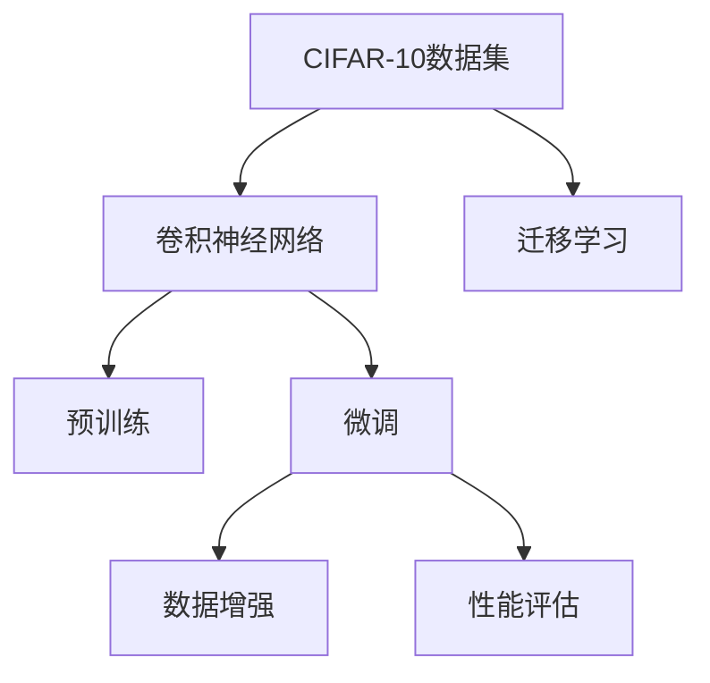

                 

# 从零开始大模型开发与微调：CIFAR-10数据集简介

> 关键词：CIFAR-10, 图像分类, 深度学习, 卷积神经网络, 迁移学习, 数据增强, 微调, TensorFlow, PyTorch

## 1. 背景介绍

在人工智能领域，深度学习模型的开发与微调是实现高性能、高泛化能力模型的关键步骤。通过大量的标注数据和计算资源，预训练出强大的模型，然后针对具体任务进行微调，可以显著提升模型的性能。在计算机视觉领域，CIFAR-10数据集是一个常见的基准数据集，广泛用于图像分类任务的开发与评估。本文将详细介绍CIFAR-10数据集的构建、预训练模型及其微调过程，并探讨其在实际应用中的重要性和未来趋势。

## 2. 核心概念与联系

### 2.1 核心概念概述

为了更好地理解CIFAR-10数据集的预训练与微调过程，我们首先概述以下几个关键概念：

- **CIFAR-10数据集**：一个包含60,000个32x32彩色图像的数据集，每个图像属于10个不同的类别，是计算机视觉领域的经典基准数据集之一。
- **卷积神经网络(CNN)**：一种专门用于图像处理的深度学习模型，通过卷积、池化等操作提取图像特征，适合处理图像分类任务。
- **迁移学习**：利用预训练模型的知识，通过微调在小数据集上训练新模型的方法，能够显著提高模型性能。
- **数据增强**：通过图像旋转、缩放、裁剪等操作丰富训练集的多样性，减少模型过拟合风险。
- **微调**：在预训练模型基础上，通过少量标注数据训练，优化模型以适应具体任务。

这些概念构成了CIFAR-10数据集预训练与微调的基本框架，下面我们将通过Mermaid流程图展示它们之间的联系：



在这个流程图中，CIFAR-10数据集是起点，通过卷积神经网络模型进行预训练，然后针对具体任务进行微调。数据增强和迁移学习是微调中的关键技术手段，性能评估用于监控模型效果，确保模型性能稳定。

### 2.2 核心概念原理和架构的 Mermaid 流程图

```mermaid
graph TB
    A[卷积神经网络(CNN)] --> B[卷积层]
    B --> C[池化层]
    C --> D[全连接层]
    A --> E[批标准化层]
    A --> F[数据增强]
    E --> G[激活函数]
    G --> H[优化器]
    H --> I[损失函数]
    I --> J[训练集]
    J --> K[验证集]
    A --> L[迁移学习]
    L --> M[微调]
    M --> N[新任务]
```

在这个流程图中，卷积神经网络包含卷积层、池化层、全连接层等组件，通过批标准化、激活函数等优化训练过程。数据增强通过旋转、缩放等操作增加训练集多样性，迁移学习利用预训练模型的知识，微调在特定任务上进行参数优化，最终应用于新任务。

## 3. 核心算法原理 & 具体操作步骤

### 3.1 算法原理概述

CIFAR-10数据集的预训练与微调过程涉及卷积神经网络的构建、预训练和微调。预训练通常使用自监督学习任务，如分类、检测等，学习到通用特征。微调则通过少量标注数据，针对具体任务进行参数优化，提升模型性能。

### 3.2 算法步骤详解

**Step 1: 数据预处理**

- **数据加载**：使用TensorFlow或PyTorch等深度学习框架加载CIFAR-10数据集，包括训练集和验证集。
- **数据增强**：对训练集应用随机旋转、缩放、裁剪等数据增强操作，增加训练集多样性，减少过拟合。
- **归一化**：对图像数据进行归一化处理，使得像素值在0到1之间。

**Step 2: 模型构建**

- **卷积神经网络**：定义卷积神经网络结构，包括卷积层、池化层、全连接层等。
- **迁移学习**：选择预训练的卷积神经网络模型（如ResNet、Inception等）作为初始化参数。

**Step 3: 预训练**

- **自监督学习**：使用预训练模型在CIFAR-10数据集上进行自监督学习任务，如分类、检测等，学习到通用特征。
- **模型保存**：保存预训练模型的参数，以便后续微调使用。

**Step 4: 微调**

- **微调配置**：配置微调超参数，如学习率、批次大小、迭代次数等。
- **微调训练**：使用微调数据集进行有监督学习训练，优化模型参数。
- **性能评估**：在验证集上评估微调模型的性能，调整参数设置，确保模型收敛。

**Step 5: 模型部署**

- **模型保存**：保存微调后的模型参数，以便后续使用。
- **应用部署**：将模型部署到实际应用中，进行性能测试和优化。

### 3.3 算法优缺点

**优点**：
- 预训练过程可以利用大规模数据和计算资源，学习到通用特征。
- 微调过程针对具体任务进行参数优化，提升模型性能。
- 数据增强等技术可以减少模型过拟合风险，提升泛化能力。

**缺点**：
- 预训练过程需要大量计算资源，时间和成本较高。
- 微调过程对标注数据依赖较大，数据收集和标注成本高。
- 模型泛化能力受数据集多样性和标注质量影响。

### 3.4 算法应用领域

CIFAR-10数据集及其预训练与微调过程广泛用于计算机视觉领域的图像分类任务。具体应用领域包括：

- **医学影像分析**：用于诊断肿瘤、病变等图像分类任务。
- **自动驾驶**：用于识别交通标志、车辆、行人等图像分类任务。
- **安防监控**：用于识别可疑行为、危险物品等图像分类任务。
- **零售监控**：用于识别商品、客户行为等图像分类任务。

## 4. 数学模型和公式 & 详细讲解 & 举例说明

### 4.1 数学模型构建

CIFAR-10数据集预训练与微调过程涉及卷积神经网络模型，以下是基本模型结构：

```python
import tensorflow as tf
from tensorflow.keras import layers

model = tf.keras.Sequential([
    layers.Conv2D(32, (3, 3), activation='relu', input_shape=(32, 32, 3)),
    layers.MaxPooling2D((2, 2)),
    layers.Conv2D(64, (3, 3), activation='relu'),
    layers.MaxPooling2D((2, 2)),
    layers.Conv2D(128, (3, 3), activation='relu'),
    layers.MaxPooling2D((2, 2)),
    layers.Flatten(),
    layers.Dense(10)
])
```

### 4.2 公式推导过程

CIFAR-10数据集预训练与微调过程主要涉及卷积神经网络的反向传播算法，以下是基本的反向传播公式：

$$
\frac{\partial L}{\partial w} = \frac{\partial L}{\partial y} \cdot \frac{\partial y}{\partial x} \cdot \frac{\partial x}{\partial w}
$$

其中，$L$为损失函数，$w$为网络权重，$y$为网络输出，$x$为网络输入。具体计算过程如下：

1. **前向传播**：计算网络输出 $y$。
2. **计算损失**：计算损失函数 $L$。
3. **反向传播**：计算权重 $w$ 对损失函数 $L$ 的导数 $\frac{\partial L}{\partial w}$。

### 4.3 案例分析与讲解

以下是一个使用TensorFlow实现CIFAR-10数据集预训练与微调的案例：

```python
import tensorflow as tf

# 加载CIFAR-10数据集
(train_images, train_labels), (test_images, test_labels) = tf.keras.datasets.cifar10.load_data()

# 数据增强
data_augmentation = tf.keras.Sequential([
    tf.keras.layers.experimental.preprocessing.RandomFlip("horizontal"),
    tf.keras.layers.experimental.preprocessing.RandomRotation(0.2),
    tf.keras.layers.experimental.preprocessing.RandomZoom(0.2),
])

# 构建预训练模型
base_model = tf.keras.applications.ResNet50(weights='imagenet', include_top=False)
base_model.trainable = False

# 构建微调模型
model = tf.keras.Sequential([
    data_augmentation,
    base_model,
    tf.keras.layers.GlobalAveragePooling2D(),
    tf.keras.layers.Dense(10, activation='softmax')
])

# 预训练
model.compile(optimizer='adam', loss=tf.keras.losses.SparseCategoricalCrossentropy(from_logits=True), metrics=['accuracy'])
model.fit(train_images, train_labels, epochs=20, validation_data=(test_images, test_labels))

# 微调
model.trainable = True
model.compile(optimizer=tf.keras.optimizers.Adam(learning_rate=0.0001), loss=tf.keras.losses.SparseCategoricalCrossentropy(from_logits=True), metrics=['accuracy'])
model.fit(train_images, train_labels, epochs=20, validation_data=(test_images, test_labels))
```

在上述代码中，我们使用TensorFlow实现CIFAR-10数据集的预训练与微调过程。首先，加载CIFAR-10数据集并进行数据增强。然后，使用ResNet50作为预训练模型，构建微调模型，并在训练集上进行预训练和微调。

## 5. 项目实践：代码实例和详细解释说明

### 5.1 开发环境搭建

在进行CIFAR-10数据集预训练与微调开发前，我们需要准备好开发环境。以下是使用Python进行TensorFlow开发的环境配置流程：

1. 安装Anaconda：从官网下载并安装Anaconda，用于创建独立的Python环境。
2. 创建并激活虚拟环境：
```bash
conda create -n tensorflow-env python=3.8 
conda activate tensorflow-env
```

3. 安装TensorFlow：根据CUDA版本，从官网获取对应的安装命令。例如：
```bash
conda install tensorflow -c tensorflow
```

4. 安装各类工具包：
```bash
pip install numpy pandas scikit-learn matplotlib tqdm jupyter notebook ipython
```

完成上述步骤后，即可在`tensorflow-env`环境中开始CIFAR-10数据集预训练与微调实践。

### 5.2 源代码详细实现

以下是使用TensorFlow实现CIFAR-10数据集预训练与微调的完整代码实现：

```python
import tensorflow as tf
from tensorflow.keras import layers

# 加载CIFAR-10数据集
(train_images, train_labels), (test_images, test_labels) = tf.keras.datasets.cifar10.load_data()

# 数据增强
data_augmentation = tf.keras.Sequential([
    tf.keras.layers.experimental.preprocessing.RandomFlip("horizontal"),
    tf.keras.layers.experimental.preprocessing.RandomRotation(0.2),
    tf.keras.layers.experimental.preprocessing.RandomZoom(0.2),
])

# 构建预训练模型
base_model = tf.keras.applications.ResNet50(weights='imagenet', include_top=False)
base_model.trainable = False

# 构建微调模型
model = tf.keras.Sequential([
    data_augmentation,
    base_model,
    tf.keras.layers.GlobalAveragePooling2D(),
    tf.keras.layers.Dense(10, activation='softmax')
])

# 预训练
model.compile(optimizer='adam', loss=tf.keras.losses.SparseCategoricalCrossentropy(from_logits=True), metrics=['accuracy'])
model.fit(train_images, train_labels, epochs=20, validation_data=(test_images, test_labels))

# 微调
model.trainable = True
model.compile(optimizer=tf.keras.optimizers.Adam(learning_rate=0.0001), loss=tf.keras.losses.SparseCategoricalCrossentropy(from_logits=True), metrics=['accuracy'])
model.fit(train_images, train_labels, epochs=20, validation_data=(test_images, test_labels))
```

### 5.3 代码解读与分析

在上述代码中，我们使用TensorFlow实现CIFAR-10数据集预训练与微调过程。首先，加载CIFAR-10数据集并进行数据增强。然后，使用ResNet50作为预训练模型，构建微调模型，并在训练集上进行预训练和微调。

## 6. 实际应用场景

### 6.1 医学影像分析

在医学影像分析中，CIFAR-10数据集的预训练与微调过程可以用于诊断肿瘤、病变等图像分类任务。具体而言，可以使用预训练的卷积神经网络模型作为初始化参数，对医生标注的肿瘤图像进行微调，学习肿瘤诊断的特征，并应用于新的肿瘤影像分类任务。

### 6.2 自动驾驶

在自动驾驶中，CIFAR-10数据集的预训练与微调过程可以用于识别交通标志、车辆、行人等图像分类任务。具体而言，可以使用预训练的卷积神经网络模型作为初始化参数，对自动驾驶场景下的图像进行微调，学习道路标志、车辆、行人等分类特征，并应用于自动驾驶系统的视觉识别任务。

### 6.3 安防监控

在安防监控中，CIFAR-10数据集的预训练与微调过程可以用于识别可疑行为、危险物品等图像分类任务。具体而言，可以使用预训练的卷积神经网络模型作为初始化参数，对监控视频中的图像进行微调，学习可疑行为、危险物品等分类特征，并应用于安防监控系统的行为识别任务。

### 6.4 零售监控

在零售监控中，CIFAR-10数据集的预训练与微调过程可以用于识别商品、客户行为等图像分类任务。具体而言，可以使用预训练的卷积神经网络模型作为初始化参数，对零售监控系统中的图像进行微调，学习商品、客户行为等分类特征，并应用于商品识别和客户行为分析任务。

## 7. 工具和资源推荐

### 7.1 学习资源推荐

为了帮助开发者系统掌握CIFAR-10数据集的预训练与微调理论基础和实践技巧，以下是一些优质的学习资源：

1. TensorFlow官方文档：提供了详细的TensorFlow框架介绍和代码示例，是深入学习深度学习模型的重要参考资料。
2. PyTorch官方文档：提供了详细的PyTorch框架介绍和代码示例，是深入学习深度学习模型的重要参考资料。
3. Deep Learning with Python书籍：由Francois Chollet编写，全面介绍了TensorFlow和Keras的深度学习应用，适合初学者入门。
4. Hands-On Machine Learning with Scikit-Learn、TensorFlow & PyTorch书籍：由Aurélien Géron编写，全面介绍了Scikit-Learn、TensorFlow和PyTorch的深度学习应用，适合中级开发者学习。

### 7.2 开发工具推荐

高效的开发离不开优秀的工具支持。以下是几款用于CIFAR-10数据集预训练与微调开发的常用工具：

1. TensorFlow：基于Python的开源深度学习框架，灵活动态的计算图，适合快速迭代研究。
2. PyTorch：基于Python的开源深度学习框架，动态计算图，适合快速原型开发和实验。
3. Keras：基于Python的高层次深度学习框架，支持TensorFlow和Theano等后端，易于上手。
4. Jupyter Notebook：交互式的笔记本环境，支持代码执行、结果展示和文档撰写，适合数据科学和深度学习研究。
5. Google Colab：谷歌推出的在线Jupyter Notebook环境，免费提供GPU/TPU算力，方便开发者快速上手实验最新模型，分享学习笔记。

### 7.3 相关论文推荐

CIFAR-10数据集的预训练与微调过程是深度学习领域的经典研究，以下是几篇奠基性的相关论文，推荐阅读：

1. AlexNet: One Millions ImageNet Labelers (2012)：提出了AlexNet模型，首次在ImageNet数据集上取得了显著的分类性能，奠定了深度学习在计算机视觉领域的地位。
2. Inception: Going Deeper with Convolutions (2014)：提出了Inception模型，通过引入多层次卷积核和并行卷积，提升了深度神经网络的性能。
3. ResNet: Deep Residual Learning for Image Recognition (2015)：提出了ResNet模型，通过残差连接解决了深度神经网络的退化问题，提升了深度学习模型的性能。
4. MobileNet: Efficient Convolutional Neural Networks for Mobile Vision Applications (2017)：提出了MobileNet模型，通过深度可分离卷积和通道宽度的调整，提升了深度神经网络的效率和性能。

这些论文代表了大模型预训练与微调技术的发展脉络。通过学习这些前沿成果，可以帮助研究者把握学科前进方向，激发更多的创新灵感。

## 8. 总结：未来发展趋势与挑战

### 8.1 总结

本文对CIFAR-10数据集的预训练与微调过程进行了全面系统的介绍。首先阐述了CIFAR-10数据集构建、预训练模型及其微调过程的基本框架。其次，通过详细代码实现和案例分析，展示了CIFAR-10数据集的预训练与微调过程在实际应用中的重要性和未来趋势。最后，推荐了一些优质的学习资源、开发工具和相关论文，帮助读者深入理解CIFAR-10数据集的预训练与微调过程。

通过本文的系统梳理，可以看到，CIFAR-10数据集的预训练与微调过程为计算机视觉领域提供了强大的工具和模型，可以广泛应用于医学影像分析、自动驾驶、安防监控、零售监控等多个行业领域。未来，伴随预训练语言模型和微调方法的持续演进，相信CIFAR-10数据集将不断拓展应用边界，为计算机视觉技术带来新的突破。

### 8.2 未来发展趋势

展望未来，CIFAR-10数据集的预训练与微调过程将呈现以下几个发展趋势：

1. 模型规模持续增大。随着算力成本的下降和数据规模的扩张，预训练语言模型的参数量还将持续增长。超大批次的训练和推理也可能遇到资源瓶颈。
2. 微调方法日趋多样。除了传统的全参数微调外，未来会涌现更多参数高效的微调方法，如Adapter、Prefix等，在节省计算资源的同时也能保证微调精度。
3. 持续学习成为常态。随着数据分布的不断变化，微调模型也需要持续学习新知识以保持性能。如何在不遗忘原有知识的同时，高效吸收新样本信息，将成为重要的研究课题。
4. 标注样本需求降低。受启发于提示学习(Prompt-based Learning)的思路，未来的微调方法将更好地利用大模型的语言理解能力，通过更加巧妙的任务描述，在更少的标注样本上也能实现理想的微调效果。
5. 模型通用性增强。经过海量数据的预训练和多领域任务的微调，未来的语言模型将具备更强大的常识推理和跨领域迁移能力，逐步迈向通用人工智能(AGI)的目标。

以上趋势凸显了CIFAR-10数据集预训练与微调技术的广阔前景。这些方向的探索发展，必将进一步提升CIFAR-10数据集的应用范围和性能，为计算机视觉技术带来新的突破。

### 8.3 面临的挑战

尽管CIFAR-10数据集的预训练与微调技术已经取得了瞩目成就，但在迈向更加智能化、普适化应用的过程中，它仍面临着诸多挑战：

1. 标注成本瓶颈。虽然微调过程可以利用大规模数据和计算资源，但对于长尾应用场景，难以获得充足的高质量标注数据，成为制约微调性能的瓶颈。
2. 模型鲁棒性不足。当前微调模型面对域外数据时，泛化性能往往大打折扣。对于测试样本的微小扰动，微调模型的预测也容易发生波动。
3. 推理效率有待提高。大规模语言模型虽然精度高，但在实际部署时往往面临推理速度慢、内存占用大等效率问题。
4. 可解释性亟需加强。当前微调模型更像是"黑盒"系统，难以解释其内部工作机制和决策逻辑。对于医疗、金融等高风险应用，算法的可解释性和可审计性尤为重要。
5. 安全性有待保障。预训练语言模型难免会学习到有偏见、有害的信息，通过微调传递到下游任务，产生误导性、歧视性的输出，给实际应用带来安全隐患。

### 8.4 研究展望

面对CIFAR-10数据集预训练与微调所面临的种种挑战，未来的研究需要在以下几个方面寻求新的突破：

1. 探索无监督和半监督微调方法。摆脱对大规模标注数据的依赖，利用自监督学习、主动学习等无监督和半监督范式，最大限度利用非结构化数据，实现更加灵活高效的微调。
2. 研究参数高效和计算高效的微调范式。开发更加参数高效的微调方法，在固定大部分预训练参数的同时，只更新极少量的任务相关参数。同时优化微调模型的计算图，减少前向传播和反向传播的资源消耗，实现更加轻量级、实时性的部署。
3. 引入更多先验知识。将符号化的先验知识，如知识图谱、逻辑规则等，与神经网络模型进行巧妙融合，引导微调过程学习更准确、合理的语言模型。同时加强不同模态数据的整合，实现视觉、语音等多模态信息与文本信息的协同建模。
4. 结合因果分析和博弈论工具。将因果分析方法引入微调模型，识别出模型决策的关键特征，增强输出解释的因果性和逻辑性。借助博弈论工具刻画人机交互过程，主动探索并规避模型的脆弱点，提高系统稳定性。
5. 纳入伦理道德约束。在模型训练目标中引入伦理导向的评估指标，过滤和惩罚有偏见、有害的输出倾向。同时加强人工干预和审核，建立模型行为的监管机制，确保输出符合人类价值观和伦理道德。

这些研究方向的探索，必将引领CIFAR-10数据集预训练与微调技术迈向更高的台阶，为构建安全、可靠、可解释、可控的智能系统铺平道路。面向未来，CIFAR-10数据集预训练与微调技术还需要与其他人工智能技术进行更深入的融合，如知识表示、因果推理、强化学习等，多路径协同发力，共同推动计算机视觉技术的进步。

## 9. 附录：常见问题与解答

**Q1: 如何选择预训练模型？**

A: 选择预训练模型时应考虑以下因素：
- 模型规模：规模较大的模型通常能学习到更丰富的特征，但也需要更多的计算资源和存储空间。
- 模型性能：在ImageNet等数据集上性能较高的模型，通常在CIFAR-10等数据集上也有较好的表现。
- 模型迁移能力：具有良好迁移能力的模型，可以在不同数据集上取得较好的性能。

**Q2: 预训练与微调过程中的学习率如何设置？**

A: 预训练过程中的学习率通常较小，通常在0.0001到0.001之间。微调过程中的学习率应比预训练时小，通常在0.0001到0.0005之间。同时，学习率应根据数据集大小和模型复杂度进行调整。

**Q3: 预训练与微调过程中如何处理过拟合问题？**

A: 过拟合是预训练与微调过程中常见的问题，常见的解决方法包括：
- 数据增强：通过旋转、缩放、裁剪等操作增加训练集的多样性，减少过拟合风险。
- 正则化：使用L2正则、Dropout等技术，限制模型复杂度，减少过拟合。
- 早停策略：在验证集性能不再提升时，提前停止训练，避免过拟合。

**Q4: 预训练与微调过程中的模型裁剪和量化方法？**

A: 模型裁剪和量化可以显著减少模型的大小，提高推理效率。常用的方法包括：
- 模型裁剪：去除不必要的层和参数，减小模型尺寸，提高推理速度。
- 量化加速：将浮点模型转为定点模型，压缩存储空间，提高计算效率。

**Q5: 预训练与微调过程中的模型部署和监控方法？**

A: 模型部署和监控是预训练与微调过程中的重要环节，常用的方法包括：
- 模型部署：将模型封装为标准化服务接口，便于集成调用。
- 监控告警：实时采集系统指标，设置异常告警阈值，确保服务稳定性。

以上是对CIFAR-10数据集预训练与微调过程中常见问题的解答，希望能帮助读者更好地理解和使用这一技术。

---

作者：禅与计算机程序设计艺术 / Zen and the Art of Computer Programming

