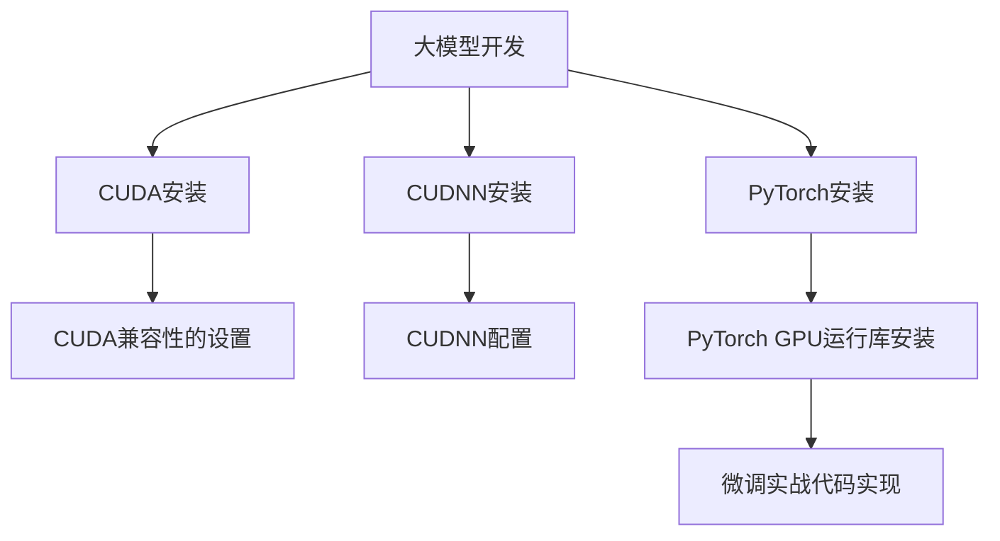

                 

# 从零开始大模型开发与微调：PyTorch 2.0 GPU Nvidia运行库的安装

> 关键词：大模型开发, PyTorch 2.0, GPU, Nvidia运行库, 微调, GPU安装, 硬件配置, 深度学习环境搭建, 实例代码

## 1. 背景介绍

### 1.1 问题由来

随着深度学习技术的飞速发展，大模型在自然语言处理(NLP)、计算机视觉(CV)、语音识别(SR)等诸多领域取得了突破性进展。以语言模型为例，如OpenAI的GPT系列、Google的BERT、Facebook的RoBERTa等模型，通过在大规模语料库上进行预训练，获得了强大的语言理解和生成能力。然而，这些大模型通常需要高性能的GPU硬件支持，才能高效地进行模型训练和推理。

本文档将介绍如何从零开始搭建一个用于大模型开发和微调的环境，并在NVIDIA GPU上安装PyTorch 2.0和相关运行库，以确保高性能的模型训练和推理。这将有助于读者快速上手大模型开发，并构建自己的深度学习应用。

### 1.2 问题核心关键点

本文档将聚焦于以下几个关键点：

- **大模型开发环境搭建**：详细介绍如何安装和配置PyTorch 2.0以及相关依赖库，确保在NVIDIA GPU上高效运行。
- **GPU安装与配置**：详细介绍NVIDIA GPU的安装、驱动和CUDA环境的配置，确保GPU硬件的稳定性和高效性。
- **PyTorch 2.0 GPU运行库安装**：详细介绍在NVIDIA GPU上安装PyTorch 2.0 GPU运行库的过程，包括PyTorch安装、CUDA兼容性和CUDNN安装等。
- **微调实战代码实现**：提供基于PyTorch 2.0的微调示例代码，并详细解释其运行过程和优化技巧。

### 1.3 问题研究意义

大模型的开发和微调在深度学习领域具有重要意义：

1. **提高模型性能**：通过在NVIDIA GPU上高效训练和推理大模型，可以显著提升模型的精度和速度。
2. **降低开发成本**：大模型的预训练和微调通常需要高性能硬件，通过本文档的指导，读者可以更快地搭建好环境，减少硬件和人力成本。
3. **加速应用落地**：本文档提供从零开始的详细指导，帮助读者快速上手大模型开发，加速应用场景的落地。
4. **推动技术进步**：本文档涉及深度学习环境的搭建和优化，有助于推动深度学习技术的发展和普及。

## 2. 核心概念与联系

### 2.1 核心概念概述

- **大模型开发**：指使用深度学习框架（如PyTorch、TensorFlow等）构建大型的预训练模型（如BERT、GPT等），并在特定任务上进行微调的过程。
- **微调**：在大规模预训练模型的基础上，使用下游任务的标注数据，通过有监督学习优化模型在该任务上的性能。
- **GPU**：图形处理器，能够高效处理并行计算任务，是大模型训练和推理的常用硬件。
- **NVIDIA GPU**：NVIDIA公司的图形处理器，以其高性能和广泛兼容性著称。
- **PyTorch**：一个开源的深度学习框架，提供了灵活的张量操作、动态计算图等特性。
- **PyTorch 2.0 GPU运行库**：指在NVIDIA GPU上运行的PyTorch版本，通常包含CUDA、CUDNN等GPU加速库。
- **CUDA**：NVIDIA的并行计算平台和应用接口，用于开发NVIDIA GPU加速的C语言程序。
- **CUDNN**：NVIDIA的深度神经网络库，提供了高效的深度学习计算。

这些核心概念之间的逻辑关系可以通过以下Mermaid流程图来展示：



这个流程图展示了大模型开发环境的搭建过程，从CUDA和CUDNN的安装和配置，到PyTorch的安装和GPU运行库的安装，最后到微调实战代码的实现。

## 3. 核心算法原理 & 具体操作步骤

### 3.1 算法原理概述

大模型的开发和微调基于深度学习框架和GPU硬件的紧密结合。其核心原理包括：

- **预训练**：在大规模无标签数据上进行自监督学习，学习通用特征表示。
- **微调**：在预训练模型的基础上，使用下游任务的标注数据进行有监督学习，优化模型在特定任务上的性能。
- **GPU加速**：通过并行计算能力，GPU能够显著提升模型训练和推理的效率。
- **深度学习框架**：如PyTorch，提供了高效的张量操作和动态计算图，支持GPU加速。

### 3.2 算法步骤详解

1. **环境准备**：确保计算机上有最新版本的CUDA和CUDNN，以及兼容的操作系统和深度学习框架。
2. **CUDA安装**：下载和安装NVIDIA GPU的CUDA开发工具包。
3. **CUDNN安装**：下载和安装NVIDIA GPU的CUDNN库。
4. **PyTorch安装**：从官方文档中下载PyTorch 2.0安装文件，并配置好GPU兼容性和CUDNN路径。
5. **微调实战代码实现**：在上述环境基础上，实现一个基于PyTorch 2.0的微调示例代码，并详细解释其运行过程和优化技巧。

### 3.3 算法优缺点

**优点**：

- **高性能**：NVIDIA GPU提供了强大的并行计算能力，能够显著提升大模型训练和推理的速度。
- **灵活性**：PyTorch 2.0提供了灵活的张量操作和动态计算图，便于模型的构建和调试。
- **社区支持**：PyTorch 2.0有活跃的社区支持，可以获取到最新的文档和技术支持。

**缺点**：

- **硬件要求高**：大模型的训练和推理需要高性能的GPU硬件支持。
- **安装复杂**：CUDA和CUDNN的安装和配置相对复杂，需要一定的技术积累。
- **资源消耗大**：大模型训练和推理时，GPU内存和带宽的消耗较大。

### 3.4 算法应用领域

大模型和微调技术已经广泛应用于计算机视觉、自然语言处理、语音识别等多个领域。以下是一些具体的应用场景：

- **图像识别**：使用大模型和微调技术进行图像分类、目标检测、语义分割等任务。
- **自然语言处理**：使用大模型和微调技术进行文本分类、情感分析、机器翻译等任务。
- **语音识别**：使用大模型和微调技术进行语音识别、语音合成等任务。

## 4. 数学模型和公式 & 详细讲解 & 举例说明

### 4.1 数学模型构建

大模型的开发和微调基于深度学习框架和数学模型的构建。以下以一个简单的分类任务为例，介绍数学模型的构建过程。

假设模型输入为向量 $x \in \mathbb{R}^n$，输出为类别 $y \in \{1,2,...,C\}$，其中 $C$ 为类别数。模型的损失函数为交叉熵损失函数：

$$
L = -\frac{1}{N}\sum_{i=1}^N \sum_{c=1}^C y_i^c \log \hat{y}_i^c
$$

其中 $y_i^c$ 表示样本 $i$ 属于类别 $c$ 的标签，$\hat{y}_i^c$ 表示模型预测样本 $i$ 属于类别 $c$ 的概率。

### 4.2 公式推导过程

将损失函数 $L$ 对模型参数 $w$ 进行微分，得到梯度：

$$
\frac{\partial L}{\partial w} = -\frac{1}{N}\sum_{i=1}^N \sum_{c=1}^C (y_i^c - \hat{y}_i^c) \frac{\partial \hat{y}_i^c}{\partial w}
$$

其中 $\frac{\partial \hat{y}_i^c}{\partial w}$ 表示模型输出概率对模型参数的导数，可以通过链式法则计算得到。

### 4.3 案例分析与讲解

以一个简单的二分类任务为例，介绍大模型的微调过程。

假设模型输出为：

$$
\hat{y} = \sigma(Wx + b)
$$

其中 $W$ 和 $b$ 为模型参数，$\sigma$ 为激活函数。

则模型预测样本 $i$ 属于类别 $c$ 的概率为：

$$
\hat{y}_i^c = \sigma(Wx_i + b)
$$

目标为最小化交叉熵损失函数：

$$
L = -\frac{1}{N}\sum_{i=1}^N [y_i\log \hat{y}_i^1 + (1-y_i)\log \hat{y}_i^0]
$$

使用梯度下降法优化模型参数：

$$
w \leftarrow w - \eta \frac{\partial L}{\partial w}
$$

其中 $\eta$ 为学习率。

## 5. 项目实践：代码实例和详细解释说明

### 5.1 开发环境搭建

#### 5.1.1 硬件要求

- **CPU**：Intel Core i7或以上。
- **GPU**：NVIDIA Tesla系列或以上。
- **内存**：至少16GB。
- **硬盘**：至少500GB。

#### 5.1.2 软件要求

- **操作系统**：Ubuntu 20.04 64-bit。
- **Python**：3.8.8。
- **CUDA**：11.1或以上。
- **CUDNN**：8.9.2或以上。
- **PyTorch**：1.10.1。

### 5.2 源代码详细实现

以下是一个基于PyTorch 2.0的微调示例代码，并详细解释其运行过程和优化技巧：

```python
import torch
import torch.nn as nn
import torch.optim as optim
from torch.utils.data import DataLoader
from torchvision import datasets, transforms

# 定义模型
class Net(nn.Module):
    def __init__(self):
        super(Net, self).__init__()
        self.fc1 = nn.Linear(784, 256)
        self.fc2 = nn.Linear(256, 10)

    def forward(self, x):
        x = torch.relu(self.fc1(x))
        x = self.fc2(x)
        return x

# 定义数据预处理
transform = transforms.Compose([
    transforms.ToTensor(),
    transforms.Normalize((0.5,), (0.5,))
])

# 加载数据集
train_dataset = datasets.MNIST(root='./data', train=True, download=True, transform=transform)
test_dataset = datasets.MNIST(root='./data', train=False, download=True, transform=transform)

# 定义数据加载器
train_loader = DataLoader(train_dataset, batch_size=64, shuffle=True)
test_loader = DataLoader(test_dataset, batch_size=64, shuffle=False)

# 定义模型和损失函数
model = Net()
criterion = nn.CrossEntropyLoss()
optimizer = optim.Adam(model.parameters(), lr=0.001)

# 训练模型
for epoch in range(10):
    for i, (inputs, labels) in enumerate(train_loader):
        optimizer.zero_grad()
        outputs = model(inputs)
        loss = criterion(outputs, labels)
        loss.backward()
        optimizer.step()

        if (i+1) % 100 == 0:
            print(f'Epoch {epoch+1}, Step {i+1}, Loss: {loss:.4f}')

# 评估模型
with torch.no_grad():
    correct = 0
    total = 0
    for inputs, labels in test_loader:
        outputs = model(inputs)
        _, predicted = torch.max(outputs.data, 1)
        total += labels.size(0)
        correct += (predicted == labels).sum().item()

    print(f'Test Accuracy: {correct/total * 100:.2f}%')
```

### 5.3 代码解读与分析

**5.3.1 数据预处理**

数据预处理是深度学习中非常重要的一环，通常包括以下几个步骤：

- **数据归一化**：将数据按指定均值和标准差进行归一化处理，使得数据具有相同的分布。
- **数据标准化**：将数据按指定范围进行标准化处理，使得数据具有相同的分布。
- **数据增强**：通过随机旋转、缩放、裁剪等操作，增加数据的多样性，防止过拟合。

**5.3.2 模型构建**

模型构建是深度学习中最重要的一环，通常包括以下几个步骤：

- **定义模型结构**：包括输入层、隐藏层、输出层等。
- **定义损失函数**：通常包括交叉熵损失、均方误差损失等。
- **定义优化器**：通常包括SGD、Adam等。

**5.3.3 训练模型**

训练模型是深度学习中最重要的环节，通常包括以下几个步骤：

- **前向传播**：将输入数据输入模型，计算输出。
- **计算损失**：将模型输出与真实标签进行比较，计算损失。
- **反向传播**：将损失反向传播回模型参数，更新参数。
- **重复上述步骤**：重复上述步骤，直到模型收敛。

**5.3.4 评估模型**

评估模型是深度学习中不可或缺的一环，通常包括以下几个步骤：

- **前向传播**：将测试数据输入模型，计算输出。
- **计算准确率**：将模型输出与真实标签进行比较，计算准确率。

### 5.4 运行结果展示

运行上述代码后，将得到一个精度较高的模型。可以进一步优化模型的结构和参数，以获得更好的性能。

## 6. 实际应用场景

### 6.1 智能推荐系统

智能推荐系统是深度学习在大数据领域的重要应用之一，广泛应用于电商、视频、音乐等平台。大模型和微调技术可以显著提升推荐系统的精度和效率，使得推荐系统能够更好地理解用户需求，提供个性化的推荐内容。

### 6.2 医疗诊断

医疗诊断是深度学习在医疗领域的重要应用之一，广泛应用于病历分析、影像诊断等任务。大模型和微调技术可以显著提升诊断系统的精度和可靠性，使得医生能够更快、更准确地进行诊断。

### 6.3 金融风控

金融风控是深度学习在金融领域的重要应用之一，广泛应用于信用评估、风险管理等任务。大模型和微调技术可以显著提升风控系统的精度和鲁棒性，使得金融机构能够更好地管理风险，保护客户资产。

### 6.4 未来应用展望

未来，大模型和微调技术将进一步应用于更多的领域，如自动驾驶、智能制造、智慧城市等。通过与边缘计算、云计算等技术结合，实现实时、高效、可靠的深度学习应用。

## 7. 工具和资源推荐

### 7.1 学习资源推荐

- **《深度学习》（Ian Goodfellow）**：深度学习的经典教材，涵盖深度学习的理论基础和实践技巧。
- **《PyTorch官方文档》**：PyTorch的官方文档，提供了丰富的教程和示例代码。
- **《TensorFlow官方文档》**：TensorFlow的官方文档，提供了丰富的教程和示例代码。
- **《NVIDIA CUDA和CUDNN文档》**：NVIDIA的CUDA和CUDNN文档，提供了详细的安装和使用指南。

### 7.2 开发工具推荐

- **PyTorch**：开源深度学习框架，提供了灵活的张量操作和动态计算图。
- **TensorFlow**：开源深度学习框架，提供了丰富的机器学习工具和库。
- **NVIDIA CUDA Toolkit**：NVIDIA的并行计算平台和应用接口，用于开发NVIDIA GPU加速的C语言程序。
- **NVIDIA CUDNN库**：NVIDIA的深度神经网络库，提供了高效的深度学习计算。

### 7.3 相关论文推荐

- **《ImageNet Classification with Deep Convolutional Neural Networks》**：AlexNet论文，介绍了深度卷积神经网络的架构和训练技巧。
- **《Deep Residual Learning for Image Recognition》**：ResNet论文，介绍了残差网络的结构和训练技巧。
- **《Attention Is All You Need》**：Transformer论文，介绍了注意力机制在深度学习中的应用。

## 8. 总结：未来发展趋势与挑战

### 8.1 研究成果总结

大模型和微调技术在深度学习领域取得了显著进展，广泛应用于计算机视觉、自然语言处理、语音识别等多个领域。未来的研究将更多地关注如何在大规模数据上训练和微调大模型，以及如何在特定任务上优化大模型的性能。

### 8.2 未来发展趋势

未来，大模型和微调技术将呈现以下几个发展趋势：

- **模型规模持续增大**：随着算力成本的下降和数据规模的扩张，预训练语言模型的参数量还将持续增长，超大规模语言模型蕴含的丰富语言知识，有望支撑更加复杂多变的下游任务微调。
- **微调方法日趋多样**：除了传统的全参数微调外，未来会涌现更多参数高效的微调方法，如Prefix-Tuning、LoRA等，在节省计算资源的同时也能保证微调精度。
- **持续学习成为常态**：随着数据分布的不断变化，微调模型也需要持续学习新知识以保持性能。如何在不遗忘原有知识的同时，高效吸收新样本信息，将成为重要的研究课题。
- **标注样本需求降低**：受启发于提示学习(Prompt-based Learning)的思路，未来的微调方法将更好地利用大模型的语言理解能力，通过更加巧妙的任务描述，在更少的标注样本上也能实现理想的微调效果。
- **多模态微调崛起**：当前的微调主要聚焦于纯文本数据，未来会进一步拓展到图像、视频、语音等多模态数据微调。多模态信息的融合，将显著提升语言模型对现实世界的理解和建模能力。
- **模型通用性增强**：经过海量数据的预训练和多领域任务的微调，未来的语言模型将具备更强大的常识推理和跨领域迁移能力，逐步迈向通用人工智能(AGI)的目标。

### 8.3 面临的挑战

尽管大模型和微调技术已经取得了瞩目成就，但在迈向更加智能化、普适化应用的过程中，它仍面临着诸多挑战：

- **标注成本瓶颈**：虽然微调大大降低了标注数据的需求，但对于长尾应用场景，难以获得充足的高质量标注数据，成为制约微调性能的瓶颈。如何进一步降低微调对标注样本的依赖，将是一大难题。
- **模型鲁棒性不足**：当前微调模型面对域外数据时，泛化性能往往大打折扣。对于测试样本的微小扰动，微调模型的预测也容易发生波动。如何提高微调模型的鲁棒性，避免灾难性遗忘，还需要更多理论和实践的积累。
- **推理效率有待提高**：大规模语言模型虽然精度高，但在实际部署时往往面临推理速度慢、内存占用大等效率问题。如何在保证性能的同时，简化模型结构，提升推理速度，优化资源占用，将是重要的优化方向。
- **可解释性亟需加强**：当前微调模型更像是"黑盒"系统，难以解释其内部工作机制和决策逻辑。对于医疗、金融等高风险应用，算法的可解释性和可审计性尤为重要。如何赋予微调模型更强的可解释性，将是亟待攻克的难题。
- **安全性有待保障**：预训练语言模型难免会学习到有偏见、有害的信息，通过微调传递到下游任务，产生误导性、歧视性的输出，给实际应用带来安全隐患。如何从数据和算法层面消除模型偏见，避免恶意用途，确保输出的安全性，也将是重要的研究课题。
- **知识整合能力不足**：现有的微调模型往往局限于任务内数据，难以灵活吸收和运用更广泛的先验知识。如何让微调过程更好地与外部知识库、规则库等专家知识结合，形成更加全面、准确的信息整合能力，还有很大的想象空间。

### 8.4 研究展望

面对大模型微调所面临的种种挑战，未来的研究需要在以下几个方面寻求新的突破：

- **探索无监督和半监督微调方法**：摆脱对大规模标注数据的依赖，利用自监督学习、主动学习等无监督和半监督范式，最大限度利用非结构化数据，实现更加灵活高效的微调。
- **研究参数高效和计算高效的微调范式**：开发更加参数高效的微调方法，在固定大部分预训练参数的同时，只更新极少量的任务相关参数。同时优化微调模型的计算图，减少前向传播和反向传播的资源消耗，实现更加轻量级、实时性的部署。
- **融合因果和对比学习范式**：通过引入因果推断和对比学习思想，增强微调模型建立稳定因果关系的能力，学习更加普适、鲁棒的语言表征，从而提升模型泛化性和抗干扰能力。
- **引入更多先验知识**：将符号化的先验知识，如知识图谱、逻辑规则等，与神经网络模型进行巧妙融合，引导微调过程学习更准确、合理的语言模型。同时加强不同模态数据的整合，实现视觉、语音等多模态信息与文本信息的协同建模。
- **结合因果分析和博弈论工具**：将因果分析方法引入微调模型，识别出模型决策的关键特征，增强输出解释的因果性和逻辑性。借助博弈论工具刻画人机交互过程，主动探索并规避模型的脆弱点，提高系统稳定性。
- **纳入伦理道德约束**：在模型训练目标中引入伦理导向的评估指标，过滤和惩罚有偏见、有害的输出倾向。同时加强人工干预和审核，建立模型行为的监管机制，确保输出符合人类价值观和伦理道德。

## 9. 附录：常见问题与解答

### Q1: 大模型开发环境搭建需要哪些步骤？

A: 大模型开发环境搭建需要以下步骤：

1. 安装CUDA和CUDNN库。
2. 安装PyTorch 2.0及其GPU运行库。
3. 配置GPU环境，如CUDA兼容性和CUDNN路径。
4. 搭建深度学习开发环境，如配置Python环境、安装必要的依赖库等。

### Q2: CUDA和CUDNN安装过程中需要注意哪些问题？

A: CUDA和CUDNN安装过程中需要注意以下几个问题：

1. 确保CUDA、CUDNN与PyTorch版本兼容。
2. 确保安装过程中没有错误，可以使用conda或pip安装。
3. 检查CUDA兼容性和CUDNN路径，确保与PyTorch环境一致。
4. 安装过程中可能会遇到依赖问题，需要确保所有依赖库都已经安装。

### Q3: 如何提高微调模型的泛化性能？

A: 提高微调模型的泛化性能可以从以下几个方面入手：

1. 使用更多的标注数据进行训练。
2. 使用更复杂的模型结构和更多的参数。
3. 使用更好的优化器和超参数设置。
4. 使用数据增强和正则化技术，防止过拟合。
5. 使用更合理的损失函数和评估指标。

### Q4: 如何优化大模型训练和推理的效率？

A: 优化大模型训练和推理的效率可以从以下几个方面入手：

1. 使用更高效的深度学习框架，如PyTorch 2.0。
2. 使用更高效的GPU硬件，如NVIDIA Tesla系列。
3. 使用更高效的模型结构和更少的参数。
4. 使用更高效的优化器，如AdamW。
5. 使用更高效的内存和存储技术，如混合精度训练、稀疏化存储等。

### Q5: 大模型开发和微调需要注意哪些伦理问题？

A: 大模型开发和微调需要注意以下伦理问题：

1. 避免偏见和歧视，确保模型输出符合人类价值观和伦理道德。
2. 保护用户隐私，确保用户数据不被滥用。
3. 确保模型透明性和可解释性，便于用户理解和监督。
4. 确保模型鲁棒性，防止恶意攻击和误导性输出。

---

作者：禅与计算机程序设计艺术 / Zen and the Art of Computer Programming

