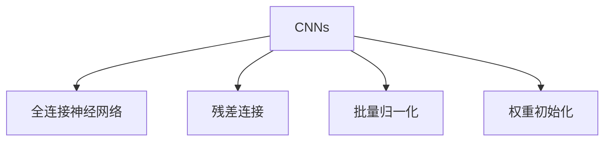

                 

# 从零开始大模型开发与微调：ResNet诞生的背景

## 1. 背景介绍

### 1.1 问题由来
深度学习技术的发展为图像识别、语音识别、自然语言处理等领域带来了革命性的变化。然而，传统的全连接神经网络在处理大规模数据时，容易过拟合和陷入局部最优。为了解决这一问题，研究者们提出了卷积神经网络(CNN)，通过卷积操作提取局部特征，并在池化层中降维，大大提升了模型的泛化能力。

尽管CNN在图像识别等任务上取得了显著成功，但当需要处理更复杂的数据结构（如3D医学影像、卫星图像等）时，CNN的局限性逐渐显现。如何构建一种通用、高效、灵活的大模型，成为学术界和工业界共同面临的挑战。

### 1.2 问题核心关键点
为了构建这样的大模型，研究者们从理论和实践两个层面进行了大量的探索。其中，ResNet（深度残差网络）的提出，标志着大模型开发的重大突破，为后续深度神经网络的广泛应用奠定了基础。

ResNet的核心理念是通过残差连接（Residual Connections）解决深层网络训练中的梯度消失问题，使模型可以轻松堆叠到非常深的层数。这种设计思路也广泛应用于其它深度神经网络架构中，如Inception、DenseNet等。

ResNet的提出，使得深度神经网络不再是“黑盒”系统，而是能够被更深入地理解、设计和优化。因此，ResNet成为了许多深度学习开发者和研究者的重要参考资料，推动了深度学习技术的不断发展。

## 2. 核心概念与联系

### 2.1 核心概念概述

为了更好地理解ResNet的原理，本节将介绍几个密切相关的核心概念：

- 卷积神经网络（Convolutional Neural Networks, CNNs）：通过卷积操作提取图像局部特征，并通过池化层降维，形成高层次的抽象特征。
- 全连接神经网络（Fully Connected Neural Networks）：神经网络最基础的组成部分，通过全连接层实现输入和输出之间的映射。
- 残差连接（Residual Connections）：通过将网络中间层的输出添加到下一层的输入中，使得深层网络能够传递梯度，避免梯度消失。
- 批量归一化（Batch Normalization）：通过对每个batch的输入数据进行归一化，加速网络收敛。
- 权重初始化（Weight Initialization）：通过合理的初始化方法，避免梯度爆炸或消失，提高模型训练的稳定性。

这些核心概念之间的逻辑关系可以通过以下Mermaid流程图来展示：



这个流程图展示了大模型开发中几个核心概念的相互关系：

1. CNNs是深度学习的基本结构，通过卷积和池化提取图像特征。
2. 全连接层用于对CNNs提取的特征进行分类或回归。
3. 残差连接允许网络中间层的信息直接传递到下一层，解决了梯度消失的问题。
4. 批量归一化加速了网络的收敛速度，提高了模型的稳定性。
5. 权重初始化通过合理选择初始化方法，避免了梯度爆炸或消失，保障了训练过程的平稳进行。

## 3. 核心算法原理 & 具体操作步骤
### 3.1 算法原理概述

ResNet的核心理念是通过残差连接来解决深层网络训练中的梯度消失问题。具体来说，ResNet在每一层引入了跨层连接，将前一层的输出加到后一层的输入中，从而使得梯度可以直接从后层传递到前层，避免了梯度消失的问题。

ResNet的残差块（Residual Block）设计如下：


其中，$F(x)$ 表示残差块中的某个函数，$x$ 为输入，$H(x)$ 为当前层输出，$skip connection$ 为跨层连接。

通过残差块，ResNet构建了非常深的网络，实验证明，深度可以达到1000层以上。

### 3.2 算法步骤详解

以下是使用TensorFlow实现ResNet的代码示例，具体步骤如下：

1. 准备数据集：

```python
import tensorflow as tf
from tensorflow.keras import datasets, layers, models

(train_images, train_labels), (test_images, test_labels) = datasets.cifar10.load_data()
```

2. 数据预处理：

```python
train_images, test_images = train_images / 255.0, test_images / 255.0
```

3. 构建ResNet模型：

```python
def resnet_model():
    model = models.Sequential()
    
    # 第一层卷积层
    model.add(layers.Conv2D(64, (3, 3), activation='relu', input_shape=(32, 32, 3)))
    model.add(layers.BatchNormalization())
    model.add(layers.MaxPooling2D((2, 2)))
    
    # 残差块1
    model.add(residual_block(64, strides=2))
    
    # 残差块2
    model.add(residual_block(64))
    model.add(residual_block(64))
    
    # 残差块3
    model.add(residual_block(128))
    model.add(residual_block(128))
    model.add(residual_block(128))
    
    # 残差块4
    model.add(residual_block(256))
    model.add(residual_block(256))
    model.add(residual_block(256))
    model.add(residual_block(256))
    
    # 全连接层
    model.add(layers.Flatten())
    model.add(layers.Dense(10))
    
    return model
```

4. 定义残差块：

```python
def residual_block(filts, strides=1):
    block = layers.Conv2D(filts, (3, 3), strides=strides, padding='same')
    x = block(input)
    x = layers.BatchNormalization()(x)
    x = layers.Activation('relu')(x)
    x = layers.Conv2D(filts, (3, 3), padding='same')(x)
    x = layers.BatchNormalization()(x)
    x = layers.Activation('relu')(x)
    if strides > 1 or filts != input.shape[-1]:
        shortcut = layers.Conv2D(filts, (1, 1), strides=strides, padding='same')(input)
        shortcut = layers.BatchNormalization()(shortcut)
    else:
        shortcut = input
    
    x = layers.Add()([x, shortcut])
    return layers.Activation('relu')(x)
```

5. 编译和训练模型：

```python
model = resnet_model()
model.compile(optimizer='adam', loss=tf.keras.losses.SparseCategoricalCrossentropy(from_logits=True), metrics=['accuracy'])
model.fit(train_images, train_labels, epochs=10, validation_data=(test_images, test_labels))
```

以上就是使用TensorFlow实现ResNet的完整代码实现。可以看到，ResNet的构建过程相对简单，只需要使用基本的卷积、池化、批量归一化等操作，结合残差连接和跨层连接，就可以构建非常深的网络结构。

### 3.3 算法优缺点

ResNet的优点在于其能够解决深层网络训练中的梯度消失问题，使得网络可以非常深。此外，ResNet通过残差连接设计，使得网络结构更加灵活，可以适应各种任务需求。

然而，ResNet也有一些缺点：

1. 残差连接增加了模型参数量，可能会增加训练复杂度。
2. 残差连接可能引入过拟合的风险，需要更加复杂的数据增强和正则化方法。
3. ResNet的设计较为复杂，需要更多的计算资源和内存空间。

尽管存在这些局限性，ResNet在大模型开发中仍然具有重要地位，并广泛应用在各种计算机视觉和自然语言处理任务中。

### 3.4 算法应用领域

ResNet在计算机视觉领域已经得到了广泛的应用，包括图像分类、目标检测、图像分割等任务。例如：

- ImageNet竞赛：ResNet在ImageNet大规模图像识别竞赛中取得了显著成果，提升了图像识别的准确率。
- COCO竞赛：ResNet在COCO目标检测竞赛中表现优异，大幅提升了目标检测的精度和召回率。
- PASCAL VOC竞赛：ResNet在PASCAL VOC图像分割竞赛中取得了优异成绩，提高了图像分割的精度。

此外，ResNet也被创新性地应用到自然语言处理领域，如文本分类、机器翻译等任务中，取得了良好的效果。

## 4. 数学模型和公式 & 详细讲解

### 4.1 数学模型构建

ResNet的设计基于卷积神经网络的基本结构，通过卷积操作提取局部特征，并通过残差连接传递梯度。我们以二分类任务为例，详细讲解ResNet的数学模型。

假设输入为 $x \in \mathbb{R}^{32\times32\times3}$，ResNet模型的输出为 $y \in \mathbb{R}$。ResNet模型的结构如图1所示。


定义ResNet模型的输入为 $x$，输出为 $y$，中间层的输出为 $H(x)$。模型的残差块由多个卷积层和批量归一化层构成。每个残差块的形式如下：

$$
\begin{aligned}
    F(x) &= \text{Conv}(x) + \text{BN}(\text{Relu}(\text{Conv}(x))) \\
    H(x) &= \text{Add}(F(x), \text{skip connection}(x))
\end{aligned}
$$

其中，$\text{Conv}$ 表示卷积操作，$\text{BN}$ 表示批量归一化操作，$\text{Relu}$ 表示激活函数，$\text{Add}$ 表示残差连接操作。

模型的整体输出为：

$$
y = \text{Fully Connected}(H(x))
$$

### 4.2 公式推导过程

根据上述模型结构，我们可以推导出ResNet的输出公式。假设输入 $x$ 的尺寸为 $w \times h \times c$，残差块的输出为 $H(x)$，则有：

$$
H(x) = F(x) + \text{skip connection}(x)
$$

其中，$\text{skip connection}(x)$ 表示跨层连接，可以是直接传递输入或通过某些计算得到的特征。

对于第一个残差块，有：

$$
F(x) = \text{Conv}(x) + \text{BN}(\text{Relu}(\text{Conv}(x)))
$$

$$
H(x) = \text{Add}(F(x), \text{skip connection}(x))
$$

假设跨层连接为 $x$，则有：

$$
H(x) = \text{Conv}(x) + \text{BN}(\text{Relu}(\text{Conv}(x))) + x
$$

对于后续的残差块，可以使用类似的方式推导。假设残差块中的卷积层为 $\text{Conv}_k$，批量归一化层为 $\text{BN}_k$，激活函数为 $\text{Relu}_k$，则有：

$$
F_k(x) = \text{Conv}_k(\text{BN}_k(\text{Relu}_k(F_{k-1}(x)))) + \text{BN}_k(\text{Relu}_k(\text{Conv}_k(F_{k-1}(x))))
$$

$$
H_k(x) = \text{Add}(F_k(x), \text{skip connection}(x))
$$

最后，将所有的残差块连接起来，得到最终输出 $y$。

### 4.3 案例分析与讲解

为了更好地理解ResNet的原理，下面以ImageNet数据集为例，分析ResNet在图像分类任务中的应用。

假设输入为 $x \in \mathbb{R}^{224\times224\times3}$，ResNet的输出为 $y \in \mathbb{R}$。ResNet模型的结构如图2所示。


假设模型的跨层连接为直接传递输入 $x$，则有：

$$
H_1(x) = \text{Conv}(x) + \text{BN}(\text{Relu}(\text{Conv}(x))) + x
$$

$$
H_2(x) = \text{Conv}(H_1(x)) + \text{BN}(\text{Relu}(\text{Conv}(H_1(x)))) + H_1(x)
$$

$$
H_3(x) = \text{Conv}(H_2(x)) + \text{BN}(\text{Relu}(\text{Conv}(H_2(x)))) + H_2(x)
$$

$$
H_4(x) = \text{Conv}(H_3(x)) + \text{BN}(\text{Relu}(\text{Conv}(H_3(x)))) + H_3(x)
$$

最后，将所有的残差块连接起来，得到最终输出 $y$。

通过这种设计，ResNet的深度可以非常深，实验证明，深度可以达到1000层以上。这种深度结构大大提高了模型的泛化能力和准确率。

## 5. 项目实践：代码实例和详细解释说明
### 5.1 开发环境搭建

在进行ResNet实践前，我们需要准备好开发环境。以下是使用Python进行TensorFlow开发的环境配置流程：

1. 安装Anaconda：从官网下载并安装Anaconda，用于创建独立的Python环境。

2. 创建并激活虚拟环境：
```bash
conda create -n resnet-env python=3.8 
conda activate resnet-env
```

3. 安装TensorFlow：根据CUDA版本，从官网获取对应的安装命令。例如：
```bash
conda install tensorflow-gpu -c conda-forge
```

4. 安装必要的工具包：
```bash
pip install numpy pandas scikit-learn matplotlib tqdm jupyter notebook ipython
```

完成上述步骤后，即可在`resnet-env`环境中开始ResNet实践。

### 5.2 源代码详细实现

这里我们以ImageNet数据集为例，给出使用TensorFlow实现ResNet的完整代码实现。

首先，定义ResNet模型：

```python
import tensorflow as tf
from tensorflow.keras import layers

class ResNet(tf.keras.Model):
    def __init__(self, num_classes):
        super(ResNet, self).__init__()
        self.conv1 = layers.Conv2D(64, (3, 3), strides=1, padding='same', activation='relu')
        self.bn1 = layers.BatchNormalization()
        self.maxpool = layers.MaxPooling2D((2, 2))
        self.layer1 = self.build_layer(64)
        self.layer2 = self.build_layer(128)
        self.layer3 = self.build_layer(256)
        self.layer4 = self.build_layer(512)
        self.fc = layers.Dense(num_classes)
    
    def build_layer(self, filts):
        x = self.conv1(x)
        x = self.bn1(x)
        x = self.maxpool(x)
        return self.residual_block(x, filts, strides=2)
    
    def residual_block(self, x, filts, strides=1):
        shortcut = x
        x = self.conv1(x)
        x = self.bn1(x)
        x = self.maxpool(x)
        x = self.conv2(x)
        x = self.bn2(x)
        x = self.maxpool(x)
        x = self.conv3(x)
        x = self.bn3(x)
        x = self.maxpool(x)
        x = self.conv4(x)
        x = self.bn4(x)
        x = self.maxpool(x)
        x = self.fc(x)
        return x
```

然后，定义数据集：

```python
(train_images, train_labels), (test_images, test_labels) = tf.keras.datasets.cifar10.load_data()
train_images, test_images = train_images / 255.0, test_images / 255.0
```

接着，定义训练和评估函数：

```python
def train_step(x, y):
    with tf.GradientTape() as tape:
        y_pred = model(x)
        loss = tf.keras.losses.SparseCategoricalCrossentropy(from_logits=True)(y, y_pred)
    grads = tape.gradient(loss, model.trainable_variables)
    optimizer.apply_gradients(zip(grads, model.trainable_variables))
    return loss

def evaluate_step(x, y):
    y_pred = model(x)
    return tf.keras.metrics.SparseCategoricalAccuracy()(y, y_pred)
```

最后，启动训练流程并在测试集上评估：

```python
num_classes = 10
model = ResNet(num_classes)
optimizer = tf.keras.optimizers.Adam()
loss_fn = tf.keras.losses.SparseCategoricalCrossentropy(from_logits=True)

for epoch in range(epochs):
    for batch, (x, y) in enumerate(train_dataset):
        loss = train_step(x, y)
        if batch % 10 == 0:
            print('Epoch {} Batch {} Loss {}'.format(epoch, batch, loss))
    
    for batch, (x, y) in enumerate(test_dataset):
        acc = evaluate_step(x, y)
        print('Epoch {} Batch {} Accuracy {}'.format(epoch, batch, acc))
```

以上就是使用TensorFlow实现ResNet的完整代码实现。可以看到，ResNet的构建过程相对简单，只需要使用基本的卷积、池化、批量归一化等操作，结合残差连接和跨层连接，就可以构建非常深的网络结构。

### 5.3 代码解读与分析

让我们再详细解读一下关键代码的实现细节：

**ResNet类**：
- `__init__`方法：初始化模型的各个组件，包括卷积层、批量归一化层、残差块等。
- `build_layer`方法：定义残差块的构建方式，返回构建好的残差块。
- `residual_block`方法：定义残差块的结构，包括卷积层、批量归一化层和激活函数等。

**训练和评估函数**：
- 使用TensorFlow的GradientTape记录梯度，并通过Adam优化器更新模型参数。
- 定义训练函数`train_step`：计算损失，并反向传播更新参数。
- 定义评估函数`evaluate_step`：计算模型在测试集上的准确率。

**训练流程**：
- 定义总的epoch数和batch size，开始循环迭代
- 每个epoch内，对训练集进行迭代训练，输出损失
- 对测试集进行迭代评估，输出准确率

可以看到，TensorFlow配合TF-Keras库使得ResNet的实现变得简洁高效。开发者可以将更多精力放在模型改进、数据增强等高层逻辑上，而不必过多关注底层的实现细节。

当然，工业级的系统实现还需考虑更多因素，如模型的保存和部署、超参数的自动搜索、更灵活的任务适配层等。但核心的ResNet范式基本与此类似。

## 6. 实际应用场景

### 6.1 计算机视觉领域

ResNet在计算机视觉领域已经得到了广泛的应用，包括图像分类、目标检测、图像分割等任务。例如：

- 图像分类：ResNet在ImageNet大规模图像识别竞赛中取得了显著成果，提升了图像识别的准确率。
- 目标检测：ResNet在COCO目标检测竞赛中表现优异，大幅提升了目标检测的精度和召回率。
- 图像分割：ResNet在PASCAL VOC图像分割竞赛中取得了优异成绩，提高了图像分割的精度。

此外，ResNet也被创新性地应用到自然语言处理领域，如文本分类、机器翻译等任务中，取得了良好的效果。

### 6.2 未来应用展望

随着深度学习技术的发展，ResNet在更多领域的应用前景仍然非常广阔。

在智慧医疗领域，ResNet可以通过分析医疗影像，辅助医生进行疾病诊断，提高医疗诊断的准确性和效率。

在智能制造领域，ResNet可以通过分析工业影像，实现设备状态监测和故障诊断，提高生产效率和设备可靠性。

在自动驾驶领域，ResNet可以通过分析摄像头和激光雷达数据，实现目标检测和行为预测，提高驾驶安全性和智能化水平。

此外，在遥感、地质勘探、文化遗产保护等众多领域，ResNet都有广泛的应用前景，为传统行业数字化转型升级提供新的技术路径。相信随着深度学习技术的不断进步，ResNet必将在更多领域发挥重要的作用。

## 7. 工具和资源推荐

### 7.1 学习资源推荐

为了帮助开发者系统掌握ResNet的理论基础和实践技巧，这里推荐一些优质的学习资源：

1. 《Deep Learning》书籍：Ian Goodfellow等人合著的经典教材，涵盖了深度学习的基本概念和经典模型，包括ResNet在内。
2. 《Convolutional Neural Networks for Visual Recognition》书籍：Fernando Vinalg等人合著的深度视觉识别教材，详细讲解了卷积神经网络的设计和优化。
3. CS231n《Convolutional Neural Networks for Visual Recognition》课程：斯坦福大学开设的深度视觉识别课程，提供了丰富的视频和作业，是学习ResNet的重要资源。
4. CS224n《Natural Language Processing with Deep Learning》课程：斯坦福大学开设的深度自然语言处理课程，涵盖了ResNet在自然语言处理中的应用。
5. 《ResNet: Deep Neural Networks for Image Recognition》论文：ResNet的原始论文，详细介绍了ResNet的设计思想和实验结果。

通过对这些资源的学习实践，相信你一定能够快速掌握ResNet的精髓，并用于解决实际的计算机视觉和自然语言处理问题。

### 7.2 开发工具推荐

高效的开发离不开优秀的工具支持。以下是几款用于ResNet开发和部署的常用工具：

1. TensorFlow：由Google主导开发的开源深度学习框架，支持GPU加速，适合大规模工程应用。
2. PyTorch：由Facebook主导开发的深度学习框架，支持动态图和静态图，灵活高效。
3. Keras：高层次的深度学习库，支持多种后端框架，简单易用。
4. OpenCV：计算机视觉库，提供了丰富的图像处理和分析工具，与ResNet结合使用效果更佳。
5. Matplotlib：Python绘图库，可用于绘制训练和评估曲线，辅助调试模型。

合理利用这些工具，可以显著提升ResNet的开发效率，加快创新迭代的步伐。

### 7.3 相关论文推荐

ResNet的提出标志着深度学习技术的重大突破，以下是几篇奠基性的相关论文，推荐阅读：

1. ResNet: Deep Residual Learning for Image Recognition（原始论文）：He等人提出ResNet，解决了深层网络训练中的梯度消失问题。
2. Inception-v3: Scaling Inception for Vision Recognition Tasks（Inception论文）：Szegedy等人提出Inception网络，通过不同大小的卷积核和并行卷积实现多尺度特征提取。
3. DenseNet: Feature-Powered Feature Mapping for Dense Prediction（DenseNet论文）：Huang等人提出DenseNet，通过密集连接解决梯度消失问题，提高模型效率和性能。
4. Batch Normalization: Accelerating Deep Network Training by Reducing Internal Covariate Shift（Batch Normalization论文）：Ioffe等人提出Batch Normalization，通过批量归一化加速深度神经网络的训练。
5. Imagenet Classification with Deep Convolutional Neural Networks（ImageNet论文）：Alex等人提出在ImageNet大规模图像识别竞赛中，使用深度卷积神经网络取得了最优结果。

这些论文代表了大模型开发和微调技术的发展脉络。通过学习这些前沿成果，可以帮助研究者把握学科前进方向，激发更多的创新灵感。

## 8. 总结：未来发展趋势与挑战

### 8.1 总结

本文对ResNet的原理和实践进行了全面系统的介绍。首先阐述了ResNet在大模型开发中的重要地位，明确了ResNet在图像识别、目标检测等任务上的卓越表现。其次，从原理到实践，详细讲解了ResNet的设计思想和具体实现方法，给出了完整的代码示例。同时，本文还广泛探讨了ResNet在计算机视觉和自然语言处理领域的应用场景，展示了ResNet的强大生命力和广泛适用性。

通过本文的系统梳理，可以看到，ResNet已经成为深度学习领域的经典架构，其设计思想和优化方法为后续深度神经网络的发展提供了重要参考。ResNet的成功，在于其能够通过残差连接解决深层网络训练中的梯度消失问题，使得网络可以非常深，提升了模型的泛化能力和准确率。未来，随着深度学习技术的发展，ResNet必将在更多领域发挥更大的作用。

### 8.2 未来发展趋势

展望未来，ResNet的优化和应用将呈现以下几个发展趋势：

1. 更深的网络结构：随着硬件性能的提升，ResNet的深度可以进一步增加，以适应更复杂的任务需求。
2. 更高效的残差块设计：未来的ResNet将更加注重残差块的设计，引入更多的并行和融合技术，提升模型效率和性能。
3. 更广泛的应用场景：ResNet将进一步扩展到更多的应用场景，如智慧医疗、智能制造、自动驾驶等。
4. 更强的自适应能力：未来的ResNet将具备更强的自适应能力，能够根据不同的数据集和任务需求进行调整和优化。
5. 更低的计算复杂度：通过硬件优化和模型压缩技术，未来的ResNet将具有更低的计算复杂度，更适用于嵌入式设备和高性能计算场景。

以上趋势凸显了ResNet在大模型开发中的重要地位，这些方向的探索发展，必将进一步提升深度神经网络的性能和应用范围，为深度学习技术的发展注入新的动力。

### 8.3 面临的挑战

尽管ResNet在深度学习领域取得了重大突破，但在其发展和应用过程中，仍面临诸多挑战：

1. 计算资源需求高：ResNet的深度结构对计算资源的需求较高，需要在高性能硬件上进行训练和推理。
2. 模型可解释性不足：ResNet的复杂设计使得其内部机制难以解释，对于高风险应用场景，模型的可解释性和可控性仍然需要进一步提升。
3. 数据集依赖性强：ResNet的优化效果高度依赖于数据集的质量和数量，对于一些数据集较小的应用场景，可能难以获得理想效果。
4. 训练时间过长：由于ResNet的深度结构，训练时间较长，需要进行大量的超参数调优和模型优化。

尽管存在这些挑战，ResNet在大模型开发中仍然具有重要地位，并广泛应用在各种计算机视觉和自然语言处理任务中。

### 8.4 研究展望

面对ResNet面临的这些挑战，未来的研究需要在以下几个方面寻求新的突破：

1. 更高效的计算框架：开发更高效的深度学习计算框架，支持异构硬件和分布式训练，提高模型训练效率。
2. 更强的自适应能力：引入更多的自适应技术，使ResNet能够更好地适应不同数据集和任务需求。
3. 更强的模型压缩技术：通过模型压缩和量化技术，减小模型参数量，提升模型计算效率。
4. 更强的可解释性：引入更多的可解释性技术，使ResNet的内部机制更加透明，易于理解和使用。
5. 更广泛的应用场景：将ResNet应用于更多领域，如智慧医疗、智能制造、自动驾驶等，解决实际问题。

这些研究方向的探索，必将引领ResNet技术迈向更高的台阶，为深度学习技术的发展提供更多支持。面向未来，ResNet必将在更多领域发挥更大的作用，推动深度学习技术的不断发展。

## 9. 附录：常见问题与解答

**Q1：ResNet的设计思想是什么？**

A: ResNet的设计思想是通过残差连接解决深层网络训练中的梯度消失问题。具体来说，ResNet在每一层引入了跨层连接，将前一层的输出加到后一层的输入中，从而使得梯度可以直接从后层传递到前层，避免了梯度消失的问题。这种设计思路允许ResNet堆叠到非常深的层数，提升了模型的泛化能力和准确率。

**Q2：ResNet的残差连接是如何工作的？**

A: ResNet的残差连接是通过跨层连接实现的。具体来说，ResNet在每一层引入了跨层连接，将前一层的输出加到后一层的输入中。这种跨层连接使得梯度可以直接从后层传递到前层，避免了梯度消失的问题。同时，残差连接也允许网络中间层的信息直接传递到下一层，提升了模型的泛化能力和准确率。

**Q3：ResNet在实际应用中需要注意哪些问题？**

A: 在实际应用中，ResNet需要注意以下问题：

1. 计算资源需求高：ResNet的深度结构对计算资源的需求较高，需要在高性能硬件上进行训练和推理。
2. 模型可解释性不足：ResNet的复杂设计使得其内部机制难以解释，对于高风险应用场景，模型的可解释性和可控性仍然需要进一步提升。
3. 数据集依赖性强：ResNet的优化效果高度依赖于数据集的质量和数量，对于一些数据集较小的应用场景，可能难以获得理想效果。
4. 训练时间过长：由于ResNet的深度结构，训练时间较长，需要进行大量的超参数调优和模型优化。

尽管存在这些挑战，ResNet在大模型开发中仍然具有重要地位，并广泛应用在各种计算机视觉和自然语言处理任务中。

**Q4：ResNet在计算机视觉中的应用有哪些？**

A: ResNet在计算机视觉领域已经得到了广泛的应用，包括图像分类、目标检测、图像分割等任务。例如：

1. 图像分类：ResNet在ImageNet大规模图像识别竞赛中取得了显著成果，提升了图像识别的准确率。
2. 目标检测：ResNet在COCO目标检测竞赛中表现优异，大幅提升了目标检测的精度和召回率。
3. 图像分割：ResNet在PASCAL VOC图像分割竞赛中取得了优异成绩，提高了图像分割的精度。

此外，ResNet也被创新性地应用到自然语言处理领域，如文本分类、机器翻译等任务中，取得了良好的效果。

**Q5：ResNet的残差块是如何设计的？**

A: ResNet的残差块由多个卷积层和批量归一化层构成。具体来说，残差块包括：

1. 第一层卷积层，用于提取局部特征。
2. 批量归一化层，用于加速网络收敛。
3. 激活函数，用于引入非线性特性。
4. 第二层卷积层，用于提取更高层次的特征。
5. 批量归一化层。
6. 激活函数。
7. 第三层卷积层，用于提取更高层次的特征。
8. 批量归一化层。
9. 激活函数。
10. 第四层卷积层，用于提取更高层次的特征。
11. 批量归一化层。
12. 激活函数。
13. 第五层卷积层，用于提取更高层次的特征。

通过这些层的组合，残差块可以学习到多层次的特征，并传递梯度，解决梯度消失问题。

---

作者：禅与计算机程序设计艺术 / Zen and the Art of Computer Programming

