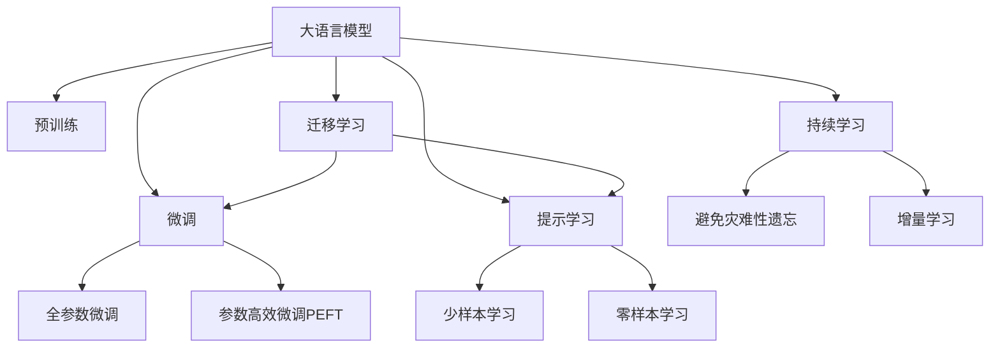

                 

# 从零开始大模型开发与微调：使用Hugging Face获取BERT预训练模型

## 1. 背景介绍

### 1.1 问题由来

近年来，深度学习技术在自然语言处理（NLP）领域取得了巨大突破，其中大语言模型（Large Language Model, LLMs）成为了研究热点。BERT、GPT-2等预训练模型在各种NLP任务上取得了最先进的性能。然而，预训练模型通常需要海量计算资源和时间，且其通用性有时无法完全适应特定领域的应用需求。

为了使大语言模型能够更加贴近实际应用场景，微调（Fine-Tuning）技术应运而生。微调是指在大规模预训练模型的基础上，使用小规模任务数据进行有监督学习，以适应特定任务需求的过程。这一过程能够提升模型在特定领域的表现，同时减少从头训练的时间和成本。

### 1.2 问题核心关键点

微调的核心在于如何高效地将通用知识应用到特定领域中。为了达到这一目标，以下关键点需要关注：

- **模型选择**：选择合适的预训练模型，如BERT、GPT等。
- **数据准备**：收集并处理特定任务的数据集，确保数据质量。
- **模型适配**：调整模型的输出层和损失函数，使之符合特定任务。
- **超参数调优**：选择合适的学习率、批大小等参数，优化模型性能。
- **正则化**：应用L2正则、Dropout等技术，防止模型过拟合。
- **代码实现**：使用框架（如PyTorch、TensorFlow等）实现微调过程。

### 1.3 问题研究意义

微调技术能够降低NLP应用的开发成本，提高模型性能，加速技术创新和应用落地。通过微调，大语言模型可以针对特定任务进行优化，提升在实际应用中的表现。这不仅对NLP研究有重要意义，也对技术产业升级具有深远影响。

## 2. 核心概念与联系

### 2.1 核心概念概述

- **大语言模型**：指通过大规模无监督学习得到的能够处理自然语言任务的语言模型，如BERT、GPT等。
- **预训练**：指在无标签数据上对模型进行训练，使其学习到通用的语言表示。
- **微调**：指在有标签数据上对预训练模型进行细粒度训练，以适应特定任务需求。
- **迁移学习**：将一个领域学习到的知识迁移到另一个领域，适用于微调过程。
- **参数高效微调**：在微调过程中仅更新部分模型参数，减少计算资源消耗。
- **提示学习**：通过设计输入格式，引导模型生成期望的输出，提高模型性能。
- **少样本学习**：在少量标注数据下进行模型训练，提高模型泛化能力。
- **零样本学习**：模型仅通过任务描述就能执行新任务，无需标注数据。
- **持续学习**：模型能够不断学习新知识，避免过时和遗忘。

这些概念通过以下Mermaid流程图进行联系和展示：



此流程图展示了这些核心概念之间的逻辑关系和相互影响。

## 3. 核心算法原理 & 具体操作步骤

### 3.1 算法原理概述

基于监督学习的微调技术，通过在有标签数据上对预训练模型进行微调，使其适应特定任务。微调过程一般包括选择预训练模型、准备数据、定义任务适配层、设置超参数、执行梯度训练、测试和部署等步骤。

### 3.2 算法步骤详解

1. **准备预训练模型和数据集**：选择合适的预训练模型，收集和准备任务数据集，包括训练集、验证集和测试集。
2. **添加任务适配层**：根据任务类型，调整模型的输出层和损失函数。
3. **设置微调超参数**：包括优化算法、学习率、批大小、正则化技术等。
4. **执行梯度训练**：使用训练集数据，通过前向传播和反向传播更新模型参数。
5. **测试和部署**：在测试集上评估微调后模型的性能，并进行部署应用。

### 3.3 算法优缺点

**优点**：
- 简单高效：微调能够快速适应特定任务，减少从头训练的时间和成本。
- 通用适用：适用于各种NLP任务，只需调整适配层即可。
- 参数高效：通过参数高效微调技术，仅更新少量参数，减少计算资源消耗。
- 效果显著：微调显著提升模型在特定任务上的表现。

**缺点**：
- 依赖标注数据：微调效果很大程度上依赖标注数据的质量和数量。
- 迁移能力有限：当目标任务与预训练数据的分布差异较大时，微调性能提升有限。
- 负面效果传递：预训练模型的固有偏见可能传递到下游任务，造成负面影响。
- 可解释性不足：微调模型缺乏可解释性，难以调试推理逻辑。

### 3.4 算法应用领域

微调技术在NLP领域有广泛应用，如文本分类、命名实体识别、关系抽取、问答系统、翻译、摘要生成、对话系统等。在实际应用中，微调模型还被应用于智能客服、金融舆情监测、个性化推荐等多个领域，极大地提升了系统性能和用户体验。

## 4. 数学模型和公式 & 详细讲解

### 4.1 数学模型构建

假设预训练模型为$M_{\theta}$，下游任务为$T$，训练集为$D=\{(x_i, y_i)\}_{i=1}^N$，其中$x_i$为输入，$y_i$为标签。微调的目标是最小化损失函数$\mathcal{L}(M_{\theta}, D)$。

### 4.2 公式推导过程

以二分类任务为例，假设模型$M_{\theta}$的输出为$\hat{y}=M_{\theta}(x)$，真实标签$y \in \{0, 1\}$，二分类交叉熵损失函数为：

$$
\ell(M_{\theta}(x),y) = -[y\log \hat{y} + (1-y)\log (1-\hat{y})]
$$

经验风险$\mathcal{L}(\theta)$为：

$$
\mathcal{L}(\theta) = \frac{1}{N}\sum_{i=1}^N \ell(M_{\theta}(x_i), y_i)
$$

通过梯度下降等优化算法，微调过程不断更新模型参数$\theta$，最小化损失函数。

### 4.3 案例分析与讲解

以BERT微调为例，BERT模型在预训练时通过掩码语言模型和下一句预测任务学习语言表示。微调时，在BERT模型的基础上添加输出层和损失函数，如线性分类器或交叉熵损失函数，使用训练集数据进行梯度下降训练。

## 5. 项目实践：代码实例和详细解释说明

### 5.1 开发环境搭建

1. 安装Anaconda和虚拟环境：
   ```bash
   conda create -n pytorch-env python=3.8
   conda activate pytorch-env
   ```

2. 安装PyTorch和Transformers库：
   ```bash
   pip install torch torchvision torchaudio transformers
   ```

3. 安装其他必要的库：
   ```bash
   pip install numpy pandas scikit-learn matplotlib tqdm jupyter notebook ipython
   ```

### 5.2 源代码详细实现

```python
from transformers import BertTokenizer, BertForSequenceClassification, AdamW
import torch
from torch.utils.data import DataLoader
from sklearn.metrics import accuracy_score

# 初始化数据集
train_data = ...
val_data = ...
test_data = ...

# 初始化模型和tokenizer
tokenizer = BertTokenizer.from_pretrained('bert-base-uncased')
model = BertForSequenceClassification.from_pretrained('bert-base-uncased', num_labels=2)

# 定义训练函数
def train_model(model, train_loader, val_loader, num_epochs, learning_rate, optimizer):
    model.train()
    for epoch in range(num_epochs):
        for batch in train_loader:
            inputs, labels = batch
            labels = labels.to(device)
            optimizer.zero_grad()
            outputs = model(inputs, labels=labels)
            loss = outputs.loss
            loss.backward()
            optimizer.step()
        # 评估模型在验证集上的性能
        with torch.no_grad():
            val_loss, val_acc = evaluate_model(model, val_loader)
        print(f"Epoch {epoch+1}, val loss: {val_loss:.4f}, val acc: {val_acc:.4f}")

# 定义评估函数
def evaluate_model(model, loader):
    model.eval()
    correct = 0
    total = 0
    with torch.no_grad():
        for batch in loader:
            inputs, labels = batch
            labels = labels.to(device)
            outputs = model(inputs)
            _, preds = torch.max(outputs, dim=1)
            total += labels.size(0)
            correct += (preds == labels).sum().item()
    return val_loss, accuracy_score(labels, preds)

# 设置超参数
device = torch.device('cuda') if torch.cuda.is_available() else torch.device('cpu')
num_epochs = 5
learning_rate = 2e-5
optimizer = AdamW(model.parameters(), lr=learning_rate)
train_loader = DataLoader(train_data, batch_size=16, shuffle=True)
val_loader = DataLoader(val_data, batch_size=16)
test_loader = DataLoader(test_data, batch_size=16)

# 训练模型
train_model(model, train_loader, val_loader, num_epochs, learning_rate, optimizer)
```

### 5.3 代码解读与分析

1. **数据集准备**：
   - 使用`BertTokenizer`将文本数据转换为模型可以处理的格式。
   - 准备训练集、验证集和测试集，确保数据质量。

2. **模型初始化**：
   - 使用`BertForSequenceClassification`初始化模型，设置输出层为二分类任务。
   - 初始化`AdamW`优化器，设置学习率。

3. **训练和评估**：
   - 定义训练函数`train_model`，执行梯度下降训练。
   - 定义评估函数`evaluate_model`，计算模型在验证集上的损失和准确率。
   - 使用`DataLoader`加载数据，设置批大小和随机打乱。

4. **模型调优**：
   - 在训练函数中，每次迭代计算损失并更新模型参数。
   - 在验证集上评估模型性能，打印当前epoch的验证损失和准确率。

### 5.4 运行结果展示

运行上述代码，训练完成后，使用测试集评估模型性能：

```python
with torch.no_grad():
    test_loss, test_acc = evaluate_model(model, test_loader)
print(f"Test loss: {test_loss:.4f}, Test acc: {test_acc:.4f}")
```

## 6. 实际应用场景

### 6.1 智能客服系统

基于大语言模型微调的对话技术，可以应用于智能客服系统。使用微调后的对话模型，可以7x24小时不间断服务，快速响应客户咨询，用自然流畅的语言解答各类常见问题。

### 6.2 金融舆情监测

在金融机构，使用微调模型实时监测市场舆论动向，及时应对负面信息传播，规避金融风险。微调模型能够自动判断文本属于何种主题，情感倾向是正面、中性还是负面，帮助金融机构快速应对潜在风险。

### 6.3 个性化推荐系统

在个性化推荐系统中，微调模型通过用户浏览、点击、评论、分享等行为数据，提取和用户交互的物品标题、描述、标签等文本内容，进行微调。微调后的模型能够从文本内容中准确把握用户的兴趣点，提供更精准、多样的推荐内容。

### 6.4 未来应用展望

随着大语言模型微调技术的发展，未来的应用将更加广泛和深入：

- 在智慧医疗领域，微调模型可应用于医疗问答、病历分析、药物研发等。
- 在智能教育领域，微调技术可应用于作业批改、学情分析、知识推荐等，因材施教。
- 在智慧城市治理中，微调模型可应用于城市事件监测、舆情分析、应急指挥等，提高城市管理智能化水平。

## 7. 工具和资源推荐

### 7.1 学习资源推荐

1. **《Transformers: From Practice to Theory》系列博文**：作者深入浅出地介绍了Transformer原理、BERT模型、微调技术等前沿话题。
2. **CS224N《深度学习自然语言处理》课程**：斯坦福大学开设的NLP明星课程，提供Lecture视频和配套作业。
3. **《Natural Language Processing with Transformers》书籍**：作者全面介绍了如何使用Transformers库进行NLP任务开发，包括微调在内的诸多范式。
4. **HuggingFace官方文档**：提供海量预训练模型和微调样例代码。
5. **CLUE开源项目**：涵盖大量不同类型的中文NLP数据集，并提供了基于微调的baseline模型。

### 7.2 开发工具推荐

1. **PyTorch**：基于Python的开源深度学习框架，适合快速迭代研究。
2. **TensorFlow**：由Google主导开发的开源深度学习框架，生产部署方便。
3. **Transformers库**：HuggingFace开发的NLP工具库，集成了众多SOTA语言模型。
4. **Weights & Biases**：模型训练的实验跟踪工具，记录和可视化模型训练过程。
5. **TensorBoard**：TensorFlow配套的可视化工具，监测模型训练状态，提供图表呈现方式。
6. **Google Colab**：谷歌推出的在线Jupyter Notebook环境，免费提供GPU/TPU算力。

### 7.3 相关论文推荐

1. **Attention is All You Need**：提出了Transformer结构，开启了NLP领域的预训练大模型时代。
2. **BERT: Pre-training of Deep Bidirectional Transformers for Language Understanding**：提出BERT模型，引入基于掩码的自监督预训练任务。
3. **Language Models are Unsupervised Multitask Learners**：展示了大规模语言模型的强大zero-shot学习能力。
4. **Parameter-Efficient Transfer Learning for NLP**：提出Adapter等参数高效微调方法。
5. **Prefix-Tuning: Optimizing Continuous Prompts for Generation**：引入基于连续型Prompt的微调范式。
6. **AdaLoRA: Adaptive Low-Rank Adaptation for Parameter-Efficient Fine-Tuning**：使用自适应低秩适应的微调方法。

## 8. 总结：未来发展趋势与挑战

### 8.1 总结

本文系统介绍了基于监督学习的大语言模型微调方法，涵盖从理论基础到实际操作的全过程。微调方法通过在有标签数据上对预训练模型进行微调，使其适应特定任务需求，提升模型性能。微调技术在NLP领域有广泛应用，尤其在智能客服、金融舆情监测、个性化推荐等场景中表现优异。

### 8.2 未来发展趋势

1. **模型规模持续增大**：超大规模语言模型蕴含的丰富语言知识，支撑更复杂多变的下游任务微调。
2. **微调方法日趋多样**：更多参数高效和计算高效的微调方法，如Prefix-Tuning、LoRA等，减小过拟合风险。
3. **持续学习成为常态**：模型不断学习新知识，避免灾难性遗忘。
4. **标注样本需求降低**：受启发于提示学习，减少微调对标注样本的依赖。
5. **多模态微调崛起**：融合视觉、语音等多模态信息，提升语言模型对现实世界的理解和建模能力。
6. **模型通用性增强**：提高模型的跨领域迁移能力，逐步迈向通用人工智能(AGI)目标。

### 8.3 面临的挑战

1. **标注成本瓶颈**：微调依赖标注数据，但长尾应用场景难以获得充足高质量标注数据。
2. **模型鲁棒性不足**：当目标任务与预训练数据的分布差异较大时，微调性能提升有限。
3. **推理效率有待提高**：超大模型的推理速度和内存占用问题。
4. **可解释性亟需加强**：微调模型缺乏可解释性。
5. **安全性有待保障**：模型可能学习到有害信息，传递到下游任务。
6. **知识整合能力不足**：微调模型难以灵活吸收和运用外部知识。

### 8.4 研究展望

1. **探索无监督和半监督微调方法**：摆脱对大规模标注数据的依赖。
2. **研究参数高效和计算高效的微调范式**。
3. **融合因果和对比学习范式**：增强模型的泛化性和抗干扰能力。
4. **引入更多先验知识**：融合符号化先验知识和多模态信息。
5. **结合因果分析和博弈论工具**：提高系统稳定性和鲁棒性。
6. **纳入伦理道德约束**：消除模型偏见，确保输出安全性。

## 9. 附录：常见问题与解答

**Q1：大语言模型微调是否适用于所有NLP任务？**

A: 大语言模型微调在大多数NLP任务上都能取得不错的效果，但特定领域的任务可能需要进一步预训练。

**Q2：微调过程中如何选择合适的学习率？**

A: 微调学习率通常比预训练时小1-2个数量级，建议从1e-5开始调参，逐步减小。

**Q3：采用大模型微调时会面临哪些资源瓶颈？**

A: 超大模型的算力、内存、存储等资源消耗大，需要采用梯度积累、混合精度训练等方法优化。

**Q4：如何缓解微调过程中的过拟合问题？**

A: 数据增强、正则化、对抗训练、参数高效微调等方法可缓解过拟合问题。

**Q5：微调模型在落地部署时需要注意哪些问题？**

A: 模型裁剪、量化加速、服务化封装、弹性伸缩、监控告警、安全防护等是部署时需要注意的问题。

---

作者：禅与计算机程序设计艺术 / Zen and the Art of Computer Programming

