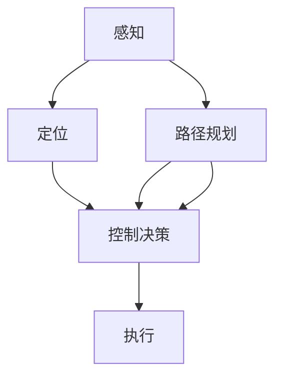

                 

# 传统自动驾驶模块化架构向端到端架构的演进

## 1. 背景介绍

### 1.1 问题由来
自动驾驶技术的发展，经历了从最初的模块化设计到端到端架构的演进。最初，自动驾驶系统被设计为多个独立模块的组合，如环境感知、路径规划、控制决策等。各个模块相对独立，分别负责特定的功能，需要通过通信进行信息交互。这种模块化设计虽然便于单独开发和测试，但系统复杂度较高，易受通信延迟和错误影响。

随着深度学习技术的兴起，端到端架构开始受到越来越多的关注。端到端架构直接将输入数据（如摄像头图像、雷达点云等）作为输入，输出车辆的控制命令（如转向、加速、刹车等），中间不经过显式的中间表示。这种架构设计思路简单高效，易于实现，能够显著提高系统的实时性和可靠性。

### 1.2 问题核心关键点
本文聚焦于自动驾驶系统从模块化架构向端到端架构的演进过程。通过对比分析两种架构的优缺点，阐释端到端架构之所以能成为趋势的原因。同时，通过案例分析，说明如何有效地从模块化架构向端到端架构进行过渡，以及过程中可能面临的挑战。

## 2. 核心概念与联系

### 2.1 核心概念概述

为更好地理解自动驾驶系统架构的演进，本节将介绍几个密切相关的核心概念：

- 自动驾驶(Autonomous Driving)：指车辆在无人驾驶的情况下，通过先进的感知、定位、决策、控制技术，实现安全、可靠、高效的智能驾驶。

- 端到端架构(End-to-End Architecture)：指从输入到输出的系统设计，直接将输入数据作为模型输入，输出系统控制指令，中间不经过中间表示。

- 模块化架构(Modular Architecture)：指将系统分为多个独立模块，每个模块负责特定的功能，模块之间通过通信进行信息交互。

- 感知(Perception)：指从摄像头、雷达、激光雷达等传感器获取车辆周围环境信息的过程，是自动驾驶系统的基础。

- 定位(Location)：指通过GPS、IMU、地图匹配等技术确定车辆在地图中的位置，是路径规划和控制决策的前提。

- 路径规划(Planning)：指根据车辆位置和目标位置，规划出最优的行驶路径，并生成对应的控制指令。

- 控制决策(Control Decision)：指根据感知和路径规划结果，生成具体的车辆控制命令，包括转向、加速、刹车等。

这些核心概念之间的逻辑关系可以通过以下Mermaid流程图来展示：



这个流程图展示了自动驾驶系统的关键模块及其相互关系。

## 3. 核心算法原理 & 具体操作步骤
### 3.1 算法原理概述

从模块化架构向端到端架构的演进，本质上是系统设计的简化和优化。端到端架构直接将输入和输出关联起来，消除了中间表示层，简化了系统结构。这种设计思想在深度学习中得到了广泛应用，能够显著提高模型的实时性和准确性。

端到端架构的核心算法原理可以概括为：

1. 数据驱动：直接使用传感器数据作为输入，无需中间表示。
2. 深度学习：通过深度神经网络进行特征提取、模式识别和决策生成。
3. 端到端训练：将输入数据和输出指令捆绑在一起进行训练，减少数据和模型的耦合。

### 3.2 算法步骤详解

从模块化架构向端到端架构的演进，主要包括以下几个关键步骤：

**Step 1: 识别核心功能**
- 分析自动驾驶系统的核心功能，确定哪些功能可以简化为端到端设计。例如，环境感知、路径规划和控制决策等功能都可以直接设计为端到端架构。

**Step 2: 设计输入输出**
- 确定系统的输入和输出接口，输入通常为传感器数据（如摄像头图像、雷达点云等），输出为车辆控制指令（如转向、加速、刹车等）。

**Step 3: 选择模型架构**
- 选择适合深度学习的模型架构，如CNN、RNN、Transformer等，进行端到端训练。
- 根据任务特点，选择模型的输入层、隐藏层和输出层，确定神经元的数量和连接方式。

**Step 4: 训练模型**
- 准备训练数据，将输入数据和对应的控制指令绑定在一起，构建监督学习任务。
- 使用深度学习框架（如TensorFlow、PyTorch等）进行模型训练，迭代优化模型参数，直到满足预设的性能指标。

**Step 5: 部署和优化**
- 将训练好的模型部署到目标硬件平台，进行端到端推理。
- 对推理过程进行优化，如剪枝、量化、模型压缩等，提高模型的实时性和资源效率。

### 3.3 算法优缺点

端到端架构相较于模块化架构，具有以下优点：

1. 简化设计：直接将输入和输出关联，简化了系统结构，减少了信息传输和处理的环节。
2. 实时性高：消除了中间表示层，减少了数据传输和处理的延迟，提高了系统的实时性。
3. 准确性高：深度学习模型能够学习复杂的特征和模式，提高了决策的准确性。

但端到端架构也存在以下缺点：

1. 训练复杂：需要大量的标注数据和计算资源，训练周期较长。
2. 调试困难：端到端模型是一个"黑盒"系统，调试和解释比较困难。
3. 泛化能力差：由于数据和模型的紧密耦合，模型可能过度拟合训练数据，泛化能力较弱。

### 3.4 算法应用领域

端到端架构在大规模自动驾驶系统中得到了广泛应用，涵盖了从感知到控制决策的各个环节。以下是一些典型的应用场景：

- 无人驾驶出租车：通过传感器数据输入，生成车辆行驶的控制指令，实现自动驾驶。
- 自动驾驶货运：使用激光雷达和摄像头数据，生成路径规划和控制指令，实现高效物流。
- 自动驾驶车辆联网：将车辆和云端进行数据交换，实现车辆的智能调控和优化。
- 自动驾驶机场：通过摄像头和雷达数据，生成机场车辆的控制指令，实现机场内的自动化管理。
- 自动驾驶公交：使用传感器数据，生成公交车的控制指令，实现公交车的智能化运行。

## 4. 数学模型和公式 & 详细讲解 & 举例说明
### 4.1 数学模型构建

本节将使用数学语言对端到端自动驾驶系统的设计进行更加严格的刻画。

假设自动驾驶系统需要处理一个摄像头图像 $x$，生成车辆的控制指令 $y$。设输入图像的特征表示为 $x^{\prime}$，输出指令的特征表示为 $y^{\prime}$。

我们定义模型 $f$ 将输入 $x^{\prime}$ 映射到输出 $y^{\prime}$，并定义损失函数 $L$ 衡量模型预测与真实标签之间的差异。

设模型参数为 $\theta$，则端到端训练的目标是最小化损失函数：

$$
\theta^* = \mathop{\arg\min}_{\theta} L(y^{\prime}, y)
$$

其中，$L$ 通常为均方误差损失（MSE）或交叉熵损失。

### 4.2 公式推导过程

以下我们以一个简单的例子，推导一个端到端CNN模型的训练过程。

假设模型的输入为大小为 $32\times32$ 的彩色图像，输出为车辆的控制指令 $y$，模型结构如图：


模型由卷积层、池化层、全连接层构成，最后一层输出控制指令。假设模型的输入图像为 $x$，输出指令为 $y$，模型的特征表示为 $x^{\prime}$。

模型的损失函数为交叉熵损失，定义为：

$$
L(y^{\prime}, y) = -\sum_{i=1}^{C} y_i \log \hat{y}_i
$$

其中，$C$ 为控制指令的种类数。

模型的训练过程如图：


模型首先通过卷积层和池化层提取图像的特征，然后将特征输入全连接层，最后通过softmax层输出控制指令的概率分布。模型通过反向传播算法，计算梯度，更新模型参数 $\theta$，最小化损失函数 $L(y^{\prime}, y)$。

### 4.3 案例分析与讲解

以下以一个具体的案例，说明如何实现端到端自动驾驶系统。

**案例: 无人驾驶出租车**

- **输入**：摄像头图像和雷达点云数据
- **输出**：车辆的控制指令（转向、加速、刹车等）
- **模型**：使用卷积神经网络（CNN）
- **训练数据**：标注好的摄像头图像和对应的控制指令

首先，需要将输入数据和输出指令捆绑在一起，构建监督学习任务。然后，使用深度学习框架进行模型训练，迭代优化模型参数。训练过程中，需要选择合适的损失函数和优化器，设置合适的学习率和批大小。

具体步骤如下：

1. 准备数据集，将摄像头图像和对应的控制指令作为输入和输出，构建监督学习任务。
2. 使用CNN模型进行特征提取，生成输出指令的概率分布。
3. 定义损失函数，通常为交叉熵损失，计算模型预测与真实标签之间的差异。
4. 使用Adam优化器进行模型训练，最小化损失函数。
5. 使用验证集评估模型性能，调整超参数。
6. 部署模型，进行实时推理。

最终，训练好的模型可以输入摄像头图像和雷达点云数据，输出车辆的控制指令，实现无人驾驶出租车功能。

## 5. 项目实践：代码实例和详细解释说明
### 5.1 开发环境搭建

在进行端到端自动驾驶系统开发前，我们需要准备好开发环境。以下是使用Python进行TensorFlow开发的环境配置流程：

1. 安装Anaconda：从官网下载并安装Anaconda，用于创建独立的Python环境。

2. 创建并激活虚拟环境：
```bash
conda create -n tf-env python=3.8 
conda activate tf-env
```

3. 安装TensorFlow：根据CUDA版本，从官网获取对应的安装命令。例如：
```bash
pip install tensorflow==2.7.0
```

4. 安装OpenCV和NumPy：
```bash
pip install opencv-python numpy
```

5. 安装其他必要的工具包：
```bash
pip install matplotlib tqdm jupyter notebook ipython
```

完成上述步骤后，即可在`tf-env`环境中开始端到端自动驾驶系统开发。

### 5.2 源代码详细实现

下面我们以无人驾驶出租车为例，给出使用TensorFlow对端到端CNN模型进行训练的PyTorch代码实现。

首先，定义数据处理函数：

```python
import cv2
import numpy as np
import matplotlib.pyplot as plt
import tensorflow as tf
from tensorflow.keras import layers, models

def load_image(path):
    image = cv2.imread(path)
    image = cv2.cvtColor(image, cv2.COLOR_BGR2RGB)
    image = image / 255.0
    return image

def load_labels(path):
    labels = []
    with open(path, 'r') as f:
        for line in f:
            label = line.strip().split(':')[1]
            labels.append(label)
    return labels

def preprocess_image(image):
    image = tf.image.resize(image, (32, 32))
    image = tf.image.per_image_standardization(image)
    return image

def load_data():
    image_paths = []
    labels = []
    for i in range(1, 1001):
        image_path = f'train/{i}.jpg'
        image_paths.append(image_path)
        label = f'{i}-{labels[i]}'
        labels.append(label)
    return image_paths, labels

def generate_dataset(image_paths, labels, batch_size):
    dataset = tf.data.Dataset.from_tensor_slices((image_paths, labels))
    dataset = dataset.map(lambda path, label: (load_image(path), label))
    dataset = dataset.map(lambda image, label: (preprocess_image(image), label))
    dataset = dataset.shuffle(10000)
    dataset = dataset.batch(batch_size)
    dataset = dataset.prefetch(buffer_size=tf.data.AUTOTUNE)
    return dataset
```

然后，定义模型和训练函数：

```python
from tensorflow.keras.models import Sequential
from tensorflow.keras.layers import Conv2D, MaxPooling2D, Flatten, Dense, Dropout

def build_model(input_shape, output_size):
    model = Sequential()
    model.add(Conv2D(32, kernel_size=(3, 3), activation='relu', input_shape=input_shape))
    model.add(MaxPooling2D(pool_size=(2, 2)))
    model.add(Conv2D(64, kernel_size=(3, 3), activation='relu'))
    model.add(MaxPooling2D(pool_size=(2, 2)))
    model.add(Flatten())
    model.add(Dense(64, activation='relu'))
    model.add(Dropout(0.5))
    model.add(Dense(output_size, activation='softmax'))
    return model

def train_model(model, dataset, epochs, batch_size):
    model.compile(optimizer='adam', loss='categorical_crossentropy', metrics=['accuracy'])
    model.fit(dataset, epochs=epochs, batch_size=batch_size, validation_split=0.2)
```

接着，启动训练流程：

```python
image_paths, labels = load_data()
labels = load_labels('train_labels.txt')
input_shape = (32, 32, 3)
output_size = len(labels)

model = build_model(input_shape, output_size)
train_dataset = generate_dataset(image_paths, labels, batch_size=32)

epochs = 10
train_model(model, train_dataset, epochs, batch_size=32)
```

以上就是使用TensorFlow对CNN模型进行无人驾驶出租车系统训练的完整代码实现。可以看到，TensorFlow的Keras API使得模型的构建和训练变得简洁高效。

### 5.3 代码解读与分析

让我们再详细解读一下关键代码的实现细节：

**load_image和load_labels函数**：
- 定义了加载图像和标签的函数。

**preprocess_image函数**：
- 对加载的图像进行预处理，包括图像缩放、标准化等。

**load_data函数**：
- 加载训练数据集，包括图像路径和标签。

**generate_dataset函数**：
- 生成TensorFlow的Dataset对象，对图像和标签进行处理。

**build_model函数**：
- 定义CNN模型，包括卷积层、池化层、全连接层等。

**train_model函数**：
- 训练模型，使用Adam优化器，定义交叉熵损失函数。

**主函数**：
- 加载训练数据，构建模型，训练模型。

这个代码实现展示了TensorFlow在深度学习项目开发中的应用，使得开发过程更加高效便捷。

## 6. 实际应用场景
### 6.1 无人驾驶出租车

端到端架构在无人驾驶出租车中的应用，能够实现车辆的全自动驾驶，减少了司机的工作负担，提高了运输效率和安全性。

具体而言，通过摄像头和雷达数据输入，CNN模型能够实时感知车辆周围环境，进行路径规划和控制决策。模型可以识别道路标志、车辆、行人等障碍物，生成转向、加速、刹车等控制指令，使车辆能够在复杂的城市道路环境中安全行驶。

### 6.2 自动驾驶货运

端到端架构在自动驾驶货运中的应用，能够实现车辆的智能化运输，提高物流效率和可靠性。

具体而言，通过摄像头和雷达数据输入，CNN模型能够实时感知车辆周围环境，进行路径规划和控制决策。模型可以识别道路标志、车辆、行人等障碍物，生成转向、加速、刹车等控制指令，使车辆能够在复杂的路况中安全行驶。通过与物流平台的数据交换，可以实现车辆的高效调度和管理。

### 6.3 自动驾驶机场

端到端架构在自动驾驶机场中的应用，能够实现机场车辆的全自动驾驶，提高机场的运营效率和管理水平。

具体而言，通过摄像头和雷达数据输入，CNN模型能够实时感知车辆周围环境，进行路径规划和控制决策。模型可以识别道路标志、车辆、行人等障碍物，生成转向、加速、刹车等控制指令，使车辆能够在机场的复杂环境中安全行驶。通过与机场管理系统集成，可以实现车辆的高效管理和调度。

### 6.4 未来应用展望

随着端到端架构在大规模自动驾驶系统中得到应用，未来将在更多领域得到推广。例如：

- 自动驾驶公交：通过摄像头和雷达数据输入，CNN模型能够实时感知车辆周围环境，进行路径规划和控制决策。模型可以识别道路标志、车辆、行人等障碍物，生成转向、加速、刹车等控制指令，使车辆能够在公交线路上安全行驶。

- 自动驾驶物流：通过摄像头和雷达数据输入，CNN模型能够实时感知车辆周围环境，进行路径规划和控制决策。模型可以识别道路标志、车辆、行人等障碍物，生成转向、加速、刹车等控制指令，使车辆能够在复杂的路况中安全行驶。

- 自动驾驶港口：通过摄像头和雷达数据输入，CNN模型能够实时感知车辆周围环境，进行路径规划和控制决策。模型可以识别道路标志、车辆、行人等障碍物，生成转向、加速、刹车等控制指令，使车辆能够在港口的复杂环境中安全行驶。

- 自动驾驶配送：通过摄像头和雷达数据输入，CNN模型能够实时感知车辆周围环境，进行路径规划和控制决策。模型可以识别道路标志、车辆、行人等障碍物，生成转向、加速、刹车等控制指令，使车辆能够在配送路线上安全行驶。

## 7. 工具和资源推荐
### 7.1 学习资源推荐

为了帮助开发者系统掌握端到端自动驾驶系统的开发和优化，这里推荐一些优质的学习资源：

1. 《深度学习实战》系列博文：由TensorFlow官方维护，介绍了深度学习的基本概念和实践技巧，涵盖自动驾驶系统的开发和优化。

2. 《TensorFlow实战Google深度学习框架》书籍：由Google资深工程师编写，系统介绍了TensorFlow的使用方法和最佳实践，包括自动驾驶系统的实现。

3. Udacity《自动驾驶工程师》课程：由Udacity提供，涵盖了自动驾驶系统的各个环节，包括感知、路径规划、控制决策等。

4. Coursera《深度学习》课程：由斯坦福大学提供，涵盖了深度学习的基本概念和实现方法，适用于自动驾驶系统的开发。

5. arXiv《端到端自动驾驶系统》论文：介绍了端到端自动驾驶系统的设计思路和实现方法，提供了大量参考文献和代码实现。

通过对这些资源的学习实践，相信你一定能够快速掌握端到端自动驾驶系统的开发方法，并用于解决实际的自动驾驶问题。

### 7.2 开发工具推荐

高效的开发离不开优秀的工具支持。以下是几款用于端到端自动驾驶系统开发的常用工具：

1. TensorFlow：由Google主导开发的开源深度学习框架，生产部署方便，适合大规模工程应用。

2. PyTorch：由Facebook开发的深度学习框架，灵活高效，适合快速迭代研究。

3. OpenCV：开源计算机视觉库，支持图像处理和模式识别，适合进行感知模块的开发。

4. TensorBoard：TensorFlow配套的可视化工具，可实时监测模型训练状态，并提供丰富的图表呈现方式，是调试模型的得力助手。

5. Weights & Biases：模型训练的实验跟踪工具，可以记录和可视化模型训练过程中的各项指标，方便对比和调优。

6. Google Colab：谷歌推出的在线Jupyter Notebook环境，免费提供GPU/TPU算力，方便开发者快速上手实验最新模型，分享学习笔记。

合理利用这些工具，可以显著提升端到端自动驾驶系统的开发效率，加快创新迭代的步伐。

### 7.3 相关论文推荐

端到端自动驾驶技术的发展源于学界的持续研究。以下是几篇奠基性的相关论文，推荐阅读：

1. "End-to-End Training for Self-Driving Cars"（Kaiming He等人）：提出了端到端训练自动驾驶车辆的方法，使得车辆能够从传感器数据直接学习到驾驶决策。

2. "Deep Driving: End-to-End Learning for Self-Driving Cars"（Ivan Yankov等人）：提出了端到端训练自动驾驶车辆的方法，使车辆能够从传感器数据直接学习到驾驶决策。

3. "End-to-End Learning for Self-Driving Cars at Scale"（Andrej Karpathy等人）：提出了大规模端到端训练自动驾驶车辆的方法，使车辆能够在复杂路面上安全行驶。

4. "Deep Adversarial Modeling for End-to-End Training of Self-Driving Car Policy"（Dongyun Zhang等人）：提出了利用对抗训练进行端到端训练自动驾驶车辆的方法，使车辆能够在不同场景下安全行驶。

5. "High-Definition Maps for End-to-End Training of an Autonomous Vehicle"（Christian Daniel等人）：提出了利用高精度地图进行端到端训练自动驾驶车辆的方法，使车辆能够在复杂路面上安全行驶。

这些论文代表了大规模自动驾驶系统端到端训练技术的发展脉络。通过学习这些前沿成果，可以帮助研究者把握学科前进方向，激发更多的创新灵感。

## 8. 总结：未来发展趋势与挑战

### 8.1 总结

本文对端到端自动驾驶系统从模块化架构向端到端架构的演进过程进行了全面系统的介绍。首先，阐述了端到端架构相较于模块化架构的优点和缺点，阐释了端到端架构设计思路的科学性和必要性。其次，从原理到实践，详细讲解了端到端架构的数学模型和具体实现方法，给出了完整的代码实例。同时，本文还广泛探讨了端到端架构在无人驾驶出租车、自动驾驶货运等诸多领域的应用前景，展示了端到端架构的巨大潜力。

通过本文的系统梳理，可以看到，端到端架构在大规模自动驾驶系统中得到了广泛应用，极大地提高了系统的实时性和准确性。未来，伴随深度学习技术的不断发展，端到端架构必将在更多领域得到推广，为自动驾驶技术带来新的突破。

### 8.2 未来发展趋势

展望未来，端到端架构在大规模自动驾驶系统中将呈现以下几个发展趋势：

1. 模型规模增大：随着算力成本的下降和数据规模的扩张，端到端模型的参数量还将持续增长。超大规模端到端模型能够学习更复杂的特征和模式，提高决策的准确性和泛化能力。

2. 实时性提高：端到端模型通过优化计算图和算法，能够进一步提高推理速度和资源效率，实现更快速的实时决策。

3. 安全性提升：端到端模型通过对抗训练、鲁棒性测试等技术手段，能够提高系统的稳定性和安全性，避免误判和事故。

4. 多模态融合：端到端模型能够与视觉、雷达、激光雷达等传感器数据进行融合，实现更全面、准确的环境感知。

5. 人机协同：端到端模型能够与驾驶员进行实时互动，实现人机协同的智能驾驶。

以上趋势凸显了端到端架构在大规模自动驾驶系统中的广泛应用前景。这些方向的探索发展，必将进一步提升自动驾驶系统的性能和安全性，为人类智能驾驶带来新的突破。

### 8.3 面临的挑战

尽管端到端架构在大规模自动驾驶系统中已经取得了一定的成就，但在迈向更加智能化、普适化应用的过程中，仍面临诸多挑战：

1. 数据依赖问题：端到端架构对标注数据和传感器数据依赖较大，难以在少数数据情况下取得良好效果。如何有效利用少数数据，提高模型的泛化能力，仍是一个亟待解决的问题。

2. 安全性问题：端到端模型需要面对各种复杂路面的挑战，如何在保证高精度的同时，提高系统的稳定性和安全性，避免误判和事故，仍是一个需要持续研究的问题。

3. 实时性问题：端到端模型需要处理大量的传感器数据，如何在保证性能的同时，提高实时性，优化资源使用效率，仍是一个需要持续改进的问题。

4. 可解释性问题：端到端模型是一个"黑盒"系统，难以解释其内部工作机制和决策逻辑。如何在保证模型性能的同时，提高可解释性和可理解性，仍是一个需要不断探索的问题。

5. 技术集成问题：端到端模型需要与其他技术进行融合，如计算机视觉、机器学习等，如何实现技术之间的协同和互操作性，仍是一个需要持续解决的问题。

这些挑战凸显了端到端架构在大规模自动驾驶系统中的复杂性。尽管如此，随着深度学习技术的不断进步，相信这些问题终将逐一被克服，端到端架构必将在构建智能驾驶系统方面发挥更大的作用。

### 8.4 研究展望

面对端到端架构在大规模自动驾驶系统中面临的诸多挑战，未来的研究需要在以下几个方面寻求新的突破：

1. 探索少样本学习和自监督学习：通过利用数据增强、生成对抗网络等技术，降低端到端架构对标注数据的依赖，提高模型的泛化能力。

2. 研究鲁棒性和安全性：通过对抗训练、鲁棒性测试等技术手段，提高端到端模型的稳定性和安全性，避免误判和事故。

3. 优化计算图和算法：通过优化计算图和算法，提高端到端模型的实时性和资源效率，实现更快速的实时决策。

4. 实现多模态融合：通过将视觉、雷达、激光雷达等传感器数据进行融合，实现更全面、准确的环境感知。

5. 提高可解释性和可理解性：通过引入因果推断、解释性学习等技术，提高端到端模型的可解释性和可理解性，增强系统透明性和可靠性。

6. 优化技术集成：通过技术集成平台和框架，实现不同技术之间的协同和互操作性，提高系统的集成效率和效果。

这些研究方向的探索，必将引领端到端自动驾驶技术迈向更高的台阶，为构建安全、可靠、智能的自动驾驶系统铺平道路。面向未来，端到端架构需要与其他人工智能技术进行更深入的融合，共同推动自动驾驶技术的进步。

## 9. 附录：常见问题与解答

**Q1：端到端架构和模块化架构有何区别？**

A: 端到端架构和模块化架构的区别在于其系统设计思路和信息传递方式。

- 模块化架构：将系统分为多个独立模块，每个模块负责特定的功能，模块之间通过通信进行信息交互。每个模块的内部结构和参数都是独立的，模块的输入和输出是通过接口进行连接的。这种架构的设计思路清晰，便于单独开发和测试。

- 端到端架构：直接将输入和输出关联起来，消除了中间表示层，简化了系统结构。端到端架构不需要显式的中间表示，直接从输入数据到输出指令进行训练，中间不经过任何显式的信息传递。这种架构设计思路简单高效，能够显著提高系统的实时性和准确性。

**Q2：端到端架构的优点是什么？**

A: 端到端架构的优点主要包括：

1. 简化设计：直接将输入和输出关联，简化了系统结构，减少了信息传输和处理的环节。

2. 实时性高：消除了中间表示层，减少了数据传输和处理的延迟，提高了系统的实时性。

3. 准确性高：深度学习模型能够学习复杂的特征和模式，提高了决策的准确性。

4. 可扩展性：端到端架构的模型结构灵活，可以适应不同的输入输出需求，易于扩展和调整。

5. 可解释性：端到端架构的模型结构清晰，易于解释和理解，避免了复杂的信息传递和计算。

**Q3：端到端架构的缺点是什么？**

A: 端到端架构的缺点主要包括：

1. 训练复杂：需要大量的标注数据和计算资源，训练周期较长。

2. 调试困难：端到端模型是一个"黑盒"系统，调试和解释比较困难。

3. 泛化能力差：由于数据和模型的紧密耦合，模型可能过度拟合训练数据，泛化能力较弱。

4. 可解释性不足：端到端模型缺乏可解释性，难以对其内部工作机制和决策逻辑进行解释和理解。

**Q4：如何实现端到端架构的微调？**

A: 实现端到端架构的微调，可以通过以下步骤：

1. 收集训练数据：准备包含输入数据和输出指令的标注数据集。

2. 构建模型：选择适合深度学习的模型架构，进行端到端训练。

3. 定义损失函数：选择适合的损失函数，如交叉熵损失、均方误差损失等。

4. 训练模型：使用深度学习框架进行模型训练，迭代优化模型参数。

5. 评估模型：使用验证集或测试集评估模型性能，调整超参数。

6. 部署模型：将训练好的模型部署到目标硬件平台，进行端到端推理。

通过这些步骤，可以实现端到端架构的微调，提升模型的实时性和准确性。

**Q5：端到端架构和模块化架构在实际应用中有何区别？**

A: 端到端架构和模块化架构在实际应用中的区别主要体现在系统设计、性能表现和开发复杂度上。

- 系统设计：模块化架构设计思路清晰，便于单独开发和测试，适用于系统结构复杂、功能模块化的场景。端到端架构设计思路简单高效，适用于实时性要求高、决策复杂的应用场景。

- 性能表现：模块化架构的性能通常依赖于模块之间的通信和协调，容易受到通信延迟和错误的影响。端到端架构直接处理输入和输出，没有通信环节，能够显著提高系统的实时性和准确性。

- 开发复杂度：模块化架构的开发复杂度相对较高，需要协调各个模块之间的通信和数据传递。端到端架构的开发复杂度相对较低，能够简化系统设计和开发过程，提高开发效率。

总之，端到端架构和模块化架构各有优缺点，需要根据具体的应用场景进行选择。对于实时性要求高、决策复杂的应用场景，端到端架构更适用；对于系统结构复杂、功能模块化的场景，模块化架构更适用。

---

作者：禅与计算机程序设计艺术 / Zen and the Art of Computer Programming

