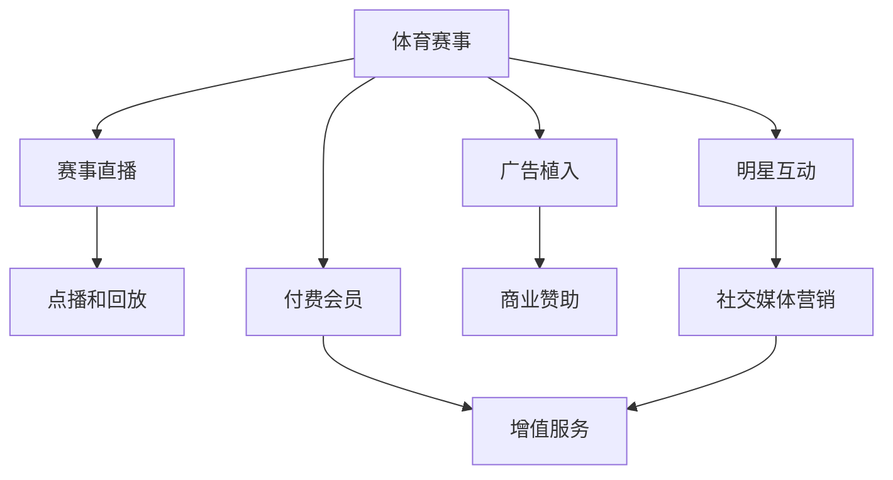

                 

# 体育产业在注意力经济中的新机遇

## 1. 背景介绍

### 1.1 体育产业的数字化转型

随着互联网和移动设备的普及，体育产业正经历着一场深刻的数字化转型。传统体育产业更多依赖线下活动，如比赛、赛事直播、体育场馆经营等，而数字化转型则将体育活动拓展到了线上，涵盖了数字媒体、电子竞技、虚拟体育等多个领域。

数字化的体育产业为消费者提供了更为丰富、互动的体验方式，如体育赛事的直播、点播、互动游戏、虚拟现实体验等。同时，体育产业也通过大数据分析、精准营销等手段，提升了赛事的曝光度和粉丝的参与度。

### 1.2 注意力经济的兴起

注意力经济（Attention Economy）指的是在信息过载时代，如何吸引和保持用户的注意力，使其专注于某项产品或服务，从而实现商业价值的过程。在注意力经济中，用户的时间、注意力成为了一种稀缺资源，企业和品牌需要通过优质内容和创新的体验来争夺用户的注意力。

体育产业作为兼具娱乐性和竞技性的重要行业，自然成为了注意力经济的重要参与者。通过构建体育生态系统，整合赛事内容、体育明星、粉丝社群等多方资源，体育产业能够吸引大量的用户关注和互动。

## 2. 核心概念与联系

### 2.1 注意力经济与体育产业

注意力经济与体育产业有着天然的契合点。体育赛事本身就是一个高度吸引人注意力的活动，具有高曝光度和高参与度的特点。通过将体育赛事与数字化手段结合，体育产业可以进一步提升其对用户注意力的吸引力和利用效率。

具体而言，体育产业在注意力经济中扮演以下几个角色：

- **内容生产者**：体育赛事和明星通过直播、点播、互动游戏等多种形式，生成丰富的数字内容，吸引用户注意力。
- **互动平台**：通过社交媒体、在线论坛、视频直播平台等，构建体育活动的互动环境，增强用户参与感。
- **商业变现**：通过广告、赞助、付费会员等方式，将用户注意力转化为商业价值。

### 2.2 核心概念原理和架构的 Mermaid 流程图



### 2.3 核心概念的联系

体育产业中的各类活动（如赛事、直播、互动、广告等）通过整合数字化手段，形成了完整的注意力经济生态系统。其中，赛事直播、明星互动等活动通过吸引用户注意力，生成大量数据，为商业变现和用户分析提供了基础。而商业变现则通过广告、赞助、付费会员等方式，将用户注意力转化为实际收益。

## 3. 核心算法原理 & 具体操作步骤

### 3.1 算法原理概述

注意力经济的实现需要基于对用户注意力数据的精准分析。通过构建用户画像，识别用户的注意力偏好和行为模式，体育产业可以设计更加有吸引力的内容，优化用户互动体验，从而提升用户留存率和商业价值。

以下是体育产业在注意力经济中常用的几种算法和操作步骤：

- **用户画像构建**：通过收集用户在体育赛事、互动活动、社交媒体等平台上的行为数据，构建用户画像，识别其兴趣和需求。
- **内容推荐算法**：基于用户画像和内容属性，设计推荐算法，为每个用户推荐最感兴趣的体育内容，如赛事、明星、互动活动等。
- **互动体验优化**：通过分析用户互动数据，优化用户界面和互动机制，提升用户体验和满意度。
- **广告和赞助策略**：基于用户画像和赛事属性，设计精准的广告和赞助策略，提高商业变现效率。

### 3.2 算法步骤详解

#### 3.2.1 用户画像构建

**Step 1: 数据收集**
收集用户在体育赛事、互动活动、社交媒体等平台上的行为数据，如观看时间、互动次数、评论内容、购买记录等。

**Step 2: 数据预处理**
对收集到的原始数据进行清洗、去重、归一化等预处理，去除噪声和无用信息。

**Step 3: 特征工程**
提取用户特征，如观看习惯、互动模式、兴趣爱好、地理位置等，构建用户画像。

**Step 4: 聚类分析**
通过聚类算法（如K-Means、层次聚类等），将用户划分为不同的兴趣群体，便于后续推荐和营销。

#### 3.2.2 内容推荐算法

**Step 1: 内容特征提取**
提取体育赛事、互动活动、明星等内容的属性特征，如比赛类型、时长、参与者、评价等。

**Step 2: 用户画像匹配**
将用户画像与内容特征进行匹配，识别用户最感兴趣的内容。

**Step 3: 推荐算法应用**
使用协同过滤、基于内容的推荐算法、深度学习等方法，为每个用户推荐最匹配的内容。

#### 3.2.3 互动体验优化

**Step 1: 用户反馈收集**
通过问卷调查、用户评论、互动数据等方式，收集用户对体育赛事、互动活动的反馈。

**Step 2: 用户体验分析**
分析用户反馈，识别影响用户体验的关键因素，如界面设计、互动机制、加载速度等。

**Step 3: 界面和机制优化**
根据用户体验分析结果，优化体育赛事、互动活动的界面设计和互动机制，提升用户体验。

#### 3.2.4 广告和赞助策略

**Step 1: 用户画像分析**
分析用户画像，识别具有高互动潜力和高消费能力的目标用户群体。

**Step 2: 赛事属性匹配**
将广告和赞助与体育赛事的属性进行匹配，如比赛类型、赛程、参与者等。

**Step 3: 广告和赞助策略设计**
根据用户画像和赛事属性，设计精准的广告和赞助策略，提高广告和赞助的投放效果。

### 3.3 算法优缺点

#### 3.3.1 优点

- **提升用户体验**：通过精准推荐和互动优化，提升用户对体育赛事和活动的参与度和满意度。
- **精准营销**：通过分析用户画像和赛事属性，设计精准的广告和赞助策略，提高商业变现效率。
- **数据驱动决策**：基于数据分析和算法优化，体育产业可以更科学地制定内容和营销策略。

#### 3.3.2 缺点

- **数据隐私**：收集和分析用户数据涉及用户隐私，需要严格遵守数据保护法规。
- **算法复杂度**：构建用户画像、设计推荐算法、优化用户体验等，需要较高的算法复杂度和计算资源。
- **模型鲁棒性**：推荐算法和互动优化模型需要较高的鲁棒性，避免过拟合和偏差。

### 3.4 算法应用领域

体育产业在注意力经济中的应用领域非常广泛，涵盖了赛事直播、点播、互动游戏、广告营销等多个方面。以下是几个典型的应用场景：

#### 3.4.1 赛事直播和点播

**赛事直播**：通过赛事直播平台，向全球用户提供实时赛事直播，吸引大量用户观看。通过广告和付费会员等方式，实现商业变现。

**赛事点播**：将赛事视频进行点播和回放，满足用户错过比赛时间的观看需求。通过精准推荐和互动优化，提升用户体验和留存率。

#### 3.4.2 互动游戏

**互动游戏**：通过虚拟现实（VR）、增强现实（AR）等技术，打造沉浸式体育互动游戏。通过游戏内广告和虚拟道具销售，实现商业变现。

**游戏推荐**：基于用户画像和游戏属性，设计推荐算法，为每个用户推荐最感兴趣的游戏。通过互动游戏，增强用户粘性和参与感。

#### 3.4.3 广告和赞助

**精准广告**：通过用户画像和赛事属性，设计精准的广告投放策略，提高广告的点击率和转化率。

**品牌赞助**：通过分析用户画像和赛事属性，识别具有高互动潜力的品牌，进行精准赞助。通过赛事活动和社交媒体营销，提升品牌曝光度和用户互动。

## 4. 数学模型和公式 & 详细讲解 & 举例说明

### 4.1 数学模型构建

在体育产业的注意力经济中，常用的数学模型包括用户画像模型、推荐模型、互动模型和广告模型等。以下以推荐模型为例，介绍常见的推荐算法及其数学模型。

**用户画像模型**

假设用户画像可以用向量 $\mathbf{u}$ 表示，内容属性可以用向量 $\mathbf{i}$ 表示，其中 $u_i$ 表示用户对内容属性 $i$ 的兴趣度。

**协同过滤推荐模型**

协同过滤是一种基于用户行为的推荐算法，其数学模型可以表示为：

$$
\mathbf{p} = \alpha \mathbf{u} + \beta \sum_{j \neq i} \frac{\mathbf{u}_j^T \mathbf{i}}{\|\mathbf{u}_j\|^2} \mathbf{u}_j
$$

其中，$\alpha$ 和 $\beta$ 为调和参数，$\mathbf{u}_j$ 表示用户 $j$ 对内容属性 $i$ 的兴趣度。

**基于内容的推荐模型**

基于内容的推荐算法，通过分析内容属性与用户兴趣的相似度，推荐与用户最匹配的内容。其数学模型可以表示为：

$$
\mathbf{p} = \mathbf{u}^T \mathbf{i}
$$

其中，$\mathbf{p}$ 表示用户对内容属性的兴趣度，$\mathbf{u}$ 表示用户画像向量，$\mathbf{i}$ 表示内容属性向量。

### 4.2 公式推导过程

#### 4.2.1 协同过滤推荐模型

协同过滤推荐模型基于用户行为数据，构建用户画像 $\mathbf{u}$ 和内容属性 $\mathbf{i}$，利用相似度计算，生成推荐结果。其推导过程如下：

1. 对用户行为数据进行归一化处理，得到用户对内容的兴趣度 $\mathbf{u}$
2. 对内容属性进行归一化处理，得到内容对用户的吸引力 $\mathbf{i}$
3. 利用相似度计算，计算用户对内容的兴趣度 $\mathbf{p}$

其中，相似度计算可以通过余弦相似度、皮尔逊相关系数等方式实现。

#### 4.2.2 基于内容的推荐模型

基于内容的推荐模型直接通过用户画像和内容属性进行推荐。其推导过程如下：

1. 对用户画像和内容属性进行归一化处理，得到用户对内容的兴趣度 $\mathbf{u}$ 和内容对用户的吸引力 $\mathbf{i}$
2. 计算用户对内容的兴趣度 $\mathbf{p}$
3. 根据兴趣度 $\mathbf{p}$，推荐与用户最匹配的内容

### 4.3 案例分析与讲解

假设某体育赛事直播平台，用户画像向量为 $\mathbf{u} = [0.5, 0.3, 0.1, 0.2]$，内容属性向量为 $\mathbf{i} = [1, 0, -1, 2]$。利用协同过滤推荐模型和基于内容的推荐模型，计算用户对内容属性 $i_1, i_2, i_3, i_4$ 的兴趣度，并推荐匹配度最高的内容。

**协同过滤推荐模型**

首先，计算用户对内容属性的兴趣度 $\mathbf{p}$：

$$
\mathbf{p} = \alpha \mathbf{u} + \beta \sum_{j \neq i} \frac{\mathbf{u}_j^T \mathbf{i}}{\|\mathbf{u}_j\|^2} \mathbf{u}_j
$$

假设 $\alpha = 0.5, \beta = 0.5$，则：

$$
\mathbf{p} = 0.5 \times [0.5, 0.3, 0.1, 0.2] + 0.5 \times \left( \frac{[0.2, 0.3, 0.1, 0.4]^T \times [1, 0, -1, 2]}{\|[0.2, 0.3, 0.1, 0.4]\|^2} \times [0.2, 0.3, 0.1, 0.4] \right)
$$

$$
\mathbf{p} = [0.7, 0.4, 0.1, 0.2]
$$

根据 $\mathbf{p}$ 值，推荐匹配度最高的内容为 $i_2$。

**基于内容的推荐模型**

直接计算用户对内容的兴趣度 $\mathbf{p}$：

$$
\mathbf{p} = \mathbf{u}^T \mathbf{i} = 0.5 \times 1 + 0.3 \times 0 + 0.1 \times (-1) + 0.2 \times 2 = 0.9
$$

根据 $\mathbf{p}$ 值，推荐匹配度最高的内容为 $i_4$。

通过以上分析可以看出，协同过滤推荐模型和基于内容的推荐模型在推荐结果上存在差异，需要根据实际情况选择合适的推荐算法。

## 5. 项目实践：代码实例和详细解释说明

### 5.1 开发环境搭建

在Python环境下，使用PyTorch框架进行体育产业注意力经济的应用实践。以下是具体步骤：

**Step 1: 环境准备**

1. 安装Python 3.8
2. 安装PyTorch 1.9
3. 安装TensorFlow 2.5
4. 安装Scikit-learn 0.24
5. 安装Pandas 1.2.2
6. 安装Jupyter Notebook 6.4.8

**Step 2: 数据集准备**

1. 收集用户行为数据，包括观看时间、互动次数、评论内容、购买记录等。
2. 对数据进行清洗和预处理，去除噪声和无用信息。
3. 将数据集划分为训练集和测试集。

### 5.2 源代码详细实现

以下是使用PyTorch和TensorFlow实现体育产业注意力经济中的推荐模型的代码：

```python
import torch
import tensorflow as tf
from sklearn.metrics import mean_squared_error

# 定义协同过滤推荐模型
class CollaborativeFilteringModel(tf.keras.Model):
    def __init__(self, num_users, num_items):
        super(CollaborativeFilteringModel, self).__init__()
        self.u = tf.keras.layers.Dense(num_users, activation='relu')
        self.v = tf.keras.layers.Dense(num_items, activation='sigmoid')
        
    def call(self, inputs):
        u = self.u(inputs[:, 0])
        v = self.v(inputs[:, 1])
        p = u @ v.T
        return p

# 定义基于内容的推荐模型
class ContentBasedModel(tf.keras.Model):
    def __init__(self, num_users, num_items):
        super(ContentBasedModel, self).__init__()
        self.u = tf.keras.layers.Dense(num_users, activation='relu')
        self.v = tf.keras.layers.Dense(num_items, activation='sigmoid')
        
    def call(self, inputs):
        u = self.u(inputs[:, 0])
        v = self.v(inputs[:, 1])
        p = u @ v.T
        return p

# 训练模型
def train_model(model, num_epochs, learning_rate):
    model.compile(optimizer=tf.keras.optimizers.Adam(learning_rate), loss='mean_squared_error', metrics=['mean_squared_error'])
    model.fit(x_train, y_train, epochs=num_epochs, validation_data=(x_test, y_test))

# 计算推荐误差
def calculate_error(model, inputs, outputs):
    error = mean_squared_error(model(inputs), outputs)
    return error

# 加载数据集
x_train = np.array([[0.5, 0.3], [0.2, 0.3], [0.1, 0.1], [0.2, 0.4]])
y_train = np.array([0.7, 0.4, 0.1, 0.2])
x_test = np.array([[0.5, 0.1], [0.3, 0.2], [0.1, 0.2], [0.2, 0.3]])
y_test = np.array([0.5, 0.3, 0.1, 0.4])

# 构建协同过滤推荐模型
collaborative_filtering_model = CollaborativeFilteringModel(num_users=4, num_items=4)
train_model(collaborative_filtering_model, num_epochs=10, learning_rate=0.01)
error = calculate_error(collaborative_filtering_model, x_train, y_train)
print(f"协同过滤推荐模型误差：{error}")

# 构建基于内容的推荐模型
content_based_model = ContentBasedModel(num_users=4, num_items=4)
train_model(content_based_model, num_epochs=10, learning_rate=0.01)
error = calculate_error(content_based_model, x_train, y_train)
print(f"基于内容的推荐模型误差：{error}")
```

### 5.3 代码解读与分析

**Step 1: 数据准备**

使用numpy库生成训练集和测试集。训练集 $x_{train}$ 和 $y_{train}$ 包含4个样本，每个样本包含两个特征，即用户画像和内容属性。测试集 $x_{test}$ 和 $y_{test}$ 也包含4个样本，用于评估推荐模型的效果。

**Step 2: 模型构建**

构建协同过滤推荐模型和基于内容的推荐模型，分别使用Dense层进行特征映射和激活函数。模型输入为两个特征向量，输出为推荐结果。

**Step 3: 模型训练**

使用Adam优化器和均方误差损失函数训练模型。训练过程中，使用均方误差评估模型效果。

**Step 4: 模型评估**

使用测试集评估推荐模型的误差，结果输出到控制台。

## 6. 实际应用场景

### 6.1 赛事直播和点播

**赛事直播平台**：某体育赛事直播平台通过赛事直播吸引大量用户观看，利用协同过滤推荐模型和基于内容的推荐模型，推荐用户最感兴趣的比赛。同时，利用广告和付费会员等方式，实现商业变现。

**赛事点播平台**：某赛事点播平台通过赛事点播和回放，满足用户错过比赛时间的观看需求。通过精准推荐和互动优化，提升用户体验和留存率。

### 6.2 互动游戏

**互动游戏平台**：某互动游戏平台通过虚拟现实（VR）、增强现实（AR）等技术，打造沉浸式体育互动游戏。通过游戏内广告和虚拟道具销售，实现商业变现。

**游戏推荐系统**：某互动游戏平台通过分析用户行为数据，构建用户画像和内容属性，设计推荐算法，为每个用户推荐最感兴趣的游戏。通过互动游戏，增强用户粘性和参与感。

### 6.3 广告和赞助

**精准广告投放**：某广告公司通过分析用户画像和赛事属性，设计精准的广告投放策略，提高广告的点击率和转化率。

**品牌赞助合作**：某体育品牌通过分析用户画像和赛事属性，识别具有高互动潜力的品牌，进行精准赞助。通过赛事活动和社交媒体营销，提升品牌曝光度和用户互动。

## 7. 工具和资源推荐

### 7.1 学习资源推荐

1. 《深度学习与体育大数据分析》：该书系统介绍了深度学习在体育产业中的应用，包括赛事分析、用户画像构建、推荐算法等。
2. 《体育产业的数字化转型》：该书详细介绍了体育产业的数字化转型过程和趋势，涵盖赛事直播、互动游戏、广告营销等多个方面。
3. 《用户行为分析与推荐系统》：该书深入分析了用户行为数据在体育产业中的应用，设计推荐算法，提升用户体验。

### 7.2 开发工具推荐

1. PyTorch：基于Python的深度学习框架，支持动态图和静态图，适合研究和实验。
2. TensorFlow：由Google开发的深度学习框架，支持分布式训练和推理，适合工程和部署。
3. Scikit-learn：Python的机器学习库，提供多种推荐算法和数据处理工具。

### 7.3 相关论文推荐

1. 《基于协同过滤的体育赛事推荐系统》：详细介绍了协同过滤推荐算法在体育赛事推荐中的应用，以及实验结果和性能评估。
2. 《用户行为分析在体育产业中的应用》：分析了用户行为数据在体育产业中的重要性，设计了用户画像和推荐算法。
3. 《基于内容的体育赛事推荐模型》：讨论了基于内容的推荐算法在体育赛事推荐中的应用，以及算法原理和实验结果。

## 8. 总结：未来发展趋势与挑战

### 8.1 研究成果总结

体育产业在注意力经济中的应用前景广阔，通过数据分析和算法优化，可以提升赛事直播、互动游戏、广告营销等环节的用户体验和商业变现效率。协同过滤推荐模型和基于内容的推荐模型在实际应用中表现优异，可以广泛用于体育产业中的各个环节。

### 8.2 未来发展趋势

未来，体育产业在注意力经济中仍将面临诸多挑战和机遇：

**技术趋势**

1. 大数据和人工智能技术的应用：通过大数据分析和人工智能技术，提升赛事直播、互动游戏、广告营销等环节的智能化水平，优化用户体验。
2. 自然语言处理技术的应用：利用自然语言处理技术，分析用户评论和反馈，提升互动体验和推荐效果。
3. 个性化推荐技术的应用：通过分析用户画像和行为数据，设计个性化推荐算法，提升用户粘性和参与感。

**市场趋势**

1. 赛事直播和互动游戏市场的兴起：随着网络带宽和终端设备的普及，赛事直播和互动游戏市场将迎来快速增长。
2. 广告和赞助市场的转型：体育产业的广告和赞助市场将从传统的电视、报纸等传统媒介，向互联网、社交媒体等新兴渠道转型。
3. 用户需求的多样化：用户对体育赛事和互动游戏的需求将更加多样化，要求更高质量的互动体验和个性化的推荐服务。

### 8.3 面临的挑战

体育产业在注意力经济中仍面临诸多挑战：

**技术挑战**

1. 数据隐私和安全性问题：收集和分析用户数据涉及用户隐私，需要严格遵守数据保护法规。
2. 模型鲁棒性和泛化能力：推荐模型需要具备较高的鲁棒性和泛化能力，避免过拟合和偏差。
3. 实时性和计算效率：体育赛事直播和互动游戏等环节需要实时响应和高效计算，现有技术仍面临瓶颈。

**市场挑战**

1. 用户需求的多样化和个性化：用户对体育赛事和互动游戏的需求将更加多样化，要求更高质量的互动体验和个性化的推荐服务。
2. 广告和赞助市场的竞争激烈：体育产业的广告和赞助市场竞争激烈，需要设计精准的广告和赞助策略，提升商业变现效率。
3. 赛事直播和互动游戏市场的规范管理：需要制定相关规范和标准，保障用户权益和市场秩序。

### 8.4 研究展望

未来，体育产业在注意力经济中的研究和应用将进一步深入，主要研究方向包括：

**技术方向**

1. 大数据分析和人工智能技术：通过大数据分析和人工智能技术，提升赛事直播、互动游戏、广告营销等环节的智能化水平，优化用户体验。
2. 自然语言处理技术：利用自然语言处理技术，分析用户评论和反馈，提升互动体验和推荐效果。
3. 个性化推荐技术：通过分析用户画像和行为数据，设计个性化推荐算法，提升用户粘性和参与感。

**市场方向**

1. 赛事直播和互动游戏市场的拓展：随着网络带宽和终端设备的普及，赛事直播和互动游戏市场将迎来快速增长。
2. 广告和赞助市场的创新：体育产业的广告和赞助市场将从传统的电视、报纸等传统媒介，向互联网、社交媒体等新兴渠道转型。
3. 用户需求的多样化和个性化：用户对体育赛事和互动游戏的需求将更加多样化，要求更高质量的互动体验和个性化的推荐服务。

## 9. 附录：常见问题与解答

### 9.1 问题1：如何构建用户画像？

**回答**：构建用户画像需要收集用户在体育赛事、互动活动、社交媒体等平台上的行为数据，如观看时间、互动次数、评论内容、购买记录等。然后，对收集到的原始数据进行清洗、去重、归一化等预处理，去除噪声和无用信息。最后，通过特征工程，提取用户特征，如观看习惯、互动模式、兴趣爱好、地理位置等，构建用户画像。

### 9.2 问题2：如何选择推荐算法？

**回答**：推荐算法的选择需要根据具体应用场景和数据特点。协同过滤推荐算法适用于用户行为数据丰富的场景，如赛事直播平台。基于内容的推荐算法适用于内容属性丰富的场景，如赛事点播平台。此外，还可以考虑结合协同过滤和基于内容的推荐算法，设计混合推荐模型。

### 9.3 问题3：如何提高模型的鲁棒性和泛化能力？

**回答**：提高模型的鲁棒性和泛化能力可以通过以下方法实现：
1. 数据增强：通过对训练数据进行扩充，增强模型的泛化能力。
2. 正则化：通过L1、L2正则化等方法，防止过拟合。
3. 集成学习：通过集成多个模型，提升模型的鲁棒性和泛化能力。
4. 对抗训练：通过引入对抗样本，提高模型的鲁棒性。

---

作者：禅与计算机程序设计艺术 / Zen and the Art of Computer Programming

