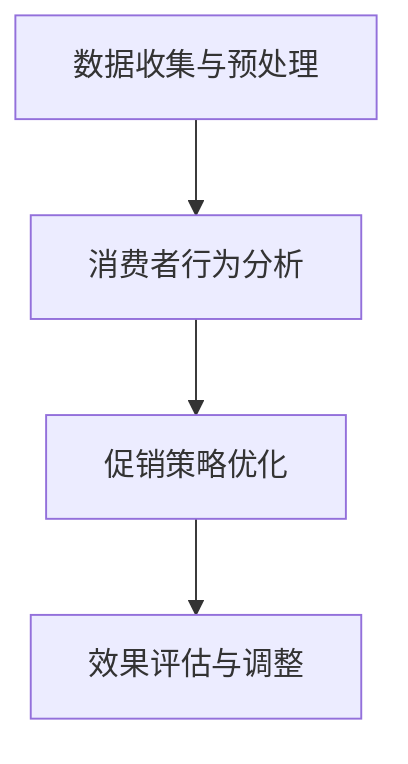

                 

# 促销策略：AI提升促销活动效果

## 1. 背景介绍

在当今竞争激烈的商业环境中，促销活动已成为企业争夺市场份额、提升品牌影响力的重要手段。然而，传统的促销活动往往依赖于大量的数据收集、分析和决策过程，效率低、成本高，且难以精准定位潜在消费者。面对这一挑战，人工智能（AI）技术以其强大的数据分析和预测能力，为促销策略的优化提供了新的解决方案。

### 1.1 问题由来

促销活动的核心目标是吸引和转化消费者，实现销售增长。传统的促销策略主要依赖于经验法则和手动分析，如“买一送一”、“打折促销”等。这种方式存在以下几个问题：

1. **效率低**：人工分析和决策过程耗时耗力，难以应对快速变化的市场需求。
2. **成本高**：大规模的促销活动需要大量的促销预算，且效果难以预测。
3. **精准度低**：传统的促销活动难以精准定位潜在消费者，导致资源浪费。
4. **信息不对称**：消费者在促销活动中的真实需求和行为难以全面了解，导致策略效果不佳。

为了解决这些问题，AI技术开始被引入促销策略中，利用大数据和机器学习模型对消费者行为进行分析，预测潜在需求，优化促销活动，实现精准营销。

### 1.2 问题核心关键点

AI在促销策略中的应用主要集中在以下几个方面：

- **数据收集与预处理**：收集消费者行为数据，如购买记录、浏览历史、评论等，并进行数据清洗和预处理。
- **消费者行为分析**：利用机器学习模型对消费者行为进行分析和建模，识别消费者的购买偏好、行为规律等。
- **促销策略优化**：根据消费者行为分析结果，优化促销活动策略，如选择合适的促销时间、渠道、促销方式等。
- **效果评估与调整**：实时监测促销活动效果，通过反馈机制不断调整优化策略，确保最佳的营销效果。

## 2. 核心概念与联系

### 2.1 核心概念概述

为更好地理解AI在促销策略中的应用，本节将介绍几个密切相关的核心概念：

- **数据驱动的促销策略**：指基于消费者行为数据进行促销策略制定的方式，通过数据分析和机器学习模型实现精准营销。
- **推荐系统**：通过分析用户行为和偏好，向用户推荐相关产品或内容，提升用户体验和转化率。
- **情感分析**：分析消费者对促销活动的情感反馈，调整促销策略，提升用户体验。
- **预测分析**：利用历史数据和机器学习模型预测消费者行为，优化促销活动的时间和方式。
- **实时监测与调整**：通过实时数据监测和反馈机制，不断调整促销策略，确保最佳效果。

这些核心概念之间的逻辑关系可以通过以下Mermaid流程图来展示：



这个流程图展示了数据驱动的促销策略的基本流程：首先收集和处理消费者行为数据，然后基于行为分析优化促销策略，最后通过实时监测和调整策略，实现最佳的营销效果。

## 3. 核心算法原理 & 具体操作步骤
### 3.1 算法原理概述

AI在促销策略中的应用主要基于数据驱动和机器学习技术，其核心思想是：通过收集和分析消费者行为数据，构建机器学习模型，预测消费者需求，优化促销活动，实现精准营销。

形式化地，设促销活动的目标为 $Y$，包含商品价格、促销方式、促销时间等因素，消费者行为数据为 $X$，包含购买记录、浏览历史、评论等。模型的目标是最小化预测误差，即：

$$
\min_{\theta} \sum_{i=1}^{n} (Y_i - f(X_i;\theta))^2
$$

其中，$f(X;\theta)$ 为模型预测函数，$\theta$ 为模型参数。通过求解上述最优化问题，可以找到最优的促销策略。

### 3.2 算法步骤详解

基于AI的促销策略优化一般包括以下几个关键步骤：

**Step 1: 数据收集与预处理**
- 收集消费者行为数据，如购买记录、浏览历史、评论等。
- 清洗和预处理数据，包括去除异常值、处理缺失值、特征工程等。

**Step 2: 消费者行为分析**
- 选择合适的机器学习模型，如线性回归、决策树、随机森林、深度学习等。
- 训练模型，并使用交叉验证等技术评估模型性能。
- 基于模型分析消费者行为，识别购买偏好、行为规律等。

**Step 3: 促销策略优化**
- 根据消费者行为分析结果，选择合适的促销策略，如折扣、买一送一、限时优惠等。
- 利用预测分析模型，预测促销活动效果，选择最优策略。
- 使用A/B测试等方法验证促销效果，确定最佳方案。

**Step 4: 效果评估与调整**
- 实时监测促销活动效果，收集反馈数据。
- 使用统计分析工具评估促销效果，识别优劣点。
- 根据反馈数据调整促销策略，确保最佳效果。

### 3.3 算法优缺点

基于AI的促销策略优化方法具有以下优点：
1. **效率高**：通过机器学习模型自动化分析消费者行为，减少人工干预，提高效率。
2. **成本低**：优化后的促销策略更精准，减少资源浪费，降低成本。
3. **精准度高**：利用数据驱动分析，精准定位潜在消费者，提高转化率。
4. **实时调整**：通过实时监测和反馈机制，及时调整策略，确保最佳效果。

同时，该方法也存在一定的局限性：
1. **数据依赖性强**：模型效果高度依赖于数据质量和数量，数据收集和处理难度较大。
2. **模型复杂度高**：构建和训练复杂的机器学习模型需要较强的技术背景和计算资源。
3. **隐私保护问题**：消费者行为数据的收集和使用可能涉及隐私问题，需要严格遵守法律法规。
4. **解释性不足**：机器学习模型的决策过程通常缺乏可解释性，难以理解其内部逻辑。

尽管存在这些局限性，但就目前而言，基于AI的促销策略优化方法仍是最主流的方式。未来相关研究的重点在于如何进一步降低数据收集的难度，提高模型的可解释性和预测能力，同时兼顾隐私保护和数据安全等因素。

### 3.4 算法应用领域

基于AI的促销策略优化方法已经在多个领域得到应用，包括：

- **零售行业**：如电商平台、线下商超的促销活动优化，提升销售转化率。
- **金融行业**：如信用卡优惠活动设计，增加客户使用率。
- **旅游行业**：如旅游产品推荐和促销活动设计，提升客户购买意愿。
- **媒体行业**：如内容推广活动优化，增加广告点击率。
- **服务行业**：如医疗、教育等行业的促销活动设计，提升服务质量。

除了上述这些经典应用外，AI在促销策略中的应用还在不断拓展，如智能客服、个性化推荐、市场调研等，为各行各业带来新的创新和突破。

## 4. 数学模型和公式 & 详细讲解 & 举例说明
### 4.1 数学模型构建

本节将使用数学语言对基于AI的促销策略优化过程进行更加严格的刻画。

设消费者行为数据为 $X$，促销活动策略为 $Y$，数据集为 $D=\{(x_i,y_i)\}_{i=1}^N$。模型的目标是最小化预测误差，即：

$$
\min_{\theta} \sum_{i=1}^{N} (y_i - f(x_i;\theta))^2
$$

其中，$f(x;\theta)$ 为预测函数，$\theta$ 为模型参数。预测函数的选取根据具体任务而定，如线性回归、决策树、随机森林等。

### 4.2 公式推导过程

以下我们以线性回归模型为例，推导预测函数及其梯度计算公式。

设 $x_i$ 为消费者行为数据，$y_i$ 为促销活动效果。线性回归模型定义为：

$$
y_i = \theta_0 + \theta_1 x_{i1} + \theta_2 x_{i2} + ... + \theta_p x_{ip} + \epsilon_i
$$

其中，$\theta_0,\theta_1,...,\theta_p$ 为模型参数，$\epsilon_i$ 为误差项。

最小二乘法求解线性回归模型的目标是最小化预测误差，即：

$$
\min_{\theta} \sum_{i=1}^{N} (y_i - f(x_i;\theta))^2
$$

目标函数的梯度为：

$$
\nabla_{\theta} \mathcal{L}(\theta) = -2\sum_{i=1}^{N} (y_i - f(x_i;\theta)) x_i
$$

通过求解上述最优化问题，可以找到最优的模型参数 $\theta$。

### 4.3 案例分析与讲解

**案例分析**：假设某电商平台希望优化促销活动，以提高销售转化率。

1. **数据收集与预处理**：收集用户购买记录、浏览历史、评论等数据，并进行数据清洗和预处理。
2. **消费者行为分析**：使用线性回归模型分析用户购买行为，识别影响销售的关键因素。
3. **促销策略优化**：根据模型分析结果，优化促销活动策略，如选择最佳的促销时间、渠道和促销方式。
4. **效果评估与调整**：实时监测促销活动效果，使用A/B测试评估策略效果，并根据反馈数据调整策略。

**讲解**：在上述案例中，通过AI技术实现了数据驱动的促销策略优化。数据收集和预处理是基础，消费者行为分析是核心，促销策略优化是手段，效果评估与调整是保障。这一过程充分展示了AI在促销策略中的应用价值。

## 5. 项目实践：代码实例和详细解释说明
### 5.1 开发环境搭建

在进行促销策略优化实践前，我们需要准备好开发环境。以下是使用Python进行Scikit-Learn开发的环境配置流程：

1. 安装Anaconda：从官网下载并安装Anaconda，用于创建独立的Python环境。
2. 创建并激活虚拟环境：
```bash
conda create -n promotion_env python=3.8 
conda activate promotion_env
```

3. 安装Scikit-Learn：
```bash
pip install scikit-learn
```

4. 安装其他相关工具包：
```bash
pip install pandas numpy matplotlib jupyter notebook
```

完成上述步骤后，即可在`promotion_env`环境中开始促销策略优化实践。

### 5.2 源代码详细实现

这里我们以用户购买行为预测为例，给出使用Scikit-Learn库对促销活动进行预测和优化的PyTorch代码实现。

首先，定义促销活动的数据处理函数：

```python
import pandas as pd
from sklearn.model_selection import train_test_split
from sklearn.linear_model import LinearRegression
from sklearn.metrics import mean_squared_error

def load_data(filename):
    data = pd.read_csv(filename)
    X = data[['purchase_count', 'item_price', 'time_of_day', 'weekday']]
    y = data['sales']
    return X, y

X, y = load_data('promotion_data.csv')
X_train, X_test, y_train, y_test = train_test_split(X, y, test_size=0.2, random_state=42)
```

然后，定义模型和优化器：

```python
from sklearn.linear_model import LinearRegression

model = LinearRegression()
```

接着，定义训练和评估函数：

```python
def train_model(model, X_train, y_train, X_test, y_test):
    model.fit(X_train, y_train)
    y_pred = model.predict(X_test)
    mse = mean_squared_error(y_test, y_pred)
    return mse

def evaluate_model(model, X_test, y_test):
    y_pred = model.predict(X_test)
    mse = mean_squared_error(y_test, y_pred)
    return mse
```

最后，启动训练流程并在测试集上评估：

```python
epochs = 100
learning_rate = 0.01

for epoch in range(epochs):
    mse = train_model(model, X_train, y_train, X_test, y_test)
    if epoch % 10 == 0:
        print(f"Epoch {epoch+1}, MSE: {mse:.4f}")
        
mse_test = evaluate_model(model, X_test, y_test)
print(f"Test MSE: {mse_test:.4f}")
```

以上就是使用Scikit-Learn对促销活动进行预测和优化的完整代码实现。可以看到，利用Scikit-Learn的封装，我们可以用相对简洁的代码完成促销活动预测模型的训练和评估。

### 5.3 代码解读与分析

让我们再详细解读一下关键代码的实现细节：

**数据处理函数**：
- `load_data`方法：加载促销活动数据，并进行特征工程和数据拆分。
- `X, y`：特征和目标变量。
- `X_train, X_test, y_train, y_test`：训练集和测试集的数据和标签。

**模型定义**：
- `LinearRegression`：线性回归模型，用于预测促销活动效果。

**训练和评估函数**：
- `train_model`方法：训练线性回归模型，并在测试集上评估模型性能。
- `evaluate_model`方法：只评估测试集模型性能。
- `mean_squared_error`：均方误差评估指标，用于衡量模型预测的准确性。

**训练流程**：
- `epochs`：训练轮数。
- `learning_rate`：学习率。
- `train_model`：每个epoch训练一次模型，并在测试集上评估性能。
- `evaluate_model`：在测试集上评估模型性能。
- `print`：打印训练和测试集的均方误差。

可以看到，Scikit-Learn提供了完善的机器学习库，使得促销策略优化的代码实现变得简洁高效。开发者可以将更多精力放在数据处理、模型改进等高层逻辑上，而不必过多关注底层的实现细节。

当然，工业级的系统实现还需考虑更多因素，如模型的保存和部署、超参数的自动搜索、更灵活的任务适配层等。但核心的促销策略优化范式基本与此类似。

## 6. 实际应用场景
### 6.1 智能电商促销

智能电商促销已成为电商平台提高销售转化率的重要手段。利用AI技术，电商平台可以更精准地分析用户行为，预测销售趋势，优化促销活动策略，实现个性化的精准营销。

在技术实现上，可以收集电商平台的用户购买记录、浏览历史、评价反馈等数据，并利用机器学习模型进行行为分析。基于分析结果，优化促销活动的时间和方式，如根据用户兴趣推送个性化优惠券，在不同时间段设置限时优惠等。实时监测促销效果，通过反馈机制不断调整策略，确保最佳的营销效果。

### 6.2 金融产品推荐

金融机构需要不断推出新的金融产品，吸引和保留客户。AI技术可以帮助金融机构更好地分析客户需求，优化产品推荐策略，提升客户满意度。

具体而言，可以收集客户的交易记录、信用评分、风险偏好等数据，构建机器学习模型，预测客户对不同产品的兴趣。根据预测结果，推荐最合适的产品组合，并设计有针对性的促销活动。通过实时监测客户行为和反馈，不断优化推荐策略，确保最佳效果。

### 6.3 旅游目的地推荐

旅游行业面临高度竞争，需要不断推出新的旅游产品和促销活动，吸引游客。AI技术可以帮助旅游企业更好地分析游客需求，优化促销活动，提升游客体验。

具体而言，可以收集游客的浏览记录、预订历史、评价反馈等数据，构建机器学习模型，预测游客对不同旅游产品的兴趣。根据预测结果，推荐最合适的旅游线路和促销活动，并设计有针对性的广告推广。通过实时监测游客行为和反馈，不断优化推荐策略，确保最佳效果。

### 6.4 未来应用展望

随着AI技术的不断发展，促销策略优化将迎来更多的创新和突破。未来AI在促销策略中的应用可能包括：

- **个性化推荐系统**：结合用户画像和行为数据，提供个性化的促销活动，提升用户满意度和转化率。
- **情感分析**：分析用户对促销活动的情感反馈，优化活动设计和推广策略，提升用户体验。
- **实时监控与调整**：通过实时数据分析和反馈机制，不断调整促销策略，确保最佳效果。
- **多渠道营销**：结合多渠道数据，优化跨平台的促销活动，提升整体营销效果。
- **智能客服**：利用AI技术优化客服流程，提高客户体验和转化率。

这些方向的探索发展，将进一步提升促销策略的精准性和效果，为企业的市场竞争力和客户满意度带来新的突破。相信随着AI技术的不断进步，促销策略优化将成为企业获取竞争优势的重要手段。

## 7. 工具和资源推荐
### 7.1 学习资源推荐

为了帮助开发者系统掌握AI在促销策略中的应用，这里推荐一些优质的学习资源：

1. **《深度学习》课程**：斯坦福大学开设的深度学习课程，由吴恩达教授主讲，涵盖了深度学习的基本概念和算法，适合入门学习。
2. **Scikit-Learn官方文档**：Scikit-Learn库的官方文档，提供了丰富的学习资料和样例代码，是学习机器学习算法的好帮手。
3. **《Python机器学习实战》书籍**：实战性较强的书籍，详细介绍了机器学习在实际应用中的方法和技巧。
4. **Kaggle竞赛平台**：Kaggle提供大量机器学习竞赛，通过实际问题解决，提升算法能力和实践经验。
5. **Coursera课程**：Coursera提供众多机器学习相关课程，涵盖深度学习、强化学习、自然语言处理等多个方向。

通过对这些资源的学习实践，相信你一定能够快速掌握AI在促销策略中的应用，并用于解决实际的商业问题。

### 7.2 开发工具推荐

高效的开发离不开优秀的工具支持。以下是几款用于促销策略优化开发的常用工具：

1. **Jupyter Notebook**：用于数据处理和模型训练的交互式开发环境，支持代码编写和可视化展示。
2. **Scikit-Learn**：Python机器学习库，提供了丰富的算法和模型，适合快速迭代研究。
3. **TensorFlow**：由Google主导开发的深度学习框架，生产部署方便，适合大规模工程应用。
4. **PyTorch**：基于Python的深度学习框架，灵活动态的计算图，适合快速迭代研究。
5. **H2O**：开源的机器学习平台，支持分布式计算，适合大规模数据处理和模型训练。

合理利用这些工具，可以显著提升促销策略优化的开发效率，加快创新迭代的步伐。

### 7.3 相关论文推荐

AI在促销策略优化领域的研究已经取得了诸多重要成果，以下是几篇奠基性的相关论文，推荐阅读：

1. **《基于机器学习的促销策略优化》**：提出了多种机器学习算法在促销策略中的应用，详细介绍了模型的构建和优化方法。
2. **《深度学习在零售行业的应用》**：展示了深度学习在零售行业的广泛应用，包括销售预测、库存管理、客户分析等。
3. **《情感分析在促销活动中的应用》**：探讨了情感分析技术在促销活动中的应用，通过分析用户情感反馈，优化促销策略。
4. **《实时监控与调整策略》**：介绍了实时数据分析和反馈机制在促销策略优化中的应用，确保最佳的营销效果。

这些论文代表了大数据和机器学习在促销策略优化领域的发展脉络。通过学习这些前沿成果，可以帮助研究者把握学科前进方向，激发更多的创新灵感。

## 8. 总结：未来发展趋势与挑战
### 8.1 总结

本文对基于AI的促销策略优化方法进行了全面系统的介绍。首先阐述了AI在促销策略优化中的应用背景和意义，明确了数据驱动和机器学习在促销策略优化中的核心价值。其次，从原理到实践，详细讲解了促销策略优化的数学原理和关键步骤，给出了促销策略优化的完整代码实例。同时，本文还广泛探讨了促销策略在智能电商、金融、旅游等多个行业领域的应用前景，展示了AI在促销策略中的应用潜力。此外，本文精选了促销策略优化的各类学习资源，力求为读者提供全方位的技术指引。

通过本文的系统梳理，可以看到，基于AI的促销策略优化方法已经成为企业获取竞争优势的重要手段。数据驱动和机器学习技术的引入，使得促销策略优化更加精准、高效和实时。未来，伴随AI技术的不断演进，促销策略优化将面临更多的机遇和挑战，需要持续探索和创新。

### 8.2 未来发展趋势

展望未来，促销策略优化将呈现以下几个发展趋势：

1. **多模态数据融合**：结合文本、图像、声音等多模态数据，进行更全面的用户行为分析，提升促销策略的精准性。
2. **深度学习应用**：利用深度学习模型，如卷积神经网络、循环神经网络等，进行更复杂的用户行为建模。
3. **实时数据处理**：通过实时数据流处理技术，实现促销策略的动态调整，提升策略效果。
4. **情感分析应用**：结合情感分析技术，优化促销活动设计和推广策略，提升用户体验。
5. **个性化推荐系统**：结合用户画像和行为数据，提供个性化的促销活动，提升用户满意度和转化率。

这些趋势展示了AI在促销策略优化领域的广阔前景。未来的研究将在数据收集、模型构建、策略优化等方面不断取得突破，为企业的市场竞争力和客户满意度带来新的提升。

### 8.3 面临的挑战

尽管AI在促销策略优化中取得了显著效果，但在实际应用中也面临诸多挑战：

1. **数据隐私和安全**：消费者行为数据的收集和使用涉及隐私问题，需要严格遵守法律法规。
2. **数据质量与多样性**：高质量、多样化的数据是AI模型的基础，但在实际应用中数据收集和处理难度较大。
3. **模型复杂度**：复杂的模型需要较强的技术背景和计算资源，模型的可解释性和实用性仍需进一步提升。
4. **算法偏见**：AI模型可能存在算法偏见，导致促销策略的不公平性。
5. **资源消耗**：大规模的模型训练和推理需要大量的计算资源，如何在保证效果的同时降低资源消耗，是一个重要问题。

这些挑战需要研究者从数据、模型、算法等多个维度进行深入探索，才能实现AI在促销策略优化中的持续发展。相信随着技术的不断进步，这些挑战终将逐一被克服，AI在促销策略优化中的应用前景将更加广阔。

### 8.4 研究展望

面对促销策略优化所面临的种种挑战，未来的研究需要在以下几个方面寻求新的突破：

1. **数据增强技术**：通过数据增强技术，提高数据质量，增强模型的泛化能力。
2. **模型简化**：开发更轻量级、高效的模型，降低资源消耗，提升实时处理能力。
3. **算法公平性**：研究如何消除算法偏见，确保促销策略的公平性和透明性。
4. **多渠道数据融合**：实现跨渠道数据整合，提升促销策略的精准性和全面性。
5. **实时数据处理**：结合实时数据流处理技术，实现促销策略的动态调整，确保最佳效果。

这些研究方向的探索，将进一步提升AI在促销策略优化中的效果和实用性，为企业的市场竞争力和客户满意度带来新的突破。总之，AI在促销策略优化领域的应用将不断深入和拓展，为企业的数字化转型和智能化发展提供新的动力。

## 9. 附录：常见问题与解答

**Q1：AI在促销策略优化中的核心优势是什么？**

A: AI在促销策略优化中的核心优势主要体现在以下几个方面：
1. **数据驱动**：基于大量历史数据进行分析和建模，提升策略的精准性和效果。
2. **自动化**：利用机器学习算法自动化分析和优化促销策略，提高效率。
3. **实时调整**：通过实时数据监测和反馈机制，动态调整促销策略，确保最佳效果。
4. **个性化推荐**：结合用户画像和行为数据，提供个性化的促销活动，提升用户满意度和转化率。
5. **预测能力**：利用历史数据和机器学习模型，预测消费者行为和促销效果，优化策略设计。

**Q2：AI在促销策略优化中需要注意哪些问题？**

A: AI在促销策略优化中需要注意以下几个问题：
1. **数据隐私和安全**：消费者行为数据的收集和使用涉及隐私问题，需要严格遵守法律法规。
2. **数据质量与多样性**：高质量、多样化的数据是AI模型的基础，但在实际应用中数据收集和处理难度较大。
3. **模型复杂度**：复杂的模型需要较强的技术背景和计算资源，模型的可解释性和实用性仍需进一步提升。
4. **算法偏见**：AI模型可能存在算法偏见，导致促销策略的不公平性。
5. **资源消耗**：大规模的模型训练和推理需要大量的计算资源，如何在保证效果的同时降低资源消耗，是一个重要问题。

**Q3：如何构建有效的促销策略优化模型？**

A: 构建有效的促销策略优化模型需要遵循以下几个步骤：
1. **数据收集与预处理**：收集消费者行为数据，并进行数据清洗和预处理。
2. **特征工程**：选择合适的特征，并进行特征提取和转换。
3. **模型选择与训练**：选择合适的机器学习模型，并进行模型训练和优化。
4. **评估与调参**：使用交叉验证等技术评估模型性能，并进行超参数调优。
5. **实时监测与调整**：通过实时数据监测和反馈机制，不断调整优化策略。

**Q4：AI在促销策略优化中有哪些典型的应用场景？**

A: AI在促销策略优化中典型的应用场景包括：
1. **智能电商促销**：结合用户行为数据，优化电商平台的促销活动策略，提升销售转化率。
2. **金融产品推荐**：分析客户需求，优化金融产品推荐策略，提升客户满意度和转化率。
3. **旅游目的地推荐**：结合用户行为数据，优化旅游产品和促销活动，提升游客体验和转化率。
4. **市场调研与分析**：利用AI技术进行市场调研和分析，识别市场机会和趋势，指导促销策略设计。
5. **客户关系管理**：结合客户行为数据，优化客户关系管理策略，提升客户忠诚度和满意度。

**Q5：如何保证AI在促销策略优化中的效果？**

A: 保证AI在促销策略优化中的效果需要以下几个关键点：
1. **数据质量**：确保数据的多样性和代表性，提高模型的泛化能力。
2. **模型选择**：选择合适的机器学习模型，根据具体任务进行优化。
3. **实时监测**：通过实时数据监测和反馈机制，动态调整优化策略。
4. **多渠道数据融合**：实现跨渠道数据整合，提升促销策略的精准性和全面性。
5. **算法公平性**：研究如何消除算法偏见，确保促销策略的公平性和透明性。

这些措施将有助于提升AI在促销策略优化中的效果，为企业带来更大的市场竞争力和客户满意度。

---

作者：禅与计算机程序设计艺术 / Zen and the Art of Computer Programming

