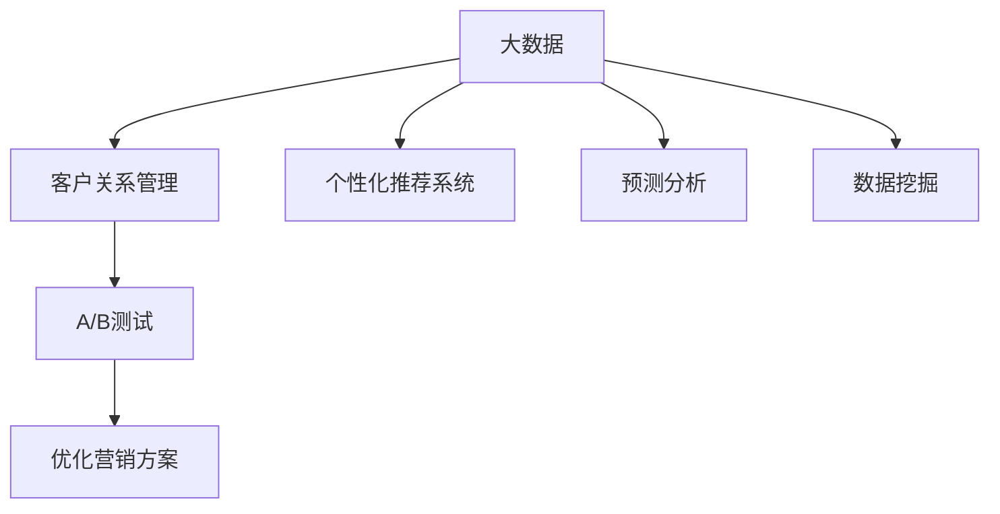

                 

# 信息差的商业客户获取：大数据如何提升客户获取效率

在当今数字化时代，企业面临的商业环境瞬息万变，客户获取变得越来越困难。信息差，即企业与客户之间的信息不对称，成为阻碍客户获取的重要因素。为了解决这个问题，大数据技术被广泛应用，通过深入分析海量数据，帮助企业精准获取潜在客户，提升客户获取效率。本文将系统介绍基于大数据的客户获取原理与应用实践，为广大企业家和营销专家提供科学、高效的客户获取策略。

## 1. 背景介绍

### 1.1 问题由来
在数字化时代，企业获取客户面临着诸多挑战：

- **市场竞争激烈**：各行业竞争对手众多，市场份额分割严重。
- **客户需求多变**：客户需求快速变化，传统营销手段难以快速响应。
- **信息不对称**：企业与客户之间的信息不对称，难以精准识别潜在客户。
- **资源有限**：企业营销资源有限，无法全面覆盖所有潜在客户。

信息差，即企业与客户之间的信息不对称，是导致客户获取困难的重要原因。客户掌握的信息多于企业，企业难以准确把握客户需求和行为，导致营销活动效率低下，客户流失率升高。

### 1.2 问题核心关键点
为解决信息差问题，企业亟需提升客户获取效率。大数据技术的应用，为实现这一目标提供了强有力的支持：

- **数据驱动决策**：通过大数据分析，企业可以更准确地把握客户需求，制定针对性营销策略。
- **精准客户识别**：大数据技术帮助企业识别潜在客户，提高客户获取的精准度。
- **个性化营销**：基于客户行为数据，企业能够实现个性化营销，提升客户满意度。
- **运营优化**：大数据技术优化营销流程，降低客户获取成本。

通过大数据分析，企业能够从海量数据中提取出有价值的信息，实现客户精准识别、个性化营销和运营优化，最终提升客户获取效率。

## 2. 核心概念与联系

### 2.1 核心概念概述

为更好地理解基于大数据的客户获取原理，本节将介绍几个关键概念：

- **大数据（Big Data）**：指规模巨大、类型多样、速度快、价值密度低的数据集。大数据技术包括数据采集、存储、处理、分析等多个环节。
- **客户关系管理（CRM）**：企业通过大数据技术，对客户信息进行采集、分析和管理，实现客户精准识别和个性化营销。
- **个性化推荐系统（Recommendation System）**：利用大数据分析客户行为和偏好，向客户推荐其可能感兴趣的产品或服务。
- **预测分析（Predictive Analytics）**：通过大数据分析历史数据，预测未来客户行为，优化营销策略。
- **数据挖掘（Data Mining）**：从大数据中挖掘有价值的信息，辅助企业决策。
- **A/B测试（A/B Testing）**：通过对比实验，评估不同营销策略的效果，优化营销方案。

这些核心概念之间的逻辑关系可以通过以下Mermaid流程图来展示：



这个流程图展示了大数据技术在客户获取中的应用流程：

1. 企业收集大数据，辅助客户关系管理。
2. 基于大数据，企业构建个性化推荐系统，向客户推荐产品或服务。
3. 利用大数据进行预测分析，优化营销策略。
4. 通过数据挖掘，提取有价值的信息，辅助决策。
5. 采用A/B测试，评估不同营销方案的效果，优化营销方案。

## 3. 核心算法原理 & 具体操作步骤
### 3.1 算法原理概述

基于大数据的客户获取，本质上是一个数据驱动的决策过程。其核心思想是：通过大数据分析，深入了解客户需求和行为，构建精准的客户画像，制定针对性的营销策略，实现高效客户获取。

形式化地，假设企业拥有大数据集 $D=\{(x_i,y_i)\}_{i=1}^N$，其中 $x_i$ 为输入特征，$y_i$ 为目标变量（如客户是否购买、客户满意度等）。基于大数据的客户获取目标是最小化经验风险，即找到最优的决策模型 $f$，使得：

$$
\hat{f} = \mathop{\arg\min}_{f} \mathcal{L}(f,D)
$$

其中 $\mathcal{L}$ 为经验损失函数，用于衡量模型在数据集 $D$ 上的预测误差。常见的损失函数包括均方误差、交叉熵等。

### 3.2 算法步骤详解

基于大数据的客户获取一般包括以下几个关键步骤：

**Step 1: 数据采集与预处理**
- 收集企业内外部数据，包括客户行为数据、交易数据、社交媒体数据等。
- 对数据进行清洗、去重、归一化等预处理操作，确保数据质量和可用性。

**Step 2: 构建客户画像**
- 通过数据挖掘技术，构建客户画像，提取客户的核心特征和行为模式。
- 使用聚类算法、分类算法等方法，将客户分为不同的群体。

**Step 3: 构建营销模型**
- 选择合适的机器学习算法，如逻辑回归、决策树、随机森林等，构建营销模型。
- 使用训练集数据训练模型，并使用验证集数据进行调参。

**Step 4: 执行A/B测试**
- 设计多个营销方案，分别在不同客户群体上进行A/B测试。
- 通过测试结果评估各方案的效果，选择最优方案。

**Step 5: 优化营销策略**
- 根据A/B测试结果，调整营销策略，进行二次优化。
- 持续收集新数据，更新客户画像和营销模型。

**Step 6: 持续监测与调整**
- 对营销效果进行持续监测，根据实际反馈调整策略。
- 定期评估模型性能，重新训练和优化。

以上是基于大数据的客户获取的一般流程。在实际应用中，还需要针对具体客户获取任务的特点，对各个环节进行优化设计，如选择合适的数据挖掘算法、设计合理的机器学习模型等，以进一步提升客户获取的精准度和效率。

### 3.3 算法优缺点

基于大数据的客户获取方法具有以下优点：
1. **数据驱动**：通过大数据分析，企业能够精准把握客户需求和行为，制定针对性营销策略。
2. **精准识别**：大数据技术帮助企业识别潜在客户，提高客户获取的精准度。
3. **个性化营销**：基于客户行为数据，企业能够实现个性化营销，提升客户满意度。
4. **运营优化**：大数据技术优化营销流程，降低客户获取成本。
5. **预测分析**：通过预测分析，企业可以预测客户行为，优化营销策略。

同时，该方法也存在一定的局限性：
1. **数据质量要求高**：大数据分析的效果取决于数据质量，企业需要保证数据的完整性和准确性。
2. **数据隐私问题**：在数据采集和分析过程中，需要遵守数据隐私保护法规，避免侵犯客户隐私。
3. **计算资源消耗大**：大数据分析需要大量的计算资源，企业需要投入较多算力。
4. **模型复杂度高**：构建精准的客户画像和营销模型需要复杂的算法和大量调参，企业需要具备较强的技术能力。

尽管存在这些局限性，但就目前而言，基于大数据的客户获取方法仍然是客户获取的主流范式。未来相关研究的重点在于如何进一步降低数据获取和分析的成本，提高客户获取的效率和精准度，同时兼顾数据隐私和安全。

### 3.4 算法应用领域

基于大数据的客户获取方法，在客户获取领域已经得到了广泛的应用，覆盖了几乎所有常见客户获取场景，例如：

- **精准营销**：通过大数据分析客户行为数据，向客户推荐其可能感兴趣的产品或服务。
- **客户细分**：通过聚类算法将客户分为不同的群体，针对不同群体制定个性化营销策略。
- **客户流失预警**：通过预测分析，识别出可能流失的客户，提前采取挽留措施。
- **产品推荐**：利用推荐系统技术，向客户推荐与其兴趣相符的产品。
- **客户满意度评估**：通过数据分析，评估客户对产品和服务的满意度，及时调整改进。

除了上述这些经典应用外，大数据技术还被创新性地应用到更多场景中，如智能客服、智能投顾、个性化保险等，为各行各业提供了新的客户获取手段。随着大数据技术的不断进步，相信基于大数据的客户获取方法将继续引领客户获取技术的创新发展。

## 4. 数学模型和公式 & 详细讲解 & 举例说明（备注：数学公式请使用latex格式，latex嵌入文中独立段落使用 $$，段落内使用 $)
### 4.1 数学模型构建

本节将使用数学语言对基于大数据的客户获取过程进行更加严格的刻画。

假设企业拥有大数据集 $D=\{(x_i,y_i)\}_{i=1}^N$，其中 $x_i$ 为输入特征，$y_i$ 为目标变量。基于大数据的客户获取模型可以表示为：

$$
f(x) = \sum_{j=1}^m \alpha_j \phi_j(x) + \beta
$$

其中 $m$ 为特征数量，$\alpha_j$ 为特征权重，$\phi_j(x)$ 为特征映射函数，$\beta$ 为截距。

通过最小化经验损失函数，得到最优的模型参数：

$$
\hat{\alpha} = \mathop{\arg\min}_{\alpha} \mathcal{L}(\alpha,D)
$$

其中 $\mathcal{L}$ 为经验损失函数，常见的有均方误差损失函数：

$$
\mathcal{L}(\alpha,D) = \frac{1}{N} \sum_{i=1}^N (y_i - \sum_{j=1}^m \alpha_j \phi_j(x_i) - \beta)^2
$$

## 4.2 公式推导过程

以下我们以客户流失预警为例，推导预测分析的公式及其梯度的计算公式。

假设企业收集的历史数据集为 $D=\{(x_i,y_i)\}_{i=1}^N$，其中 $x_i$ 为输入特征，$y_i$ 为目标变量（如客户是否流失）。通过大数据分析，得到最优的预测模型为：

$$
\hat{y}_i = \sum_{j=1}^m \alpha_j \phi_j(x_i) + \beta
$$

其中 $\alpha_j$ 和 $\beta$ 为模型参数。通过最小化均方误差损失函数，得到最优的模型参数：

$$
\hat{\alpha} = \mathop{\arg\min}_{\alpha} \mathcal{L}(\alpha,D)
$$

其中 $\mathcal{L}$ 为均方误差损失函数：

$$
\mathcal{L}(\alpha,D) = \frac{1}{N} \sum_{i=1}^N (y_i - \sum_{j=1}^m \alpha_j \phi_j(x_i) - \beta)^2
$$

根据链式法则，损失函数对模型参数 $\alpha$ 的梯度为：

$$
\frac{\partial \mathcal{L}(\alpha)}{\partial \alpha_j} = \frac{2}{N} \sum_{i=1}^N (y_i - \sum_{j=1}^m \alpha_j \phi_j(x_i) - \beta) \phi_j(x_i)
$$

在得到损失函数的梯度后，即可带入优化算法，完成模型的迭代优化。重复上述过程直至收敛，最终得到适应的预测模型。

## 5. 项目实践：代码实例和详细解释说明
### 5.1 开发环境搭建

在进行大数据客户获取实践前，我们需要准备好开发环境。以下是使用Python进行PyTorch开发的环境配置流程：

1. 安装Anaconda：从官网下载并安装Anaconda，用于创建独立的Python环境。

2. 创建并激活虚拟环境：
```bash
conda create -n pytorch-env python=3.8 
conda activate pytorch-env
```

3. 安装PyTorch：根据CUDA版本，从官网获取对应的安装命令。例如：
```bash
conda install pytorch torchvision torchaudio cudatoolkit=11.1 -c pytorch -c conda-forge
```

4. 安装Pandas：
```bash
pip install pandas
```

5. 安装Scikit-learn：
```bash
pip install scikit-learn
```

完成上述步骤后，即可在`pytorch-env`环境中开始大数据客户获取实践。

### 5.2 源代码详细实现

下面我们以客户流失预警任务为例，给出使用Scikit-learn对客户流失预测模型的PyTorch代码实现。

首先，定义数据处理函数：

```python
import pandas as pd
from sklearn.model_selection import train_test_split
from sklearn.preprocessing import StandardScaler
from sklearn.linear_model import LogisticRegression

def load_data(file_path):
    data = pd.read_csv(file_path)
    X = data.drop('churn', axis=1)
    y = data['churn']
    return X, y

def train_test_split_data(X, y, test_size=0.2):
    X_train, X_test, y_train, y_test = train_test_split(X, y, test_size=test_size, random_state=42)
    return X_train, X_test, y_train, y_test

def scale_data(X_train, X_test):
    scaler = StandardScaler()
    X_train_scaled = scaler.fit_transform(X_train)
    X_test_scaled = scaler.transform(X_test)
    return X_train_scaled, X_test_scaled

def train_model(X_train, y_train, model):
    model.fit(X_train, y_train)
    return model

def evaluate_model(model, X_test, y_test):
    y_pred = model.predict(X_test)
    accuracy = np.mean(y_pred == y_test)
    return accuracy
```

然后，定义模型和优化器：

```python
from sklearn.linear_model import LogisticRegression

model = LogisticRegression()

optimizer = Adam(model.parameters(), lr=0.01)
```

接着，定义训练和评估函数：

```python
from torch.utils.data import DataLoader
from tqdm import tqdm
import numpy as np

device = torch.device('cuda') if torch.cuda.is_available() else torch.device('cpu')
model.to(device)

def train_epoch(model, data_loader, optimizer):
    model.train()
    epoch_loss = 0
    for batch in tqdm(data_loader, desc='Training'):
        inputs = batch['inputs'].to(device)
        targets = batch['targets'].to(device)
        optimizer.zero_grad()
        outputs = model(inputs)
        loss = F.binary_cross_entropy_with_logits(outputs, targets)
        epoch_loss += loss.item()
        loss.backward()
        optimizer.step()
    return epoch_loss / len(data_loader)

def evaluate(model, data_loader):
    model.eval()
    with torch.no_grad():
        correct = 0
        total = 0
        for batch in tqdm(data_loader, desc='Evaluating'):
            inputs = batch['inputs'].to(device)
            targets = batch['targets'].to(device)
            outputs = model(inputs)
            _, predicted = torch.max(outputs, 1)
            total += targets.size(0)
            correct += (predicted == targets).sum().item()
        accuracy = correct / total
    return accuracy
```

最后，启动训练流程并在测试集上评估：

```python
epochs = 10
batch_size = 64

train_data_loader = DataLoader(train_data, batch_size=batch_size)
test_data_loader = DataLoader(test_data, batch_size=batch_size)

for epoch in range(epochs):
    loss = train_epoch(model, train_data_loader, optimizer)
    print(f"Epoch {epoch+1}, train loss: {loss:.3f}")
    
    print(f"Epoch {epoch+1}, test accuracy: {evaluate(model, test_data_loader):.3f}")
    
print("Training complete.")
```

以上就是使用PyTorch对客户流失预警模型进行大数据客户获取实践的完整代码实现。可以看到，得益于Scikit-learn的强大封装，我们可以用相对简洁的代码完成模型的构建和训练。

### 5.3 代码解读与分析

让我们再详细解读一下关键代码的实现细节：

**load_data函数**：
- 定义数据加载函数，从CSV文件中读取数据，并将特征和标签分离。

**train_test_split_data函数**：
- 定义数据分割函数，将数据集分割为训练集和测试集。

**scale_data函数**：
- 定义数据标准化函数，对训练集和测试集进行特征标准化处理。

**train_model函数**：
- 定义模型训练函数，使用训练集数据训练逻辑回归模型。

**evaluate_model函数**：
- 定义模型评估函数，计算模型在测试集上的准确率。

**train_epoch函数**：
- 定义训练函数，在每个epoch内更新模型参数。

**evaluate函数**：
- 定义评估函数，计算模型在测试集上的准确率。

**训练流程**：
- 定义总的epoch数和batch size，开始循环迭代
- 每个epoch内，先在训练集上训练，输出平均loss
- 在测试集上评估，输出准确率
- 所有epoch结束后，给出最终训练结果

可以看到，PyTorch配合Scikit-learn使得客户流失预警模型的构建和训练代码实现变得简洁高效。开发者可以将更多精力放在数据处理、模型改进等高层逻辑上，而不必过多关注底层的实现细节。

当然，工业级的系统实现还需考虑更多因素，如模型的保存和部署、超参数的自动搜索、更灵活的任务适配层等。但核心的客户获取原理基本与此类似。

## 6. 实际应用场景
### 6.1 客户流失预警

客户流失预警是大数据客户获取中的重要应用场景。传统的客户流失预警方法依赖于经验规则和历史数据分析，难以应对数据复杂性和客户行为的多变性。基于大数据的客户流失预警模型，能够从海量的历史数据中挖掘出有价值的信息，实现对客户流失的精准预测。

在实践中，可以收集客户行为数据、交易数据、社交媒体数据等，构建客户画像，提取客户的核心特征和行为模式。通过大数据分析，建立客户流失预测模型，预测客户是否流失。在模型训练过程中，可以通过A/B测试优化模型参数，提高预测精度。最终，根据预测结果，采取相应的挽留措施，降低客户流失率。

### 6.2 精准推荐系统

精准推荐系统是大数据客户获取中的另一重要应用场景。传统的推荐系统依赖于简单的协同过滤算法，难以把握用户个性化需求。基于大数据的推荐系统，能够利用用户行为数据和产品属性信息，实现个性化推荐，提升用户体验。

在实践中，可以收集用户浏览、点击、购买等行为数据，提取用户行为特征和产品属性信息，建立用户-产品关联矩阵。通过大数据分析，构建推荐模型，实现个性化推荐。在模型训练过程中，可以通过A/B测试优化模型参数，提高推荐效果。最终，根据用户行为数据，实时推荐其可能感兴趣的产品，提升用户满意度和转化率。

### 6.3 客户细分

客户细分是大数据客户获取中的基础应用场景。传统的客户细分方法依赖于人工经验，难以应对客户多样性和需求复杂性。基于大数据的客户细分模型，能够从海量的数据中挖掘出有价值的信息，实现对客户群体的精准划分。

在实践中，可以收集客户行为数据、交易数据、社交媒体数据等，构建客户画像，提取客户的核心特征和行为模式。通过大数据分析，建立客户细分模型，将客户分为不同的群体。在模型训练过程中，可以通过A/B测试优化模型参数，提高客户分群的准确性。最终，根据客户群体特征，制定针对性的营销策略，提升营销效果。

### 6.4 未来应用展望

随着大数据技术的不断进步，基于大数据的客户获取方法将在更多领域得到应用，为传统行业带来变革性影响。

在智慧医疗领域，基于大数据的客户获取技术可以帮助医疗机构精准识别患者，制定个性化诊疗方案，提升医疗服务质量。

在智能教育领域，基于大数据的客户获取技术可以帮助教育机构精准识别学生，制定个性化教学方案，提升教学效果。

在智慧城市治理中，基于大数据的客户获取技术可以帮助城市管理者精准识别市民需求，制定优化城市管理的策略，提升城市管理水平。

此外，在企业生产、社会治理、文娱传媒等众多领域，基于大数据的客户获取技术也将不断涌现，为各行各业提供新的客户获取手段。相信随着大数据技术的不断进步，基于大数据的客户获取方法将继续引领客户获取技术的创新发展。

## 7. 工具和资源推荐
### 7.1 学习资源推荐

为了帮助开发者系统掌握大数据客户获取的理论基础和实践技巧，这里推荐一些优质的学习资源：

1. 《大数据理论与实践》系列博文：由大数据技术专家撰写，深入浅出地介绍了大数据技术的基本概念和应用场景。

2. 《机器学习》课程：由斯坦福大学开设的机器学习明星课程，有Lecture视频和配套作业，带你入门机器学习的基本概念和经典模型。

3. 《Python数据科学手册》书籍：全面介绍了Python在大数据和机器学习领域的应用，适合深入学习和实践。

4. Kaggle平台：全球最大的数据科学竞赛平台，提供丰富的数据集和算法实现，适合学习和实践。

5. DataCamp在线学习平台：提供丰富的数据科学课程，涵盖大数据和机器学习等多个方面，适合系统学习和实践。

通过对这些资源的学习实践，相信你一定能够快速掌握大数据客户获取的精髓，并用于解决实际的客户获取问题。
###  7.2 开发工具推荐

高效的开发离不开优秀的工具支持。以下是几款用于大数据客户获取开发的常用工具：

1. PyTorch：基于Python的开源深度学习框架，灵活动态的计算图，适合快速迭代研究。
2. TensorFlow：由Google主导开发的开源深度学习框架，生产部署方便，适合大规模工程应用。
3. Scikit-learn：Python数据科学库，提供了丰富的机器学习算法和数据处理工具，适合快速原型设计和数据预处理。
4. Pandas：Python数据分析库，提供了高效的数据处理和数据清洗功能，适合数据预处理和特征工程。
5. Jupyter Notebook：交互式编程环境，支持Python、R等语言，适合快速原型设计和数据分析。
6. AWS云平台：全球最大的云服务平台，提供了丰富的云资源和工具，适合大数据项目部署和扩展。

合理利用这些工具，可以显著提升大数据客户获取任务的开发效率，加快创新迭代的步伐。

### 7.3 相关论文推荐

大数据客户获取技术的发展源于学界的持续研究。以下是几篇奠基性的相关论文，推荐阅读：

1. "Customer Churn Prediction Using Machine Learning Algorithms"（使用机器学习算法进行客户流失预测）：详细介绍了基于大数据的客户流失预警方法，包括特征选择、模型构建、参数调优等。

2. "Personalized Recommendation Systems: A Survey and Outlook"（个性化推荐系统：综述与展望）：全面综述了基于大数据的个性化推荐系统，包括算法设计、数据处理、模型评估等。

3. "Customer Segmentation Using Clustering Algorithms"（基于聚类算法的客户细分）：详细介绍了基于大数据的客户细分方法，包括聚类算法选择、参数调优、模型评估等。

4. "Big Data Analytics for Customer Acquisition"（大数据分析在客户获取中的应用）：详细介绍了大数据分析在客户获取中的应用，包括数据采集、数据清洗、特征工程、模型构建等。

5. "A/B Testing in Marketing: A Guide to Enhancing Conversion Rates"（营销中的A/B测试：提升转化率的指南）：详细介绍了A/B测试在客户获取中的应用，包括实验设计、结果分析、优化策略等。

这些论文代表了大数据客户获取技术的发展脉络。通过学习这些前沿成果，可以帮助研究者把握学科前进方向，激发更多的创新灵感。

## 8. 总结：未来发展趋势与挑战

### 8.1 总结

本文对基于大数据的客户获取原理与应用实践进行了全面系统的介绍。首先阐述了大数据客户获取的背景和意义，明确了大数据技术在客户获取中的重要作用。其次，从原理到实践，详细讲解了大数据客户获取的数学模型和算法步骤，给出了客户流失预警任务的大数据客户获取实现代码。同时，本文还广泛探讨了大数据客户获取方法在客户流失预警、精准推荐系统、客户细分等多个行业领域的应用前景，展示了大数据技术在客户获取中的巨大潜力。此外，本文精选了大数据客户获取技术的各类学习资源，力求为读者提供全方位的技术指引。

通过本文的系统梳理，可以看到，基于大数据的客户获取方法正在成为客户获取的重要范式，极大地提升了客户获取的精准度和效率。大数据技术帮助企业从海量数据中提取出有价值的信息，实现客户精准识别、个性化营销和运营优化，最终提升客户获取效率。未来，随着大数据技术的不断进步，基于大数据的客户获取方法将继续引领客户获取技术的创新发展。

### 8.2 未来发展趋势

展望未来，大数据客户获取技术将呈现以下几个发展趋势：

1. **数据规模持续增大**：随着数据采集技术的不断进步，企业能够收集更多高质量的数据，为大数据客户获取提供更丰富的数据源。

2. **算法模型更加多样**：大数据客户获取将引入更多先进的算法模型，如深度学习、强化学习等，提升模型精度和泛化能力。

3. **实时化处理能力增强**：大数据客户获取将实现实时化处理，能够快速响应客户行为变化，实现即时客户获取。

4. **多模态数据融合**：大数据客户获取将融合多模态数据，如文本、图像、语音等，提升客户画像的全面性和精准度。

5. **自动化调参**：大数据客户获取将引入自动化调参技术，自动寻找最优模型参数，降低人工调参的复杂度。

6. **边缘计算支持**：大数据客户获取将支持边缘计算，将大数据处理任务在边缘设备上执行，提升数据处理速度和效率。

以上趋势凸显了大数据客户获取技术的广阔前景。这些方向的探索发展，必将进一步提升大数据客户获取的精准度和效率，为各行各业带来新的客户获取手段。

### 8.3 面临的挑战

尽管大数据客户获取技术已经取得了瞩目成就，但在迈向更加智能化、普适化应用的过程中，它仍面临着诸多挑战：

1. **数据隐私问题**：在数据采集和分析过程中，需要遵守数据隐私保护法规，避免侵犯客户隐私。

2. **数据质量问题**：大数据客户获取的效果取决于数据质量，企业需要保证数据的完整性和准确性。

3. **计算资源消耗大**：大数据客户获取需要大量的计算资源，企业需要投入较多算力。

4. **模型复杂度高**：构建精准的客户画像和营销模型需要复杂的算法和大量调参，企业需要具备较强的技术能力。

5. **结果可解释性不足**：大数据客户获取模型的决策过程缺乏可解释性，难以对其推理逻辑进行分析和调试。

6. **预测准确性有待提升**：当前大数据客户获取模型的预测准确性仍需进一步提高，以应对复杂多变的客户行为。

尽管存在这些挑战，但随着大数据技术的不断进步，大数据客户获取技术将继续引领客户获取技术的创新发展。未来研究需要在数据隐私、数据质量、计算资源、模型复杂度、结果可解释性和预测准确性等方面寻求新的突破，以实现更加高效、精准和智能的客户获取。

### 8.4 研究展望

面对大数据客户获取技术面临的挑战，未来的研究需要在以下几个方面寻求新的突破：

1. **数据隐私保护**：研究如何在保障数据隐私的前提下，实现高质量的数据采集和分析，保护客户隐私。

2. **数据质量提升**：研究如何提高数据采集和处理的自动化水平，提升数据质量，降低人工干预的复杂度。

3. **高效计算资源利用**：研究如何优化数据处理和计算过程，降低算力消耗，实现更高效的数据处理。

4. **模型复杂度优化**：研究如何简化模型结构，降低模型复杂度，提高模型可解释性和可维护性。

5. **结果可解释性增强**：研究如何增强模型的可解释性，提升模型的可信度和实用性。

6. **预测准确性提升**：研究如何提升大数据客户获取模型的预测准确性，应对复杂多变的客户行为。

这些研究方向将进一步推动大数据客户获取技术的创新发展，帮助企业在客户获取领域取得更大的成功。总之，大数据客户获取技术需要从数据采集、数据处理、模型构建、结果解释等多个维度进行全面优化，方能实现高效、精准和智能的客户获取。

## 9. 附录：常见问题与解答

**Q1：大数据客户获取是否适用于所有客户获取场景？**

A: 大数据客户获取在大多数客户获取场景中都能取得不错的效果，特别是对于数据量较小的任务。但对于一些特定领域的任务，如医学、法律等，大数据客户获取方法可能难以很好地适应。此时需要在特定领域语料上进一步预训练，再进行微调，才能获得理想效果。此外，对于一些需要时效性、个性化很强的任务，如对话、推荐等，大数据客户获取方法也需要针对性的改进优化。

**Q2：大数据客户获取需要多少数据？**

A: 大数据客户获取的效果取决于数据质量，数据量并不是最重要的因素。高质量的数据集是实现大数据客户获取的基础，企业需要确保数据的完整性和准确性。一般来说，数据量越大，客户获取的效果越好，但数据量的增加并不是无限度的。

**Q3：大数据客户获取中的特征工程怎么做？**

A: 大数据客户获取中的特征工程至关重要，需要从客户行为数据中提取有价值的特征。常用的特征工程方法包括：

1. **数据清洗**：去除缺失值、异常值等，确保数据质量。
2. **特征选择**：选择与客户流失或购买行为相关的特征，提高模型的预测精度。
3. **特征转换**：对原始特征进行转换，如标准化、归一化等，提升模型的泛化能力。
4. **特征组合**：通过组合特征，构造新的特征，提升模型的表达能力。

**Q4：大数据客户获取中的模型调参怎么做？**

A: 大数据客户获取中的模型调参需要结合实际业务场景，选择合适的算法和参数。常用的调参方法包括：

1. **网格搜索**：尝试所有可能的参数组合，选择最优的参数。
2. **随机搜索**：随机尝试参数组合，选择最优的参数。
3. **贝叶斯优化**：利用贝叶斯方法，在有限次数的实验中，快速找到最优的参数。

**Q5：大数据客户获取中的模型评估怎么做？**

A: 大数据客户获取中的模型评估需要综合考虑预测准确率和业务指标。常用的模型评估指标包括：

1. **精确率**：模型预测的正样本中，真正样本的比例。
2. **召回率**：真正样本中被预测为正样本的比例。
3. **F1值**：精确率和召回率的调和平均数，综合评估模型性能。
4. **ROC曲线和AUC值**：评估二分类模型的性能，ROC曲线越靠近左上角，AUC值越高，模型性能越好。

**Q6：大数据客户获取中的A/B测试怎么做？**

A: 大数据客户获取中的A/B测试需要设计合理的实验方案，评估不同营销策略的效果。常用的A/B测试方法包括：

1. **随机分组**：将用户随机分成两组，测试组和对照组。
2. **统计检验**：利用统计方法，评估两组之间的差异是否显著。
3. **增量测试**：逐步增加测试组的比例，观察效果变化。

通过合理的A/B测试，可以评估不同营销策略的效果，选择最优的策略，实现客户获取的优化。

总之，大数据客户获取技术为传统行业带来了变革性的机遇，但同时也面临诸多挑战。未来研究需要在数据隐私、数据质量、计算资源、模型复杂度、结果可解释性和预测准确性等方面寻求新的突破，以实现更加高效、精准和智能的客户获取。相信随着大数据技术的不断进步，大数据客户获取技术将继续引领客户获取技术的创新发展，为各行各业带来新的客户获取手段。

