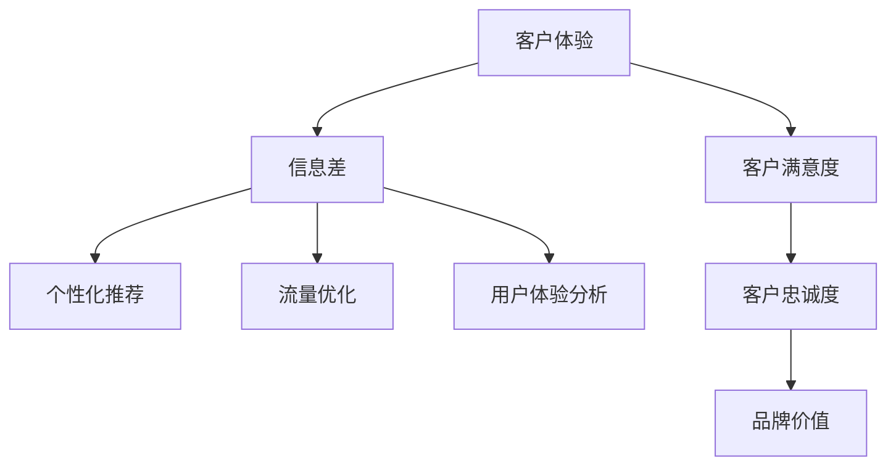

                 

# 信息差的客户体验升级：大数据如何打造卓越体验

> 关键词：客户体验,信息差,大数据,个性化推荐,流量优化,用户体验分析

## 1. 背景介绍

### 1.1 问题由来
在数字化时代，客户体验（Customer Experience，简称CX）已经成为决定企业竞争力的关键因素之一。然而，由于信息差的普遍存在，客户在获取信息和选择产品或服务时面临着很大的不确定性和风险。信息的透明度、准确性和全面性直接影响着客户的决策和满意度。

传统的客户体验提升方法主要依赖于人工调研、问卷调查和经验积累，这些方法的成本高、周期长，且无法实时响应客户需求的变化。随着大数据和人工智能技术的兴起，通过收集和分析客户行为数据，可以有效识别信息差，为客户提供更准确、及时、个性化的信息，从而显著提升客户体验。

### 1.2 问题核心关键点
信息差（Information Gap）指的是客户在获取信息时存在的不确定性和差距，包括产品信息不全、价格透明度低、竞争对手信息不明等。这些问题导致客户决策时面临高成本、低效率和低满意度。大数据技术通过实时收集和分析客户行为数据，可以精确识别信息差，并通过个性化推荐、流量优化、用户体验分析等手段，有效缩小信息差，提升客户满意度。

## 2. 核心概念与联系

### 2.1 核心概念概述

为了更好地理解大数据在客户体验提升中的应用，本节将介绍几个关键概念：

- **客户体验（CX）**：指客户与企业或品牌互动过程中，从接触、购买到使用产品或服务的全过程体验。良好的客户体验能够提升客户忠诚度和品牌价值。

- **信息差（Information Gap）**：客户在获取信息时面临的不确定性和差距，包括但不限于产品信息不全、价格透明度低、竞争对手信息不明等。

- **个性化推荐（Personalized Recommendation）**：基于客户历史行为数据和偏好，提供定制化的产品或服务推荐，提升客户体验和满意度。

- **流量优化（Traffic Optimization）**：通过数据分析和算法优化，提高网站或应用的访问效率和转化率，提升用户体验。

- **用户体验分析（User Experience Analytics）**：利用数据分析工具，评估和优化产品或服务的用户体验，发现潜在问题和改进机会。

这些概念之间的逻辑关系可以通过以下Mermaid流程图来展示：



这个流程图展示了大数据在客户体验提升中的核心作用，通过识别信息差，可以采取个性化推荐、流量优化、用户体验分析等手段，最终提升客户满意度和品牌价值。

## 3. 核心算法原理 & 具体操作步骤
### 3.1 算法原理概述

大数据在客户体验提升中的应用主要基于以下原理：

1. **数据收集与清洗**：通过各种渠道收集客户行为数据，包括点击流数据、搜索记录、购买记录等，并对数据进行清洗和预处理。

2. **数据存储与管理**：利用分布式数据库和数据湖技术，存储和管理大规模客户行为数据。

3. **数据分析与建模**：运用机器学习、数据挖掘等算法，对客户行为数据进行分析和建模，识别信息差和客户需求。

4. **个性化推荐**：基于客户行为数据和偏好，生成个性化推荐结果，提升客户满意度。

5. **流量优化**：通过分析访问路径、页面停留时间等数据，优化网站或应用的流量和布局，提高转化率。

6. **用户体验分析**：利用用户行为数据分析工具，评估用户体验，发现潜在问题和改进机会。

### 3.2 算法步骤详解

以下是大数据在客户体验提升中常用的操作步骤：

**Step 1: 数据收集与清洗**
- 通过网站、应用、社交媒体、客户反馈等多种渠道收集客户行为数据。
- 数据清洗和预处理，包括去除重复数据、处理缺失值、数据归一化等。

**Step 2: 数据存储与管理**
- 使用分布式数据库如Hadoop、Spark等，存储和管理大规模客户行为数据。
- 利用数据湖技术，构建统一的数据存储和访问平台。

**Step 3: 数据分析与建模**
- 使用机器学习算法如协同过滤、深度学习等，对客户行为数据进行分析建模。
- 利用聚类、分类、关联规则挖掘等方法，识别客户偏好和信息差。

**Step 4: 个性化推荐**
- 基于客户行为数据和偏好，生成个性化推荐结果。
- 可以使用协同过滤、基于内容的推荐、混合推荐等技术。

**Step 5: 流量优化**
- 分析访问路径、页面停留时间等数据，优化网站或应用的流量和布局。
- 使用A/B测试等方法，评估不同布局对转化率的影响。

**Step 6: 用户体验分析**
- 利用用户行为数据分析工具，评估用户体验。
- 使用热图、点击流分析等工具，发现潜在问题和改进机会。

### 3.3 算法优缺点

大数据在客户体验提升中的应用具有以下优点：

- **实时响应**：大数据分析可以实时识别客户需求，快速调整策略，提高响应速度。
- **精准推荐**：基于客户行为数据和偏好，生成精准的个性化推荐，提升客户满意度。
- **成本低廉**：相比于传统的调研和问卷调查，大数据分析成本低、周期短，更具经济效益。
- **动态优化**：通过持续的数据分析和模型优化，可以动态调整策略，适应市场变化。

同时，该方法也存在一些缺点：

- **隐私问题**：大规模数据收集和存储可能涉及用户隐私问题，需要严格遵守数据保护法规。
- **数据质量**：数据收集和清洗过程中，如果存在数据噪声和错误，会影响分析结果的准确性。
- **计算复杂**：大数据分析涉及复杂的计算和算法，需要高性能计算资源。
- **模型解释性**：复杂的机器学习模型缺乏可解释性，难以理解其决策过程。

尽管存在这些缺点，但大数据在客户体验提升中的应用仍然是当前最为有效的方法之一，通过持续的优化和技术进步，可以进一步提升其应用效果。

### 3.4 算法应用领域

大数据在客户体验提升中的应用已经覆盖了多个领域，包括但不限于：

- **电商零售**：通过个性化推荐和流量优化，提升用户购买转化率，提高客户满意度。
- **金融服务**：利用数据分析工具，评估客户风险和需求，提供定制化的金融产品和服务。
- **旅游业**：通过分析客户行为数据，推荐个性化旅游方案，提升客户体验。
- **医疗健康**：利用用户行为数据分析，提供个性化的健康建议和医疗服务，提高客户满意度。
- **媒体娱乐**：基于用户兴趣和行为数据，推荐个性化的内容，提升用户粘性。

除了这些传统领域，大数据在客户体验提升中的应用还在不断扩展，未来将在更多行业领域发挥重要作用。

## 4. 数学模型和公式 & 详细讲解 & 举例说明

### 4.1 数学模型构建

为了更好地理解大数据在客户体验提升中的应用，本节将使用数学语言对关键算法进行更加严格的刻画。

假设客户行为数据集为 $D=\{x_i,y_i\}_{i=1}^N$，其中 $x_i$ 表示客户行为数据（如点击流、搜索记录等），$y_i$ 表示客户满意度评分。目标是利用这些数据，训练一个推荐模型 $f(x)$，使得模型输出的推荐结果 $f(x)$ 与客户满意度 $y_i$ 尽可能接近。

定义模型的损失函数为均方误差（Mean Squared Error，MSE）：

$$
\mathcal{L}(f) = \frac{1}{N} \sum_{i=1}^N (y_i - f(x_i))^2
$$

优化目标是最小化损失函数 $\mathcal{L}(f)$，即：

$$
\hat{f} = \mathop{\arg\min}_{f} \mathcal{L}(f)
$$

### 4.2 公式推导过程

以下我们以协同过滤算法为例，推导其具体实现过程。

协同过滤算法基于用户行为数据，通过计算用户和物品之间的相似度，推荐用户可能感兴趣的物品。设 $u$ 为用户集合，$v$ 为物品集合，$x_{uv}$ 表示用户 $u$ 对物品 $v$ 的评分，则协同过滤模型的损失函数可以表示为：

$$
\mathcal{L}(\theta) = \frac{1}{N} \sum_{u,v} (x_{uv} - \theta_u^T\theta_v)^2
$$

其中 $\theta_u$ 和 $\theta_v$ 分别表示用户 $u$ 和物品 $v$ 的特征向量。通过梯度下降等优化算法，可以求解 $\theta$，得到推荐模型。

### 4.3 案例分析与讲解

以亚马逊个性化推荐系统为例，分析其实现原理和效果。

亚马逊通过分析用户的点击流、购买记录等行为数据，生成个性化推荐结果。具体步骤如下：

1. 数据收集与预处理：收集用户点击、浏览、购买等行为数据，并进行清洗和预处理。

2. 特征工程：提取用户和物品的特征向量，如用户兴趣、物品属性、用户历史评分等。

3. 协同过滤建模：利用协同过滤算法，计算用户和物品之间的相似度，生成个性化推荐结果。

4. 结果评估：在测试集上评估推荐模型的性能，使用准确率、召回率、F1值等指标衡量推荐效果。

亚马逊的个性化推荐系统通过不断迭代和优化，显著提升了用户购物体验和满意度，成为电商领域的标杆。

## 5. 项目实践：代码实例和详细解释说明
### 5.1 开发环境搭建

在进行大数据客户体验提升的实践前，我们需要准备好开发环境。以下是使用Python进行Apache Spark开发的环境配置流程：

1. 安装Apache Spark：从官网下载并安装Spark，支持多种编程语言，如Python、Java、Scala等。

2. 配置环境变量：设置Spark的运行路径、JAVA_HOME等环境变量。

3. 配置Spark UI：在Web UI界面查看Spark作业执行状态和性能指标。

4. 安装依赖库：安装Spark常用的第三方库，如MLlib、GraphX等。

5. 搭建开发环境：在开发环境中搭建Spark环境，方便实时开发和测试。

完成上述步骤后，即可在Spark环境中开始实践。

### 5.2 源代码详细实现

下面我们以个性化推荐系统为例，给出使用Apache Spark进行大数据分析和建模的Python代码实现。

```python
from pyspark.sql import SparkSession
from pyspark.ml.feature import PCA, OneHotEncoder
from pyspark.ml.classification import LogisticRegression
from pyspark.ml.evaluation import BinaryClassificationEvaluator

# 创建SparkSession
spark = SparkSession.builder.appName("customer_experience_analysis").getOrCreate()

# 加载数据
data = spark.read.csv("customer_data.csv", header=True, inferSchema=True)

# 数据预处理
data = data.dropna().dropDuplicates()
data = data.withColumn("label", data['label'].cast('double'))

# 特征工程
encoder = OneHotEncoder(inputCols=['feature1', 'feature2'], outputCols=['feature1_enc', 'feature2_enc'])
data = encoder.transform(data)

# 降维处理
pca = PCA(k=10, inputCol="features", outputCol="pca_features")
data = pca.transform(data)

# 模型训练
lr = LogisticRegression(featuresCol="features", labelCol="label")
model = lr.fit(data)

# 结果评估
evaluator = BinaryClassificationEvaluator(rawPredictionCol="prediction", labelCol="label", metricName="auc")
auc = evaluator.evaluate(model.transform(data))
print("AUC:", auc)
```

以上就是使用Apache Spark进行大数据分析和建模的完整代码实现。可以看到，利用Spark的分布式计算能力，可以高效地处理大规模数据，实现复杂的数据分析和建模任务。

### 5.3 代码解读与分析

让我们再详细解读一下关键代码的实现细节：

**SparkSession创建**：
- 通过创建SparkSession，可以使用Spark的API进行数据处理和机器学习建模。

**数据加载与预处理**：
- 使用Spark的DataFrame API，从本地文件或分布式文件系统中加载数据。
- 通过dropna和dropDuplicates方法，删除缺失和重复数据。
- 使用cast方法将标签转换为double类型，方便后续建模。

**特征工程**：
- 使用OneHotEncoder方法，将类别型特征转换为数值型特征，方便机器学习模型处理。
- 使用PCA方法进行降维处理，减小特征维度，提升模型训练效率。

**模型训练与评估**：
- 使用LogisticRegression模型，训练客户满意度的二分类模型。
- 使用BinaryClassificationEvaluator方法，评估模型的AUC指标，衡量模型的预测效果。

## 6. 实际应用场景

### 6.1 智能客服系统

基于大数据的客户体验优化，智能客服系统可以显著提升客户满意度。传统客服往往依赖于人工处理，响应时间长、效率低、成本高。通过大数据分析，智能客服系统可以实时识别客户需求，自动生成应答，显著缩短响应时间，提升客户满意度。

具体实现步骤如下：

1. 收集客户来电、在线聊天等历史数据，提取语义、情感等信息。
2. 使用自然语言处理（NLP）技术，对客户问题进行分类和意图识别。
3. 利用机器学习算法，训练个性化应答模型，自动生成应答结果。
4. 在测试集上评估模型性能，优化模型参数。
5. 将模型部署到生产环境，实时响应用户需求。

智能客服系统的应用场景包括银行、保险、电商等多个行业，通过提升客户满意度，提高企业竞争力和客户忠诚度。

### 6.2 个性化推荐系统

大数据在电商、金融、旅游等多个领域的应用，已经证明了个性化推荐系统在提升客户体验方面的巨大潜力。通过分析客户行为数据，生成个性化的商品、金融产品、旅游方案推荐，显著提升客户满意度和转化率。

具体实现步骤如下：

1. 收集客户点击流、购买记录、搜索记录等行为数据。
2. 使用协同过滤、基于内容的推荐、混合推荐等算法，生成个性化推荐结果。
3. 在测试集上评估推荐模型效果，优化模型参数。
4. 将模型部署到网站或应用，实时推荐个性化商品和服务。
5. 持续收集用户反馈，优化推荐模型。

个性化推荐系统的应用场景包括亚马逊、阿里巴巴、携程等平台，通过提升客户满意度，提高企业收益和市场竞争力。

### 6.3 用户行为分析系统

通过大数据分析，可以深入理解用户行为和需求，发现潜在问题和改进机会，从而提升客户体验。用户行为分析系统可以实时监控网站或应用的用户行为，分析用户点击路径、停留时间、转化率等指标，发现潜在问题。

具体实现步骤如下：

1. 收集用户点击流、停留时间、转化率等行为数据。
2. 使用数据可视化工具，如热图、点击流分析等，分析用户行为。
3. 发现潜在问题和改进机会，优化网站或应用的用户体验。
4. 定期评估用户行为分析系统效果，优化分析方法和指标。

用户行为分析系统的应用场景包括电商网站、金融平台、媒体应用等，通过优化用户体验，提高客户满意度和留存率。

### 6.4 未来应用展望

随着大数据和人工智能技术的不断发展，客户体验优化将迎来更加广阔的应用前景。未来，大数据在客户体验优化中的应用将更加广泛，涵盖更多行业和领域。

- **智能医疗**：通过分析患者健康数据，生成个性化诊疗方案，提升医疗服务质量和效率。
- **智能制造**：利用数据分析工具，优化生产流程和设备维护，提升客户满意度。
- **智慧城市**：通过分析城市公共数据，优化城市管理和服务，提升居民生活质量。
- **智能交通**：利用数据分析工具，优化交通流量和路况，提升出行体验。

大数据在客户体验优化中的应用将不断深化和拓展，未来将在更多行业和领域发挥重要作用。

## 7. 工具和资源推荐
### 7.1 学习资源推荐

为了帮助开发者系统掌握大数据在客户体验提升中的应用，这里推荐一些优质的学习资源：

1. **Apache Spark官方文档**：Spark的官方文档，提供详细的API说明和示例代码，是学习Spark的必备资料。
2. **《大数据分析与机器学习》书籍**：全面介绍大数据分析、机器学习、数据可视化等技术，适合初学者和进阶开发者。
3. **Coursera《机器学习》课程**：由斯坦福大学开设的机器学习课程，涵盖机器学习算法和工具，适合理解大数据分析的原理和实现。
4. **Kaggle数据科学竞赛平台**：提供大量真实业务数据集，帮助开发者实践数据处理、建模和评估。
5. **NLP实验室**：提供基于Spark的大规模NLP工具，方便进行自然语言处理和客户行为分析。

通过对这些资源的学习实践，相信你一定能够快速掌握大数据在客户体验提升中的应用，并用于解决实际的业务问题。

### 7.2 开发工具推荐

高效的开发离不开优秀的工具支持。以下是几款用于大数据客户体验优化开发的常用工具：

1. **Apache Spark**：基于分布式计算的大数据处理引擎，支持大规模数据处理和机器学习建模。
2. **Hadoop**：开源分布式存储和计算平台，适合大规模数据存储和处理。
3. **Pyspark**：Spark的Python API，提供便捷的数据处理和机器学习接口。
4. **PySparkMLlib**：Spark的机器学习库，支持多种机器学习算法和模型。
5. **NLP工具包**：如NLTK、SpaCy等，提供自然语言处理和客户行为分析的工具。

合理利用这些工具，可以显著提升大数据客户体验优化的开发效率，加快创新迭代的步伐。

### 7.3 相关论文推荐

大数据在客户体验优化领域的发展源于学界的持续研究。以下是几篇奠基性的相关论文，推荐阅读：

1. **《Web Scale Machine Learning》论文**：提出基于Spark的大规模机器学习算法，为大数据分析提供新的思路。
2. **《A Survey on Recommender Systems Based on Collaborative Filtering》论文**：全面介绍协同过滤算法的原理和应用，适合理解个性化推荐系统的实现。
3. **《Customer Experience Management: Trends and Future Directions》论文**：分析客户体验管理的趋势和未来方向，适合理解客户体验优化的重要性和应用场景。
4. **《Big Data Analytics in Customer Experience Management》论文**：探讨大数据在客户体验管理中的应用，适合理解大数据在客户体验优化中的实际应用。
5. **《Deep Learning for Customer Experience》论文**：探讨深度学习在客户体验管理中的应用，适合理解深度学习技术在客户体验优化中的优势。

这些论文代表了大数据在客户体验优化领域的发展脉络。通过学习这些前沿成果，可以帮助研究者把握学科前进方向，激发更多的创新灵感。

## 8. 总结：未来发展趋势与挑战

### 8.1 研究成果总结

本文对大数据在客户体验优化中的应用进行了全面系统的介绍。首先阐述了大数据在客户体验提升中的重要性和应用价值，明确了信息差在大数据应用中的核心地位。其次，从原理到实践，详细讲解了大数据分析、个性化推荐、流量优化等关键技术，给出了具体实现步骤。同时，本文还广泛探讨了大数据技术在智能客服、个性化推荐、用户行为分析等多个行业领域的应用前景，展示了大数据在客户体验优化中的巨大潜力。

通过本文的系统梳理，可以看到，大数据在客户体验优化中的核心作用是通过实时识别和分析客户行为数据，快速响应客户需求，提升客户体验。未来，伴随大数据和人工智能技术的持续进步，大数据在客户体验优化中的应用将更加广泛和深入，为各行各业带来新的发展机遇。

### 8.2 未来发展趋势

展望未来，大数据在客户体验优化中的应用将呈现以下几个发展趋势：

1. **实时化**：大数据分析将实现实时处理，快速响应客户需求，提升用户体验。
2. **智能化**：通过引入AI技术，实现更精准、个性化的推荐和服务。
3. **全面化**：覆盖更多行业和领域，提升各行业的客户体验。
4. **人性化**：通过自然语言处理和情感分析，提升客户服务的个性化和人性化。
5. **安全化**：确保大数据应用中的数据安全和个人隐私保护，建立信任基础。

这些趋势凸显了大数据在客户体验优化中的广阔前景。未来的研究和应用将进一步提升其效率和效果，推动客户体验的全面提升。

### 8.3 面临的挑战

尽管大数据在客户体验优化中的应用已经取得了显著成效，但在迈向更加智能化、普适化应用的过程中，仍面临一些挑战：

1. **数据隐私和安全**：大数据分析涉及大量客户数据，需要严格遵守数据保护法规，确保数据隐私和安全。
2. **数据质量**：数据收集和清洗过程中，如果存在数据噪声和错误，会影响分析结果的准确性。
3. **计算资源**：大数据分析涉及复杂的计算和算法，需要高性能计算资源。
4. **模型解释性**：复杂的机器学习模型缺乏可解释性，难以理解其决策过程。
5. **技术壁垒**：大数据分析需要综合运用多种技术和工具，对开发者提出了较高的技术要求。

尽管存在这些挑战，但大数据在客户体验优化中的应用前景广阔，通过持续的优化和技术进步，可以进一步提升其应用效果。

### 8.4 研究展望

面对大数据在客户体验优化中所面临的挑战，未来的研究需要在以下几个方面寻求新的突破：

1. **提升数据质量**：通过数据清洗和预处理技术，提高数据质量和准确性。
2. **优化计算资源**：利用云计算和大数据技术，提高计算效率和资源利用率。
3. **增强模型解释性**：通过模型可解释性技术，增强模型的决策透明度和可信度。
4. **拓展应用场景**：将大数据分析应用于更多行业和领域，提升各行业的客户体验。
5. **强化安全保障**：建立完善的数据隐私和安全保护机制，确保客户数据的安全。

这些研究方向的探索，必将引领大数据在客户体验优化中的技术进步，为构建更加智能、高效、安全的客户体验系统提供新的动力。

## 9. 附录：常见问题与解答

**Q1：大数据分析在客户体验提升中的核心关键点是什么？**

A: 大数据分析在客户体验提升中的核心关键点是识别信息差。通过分析客户行为数据，识别产品信息不全、价格透明度低、竞争对手信息不明等信息差，从而提升客户体验。

**Q2：大数据分析在客户体验优化中的应用步骤是什么？**

A: 大数据分析在客户体验优化中的应用主要包括以下步骤：
1. 数据收集与清洗：收集客户行为数据，并进行清洗和预处理。
2. 数据存储与管理：使用分布式数据库和数据湖技术，存储和管理大规模客户行为数据。
3. 数据分析与建模：利用机器学习、数据挖掘等算法，对客户行为数据进行分析和建模。
4. 个性化推荐：基于客户行为数据和偏好，生成个性化推荐结果。
5. 流量优化：通过分析访问路径、页面停留时间等数据，优化网站或应用的流量和布局。
6. 用户体验分析：利用用户行为数据分析工具，评估用户体验，发现潜在问题和改进机会。

**Q3：大数据分析在客户体验优化中的优缺点是什么？**

A: 大数据分析在客户体验优化中的优点包括：
1. 实时响应：大数据分析可以实时识别客户需求，快速调整策略，提高响应速度。
2. 精准推荐：基于客户行为数据和偏好，生成精准的个性化推荐，提升客户满意度。
3. 成本低廉：相比于传统的调研和问卷调查，大数据分析成本低、周期短，更具经济效益。
4. 动态优化：通过持续的数据分析和模型优化，可以动态调整策略，适应市场变化。

大数据分析在客户体验优化中的缺点包括：
1. 隐私问题：大规模数据收集和存储可能涉及用户隐私问题，需要严格遵守数据保护法规。
2. 数据质量：数据收集和清洗过程中，如果存在数据噪声和错误，会影响分析结果的准确性。
3. 计算复杂：大数据分析涉及复杂的计算和算法，需要高性能计算资源。
4. 模型解释性：复杂的机器学习模型缺乏可解释性，难以理解其决策过程。

**Q4：大数据分析在客户体验优化中的应用场景是什么？**

A: 大数据分析在客户体验优化中的应用场景包括：
1. 智能客服系统：通过大数据分析，实时识别客户需求，自动生成应答，提升客户满意度。
2. 个性化推荐系统：通过分析客户行为数据，生成个性化的商品、金融产品、旅游方案推荐，提升客户满意度和转化率。
3. 用户行为分析系统：通过大数据分析，实时监控网站或应用的用户行为，分析用户点击路径、停留时间、转化率等指标，发现潜在问题和改进机会。
4. 智能医疗：通过分析患者健康数据，生成个性化诊疗方案，提升医疗服务质量和效率。
5. 智能制造：利用数据分析工具，优化生产流程和设备维护，提升客户满意度。
6. 智慧城市：通过分析城市公共数据，优化城市管理和服务，提升居民生活质量。
7. 智能交通：利用数据分析工具，优化交通流量和路况，提升出行体验。

**Q5：大数据分析在客户体验优化中需要注意哪些问题？**

A: 大数据分析在客户体验优化中需要注意以下问题：
1. 数据隐私和安全：大数据分析涉及大量客户数据，需要严格遵守数据保护法规，确保数据隐私和安全。
2. 数据质量：数据收集和清洗过程中，如果存在数据噪声和错误，会影响分析结果的准确性。
3. 计算资源：大数据分析涉及复杂的计算和算法，需要高性能计算资源。
4. 模型解释性：复杂的机器学习模型缺乏可解释性，难以理解其决策过程。
5. 技术壁垒：大数据分析需要综合运用多种技术和工具，对开发者提出了较高的技术要求。

通过全面理解大数据在客户体验优化中的应用，可以在实际业务中更好地利用大数据技术，提升客户体验，实现企业价值的最大化。

---

作者：禅与计算机程序设计艺术 / Zen and the Art of Computer Programming

