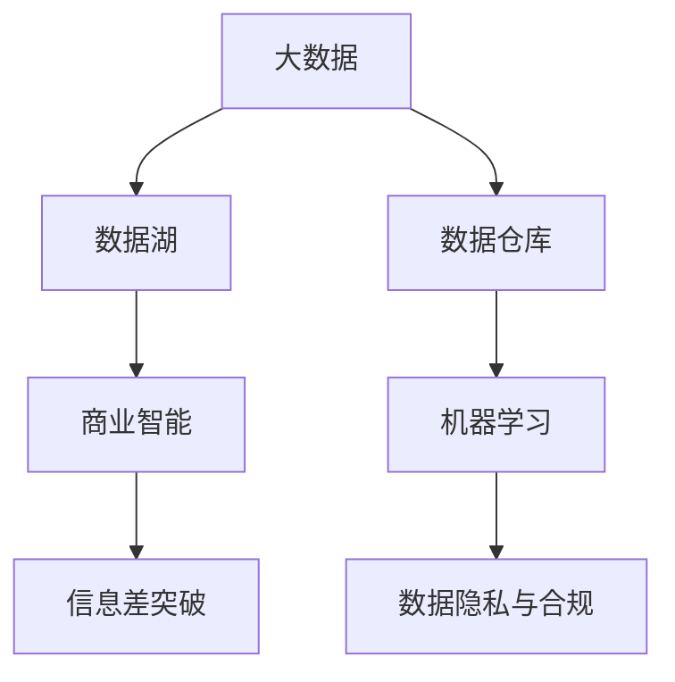

                 

## 1. 背景介绍

### 1.1 问题由来

信息差（Information Gap）是指在市场中存在的未知或不对称信息，企业或个体在获取信息上存在差异。这些差异可以导致价格差异、效率差异，甚至市场机会的差异。在进入新市场时，由于信息差的存在，企业往往面临着较高的进入壁垒。大数据技术的迅速发展为突破信息差提供了新的手段。

### 1.2 问题核心关键点

当前市场信息差的形成主要包括以下几个因素：

1. **数据稀缺**：某些特定行业或细分市场的数据难以获取，导致决策者缺乏充分的信息支持。
2. **数据质量问题**：即使数据获取成本低，但数据质量和一致性差，影响决策准确性。
3. **处理难度大**：部分行业的数据量大、结构复杂，普通企业难以进行有效处理和分析。
4. **隐私和安全**：在数据收集和处理过程中，如何保护用户隐私和数据安全成为一大难题。

基于以上问题，利用大数据技术突破信息差，对于企业突破市场进入壁垒具有重要的战略意义。

### 1.3 问题研究意义

1. **优化决策过程**：大数据能够帮助企业基于更全面、准确的信息进行决策，提高决策的科学性和准确性。
2. **提升市场竞争力**：通过大数据分析，企业可以发现未被充分利用的市场机会，提升市场竞争力。
3. **降低进入成本**：大数据技术能够快速分析大量市场信息，降低企业进入新市场的调查和评估成本。
4. **增强风险控制能力**：通过数据分析，企业能够更好地预测市场变化，提前采取措施，降低风险。

## 2. 核心概念与联系

### 2.1 核心概念概述

为更好理解大数据突破信息差的方法，本节将介绍几个关键概念：

1. **大数据（Big Data）**：大规模、多样化、高速率和真实性的数据集合，用于分析和洞察。
2. **信息差（Information Gap）**：市场参与者之间在信息获取、处理和利用上的差异。
3. **数据湖（Data Lake）**：存储和处理大数据的平台，用于集中管理和分析。
4. **数据仓库（Data Warehouse）**：集中存储和管理结构化数据的平台，用于支持BI（商业智能）。
5. **机器学习（Machine Learning）**：利用算法和模型对大数据进行分析，发现规律和趋势。
6. **数据隐私与合规**：保护用户数据隐私和合规使用数据的法规要求。
7. **商业智能（Business Intelligence）**：利用数据和技术支持企业决策，提高运营效率和盈利能力。

这些概念之间的联系可以通过以下Mermaid流程图展示：



这个流程图展示了大数据与信息差突破的逻辑关系：

1. 大数据通过数据湖集中存储和管理，进入数据仓库进行结构化处理。
2. 机器学习对数据仓库中的数据进行分析，提取有价值的信息。
3. 商业智能将分析结果应用于决策支持，帮助企业突破信息差。
4. 数据隐私与合规要求贯穿整个流程，保护用户数据安全。

## 3. 核心算法原理 & 具体操作步骤
### 3.1 算法原理概述

大数据突破信息差的核心原理是通过数据分析和机器学习，发现并利用市场中的信息差，降低决策风险，提升市场竞争力。该过程可以分为数据收集、数据清洗、数据分析、结果应用和隐私保护五个步骤。

### 3.2 算法步骤详解

**Step 1: 数据收集与处理**

1. **数据源识别**：识别和评估潜在的数据源，包括公开数据集、社交媒体、传感器数据等。
2. **数据采集**：使用API、爬虫等方式收集数据，确保数据来源可靠。
3. **数据清洗**：清洗无效、重复和错误数据，确保数据质量。
4. **数据存储与管理**：将清洗后的数据存储到数据湖中，进行集中管理和索引。

**Step 2: 数据预处理与分析**

1. **数据预处理**：对数据进行格式化、转换和归一化处理，确保分析的一致性。
2. **特征工程**：提取、选择和构建特征，优化模型性能。
3. **模型选择与训练**：选择合适的算法和模型，使用历史数据进行训练。
4. **结果验证与调优**：通过交叉验证等方法验证模型性能，调整模型参数。

**Step 3: 商业智能应用**

1. **决策支持系统**：将分析结果集成到决策支持系统中，支持企业决策。
2. **实时监控与预警**：建立实时监控系统，及时发现市场变化，提供预警信息。
3. **风险评估与管理**：利用分析结果进行风险评估，制定应对策略。

**Step 4: 数据隐私保护**

1. **数据匿名化**：对敏感数据进行匿名化处理，保护用户隐私。
2. **访问控制**：设置数据访问权限，限制非授权访问。
3. **合规检查**：定期检查数据使用是否符合相关法规，确保合规使用。

### 3.3 算法优缺点

大数据突破信息差的方法具有以下优点：

1. **数据驱动决策**：基于全面、准确的数据进行决策，降低主观判断误差。
2. **提升市场效率**：通过分析发现未被充分利用的市场机会，提升市场效率。
3. **降低进入成本**：利用数据分析降低调查和评估成本，快速进入新市场。
4. **增强竞争优势**：通过信息差分析，提升市场竞争力，获取更高的市场份额。

但该方法也存在以下局限：

1. **数据获取难度大**：部分行业数据难以获取，限制了大数据分析的应用。
2. **数据质量问题**：数据质量差、不一致，影响分析结果的可靠性。
3. **技术门槛高**：需要高水平的数据科学家和技术团队，普通企业难以实现。
4. **隐私风险高**：数据隐私和安全问题，导致企业难以获取和利用数据。

### 3.4 算法应用领域

大数据突破信息差的方法在多个领域得到了广泛应用，例如：

1. **金融行业**：利用大数据分析发现未被充分利用的投资机会，提升投资回报率。
2. **电子商务**：通过分析用户行为数据，优化推荐算法，提升用户体验和销售额。
3. **医疗健康**：利用大数据分析患者健康数据，提供个性化的医疗建议，提升治疗效果。
4. **物流行业**：通过分析运输数据，优化物流路径和资源配置，降低运营成本。
5. **零售行业**：利用大数据分析销售数据和客户行为，优化库存管理和营销策略。
6. **能源行业**：利用大数据分析能源数据，优化能源使用，提升能源效率。

## 4. 数学模型和公式 & 详细讲解  
### 4.1 数学模型构建

本节将使用数学语言对大数据突破信息差的方法进行严格的刻画。

设大数据集合为 $\mathcal{D} = \{(x_i, y_i)\}_{i=1}^N$，其中 $x_i$ 为输入特征，$y_i$ 为标签。定义目标函数为：

$$
f(x_i) = \arg\min_{x_i} \| x_i - \mu \|^2
$$

其中 $\mu$ 为数据均值，$\| \cdot \|^2$ 为欧式距离。目标函数的目标是找到最优的特征 $x_i$，使得特征与均值的距离最小。

### 4.2 公式推导过程

通过目标函数，可以推导出特征选择的过程：

1. 对大数据进行标准化处理，得到特征矩阵 $\mathcal{X} \in \mathbb{R}^{N \times D}$，其中 $D$ 为特征维度。
2. 计算特征矩阵的协方差矩阵 $\mathcal{C} = \frac{1}{N} \mathcal{X} \mathcal{X}^T$。
3. 求解特征矩阵的特征值和特征向量，得到特征值向量 $\mathcal{V} = [v_1, v_2, ..., v_D]$，其中 $v_i$ 为第 $i$ 个特征向量。
4. 选择与目标函数相关性高的特征向量 $\mathcal{V}_{\text{selected}}$，用于后续的模型训练和分析。

### 4.3 案例分析与讲解

以金融行业为例，利用大数据突破信息差的方法步骤如下：

1. **数据收集**：从股票交易平台、新闻媒体、社交网络等渠道收集股票交易数据、新闻报道、用户评论等。
2. **数据预处理**：清洗无效数据，去除重复和错误信息，转换数据格式，确保数据一致性。
3. **特征工程**：提取技术指标、市场情绪、宏观经济指标等特征，构建特征向量。
4. **模型训练**：选择回归、分类等算法，使用历史数据训练模型，得到预测结果。
5. **结果验证**：通过回测等方法验证模型性能，调整模型参数。
6. **实时监控**：将模型集成到实时监控系统中，实时监测市场变化，提供预警信息。
7. **隐私保护**：对敏感数据进行匿名化处理，设置数据访问权限，确保合规使用。

## 5. 项目实践：代码实例和详细解释说明
### 5.1 开发环境搭建

在进行大数据突破信息差实践前，我们需要准备好开发环境。以下是使用Python进行PyTorch开发的环境配置流程：

1. 安装Anaconda：从官网下载并安装Anaconda，用于创建独立的Python环境。

2. 创建并激活虚拟环境：
```bash
conda create -n bigdata-env python=3.8 
conda activate bigdata-env
```

3. 安装PyTorch：根据CUDA版本，从官网获取对应的安装命令。例如：
```bash
conda install pytorch torchvision torchaudio cudatoolkit=11.1 -c pytorch -c conda-forge
```

4. 安装相关库：
```bash
pip install pandas numpy scikit-learn transformers torchmetrics 
```

完成上述步骤后，即可在`bigdata-env`环境中开始大数据突破信息差实践。

### 5.2 源代码详细实现

下面我们以金融行业为例，给出使用PyTorch进行大数据突破信息差分析的代码实现。

```python
import pandas as pd
import numpy as np
import torch
import torch.nn as nn
from sklearn.preprocessing import StandardScaler
from sklearn.decomposition import PCA
from torchmetrics import MeanSquaredError

class DataLoader:
    def __init__(self, df, batch_size=32):
        self.df = df
        self.batch_size = batch_size
        self.num_samples = len(df)
        self.num_features = df.shape[1]
        self.scaler = StandardScaler()
        self.pca = PCA(n_components=2)
        self.data = self.scaler.fit_transform(df)
        self.data = self.pca.fit_transform(self.data)
        self.data = torch.tensor(self.data, dtype=torch.float32)
        self.labels = torch.tensor(df['label'], dtype=torch.long)
        self.data = self.data.reshape(-1, self.num_features)

    def __len__(self):
        return self.num_samples // self.batch_size

    def __getitem__(self, idx):
        x = self.data[idx * self.batch_size : (idx+1) * self.batch_size]
        y = self.labels[idx * self.batch_size : (idx+1) * self.batch_size]
        return x, y

class Model(nn.Module):
    def __init__(self):
        super(Model, self).__init__()
        self.fc1 = nn.Linear(2, 64)
        self.fc2 = nn.Linear(64, 1)
        self.mse = MeanSquaredError()

    def forward(self, x):
        x = torch.relu(self.fc1(x))
        x = self.fc2(x)
        return x

def train_model(model, train_loader, epochs=100, batch_size=32):
    device = torch.device('cuda' if torch.cuda.is_available() else 'cpu')
    model.to(device)
    criterion = nn.MSELoss()
    optimizer = torch.optim.Adam(model.parameters(), lr=0.01)
    train_losses = []
    val_losses = []
    for epoch in range(epochs):
        model.train()
        running_loss = 0.0
        for i, (inputs, labels) in enumerate(train_loader, 0):
            inputs, labels = inputs.to(device), labels.to(device)
            optimizer.zero_grad()
            outputs = model(inputs)
            loss = criterion(outputs, labels)
            loss.backward()
            optimizer.step()
            running_loss += loss.item()
        train_losses.append(running_loss / len(train_loader))
        print(f'Epoch {epoch+1} Train Loss: {running_loss / len(train_loader):.4f}')
        model.eval()
        running_loss = 0.0
        for inputs, labels in train_loader:
            inputs, labels = inputs.to(device), labels.to(device)
            outputs = model(inputs)
            loss = criterion(outputs, labels)
            running_loss += loss.item()
        val_losses.append(running_loss / len(train_loader))
        print(f'Epoch {epoch+1} Val Loss: {running_loss / len(train_loader):.4f}')
    return model, train_losses, val_losses
```

### 5.3 代码解读与分析

让我们再详细解读一下关键代码的实现细节：

**DataLoader类**：
- `__init__`方法：初始化数据集，进行标准化和降维处理，将数据和标签转换成张量形式。
- `__len__`方法：返回数据集长度。
- `__getitem__`方法：对单个批次数据进行加载和预处理。

**Model类**：
- `__init__`方法：定义模型结构，包括全连接层和均方误差损失函数。
- `forward`方法：实现前向传播，通过线性变换输出预测值。

**train_model函数**：
- `device`变量：判断是否使用GPU，并将模型移动到相应设备。
- `criterion`变量：定义损失函数。
- `optimizer`变量：定义优化器。
- `train_losses`和`val_losses`列表：记录训练集和验证集的损失变化。
- 循环遍历训练过程，每个epoch中前向传播和反向传播更新模型参数，并记录损失变化。

**训练流程**：
- 定义总epoch数和批次大小，开始循环迭代
- 每个epoch内，先在训练集上训练，输出平均loss
- 在验证集上评估，输出平均loss
- 重复上述步骤直至满足预设的迭代轮数或Early Stopping条件

可以看到，PyTorch配合相关库使得大数据突破信息差分析的代码实现变得简洁高效。开发者可以将更多精力放在数据处理、模型改进等高层逻辑上，而不必过多关注底层的实现细节。

当然，工业级的系统实现还需考虑更多因素，如模型保存和部署、超参数的自动搜索、更灵活的特征工程等。但核心的突破信息差范式基本与此类似。

## 6. 实际应用场景
### 6.1 智能客服系统

基于大数据突破信息差的方法，可以广泛应用于智能客服系统的构建。传统客服往往需要配备大量人力，高峰期响应缓慢，且一致性和专业性难以保证。利用大数据分析用户行为和需求，可以自动匹配最合适的客服方案，提升客户咨询体验。

在技术实现上，可以收集企业内部的历史客服对话记录，分析用户高频问题和偏好，构建特征向量，通过机器学习模型预测用户意图和需求，并匹配最合适的客服策略。利用实时监控系统，持续收集用户反馈，不断优化模型性能，逐步实现智能客服的全天候服务。

### 6.2 金融舆情监测

金融机构需要实时监测市场舆论动向，以便及时应对负面信息传播，规避金融风险。通过大数据分析社交媒体、新闻报道等公开信息，可以发现市场情绪变化趋势，及时预警风险事件。

具体而言，可以收集金融领域相关的新闻、报道、评论等文本数据，使用情感分析等技术，计算市场情绪得分，构建特征向量。通过机器学习模型，预测市场情绪变化，一旦发现情绪得分出现剧烈波动，系统便自动预警，帮助金融机构快速应对潜在风险。

### 6.3 个性化推荐系统

当前的推荐系统往往只依赖用户的历史行为数据进行物品推荐，无法深入理解用户的真实兴趣偏好。利用大数据分析用户浏览、点击、评论、分享等行为数据，可以发现用户的兴趣点和行为模式，提供个性化的推荐内容。

在实践中，可以收集用户行为数据，提取和用户交互的物品标题、描述、标签等文本内容。将文本内容作为模型输入，用户的后续行为（如是否点击、购买等）作为监督信号，在此基础上微调预训练语言模型。微调后的模型能够从文本内容中准确把握用户的兴趣点。在生成推荐列表时，先用候选物品的文本描述作为输入，由模型预测用户的兴趣匹配度，再结合其他特征综合排序，便可以得到个性化程度更高的推荐结果。

### 6.4 未来应用展望

随着大数据技术的发展和应用，未来大数据突破信息差方法将在更多领域得到应用，为各行各业带来变革性影响。

在智慧医疗领域，利用大数据分析患者健康数据，提供个性化的医疗建议，提升治疗效果。在智能教育领域，利用大数据分析学生学习行为和成绩，提供个性化的学习路径，提升教学质量。在智慧城市治理中，利用大数据分析城市事件监测、舆情分析、应急指挥等环节，提高城市管理的自动化和智能化水平，构建更安全、高效的未来城市。

此外，在企业生产、社会治理、文娱传媒等众多领域，大数据突破信息差的方法也将不断涌现，为经济社会发展注入新的动力。相信随着技术的日益成熟，大数据突破信息差方法将成为信息时代的重要手段，推动各行各业的数字化转型升级。

## 7. 工具和资源推荐
### 7.1 学习资源推荐

为了帮助开发者系统掌握大数据突破信息差的方法，这里推荐一些优质的学习资源：

1. **《大数据理论与实践》系列博文**：由大數據技术专家撰写，深入浅出地介绍了大数据的理论基础和应用实践。

2. **CS229《机器学习》课程**：斯坦福大学开设的机器学习课程，涵盖各类机器学习算法和模型，帮助理解大数据分析的算法原理。

3. **《大数据应用实战》书籍**：全面介绍了大数据技术和应用的方方面面，提供丰富的实践案例和代码实现。

4. **Kaggle平台**：全球最大的数据科学竞赛平台，提供大量数据集和实战项目，帮助开发者实践和提高。

5. **PyTorch官方文档**：提供PyTorch库的全面文档和示例代码，适合学习大数据分析的实现细节。

6. **Apache Spark官方文档**：提供Spark大数据处理平台的详细文档和API文档，帮助开发者进行大数据分析的实现。

通过对这些资源的学习实践，相信你一定能够快速掌握大数据突破信息差的方法，并用于解决实际的业务问题。

### 7.2 开发工具推荐

高效的开发离不开优秀的工具支持。以下是几款用于大数据分析和大数据突破信息差开发的常用工具：

1. **PyTorch**：基于Python的开源深度学习框架，灵活动态的计算图，适合快速迭代研究。

2. **TensorFlow**：由Google主导开发的开源深度学习框架，生产部署方便，适合大规模工程应用。

3. **Apache Spark**：由Apache基金会开发的分布式大数据处理框架，支持数据预处理、分布式计算和数据分析。

4. **Jupyter Notebook**：交互式的开发环境，支持代码编写、数据可视化和实时运行。

5. **Tableau**：数据可视化工具，支持复杂的数据分析和报表生成。

6. **ETL工具（如Talend、Alteryx）**：数据清洗和转换工具，支持批量数据处理和实时数据流处理。

合理利用这些工具，可以显著提升大数据分析和大数据突破信息差任务的开发效率，加快创新迭代的步伐。

### 7.3 相关论文推荐

大数据突破信息差技术的发展源于学界的持续研究。以下是几篇奠基性的相关论文，推荐阅读：

1. **《大数据与人工智能：智能时代的来临》**：总结了大数据与人工智能的结合，探讨了大数据在信息差突破中的应用。

2. **《大数据分析与机器学习：技术与应用》**：介绍了大数据技术和机器学习算法，探讨了如何利用大数据突破信息差。

3. **《大数据与商业智能：数据驱动决策》**：介绍了大数据与商业智能的结合，探讨了如何利用大数据进行商业决策。

4. **《信息差突破：大数据在金融市场的应用》**：探讨了大数据在金融市场信息差突破中的应用，提供了丰富的案例分析。

5. **《大数据与推荐系统：个性化推荐技术》**：介绍了大数据在推荐系统中的应用，探讨了如何利用大数据提升推荐效果。

这些论文代表了大数据突破信息差技术的发展脉络。通过学习这些前沿成果，可以帮助研究者把握学科前进方向，激发更多的创新灵感。

## 8. 总结：未来发展趋势与挑战
### 8.1 总结

本文对大数据突破信息差方法进行了全面系统的介绍。首先阐述了信息差的概念和大数据技术的崛起，明确了大数据技术在信息差突破中的重要战略意义。其次，从原理到实践，详细讲解了大数据突破信息差的方法步骤和关键技术点，给出了大数据突破信息差的完整代码实现。同时，本文还广泛探讨了大数据突破信息差方法在多个行业领域的应用前景，展示了大数据技术的广阔应用空间。此外，本文精选了大数据突破信息差技术的各类学习资源，力求为读者提供全方位的技术指引。

通过本文的系统梳理，可以看到，大数据突破信息差方法已经成为各行各业的重要手段，极大地提升了企业的市场竞争力。未来，伴随大数据技术和大数据突破信息差方法的持续演进，相信大数据技术将在更广阔的领域发挥更大的作用，为社会带来更多的价值。

### 8.2 未来发展趋势

展望未来，大数据突破信息差技术将呈现以下几个发展趋势：

1. **多模态数据融合**：大数据分析将从单一数据源扩展到多模态数据源，如文本、图像、语音等，提升数据综合利用能力。

2. **实时数据分析**：利用流式计算和实时分析技术，对数据进行实时处理和分析，提高决策速度和效率。

3. **联邦学习**：分布式环境下，利用联邦学习技术进行数据联合分析，保护数据隐私。

4. **自适应学习**：利用自适应学习算法，根据数据分布变化自动调整模型参数，保持模型性能。

5. **自动化特征工程**：利用自动化特征工程技术，自动提取和构建特征，提高特征选择和构建效率。

6. **跨领域应用**：大数据技术将从单一领域应用扩展到跨领域应用，如医疗、金融、零售等。

7. **智能决策支持**：结合人工智能和商业智能，实现智能决策支持，提升决策科学性。

这些趋势凸显了大数据突破信息差技术的广阔前景。这些方向的探索发展，必将进一步提升大数据分析的应用范围和效果，为各行各业带来更多的价值。

### 8.3 面临的挑战

尽管大数据突破信息差技术已经取得了瞩目成就，但在迈向更加智能化、普适化应用的过程中，它仍面临着诸多挑战：

1. **数据获取难度**：部分行业数据难以获取，限制了大数据分析的应用。

2. **数据质量问题**：数据质量差、不一致，影响分析结果的可靠性。

3. **技术门槛高**：需要高水平的数据科学家和技术团队，普通企业难以实现。

4. **隐私风险高**：数据隐私和安全问题，导致企业难以获取和利用数据。

5. **计算资源需求大**：大数据分析需要高性能计算资源，对算力、存储等基础设施要求高。

6. **模型解释性不足**：黑盒模型难以解释内部工作机制和决策逻辑，影响模型的可解释性和可信度。

7. **跨领域协作难度大**：不同领域的数据、模型、技术标准不同，跨领域协作难度大。

正视大数据突破信息差面临的这些挑战，积极应对并寻求突破，将是大数据突破信息差技术走向成熟的必由之路。相信随着学界和产业界的共同努力，这些挑战终将一一被克服，大数据突破信息差技术必将在构建智能社会中扮演越来越重要的角色。

### 8.4 研究展望

面对大数据突破信息差所面临的种种挑战，未来的研究需要在以下几个方面寻求新的突破：

1. **无监督学习与半监督学习**：摆脱对大规模标注数据的依赖，利用自监督学习、主动学习等方法，最大限度利用非结构化数据。

2. **参数高效与计算高效**：开发更加参数高效和计算高效的模型，提高模型性能和推理速度。

3. **多任务学习**：利用多任务学习技术，同时处理多个相关问题，提升模型泛化能力。

4. **模型可解释性**：结合符号化的先验知识，增强模型的可解释性和可理解性，提高模型的可信度。

5. **数据隐私保护**：利用差分隐私等技术，保护用户数据隐私，确保数据安全。

6. **联邦学习与隐私计算**：利用联邦学习技术，实现分布式环境下的数据联合分析，保护数据隐私。

7. **实时数据处理**：利用流式计算和实时分析技术，对数据进行实时处理和分析，提高决策速度和效率。

这些研究方向的探索，必将引领大数据突破信息差技术迈向更高的台阶，为构建安全、可靠、可解释、可控的智能系统铺平道路。面向未来，大数据突破信息差技术还需要与其他人工智能技术进行更深入的融合，如知识表示、因果推理、强化学习等，多路径协同发力，共同推动大数据技术的进步。只有勇于创新、敢于突破，才能不断拓展大数据技术的应用边界，让大数据技术更好地造福人类社会。

## 9. 附录：常见问题与解答

**Q1：大数据突破信息差是否适用于所有行业？**

A: 大数据突破信息差方法在大多数行业和领域都有广泛的应用，但在某些特定的领域，如医疗、法律等，需要更多专业知识和领域特色数据，可能会带来挑战。

**Q2：大数据突破信息差是否需要大规模数据？**

A: 大数据突破信息差方法不需要大规模数据，但需要足够的数据量来确保模型训练的有效性。对于小数据集，可以利用数据增强、迁移学习等技术提升模型性能。

**Q3：如何优化大数据突破信息差过程中的模型性能？**

A: 优化大数据突破信息差过程中的模型性能，需要从多个方面入手，包括特征工程、模型选择、超参数调优、模型集成等。通过不断试验和优化，逐步提升模型性能。

**Q4：大数据突破信息差在实时数据处理中有什么优势？**

A: 大数据突破信息差在实时数据处理中有以下几个优势：
1. 实时数据处理可以及时反映市场变化，帮助企业快速做出决策。
2. 实时数据处理可以提高模型的准确性，减少因数据延迟带来的误差。
3. 实时数据处理可以降低企业的成本，提高工作效率。

**Q5：如何在大数据突破信息差过程中保护用户隐私？**

A: 在大数据突破信息差过程中，保护用户隐私是至关重要的。以下是一些保护用户隐私的方法：
1. 数据匿名化：对敏感数据进行匿名化处理，保护用户身份信息。
2. 访问控制：设置数据访问权限，限制非授权访问。
3. 数据加密：对数据进行加密处理，防止数据泄露。
4. 差分隐私：利用差分隐私技术，保护数据隐私的同时，确保数据可用性。

通过以上措施，可以有效保护用户隐私，确保大数据突破信息差过程的合法合规性。

---

作者：禅与计算机程序设计艺术 / Zen and the Art of Computer Programming

