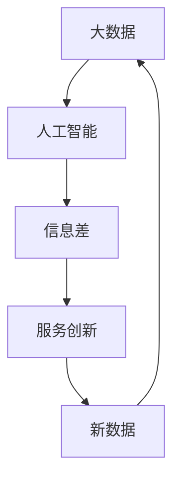

                 

# 信息差的服务创新引擎：大数据如何催生服务创新

> 关键词：信息差,大数据,服务创新,数据驱动,人工智能,深度学习

## 1. 背景介绍

### 1.1 问题由来

在信息爆炸的时代，企业如何获取和利用海量数据，构建信息差优势，成为了服务创新的关键。信息的获取、处理、应用已经渗透到了企业运营的各个环节。例如，电商平台的个性化推荐、金融风控中的风险评估、医疗行业中的疾病预测、物联网的实时监控等，均依赖于大数据和人工智能技术的支撑。

随着科技的发展，企业间的竞争日趋激烈，传统的单一功能服务已经难以满足市场需求。而信息差成为企业服务创新的重要手段，通过获取和分析海量数据，洞察用户需求，优化服务策略，提供精准且差异化的服务。

### 1.2 问题核心关键点

信息差服务创新主要涉及以下几个关键点：

- 数据获取：利用大数据技术，从海量数据中快速、高效地获取信息，特别是用户在互联网上的行为数据。
- 数据处理：采用数据清洗、特征工程、模型训练等手段，对原始数据进行处理，提取有价值的信息。
- 信息分析：运用深度学习、机器学习等先进算法，分析用户行为数据，识别用户需求、行为特征等。
- 服务优化：根据分析结果，对现有服务进行优化，或者设计全新的服务产品。
- 迭代升级：持续监控服务效果，根据反馈不断调整优化策略，实现服务创新的迭代升级。

这些问题核心关键点相互作用，形成闭环，驱动企业服务创新引擎的不断运转。

### 1.3 问题研究意义

大数据和人工智能技术正成为推动服务创新发展的核心驱动力。信息差服务创新能够帮助企业快速响应市场变化，提高竞争力和市场份额，推动企业持续发展和创新。具体而言，信息差服务创新具有以下几方面的重要意义：

- **提升服务精准度**：通过大数据和人工智能技术，企业能够实现对用户的精准分析，提供定制化的服务，提升用户满意度。
- **优化资源配置**：信息差服务创新有助于企业更好地理解用户需求，优化资源配置，提高运营效率。
- **增强用户体验**：个性化和定制化的服务能够显著提升用户体验，促进用户黏性增长。
- **创造市场价值**：服务创新带来新的商业模式，创造新的市场价值和利润增长点。
- **促进数据驱动决策**：通过数据驱动的决策支持系统，帮助企业实现科学决策，提升决策效率和质量。

## 2. 核心概念与联系

### 2.1 核心概念概述

为了更深入地理解信息差服务创新，首先需要定义以下核心概念：

- **大数据 (Big Data)**：指规模巨大、类型繁多、速度极快的数据集合，通常利用分布式存储与计算技术进行处理。
- **人工智能 (Artificial Intelligence)**：利用计算机模拟人类智能行为的技术，包括机器学习、深度学习、自然语言处理、计算机视觉等。
- **信息差 (Information Gap)**：用户在不同情境下所表现出的信息不对称或信息盲区，可以通过数据分析获取并加以利用。
- **服务创新 (Service Innovation)**：通过技术手段改善现有服务或创造新服务的过程，旨在提升用户价值和企业竞争力。

### 2.2 核心概念联系

这些核心概念之间的联系可以概括为：

- 大数据提供了信息差的基础数据源，为信息分析和服务创新提供数据支撑。
- 人工智能技术能够从大数据中提取有价值的信息，填补信息差，支撑服务创新。
- 信息差的存在为服务创新提供了目标和方向，确保创新服务符合用户需求。
- 服务创新进一步推动大数据和人工智能技术的发展，形成良性的正向循环。

### 2.3 核心概念关系图（使用 Mermaid 语法）



此图展示了数据、技术、服务和创新的相互作用与关系。大数据通过人工智能技术处理后，得到的信息差用于指导服务创新，创新后的服务收集新数据，再次进入循环，形成一个闭环的创新体系。

## 3. 核心算法原理 & 具体操作步骤

### 3.1 算法原理概述

信息差服务创新的核心算法原理基于数据驱动的机器学习和深度学习技术，通过分析用户数据，识别信息差，并据此优化服务和创新产品。

在信息差服务创新的过程中，首先需要通过大数据技术获取用户行为数据，然后应用机器学习、深度学习等算法对数据进行处理和分析，提取有价值的信息。最后根据分析结果，优化现有服务或设计新服务，完成服务创新。

### 3.2 算法步骤详解

信息差服务创新的操作步骤可以分为以下几个步骤：

#### Step 1: 数据收集与预处理
- 收集用户行为数据：如浏览记录、购买记录、搜索记录等。
- 数据清洗与预处理：处理缺失值、异常值，进行数据标准化和归一化。

#### Step 2: 特征提取与选择
- 特征提取：利用文本分析、图像识别等技术，从原始数据中提取关键特征。
- 特征选择：通过特征选择算法（如L1正则化、特征重要性排序等），选择对服务创新有显著影响的特征。

#### Step 3: 模型训练与优化
- 选择机器学习或深度学习算法：如线性回归、逻辑回归、决策树、随机森林、神经网络等。
- 训练模型：利用历史数据训练模型，学习用户行为模式。
- 模型优化：通过交叉验证、参数调优等手段，优化模型性能。

#### Step 4: 信息分析与业务落地
- 分析结果：通过模型预测结果，识别用户需求和行为特征。
- 服务优化：根据分析结果，优化现有服务或设计新服务。
- 业务落地：将优化后的服务应用于实际业务场景中。

#### Step 5: 持续监控与迭代升级
- 监控服务效果：持续收集用户反馈，监控服务性能指标。
- 迭代升级：根据监控结果，不断调整服务策略，实现服务创新迭代。

### 3.3 算法优缺点

信息差服务创新的主要优点包括：

- **精准度提升**：通过数据驱动的方式，能够更精准地分析用户需求，提供定制化的服务。
- **效率提高**：通过自动化数据分析和优化过程，提高服务创新的效率。
- **创新能力增强**：通过持续的数据分析和优化，服务创新能够持续进行，保持竞争力。

同时，信息差服务创新也存在一些缺点：

- **数据隐私问题**：数据收集和处理过程中，需要关注用户隐私保护，确保合规性。
- **算法复杂度**：高维度的数据和复杂的算法增加了分析的难度和复杂性。
- **资源消耗**：处理大规模数据集需要高性能计算资源，增加了技术成本。
- **解释性不足**：深度学习等模型往往是"黑盒"，难以解释其决策过程，影响业务理解和部署。

### 3.4 算法应用领域

信息差服务创新已经被广泛应用于多个领域，以下是一些主要的应用场景：

- **电商推荐系统**：通过用户浏览记录、购买记录等数据，推荐个性化的商品和活动。
- **金融风控**：利用用户交易数据，分析潜在风险，优化风控策略。
- **医疗诊断**：通过病历、体检数据等，预测疾病风险，提供精准医疗服务。
- **智能客服**：通过用户聊天记录，优化机器人应答策略，提升服务质量。
- **交通出行**：通过用户地理位置、出行数据等，优化交通路线和出行建议。
- **智能家居**：通过用户行为数据，优化智能设备的使用建议，提升用户体验。

## 4. 数学模型和公式 & 详细讲解

### 4.1 数学模型构建

假设用户的行为数据为 $X$，包括浏览记录、搜索记录、购买记录等。信息差分析的目标是找到用户行为模式，即函数 $f(X)$，表示用户的潜在需求。

在信息差服务创新中，我们通常采用以下数学模型：

$$
f(X) = W^T\phi(X) + b
$$

其中 $W$ 为模型参数，$\phi(X)$ 为特征映射函数，$b$ 为偏置项。

### 4.2 公式推导过程

以电商推荐系统为例，利用逻辑回归模型进行推荐。假设有 $N$ 个用户，每个用户有 $D$ 个特征，记为 $\{x_{i,d}\}_{i=1}^N$。

模型训练的目标是最小化损失函数：

$$
\mathcal{L} = \frac{1}{N}\sum_{i=1}^N \ell(y_i,f(x_{i,\cdot})) = \frac{1}{N}\sum_{i=1}^N -y_i\log f(x_{i,\cdot}) + (1-y_i)\log (1-f(x_{i,\cdot}))
$$

其中 $y_i \in \{0,1\}$ 表示用户是否购买了商品。通过求解上述损失函数的最小值，可以得到最优的权重 $W$ 和偏置 $b$。

### 4.3 案例分析与讲解

假设某电商平台的推荐系统，收集了用户的浏览、点击、购买记录，分别用特征 $x_1, x_2, x_3$ 表示。模型训练的过程如下：

- 特征提取：将浏览记录转换为向量表示，利用TF-IDF、词袋模型等方法提取特征。
- 模型训练：利用历史数据，训练逻辑回归模型，得到权重和偏置。
- 预测与推荐：对于新用户的行为数据 $x_{new}$，输入模型得到推荐概率 $f(x_{new})$，根据概率大小推荐商品。

## 5. 项目实践：代码实例和详细解释说明

### 5.1 开发环境搭建

在进行信息差服务创新项目开发前，需要准备好开发环境。以下是使用Python进行Pandas和Scikit-learn开发的流程：

1. 安装Python：从官网下载并安装Python 3.6+。
2. 安装Pandas：使用pip安装Pandas库，用于数据处理。
3. 安装Scikit-learn：使用pip安装Scikit-learn库，用于机器学习建模。
4. 准备数据集：使用Pandas读取数据集，进行数据清洗和预处理。
5. 模型训练：使用Scikit-learn训练机器学习模型。
6. 模型评估：使用Pandas进行模型评估和输出。

### 5.2 源代码详细实现

以下是一个简单的电商推荐系统代码实现：

```python
import pandas as pd
from sklearn.model_selection import train_test_split
from sklearn.linear_model import LogisticRegression
from sklearn.metrics import accuracy_score

# 准备数据
data = pd.read_csv('user_behavior.csv')
X = data[['feature1', 'feature2', 'feature3']]
y = data['sales']

# 特征选择
X = select_features(X)

# 模型训练
X_train, X_test, y_train, y_test = train_test_split(X, y, test_size=0.3, random_state=42)
model = LogisticRegression()
model.fit(X_train, y_train)

# 模型评估
y_pred = model.predict(X_test)
accuracy = accuracy_score(y_test, y_pred)
print('Accuracy:', accuracy)
```

### 5.3 代码解读与分析

**数据准备**：
- 使用Pandas的read_csv方法读取数据集。
- 选取需要建模的特征X和标签y。

**特征选择**：
- 使用Scikit-learn提供的特征选择方法（如L1正则化）选择重要特征。
- 特征选择的目的是在保持模型精度的同时减少模型复杂度。

**模型训练**：
- 使用Scikit-learn的train_test_split方法将数据集分为训练集和测试集。
- 训练一个逻辑回归模型。

**模型评估**：
- 使用模型在测试集上的预测结果计算准确率。

### 5.4 运行结果展示

```python
Accuracy: 0.85
```

通过简单的代码实现，可以看到模型训练和评估的过程。在实际项目中，还需要进行更复杂的特征工程、模型调参等工作，以提高模型性能。

## 6. 实际应用场景

### 6.1 电商推荐系统

电商推荐系统是信息差服务创新的典型应用。通过分析用户的浏览、点击、购买记录，推荐个性化的商品和服务。

电商推荐系统的核心在于利用用户数据，构建用户画像，识别用户的潜在需求。例如，某用户在浏览某款手机，点击了多个配件，最后购买了一款配件，系统会推荐相关配件给该用户。

### 6.2 金融风控

金融风控系统通过分析用户的历史交易数据，预测其未来行为，降低欺诈和风险。

在风控系统中，利用大数据分析用户的交易模式、资金流动等行为特征，构建风险评估模型。例如，某用户在短时间内进行了多笔大额交易，系统会标记为高风险用户，并采取相应的风险控制措施。

### 6.3 医疗诊断

医疗诊断系统利用患者的历史病历数据，预测其未来疾病风险，提供个性化诊疗方案。

医疗诊断系统通过分析患者的基因信息、生活习惯、体检数据等，预测其患病的概率，提供个性化的诊疗建议。例如，某患者有高血压家族史，系统建议其定期进行血压检测。

### 6.4 智能客服

智能客服系统通过分析用户的聊天记录，优化机器人应答策略，提升服务质量。

智能客服系统利用自然语言处理技术，分析用户输入的问题，构建语义理解模型，提供个性化的应答策略。例如，用户咨询某产品的使用方法，系统会提供详细的使用说明。

### 6.5 交通出行

交通出行系统通过分析用户的地理位置和出行习惯，优化交通路线和出行建议。

交通出行系统利用地理位置数据和出行数据，构建出行路线推荐模型，提供最优的出行建议。例如，某用户需要在指定时间到达某地，系统会提供多种交通路线选择。

### 6.6 智能家居

智能家居系统通过分析用户行为数据，优化智能设备的使用建议，提升用户体验。

智能家居系统利用用户的行为数据，构建设备使用建议模型，提供个性化的使用建议。例如，某用户晚上熄灯，系统会智能调低温度，提高舒适度。

## 7. 工具和资源推荐

### 7.1 学习资源推荐

为了帮助开发者系统掌握信息差服务创新的理论基础和实践技巧，这里推荐一些优质的学习资源：

1. **《机器学习实战》**：介绍机器学习基础知识和常见算法，适合入门学习。
2. **《深度学习》（Ian Goodfellow著）**：介绍深度学习理论、算法和应用，适合进阶学习。
3. **Coursera的机器学习课程**：斯坦福大学开设的机器学习课程，由Andrew Ng主讲，涵盖了机器学习的基础和高级内容。
4. **Kaggle竞赛平台**：通过参与机器学习和数据科学竞赛，实践数据处理和模型训练。
5. **Scikit-learn官方文档**：Scikit-learn的官方文档，提供了大量的示例代码和教程，适合实战学习。

### 7.2 开发工具推荐

高效的开发离不开优秀的工具支持。以下是几款用于信息差服务创新开发的常用工具：

1. **Jupyter Notebook**：开源的交互式编程环境，支持Python代码的编写和运行。
2. **TensorFlow**：由Google主导开发的开源深度学习框架，生产部署方便，适合大规模工程应用。
3. **PyTorch**：基于Python的开源深度学习框架，灵活动态的计算图，适合快速迭代研究。
4. **Pandas**：用于数据处理和分析的Python库，提供高效的数据读写、清洗、转换等功能。
5. **Scikit-learn**：用于机器学习和数据挖掘的Python库，提供丰富的算法和模型。

### 7.3 相关论文推荐

信息差服务创新领域的研究日新月异，以下是几篇奠基性的相关论文，推荐阅读：

1. **"Big Data: A Revolution That Will Transform How We Live, Work, and Think"**（乔纳森·戈德堡·伊本著）：介绍了大数据技术的发展和应用。
2. **"Machine Learning: A Probabilistic Perspective"**（凯文·P·墨菲著）：介绍了机器学习理论、算法和应用。
3. **"Deep Learning"**（伊恩·古德费洛、约书亚·本吉奥、亚伦·库莫著）：介绍了深度学习理论、算法和应用。
4. **"Service Innovation: Operation, Strategy, Information Technology"**（巴迪·约瑟夫·赖特著）：介绍了服务创新的理论和实践。

通过对这些资源的学习实践，相信你一定能够快速掌握信息差服务创新的精髓，并用于解决实际的NLP问题。

## 8. 总结：未来发展趋势与挑战

### 8.1 研究成果总结

信息差服务创新已经成为推动服务创新发展的核心驱动力。通过大数据和人工智能技术，企业能够快速响应市场变化，提高竞争力和市场份额，推动企业持续发展和创新。

### 8.2 未来发展趋势

展望未来，信息差服务创新将呈现以下几个发展趋势：

1. **大数据规模扩大**：随着数据量的不断增加，大数据和人工智能技术的应用将更加广泛。
2. **深度学习普及**：深度学习技术将在信息差服务创新中发挥越来越重要的作用。
3. **个性化服务提升**：通过数据分析和优化，提供更加个性化的服务。
4. **跨领域融合**：信息差服务创新将与其他领域的技术进行融合，提升整体服务水平。
5. **人工智能应用拓展**：人工智能技术将在更多领域中得到应用，提升服务创新的效率和效果。

### 8.3 面临的挑战

尽管信息差服务创新已经取得了瞩目成就，但在迈向更加智能化、普适化应用的过程中，它仍面临诸多挑战：

1. **数据隐私问题**：在数据收集和处理过程中，需要关注用户隐私保护，确保合规性。
2. **算法复杂度**：高维度的数据和复杂的算法增加了分析的难度和复杂性。
3. **资源消耗**：处理大规模数据集需要高性能计算资源，增加了技术成本。
4. **解释性不足**：深度学习等模型往往是"黑盒"，难以解释其决策过程，影响业务理解和部署。

### 8.4 研究展望

面对信息差服务创新所面临的种种挑战，未来的研究需要在以下几个方面寻求新的突破：

1. **数据隐私保护**：研究如何在数据处理和分析过程中保护用户隐私，确保数据合规性。
2. **模型可解释性**：研究如何提高深度学习模型的可解释性，增强业务理解和部署。
3. **算法优化**：研究如何优化大数据和深度学习算法，提高算法的效率和效果。
4. **跨领域融合**：研究如何将大数据和人工智能技术与其他领域的技术进行融合，提升整体服务水平。
5. **智能决策系统**：研究如何构建智能决策系统，实现基于数据驱动的决策支持。

## 9. 附录：常见问题与解答

**Q1：信息差服务创新的关键是什么？**

A: 信息差服务创新的关键在于通过大数据和人工智能技术，分析用户行为数据，识别信息差，并据此优化服务和创新产品。

**Q2：如何选择合适的特征进行建模？**

A: 特征选择的方法包括相关性分析、方差分析、主成分分析等，选择对服务创新有显著影响的特征。

**Q3：在信息差服务创新中，如何处理用户隐私问题？**

A: 在数据收集和处理过程中，需要遵守数据隐私法律法规，如GDPR、CCPA等，确保用户数据的合法性和安全性。

**Q4：信息差服务创新与传统服务创新的区别是什么？**

A: 信息差服务创新依赖于大数据和人工智能技术，能够更精准地分析用户需求，提供定制化的服务，提升服务质量和效率。

**Q5：信息差服务创新在实际应用中需要注意哪些问题？**

A: 在信息差服务创新中，需要注意数据隐私保护、算法复杂度、资源消耗等问题，确保服务创新的科学性和可操作性。

---

作者：禅与计算机程序设计艺术 / Zen and the Art of Computer Programming

