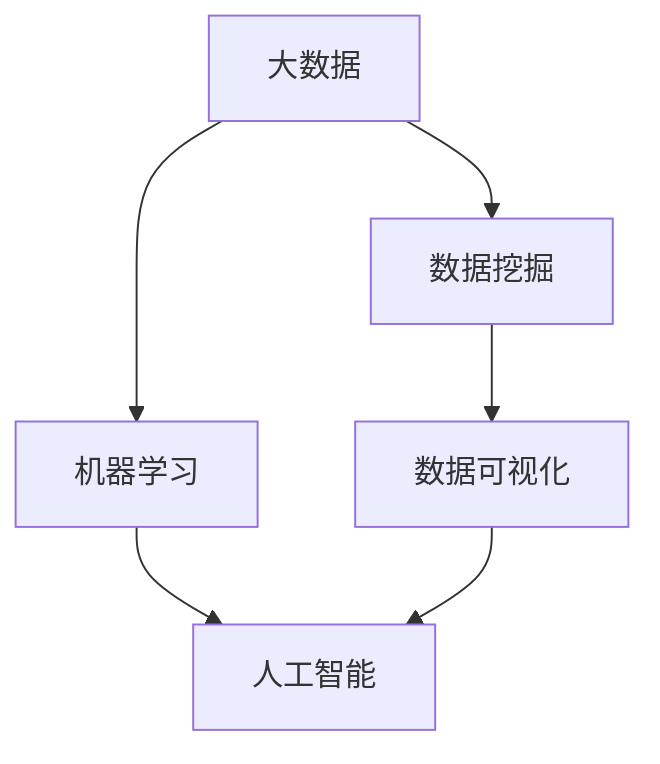

                 

# 信息差的行业趋势洞见：大数据如何洞悉行业趋势

在数字化时代，信息差（Information Gap）已经成为决定企业成败的关键因素之一。大数据技术为快速洞悉行业趋势提供了强大的工具，通过对海量数据的分析和挖掘，企业可以抢占先机，实现业务转型和增长。本文将详细探讨大数据如何助力企业洞察行业趋势，为决策者提供科学依据。

## 1. 背景介绍

### 1.1 问题由来

在全球化和互联网的推动下，市场竞争变得日益激烈，信息差的作用愈发凸显。传统的信息不对称和信息不对称问题，已被更复杂的信息差问题所取代。这些信息差不仅包括了市场信息、技术信息，还涉及法律法规、社会文化等多个维度。在这样复杂的信息环境中，企业需要高效、准确地获取和分析信息，以提升决策的科学性和准确性。

### 1.2 问题核心关键点

信息差的行业趋势洞见，主要包括以下几个关键点：
- 数据采集与处理：采集并清洗海量数据，保证数据的准确性和完整性。
- 数据挖掘与分析：利用大数据技术进行深入分析，发现数据背后的规律和趋势。
- 信息可视化：将复杂的数据结果以图表、报告等形式展示，便于理解和决策。
- 决策支持：将分析结果转化为行动方案，为业务决策提供依据。

## 2. 核心概念与联系

### 2.1 核心概念概述

为更好地理解大数据在洞察行业趋势中的作用，本节将介绍几个关键概念：

- **大数据**：指海量的、多样化的、实时性强的数据集合，主要来源于互联网、社交媒体、物联网等新兴领域。
- **数据挖掘**：从大数据中提取有用信息和知识的过程，通常包括数据清洗、特征工程、模型训练等步骤。
- **机器学习**：通过算法让计算机自动学习和优化，以识别数据中的模式和规律，从而进行预测和决策。
- **人工智能**：利用大数据和机器学习技术，模拟人类智能行为，实现复杂问题的解决。
- **数据可视化**：将数据转换为图形、图表等易于理解的形式，辅助决策者进行快速判断和决策。

这些概念之间的逻辑关系可以通过以下Mermaid流程图来展示：



这个流程图展示了大数据、数据挖掘、机器学习、人工智能和数据可视化的关系：

1. 大数据为数据挖掘提供原料。
2. 数据挖掘利用机器学习算法，从大数据中提取有用的知识和模式。
3. 数据可视化将机器学习的结果转换为易于理解的图表和报告。
4. 人工智能在数据挖掘和可视化基础上，实现复杂问题的解决和预测。

## 3. 核心算法原理 & 具体操作步骤
### 3.1 算法原理概述

大数据洞察行业趋势的过程，本质上是一个数据驱动的决策支持系统。其核心思想是：利用大数据和机器学习算法，从海量数据中提取有用的信息，并通过数据可视化和决策支持系统，辅助决策者进行决策。

具体流程如下：

1. **数据采集**：从互联网、社交媒体、传感器等渠道获取大数据。
2. **数据清洗**：清洗、整理数据，确保数据的质量和一致性。
3. **数据挖掘**：利用机器学习算法，从数据中提取有用的信息和知识。
4. **数据可视化**：将挖掘出的结果以图表、报告等形式展示，辅助决策。
5. **决策支持**：将数据结果转化为可执行的决策方案。

### 3.2 算法步骤详解

**Step 1: 数据采集**
- 选择合适的数据源，如互联网、社交媒体、传感器等。
- 设计数据采集策略，确定采集频率和方式。
- 搭建数据采集系统，实现数据的自动采集和存储。

**Step 2: 数据清洗**
- 数据去重、去噪，处理缺失值和异常值。
- 标准化数据格式，统一数据字典和编码规范。
- 使用ETL工具，如Apache Nifi、Airflow等，自动化数据清洗流程。

**Step 3: 数据挖掘**
- 根据业务需求，选择合适的机器学习算法。
- 设计特征工程流程，提取、选择和转换特征。
- 使用数据挖掘工具，如TensorFlow、PyTorch、Scikit-Learn等，进行模型训练和评估。
- 优化模型参数，提高模型精度和泛化能力。

**Step 4: 数据可视化**
- 选择合适的数据可视化工具，如Tableau、Power BI、Matplotlib等。
- 设计数据可视化方案，选择合适的图表和报告形式。
- 将数据挖掘结果可视化，并制作可视化报告。

**Step 5: 决策支持**
- 将可视化报告转化为决策方案，设计实施路径。
- 设定关键绩效指标(KPI)，监控和评估决策效果。
- 根据反馈调整决策方案，实现持续改进。

### 3.3 算法优缺点

大数据洞察行业趋势的算法具有以下优点：
1. 数据驱动：通过数据驱动的决策方式，减少了主观因素对决策的影响。
2. 精度高：基于机器学习算法的分析，通常能够获得更高的预测精度。
3. 实时性：利用实时数据流，能够快速反应市场变化，及时调整策略。
4. 通用性强：适用于多种业务场景，如市场分析、客户行为预测等。

但该算法也存在一定的局限性：
1. 数据质量要求高：需要高质量、完整的数据，数据质量问题可能导致分析结果不准确。
2. 算法复杂度高：涉及大数据处理、机器学习等多个环节，算法设计和实现复杂。
3. 成本高：数据采集和存储成本较高，技术实施和维护费用较大。
4. 对技术要求高：需要熟悉大数据、机器学习和数据可视化等技术。

尽管存在这些局限性，但就目前而言，大数据洞察行业趋势的算法仍是大企业决策支持的重要工具。未来相关研究的重点在于如何进一步降低技术门槛，提高算法效率，降低成本，同时兼顾可解释性和伦理安全性等因素。

### 3.4 算法应用领域

大数据洞察行业趋势的方法，在多个行业领域中得到了广泛应用，例如：

- **金融行业**：利用大数据和机器学习算法，进行市场趋势分析、信用评估、欺诈检测等。
- **零售行业**：通过分析消费者行为数据，进行需求预测、库存管理、个性化推荐等。
- **医疗行业**：利用电子病历和医疗设备数据，进行疾病预测、治疗方案优化、患者健康监测等。
- **制造业**：通过物联网数据，进行设备故障预测、供应链优化、产品质量控制等。
- **物流行业**：利用GPS数据和配送记录，进行路线优化、仓储管理、需求预测等。

除了上述这些经典行业外，大数据洞察方法还被创新性地应用于更多场景中，如智能家居、智慧城市、智能制造等，为各个行业带来新的发展机遇。

## 4. 数学模型和公式 & 详细讲解  
### 4.1 数学模型构建

本节将使用数学语言对大数据洞察行业趋势的过程进行更加严格的刻画。

记大数据集为 $D=\{(x_i,y_i)\}_{i=1}^N$，其中 $x_i$ 为输入变量，$y_i$ 为输出变量。假设数据中存在某种规律 $f(x)$，目标是从大数据中学习和预测 $f(x)$。

定义损失函数 $L(f)$，用于衡量模型预测结果与实际结果之间的差距。常见的损失函数包括均方误差、交叉熵等。

假设 $f$ 可以用线性回归模型表示，即 $f(x)=\theta_0+\sum_{i=1}^n \theta_i x_i$。其中 $\theta_0, \theta_i$ 为模型参数。

数据挖掘的目标是最小化损失函数 $L(f)$，即：

$$
\hat{\theta}=\mathop{\arg\min}_{\theta} L(f)
$$

### 4.2 公式推导过程

以下我们以线性回归模型为例，推导最小二乘法的公式及其梯度计算过程。

假设线性回归模型的预测结果为 $\hat{y}=f(x)=\theta_0+\sum_{i=1}^n \theta_i x_i$，真实结果为 $y$，则均方误差损失函数为：

$$
L(f)=\frac{1}{N}\sum_{i=1}^N (y_i-\hat{y_i})^2
$$

最小二乘法目标是最小化损失函数，因此需要求出 $L(f)$ 对 $\theta$ 的偏导数，并令其等于0：

$$
\frac{\partial L(f)}{\partial \theta} = \frac{1}{N}\sum_{i=1}^N 2(y_i-\hat{y_i})(x_i-\mu(x))
$$

其中 $\mu(x)=\frac{1}{N}\sum_{i=1}^N x_i$。

由上式可得梯度计算公式：

$$
\nabla_{\theta}L(f)=\frac{1}{N}\sum_{i=1}^N 2(y_i-\hat{y_i})(x_i-\mu(x))^T
$$

利用梯度下降算法，不断迭代更新参数 $\theta$，直到损失函数收敛或达到预设的迭代次数。

## 5. 项目实践：代码实例和详细解释说明
### 5.1 开发环境搭建

在进行大数据洞察实践前，我们需要准备好开发环境。以下是使用Python进行Pandas、NumPy、Scikit-Learn等库的开发环境配置流程：

1. 安装Anaconda：从官网下载并安装Anaconda，用于创建独立的Python环境。

2. 创建并激活虚拟环境：
```bash
conda create -n bigdata-env python=3.8 
conda activate bigdata-env
```

3. 安装相关库：
```bash
conda install pandas numpy scikit-learn matplotlib tqdm jupyter notebook ipython
```

4. 安装TensorFlow和Keras（可选）：
```bash
conda install tensorflow tensorflow-gpu keras
```

完成上述步骤后，即可在`bigdata-env`环境中开始大数据洞察实践。

### 5.2 源代码详细实现

这里我们以一个简单的线性回归模型为例，展示如何用Pandas、NumPy、Scikit-Learn库进行大数据洞察实践。

首先，导入所需的库：

```python
import pandas as pd
import numpy as np
from sklearn.linear_model import LinearRegression
from sklearn.metrics import mean_squared_error
import matplotlib.pyplot as plt
```

然后，读取和清洗数据：

```python
# 读取数据
data = pd.read_csv('data.csv')
# 清洗数据，处理缺失值和异常值
data.dropna(inplace=True)
data = data[data['target'] > 0]
```

接着，进行数据分割和模型训练：

```python
# 数据分割
train_data = data.sample(frac=0.8, random_state=0)
test_data = data.drop(train_data.index)

# 训练模型
X_train = train_data[['feature1', 'feature2']]
y_train = train_data['target']
X_test = test_data[['feature1', 'feature2']]
y_test = test_data['target']

model = LinearRegression()
model.fit(X_train, y_train)

# 预测并评估模型
y_pred = model.predict(X_test)
mse = mean_squared_error(y_test, y_pred)
print(f"MSE: {mse}")
```

最后，进行结果可视化：

```python
# 可视化结果
plt.scatter(X_test['feature1'], y_test, color='blue')
plt.plot(X_test['feature1'], y_pred, color='red')
plt.xlabel('Feature 1')
plt.ylabel('Target')
plt.show()
```

以上就是使用Pandas、NumPy、Scikit-Learn等库进行线性回归模型的大数据洞察实践代码实现。可以看到，Python的数据分析库提供了强大的数据处理和模型训练功能，使得大数据洞察实践变得相对简单。

### 5.3 代码解读与分析

让我们再详细解读一下关键代码的实现细节：

**读取和清洗数据**：
- `pd.read_csv`函数：用于读取CSV格式的数据文件。
- `dropna`方法：删除含有缺失值的行。
- `sample`方法：将数据集随机划分为训练集和测试集。

**模型训练和评估**：
- `LinearRegression`类：用于训练线性回归模型。
- `fit`方法：拟合模型。
- `mean_squared_error`函数：计算均方误差。

**结果可视化**：
- `plt.scatter`函数：绘制散点图。
- `plt.plot`函数：绘制线性回归模型预测结果。
- `plt.xlabel`和`plt.ylabel`函数：设置坐标轴标签。

可以看出，Pandas、NumPy和Scikit-Learn等库在数据分析和建模中起着至关重要的作用。通过这些库，我们可以高效地进行数据处理、模型训练和结果可视化，为大数据洞察实践提供强有力的支持。

## 6. 实际应用场景
### 6.1 金融行业

大数据洞察方法在金融行业中具有广泛的应用，能够帮助金融机构进行市场分析、信用评估、风险管理等。具体应用场景包括：

- **市场趋势分析**：利用高频交易数据，进行市场价格波动预测和趋势分析，帮助投资者制定交易策略。
- **信用评估**：利用客户交易记录、信用历史等数据，进行信用评分和风险预测，辅助贷款审批和风控管理。
- **欺诈检测**：分析交易行为模式，识别异常交易和潜在欺诈行为，保护客户资金安全。

### 6.2 零售行业

大数据洞察方法在零售行业可以用于需求预测、库存管理、个性化推荐等。具体应用场景包括：

- **需求预测**：通过分析历史销售数据和市场趋势，预测未来销售量，优化库存管理。
- **个性化推荐**：利用用户行为数据和商品特征，进行推荐系统优化，提升用户体验和销售额。
- **客户分析**：分析客户购买行为和偏好，进行细分市场和精准营销。

### 6.3 医疗行业

大数据洞察方法在医疗行业可以用于疾病预测、治疗方案优化、患者健康监测等。具体应用场景包括：

- **疾病预测**：利用电子病历和实验室数据，预测疾病发展趋势和风险，辅助医生诊断和治疗。
- **治疗方案优化**：分析患者历史治疗记录和基因数据，优化治疗方案，提高治疗效果。
- **患者健康监测**：利用可穿戴设备和传感器数据，实时监测患者健康状况，提供及时干预。

### 6.4 未来应用展望

随着大数据和机器学习技术的不断进步，大数据洞察行业趋势的应用场景将更加丰富，具体展望如下：

1. **实时性增强**：利用流式数据处理技术，实现实时数据分析和决策支持。
2. **跨领域融合**：通过多模态数据融合，提升对复杂场景的理解和分析能力。
3. **智能化提升**：结合人工智能技术，实现更深入的洞察和预测。
4. **协同优化**：利用协同过滤和推荐算法，优化业务流程和客户体验。
5. **模型自动化**：开发自动化模型训练和优化工具，降低人工干预成本。
6. **合规保障**：加强数据隐私保护和合规性管理，确保数据安全和合法使用。

未来，大数据洞察行业趋势的应用将更加广泛和深入，为企业带来更多的价值和竞争优势。

## 7. 工具和资源推荐
### 7.1 学习资源推荐

为了帮助开发者系统掌握大数据洞察的理论基础和实践技巧，这里推荐一些优质的学习资源：

1. **《数据科学导论》系列博文**：由数据科学专家撰写，介绍了数据科学的基本概念、工具和技术。

2. **Coursera《机器学习》课程**：斯坦福大学开设的机器学习课程，涵盖了数据预处理、模型训练、算法优化等内容。

3. **Kaggle**：全球最大的数据科学竞赛平台，提供海量数据集和实际应用场景，帮助开发者进行数据挖掘和模型训练。

4. **《Python数据科学手册》书籍**：全面介绍了Pandas、NumPy、Scikit-Learn等库的使用，适合进阶学习。

5. **Hadoop官方文档**：Apache Hadoop生态系统的官方文档，介绍了大数据平台的搭建和应用。

通过这些资源的学习实践，相信你一定能够快速掌握大数据洞察的精髓，并用于解决实际的业务问题。

### 7.2 开发工具推荐

高效的数据分析离不开优质的工具支持。以下是几款用于大数据洞察开发的常用工具：

1. **Pandas**：Python数据分析库，提供了强大的数据处理和转换功能，是数据挖掘和模型训练的基础。

2. **NumPy**：Python数值计算库，提供了高效的多维数组运算和线性代数功能，支持大规模数据处理。

3. **Scikit-Learn**：Python机器学习库，提供了多种经典机器学习算法，支持模型训练和评估。

4. **TensorFlow**：谷歌开源的深度学习框架，支持分布式计算和模型优化，适用于大规模数据集。

5. **Keras**：高层次神经网络API，基于TensorFlow等底层框架，支持快速原型设计和模型训练。

6. **Jupyter Notebook**：开源的交互式编程环境，支持Python、R等语言，支持代码执行和结果展示。

合理利用这些工具，可以显著提升大数据洞察的开发效率，加快创新迭代的步伐。

### 7.3 相关论文推荐

大数据洞察技术的快速发展，得益于学界的持续研究。以下是几篇奠基性的相关论文，推荐阅读：

1. **大数据在金融风险管理中的应用**：探讨了大数据在金融行业中的多种应用，包括市场分析、信用评估等。

2. **基于机器学习的零售需求预测**：利用机器学习算法进行零售需求预测，提升了库存管理和供应链优化。

3. **医疗大数据在疾病预测中的应用**：利用大数据和机器学习技术，进行疾病预测和治疗方案优化。

4. **实时数据流处理技术**：介绍了实时数据流处理技术，包括Apache Storm、Apache Kafka等，适用于大数据洞察的实时场景。

5. **深度学习在图像识别中的应用**：利用深度学习算法进行图像识别，拓展了大数据洞察的应用领域。

这些论文代表了大数据洞察技术的发展脉络。通过学习这些前沿成果，可以帮助研究者把握学科前进方向，激发更多的创新灵感。

## 8. 总结：未来发展趋势与挑战
### 8.1 总结

本文对大数据洞察行业趋势进行了全面系统的介绍。首先阐述了大数据和机器学习在大数据洞察中的重要作用，明确了大数据洞察在企业决策支持中的独特价值。其次，从原理到实践，详细讲解了大数据洞察的数学模型和操作步骤，给出了大数据洞察任务开发的完整代码实例。同时，本文还广泛探讨了大数据洞察在金融、零售、医疗等多个行业领域的应用前景，展示了大数据洞察范式的巨大潜力。此外，本文精选了大数据洞察技术的各类学习资源，力求为读者提供全方位的技术指引。

通过本文的系统梳理，可以看到，大数据洞察技术正在成为企业决策支持的重要工具，极大地提升了我企业的决策科学性和准确性。大数据洞察方法能够从海量数据中提取有用的信息，辅助决策者制定更加合理的策略和方案，从而在激烈的市场竞争中占据先机。未来，伴随大数据和机器学习技术的不断进步，大数据洞察技术必将在更广泛的领域得到应用，为企业带来更多的价值和竞争优势。

### 8.2 未来发展趋势

展望未来，大数据洞察技术将呈现以下几个发展趋势：

1. **数据采集自动化**：利用物联网、传感器等技术，实现实时数据的自动采集和处理。
2. **数据融合多样化**：融合更多数据源，包括社交媒体、视频、图像等，提升洞察的深度和广度。
3. **模型训练自动化**：开发自动化模型训练工具，降低人工干预成本，提高训练效率。
4. **多模态数据融合**：利用多模态数据融合技术，提升对复杂场景的理解和分析能力。
5. **模型透明化**：提高模型解释性和可解释性，增强决策的透明性和可信度。
6. **伦理和合规保障**：加强数据隐私保护和合规性管理，确保数据安全和合法使用。

以上趋势凸显了大数据洞察技术的广阔前景。这些方向的探索发展，必将进一步提升大数据洞察技术的科学性和实用性，为企业的决策支持带来更大的价值。

### 8.3 面临的挑战

尽管大数据洞察技术已经取得了瞩目成就，但在迈向更加智能化、普适化应用的过程中，它仍面临着诸多挑战：

1. **数据质量问题**：数据采集、处理和清洗过程中，可能存在数据质量问题，影响分析结果的准确性。
2. **技术门槛高**：大数据洞察技术涉及数据挖掘、机器学习等多个领域，对技术要求较高。
3. **成本高**：大数据处理和存储成本较高，技术实施和维护费用较大。
4. **模型复杂性**：大数据洞察模型通常较为复杂，需要结合多种算法和工具进行优化。
5. **隐私和安全**：数据隐私和安全问题仍然存在，需要加强技术保障和法律法规的完善。

尽管存在这些挑战，但大数据洞察技术的发展前景依然广阔。未来研究需要在以下几个方面寻求新的突破：

1. **数据质量优化**：提高数据采集和处理效率，降低数据质量问题的影响。
2. **技术标准化**：制定数据挖掘和模型训练的标准化流程，降低技术门槛。
3. **成本控制**：采用云计算和分布式计算技术，降低存储和处理成本。
4. **模型可解释性**：提高模型的可解释性和透明性，增强决策的可信度和可解释性。
5. **隐私保护**：加强数据隐私保护技术，确保数据安全和合法使用。

这些突破将有助于大数据洞察技术进一步普及和应用，为企业决策提供更加科学、准确的支持。

### 8.4 研究展望

面对大数据洞察技术面临的挑战，未来的研究需要在以下几个方面寻求新的突破：

1. **无监督学习和大规模预训练**：结合无监督学习和大规模预训练技术，提高数据的可用性和洞察的准确性。
2. **跨领域融合和迁移学习**：利用跨领域融合和迁移学习技术，提升对复杂场景的理解和分析能力。
3. **自动化优化和协同优化**：开发自动化优化和协同优化工具，提高模型训练效率和业务流程的协同能力。
4. **人工智能与大数据结合**：结合人工智能技术和大数据洞察技术，提升洞察的深度和广度。
5. **多模态数据融合**：利用多模态数据融合技术，拓展数据的采集和分析范围，提高洞察的全面性和准确性。

这些研究方向将推动大数据洞察技术的不断进步，为企业决策支持带来更大的价值和竞争力。总之，大数据洞察技术需要结合最新的学术研究和工业实践，不断突破技术瓶颈，才能真正实现其价值和潜力。

## 9. 附录：常见问题与解答

**Q1：大数据洞察技术是否适用于所有企业？**

A: 大数据洞察技术适用于大多数企业，特别是数据密集型和业务复杂型企业。但对于数据量和业务规模较小、数据来源单一的企业，可能存在成本和技术门槛较高的问题，需要综合评估后再决定是否采用。

**Q2：如何选择合适的数据源？**

A: 选择数据源时，需要考虑数据的代表性、数据量和数据质量。通常选择具有较高数据质量和广泛代表性的数据源，如行业数据、公开数据集等。同时，需要对数据源进行清洗和处理，确保数据的完整性和一致性。

**Q3：大数据洞察技术如何应对数据隐私和安全问题？**

A: 大数据洞察技术需要严格遵守数据隐私和安全法律法规，采用数据脱敏、加密等技术保护数据隐私。同时，需要建立数据使用的合规流程和监管机制，确保数据使用的合法性和安全性。

**Q4：如何提高大数据洞察的实时性？**

A: 利用流式数据处理技术，如Apache Kafka、Apache Flink等，实现数据的实时采集、处理和分析。同时，利用云计算和分布式计算技术，提升处理效率和系统的可扩展性。

**Q5：如何提高大数据洞察的自动化程度？**

A: 开发自动化数据处理和模型训练工具，如Python、R、Spark等，实现数据的自动化采集、清洗、处理和分析。同时，利用机器学习自动化优化技术，实现模型的自动化训练和调优。

这些问题的回答，希望能帮助企业更好地理解和应用大数据洞察技术，为其决策支持提供更加科学和可靠的数据支持。

---

作者：禅与计算机程序设计艺术 / Zen and the Art of Computer Programming

