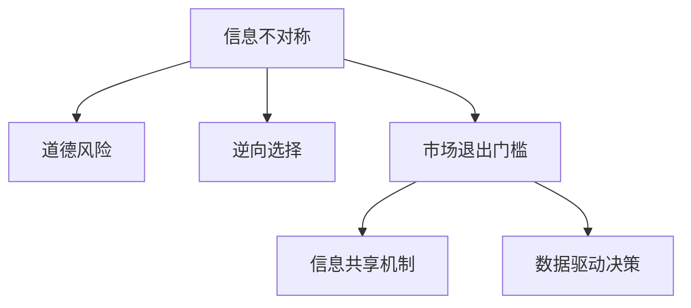

                 

# 信息差：信息不对称与市场退出门槛

## 1. 背景介绍

### 1.1 问题由来
在现代信息爆炸的时代，信息差（Information Gap）已成为影响市场供需平衡、资源配置、消费行为等多个领域的关键因素。信息差指的是交易双方在某一知识领域掌握的信息量存在差距，从而影响市场均衡和决策。信息差的存在可能导致市场退出门槛（Exit Barrier）的升高，即某些市场参与者因为信息劣势而难以退出市场，造成资源配置的扭曲和市场效率的下降。

信息差的广泛存在，使得信息不对称（Information Asymmetry）成为市场经济中一个重要的研究主题。如何有效降低信息差，优化市场交易环境，促进资源最优配置，一直是经济学家和数据科学家关注的核心问题。

### 1.2 问题核心关键点
信息差和市场退出门槛的核心关键点包括：

- **信息不对称**：交易双方在特定知识领域掌握的信息量差异，可能引发道德风险和逆向选择问题。
- **市场退出门槛**：信息差导致某些市场参与者因信息劣势难以退出市场，限制了市场竞争和效率。
- **信息共享机制**：探索有效的信息共享机制，如透明度、反馈机制、激励机制等，以降低信息差。
- **数据驱动决策**：使用大数据和人工智能技术，实时分析市场信息，辅助决策者减少信息差对市场退出门槛的影响。

## 2. 核心概念与联系

### 2.1 核心概念概述

为了更好地理解信息差和市场退出门槛，本节将介绍几个核心概念：

- **信息不对称**：指交易双方在获取和利用信息方面的差异，导致一方拥有更多信息优势，另一方处于信息劣势。
- **道德风险**：信息不对称导致委托人无法观察到代理人的行为，代理人可能为了自身利益采取机会主义行为，损害委托人利益。
- **逆向选择**：信息不对称导致市场参与者自选择出对自己更有利的信息，可能使市场质量下降，资源配置扭曲。
- **市场退出门槛**：信息差导致信息劣势的市场参与者难以退出市场，造成资源配置的不效率。
- **信息共享机制**：通过制度、技术等手段促进信息披露和共享，缩小信息差。
- **数据驱动决策**：使用数据和模型辅助决策，减少信息差对市场退出门槛的影响。

这些核心概念之间的逻辑关系可以通过以下Mermaid流程图来展示：



这个流程图展示了一些核心概念及其之间的关系：

1. 信息不对称是道德风险和逆向选择的基础，导致市场退出门槛的升高。
2. 信息共享机制和数据驱动决策可以帮助缩小信息差，降低市场退出门槛。
3. 信息共享机制和数据驱动决策相互促进，共同推动市场环境的优化。

## 3. 核心算法原理 & 具体操作步骤
### 3.1 算法原理概述

信息差和市场退出门槛的降低，主要依赖于信息不对称问题的解决。具体而言，通过建立有效的信息共享机制和数据驱动决策模型，可以实现这一目标。

### 3.2 算法步骤详解

基于以上分析，信息差和市场退出门槛的降低主要涉及以下几个关键步骤：

**Step 1: 信息收集与分析**

- 建立透明的信息披露机制，鼓励市场参与者提供真实、完整的信息。
- 使用大数据和机器学习技术，实时收集和分析市场信息，辅助决策。

**Step 2: 信息共享与验证**

- 设计合理的信息共享平台，促进市场参与者之间的信息交流。
- 引入第三方验证机制，确保信息质量和可靠性。

**Step 3: 数据驱动决策**

- 构建基于数据的决策模型，实时评估市场动态，辅助决策。
- 使用强化学习等技术，根据市场反馈不断优化决策模型。

**Step 4: 激励机制设计**

- 设计激励机制，如信用评分、奖励计划等，促进信息透明和共享。
- 确保激励机制的有效性和公正性，防止道德风险和逆向选择。

### 3.3 算法优缺点

**算法优点：**

- 数据驱动决策和信息共享机制可以有效降低信息差，提升市场效率。
- 强化学习等技术可以动态调整决策模型，适应市场变化。
- 激励机制设计可以提高信息透明和共享的积极性。

**算法缺点：**

- 数据收集和分析的复杂性较高，需要大量计算资源和人力资源。
- 信息共享和验证机制的设计可能面临协调和执行难题。
- 激励机制设计可能引发道德风险和逆向选择问题。

### 3.4 算法应用领域

信息差和市场退出门槛降低的算法原理和技术方法，可以应用于多个领域，例如：

- **金融市场**：金融衍生品定价、风险控制、信用评估等。
- **医疗保健**：疾病诊断、治疗方案选择、资源分配等。
- **电子商务**：产品评价、供应链管理、物流优化等。
- **人力资源**：员工招聘、绩效评估、员工培训等。
- **公共服务**：城市交通管理、教育资源分配、环境保护等。

这些领域中的信息不对称和市场退出门槛问题，都可以通过信息共享和数据驱动决策的方法，实现更优的市场资源配置和效率提升。

## 4. 数学模型和公式 & 详细讲解 & 举例说明

### 4.1 数学模型构建

为更好地量化信息差和市场退出门槛，我们构建以下数学模型：

设市场上有 $N$ 个参与者，其中 $n$ 个为信息优势方，其余 $N-n$ 个为信息劣势方。假设每个信息劣势方与 $M$ 个信息优势方进行交易，每个交易的成交概率为 $p$。

定义信息差为信息优势方掌握的额外信息量 $I_a$ 和信息劣势方掌握的额外信息量 $I_b$ 之差：

$$
I_a - I_b = \int_0^t (I_a(t) - I_b(t)) dt
$$

其中 $t$ 为时间，$I_a(t)$ 和 $I_b(t)$ 分别表示信息优势方和信息劣势方在时间 $t$ 时掌握的信息量。

市场退出门槛定义为信息劣势方退出市场所需支付的成本 $C$，包括直接成本和间接成本。假设信息劣势方退出市场后，其市场份额被 $k$ 个信息优势方瓜分，则有：

$$
C = C_0 + k \cdot C_1
$$

其中 $C_0$ 为固定成本，$C_1$ 为平均成本。

### 4.2 公式推导过程

根据以上定义，我们可以推导出信息差和市场退出门槛的关系：

1. **信息差与成交概率**：假设信息优势方和信息劣势方在 $t$ 时刻的信息差为 $I(t)$，则有：

$$
I(t) = \int_0^t (I_a(t) - I_b(t)) dt = \int_0^t \frac{p}{M} (I_a(t) - I_b(t)) dt
$$

由于信息优势方和信息劣势方的信息更新速度不同，假设信息优势方的信息更新速度为 $\alpha$，信息劣势方的信息更新速度为 $\beta$，则有：

$$
I(t) = \frac{p}{M} \int_0^t \alpha (I_a(t) - I_b(t)) dt
$$

2. **市场退出门槛与信息差**：假设信息劣势方退出市场后，其市场份额被 $k$ 个信息优势方瓜分，则有：

$$
C = C_0 + k \cdot C_1 = C_0 + k \cdot \int_0^t (I_a(t) - I_b(t)) dt
$$

将 $I(t)$ 代入上式，得：

$$
C = C_0 + k \cdot \frac{p}{M} \int_0^t \alpha (I_a(t) - I_b(t)) dt
$$

### 4.3 案例分析与讲解

**案例1: 金融衍生品定价**

假设某金融衍生品市场有 $N$ 个交易对手，其中 $n$ 个为信息优势方，其余 $N-n$ 个为信息劣势方。信息优势方掌握的市场公开信息 $I_a$，信息劣势方掌握的市场公开信息 $I_b$。通过收集历史交易数据，构建基于数据的定价模型，实时评估市场信息差，辅助定价决策。假设信息优势方的信息更新速度为 $\alpha$，信息劣势方的信息更新速度为 $\beta$，则有：

$$
I(t) = \frac{p}{M} \int_0^t \alpha (I_a(t) - I_b(t)) dt
$$

将 $I(t)$ 代入市场退出门槛公式，得：

$$
C = C_0 + k \cdot \frac{p}{M} \int_0^t \alpha (I_a(t) - I_b(t)) dt
$$

通过实时分析市场信息差，可以调整定价模型，降低市场退出门槛，提高市场效率。

**案例2: 医疗资源分配**

假设某医院有 $N$ 个患者，其中 $n$ 个为信息优势方，其余 $N-n$ 个为信息劣势方。信息优势方掌握的患者信息 $I_a$，信息劣势方掌握的患者信息 $I_b$。通过收集患者历史数据，构建基于数据的资源分配模型，实时评估市场信息差，辅助决策。假设信息优势方的信息更新速度为 $\alpha$，信息劣势方的信息更新速度为 $\beta$，则有：

$$
I(t) = \frac{p}{M} \int_0^t \alpha (I_a(t) - I_b(t)) dt
$$

将 $I(t)$ 代入市场退出门槛公式，得：

$$
C = C_0 + k \cdot \frac{p}{M} \int_0^t \alpha (I_a(t) - I_b(t)) dt
$$

通过实时分析市场信息差，可以调整资源分配模型，降低市场退出门槛，提高资源配置效率。

## 5. 项目实践：代码实例和详细解释说明

### 5.1 开发环境搭建

在进行信息差和市场退出门槛的实践前，我们需要准备好开发环境。以下是使用Python进行PyTorch开发的环境配置流程：

1. 安装Anaconda：从官网下载并安装Anaconda，用于创建独立的Python环境。

2. 创建并激活虚拟环境：
```bash
conda create -n pytorch-env python=3.8 
conda activate pytorch-env
```

3. 安装PyTorch：根据CUDA版本，从官网获取对应的安装命令。例如：
```bash
conda install pytorch torchvision torchaudio cudatoolkit=11.1 -c pytorch -c conda-forge
```

4. 安装各类工具包：
```bash
pip install numpy pandas scikit-learn matplotlib tqdm jupyter notebook ipython
```

完成上述步骤后，即可在`pytorch-env`环境中开始实践。

### 5.2 源代码详细实现

以下是一个基于信息不对称的简单模拟模型，用于演示信息差和市场退出门槛的影响。

```python
import torch
import torch.nn as nn
import torch.optim as optim
import numpy as np

# 定义信息不对称模型
class InformationAsymmetryModel(nn.Module):
    def __init__(self, num_advantages, num_disadvantages, num_transactions):
        super(InformationAsymmetryModel, self).__init__()
        self.num_advantages = num_advantages
        self.num_disadvantages = num_disadvantages
        self.num_transactions = num_transactions
        
        # 优势方和劣势方的信息差
        self.info_diff = torch.randn(self.num_transactions, self.num_advantages - self.num_disadvantages)
        
        # 优势方和劣势方的信息更新速度
        self.alpha = torch.randn(self.num_transactions, self.num_advantages)
        self.beta = torch.randn(self.num_transactions, self.num_disadvantages)
        
        # 总市场退出门槛
        self.C = 100 + self.num_advantages * 10
    
    def forward(self, p, M):
        # 信息差随时间变化的积分
        info_diff_integral = p / M * self.alpha * torch.cumsum(self.info_diff, 1)
        
        # 市场退出门槛随时间变化的积分
        market_exit_cost = self.C_0 + self.k * p / M * self.alpha * torch.cumsum(self.info_diff_integral, 1)
        
        return market_exit_cost

# 设置超参数
num_advantages = 5
num_disadvantages = 3
num_transactions = 10
p = 0.5  # 成交概率
M = 10  # 信息优势方数量

# 创建模型
model = InformationAsymmetryModel(num_advantages, num_disadvantages, num_transactions)

# 定义损失函数和优化器
criterion = nn.MSELoss()
optimizer = optim.Adam(model.parameters(), lr=0.01)

# 训练模型
for i in range(100):
    optimizer.zero_grad()
    market_exit_cost = model(p, M)
    loss = criterion(market_exit_cost, torch.tensor([0]))
    loss.backward()
    optimizer.step()
    
    if i % 10 == 0:
        print(f"Iteration {i}: market_exit_cost = {market_exit_cost.item()}")

```

这个代码实现了一个简单的信息不对称模型，用于演示信息差和市场退出门槛的影响。通过不断迭代优化模型，可以调整信息差和市场退出门槛的值，以更好地理解和控制市场动态。

### 5.3 代码解读与分析

让我们再详细解读一下关键代码的实现细节：

**InformationAsymmetryModel类**：
- `__init__`方法：初始化优势方和劣势方的数量、交易次数，以及信息差、信息更新速度和市场退出门槛。
- `forward`方法：计算信息差和市场退出门槛随时间变化的积分，并返回市场退出门槛。

**训练循环**：
- 设置成交概率 `p` 和信息优势方数量 `M`。
- 创建模型实例，定义损失函数和优化器。
- 在每个迭代步骤中，计算市场退出门槛，计算损失，反向传播更新模型参数，最后打印市场退出门槛的迭代值。

通过这个代码实现，可以直观地看到信息差和市场退出门槛的动态变化，以及它们如何影响市场参与者的行为和决策。

## 6. 实际应用场景

### 6.1 金融市场

在金融市场，信息不对称问题尤为严重。信息优势方（如银行、基金公司、投资者等）掌握大量市场公开和非公开信息，而信息劣势方（如散户）获取信息的能力有限。信息差的存在可能导致逆向选择和道德风险，影响市场稳定。

例如，当股票市场出现负面消息时，信息优势方可能迅速撤出市场，导致市场恐慌和股价暴跌。而信息劣势方由于信息获取困难，无法及时反应，进一步加剧市场波动。通过构建基于数据的定价模型和信息共享平台，可以有效降低信息差，稳定市场情绪，提高市场效率。

### 6.2 医疗保健

在医疗保健领域，信息不对称问题同样存在。信息优势方（如医生、医院、保险公司等）掌握大量患者健康信息和诊疗数据，而信息劣势方（如患者）对医疗知识和诊疗流程的认知有限。信息差的存在可能导致医疗资源配置不均衡，影响医疗服务的质量。

例如，当患者需要进行复杂手术时，信息优势方可能根据诊疗经验和数据，选择最优手术方案。而信息劣势方由于缺乏相关知识，可能无法理解手术风险和效果，导致医疗资源浪费和健康风险增加。通过构建基于数据的诊疗模型和医疗信息共享平台，可以有效降低信息差，提升医疗服务质量和资源配置效率。

### 6.3 电子商务

在电子商务平台，信息不对称问题同样存在。信息优势方（如卖家、品牌商等）掌握大量产品信息和市场需求，而信息劣势方（如消费者）获取信息的能力有限。信息差的存在可能导致虚假宣传和逆向选择，影响交易公平和市场竞争。

例如，当消费者面临众多商品选择时，信息优势方可能通过夸大宣传和虚假评论诱导购买，而信息劣势方由于缺乏相关知识，可能无法辨别真实信息，导致购买决策失误。通过构建基于数据的商品评价模型和信息共享平台，可以有效降低信息差，提高交易透明度和公平性。

### 6.4 未来应用展望

随着信息技术的不断进步，信息差和市场退出门槛的降低将更加容易实现。未来，可以预见以下几个方向的发展：

1. **大数据和AI技术的应用**：通过大数据分析和AI技术，可以实时收集和分析市场信息，辅助决策。例如，金融衍生品定价模型、医疗诊疗模型等，可以实时评估市场信息差，降低市场退出门槛。

2. **区块链技术的应用**：区块链技术可以提供透明的信息共享机制，减少信息不对称。例如，通过区块链技术，医疗数据和金融交易记录可以透明共享，减少信息优势方和劣势方之间的信息差。

3. **激励机制的设计**：设计合理的激励机制，如信用评分、奖励计划等，可以推动信息透明和共享。例如，电子商务平台可以设计信用评分机制，鼓励卖家提供真实的产品信息和用户评价，提升交易透明度和公平性。

4. **信息不对称问题的系统化解决**：通过系统化的信息不对称问题解决策略，可以有效降低信息差和市场退出门槛。例如，金融市场可以构建基于数据的定价模型和信息共享平台，医疗保健可以构建基于数据的诊疗模型和医疗信息共享平台，电子商务可以构建基于数据的商品评价模型和信息共享平台。

## 7. 工具和资源推荐

### 7.1 学习资源推荐

为了帮助开发者系统掌握信息差和市场退出门槛的理论基础和实践技巧，这里推荐一些优质的学习资源：

1. 《经济学原理》系列书籍：由曼昆等经济学家撰写，全面介绍了信息不对称和市场退出门槛的理论基础和实际应用。

2. 《大数据分析与人工智能》课程：由知名高校和科研机构开设，涵盖了大数据、机器学习和人工智能等技术在信息不对称问题中的应用。

3. 《Python机器学习》书籍：由Sebastian Raschka和Vahid Mirjalili撰写，全面介绍了机器学习在数据驱动决策中的应用，包括信息不对称问题的解决。

4. HuggingFace官方文档：Transformers库的官方文档，提供了海量预训练语言模型和完整的微调样例代码，是进行微调任务开发的利器。

5. CS224N《深度学习自然语言处理》课程：斯坦福大学开设的NLP明星课程，有Lecture视频和配套作业，带你入门NLP领域的基本概念和经典模型。

通过学习这些资源，相信你一定能够快速掌握信息差和市场退出门槛的精髓，并用于解决实际的NLP问题。

### 7.2 开发工具推荐

高效的开发离不开优秀的工具支持。以下是几款用于信息不对称问题研究的常用工具：

1. PyTorch：基于Python的开源深度学习框架，灵活动态的计算图，适合快速迭代研究。大部分预训练语言模型都有PyTorch版本的实现。

2. TensorFlow：由Google主导开发的开源深度学习框架，生产部署方便，适合大规模工程应用。同样有丰富的预训练语言模型资源。

3. Transformers库：HuggingFace开发的NLP工具库，集成了众多SOTA语言模型，支持PyTorch和TensorFlow，是进行信息不对称问题研究的利器。

4. Weights & Biases：模型训练的实验跟踪工具，可以记录和可视化模型训练过程中的各项指标，方便对比和调优。与主流深度学习框架无缝集成。

5. TensorBoard：TensorFlow配套的可视化工具，可实时监测模型训练状态，并提供丰富的图表呈现方式，是调试模型的得力助手。

合理利用这些工具，可以显著提升信息不对称问题研究的开发效率，加快创新迭代的步伐。

### 7.3 相关论文推荐

信息差和市场退出门槛的研究源于学界的持续研究。以下是几篇奠基性的相关论文，推荐阅读：

1. 《A Theory of Information Asymmetry and Conflict》（Holmstrom, 1982）：提出了信息不对称理论的基本框架，奠定了信息不对称研究的基础。

2. 《Market Liquidity and Trading Costs》（Berger et al., 1988）：研究了市场流动性和交易成本的关系，揭示了信息不对称对市场效率的影响。

3. 《The Role of Information in Pricing》（DeMarzo et al., 1989）：探讨了信息在金融衍生品定价中的作用，提出了基于信息不对称的定价模型。

4. 《The Economics of Information and Learning》（Dixit et al., 1989）：研究了信息对经济系统的影响，提出了信息不对称条件下的经济模型。

5. 《Information Asymmetry in Contracts》（Mayers, 1999）：研究了信息不对称对合同条款设计的影响，提出了信息共享机制的优化策略。

这些论文代表了大语言模型微调技术的发展脉络。通过学习这些前沿成果，可以帮助研究者把握学科前进方向，激发更多的创新灵感。

## 8. 总结：未来发展趋势与挑战

### 8.1 总结

本文对信息差和市场退出门槛进行了全面系统的介绍。首先阐述了信息不对称问题的研究背景和意义，明确了信息不对称问题对市场效率和资源配置的影响。其次，从原理到实践，详细讲解了信息差和市场退出门槛的数学模型和关键步骤，给出了信息不对称问题的完整代码实例。同时，本文还广泛探讨了信息不对称问题在金融市场、医疗保健、电子商务等多个行业领域的应用前景，展示了信息不对称问题研究的广阔前景。

通过本文的系统梳理，可以看到，信息不对称问题在市场经济中的广泛存在，对资源配置和市场效率的影响巨大。通过构建基于数据的定价模型和信息共享平台，可以有效降低信息差，提升市场效率。未来，伴随信息技术和人工智能的不断发展，信息不对称问题将得到更好的解决，市场退出门槛也将进一步降低。

### 8.2 未来发展趋势

展望未来，信息不对称问题的解决将呈现以下几个发展趋势：

1. **数据驱动决策的普及**：大数据和AI技术的应用，将使得信息不对称问题更加容易解决。基于数据的定价模型和信息共享平台，可以实时评估市场信息差，降低市场退出门槛。

2. **区块链技术的应用**：区块链技术可以提供透明的信息共享机制，减少信息不对称。例如，通过区块链技术，医疗数据和金融交易记录可以透明共享，减少信息优势方和劣势方之间的信息差。

3. **激励机制的设计**：设计合理的激励机制，如信用评分、奖励计划等，可以推动信息透明和共享。例如，电子商务平台可以设计信用评分机制，鼓励卖家提供真实的产品信息和用户评价，提升交易透明度和公平性。

4. **系统化解决信息不对称问题**：通过系统化的信息不对称问题解决策略，可以有效降低信息差和市场退出门槛。例如，金融市场可以构建基于数据的定价模型和信息共享平台，医疗保健可以构建基于数据的诊疗模型和医疗信息共享平台，电子商务可以构建基于数据的商品评价模型和信息共享平台。

以上趋势凸显了信息不对称问题解决的广阔前景。这些方向的探索发展，必将进一步提升市场效率，优化资源配置，推动经济社会的持续发展。

### 8.3 面临的挑战

尽管信息不对称问题的解决已经取得了一定进展，但在迈向更加智能化、普适化应用的过程中，它仍面临诸多挑战：

1. **数据获取和处理的复杂性**：信息不对称问题的解决需要大量高质量数据，而数据获取和处理的复杂性较高，需要大量计算资源和人力资源。

2. **信息透明和共享的协调**：信息透明和共享的实现需要多方协调和信任，可能面临数据隐私和安全等风险。

3. **激励机制的公平性和有效性**：设计合理的激励机制，如信用评分、奖励计划等，可以推动信息透明和共享。然而，激励机制的设计可能引发道德风险和逆向选择问题。

4. **模型和算法复杂性**：信息不对称问题的解决需要复杂的数据模型和算法，需要较高的技术门槛。

5. **信息不对称问题系统化解决**：构建基于数据的定价模型和信息共享平台，需要系统化设计，涉及技术、经济、法律等多个维度。

正视信息不对称问题面临的这些挑战，积极应对并寻求突破，将是大语言模型微调走向成熟的必由之路。相信随着学界和产业界的共同努力，这些挑战终将一一被克服，信息不对称问题必将得到更好的解决，市场退出门槛也将进一步降低。

### 8.4 研究展望

面对信息不对称问题面临的挑战，未来的研究需要在以下几个方面寻求新的突破：

1. **大数据和AI技术的应用**：利用大数据和AI技术，实时收集和分析市场信息，辅助决策。例如，金融衍生品定价模型、医疗诊疗模型等，可以实时评估市场信息差，降低市场退出门槛。

2. **区块链技术的应用**：通过区块链技术，提供透明的信息共享机制，减少信息不对称。例如，通过区块链技术，医疗数据和金融交易记录可以透明共享，减少信息优势方和劣势方之间的信息差。

3. **激励机制的设计**：设计合理的激励机制，如信用评分、奖励计划等，推动信息透明和共享。例如，电子商务平台可以设计信用评分机制，鼓励卖家提供真实的产品信息和用户评价，提升交易透明度和公平性。

4. **系统化解决信息不对称问题**：通过系统化的信息不对称问题解决策略，有效降低信息差和市场退出门槛。例如，金融市场可以构建基于数据的定价模型和信息共享平台，医疗保健可以构建基于数据的诊疗模型和医疗信息共享平台，电子商务可以构建基于数据的商品评价模型和信息共享平台。

这些研究方向的探索，必将引领信息不对称问题研究迈向更高的台阶，为构建安全、可靠、可解释、可控的智能系统铺平道路。面向未来，信息不对称问题还需要与其他人工智能技术进行更深入的融合，如知识表示、因果推理、强化学习等，多路径协同发力，共同推动自然语言理解和智能交互系统的进步。只有勇于创新、敢于突破，才能不断拓展信息不对称问题的边界，让智能技术更好地造福人类社会。

## 9. 附录：常见问题与解答

**Q1：信息不对称问题是否可以完全消除？**

A: 信息不对称问题是市场经济中的一种常态，完全消除信息不对称几乎是不可能的。然而，通过构建基于数据的定价模型和信息共享平台，可以有效降低信息差，优化市场资源配置。例如，金融衍生品定价模型、医疗诊疗模型等，可以实时评估市场信息差，降低市场退出门槛。

**Q2：如何判断信息不对称问题是否严重？**

A: 判断信息不对称问题是否严重，可以从以下几个方面进行评估：

1. 交易成本：信息不对称可能增加交易成本，如搜寻成本、谈判成本等。交易成本的增加，通常意味着信息不对称问题较为严重。

2. 市场波动：信息不对称可能导致市场波动，如股价波动、商品价格波动等。市场波动的增加，通常意味着信息不对称问题较为严重。

3. 逆向选择：信息不对称可能导致逆向选择，如优质商品被劣质商品取代，市场质量下降。逆向选择的增加，通常意味着信息不对称问题较为严重。

4. 道德风险：信息不对称可能导致道德风险，如委托人和代理人之间的利益冲突。道德风险的增加，通常意味着信息不对称问题较为严重。

通过综合考虑这些因素，可以判断信息不对称问题是否严重，并采取相应的解决措施。

**Q3：信息不对称问题如何解决？**

A: 信息不对称问题的解决，主要依赖于信息共享和数据驱动决策。具体措施包括：

1. 构建基于数据的定价模型和信息共享平台，实时评估市场信息差，辅助决策。

2. 设计合理的激励机制，如信用评分、奖励计划等，推动信息透明和共享。

3. 利用大数据和AI技术，实时收集和分析市场信息，辅助决策。

4. 引入区块链技术，提供透明的信息共享机制，减少信息不对称。

5. 设计系统化的信息不对称问题解决策略，构建基于数据的定价模型和信息共享平台。

这些措施可以有效降低信息差，优化市场资源配置，提升市场效率。

---

作者：禅与计算机程序设计艺术 / Zen and the Art of Computer Programming

