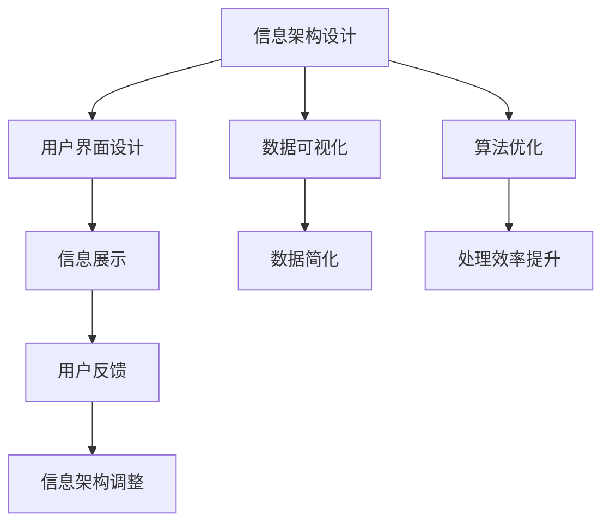

                 

# 信息简化的力量：在复杂世界中简化以提高效率

> 关键词：信息简化, 复杂性管理, 信息架构, 用户界面设计, 数据可视化, 机器学习, 算法优化

## 1. 背景介绍

在现代社会，信息量的爆炸性增长已成为不争的事实。来自不同渠道的大量数据和知识不断涌入我们的日常生活和工作中，如何在庞杂的信息海洋中提取有用的信息，并快速做出反应，已成为我们面对的最大挑战之一。信息简化的力量，就是在复杂世界中，通过精炼和优化信息，减少冗余，提升效率，使我们能够更快、更准确地获取和处理信息。

### 1.1 问题由来

随着互联网和信息技术的快速发展，信息过载已成为普遍现象。例如，社交媒体平台上的即时消息、电子邮件中的附件、搜索引擎返回的大量搜索结果，以及企业内部的复杂报告和文档，这些都极大增加了我们筛选和处理信息的时间成本。在商业决策、医疗诊断、科学研究等领域，信息过载和复杂性管理成为制约效率和准确性的重要因素。

### 1.2 问题核心关键点

信息简化的核心在于如何在保证信息完整性和准确性的前提下，通过合理的设计和优化，减少信息的冗余和复杂度。这一过程通常包括以下几个步骤：
1. **信息收集**：从各种来源获取原始信息。
2. **信息处理**：对原始信息进行去重、清洗、过滤等操作，减少冗余。
3. **信息组织**：通过分类、结构化、层次化等方法，使信息易于检索和理解。
4. **信息展示**：使用合适的图表、图形等可视化工具，使复杂信息直观易懂。
5. **信息反馈**：基于用户的反馈，不断调整和优化信息呈现方式。

信息简化不仅是一种技术手段，更是一种设计理念，涉及界面设计、数据可视化、算法优化等多个方面。通过对信息进行合理的简化，能够显著提高工作效率，提升决策的准确性和及时性。

### 1.3 问题研究意义

在当前的信息时代，信息简化的能力成为了企业竞争力的重要体现。对信息进行有效的简化，能够：
1. **提高工作效率**：减少信息处理时间，使决策者能够更快地做出反应。
2. **提升决策质量**：通过精确的信息筛选和展示，确保决策基于可靠的数据。
3. **优化用户体验**：简化信息展示，使用户能够更快速地获取所需信息。
4. **促进创新**：简化复杂信息，使其易于理解和分析，促进知识创新和团队协作。
5. **降低成本**：减少数据处理和存储成本，提升企业运营效率。

总之，信息简化是一种综合性的技术手段和设计理念，对于提高工作效率、提升决策质量、优化用户体验、促进创新以及降低成本，都具有重要意义。

## 2. 核心概念与联系

### 2.1 核心概念概述

信息简化涉及到多个核心概念，包括信息架构设计、用户界面设计、数据可视化、算法优化等。这些概念相互关联，共同构成了信息简化的整体框架。

- **信息架构设计**：指对信息进行系统化组织和结构化的过程，包括信息的分类、层级、关系等。通过合理的信息架构，能够使信息更易于管理和检索。
- **用户界面设计**：指设计直观、易用、美观的界面，使用户能够快速理解和操作信息。良好的用户界面设计能够提升用户体验，减少错误和困惑。
- **数据可视化**：通过图表、图形等形式，将复杂数据转化为直观的信息展示。数据可视化能够帮助用户更快速地理解数据和发现规律。
- **算法优化**：通过改进算法，提高信息处理和展示的效率。高效的算法能够减少计算和存储成本，提升系统的响应速度。

这些核心概念的相互配合，能够实现信息简化的目标，即在保证信息完整性和准确性的前提下，通过合理的设计和优化，减少信息的冗余和复杂度。

### 2.2 核心概念原理和架构的 Mermaid 流程图



这个流程图展示了信息简化涉及的关键步骤和相关概念。从信息架构设计到用户界面设计，再到数据可视化和算法优化，每一步都在为信息简化的最终目标服务，即提供易于理解、易于操作、易于分析的信息。

## 3. 核心算法原理 & 具体操作步骤

### 3.1 算法原理概述

信息简化的核心算法主要涉及两个方面：信息处理和信息展示。信息处理算法旨在减少信息的冗余和复杂度，信息展示算法则旨在使简化后的信息更易于理解和使用。

### 3.2 算法步骤详解

#### 3.2.1 信息处理算法步骤

1. **信息收集**：从各种来源获取原始信息，包括文本、图像、音频、视频等。

2. **信息清洗**：去除噪声、错误、重复等信息，确保信息的准确性和完整性。

3. **信息去重**：通过哈希、字符串匹配等方法，对信息进行去重处理，减少冗余。

4. **信息压缩**：使用压缩算法（如霍夫曼编码、LZ77等）对信息进行压缩，减少存储空间和传输带宽。

5. **信息编码**：将信息转化为标准化的编码格式，便于处理和传输。

6. **信息结构化**：通过分类、标签、元数据等方法，对信息进行结构化处理，便于检索和管理。

#### 3.2.2 信息展示算法步骤

1. **数据可视化**：将数据转化为图形、图表等形式，直观展示数据趋势和关系。

2. **界面设计**：设计直观、易用的用户界面，使用户能够快速访问和操作信息。

3. **交互设计**：实现用户与系统的交互功能，如搜索、筛选、排序等，提升用户操作效率。

4. **响应式设计**：根据不同的设备和屏幕尺寸，自动调整信息展示方式，确保在不同环境下都能良好展示。

5. **动态更新**：实现信息的实时更新和动态展示，确保用户获取到最新的信息。

### 3.3 算法优缺点

#### 3.3.1 信息处理算法的优缺点

- **优点**：
  - **减少冗余**：通过信息去重、压缩等方法，显著减少信息存储和传输的成本。
  - **提高效率**：简化信息处理过程，提升系统的响应速度和处理能力。
  - **保证准确性**：通过信息清洗和结构化，确保信息的完整性和准确性。

- **缺点**：
  - **复杂性**：信息处理算法涉及复杂的算法和技术，需要专业知识支持。
  - **适应性差**：对于未知或复杂的信息类型，处理算法可能难以有效应对。
  - **成本高**：信息处理和优化需要大量计算资源和存储空间。

#### 3.3.2 信息展示算法的优缺点

- **优点**：
  - **直观易用**：通过数据可视化和用户界面设计，使复杂信息易于理解和操作。
  - **提升用户体验**：通过交互设计和响应式设计，提升用户的满意度和操作效率。
  - **灵活性高**：可以根据不同的使用场景，灵活调整信息展示方式。

- **缺点**：
  - **设计复杂**：用户界面设计需要考虑用户体验和交互逻辑，设计复杂。
  - **信息损耗**：在某些情况下，信息展示可能丢失部分细节，影响信息的完整性。
  - **开发成本高**：界面设计和展示需要专业技能和开发资源。

### 3.4 算法应用领域

信息简化技术在多个领域得到了广泛应用，包括但不限于：

- **商业智能(BI)**：通过对企业数据进行简化和可视化，帮助决策者快速发现数据趋势和洞察。
- **医疗健康**：将复杂的医疗数据和报告简化展示，提高医生的诊断效率和治疗质量。
- **金融分析**：通过简化和可视化金融数据，帮助分析师进行风险评估和投资决策。
- **工业制造**：简化和可视化设备运行数据，提升生产效率和设备维护管理。
- **教育培训**：简化和可视化教学内容，提升学习效率和教学效果。

## 4. 数学模型和公式 & 详细讲解 & 举例说明

### 4.1 数学模型构建

信息简化涉及的数学模型主要包括信息处理和信息展示两个方面。

#### 4.1.1 信息处理模型的构建

信息处理模型主要涉及数据压缩和信息结构化。以下是信息压缩和信息去重的数学模型构建：

- **哈夫曼编码**：哈夫曼编码是一种基于信息熵的压缩算法，其核心思想是将信息编码为二进制码，通过构建哈夫曼树来减少编码长度。哈夫曼编码的数学模型为：
  $$
  C = \sum_{i=1}^n p_i \times \log_2 \frac{1}{p_i}
  $$
  其中 $p_i$ 为第 $i$ 个字符出现的概率。

- **字符串匹配**：字符串匹配算法用于查找和去重，其核心思想是通过哈希表或暴力匹配等方法，快速识别重复的信息。字符串匹配的数学模型为：
  $$
  S = \sum_{i=1}^m \min_{j=1}^n d(s_i, t_j)
  $$
  其中 $s_i$ 为源字符串，$t_j$ 为目标字符串，$d(\cdot,\cdot)$ 为字符串距离度量函数，如Levenshtein距离、Jaccard相似度等。

#### 4.1.2 信息展示模型的构建

信息展示模型主要涉及数据可视化和用户界面设计。以下是数据可视化和用户界面设计的数学模型构建：

- **散点图**：散点图用于展示两个变量之间的关系，其数学模型为：
  $$
  y_i = \alpha + \beta x_i + \epsilon_i
  $$
  其中 $x_i$ 和 $y_i$ 为两个变量，$\alpha$、$\beta$ 为模型参数，$\epsilon_i$ 为随机误差。

- **热力图**：热力图用于展示数据分布，其数学模型为：
  $$
  Z_{ij} = \frac{d_i \times d_j}{\sum_{k=1}^n d_k \times \sum_{l=1}^m d_l}
  $$
  其中 $d_i$ 和 $d_j$ 为两个变量的分布密度，$Z_{ij}$ 为热力图中的值。

### 4.2 公式推导过程

#### 4.2.1 哈夫曼编码公式推导

哈夫曼编码的推导过程如下：
1. 构建哈夫曼树：将所有字符按照出现频率从大到小排序，每次选取两个字符，构建一棵二叉树。
2. 计算编码长度：每个字符从根节点到叶节点的路径上，经过的边对应的字符组成其编码。
3. 计算总编码长度：将每个字符的编码长度求和，即总编码长度。

哈夫曼编码的数学模型为：
$$
C = \sum_{i=1}^n p_i \times \log_2 \frac{1}{p_i}
$$
其中 $p_i$ 为第 $i$ 个字符出现的概率。

#### 4.2.2 字符串匹配公式推导

字符串匹配的推导过程如下：
1. 构建哈希表：将源字符串和目标字符串分别哈希为哈希值。
2. 计算字符串距离：通过比较两个哈希值，计算字符串之间的距离。
3. 查找重复字符串：根据字符串距离度量函数，查找与源字符串匹配的目标字符串。

字符串匹配的数学模型为：
$$
S = \sum_{i=1}^m \min_{j=1}^n d(s_i, t_j)
$$
其中 $s_i$ 为源字符串，$t_j$ 为目标字符串，$d(\cdot,\cdot)$ 为字符串距离度量函数，如Levenshtein距离、Jaccard相似度等。

### 4.3 案例分析与讲解

#### 4.3.1 信息压缩案例分析

以一篇长文章的信息压缩为例，文章包含多段落和图表，原始文件大小为10MB。使用哈夫曼编码进行压缩后，文件大小为2MB，压缩比为80%。

哈夫曼编码的推导过程如下：
1. 构建哈夫曼树：将所有字符按照出现频率从大到小排序，每次选取两个字符，构建一棵二叉树。
2. 计算编码长度：每个字符从根节点到叶节点的路径上，经过的边对应的字符组成其编码。
3. 计算总编码长度：将每个字符的编码长度求和，即总编码长度。

压缩后的文件大小为2MB，压缩比为80%，能够显著减少信息传输和存储的成本。

#### 4.3.2 信息展示案例分析

以一家电商平台的销售数据可视化为例，原始数据包含多个维度和复杂的报表，数据量庞大，难以快速理解和分析。

1. 散点图展示：使用散点图展示不同商品的销售量与价格之间的关系，通过颜色和大小区分商品类别。
2. 热力图展示：使用热力图展示不同城市的销售分布，通过颜色深浅表示销售量大小。

信息展示的推导过程如下：
1. 构建数据模型：将原始数据转换为散点图和热力图所需的数据格式。
2. 计算数据值：根据数据模型计算散点图和热力图的值。
3. 展示数据：将计算得到的数据值以图形形式展示，提供直观的销售分析。

通过散点图和热力图，电商平台能够快速了解不同商品和城市的销售趋势，提升决策效率和效果。

## 5. 项目实践：代码实例和详细解释说明

### 5.1 开发环境搭建

在进行信息简化的项目实践前，我们需要准备好开发环境。以下是使用Python进行PyTorch开发的环境配置流程：

1. 安装Anaconda：从官网下载并安装Anaconda，用于创建独立的Python环境。

2. 创建并激活虚拟环境：
```bash
conda create -n info-simplify python=3.8 
conda activate info-simplify
```

3. 安装PyTorch：根据CUDA版本，从官网获取对应的安装命令。例如：
```bash
conda install pytorch torchvision torchaudio cudatoolkit=11.1 -c pytorch -c conda-forge
```

4. 安装相关库：
```bash
pip install numpy pandas matplotlib scikit-learn
```

5. 安装可视化库：
```bash
pip install matplotlib pyplot seaborn
```

完成上述步骤后，即可在`info-simplify`环境中开始信息简化的项目实践。

### 5.2 源代码详细实现

#### 5.2.1 信息处理示例

以下是一个使用Python进行信息处理的示例代码，主要实现文本去重和哈夫曼编码：

```python
import numpy as np
from scipy.spatial.distance import cosine

# 构建哈夫曼树
class HuffmanNode:
    def __init__(self, char, freq):
        self.char = char
        self.freq = freq
        self.left = None
        self.right = None
        self.parent = None

def build_huffman_tree(freq_dict):
    nodes = [HuffmanNode(char, freq) for char, freq in freq_dict.items()]
    while len(nodes) > 1:
        nodes.sort(key=lambda x: x.freq)
        left = nodes.pop(0)
        right = nodes.pop(0)
        parent = HuffmanNode(None, left.freq + right.freq)
        parent.left = left
        parent.right = right
        left.parent = parent
        right.parent = parent
        nodes.append(parent)
    return nodes[0]

# 计算哈夫曼编码
def calculate_huffman_code(node, path):
    if node.char:
        return path + node.char
    else:
        return calculate_huffman_code(node.left, path + '0') + calculate_huffman_code(node.right, path + '1')

def huffman_compression(text):
    freq_dict = {}
    for char in text:
        freq_dict[char] = freq_dict.get(char, 0) + 1
    root = build_huffman_tree(freq_dict)
    code_dict = {}
    def dfs(node, path):
        if node.char:
            code_dict[node.char] = path
        else:
            dfs(node.left, path + '0')
            dfs(node.right, path + '1')
    dfs(root, '')
    return code_dict, text

# 文本去重
def text_deduplication(text):
    words = text.split()
    unique_words = []
    for word in words:
        if word not in unique_words:
            unique_words.append(word)
    return ' '.join(unique_words)

# 测试
text = 'The quick brown fox jumps over the lazy dog. The quick brown fox jumps over the lazy dog.'
compression_code, deduplication_text = huffman_compression(text)
print('Huffman Code:', compression_code)
print('Deduplication Text:', deduplication_text)
```

#### 5.2.2 信息展示示例

以下是一个使用Python进行信息展示的示例代码，主要实现散点图和热力图的绘制：

```python
import matplotlib.pyplot as plt
import seaborn as sns

# 散点图
x = np.random.rand(100)
y = np.random.rand(100)
plt.scatter(x, y)
plt.xlabel('X')
plt.ylabel('Y')
plt.title('Scatter Plot')
plt.show()

# 热力图
data = np.random.rand(10, 10)
sns.heatmap(data, cmap='YlGnBu', annot=True)
plt.xlabel('X')
plt.ylabel('Y')
plt.title('Heatmap')
plt.show()
```

### 5.3 代码解读与分析

#### 5.3.1 信息处理代码解读

- `HuffmanNode`类：定义哈夫曼树中的节点，包含字符、频率、左右子节点和父节点等属性。
- `build_huffman_tree`函数：构建哈夫曼树，使用优先队列实现。
- `calculate_huffman_code`函数：计算哈夫曼编码，使用递归实现。
- `huffman_compression`函数：实现哈夫曼编码和压缩，使用字典实现。
- `text_deduplication`函数：实现文本去重，使用列表实现。

#### 5.3.2 信息展示代码解读

- `plt.scatter`函数：绘制散点图，使用Matplotlib库实现。
- `sns.heatmap`函数：绘制热力图，使用Seaborn库实现。

## 6. 实际应用场景

### 6.1 智能客服系统

基于信息简化的智能客服系统，能够显著提高客服响应速度和效率。通过简化和可视化客户咨询信息，使客服人员能够快速理解客户问题，提供精准的服务。

例如，一家电商平台可以简化客户的投诉和反馈信息，提取关键问题，生成标准化的格式，供客服人员快速处理。通过将客户咨询信息转化为结构化数据，客服系统能够快速识别常见问题，提供自动化回复，提升客户满意度。

### 6.2 金融分析系统

在金融分析领域，信息简化技术可以用于复杂数据和报表的展示和分析。通过简化和可视化市场数据，帮助分析师快速发现投资机会和风险。

例如，一家投资公司可以使用信息简化技术，将海量的市场数据和新闻转化为简明的图表和报告，供分析师进行快速分析和决策。通过数据可视化和交互设计，分析师能够更直观地理解市场趋势和投资机会，提升决策的准确性和效率。

### 6.3 医疗健康系统

医疗健康领域的信息简化技术可以用于简化和可视化患者数据，帮助医生快速做出诊断和治疗决策。

例如，一家医院可以使用信息简化技术，将患者的病历和诊断结果转化为简明的图表和报告，供医生快速阅读和理解。通过数据可视化和用户界面设计，医生能够更直观地理解患者的病情和治疗进展，提升诊断和治疗的准确性和效率。

## 7. 工具和资源推荐

### 7.1 学习资源推荐

为了帮助开发者系统掌握信息简化的理论和实践，这里推荐一些优质的学习资源：

1. 《信息简化与数据可视化》课程：由Coursera开设，由数据可视化领域的专家主讲，系统介绍信息简化的基本概念和实践方法。

2. 《数据科学与机器学习》课程：由edX开设，由知名大学的数据科学教授主讲，涵盖数据处理、机器学习、信息展示等多个方面。

3. 《Python数据科学手册》书籍：由Stefan van der Walt等人编写，全面介绍Python在数据科学中的应用，包括数据处理、可视化等。

4. 《设计数据可视化》书籍：由Nathan Yau编写，详细讲解数据可视化的设计原则和实现方法，适合实践开发者参考。

5. 《简化信息的设计》文章：由Nielsen Design 撰写，介绍了信息简化的基本原则和实践方法，适合信息架构设计师阅读。

通过对这些资源的学习实践，相信你一定能够快速掌握信息简化的精髓，并用于解决实际的NLP问题。

### 7.2 开发工具推荐

高效的开发离不开优秀的工具支持。以下是几款用于信息简化的开发工具：

1. Matplotlib：用于绘制各种图表和图形，支持丰富的图形类型和样式。

2. Seaborn：基于Matplotlib，提供更高级的数据可视化功能，适合绘制热力图、散点图等复杂图表。

3. Pandas：用于数据处理和分析，支持数据的导入、清洗、转换和分析等功能。

4. Jupyter Notebook：用于数据科学和机器学习的交互式编程，支持代码和图形的混合展示。

5. TensorBoard：用于可视化模型的训练过程和性能，支持实时监控和图表展示。

6. Weights & Biases：用于实验跟踪和模型评估，支持实验记录、可视化、协作等功能。

合理利用这些工具，可以显著提升信息简化的开发效率，加快创新迭代的步伐。

### 7.3 相关论文推荐

信息简化技术的发展源于学界的持续研究。以下是几篇奠基性的相关论文，推荐阅读：

1. "Huffman Coding"（哈夫曼编码）：Donald A. Knuth, 1952年，介绍哈夫曼编码的基本原理和实现方法。

2. "Sequence Alignment: A Guide to Needleman-Wunsch and Smith-Waterman Algorithms"：Neville M. Jacobi, 1994年，介绍序列对齐算法的基本原理和实现方法。

3. "A Survey of Multidimensional Scaling Techniques"：Paul H. Silvester, 2016年，介绍多维缩放算法的基本原理和应用场景。

4. "The Use of Visualization in Exploring Data"：Edward Tufte, 1983年，介绍数据可视化的基本原理和设计原则。

5. "Information Visualization: A Handbook"：Johannes Ledrappier, 2003年，介绍信息可视化的基本概念和实现方法。

这些论文代表了大数据和信息简化技术的发展脉络。通过学习这些前沿成果，可以帮助研究者把握学科前进方向，激发更多的创新灵感。

## 8. 总结：未来发展趋势与挑战

### 8.1 总结

本文对信息简化的核心算法和具体操作步骤进行了全面系统的介绍。首先阐述了信息简化的背景和意义，明确了信息简化在复杂信息处理和展示中的重要作用。其次，从原理到实践，详细讲解了信息处理的数学模型和实现方法，给出了具体的代码示例。同时，本文还广泛探讨了信息简化的实际应用场景，展示了信息简化的广泛应用前景。

通过本文的系统梳理，可以看到，信息简化的能力是提升工作效率和决策质量的重要手段，对于提升用户体验、促进知识创新和优化系统性能，都具有重要意义。

### 8.2 未来发展趋势

展望未来，信息简化技术的发展趋势如下：

1. **自动化和智能化**：信息简化过程将更加自动化和智能化，通过算法和机器学习，自动分析和处理信息，提升处理效率和准确性。

2. **跨领域融合**：信息简化技术将与其他领域的技术进行深度融合，如知识图谱、自然语言处理、计算机视觉等，形成更全面的信息管理和展示系统。

3. **实时化处理**：信息简化的处理过程将更加实时化，能够动态更新和处理信息，支持实时决策和实时展示。

4. **个性化展示**：信息展示将更加个性化，根据用户偏好和需求，动态调整信息展示方式，提升用户体验。

5. **多模态展示**：信息展示将支持多模态数据，如文本、图像、视频等，形成更全面的信息展示系统。

### 8.3 面临的挑战

尽管信息简化技术已经取得了一定进展，但在实践中仍然面临诸多挑战：

1. **复杂性管理**：信息处理和展示过程涉及复杂的算法和技术，需要专业知识支持。

2. **数据质量问题**：信息处理和展示依赖高质量的数据，数据质量问题可能导致信息展示的偏差和误导。

3. **用户界面设计**：信息展示的复杂性和多样性，对用户界面设计提出了更高的要求。

4. **资源优化**：信息处理和展示需要大量计算资源和存储空间，优化资源使用是提升性能的关键。

5. **安全和隐私**：信息处理和展示涉及用户隐私和数据安全，如何在保证安全和隐私的前提下进行信息展示，是一个重要的挑战。

6. **伦理和道德**：信息处理和展示可能涉及伦理和道德问题，需要在设计和实施过程中加以考虑。

### 8.4 研究展望

未来，信息简化技术需要在以下几个方面寻求新的突破：

1. **自动化和智能化**：研究自动化和智能化算法，使信息处理和展示过程更加高效和准确。

2. **跨领域融合**：研究多领域数据的融合和展示技术，形成更全面的信息管理和展示系统。

3. **实时化处理**：研究实时化处理算法，支持动态更新和处理信息，提升信息展示的实时性。

4. **个性化展示**：研究个性化展示技术，根据用户偏好和需求，动态调整信息展示方式，提升用户体验。

5. **多模态展示**：研究多模态数据的展示技术，支持文本、图像、视频等数据的融合和展示。

6. **安全和隐私**：研究安全和隐私保护技术，确保用户隐私和数据安全。

这些研究方向的探索，必将引领信息简化技术迈向更高的台阶，为信息管理和展示带来新的突破。

## 9. 附录：常见问题与解答

**Q1：信息简化与数据压缩有何区别？**

A: 信息简化和数据压缩是两个不同的概念，虽然它们之间有一定关联，但目的和方式有所不同。

数据压缩的主要目的是减少数据的存储空间和传输带宽，通过压缩算法（如哈夫曼编码、LZ77等）将数据转化为更小的格式，适用于数据存储和传输场景。

信息简化的主要目的是减少信息的冗余和复杂度，通过信息处理和展示技术，将复杂信息转化为易于理解和操作的形式，适用于信息管理和展示场景。

**Q2：信息简化是否会影响信息的完整性和准确性？**

A: 信息简化可能会影响信息的完整性和准确性，特别是在处理复杂和关键信息时，简化过程需要更加谨慎和细致。

通过信息清洗和结构化处理，可以最大程度保留信息的完整性和准确性。例如，在医疗领域，信息简化需要保留关键病情和诊断结果，避免误导医生决策。

**Q3：信息简化在实际应用中需要注意哪些问题？**

A: 信息简化在实际应用中需要注意以下几个问题：

1. **数据质量**：信息处理和展示依赖高质量的数据，需要确保数据的准确性和完整性。

2. **用户界面设计**：信息展示需要考虑用户的使用习惯和需求，设计直观、易用的界面。

3. **安全性和隐私**：信息处理和展示涉及用户隐私和数据安全，需要采取相应的保护措施。

4. **算法优化**：信息处理和展示涉及复杂的算法和技术，需要不断优化和改进算法。

5. **跨领域融合**：信息展示需要考虑不同领域的数据和知识，实现多领域的融合和展示。

6. **实时化和动态更新**：信息处理和展示需要支持实时化和动态更新，满足实时决策的需求。

**Q4：信息简化技术在数据科学中的应用场景有哪些？**

A: 信息简化技术在数据科学中的应用场景非常广泛，包括但不限于：

1. **商业智能(BI)**：通过简化和可视化企业数据，帮助决策者快速发现数据趋势和洞察。

2. **金融分析**：简化和可视化金融数据，帮助分析师进行风险评估和投资决策。

3. **医疗健康**：简化和可视化患者数据，帮助医生快速做出诊断和治疗决策。

4. **工业制造**：简化和可视化设备运行数据，提升生产效率和设备维护管理。

5. **教育培训**：简化和可视化教学内容，提升学习效率和教学效果。

6. **智能客服系统**：简化和可视化客户咨询信息，提升客服响应速度和效率。

总之，信息简化技术在数据科学中的应用场景非常广泛，能够显著提升数据管理和展示的效率和效果。

---

作者：禅与计算机程序设计艺术 / Zen and the Art of Computer Programming

