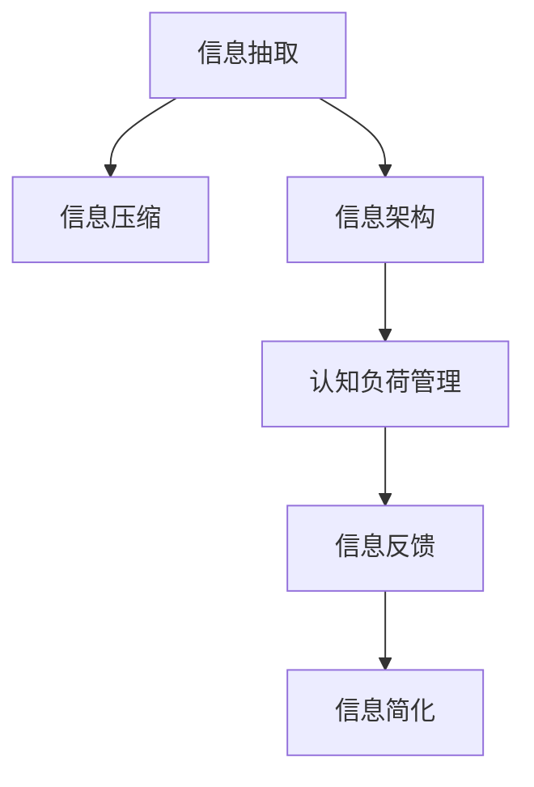

                 

# 信息简化的艺术：如何在混乱和复杂中找到简单和秩序

> 关键词：信息简化,复杂系统,简单化设计,数据压缩,信息架构,认知负荷

## 1. 背景介绍

### 1.1 问题由来

在当今信息爆炸的时代，面对海量的数据和复杂的现象，人类感到的不是解放，而是不知所措。信息的丰富不仅没有减轻人们的认知负荷，反而加重了信息处理的负担。从信息检索到决策支持，从商业智能到社会治理，信息过载成为制约效率提升的一大瓶颈。

如何将复杂的信息提炼、整理、简化，使其可被高效理解和利用，已成为各领域迫切需要解决的问题。本博文聚焦于信息简化技术，探索如何在混乱和复杂中找到简单和秩序，为信息处理、认知负荷管理等领域提供方法论指导。

### 1.2 问题核心关键点

信息简化的核心在于将复杂的信息进行抽象、压缩、归纳，使其变得更易于理解和应用。其关键点包括：
- 信息提炼：从海量数据中筛选出最相关、最有价值的信息。
- 数据压缩：将信息进行高效编码，减小冗余，节省存储空间。
- 信息架构：设计清晰、逻辑一致的信息结构，方便信息检索和处理。
- 认知负荷管理：通过简化信息展示，减轻用户认知负荷，提升信息吸收率。
- 信息反馈：利用反馈机制不断优化信息简化过程，提升信息处理效果。

这些核心点共同构成了信息简化的技术框架，使其能够更有效地应对复杂信息系统的挑战。

## 2. 核心概念与联系

### 2.1 核心概念概述

为更好地理解信息简化技术，本节将介绍几个密切相关的核心概念：

- **信息抽取**：从文本、数据中自动提取关键信息，形成结构化数据的过程。
- **信息压缩**：对信息进行编码，减少数据量，节省存储空间的算法。
- **信息架构**：对信息进行逻辑结构化设计，使其易于理解和利用的方法。
- **认知负荷管理**：通过简化信息展示，减少用户注意力分散，提升信息处理效率。
- **信息反馈**：通过用户反馈不断优化信息简化算法，提升信息处理效果。

这些概念之间的逻辑关系可以通过以下Mermaid流程图来展示：



这个流程图展示了几大核心概念之间的关系：

1. 信息抽取是信息简化的起点，从原始数据中提取关键信息。
2. 信息压缩在抽取的基础上进一步优化数据编码，减小存储空间。
3. 信息架构对信息进行结构化设计，提升信息处理效率。
4. 认知负荷管理在结构化信息展示时考虑用户体验，减轻信息处理负担。
5. 信息反馈通过用户反馈不断调整优化信息简化策略。

## 3. 核心算法原理 & 具体操作步骤

### 3.1 算法原理概述

信息简化的基本原理是通过算法和模型对原始数据进行提炼、压缩、归纳，使信息更易于理解和应用。其核心思想包括：

- **信息提炼**：利用自然语言处理、数据挖掘等技术，从原始数据中自动提取关键信息。
- **数据压缩**：通过压缩算法，将信息高效编码，减小数据量。
- **信息架构**：通过知识图谱、标签系统等方法，对信息进行结构化设计。
- **认知负荷管理**：通过可视化、交互设计等技术，简化信息展示，减轻用户认知负荷。
- **信息反馈**：利用用户反馈和自动化评估，不断优化信息简化过程。

形式化地，假设原始数据为 $D$，信息简化的目标是通过算法 $F$ 得到简化后的信息 $S$，使得 $S$ 能够更高效地被处理和应用。

$$
S = F(D)
$$

### 3.2 算法步骤详解

信息简化的具体步骤包括：

**Step 1: 数据预处理**
- 清洗原始数据，去除噪声和无关信息。
- 对数据进行标准化处理，如格式统一、单位转换等。

**Step 2: 信息抽取**
- 使用NLP技术，对文本进行实体识别、情感分析、关键词提取等。
- 对结构化数据，进行分类、聚类、关联分析等。

**Step 3: 信息压缩**
- 使用无损压缩算法，如Huffman编码、LZ77等。
- 使用有损压缩算法，如JPEG、PNG、MP3等。

**Step 4: 信息架构设计**
- 设计清晰的标签体系，如EPC、GIT等。
- 构建信息图谱，将实体、关系进行可视化展示。

**Step 5: 认知负荷管理**
- 使用可视化技术，如图表、树形图等展示信息。
- 使用交互设计，如拖放、点击等提高信息利用效率。

**Step 6: 信息反馈**
- 通过用户点击、评分等反馈信息，进行模型调整和优化。
- 定期进行用户满意度调查，获取更细致的反馈信息。

**Step 7: 信息应用**
- 将简化后的信息应用到实际业务场景，如信息检索、决策支持等。
- 不断迭代优化信息简化模型，提升信息处理效果。

以上是信息简化的核心算法步骤。在实际应用中，还需要根据具体场景进行优化设计，如引入机器学习模型进行智能信息抽取，结合自然语言生成技术提高信息展示效果等。

### 3.3 算法优缺点

信息简化技术具有以下优点：
1. 数据量减少。通过信息抽取和压缩，原始数据量显著减小，节省存储空间和传输带宽。
2. 信息结构化。信息架构设计使信息更易于理解和利用，提高了信息处理效率。
3. 用户体验提升。认知负荷管理技术减轻了用户信息处理负担，提升了信息利用效率。
4. 信息反馈机制。通过用户反馈不断优化信息简化过程，确保信息展示和应用的科学性。

同时，信息简化也存在一些局限性：
1. 依赖数据质量。信息抽取效果很大程度上取决于原始数据的质量，清洗和处理过程中可能会损失部分信息。
2. 算法复杂度。信息压缩和架构设计算法复杂度较高，需要较多计算资源。
3. 主观性。信息简化过程中可能存在主观判断，如实体识别的边界确定等。
4. 模型依赖。信息抽取和压缩依赖于具体的算法和模型，不同算法模型的效果差异较大。

尽管存在这些局限性，但就目前而言，信息简化技术在数据管理和信息处理等领域仍是一种重要手段。未来相关研究的重点在于如何进一步降低算法复杂度，提高信息抽取的准确性，优化信息展示和利用效果，同时兼顾主观性和模型依赖的问题。

### 3.4 算法应用领域

信息简化技术在多个领域中得到了广泛应用，例如：

- 商业智能：通过信息简化，从海量业务数据中提取关键指标，支持决策支持。
- 数据挖掘：将复杂数据集简化，便于进行模式识别和关联分析。
- 信息检索：对用户查询进行简化解码，提高检索效率。
- 数据可视化：对多维数据进行简化，便于展示和理解。
- 推荐系统：从用户行为数据中提取关键信息，推荐个性化内容。
- 智慧城市：对各类传感器数据进行简化，辅助城市管理和决策。

除了上述这些经典应用外，信息简化技术还被创新性地应用于更多场景中，如智能推荐、数据治理、金融风控等，为数据管理和信息处理带来了全新的突破。

## 4. 数学模型和公式 & 详细讲解

### 4.1 数学模型构建

本节将使用数学语言对信息简化的基本原理进行严格刻画。

假设原始数据集为 $D=\{(x_i,y_i)\}_{i=1}^N$，其中 $x_i$ 为输入特征，$y_i$ 为标签。信息简化的目标是设计算法 $F$，将其映射为简化后的数据集 $S=\{(x'_i,y'_i)\}_{i=1}^N$，使得 $S$ 更易于理解和应用。

定义信息简化的损失函数为 $\mathcal{L}(F)=\sum_{i=1}^N \ell(y_i,F(x_i))$，其中 $\ell$ 为损失函数。信息简化的优化目标是最小化损失函数，即：

$$
F^* = \mathop{\arg\min}_{F} \mathcal{L}(F)
$$

### 4.2 公式推导过程

以下我们以信息抽取和压缩为例，推导其中的数学模型和公式。

**信息抽取**
信息抽取的数学模型如下：

设原始文本为 $X=\{x_1,x_2,...,x_n\}$，目标是从 $X$ 中抽取实体 $E=\{e_1,e_2,...,e_m\}$。假设使用条件随机场模型，训练得到抽取模型 $P(e_i|x_j)$。

信息抽取的目标是最小化误差 $E(X, Y)$，其中 $Y$ 为实际抽取的实体序列。设 $L_i$ 为第 $i$ 个实体的标签，$L=\{L_1,L_2,...,L_m\}$，则误差 $E$ 可以表示为：

$$
E(X, Y) = \sum_{i=1}^m \sum_{j=1}^n \mathbb{I}(L_i = 1, y_j \in e_i) \times |x_j - e_i|
$$

其中 $\mathbb{I}$ 为指示函数，表示 $y_j$ 是否在 $e_i$ 中。$|x_j - e_i|$ 表示实体 $e_i$ 和文本 $x_j$ 之间的距离，可以通过编辑距离、相似度等方法计算。

**信息压缩**
信息压缩的数学模型如下：

假设原始数据集为 $D=\{(x_i,y_i)\}_{i=1}^N$，目标是对 $D$ 进行压缩，生成简化后的数据集 $S=\{(x'_i,y'_i)\}_{i=1}^N$。

设压缩算法为 $C$，则简化后的数据集可以表示为：

$$
S = \{C(x_i, y_i)\}_{i=1}^N
$$

压缩算法的目标是找到最优压缩方式 $C^*$，使得 $S$ 的信息量和 $D$ 的信息量之差最小。

设原始数据集的信息量为 $I(D)$，简化后的数据集的信息量为 $I(S)$，则压缩算法的优化目标为：

$$
C^* = \mathop{\arg\min}_{C} |I(D) - I(S)|
$$

### 4.3 案例分析与讲解

以文本摘要为例，进一步讲解信息简化的具体应用。

假设有一篇长文章 $A$，目标是从 $A$ 中抽取关键信息，生成一篇长度为 $L$ 的摘要 $B$。

首先，使用NLP技术对 $A$ 进行信息抽取，提取出文章的关键实体和句子。然后，使用信息压缩算法，将抽取的实体和句子进行编码，减小数据量。

接下来，设计信息架构，对关键实体和句子进行分类和排序，形成有逻辑的信息结构。最后，使用认知负荷管理技术，将信息结构转换为可视化图表和简明语言，展示给用户。

通过上述步骤，原始文章被简化为摘要 $B$，大大减轻了用户的阅读负担，同时保留了关键信息。

## 5. 项目实践：代码实例和详细解释说明

### 5.1 开发环境搭建

在进行信息简化实践前，我们需要准备好开发环境。以下是使用Python进行项目开发的环境配置流程：

1. 安装Anaconda：从官网下载并安装Anaconda，用于创建独立的Python环境。

2. 创建并激活虚拟环境：
```bash
conda create -n info-simplify python=3.8 
conda activate info-simplify
```

3. 安装PyTorch：根据CUDA版本，从官网获取对应的安装命令。例如：
```bash
conda install pytorch torchvision torchaudio cudatoolkit=11.1 -c pytorch -c conda-forge
```

4. 安装TensorFlow：
```bash
pip install tensorflow
```

5. 安装Python相关库：
```bash
pip install pandas numpy scikit-learn matplotlib jupyter notebook
```

完成上述步骤后，即可在`info-simplify`环境中开始信息简化的实践。

### 5.2 源代码详细实现

下面我们以文本摘要为例，给出使用Python进行信息简化的代码实现。

首先，定义文本摘要的函数：

```python
from transformers import AutoTokenizer, AutoModelForSeq2SeqLM

def generate_summary(text, max_length=100, model_name='T5'):
    tokenizer = AutoTokenizer.from_pretrained(model_name)
    model = AutoModelForSeq2SeqLM.from_pretrained(model_name)
    
    inputs = tokenizer(text, return_tensors='pt', padding='max_length', max_length=max_length)
    outputs = model.generate(**inputs)
    summary = tokenizer.decode(outputs[0], skip_special_tokens=True)
    
    return summary
```

然后，在Jupyter Notebook中测试代码：

```python
text = "这是一段较长的新闻文本，目标是从中提取关键信息并生成一段摘要。"
summary = generate_summary(text)
print(summary)
```

以上代码实现使用了HuggingFace的T5模型，通过将长文本作为输入，生成一段长度为100的摘要。可以看到，通过信息简化的方式，原始文本被简化为摘要，大大减轻了阅读负担，同时保留了关键信息。

### 5.3 代码解读与分析

让我们再详细解读一下关键代码的实现细节：

**tokenizer**：
- `AutoTokenizer.from_pretrained(model_name)`：从预训练模型中加载分词器。
- `tokenizer(text, return_tensors='pt', padding='max_length', max_length=max_length)`：将文本转换为token ids，并进行padding和长度截断。

**model**：
- `AutoModelForSeq2SeqLM.from_pretrained(model_name)`：从预训练模型中加载生成模型。
- `model.generate(**inputs)`：生成摘要。

**outputs**：
- `outputs[0]`：生成摘要的结果。

**summary**：
- `tokenizer.decode(outputs[0], skip_special_tokens=True)`：将生成摘要的结果进行解码，去掉特殊标记。

可以看到，信息简化的实现依赖于HuggingFace提供的预训练模型，通过简单的代码即可实现文本摘要等功能。

当然，工业级的系统实现还需考虑更多因素，如模型的保存和部署、超参数的自动搜索、更灵活的输入输出格式等。但核心的信息简化范式基本与此类似。

## 6. 实际应用场景

### 6.1 商业智能

商业智能领域的信息简化，是指从大量复杂的数据中提取关键指标，支持高层决策。传统的BI系统往往需要人工进行数据整理和指标提取，工作量大且容易出错。

通过信息简化技术，可以在不需要人工干预的情况下，自动从业务数据中提取关键信息，如销售额、增长率、利润率等，生成简洁的仪表盘，供高层管理人员快速理解业务状况。例如，在销售数据中，可以自动提取各个地区的销售额和增长率，形成直观的饼图或柱状图，供管理层决策参考。

### 6.2 数据治理

数据治理是指对数据源、数据质量、数据结构进行统一管理和维护。数据治理过程涉及大量复杂数据的整理和简化，是数据管理的核心环节。

信息简化技术可以应用于数据治理的不同阶段：
- 数据收集：从不同数据源中抽取关键数据，形成标准化的数据集。
- 数据清洗：清洗噪声数据和冗余信息，提高数据质量。
- 数据归类：对数据进行分类和编码，形成结构化的信息体系。
- 数据集成：将不同数据源的数据进行整合，形成统一的数据视图。

例如，在企业数据治理中，可以使用信息简化技术从各业务系统抽取关键数据，清洗和整合后，生成统一的数据视图，供数据分析和决策使用。

### 6.3 智能推荐系统

智能推荐系统需要从用户行为数据中提取关键信息，形成推荐模型。传统的推荐系统往往依赖人工特征工程，工作量大且容易忽略用户意图。

通过信息简化技术，可以从用户行为数据中自动提取关键特征，如浏览记录、购买记录、评分记录等，生成简洁的特征向量，供推荐模型使用。例如，在电商推荐中，可以自动提取用户的浏览记录和购买记录，形成简洁的特征向量，供推荐模型使用，从而提升推荐效果。

### 6.4 未来应用展望

随着信息简化技术的不断发展，其在各个领域的应用前景将更加广阔：

1. 智能决策支持：通过信息简化技术，从海量数据中提取关键信息，支持智能决策支持系统。
2. 数据可视化：将复杂数据集简化，形成直观的可视化图表，方便用户理解数据。
3. 知识图谱构建：将实体和关系信息简化，构建更全面的知识图谱，支持智能问答和推理。
4. 数据融合：将多源数据进行整合，形成统一的数据视图，提升数据利用效率。
5. 智能交互：通过信息简化技术，提升自然语言理解和生成效果，增强人机交互体验。

信息简化技术将成为未来智能系统的核心技术，为各领域的数字化转型提供重要支撑。

## 7. 工具和资源推荐

### 7.1 学习资源推荐

为了帮助开发者系统掌握信息简化的理论基础和实践技巧，这里推荐一些优质的学习资源：

1. 《深度学习与自然语言处理》课程：斯坦福大学开设的自然语言处理课程，涵盖NLP基础和前沿技术。
2. 《数据压缩与编码》课程：哈佛大学开设的数据压缩课程，介绍各种无损和有损压缩算法。
3. 《认知负荷管理》书籍：介绍认知负荷理论及其实际应用，提升信息展示效果。
4. 《信息简化技术》系列博文：由数据科学家撰写，全面介绍信息简化的原理和实践。
5. 《数据治理标准》规范：数据治理领域的标准规范，提供信息简化的指导和建议。

通过对这些资源的学习实践，相信你一定能够快速掌握信息简化的精髓，并用于解决实际的商业智能、数据治理等问题。

### 7.2 开发工具推荐

高效的开发离不开优秀的工具支持。以下是几款用于信息简化开发的常用工具：

1. Python：强大的编程语言，支持丰富的数据处理和机器学习库，适合快速迭代研究。
2. Jupyter Notebook：交互式开发环境，方便进行数据处理和算法验证。
3. TensorFlow：Google开源的深度学习框架，支持分布式计算，适合大规模模型训练。
4. HuggingFace Transformers：NLP领域的预训练模型库，提供丰富的预训练模型和微调范式。
5. Weights & Biases：模型训练的实验跟踪工具，方便进行超参数调优和模型评估。

合理利用这些工具，可以显著提升信息简化的开发效率，加快创新迭代的步伐。

### 7.3 相关论文推荐

信息简化技术的发展源于学界的持续研究。以下是几篇奠基性的相关论文，推荐阅读：

1. 《深度学习在信息抽取中的应用》：介绍深度学习在信息抽取中的基本原理和算法。
2. 《数据压缩原理与算法》：介绍各种无损和有损压缩算法，及其在实际应用中的表现。
3. 《认知负荷理论及其应用》：介绍认知负荷理论，及其在信息展示和用户界面设计中的应用。
4. 《信息简化技术综述》：综述信息简化的基本原理、算法和应用场景。
5. 《知识图谱构建技术》：介绍知识图谱的基本原理和构建方法，提供信息简化的新思路。

这些论文代表了大语言模型微调技术的发展脉络。通过学习这些前沿成果，可以帮助研究者把握学科前进方向，激发更多的创新灵感。

## 8. 总结：未来发展趋势与挑战

### 8.1 总结

本文对信息简化的基本原理和实现方法进行了全面系统的介绍。首先阐述了信息简化的研究背景和意义，明确了信息简化的重要性和实际应用价值。其次，从原理到实践，详细讲解了信息简化的数学模型和算法步骤，给出了信息简化任务开发的完整代码实例。同时，本文还广泛探讨了信息简化技术在商业智能、数据治理、智能推荐等多个领域的应用前景，展示了信息简化技术的巨大潜力。此外，本文精选了信息简化的各类学习资源，力求为读者提供全方位的技术指引。

通过本文的系统梳理，可以看到，信息简化技术正在成为信息处理、认知负荷管理等领域的重要手段，极大地提升了数据处理和信息展示的效率。未来，伴随信息简化算法的不断演进和优化，信息处理技术必将在更多领域大放异彩，为各行业的数字化转型提供重要支撑。

### 8.2 未来发展趋势

展望未来，信息简化技术将呈现以下几个发展趋势：

1. 算法复杂度降低：信息抽取和压缩算法的复杂度将不断降低，提升信息简化的效率和准确性。
2. 智能算法普及：引入机器学习、深度学习等智能算法，提升信息简化的自动化水平。
3. 跨模态信息整合：将文本、图像、语音等多模态信息进行整合，提升信息简化的全面性。
4. 用户体验优化：通过用户反馈和认知负荷管理技术，不断优化信息展示和利用效果。
5. 实时处理能力增强：提升信息简化的实时处理能力，支持大数据和实时系统的需求。
6. 自动化程度提升：通过自动化超参数调整和模型优化，降低人工干预，提高信息简化的生产效率。

以上趋势凸显了信息简化技术的广阔前景。这些方向的探索发展，必将进一步提升信息处理系统的性能和应用范围，为各领域的数字化转型提供新的技术路径。

### 8.3 面临的挑战

尽管信息简化技术已经取得了瞩目成就，但在迈向更加智能化、普适化应用的过程中，仍面临诸多挑战：

1. 数据质量瓶颈：信息抽取效果很大程度上取决于原始数据的质量，清洗和处理过程中可能会损失部分信息。
2. 算法复杂度高：信息抽取和压缩算法复杂度较高，需要较多计算资源。
3. 主观性存在：信息简化过程中可能存在主观判断，如实体识别的边界确定等。
4. 模型依赖性强：信息抽取和压缩依赖于具体的算法和模型，不同算法模型的效果差异较大。
5. 用户体验不一致：不同用户对信息的理解和需求不同，信息简化的效果差异较大。
6. 技术实现复杂：信息简化技术需要跨领域知识，实现难度较大。

尽管存在这些挑战，但就目前而言，信息简化技术在数据管理和信息处理等领域仍是一种重要手段。未来相关研究的重点在于如何进一步降低算法复杂度，提高信息抽取的准确性，优化信息展示和利用效果，同时兼顾主观性和模型依赖的问题。

### 8.4 研究展望

面对信息简化所面临的种种挑战，未来的研究需要在以下几个方面寻求新的突破：

1. 引入智能化算法：引入深度学习、自然语言生成等技术，提升信息简化的自动化水平。
2. 优化数据质量：设计更有效的数据清洗和预处理算法，提高数据质量。
3. 设计鲁棒算法：设计鲁棒性强、适应性广的信息抽取和压缩算法，提升信息简化的效果。
4. 增强用户体验：通过认知负荷管理技术，提升信息展示和利用效果。
5. 多模态融合：将文本、图像、语音等多模态信息进行整合，提升信息简化的全面性。
6. 跨领域知识融合：结合符号化知识、逻辑规则等，提升信息简化的科学性和普适性。

这些研究方向的探索，必将引领信息简化技术迈向更高的台阶，为信息处理和数字化转型提供新的技术路径。

## 9. 附录：常见问题与解答

**Q1：信息简化的效果如何衡量？**

A: 信息简化的效果可以通过以下几个指标进行衡量：
1. 信息量的减少：简化后信息量与原始信息量的比值，反映信息的压缩效果。
2. 信息准确度：简化前后信息准确度的变化，反映信息抽取的准确性。
3. 用户体验：用户对简化后信息的满意度，反映认知负荷管理的效果。
4. 业务指标：简化后信息对业务指标的影响，反映信息简化的实际应用效果。

这些指标可以从不同维度综合评估信息简化的效果，指导实际应用中的优化和调整。

**Q2：信息简化与信息压缩的区别是什么？**

A: 信息简化和信息压缩是两个相关但不同的概念：
1. 信息压缩是指对原始数据进行编码，减小数据量。其目标是最大化信息量的减少。
2. 信息简化是指对原始信息进行提炼、压缩、归纳，使其变得更易于理解和应用。其目标是提升信息处理的效率和效果。

信息压缩是信息简化中的一个重要环节，但信息简化的范围更广，不仅仅局限于数据量的减少。

**Q3：信息简化有哪些典型的应用场景？**

A: 信息简化的应用场景非常广泛，主要包括以下几个方面：
1. 商业智能：从海量数据中提取关键指标，支持决策支持系统。
2. 数据治理：对数据源、数据质量、数据结构进行统一管理和维护。
3. 智能推荐系统：从用户行为数据中提取关键信息，生成推荐内容。
4. 数据可视化：将复杂数据集简化，形成直观的可视化图表。
5. 智慧城市：对各类传感器数据进行简化，辅助城市管理和决策。
6. 金融风控：从海量数据中提取关键风险信息，辅助风险控制。

这些应用场景体现了信息简化的广泛性和重要性，为各领域的数字化转型提供重要支撑。

**Q4：信息简化的实现有哪些关键步骤？**

A: 信息简化的实现主要包括以下几个关键步骤：
1. 数据预处理：清洗原始数据，去除噪声和无关信息。
2. 信息抽取：使用NLP技术，对文本进行实体识别、情感分析、关键词提取等。
3. 信息压缩：使用无损和有损压缩算法，将信息高效编码，减小数据量。
4. 信息架构设计：设计清晰的标签体系，如EPC、GIT等，构建信息图谱。
5. 认知负荷管理：使用可视化技术，如图表、树形图等展示信息，使用交互设计，提高信息利用效率。
6. 信息反馈：通过用户反馈和自动化评估，不断优化信息简化过程。

这些步骤共同构成了信息简化的技术框架，使得信息处理变得更加高效和智能化。

**Q5：信息简化的算法有哪些典型代表？**

A: 信息简化的算法有很多，主要包括以下几种：
1. 基于规则的信息抽取：使用规则匹配技术，自动从文本中抽取实体和关系。
2. 基于深度学习的信息抽取：使用神经网络模型，从文本中自动抽取实体和关系。
3. 基于搜索引擎的信息压缩：使用搜索引擎技术，自动选择并压缩关键信息。
4. 基于模型融合的信息架构：将多种信息抽取和压缩模型进行融合，提升信息简化的效果。
5. 基于可视化技术的信息展示：使用可视化技术，将信息以图表等形式展示，提升信息利用效率。

这些算法从不同角度和技术手段出发，提升了信息简化的效果和效率。

---

作者：禅与计算机程序设计艺术 / Zen and the Art of Computer Programming

