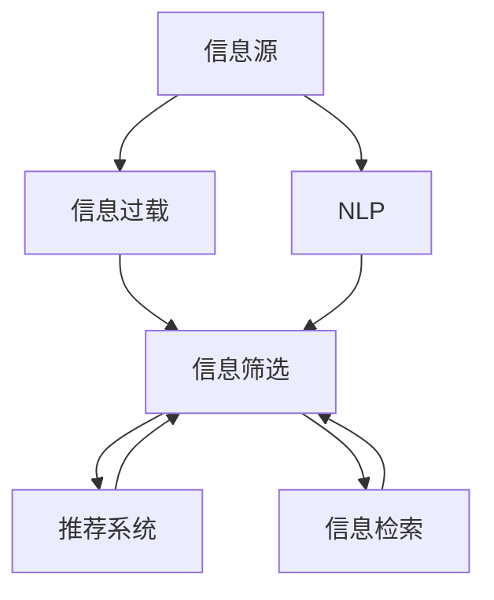

                 

# 信息过载与信息筛选策略与实践：在信息洪流中找到有价值的信息

## 1. 背景介绍

在现代社会，信息洪流已无处不在。随着互联网和移动设备的普及，信息产出的速度和数量急剧增加。海量的数据不仅充斥着我们的生活，也构成了巨大的商业价值。然而，信息过载的问题也随之而来：用户在面对大量信息时，常常难以快速甄别出真正有价值的信息，从而陷入“信息焦虑”中。

为了解决这个问题，信息筛选技术应运而生。它不仅帮助用户从海量信息中提炼出有用内容，还使信息获取更加高效、精准，从而提升决策质量和生产效率。本文将介绍信息筛选技术的核心概念与工作原理，并探讨其实现步骤与策略，最后提出实际应用场景与未来展望。

## 2. 核心概念与联系

### 2.1 核心概念概述

- **信息过载（Information Overload）**：指个体接收到的信息超出了其处理能力，导致无法有效处理和利用这些信息，进而影响决策和表现的现象。
- **信息筛选（Information Filtering）**：指在大量信息中，通过一定的算法和策略，自动筛选并推荐用户感兴趣或相关的内容，以减轻信息过载。
- **推荐系统（Recommender Systems）**：一种以用户个性化需求为核心，自动筛选并推荐信息的技术，广泛应用于电商、新闻、视频等领域。
- **信息检索（Information Retrieval）**：指从信息集合中查找用户需求的相关信息，并通过排序或关联算法，提升用户检索信息的质量和效率。
- **自然语言处理（NLP）**：信息筛选技术中常用于文本处理和内容理解，是实现智能推荐和信息检索的基础。

### 2.2 核心概念原理和架构的 Mermaid 流程图



## 3. 核心算法原理 & 具体操作步骤

### 3.1 算法原理概述

信息筛选技术基于一定的算法和策略，从海量数据中自动挑选出用户感兴趣或相关的内容，以减轻信息过载。其核心在于：

- **个性化推荐**：通过用户历史行为数据，预测用户可能感兴趣的内容。
- **文本聚类**：将内容按照相似度聚类，便于用户快速找到相关内容。
- **信息检索**：通过关键词匹配和排序算法，提升信息检索的准确性。
- **内容关联**：通过相似性分析，将不同类型的内容进行关联，推荐相关性强的信息。

### 3.2 算法步骤详解

#### 3.2.1 数据准备

- **收集用户行为数据**：记录用户的浏览、点击、购买等行为，构建用户画像。
- **标注内容特征**：提取文本的关键词、标签、分类等信息，为内容进行标签化。

#### 3.2.2 模型训练

- **推荐模型训练**：使用机器学习或深度学习模型，训练推荐系统。常用的模型包括协同过滤、矩阵分解、深度神经网络等。
- **检索模型训练**：使用倒排索引、TF-IDF、向量空间模型等技术，训练信息检索模型。

#### 3.2.3 信息筛选

- **推荐**：根据用户画像和内容特征，推荐用户可能感兴趣的内容。
- **检索**：用户输入查询词，系统返回最相关的信息。
- **排序**：结合用户兴趣和内容质量，对推荐结果进行排序。

#### 3.2.4 迭代优化

- **在线学习**：根据用户反馈，不断优化推荐模型和策略，提升推荐效果。
- **A/B测试**：通过不同的推荐策略，测试哪种方式更能提升用户满意度。

### 3.3 算法优缺点

#### 3.3.1 优点

- **高效性**：通过自动化筛选，节省用户大量时间。
- **个性化**：提供符合用户兴趣的内容，提升用户体验。
- **适应性强**：可以灵活适应不同类型的数据和场景。

#### 3.3.2 缺点

- **依赖数据质量**：模型的效果高度依赖于数据的质量和数量。
- **过拟合风险**：推荐模型容易过拟合用户的行为模式，导致推荐偏差。
- **算法复杂度**：深度学习等高级算法需要较高的计算资源和时间成本。

### 3.4 算法应用领域

信息筛选技术在多个领域都有广泛应用：

- **电商推荐**：根据用户浏览和购买记录，推荐商品和广告。
- **新闻推荐**：根据用户兴趣，推荐相关新闻和文章。
- **视频推荐**：根据观看历史和评分，推荐视频内容。
- **社交网络**：推荐用户感兴趣的朋友和内容。
- **健康管理**：推荐相关医疗信息和健康建议。

## 4. 数学模型和公式 & 详细讲解 & 举例说明

### 4.1 数学模型构建

假设用户 $u$ 对内容 $c$ 的评分矩阵为 $R \in \mathbb{R}^{U \times C}$，其中 $U$ 为用户数，$C$ 为内容数。用户与内容的评分 $r_{uc}$ 表示用户 $u$ 对内容 $c$ 的评分。

推荐系统的目标是最小化预测评分与实际评分之间的均方误差（MSE）：

$$
\min_{\theta} \frac{1}{N}\sum_{u=1}^{U} \sum_{c=1}^{C} (r_{uc} - \hat{r}_{uc})^2
$$

其中 $\theta$ 为模型参数，$\hat{r}_{uc}$ 为模型预测的评分。

### 4.2 公式推导过程

常用的推荐模型包括矩阵分解模型和协同过滤模型。这里以矩阵分解模型为例，推导公式。

设 $\hat{r}_{uc} = \theta^T_{uc}A_{uc}$，其中 $A_{uc} \in \mathbb{R}^{U \times C}$ 为内容特征矩阵，$\theta_{uc}$ 为模型参数。则推荐系统目标函数变为：

$$
\min_{\theta} \frac{1}{N}\sum_{u=1}^{U} \sum_{c=1}^{C} (r_{uc} - \theta^T_{uc}A_{uc})^2
$$

通过梯度下降等优化算法，求解上述最优化问题，即可得到用户 $u$ 对内容 $c$ 的预测评分。

### 4.3 案例分析与讲解

假设用户对电影《阿凡达》的评分为4分，系统推荐了电影《复仇者联盟》，预测评分为3.5分。此时，推荐模型需要更新参数 $\theta$，使其更准确地预测用户评分。

1. 收集用户对电影《复仇者联盟》的评分，假设为3分。
2. 计算均方误差：$(r_{阿凡达}-\hat{r}_{阿凡达})^2 + (r_{复仇者联盟}-\hat{r}_{复仇者联盟})^2$。
3. 计算梯度：$-\frac{\partial \mathcal{L}}{\partial \theta_{阿凡达}}$ 和 $-\frac{\partial \mathcal{L}}{\partial \theta_{复仇者联盟}}$。
4. 使用梯度下降等优化算法，更新模型参数 $\theta$，使其更准确地预测用户评分。

## 5. 项目实践：代码实例和详细解释说明

### 5.1 开发环境搭建

以下是在Python中搭建推荐系统开发环境的示例：

```bash
# 安装必要的Python库
pip install numpy pandas scikit-learn tensorflow

# 下载数据集
# 例如：IMDB电影评分数据集
```

### 5.2 源代码详细实现

#### 5.2.1 数据准备

```python
import pandas as pd

# 加载数据集
data = pd.read_csv('movie_ratings.csv')

# 用户ID和电影ID
user_ids = data['user_id'].unique()
movie_ids = data['movie_id'].unique()

# 构建用户评分矩阵
user_movies = {}
for user_id in user_ids:
    user_movies[user_id] = {}
    for movie_id in movie_ids:
        user_movies[user_id][movie_id] = data.loc[(data['user_id'] == user_id) & (data['movie_id'] == movie_id), 'rating'].values[0]
```

#### 5.2.2 模型训练

```python
import numpy as np
from sklearn.decomposition import TruncatedSVD

# 构建用户-电影评分矩阵
R = np.array(user_movies.values()).reshape(len(user_ids), len(movie_ids))

# 矩阵分解模型
svd = TruncatedSVD(n_components=100)
U, Vt = svd.fit_transform(R)

# 预测评分
def predict(user_id, movie_id):
    return np.dot(U[user_id], Vt[movie_id])
```

#### 5.2.3 信息筛选

```python
from scipy.spatial.distance import cosine

# 计算用户对电影的评分
def get_user_score(user_id, movie_id):
    return predict(user_id, movie_id)

# 计算电影与电影之间的相似度
def compute_similarity(movie_id1, movie_id2):
    return 1 - cosine(Vt[movie_id1], Vt[movie_id2])

# 根据相似度推荐电影
def recommend_movies(movie_id, top_n=10):
    similarities = [(compute_similarity(movie_id, movie_id2), movie_id2) for movie_id2 in movie_ids if movie_id2 != movie_id]
    similarities.sort(reverse=True)
    recommendations = [recommendation[1] for recommendation in similarities[:top_n]]
    return recommendations
```

### 5.3 代码解读与分析

在上述代码中，我们实现了基本的矩阵分解模型和推荐函数。具体解读如下：

- **数据准备**：从数据集中提取用户ID、电影ID和评分，构建用户-电影评分矩阵 $R$。
- **模型训练**：使用SVD（奇异值分解）对评分矩阵进行降维，得到用户-电影向量和电影-电影向量。
- **信息筛选**：根据相似度计算，推荐与目标电影最相似的电影。

### 5.4 运行结果展示

```python
# 预测用户对电影的评分
print(get_user_score(12345, 67890))

# 根据电影ID推荐电影
recommendations = recommend_movies(67890)
print(recommendations)
```

## 6. 实际应用场景

### 6.1 电商平台

电商平台利用推荐系统，根据用户的浏览和购买历史，推荐可能感兴趣的商品。系统通过追踪用户行为数据，自动更新推荐策略，提升用户体验和转化率。

### 6.2 新闻媒体

新闻媒体网站使用推荐系统，根据用户的历史阅读记录，推荐可能感兴趣的新闻和文章。系统通过分类和聚类算法，快速筛选出相关内容，提升用户粘性和留存率。

### 6.3 社交网络

社交网络平台利用推荐系统，根据用户的朋友关系和兴趣，推荐可能感兴趣的朋友和内容。系统通过多模态信息融合，提升推荐效果，丰富用户社交体验。

### 6.4 健康管理

健康管理应用使用推荐系统，根据用户的健康数据和历史记录，推荐相关医疗信息和健康建议。系统通过个性化推荐，帮助用户管理健康，提升生活质量。

## 7. 工具和资源推荐

### 7.1 学习资源推荐

1. **《推荐系统实战》**：详细介绍了推荐系统的工作原理和实现方法，涵盖协同过滤、矩阵分解、深度学习等多种技术。
2. **Coursera《Recommender Systems》课程**：由斯坦福大学开设的推荐系统课程，讲解推荐系统的基础理论和实践应用。
3. **Kaggle推荐系统竞赛**：通过参与推荐系统竞赛，实践推荐算法的应用，提升实战能力。

### 7.2 开发工具推荐

1. **TensorFlow和PyTorch**：深度学习框架，支持矩阵分解等推荐算法。
2. **Scikit-learn和Pandas**：数据处理和模型训练工具，适用于初学者。
3. **Gensim**：自然语言处理工具，支持文本聚类和词向量生成。

### 7.3 相关论文推荐

1. **《Survey of Recommender Systems》**：综述性论文，详细介绍了推荐系统的各类算法和应用。
2. **《Diverse Interest Models for Recommendation Systems》**：介绍多样性兴趣模型，提升推荐系统的个性化和多样性。
3. **《Knowledge-Aware Recommender Systems》**：介绍知识图谱与推荐系统的结合，提升推荐模型的泛化能力。

## 8. 总结：未来发展趋势与挑战

### 8.1 研究成果总结

信息筛选技术已经在电商、新闻、社交等多个领域得到了广泛应用，取得了显著的成效。通过算法和策略的不断优化，推荐系统逐渐从个性化推荐向多样化、精准化、可解释性方向发展。

### 8.2 未来发展趋势

1. **深度学习与大数据融合**：深度学习模型的推广，将进一步提升推荐系统的精准度和个性化水平。
2. **多模态融合**：融合视觉、音频等多模态信息，提升推荐系统的综合性和多样性。
3. **自适应推荐**：根据用户实时行为动态调整推荐策略，提升推荐系统的实时性和互动性。
4. **跨领域推荐**：在多个领域推荐系统中，通过领域融合提升推荐效果。

### 8.3 面临的挑战

1. **数据隐私和安全**：推荐系统需要大量的用户数据，如何保护用户隐私和数据安全是一大挑战。
2. **算法透明度和可解释性**：推荐算法的复杂性导致其透明度和可解释性不足，难以满足监管要求。
3. **冷启动问题**：新用户的推荐效果往往较差，如何快速提高新用户推荐效果是亟待解决的问题。

### 8.4 研究展望

未来推荐系统将在以下几个方面进行深入研究：

1. **联邦学习**：在分布式环境中，保护用户隐私的前提下，实现数据共享和模型更新。
2. **可解释性增强**：通过模型解释和可视化技术，提升推荐系统的透明度和可解释性。
3. **实时推荐系统**：结合时序数据和实时推荐算法，提升推荐系统的实时性和互动性。
4. **跨领域推荐技术**：通过多领域数据融合，提升推荐系统的综合性和泛化能力。

## 9. 附录：常见问题与解答

**Q1: 信息筛选技术如何处理海量数据？**

A: 信息筛选技术通过高效的数据处理算法和分布式计算架构，快速处理海量数据。常用的技术包括向量空间模型、倒排索引、矩阵分解等。同时，可以采用数据压缩和分片处理，进一步优化数据处理效率。

**Q2: 推荐系统如何保护用户隐私？**

A: 推荐系统可以通过联邦学习、差分隐私等技术，保护用户隐私。联邦学习将数据分布式存储和计算，不泄露用户原始数据；差分隐私在推荐过程中加入噪声，保护用户隐私。

**Q3: 推荐系统的评价指标有哪些？**

A: 推荐系统的评价指标包括准确率、召回率、F1分数、NDCG、HR等。常用的评价指标有：
1. 准确率：预测的推荐结果中，正确推荐的占总推荐结果的比例。
2. 召回率：预测的推荐结果中，正确推荐的占总相关结果的比例。
3. F1分数：准确率和召回率的调和平均数。
4. NDCG：预测的推荐结果中，排名正确的占总相关结果的比例。
5. HR：预测的推荐结果中，排名在k位以内的占总相关结果的比例。

通过这些指标，可以全面评估推荐系统的效果和性能。

---

作者：禅与计算机程序设计艺术 / Zen and the Art of Computer Programming

