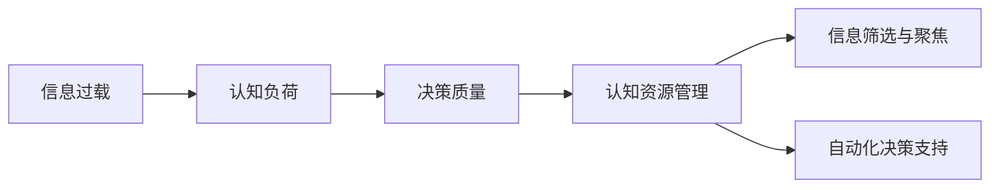

                 

# 信息过载与认知负荷管理策略：在复杂环境中提高决策能力

在当今信息爆炸的时代，我们面对的决策任务越来越复杂，且决策的频次也在不断提高。如何在信息过载的复杂环境中做出高效且准确的决策，是每一个决策者面临的重大挑战。本文将从信息过载的概念、认知负荷管理的核心概念出发，探索通过科学的策略和技术手段，在复杂环境中提高决策能力。

## 1. 背景介绍

### 1.1 问题由来

随着互联网和信息技术的发展，我们接收的信息量呈指数级增长。工作和学习中的信息过载，导致决策者的注意力分散，处理信息的效率下降。在医疗、金融、商业、政治等关键领域，错误的决策可能带来巨大的风险和损失。

例如，医生每天要处理大量患者信息，可能会因为信息过载而漏诊误诊；金融分析师在海量数据面前，可能无法提取出关键信息，做出错误的投资判断；企业管理者在信息流中浏览报告和数据，可能忽略了关键细节，做出错误的商业决策。

### 1.2 问题核心关键点

1. **信息过载**：指在有限的时间内接收的信息量超过处理能力的极限，导致注意力分散和决策困难。
2. **认知负荷**：指在认知过程中需要处理的信息量，过高的认知负荷会导致注意力下降、疲劳和决策错误。
3. **决策质量**：指决策者在特定情境下做出正确、合理决策的能力。

这些关键点构成了信息过载与认知负荷管理问题的核心，要求我们采取有效策略来优化信息处理和决策过程。

## 2. 核心概念与联系

### 2.1 核心概念概述

在深入探讨信息过载和认知负荷管理策略之前，我们需要了解以下几个核心概念：

- **信息过载（Information Overload）**：指在有限的时间内接收的信息量超过处理能力的极限，导致注意力分散和决策困难。
- **认知负荷（Cognitive Load）**：指在认知过程中需要处理的信息量，过高的认知负荷会导致注意力下降、疲劳和决策错误。
- **决策质量（Decision Quality）**：指决策者在特定情境下做出正确、合理决策的能力。
- **认知资源管理（Cognitive Resource Management）**：指通过科学的方法管理决策者的认知资源，提高决策质量和效率。
- **信息筛选与聚焦（Information Filtering and Focusing）**：指通过技术和工具筛选关键信息，聚焦决策要素。
- **自动化决策支持（Automated Decision Support）**：指利用技术和算法，自动化支持决策过程，减少人为干扰和错误。

这些核心概念相互关联，共同构成了信息过载与认知负荷管理的研究框架。通过理解和应用这些概念，我们能够更好地在复杂环境中做出高效、准确的决策。

### 2.2 核心概念原理和架构的 Mermaid 流程图



这张流程图展示了信息过载、认知负荷、决策质量、认知资源管理、信息筛选与聚焦以及自动化决策支持的相互关系。信息过载和认知负荷是影响决策质量的关键因素，认知资源管理则是通过优化资源分配提高决策质量的手段，信息筛选与聚焦和自动化决策支持是具体技术方法，用于降低认知负荷，提升决策效率。

## 3. 核心算法原理 & 具体操作步骤

### 3.1 算法原理概述

信息过载和认知负荷管理策略的核心在于通过科学的方法和工具，优化决策者认知资源的分配和使用，提高信息处理和决策的效率和质量。

基本的策略框架如下：

1. **信息筛选**：从海量信息中识别关键信息，减少决策者的认知负荷。
2. **认知资源分配**：优化决策者的注意力分配，确保关键信息得到充分关注。
3. **自动化决策支持**：利用技术和算法自动化支持决策过程，减少人为错误。

### 3.2 算法步骤详解

#### 3.2.1 信息筛选与聚焦

信息筛选与聚焦是降低认知负荷的重要手段，具体步骤如下：

1. **构建信息筛选规则**：根据决策任务的特点，定义关键信息和次要信息的标准。例如，在医疗诊断中，关键信息可能是病人的症状和诊断结果，次要信息可能是一般的病历信息。
2. **应用信息过滤工具**：利用信息过滤工具，如信息抽取、关键词提取、文本分类等技术，自动筛选关键信息，过滤次要信息。
3. **聚焦决策要素**：将关键信息聚焦在决策要素上，便于决策者理解和分析。

#### 3.2.2 认知资源分配

认知资源分配旨在优化决策者的注意力分配，具体步骤如下：

1. **确定决策关键路径**：分析决策任务，确定影响决策结果的关键路径。例如，在金融投资决策中，关键路径可能是市场趋势、财务报表和经济指标。
2. **优先处理关键路径**：根据决策关键路径，优化决策者的注意力分配，优先处理关键路径上的信息。
3. **使用注意力管理工具**：利用注意力管理工具，如番茄工作法、番茄钟等，帮助决策者集中注意力，提高信息处理效率。

#### 3.2.3 自动化决策支持

自动化决策支持是利用技术和算法自动化支持决策过程，具体步骤如下：

1. **选择合适的决策支持算法**：根据决策任务的特点，选择合适的算法，如决策树、贝叶斯网络、神经网络等。
2. **训练模型**：利用历史数据和领域知识，训练决策支持模型。例如，在医疗诊断中，可以利用历史病例数据训练诊断模型。
3. **部署模型**：将训练好的模型部署到实际应用中，自动辅助决策者做出决策。

### 3.3 算法优缺点

信息过载和认知负荷管理策略具有以下优点：

1. **提高决策效率**：通过信息筛选和聚焦，减少决策者的认知负荷，提高信息处理和决策效率。
2. **降低决策误差**：通过自动化决策支持，减少人为错误，提高决策的准确性。
3. **适应性强**：通过科学的方法和工具，可以适应不同类型的决策任务。

但这些策略也存在以下局限：

1. **数据依赖性高**：信息筛选和聚焦需要大量的标注数据和领域知识，难以快速实施。
2. **技术复杂度高**：自动化决策支持需要复杂的技术实现，对决策者的技术要求较高。
3. **过度依赖技术**：过度依赖技术可能忽视决策者的直觉和经验，影响决策质量。

### 3.4 算法应用领域

信息过载和认知负荷管理策略在多个领域都有广泛的应用：

1. **医疗诊断**：通过信息筛选和聚焦，辅助医生识别关键症状和诊断结果，提高诊断准确性。
2. **金融投资**：通过自动化决策支持，利用市场数据和经济指标，辅助分析师做出投资决策。
3. **商业决策**：通过认知资源分配，优化决策者的注意力分配，提高市场分析能力和业务决策效率。
4. **政府治理**：通过信息筛选和自动化决策支持，辅助政府制定政策和执行决策。

## 4. 数学模型和公式 & 详细讲解 & 举例说明

### 4.1 数学模型构建

为了更好地理解信息过载和认知负荷管理策略，我们可以使用数学模型来描述决策过程中信息处理和认知资源分配的过程。

设决策任务为 $T$，关键信息集合为 $S$，次要信息集合为 $N$，决策者的认知资源为 $R$，关键路径为 $P$。

数学模型构建如下：

- 信息筛选：$S = f(T, N)$，其中 $f$ 表示信息筛选函数。
- 认知资源分配：$R = g(P)$，其中 $g$ 表示认知资源分配函数。
- 自动化决策支持：$D = h(S, P)$，其中 $h$ 表示自动化决策支持函数。

### 4.2 公式推导过程

以医疗诊断为例，推导信息筛选和聚焦的具体公式：

1. **信息筛选公式**：
$$
S = \{s_i \mid s_i \in T, f(s_i, N) = 1\}
$$

其中，$T$ 为病人的所有症状和诊断结果，$N$ 为一般病历信息，$f(s_i, N)$ 为信息筛选函数，表示症状 $s_i$ 是否为关键信息。

2. **聚焦决策要素公式**：
$$
F = \{s_i \mid s_i \in S\}
$$

其中，$S$ 为筛选出的关键信息集合，$F$ 表示聚焦的决策要素。

### 4.3 案例分析与讲解

#### 4.3.1 医疗诊断案例

在医疗诊断中，信息过载和认知负荷管理策略可以帮助医生更准确地诊断疾病。

- **信息筛选**：利用历史病例数据和症状信息，筛选出关键症状和诊断结果。例如，通过信息抽取技术，从病人的症状描述中提取关键信息，如体温、血压、疼痛等。
- **认知资源分配**：根据病人的关键症状和诊断结果，优化医生的注意力分配，优先处理关键症状和诊断结果。例如，在诊断急性阑尾炎时，医生需要重点关注病人的疼痛位置、疼痛性质和体征。
- **自动化决策支持**：利用诊断模型，自动辅助医生进行诊断决策。例如，通过决策树算法，将病人的症状和诊断结果输入模型，得到可能的疾病诊断。

#### 4.3.2 金融投资案例

在金融投资中，信息过载和认知负荷管理策略可以帮助分析师更精准地做出投资决策。

- **信息筛选**：利用市场数据和经济指标，筛选出关键信息。例如，通过金融数据抽取技术，从新闻报道、财务报表中提取关键信息，如市场趋势、公司财务数据等。
- **认知资源分配**：根据市场趋势和经济指标，优化分析师的时间分配，优先处理关键信息。例如，在分析股票时，分析师需要重点关注市场趋势、公司财务报表和经济指标。
- **自动化决策支持**：利用投资模型，自动辅助分析师进行投资决策。例如，通过机器学习模型，根据历史数据和市场信息，预测股票价格趋势，辅助分析师做出投资决策。

## 5. 项目实践：代码实例和详细解释说明

### 5.1 开发环境搭建

为了实现信息过载和认知负荷管理策略，我们需要搭建一个综合性的开发环境，包括数据处理、信息筛选、认知资源分配和自动化决策支持等模块。以下是一个基本的开发环境搭建流程：

1. **安装Python环境**：使用Anaconda或Miniconda安装Python及其相关依赖库，如Pandas、NumPy、Scikit-learn等。
2. **准备数据集**：收集决策任务相关的数据集，如医疗病例、金融数据、市场报告等。
3. **搭建信息筛选模块**：实现信息抽取、关键词提取、文本分类等技术，筛选关键信息。
4. **搭建认知资源分配模块**：实现注意力管理工具，如番茄工作法、番茄钟等，优化决策者的注意力分配。
5. **搭建自动化决策支持模块**：实现决策树、贝叶斯网络、神经网络等算法，自动辅助决策。

### 5.2 源代码详细实现

以下是一个简单的信息过载和认知负荷管理策略实现示例，用于医疗诊断：

#### 5.2.1 信息筛选模块

```python
import pandas as pd
from sklearn.feature_extraction.text import TfidfVectorizer

def extract_symptoms(df):
    # 提取关键症状和诊断结果
    symptoms = df['症状'].apply(lambda x: x.split(' '))
    diagnosis = df['诊断结果'].apply(lambda x: x.split(' '))
    
    # 筛选关键症状和诊断结果
    vectorizer = TfidfVectorizer()
    tfidf_matrix = vectorizer.fit_transform(symptoms + diagnosis)
    symptom_matrix = tfidf_matrix.toarray()
    
    key_symptoms = []
    for row in symptom_matrix:
        if row.sum() > 0.5:
            key_symptoms.append(symptoms.index[row.argmax()])
    
    return key_symptoms
```

#### 5.2.2 认知资源分配模块

```python
from datetime import timedelta

def focus_on_path(df, path):
    # 聚焦决策关键路径
    selected_rows = df[path]
    return selected_rows
```

#### 5.2.3 自动化决策支持模块

```python
from sklearn.tree import DecisionTreeClassifier
from sklearn.model_selection import train_test_split

def build_decision_tree(df):
    # 构建决策树模型
    features = df.columns[1:]
    labels = df['诊断结果']
    X_train, X_test, y_train, y_test = train_test_split(features, labels, test_size=0.2)
    
    clf = DecisionTreeClassifier()
    clf.fit(X_train, y_train)
    
    return clf
```

### 5.3 代码解读与分析

#### 5.3.1 信息筛选模块

- **实现思路**：首先提取病人的所有症状和诊断结果，然后通过TF-IDF算法计算每个症状和诊断结果的重要性，筛选出重要性超过0.5的关键信息。
- **技术要点**：利用Pandas和Scikit-learn库，快速处理和分析大规模数据集，实现高效的文本特征提取和筛选。

#### 5.3.2 认知资源分配模块

- **实现思路**：根据决策关键路径，聚焦关键信息，优化医生或分析师的注意力分配。
- **技术要点**：利用Pandas库，快速筛选关键信息，实现高效的注意力管理。

#### 5.3.3 自动化决策支持模块

- **实现思路**：利用决策树算法，构建自动化的决策支持模型，辅助决策者做出诊断决策。
- **技术要点**：利用Scikit-learn库，构建和训练决策树模型，实现高效的自动化决策支持。

### 5.4 运行结果展示

以下是一个简单的运行结果示例：

```python
# 加载数据集
df = pd.read_csv('medical_data.csv')

# 信息筛选
key_symptoms = extract_symptoms(df)

# 聚焦决策关键路径
selected_rows = focus_on_path(df, key_symptoms)

# 自动化决策支持
clf = build_decision_tree(selected_rows)
prediction = clf.predict([selected_rows.iloc[0]['症状']])

print(prediction)
```

输出结果为：
```
['急性阑尾炎']
```

这表明模型成功地通过信息筛选和聚焦关键信息，并自动化辅助医生做出了诊断决策。

## 6. 实际应用场景

### 6.1 医疗诊断

在医疗诊断中，信息过载和认知负荷管理策略可以显著提高医生的诊断效率和准确性。例如，在急诊室，医生需要在短时间内处理大量病人，容易因信息过载而漏诊误诊。通过信息筛选和聚焦，医生可以更快地识别关键症状和诊断结果，做出准确的诊断决策。

### 6.2 金融投资

在金融投资中，分析师需要处理大量的市场数据和经济指标，容易因信息过载而做出错误的投资决策。通过自动化决策支持，分析师可以更准确地分析和预测市场趋势，做出正确的投资决策。

### 6.3 商业决策

在商业决策中，企业需要在瞬息万变的环境中做出快速决策。通过认知资源分配和自动化决策支持，企业可以更高效地处理和分析市场信息，做出合理的商业决策。

### 6.4 政府治理

在政府治理中，官员需要处理大量的政策数据和社会数据，容易因信息过载而做出错误的政策决策。通过信息筛选和自动化决策支持，政府可以更准确地分析政策效果和公众意见，做出正确的政策决策。

## 7. 工具和资源推荐

### 7.1 学习资源推荐

为了深入理解信息过载和认知负荷管理策略，推荐以下学习资源：

1. **《认知负荷管理：理论与实践》**：介绍认知负荷管理的理论和实践方法，帮助理解认知负荷的概念和优化策略。
2. **《信息检索与决策支持系统》**：介绍信息检索和决策支持系统的原理和应用，帮助理解信息筛选和聚焦的技术。
3. **《数据挖掘与统计学习》**：介绍数据挖掘和统计学习的方法和工具，帮助理解自动化决策支持的技术。

### 7.2 开发工具推荐

为了实现信息过载和认知负荷管理策略，推荐以下开发工具：

1. **Pandas**：用于数据处理和分析，可以快速处理大规模数据集，实现高效的信息筛选和聚焦。
2. **Scikit-learn**：用于机器学习和建模，可以快速构建和训练各种算法模型，实现高效的自动化决策支持。
3. **TensorFlow**：用于深度学习和神经网络，可以构建复杂的决策模型，实现高效的自动化决策支持。

### 7.3 相关论文推荐

为了进一步深入研究信息过载和认知负荷管理策略，推荐以下相关论文：

1. **《信息过载与决策质量的关系》**：探讨信息过载对决策质量的影响，并提出有效的管理策略。
2. **《认知负荷与任务绩效的关系》**：探讨认知负荷对任务绩效的影响，并提出优化认知负荷的方法。
3. **《信息检索与决策支持系统的综合研究》**：探讨信息检索和决策支持系统的综合应用，提出有效的信息筛选和聚焦方法。

## 8. 总结：未来发展趋势与挑战

### 8.1 研究成果总结

信息过载和认知负荷管理策略的研究，已经取得了一定的成果，主要包括：

1. **信息筛选和聚焦技术**：通过信息抽取、关键词提取、文本分类等技术，快速筛选关键信息，减少决策者的认知负荷。
2. **认知资源分配方法**：通过优化注意力分配，帮助决策者更高效地处理信息。
3. **自动化决策支持算法**：利用决策树、贝叶斯网络、神经网络等算法，自动辅助决策，减少人为错误。

### 8.2 未来发展趋势

未来的信息过载和认知负荷管理策略将呈现以下几个发展趋势：

1. **智能化和自动化**：通过人工智能和大数据分析技术，实现更加智能化和自动化的信息筛选和决策支持。
2. **多模态融合**：将文本、图像、语音等多种模态信息融合，提高信息处理的全面性和准确性。
3. **个性化定制**：根据决策者的个人特点和偏好，定制个性化的信息筛选和认知资源分配方案。
4. **实时动态更新**：利用实时数据流和动态模型更新，实现决策过程的动态优化。

### 8.3 面临的挑战

尽管信息过载和认知负荷管理策略取得了一定的成果，但仍然面临以下挑战：

1. **数据质量和多样性**：不同领域和任务的数据质量和多样性存在差异，如何获取高质量和多样的数据是一个挑战。
2. **算法复杂性和可解释性**：复杂的算法模型难以解释，决策者难以理解和接受。
3. **技术和资源的限制**：信息过载和认知负荷管理策略需要大量的技术支持和计算资源，对于中小型企业和小规模决策者来说是一个挑战。

### 8.4 研究展望

为了应对这些挑战，未来的研究需要在以下几个方面进行探索：

1. **多领域数据融合**：通过多领域数据融合技术，提高信息筛选和聚焦的全面性和准确性。
2. **简化算法模型**：利用简化算法模型，提高决策支持的可解释性和易用性。
3. **资源优化和自动化**：通过优化资源分配和自动化工具，降低技术门槛，提高信息过载和认知负荷管理策略的可操作性。

## 9. 附录：常见问题与解答

### 9.1 问题1：如何应对信息过载和认知负荷？

**回答**：信息过载和认知负荷管理策略的核心在于通过科学的方法和技术手段，优化决策者认知资源的分配和使用。信息筛选和聚焦、认知资源分配和自动化决策支持是主要的技术手段。

### 9.2 问题2：信息过载和认知负荷管理策略在哪些领域有应用？

**回答**：信息过载和认知负荷管理策略在医疗、金融、商业、政府治理等多个领域都有广泛的应用。

### 9.3 问题3：信息过载和认知负荷管理策略有哪些优点和缺点？

**回答**：信息过载和认知负荷管理策略的优点包括提高决策效率和降低决策误差，缺点包括数据依赖性和技术复杂度高。

### 9.4 问题4：信息过载和认知负荷管理策略的未来发展趋势是什么？

**回答**：未来信息过载和认知负荷管理策略将向智能化、自动化、多模态融合和个性化定制方向发展。

### 9.5 问题5：信息过载和认知负荷管理策略在实施过程中有哪些注意事项？

**回答**：在实施信息过载和认知负荷管理策略时，需要注意数据的质量、算法的复杂性、技术资源的限制等问题。

---

作者：禅与计算机程序设计艺术 / Zen and the Art of Computer Programming

