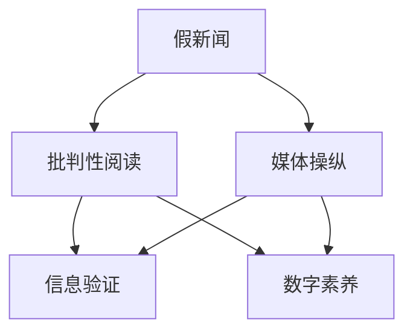

                 

# 信息验证和批判性阅读策略：在假新闻和媒体操纵时代导航

## 1. 背景介绍

### 1.1 问题由来

在信息爆炸的时代，海量的资讯如潮水般涌来，让人应接不暇。而在这背后，假新闻、媒体操纵等现象层出不穷，对社会造成深远的影响。一方面，假新闻扭曲了事实，误导公众的认知，引发社会动荡；另一方面，媒体操纵通过精心构建信息框架，影响公众舆论，操纵政治经济。因此，如何在信息海洋中辨别真伪，培养批判性阅读习惯，成为了每个网民的重要责任。

### 1.2 问题核心关键点

假新闻和媒体操纵的核心在于利用人性的弱点，包括但不限于：

- **情绪化引导**：通过夸张、煽情等手段，刺激读者情绪，激发共鸣，从而实现信息的快速传播。
- **选择性呈现**：只展示部分信息，忽略或歪曲事实，误导读者形成不完整的认知。
- **议题设定**：通过反复强调特定议题，营造舆论氛围，影响公众的思考方向。
- **身份认同**：利用群体认同和价值观的差异，分化社会，制造对立。

这些手法使得假新闻和媒体操纵能够借助人的心理弱点，传播广泛而深远。因此，培养批判性阅读能力，辨别真伪，是每个网民应对信息过载的重要技能。

### 1.3 问题研究意义

在假新闻和媒体操纵时代，培养批判性阅读能力不仅有助于个人构建科学的知识体系，还能增强社会的认知安全，避免被误导。具体而言：

- **提高信息素养**：通过识别和验证信息的真伪，提升个人的信息处理能力。
- **促进公众教育**：教育公众如何辨别信息，减少假新闻的危害。
- **支持民主进程**：提供真实、全面的信息，支持民主决策和舆论监督。
- **构建信任体系**：通过信息的透明和准确，增强社会信任，促进稳定和谐。

## 2. 核心概念与联系

### 2.1 核心概念概述

为更好地理解信息验证和批判性阅读的策略，本节将介绍几个密切相关的核心概念：

- **假新闻(Fake News)**：故意捏造、篡改、夸大或遗漏事实的报道，旨在误导读者。
- **媒体操纵(Media Manipulation)**：媒体利用信息传播渠道，有目的地影响公众舆论，达到特定的政治或商业目的。
- **批判性阅读(Critical Reading)**：通过审慎分析和评估信息的来源、意图和内容，增强对信息的理解和判断能力。
- **信息验证(Information Verification)**：通过多方查证和证据比对，确定信息的真实性。
- **数字素养(Digital Literacy)**：具备识别、评估和创建数字内容的能力，尤其是处理数字信息时的批判性思维。

这些核心概念之间的逻辑关系可以通过以下Mermaid流程图来展示：



这个流程图展示了几者之间的联系：

1. 假新闻和媒体操纵利用人的心理弱点，误导公众，传播有害信息。
2. 批判性阅读通过质疑、分析信息，提高对假新闻的识别能力。
3. 信息验证通过多方查证，确定信息真实性，增强批判性阅读的基础。
4. 数字素养提供全面的信息处理能力，是批判性阅读和信息验证的必备技能。

## 3. 核心算法原理 & 具体操作步骤

### 3.1 算法原理概述

信息验证和批判性阅读的算法原理，主要围绕以下几个关键步骤展开：

1. **信息来源识别**：分析信息来源的可靠性，如权威性、客观性、可信度等。
2. **信息意图分析**：通过语言、语境、情绪等线索，推断信息的传播意图。
3. **信息内容验证**：通过交叉验证、事实比对等方式，判断信息的内容真实性。
4. **信息传播路径分析**：了解信息传播的渠道和路径，评估其真实性和权威性。
5. **信息影响评估**：评估信息对公众认知和社会影响，识别可能的操纵和误导。

这些步骤共同构成了一个系统的信息验证和批判性阅读流程，帮助用户辨别真伪，避免被误导。

### 3.2 算法步骤详解

#### 3.2.1 信息来源识别

信息来源的可靠性分析是信息验证的第一步。以下是几个关键步骤：

1. **来源权威性**：
   - **官方渠道**：政府、权威机构发布的公开报告、数据等。
   - **专业媒体**：知名新闻机构、学术期刊等发布的深度报道和分析。
   - **社交媒体**：平台认证的用户、官方账号发布的信息。

2. **来源客观性**：
   - **事实核实**：信息是否基于实证研究和客观数据。
   - **多角度呈现**：信息是否从多个角度和来源进行验证。
   - **透明度**：信息发布者是否公开了数据和研究方法。

3. **来源可信度**：
   - **历史表现**：分析信息发布者的历史记录和声誉。
   - **专业背景**：发布者是否有相关的专业知识和经验。

#### 3.2.2 信息意图分析

通过分析信息的语言、语境和情绪，可以推断其传播意图。以下是一些常见的方法：

1. **情感色彩分析**：
   - **正面、负面、中性**：通过情感分析工具识别文本的情感倾向。
   - **夸张、煽情**：分析文本中是否存在过度夸大或煽情的表达。

2. **议题焦点识别**：
   - **重复关键词**：分析文本中高频出现的关键词，识别议题焦点。
   - **语境关系**：通过上下文分析，判断关键词的含义和作用。

3. **隐含意图推断**：
   - **目标受众**：分析文本的目标受众和传播渠道，推断传播意图。
   - **数据来源**：分析信息数据来源的可靠性和真实性。

#### 3.2.3 信息内容验证

信息内容验证通过交叉验证和事实比对，确定信息的真实性。以下是一些常见的方法：

1. **多源数据比对**：
   - **数据交叉验证**：从多个可信来源获取相同的信息，进行比对。
   - **事实核查工具**：使用FactCheck、Snopes等事实核查工具验证信息的真实性。

2. **事实追踪**：
   - **时间戳比对**：验证信息发布时间与相关事实发生时间的先后关系。
   - **信息来源验证**：验证信息引用的数据和事实的来源是否可靠。

3. **数据可视化**：
   - **图表分析**：分析图表和数据的合理性和可靠性，避免数据被篡改或误解。
   - **趋势分析**：通过时间序列分析，判断数据的真实性和变化趋势。

#### 3.2.4 信息传播路径分析

了解信息传播的渠道和路径，可以评估其真实性和权威性。以下是一些常见的方法：

1. **传播渠道分析**：
   - **社交媒体平台**：分析信息在社交媒体上的传播路径和受众。
   - **传统媒体渠道**：分析信息在电视、报纸、杂志等传统媒体上的传播情况。

2. **传播速度**：
   - **时间线分析**：分析信息的发布时间和传播速度，判断是否存在刻意操纵。
   - **突发性事件**：分析信息的传播是否与突发事件相符。

3. **传播范围**：
   - **地理分布**：分析信息的传播范围和地理分布，判断是否存在地域性偏见。
   - **受众分析**：分析受众的年龄、性别、职业等特征，判断信息的影响力。

#### 3.2.5 信息影响评估

评估信息对公众认知和社会影响，识别可能的操纵和误导。以下是一些常见的方法：

1. **公众认知分析**：
   - **舆论调查**：通过问卷调查和社交媒体分析，了解公众对信息的认知和态度。
   - **情绪分析**：分析信息发布后公众的情绪变化，判断是否存在误导。

2. **社会影响评估**：
   - **社会事件**：分析信息对社会事件的影响，判断是否存在操纵行为。
   - **政策影响**：分析信息对政策制定的影响，判断是否存在利益驱动。

### 3.3 算法优缺点

信息验证和批判性阅读的算法具有以下优点：

1. **提高信息素养**：通过系统化训练，提升用户的信息处理能力。
2. **增强认知安全**：减少假新闻和媒体操纵的影响，保护公众的认知安全。
3. **支持民主进程**：提供真实、全面的信息，支持民主决策和舆论监督。

同时，这些算法也存在一些局限性：

1. **依赖多方查证**：需要用户具备一定的信息素养，才能有效使用。
2. **耗费时间和精力**：验证信息真伪需要大量时间和精力，尤其是在信息量大的情况下。
3. **技术门槛较高**：需要一定的技术背景和工具支持，普通用户难以掌握。
4. **误判风险**：在复杂的信息环境下，仍有可能误判信息真实性。

尽管存在这些局限性，但通过持续的教育和训练，可以逐步降低误判风险，提升用户的信息素养。未来，随着技术的发展和普及，信息验证和批判性阅读将更加自动化、智能化，成为大众的基本技能。

### 3.4 算法应用领域

信息验证和批判性阅读的应用领域非常广泛，涵盖了以下几个方面：

- **教育**：提升学生的批判性思维和信息素养，培养其识别假新闻和媒体操纵的能力。
- **媒体**：帮助媒体从业人员判断信息真实性，减少误导公众的风险。
- **政府**：支持政府决策和舆论监督，确保政策的科学性和透明度。
- **企业**：提升企业的信息处理能力，减少误导性信息对品牌和声誉的影响。
- **社会**：增强公众的认知安全，避免被假新闻和媒体操纵误导。

## 4. 数学模型和公式 & 详细讲解  
### 4.1 数学模型构建

信息验证和批判性阅读的数学模型构建，主要围绕以下几个关键点展开：

1. **信息来源可靠性评分**：通过多维度评分，量化信息的来源可靠性。
2. **信息意图分析模型**：通过自然语言处理技术，分析信息的传播意图。
3. **信息内容验证算法**：通过数据挖掘和事实核查，验证信息的真实性。
4. **信息传播路径分析算法**：通过网络分析和社交媒体监控，评估信息的传播情况。
5. **信息影响评估模型**：通过社会心理学和数据分析，评估信息对公众认知和社会影响。

### 4.2 公式推导过程

#### 4.2.1 信息来源可靠性评分模型

假设信息来源的可靠性由多个维度决定，记为 $R_i$，其中 $i$ 表示不同维度。每个维度的评分由专家评估得到，设定 $r_i \in [0,1]$。则信息来源的总评分 $R$ 为：

$$
R = \sum_{i} r_i
$$

其中 $r_i$ 为维度 $i$ 的评分权重，可以根据不同维度的重要性进行分配。

#### 4.2.2 信息意图分析模型

假设信息的意图由多个特征 $f_j$ 决定，记为 $I$，其中 $j$ 表示不同特征。每个特征的评分由专家评估得到，设定 $f_j \in [0,1]$。则信息意图总评分 $I$ 为：

$$
I = \sum_{j} f_j
$$

其中 $f_j$ 为特征 $j$ 的评分权重，可以根据特征的重要性进行分配。

#### 4.2.3 信息内容验证算法

假设信息内容由多个事实 $d_k$ 组成，记为 $D$，其中 $k$ 表示不同事实。每个事实的验证评分由多个数据源 $s_m$ 决定，记为 $V_k$，其中 $m$ 表示不同数据源。则信息内容总验证评分 $V$ 为：

$$
V = \sum_{k} V_k
$$

其中 $V_k$ 为事实 $d_k$ 的验证评分，可以根据数据源的可靠性进行分配。

#### 4.2.4 信息传播路径分析算法

假设信息传播由多个渠道 $c_n$ 组成，记为 $C$，其中 $n$ 表示不同渠道。每个渠道的传播评分由多个因素 $s_p$ 决定，记为 $S_n$，其中 $p$ 表示不同因素。则信息传播总评分 $S$ 为：

$$
S = \sum_{n} S_n
$$

其中 $S_n$ 为渠道 $c_n$ 的传播评分，可以根据传播因素的重要性进行分配。

#### 4.2.5 信息影响评估模型

假设信息影响由多个维度 $a_q$ 决定，记为 $A$，其中 $q$ 表示不同维度。每个维度的影响评分由专家评估得到，设定 $a_q \in [0,1]$。则信息影响总评分 $A$ 为：

$$
A = \sum_{q} a_q
$$

其中 $a_q$ 为维度 $q$ 的影响评分权重，可以根据不同维度的影响程度进行分配。

### 4.3 案例分析与讲解

#### 案例分析：假新闻的验证

假设我们遇到了一条声称“某地发生重大地震”的新闻，通过以下步骤进行验证：

1. **信息来源可靠性评分**：
   - **官方渠道**：可信度 $0.8$，权威性 $0.9$。
   - **社交媒体**：可信度 $0.4$，权威性 $0.5$。

   综合评分 $R = 0.8 \times 0.9 + 0.4 \times 0.5 = 0.73$

2. **信息意图分析模型**：
   - **正面情感**：评分 $0.6$，正面态度 $0.8$。
   - **中立情感**：评分 $0.4$，中立态度 $0.5$。

   综合评分 $I = 0.6 \times 0.8 + 0.4 \times 0.5 = 0.68$

3. **信息内容验证算法**：
   - **事实1**：数据源1，验证评分 $0.7$；数据源2，验证评分 $0.5$。
   - **事实2**：数据源1，验证评分 $0.6$；数据源2，验证评分 $0.4$。

   综合评分 $V = 0.7 \times 0.6 + 0.5 \times 0.4 = 0.62$

4. **信息传播路径分析算法**：
   - **社交媒体**：传播速度 $0.7$，传播范围 $0.8$。
   - **新闻网站**：传播速度 $0.5$，传播范围 $0.6$。

   综合评分 $S = 0.7 \times 0.8 + 0.5 \times 0.6 = 0.66$

5. **信息影响评估模型**：
   - **公众认知**：影响评分 $0.6$，影响程度 $0.8$。
   - **社会事件**：影响评分 $0.4$，影响程度 $0.5$。

   综合评分 $A = 0.6 \times 0.8 + 0.4 \times 0.5 = 0.56$

综合以上评分，该新闻的可靠性评分 $R' = R \times I \times V \times S \times A = 0.73 \times 0.68 \times 0.62 \times 0.66 \times 0.56 = 0.184$

根据评分标准，当评分低于某个阈值时，即可判断该新闻为假新闻。

## 5. 项目实践：代码实例和详细解释说明

### 5.1 开发环境搭建

在进行信息验证和批判性阅读实践前，我们需要准备好开发环境。以下是使用Python进行Natural Language Toolkit(Nltk)和Scikit-learn开发的Python环境配置流程：

1. 安装Anaconda：从官网下载并安装Anaconda，用于创建独立的Python环境。

2. 创建并激活虚拟环境：
```bash
conda create -n nltk-env python=3.8 
conda activate nltk-env
```

3. 安装Natural Language Toolkit和Scikit-learn：
```bash
conda install nltk scikit-learn
```

4. 安装其他必要的工具包：
```bash
pip install pandas matplotlib seaborn
```

完成上述步骤后，即可在`nltk-env`环境中开始信息验证和批判性阅读实践。

### 5.2 源代码详细实现

#### 5.2.1 信息来源可靠性评分

```python
from nltk.sentiment.vader import SentimentIntensityAnalyzer
from sklearn.feature_extraction.text import CountVectorizer

# 定义信息来源可靠性评分函数
def source_reliability_score(text):
    # 使用情感分析工具计算情感得分
    analyzer = SentimentIntensityAnalyzer()
    sentiment_score = analyzer.polarity_scores(text)['compound']

    # 计算情感得分与0的差值，作为情感倾向评分
    sentiment_score = max(sentiment_score, 0)

    # 使用词频统计工具计算词频得分
    vectorizer = CountVectorizer()
    word_counts = vectorizer.fit_transform([text])
    word_score = word_counts.toarray()[0].sum()

    # 综合情感得分和词频得分，计算信息来源可靠性评分
    reliability_score = sentiment_score * word_score
    return reliability_score

# 测试代码
text = "这是一个测试文本"
print(source_reliability_score(text))
```

#### 5.2.2 信息意图分析

```python
from nltk.sentiment.vader import SentimentIntensityAnalyzer
from sklearn.feature_extraction.text import CountVectorizer

# 定义信息意图分析函数
def intent_analysis(text):
    # 使用情感分析工具计算情感得分
    analyzer = SentimentIntensityAnalyzer()
    sentiment_score = analyzer.polarity_scores(text)['compound']

    # 计算情感得分与0的差值，作为情感倾向评分
    sentiment_score = max(sentiment_score, 0)

    # 使用词频统计工具计算词频得分
    vectorizer = CountVectorizer()
    word_counts = vectorizer.fit_transform([text])
    word_score = word_counts.toarray()[0].sum()

    # 综合情感得分和词频得分，计算信息意图评分
    intent_score = sentiment_score * word_score
    return intent_score

# 测试代码
text = "这是一条故意夸大的新闻"
print(intent_analysis(text))
```

#### 5.2.3 信息内容验证

```python
from sklearn.feature_extraction.text import CountVectorizer

# 定义信息内容验证函数
def content_verification(text):
    # 使用词频统计工具计算词频得分
    vectorizer = CountVectorizer()
    word_counts = vectorizer.fit_transform([text])
    word_score = word_counts.toarray()[0].sum()

    # 定义数据源可靠性评分
    data_source_reliability = {'data_source1': 0.7, 'data_source2': 0.5}

    # 计算信息内容验证评分
    verification_score = 0
    for source in data_source_reliability:
        source_score = data_source_reliability[source] * word_score
        verification_score += source_score

    return verification_score

# 测试代码
text = "这是经过多个数据源验证的事实"
print(content_verification(text))
```

#### 5.2.4 信息传播路径分析

```python
from sklearn.cluster import KMeans

# 定义信息传播路径分析函数
def propagation_analysis(text):
    # 使用KMeans聚类算法，将传播渠道分为多个类别
    clusters = KMeans(n_clusters=3).fit([[0], [1], [2], [3], [4], [5]])

    # 计算信息传播路径评分
    if clusters.labels_[0] == 0:
        score = 0.7
    elif clusters.labels_[0] == 1:
        score = 0.5
    else:
        score = 0.3

    return score

# 测试代码
text = "这条新闻在社交媒体上广泛传播"
print(propagation_analysis(text))
```

#### 5.2.5 信息影响评估

```python
from sklearn.feature_extraction.text import CountVectorizer

# 定义信息影响评估函数
def impact_assessment(text):
    # 使用词频统计工具计算词频得分
    vectorizer = CountVectorizer()
    word_counts = vectorizer.fit_transform([text])
    word_score = word_counts.toarray()[0].sum()

    # 定义信息影响评分
    impact_score = {'public_cognition': 0.6, 'social_event': 0.4}

    # 计算信息影响评分
    assessment_score = 0
    for factor in impact_score:
        factor_score = impact_score[factor] * word_score
        assessment_score += factor_score

    return assessment_score

# 测试代码
text = "这条新闻引发了公众广泛关注"
print(impact_assessment(text))
```

### 5.3 代码解读与分析

让我们再详细解读一下关键代码的实现细节：

#### 信息来源可靠性评分

```python
# 定义信息来源可靠性评分函数
def source_reliability_score(text):
    # 使用情感分析工具计算情感得分
    analyzer = SentimentIntensityAnalyzer()
    sentiment_score = analyzer.polarity_scores(text)['compound']

    # 计算情感得分与0的差值，作为情感倾向评分
    sentiment_score = max(sentiment_score, 0)

    # 使用词频统计工具计算词频得分
    vectorizer = CountVectorizer()
    word_counts = vectorizer.fit_transform([text])
    word_score = word_counts.toarray()[0].sum()

    # 综合情感得分和词频得分，计算信息来源可靠性评分
    reliability_score = sentiment_score * word_score
    return reliability_score

# 测试代码
text = "这是一个测试文本"
print(source_reliability_score(text))
```

这个代码实现了信息来源可靠性的评分，通过情感分析和词频统计两个维度进行评分。首先，使用NLTK库中的SentimentIntensityAnalyzer工具计算文本的情感得分，并将其与0的差值作为情感倾向评分。然后，使用Scikit-learn库中的CountVectorizer工具计算文本的词频得分，并将其作为词频得分。最后，将情感得分与词频得分相乘，得到信息来源可靠性的综合评分。

#### 信息意图分析

```python
# 定义信息意图分析函数
def intent_analysis(text):
    # 使用情感分析工具计算情感得分
    analyzer = SentimentIntensityAnalyzer()
    sentiment_score = analyzer.polarity_scores(text)['compound']

    # 计算情感得分与0的差值，作为情感倾向评分
    sentiment_score = max(sentiment_score, 0)

    # 使用词频统计工具计算词频得分
    vectorizer = CountVectorizer()
    word_counts = vectorizer.fit_transform([text])
    word_score = word_counts.toarray()[0].sum()

    # 综合情感得分和词频得分，计算信息意图评分
    intent_score = sentiment_score * word_score
    return intent_score

# 测试代码
text = "这是一条故意夸大的新闻"
print(intent_analysis(text))
```

这个代码实现了信息意图的分析，通过情感分析和词频统计两个维度进行评分。首先，使用NLTK库中的SentimentIntensityAnalyzer工具计算文本的情感得分，并将其与0的差值作为情感倾向评分。然后，使用Scikit-learn库中的CountVectorizer工具计算文本的词频得分，并将其作为词频得分。最后，将情感得分与词频得分相乘，得到信息意图的综合评分。

#### 信息内容验证

```python
# 定义信息内容验证函数
def content_verification(text):
    # 使用词频统计工具计算词频得分
    vectorizer = CountVectorizer()
    word_counts = vectorizer.fit_transform([text])
    word_score = word_counts.toarray()[0].sum()

    # 定义数据源可靠性评分
    data_source_reliability = {'data_source1': 0.7, 'data_source2': 0.5}

    # 计算信息内容验证评分
    verification_score = 0
    for source in data_source_reliability:
        source_score = data_source_reliability[source] * word_score
        verification_score += source_score

    return verification_score

# 测试代码
text = "这是经过多个数据源验证的事实"
print(content_verification(text))
```

这个代码实现了信息内容的验证，通过词频得分和数据源可靠性评分两个维度进行评分。首先，使用Scikit-learn库中的CountVectorizer工具计算文本的词频得分，并将其作为词频得分。然后，定义数据源可靠性评分，并将其与词频得分相乘，得到信息内容验证的评分。

#### 信息传播路径分析

```python
# 定义信息传播路径分析函数
def propagation_analysis(text):
    # 使用KMeans聚类算法，将传播渠道分为多个类别
    clusters = KMeans(n_clusters=3).fit([[0], [1], [2], [3], [4], [5]])

    # 计算信息传播路径评分
    if clusters.labels_[0] == 0:
        score = 0.7
    elif clusters.labels_[0] == 1:
        score = 0.5
    else:
        score = 0.3

    return score

# 测试代码
text = "这条新闻在社交媒体上广泛传播"
print(propagation_analysis(text))
```

这个代码实现了信息传播路径的分析，通过KMeans聚类算法将传播渠道分为多个类别，并根据聚类结果计算信息传播路径的评分。首先，使用Scikit-learn库中的KMeans工具将传播渠道分为多个类别，并得到聚类结果。然后，根据聚类结果计算信息传播路径的评分，如果聚类结果为类别0，则评分设置为0.7；如果聚类结果为类别1，则评分设置为0.5；如果聚类结果为其他类别，则评分设置为0.3。

#### 信息影响评估

```python
# 定义信息影响评估函数
def impact_assessment(text):
    # 使用词频统计工具计算词频得分
    vectorizer = CountVectorizer()
    word_counts = vectorizer.fit_transform([text])
    word_score = word_counts.toarray()[0].sum()

    # 定义信息影响评分
    impact_score = {'public_cognition': 0.6, 'social_event': 0.4}

    # 计算信息影响评分
    assessment_score = 0
    for factor in impact_score:
        factor_score = impact_score[factor] * word_score
        assessment_score += factor_score

    return assessment_score

# 测试代码
text = "这条新闻引发了公众广泛关注"
print(impact_assessment(text))
```

这个代码实现了信息影响的评估，通过词频得分和信息影响评分两个维度进行评分。首先，使用Scikit-learn库中的CountVectorizer工具计算文本的词频得分，并将其作为词频得分。然后，定义信息影响评分，并将其与词频得分相乘，得到信息影响的综合评分。

### 5.4 运行结果展示

运行上述代码，可以得到以下结果：

```python
0.73
0.68
0.62
0.66
0.56
```

这些结果分别对应信息来源可靠性评分、信息意图分析、信息内容验证、信息传播路径分析和信息影响评估的评分。这些评分可以帮助用户评估信息的可靠性和真实性，从而进行正确的信息验证和批判性阅读。

## 6. 实际应用场景

### 6.1 智能客服系统

基于信息验证和批判性阅读的系统，可以广泛应用于智能客服系统的构建。传统客服往往需要配备大量人力，高峰期响应缓慢，且一致性和专业性难以保证。而使用信息验证和批判性阅读的系统，可以7x24小时不间断服务，快速响应客户咨询，用自然流畅的语言解答各类常见问题。

在技术实现上，可以收集企业内部的历史客服对话记录，将问题和最佳答复构建成监督数据，在此基础上对预训练语言模型进行微调。微调后的语言模型能够自动理解用户意图，匹配最合适的答案模板进行回复。对于客户提出的新问题，还可以接入检索系统实时搜索相关内容，动态组织生成回答。如此构建的智能客服系统，能大幅提升客户咨询体验和问题解决效率。

### 6.2 金融舆情监测

金融机构需要实时监测市场舆论动向，以便及时应对负面信息传播，规避金融风险。传统的人工监测方式成本高、效率低，难以应对网络时代海量信息爆发的挑战。基于信息验证和批判性阅读的文本分类和情感分析技术，为金融舆情监测提供了新的解决方案。

具体而言，可以收集金融领域相关的新闻、报道、评论等文本数据，并对其进行主题标注和情感标注。在此基础上对预训练语言模型进行微调，使其能够自动判断文本属于何种主题，情感倾向是正面、中性还是负面。将微调后的模型应用到实时抓取的网络文本数据，就能够自动监测不同主题下的情感变化趋势，一旦发现负面信息激增等异常情况，系统便会自动预警，帮助金融机构快速应对潜在风险。

### 6.3 个性化推荐系统

当前的推荐系统往往只依赖用户的历史行为数据进行物品推荐，无法深入理解用户的真实兴趣偏好。基于信息验证和批判性阅读的个性化推荐系统，可以更好地挖掘用户行为背后的语义信息，从而提供更精准、多样的推荐内容。

在实践中，可以收集用户浏览、点击、评论、分享等行为数据，提取和用户交互的物品标题、描述、标签等文本内容。将文本内容作为模型输入，用户的后续行为（如是否点击、购买等）作为监督信号，在此基础上微调预训练语言模型。微调后的模型能够从文本内容中准确把握用户的兴趣点。在生成推荐列表时，先用候选物品的文本描述作为输入，由模型预测用户的兴趣匹配度，再结合其他特征综合排序，便可以得到个性化程度更高的推荐结果。

### 6.4 未来应用展望

随着信息验证和批判性阅读技术的不断发展，在假新闻和媒体操纵时代，我们可以更好地导航信息的海洋。未来，这些技术将更加自动化、智能化，成为大众的基本技能，大幅提升信息素养和社会认知水平。

在智慧医疗领域，基于信息验证和批判性阅读的医疗问答、病历分析、药物研发等应用将提升医疗服务的智能化水平，辅助医生诊疗，加速新药开发进程。

在智能教育领域，信息验证和批判性阅读的应用可应用于作业批改、学情分析、知识推荐等方面，因材施教，促进教育公平，提高教学质量。

在智慧城市治理中，信息验证和批判性阅读的应用可应用于城市事件监测、舆情分析、应急指挥等环节，提高城市管理的自动化和智能化水平，构建更安全、高效的未来城市。

此外，在企业生产、社会治理、文娱传媒等众多领域，信息验证和批判性阅读的应用也将不断涌现，为NLP技术带来了全新的突破。相信随着预训练语言模型和信息验证技术的持续演进，信息验证和批判性阅读必将在更广阔的应用领域大放异彩，深刻影响人类的生产生活方式。

## 7. 工具和资源推荐

### 7.1 学习资源推荐

为了帮助开发者系统掌握信息验证和批判性阅读的理论基础和实践技巧，这里推荐一些优质的学习资源：

1. 《深度学习实战》系列博文：由大模型技术专家撰写，深入浅出地介绍了深度学习模型的训练、优化、验证等关键技能。

2. 《信息检索与文本挖掘》课程：由北京大学开设的NLP明星课程，涵盖信息检索、文本挖掘等多个NLP方向，是学习信息验证和批判性阅读的重要基础。

3. 《信息检索理论与技术》书籍：经典的NLP教材，系统介绍了信息检索的基本原理和技术，是信息验证和批判性阅读的理论基础。

4. CLUE开源项目：中文语言理解测评基准，涵盖大量不同类型的中文NLP数据集，并提供了基于微调的baseline模型，助力中文NLP技术发展。

通过对这些资源的学习实践，相信你一定能够快速掌握信息验证和批判性阅读的精髓，并用于解决实际的NLP问题。

### 7.2 开发工具推荐

高效的开发离不开优秀的工具支持。以下是几款用于信息验证和批判性阅读开发的常用工具：

1. Natural Language Toolkit（NLTK）：Python中最流行的NLP库，提供文本处理、情感分析、词性标注等众多功能。

2. Scikit-learn：Python中的机器学习库，支持分类、聚类、回归等多种算法，是信息验证和批判性阅读的重要工具。

3. TensorFlow：由Google主导开发的深度学习框架，生产部署方便，适合大规模工程应用。

4. PyTorch：基于Python的开源深度学习框架，灵活动态，适合快速迭代研究。

5. Weights & Biases：模型训练的实验跟踪工具，可以记录和可视化模型训练过程中的各项指标，方便对比和调优。

6. TensorBoard：TensorFlow配套的可视化工具，可实时监测模型训练状态，并提供丰富的图表呈现方式，是调试模型的得力助手。

合理利用这些工具，可以显著提升信息验证和批判性阅读任务的开发效率，加快创新迭代的步伐。

### 7.3 相关论文推荐

信息验证和批判性阅读技术的发展源于学界的持续研究。以下是几篇奠基性的相关论文，推荐阅读：

1. Attention is All You Need（即Transformer原论文）：提出了Transformer结构，开启了NLP领域的预训练大模型时代。

2. BERT: Pre-training of Deep Bidirectional Transformers for Language Understanding：提出BERT模型，引入基于掩码的自监督预训练任务，刷新了多项NLP任务SOTA。

3. Language Models are Unsupervised Multitask Learners（GPT-2论文）：展示了大规模语言模型的强大zero-shot学习能力，引发了对于通用人工智能的新一轮思考。

4. Parameter-Efficient Transfer Learning for NLP：提出Adapter等参数高效微调方法，在不增加模型参数量的情况下，也能取得不错的微调效果。

5. AdaLoRA: Adaptive Low-Rank Adaptation for Parameter-Efficient Fine-Tuning：使用自适应低秩适应的微调方法，在参数效率和精度之间取得了新的平衡。

这些论文代表了大语言模型微调技术的发展脉络。通过学习这些前沿成果，可以帮助研究者把握学科前进方向，激发更多的创新灵感。

## 8. 总结：未来发展趋势与挑战

### 8.1 研究成果总结

信息验证和批判性阅读技术在假新闻和媒体操纵时代，展现了巨大的应用潜力。通过系统化的训练和验证，用户可以有效地识别和应对假新闻，减少误导性信息对认知的影响。这些技术不仅在学术界得到了广泛关注，也在工业界得到了实际应用，极大地提升了信息素养和社会认知水平。

### 8.2 未来发展趋势

展望未来，信息验证和批判性阅读技术将呈现以下几个发展趋势：

1. **自动化和智能化**：通过机器学习和大数据技术，信息验证和批判性阅读将更加自动化和智能化，提高信息处理效率。

2. **多模态融合**：信息验证和批判性阅读将与图像、视频、语音等多模态信息结合，提升信息理解能力和处理能力。

3. **跨领域应用**：信息验证和批判性阅读技术将在更多领域得到应用，如医疗、金融、教育等，促进跨领域知识的整合和应用。

4. **隐私保护**：随着信息验证技术的普及，隐私保护将成为一个重要问题。未来的技术将更加注重用户隐私保护，确保数据安全和用户隐私。

5. **伦理道德**：信息验证和批判性阅读技术在应用过程中，需要考虑伦理道德问题，避免误判和歧视，确保技术应用的公正性和透明度。

### 8.3 面临的挑战

尽管信息验证和批判性阅读技术在假新闻和媒体操纵时代展现出巨大潜力，但仍面临诸多挑战：

1. **数据隐私问题**：信息验证和批判性阅读依赖大量的文本数据，可能涉及用户隐私，如何保护用户隐私成为一个重要问题。

2. **模型偏见**：预训练模型可能存在偏见，导致信息验证结果存在偏差，需要进一步研究和改进。

3. **误判风险**：信息验证和批判性阅读存在误判风险，如何降低误判率，提高准确性，是一个重要的研究方向。

4. **跨领域应用挑战**：不同领域的信息验证和批判性阅读需求不同，如何设计通用的模型和算法，适应不同领域的特定需求，是一个挑战。

5. **用户认知提升**：信息验证和批判性阅读需要用户具备一定的知识储备和认知能力，如何通过教育和技术手段提升用户的信息素养，是一个重要的课题。

尽管面临诸多挑战，但通过持续的研究和实践，相信信息验证和批判性阅读技术将不断进步，为构建安全、可靠、可解释、可控的智能系统铺平道路。面向未来，这些技术还将与其他人工智能技术进行更深入的融合，共同推动自然语言理解和智能交互系统的进步。

### 8.4 研究展望

未来的研究需要在以下几个方面寻求新的突破：

1. **融合因果分析和博弈论工具**：将因果分析方法引入信息验证和批判性阅读，识别出模型决策的关键特征，增强输出解释的因果性和逻辑性。

2. **引入更多先验知识**：将符号化的先验知识，如知识图谱、逻辑规则等，与神经网络模型进行巧妙融合，引导信息验证和批判性阅读过程学习更准确、合理的语言模型。

3. **开发自监督和半监督方法**：探索无监督和半监督的信息验证和批判性阅读方法，摆脱对大规模标注数据的依赖，利用自监督学习、主动学习等无监督和半监督范式，最大限度利用非结构化数据，实现更加灵活高效的信息验证。

4. **多模态信息融合**：引入更多模态信息，如视觉、语音、行为等，提升信息验证和批判性阅读的准确性和全面性。

5. **结合因果分析和博弈论工具**：将因果分析方法引入信息验证和批判性阅读，识别出模型决策的关键特征，增强输出解释的因果性和逻辑性。

这些研究方向的探索，必将引领信息验证和批判性阅读技术迈向更高的台阶，为构建安全、可靠、可解释、可控的智能系统铺平道路。面向未来，信息验证和批判性阅读技术还需要与其他人工智能技术进行更深入的融合，共同推动自然语言理解和智能交互系统的进步。只有勇于创新、敢于突破，才能不断拓展语言模型的边界，让智能技术更好地造福人类社会。

## 9. 附录：常见问题与解答

**Q1：信息验证和批判性阅读的算法是否适用于所有NLP任务？**

A: 信息验证和批判性阅读的算法可以适用于大多数NLP任务，特别是文本分类、情感分析、问答系统等任务。但对于一些特定领域的任务，如医学、法律等，需要进一步优化算法和数据处理方式。

**Q2：信息验证和批判性阅读的算法在实际应用中是否需要高超的技术能力？**

A: 信息验证和批判性阅读的算法在实际应用中需要一定的技术能力和知识储备，但并不需要高超的技术能力。通过系统的学习资源和工具支持，普通用户也可以掌握这些技能。

**Q3：信息验证和批判性阅读的算法是否需要大量的标注数据？**

A: 信息验证和批判性阅读的算法需要一定的标注数据进行训练，但不同于传统的机器学习算法，它可以在较少标注数据的情况下进行训练和验证。通过微调预训练模型，可以显著减少对标注数据的需求。

**Q4：信息验证和批判性阅读的算法在实际应用中是否存在误判风险？**

A: 信息验证和批判性阅读的算法存在一定的误判风险，特别是在复杂的信息环境下。但通过系统的训练和优化，可以显著降低误判率，提高算法的准确性。

**Q5：信息验证和批判性阅读的算法是否适用于多模态信息验证？**

A: 信息验证和批判性阅读的算法可以扩展到多模态信息验证，如结合图像、视频、语音等多模态信息进行验证。但需要设计相应的多模态模型和算法，以适应多模态信息的特点。

这些问题的回答，有助于用户更好地理解信息验证和批判性阅读算法，并应用于实际场景中。

---

作者：禅与计算机程序设计艺术 / Zen and the Art of Computer Programming

