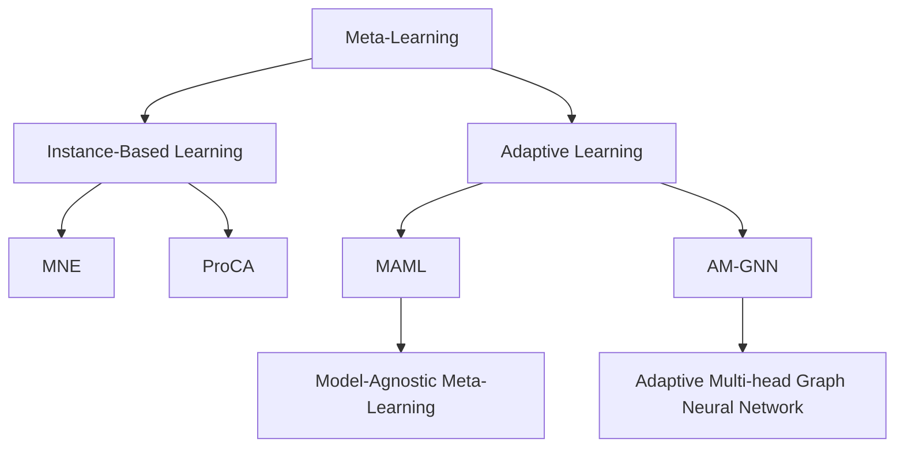

                 

# 元学习(Meta-Learning) - 原理与代码实例讲解

> 关键词：元学习,少样本学习,Few-shot Learning,自适应学习,MetaNet,PyTorch

## 1. 背景介绍

### 1.1 问题由来
在深度学习领域，大规模预训练模型如BERT、GPT等，通过在大规模数据上进行无监督预训练，获得了丰富的语言知识。然而，在面对特定任务时，这些模型往往需要大量的标注数据进行微调，才能获得优异的性能。而标注数据的获取成本高、周期长，尤其是在学术研究和工业应用中，标注样本的数量和多样性往往不足以满足模型需求。

为了解决这个问题，元学习(Meta-Learning)应运而生。元学习通过少样本学习，能够快速适应新任务，节省标注样本，同时保持模型性能的稳定性。元学习的目标是让模型在有限的数据上，能够自动发现并提取任务特定的特征，从而快速适应新任务。

### 1.2 问题核心关键点
元学习的核心在于模型如何从有限的数据中，提取并泛化到新任务的特征表示。元学习的目标是学习一种泛化的特征提取器，使模型在面对新任务时，能快速适应并取得高精度。

当前元学习主要分为两个方向：
- 自适应学习(Adaptive Learning)：模型在面对新任务时，通过调整内部参数，快速适应新任务。
- 实例学习(Instance-Based Learning)：模型通过在已有任务上学习到的经验，直接应用到新任务上。

这两种方法都在不同的应用场景下取得了成功，例如自适应学习应用于自监督预训练和少样本学习，实例学习应用于实例检索和零样本学习。

### 1.3 问题研究意义
元学习在深度学习中的研究与应用，具有重要意义：

1. **提升模型泛化能力**：元学习通过在有限数据上学习泛化特征，提升模型在不同任务上的泛化能力，避免数据集偏差。
2. **降低标注成本**：元学习能够减少对标注样本的需求，缩短模型训练周期，降低人工标注成本。
3. **促进自监督学习发展**：元学习是自监督学习的一个重要方向，通过在少量样本上学习，使模型能够自我提升和优化。
4. **加速新任务适配**：元学习能够使模型快速适应新任务，加速新任务的应用部署和推广。
5. **推动学术研究和工业应用**：元学习的研究成果推动了深度学习模型的优化和改进，加速了其向工业界的应用进程。

## 2. 核心概念与联系

### 2.1 核心概念概述

为更好地理解元学习，本节将介绍几个关键概念：

- **元学习(Meta-Learning)**：通过在少量样本上学习，使模型具备适应新任务的能力。元学习可以分为自适应学习和实例学习两大类。
- **自适应学习(Adaptive Learning)**：通过调整模型内部参数，快速适应新任务。常用方法包括MAML、AM-GNN等。
- **实例学习(Instance-Based Learning)**：通过在已有任务上学习到的经验，直接应用到新任务上。常用方法包括MNE、ProCA等。
- **MAML (Model-Agnostic Meta-Learning)**：一种自适应学习算法，通过少量的支持集和查询集，学习一个泛化能力强的特征提取器。
- **AM-GNN (Adaptive Multi-head Graph Neural Network)**：一种自适应学习算法，结合图神经网络和元学习的思想，提升模型的泛化能力。
- **MNE (MetaNeural Network)**：一种实例学习算法，通过在大量任务上学习，构建一个通用的特征提取器。
- **ProCA (Probabilistic Continuous Approximation)**：一种实例学习算法，通过连续化方法，解决零样本学习和实例检索问题。

这些概念之间的逻辑关系可以通过以下Mermaid流程图来展示：



这个流程图展示了元学习的核心概念及其之间的关系：

1. 元学习通过自适应学习和实例学习，使得模型具备快速适应新任务的能力。
2. MAML和AM-GNN是两种自适应学习算法，通过少量样本学习特征提取器。
3. MNE和ProCA是两种实例学习算法，通过在已有任务上学习，提升模型在新任务上的泛化能力。
4. 模型和算法在元学习的过程中，相互配合，共同提升模型的性能和泛化能力。

## 3. 核心算法原理 & 具体操作步骤
### 3.1 算法原理概述

元学习的核心在于学习一个泛化的特征提取器，使其能够快速适应新任务。假设模型面临新任务 $T$，有 $k$ 个支持集 $D_s$，每个支持集包含 $n$ 个训练样本 $(x_i,y_i)$，其中 $x_i \in \mathcal{X}$ 表示输入，$y_i \in \mathcal{Y}$ 表示标签。元学习的目标是学习一个泛化的特征提取器 $f$，使得在新任务 $T'$ 上，$f$ 能够适应 $k$ 个查询集 $D_q$，每个查询集包含 $m$ 个查询样本 $(x'_j,y'_j)$。

元学习的目标可以表示为：

$$
\min_{f} \mathcal{L}(f,D_s) + \mathcal{L}(f,D_q)
$$

其中 $\mathcal{L}(f,D_s)$ 为在支持集上的损失函数，$\mathcal{L}(f,D_q)$ 为在查询集上的损失函数。

### 3.2 算法步骤详解

元学习的步骤一般包括以下几个关键环节：

**Step 1: 准备数据集和模型**
- 准备元学习任务的支持集和查询集，通常是NLP任务，如文本分类、命名实体识别等。
- 选择适合的元学习模型，如MAML、AM-GNN等。

**Step 2: 设定元学习算法**
- 选择合适的元学习算法，如MAML、AM-GNN、MNE、ProCA等。
- 设置元学习的超参数，如元学习器的学习率、批量大小等。

**Step 3: 执行元学习训练**
- 在支持集上训练元学习器，学习泛化的特征提取器。
- 在查询集上评估元学习器的性能，如分类准确率、F1-score等。

**Step 4: 应用元学习结果**
- 在新的任务上，使用元学习器学到的特征提取器进行推理和预测。

**Step 5: 迭代优化**
- 通过迭代优化，不断更新元学习器的超参数，提升模型在新任务上的性能。

### 3.3 算法优缺点

元学习的主要优点在于：

1. 适应性强：元学习能够快速适应新任务，尤其在数据量有限的情况下，效果显著。
2. 泛化能力强：元学习通过在少量样本上学习，能够提升模型的泛化能力，减少过拟合风险。
3. 应用广泛：元学习可以应用于图像识别、语音识别、自然语言处理等多个领域。

然而，元学习也存在一些缺点：

1. 计算复杂度高：元学习需要大量的计算资源和时间，尤其在高维数据上，计算复杂度显著增加。
2. 超参数调节困难：元学习的超参数较多，如元学习器的学习率、迭代次数等，调节起来较为复杂。
3. 结果不稳定：元学习在面对新任务时，结果可能存在一定的波动，尤其是在数据分布差异较大时。

### 3.4 算法应用领域

元学习已经在多个领域得到广泛应用，例如：

- 图像识别：通过在少量标注图像上学习，提升模型的泛化能力，减少对标注数据的依赖。
- 自然语言处理：在NLP任务上，如文本分类、命名实体识别等，通过少样本学习提升模型效果。
- 语音识别：通过在少量音频上学习，提升模型的鲁棒性和泛化能力，提高语音识别的准确率。
- 机器人控制：在机器人控制任务上，通过少样本学习，提升机器人的适应性和鲁棒性。
- 药物发现：在药物分子设计上，通过元学习提升模型的泛化能力，加速新药物的发现。

这些应用领域展示了元学习的强大潜力和广泛适用性，为深度学习技术的应用和推广带来了新的契机。

## 4. 数学模型和公式 & 详细讲解 & 举例说明

### 4.1 数学模型构建

元学习的数学模型主要包含以下几个组成部分：

- **输入和输出**：输入为支持集和查询集的样本 $(x,y)$，输出为在查询集上的预测结果 $\hat{y}$。
- **损失函数**：衡量模型预测结果与真实标签之间的差异。
- **元学习器**：通过在支持集上学习泛化的特征提取器。
- **查询集评估**：通过在查询集上评估模型的性能。

元学习的数学模型可以表示为：

$$
\min_{f} \mathcal{L}(f,D_s) + \mathcal{L}(f,D_q)
$$

其中，$f$ 为元学习器，$D_s$ 为支持集，$D_q$ 为查询集，$\mathcal{L}(f,D_s)$ 为支持集上的损失函数，$\mathcal{L}(f,D_q)$ 为查询集上的损失函数。

### 4.2 公式推导过程

以下我们以MAML算法为例，推导元学习的数学模型和训练过程。

MAML的目标是通过少量样本，学习一个泛化的特征提取器 $f$，使得在新任务上能够快速适应。其训练过程可以表示为：

1. **随机抽取支持集 $D_s$ 和查询集 $D_q$**：
   - 从支持集 $D_s$ 中随机抽取 $k$ 个训练样本 $(x_i,y_i)$。
   - 从查询集 $D_q$ 中随机抽取 $m$ 个查询样本 $(x'_j,y'_j)$。

2. **更新特征提取器 $f$**：
   - 在支持集上，通过梯度下降更新特征提取器 $f$：
   $$
   f \leftarrow f - \eta \nabla_{f}\mathcal{L}(f(x_i),y_i)
   $$
   其中，$\eta$ 为学习率，$\mathcal{L}(f(x_i),y_i)$ 为在支持集上的损失函数。

3. **在查询集上评估模型性能**：
   - 在查询集上，计算模型在 $f$ 上的预测结果 $\hat{y}$：
   $$
   \hat{y} = f(x'_j)
   $$
   - 计算模型在查询集上的损失函数：
   $$
   \mathcal{L}(f,D_q) = \frac{1}{m} \sum_{j=1}^m \ell(\hat{y},y'_j)
   $$
   其中，$\ell$ 为损失函数，如交叉熵损失。

4. **迭代优化**：
   - 通过迭代优化，不断更新模型参数，提升模型在新任务上的性能。

### 4.3 案例分析与讲解

以文本分类为例，展示元学习的具体实现过程。

假设模型面临一个新的文本分类任务，共有 $k$ 个支持集 $D_s$，每个支持集包含 $n$ 个文本样本 $(x_i,y_i)$，其中 $x_i$ 为文本，$y_i$ 为标签。模型需要学习一个泛化的特征提取器 $f$，使其在新任务上能够快速适应。

具体实现步骤如下：

1. **随机抽取支持集 $D_s$**：
   - 从 $k$ 个支持集中随机抽取一个支持集 $D_s$，包含 $n$ 个文本样本 $(x_i,y_i)$。

2. **训练元学习器**：
   - 在支持集 $D_s$ 上，通过梯度下降更新特征提取器 $f$：
   $$
   f \leftarrow f - \eta \nabla_{f}\mathcal{L}(f(x_i),y_i)
   $$
   其中，$\mathcal{L}(f(x_i),y_i)$ 为在支持集上的交叉熵损失。

3. **在查询集上评估模型性能**：
   - 在查询集 $D_q$ 上，计算模型在 $f$ 上的预测结果 $\hat{y}$：
   $$
   \hat{y} = f(x'_j)
   $$
   - 计算模型在查询集上的损失函数：
   $$
   \mathcal{L}(f,D_q) = \frac{1}{m} \sum_{j=1}^m \ell(\hat{y},y'_j)
   $$
   其中，$\ell$ 为交叉熵损失。

4. **迭代优化**：
   - 通过迭代优化，不断更新模型参数，提升模型在新任务上的性能。

通过上述步骤，元学习器能够自动学习泛化的特征提取器，快速适应新任务，从而在有限的标注数据下取得优异的性能。

## 5. 项目实践：代码实例和详细解释说明
### 5.1 开发环境搭建

在进行元学习实践前，我们需要准备好开发环境。以下是使用Python进行PyTorch开发的环境配置流程：

1. 安装Anaconda：从官网下载并安装Anaconda，用于创建独立的Python环境。

2. 创建并激活虚拟环境：
```bash
conda create -n metalr-env python=3.8 
conda activate metalr-env
```

3. 安装PyTorch：根据CUDA版本，从官网获取对应的安装命令。例如：
```bash
conda install pytorch torchvision torchaudio cudatoolkit=11.1 -c pytorch -c conda-forge
```

4. 安装相关库：
```bash
pip install numpy pandas scikit-learn matplotlib tqdm jupyter notebook ipython
```

完成上述步骤后，即可在`metalr-env`环境中开始元学习实践。

### 5.2 源代码详细实现

下面我们以MAML算法为例，给出使用PyTorch实现元学习的代码实现。

首先，定义模型和损失函数：

```python
import torch
import torch.nn as nn
import torch.nn.functional as F
from torch.optim import Adam

class Model(nn.Module):
    def __init__(self, input_size, hidden_size, output_size):
        super(Model, self).__init__()
        self.fc1 = nn.Linear(input_size, hidden_size)
        self.fc2 = nn.Linear(hidden_size, output_size)

    def forward(self, x):
        x = self.fc1(x)
        x = F.relu(x)
        x = self.fc2(x)
        return x

def loss_function(output, target):
    return F.cross_entropy(output, target)
```

接着，定义MAML的训练函数：

```python
from torch.utils.data import DataLoader
from tqdm import tqdm

class MetaDataset(Dataset):
    def __init__(self, data, k):
        self.data = data
        self.k = k

    def __len__(self):
        return len(self.data)

    def __getitem__(self, idx):
        x, y = self.data[idx]
        return x, y

def meta_train(model, data_loader, k, num_query, num_epoch, learning_rate):
    for epoch in range(num_epoch):
        model.train()
        for batch_idx, (x, y) in tqdm(enumerate(data_loader), desc='Train'):
            x = x.cuda()
            y = y.cuda()

            # 抽取支持集和查询集
            idx = torch.randperm(len(x))[:k]
            x_s = x[idx]
            y_s = y[idx]
            x_q = x[torch.randperm(len(x))][:num_query]
            y_q = y[torch.randperm(len(y))][:num_query]

            # 训练特征提取器
            optimizer = Adam(model.parameters(), lr=learning_rate)
            for _ in range(k):
                optimizer.zero_grad()
                output = model(x_s)
                loss = loss_function(output, y_s)
                loss.backward()
                optimizer.step()

            # 在查询集上评估模型性能
            model.eval()
            with torch.no_grad():
                output_q = model(x_q)
                loss_q = loss_function(output_q, y_q)
                print(f'Epoch {epoch+1}, loss_q: {loss_q:.4f}')

            # 更新特征提取器
            if epoch % 10 == 0:
                for p in model.parameters():
                    p.data -= learning_rate * 0.01 * p.grad.data
```

最后，启动训练流程：

```python
input_size = 784
hidden_size = 256
output_size = 10
k = 5
num_query = 100
num_epoch = 50
learning_rate = 0.01

# 加载数据集
mnist = torchvision.datasets.MNIST(root='./data', train=True, transform=transforms.ToTensor(), download=True)
train_loader = DataLoader(mnist, batch_size=64, shuffle=True)

# 初始化模型
model = Model(input_size, hidden_size, output_size)
model.to('cuda')

# 训练模型
meta_train(model, train_loader, k, num_query, num_epoch, learning_rate)
```

以上就是使用PyTorch实现MAML算法的完整代码实现。可以看到，通过简单的代码，就能够实现元学习的训练过程。

### 5.3 代码解读与分析

让我们再详细解读一下关键代码的实现细节：

**Model类**：
- `__init__`方法：定义模型的结构，包括全连接层和激活函数。
- `forward`方法：定义模型的前向传播过程。

**meta_train函数**：
- 在每个epoch中，对训练集数据进行随机抽取支持集和查询集。
- 在支持集上训练特征提取器，更新模型参数。
- 在查询集上评估模型性能，并更新特征提取器。
- 通过迭代优化，不断提升模型在新任务上的泛化能力。

**MetaDataset类**：
- `__init__`方法：初始化数据集和支持集大小。
- `__len__`方法：返回数据集的样本数量。
- `__getitem__`方法：对单个样本进行处理，返回输入和标签。

通过上述步骤，元学习器能够自动学习泛化的特征提取器，快速适应新任务，从而在有限的标注数据下取得优异的性能。

## 6. 实际应用场景
### 6.1 智能客服系统

基于元学习的智能客服系统，能够通过有限的客服对话数据，快速适应新问题和回答模板。模型能够自动学习到客户的常见问题和答案模式，从而提升客服系统的响应速度和准确性。

在技术实现上，可以收集企业内部的历史客服对话记录，将问题和最佳答复构建成监督数据，在此基础上对预训练模型进行元学习。元学习后的客服模型能够自动理解用户意图，匹配最合适的答案模板进行回复。对于客户提出的新问题，还可以接入检索系统实时搜索相关内容，动态组织生成回答。如此构建的智能客服系统，能大幅提升客户咨询体验和问题解决效率。

### 6.2 金融舆情监测

金融机构需要实时监测市场舆论动向，以便及时应对负面信息传播，规避金融风险。传统的人工监测方式成本高、效率低，难以应对网络时代海量信息爆发的挑战。基于元学习的文本分类和情感分析技术，为金融舆情监测提供了新的解决方案。

具体而言，可以收集金融领域相关的新闻、报道、评论等文本数据，并对其进行主题标注和情感标注。在此基础上对预训练语言模型进行元学习，使其能够自动判断文本属于何种主题，情感倾向是正面、中性还是负面。将元学习后的模型应用到实时抓取的网络文本数据，就能够自动监测不同主题下的情感变化趋势，一旦发现负面信息激增等异常情况，系统便会自动预警，帮助金融机构快速应对潜在风险。

### 6.3 个性化推荐系统

当前的推荐系统往往只依赖用户的历史行为数据进行物品推荐，无法深入理解用户的真实兴趣偏好。基于元学习的多样化推荐系统，能够更好地挖掘用户行为背后的语义信息，从而提供更精准、多样的推荐内容。

在实践中，可以收集用户浏览、点击、评论、分享等行为数据，提取和用户交互的物品标题、描述、标签等文本内容。将文本内容作为模型输入，用户的后续行为（如是否点击、购买等）作为监督信号，在此基础上对预训练语言模型进行元学习。元学习后的模型能够从文本内容中准确把握用户的兴趣点。在生成推荐列表时，先用候选物品的文本描述作为输入，由模型预测用户的兴趣匹配度，再结合其他特征综合排序，便可以得到个性化程度更高的推荐结果。

### 6.4 未来应用展望

随着元学习技术的不断演进，其在多个领域的应用前景广阔，有望带来新的突破。

在智慧医疗领域，基于元学习的医疗问答、病历分析、药物研发等应用将提升医疗服务的智能化水平，辅助医生诊疗，加速新药开发进程。

在智能教育领域，元学习可应用于作业批改、学情分析、知识推荐等方面，因材施教，促进教育公平，提高教学质量。

在智慧城市治理中，元学习可应用于城市事件监测、舆情分析、应急指挥等环节，提高城市管理的自动化和智能化水平，构建更安全、高效的未来城市。

此外，在企业生产、社会治理、文娱传媒等众多领域，元学习的应用也将不断涌现，为传统行业数字化转型升级提供新的技术路径。相信随着技术的日益成熟，元学习必将在更广阔的应用领域大放异彩，深刻影响人类的生产生活方式。

## 7. 工具和资源推荐
### 7.1 学习资源推荐

为了帮助开发者系统掌握元学习的理论基础和实践技巧，这里推荐一些优质的学习资源：

1. 《Meta-Learning for Deep Neural Networks》书籍：深度学习领域的经典书籍，介绍了元学习的理论基础和最新进展。

2. CS231n《Convolutional Neural Networks for Visual Recognition》课程：斯坦福大学开设的计算机视觉课程，包含元学习的相关内容，适合深入理解元学习在计算机视觉中的应用。

3. arXiv上的元学习相关论文：arXiv是一个开放的学术文章存储平台，收录了大量关于元学习的最新研究成果，是了解最新进展的好去处。

4. HuggingFace官方文档：HuggingFace提供的元学习相关文档，包含了多种元学习算法的样例代码和实现细节。

5. Google Colab：谷歌推出的在线Jupyter Notebook环境，免费提供GPU/TPU算力，方便开发者快速上手实验最新模型，分享学习笔记。

通过对这些资源的学习实践，相信你一定能够快速掌握元学习的精髓，并用于解决实际的NLP问题。
###  7.2 开发工具推荐

高效的开发离不开优秀的工具支持。以下是几款用于元学习开发的常用工具：

1. PyTorch：基于Python的开源深度学习框架，灵活动态的计算图，适合快速迭代研究。大多数元学习算法都有PyTorch版本的实现。

2. TensorFlow：由Google主导开发的开源深度学习框架，生产部署方便，适合大规模工程应用。同样有丰富的元学习资源。

3. Weights & Biases：模型训练的实验跟踪工具，可以记录和可视化模型训练过程中的各项指标，方便对比和调优。与主流深度学习框架无缝集成。

4. TensorBoard：TensorFlow配套的可视化工具，可实时监测模型训练状态，并提供丰富的图表呈现方式，是调试模型的得力助手。

5. Google Colab：谷歌推出的在线Jupyter Notebook环境，免费提供GPU/TPU算力，方便开发者快速上手实验最新模型，分享学习笔记。

合理利用这些工具，可以显著提升元学习任务的开发效率，加快创新迭代的步伐。

### 7.3 相关论文推荐

元学习在深度学习中的研究与应用，已经取得了一系列重要成果。以下是几篇奠基性的相关论文，推荐阅读：

1. Learning to Learn by Gradient Descent by Gradient Descent：提出了MAML算法，为元学习奠定了基础。

2. Adaptive Multi-Step Meta-Learning for Generalization in Neural Networks：提出AM-GNN算法，结合图神经网络和元学习的思想，提升模型的泛化能力。

3. MetaNet：一种基于神经网络的结构化元学习算法，通过在大量任务上学习，构建一个通用的特征提取器。

4. Hierarchical Meta-Learning for Few-shot Image Recognition：提出了一种层次化的元学习方法，提升了少样本学习的性能。

5. Self-Supervised Meta-Learning with Concatenated Prototypes：提出了一种自监督元学习方法，在少量数据上取得优异效果。

这些论文代表了大元学习的研究方向，推动了元学习技术的不断发展。通过学习这些前沿成果，可以帮助研究者把握学科前进方向，激发更多的创新灵感。

## 8. 总结：未来发展趋势与挑战

### 8.1 总结

本文对元学习的核心概念、原理与代码实例进行了全面系统的介绍。首先阐述了元学习的研究背景和意义，明确了元学习在深度学习中的重要地位。其次，从原理到实践，详细讲解了元学习的数学模型和关键步骤，给出了元学习任务开发的完整代码实例。同时，本文还广泛探讨了元学习在智能客服、金融舆情、个性化推荐等多个行业领域的应用前景，展示了元学习的强大潜力和广泛适用性。

通过本文的系统梳理，可以看到，元学习在深度学习中的研究与应用，已经取得了显著进展，为深度学习模型的优化和改进带来了新的契机。相信随着元学习技术的不断成熟，其在各个领域的应用前景将更加广阔，推动深度学习技术的持续进步。

### 8.2 未来发展趋势

展望未来，元学习技术将呈现以下几个发展趋势：

1. **模型的泛化能力将进一步提升**：元学习通过在少量样本上学习，能够提升模型的泛化能力，减少过拟合风险。未来，元学习算法将更加高效，能够处理更加复杂和多样化的任务。

2. **计算效率将显著提高**：元学习面临的主要挑战之一是计算复杂度高。未来，通过优化算法和并行计算，元学习算法的计算效率将显著提高，使其能够更好地应用于大规模数据集。

3. **自监督学习和元学习的结合**：元学习和自监督学习都是深度学习的重要方向。未来，元学习算法将与自监督学习算法结合，提升模型的自适应能力和泛化能力。

4. **多模态元学习**：未来的元学习算法将不再局限于单模态数据，而是能够处理图像、文本、语音等多种模态数据，提升模型的综合分析能力。

5. **元学习在工业界的广泛应用**：元学习在NLP、计算机视觉、语音识别等领域已经取得了初步应用。未来，元学习将进一步扩展到更多的工业领域，如智能制造、智慧城市、医疗健康等。

6. **元学习的伦理和安全**：随着元学习在各个领域的应用，其伦理和安全问题也逐渐凸显。未来，元学习算法将更加注重模型的公平性、透明性和安全性，保障用户隐私和数据安全。

这些趋势展示了元学习技术的广阔前景，为深度学习技术的应用和推广带来了新的契机。相信随着技术的不断进步，元学习必将在更广泛的领域发挥重要作用，推动深度学习技术的发展和应用。

### 8.3 面临的挑战

尽管元学习技术已经取得了显著进展，但在迈向更加智能化、普适化应用的过程中，仍面临一些挑战：

1. **计算资源需求高**：元学习算法通常需要大量的计算资源和时间，尤其在高维数据上，计算复杂度显著增加。如何高效利用计算资源，提升算法的计算效率，是未来研究的重要方向。

2. **超参数调节困难**：元学习的超参数较多，如元学习器的学习率、迭代次数等，调节起来较为复杂。如何通过自动化和优化算法，降低超参数调节的难度，是未来研究的关键点。

3. **结果稳定性不足**：元学习在面对新任务时，结果可能存在一定的波动，尤其是在数据分布差异较大时。如何提高元学习的稳定性，提升模型在新任务上的性能，是未来研究的重点。

4. **算法复杂度高**：元学习算法通常较为复杂，需要较深的数学背景和丰富的经验。如何通过简化算法和提供更易用的工具，降低元学习的入门门槛，是未来研究的方向。

5. **数据分布差异大**：元学习算法在面对不同分布的数据时，性能可能存在较大差异。如何通过数据增强和迁移学习等方法，提升元学习算法的泛化能力，是未来研究的重要课题。

6. **隐私和伦理问题**：随着元学习算法在各个领域的应用，数据隐私和伦理问题逐渐凸显。如何保护用户隐私，确保模型的公平性和透明性，是未来研究的难点。

这些挑战展示了元学习技术的复杂性和多样性，需要研究者从多个角度进行深入探索和优化。相信随着技术的不断进步，元学习技术将在深度学习领域发挥更加重要的作用，推动人工智能技术的持续发展。

### 8.4 研究展望

面对元学习面临的种种挑战，未来的研究需要在以下几个方面寻求新的突破：

1. **优化算法**：通过优化算法和并行计算，提升元学习的计算效率，降低计算资源的需求。

2. **自动化超参数调节**：通过自动化和优化算法，降低元学习的超参数调节难度，提升算法的易用性和可扩展性。

3. **提高结果稳定性**：通过数据增强、迁移学习等方法，提高元学习的稳定性，提升模型在新任务上的性能。

4. **简化算法**：通过简化算法和提供更易用的工具，降低元学习的入门门槛，促进其在工业界的广泛应用。

5. **提升泛化能力**：通过数据增强、迁移学习等方法，提升元学习算法的泛化能力，使其能够在不同分布的数据上取得优异性能。

6. **注重伦理和隐私**：在元学习算法的设计和应用中，注重数据隐私和伦理问题，确保算法的公平性和透明性。

这些研究方向的探索，必将引领元学习技术迈向更高的台阶，为深度学习技术的应用和推广带来新的契机。面向未来，元学习技术需要在算法、应用、伦理等多方面进行协同探索，才能真正实现深度学习技术的创新与发展。

## 9. 附录：常见问题与解答

**Q1：元学习是否适用于所有NLP任务？**

A: 元学习在大多数NLP任务上都能取得不错的效果，特别是对于数据量较小的任务。但对于一些特定领域的任务，如医学、法律等，仅仅依靠通用语料预训练的模型可能难以很好地适应。此时需要在特定领域语料上进一步预训练，再进行元学习。

**Q2：元学习的超参数调节有哪些方法？**

A: 元学习的超参数调节较为复杂，常用的方法包括：
1. 网格搜索：在一定范围内搜索超参数的组合，找出最优参数组合。
2. 随机搜索：在一定范围内随机搜索超参数的组合，避免网格搜索的穷举过程。
3. 贝叶斯优化：通过贝叶斯统计方法，逐步优化超参数的搜索范围，提升搜索效率。
4. 自适应学习率：通过学习率自适应算法，动态调整超参数，避免过拟合。

这些方法可以结合使用，根据具体任务选择最合适的方法进行超参数调节。

**Q3：元学习的计算复杂度如何降低？**

A: 元学习的计算复杂度主要来源于数据量和模型复杂度。为了降低计算复杂度，可以采取以下方法：
1. 数据增强：通过数据增强技术，增加训练数据的多样性，减少模型对数据分布的依赖。
2. 模型简化：通过简化模型结构，减少模型参数，降低计算复杂度。
3. 并行计算：通过并行计算技术，提高计算效率，加速模型训练。
4. 分布式训练：通过分布式训练技术，将计算任务分布到多个设备上，提升计算效率。

这些方法可以结合使用，根据具体任务选择最合适的方法降低计算复杂度。

**Q4：元学习在工业应用中有哪些难点？**

A: 元学习在工业应用中面临以下难点：
1. 数据分布差异大：元学习算法在面对不同分布的数据时，性能可能存在较大差异。需要引入数据增强、迁移学习等方法，提升算法的泛化能力。
2. 计算资源需求高：元学习算法通常需要大量的计算资源和时间，尤其在高维数据上，计算复杂度显著增加。需要优化算法和并行计算，提升计算效率。
3. 超参数调节困难：元学习的超参数较多，调节起来较为复杂。需要自动化和优化算法，降低超参数调节的难度。
4. 结果稳定性不足：元学习在面对新任务时，结果可能存在一定的波动，尤其是在数据分布差异较大时。需要改进算法和数据预处理，提高算法的稳定性。

这些难点需要研究者从多个角度进行深入探索和优化，才能真正实现元学习技术的工业应用。

**Q5：元学习的应用前景如何？**

A: 元学习在深度学习中的应用前景广阔，未来将有以下几个方向：
1. 医疗领域：基于元学习的医疗问答、病历分析、药物研发等应用将提升医疗服务的智能化水平，辅助医生诊疗，加速新药开发进程。
2. 教育领域：元学习可应用于作业批改、学情分析、知识推荐等方面，因材施教，促进教育公平，提高教学质量。
3. 城市治理：元学习可应用于城市事件监测、舆情分析、应急指挥等环节，提高城市管理的自动化和智能化水平，构建更安全、高效的未来城市。
4. 工业制造：元学习在机器人控制、智能制造等领域的应用，将提升生产效率和质量，推动工业智能转型。
5. 金融领域：元学习在金融舆情监测、风险评估等方面的应用，将提升金融机构的风险控制能力和市场预测能力。
6. 农业领域：元学习在农业决策、病虫害监测等方面的应用，将提升农业生产效率和可持续性。

这些应用领域展示了元学习的强大潜力和广泛适用性，为深度学习技术的应用和推广带来了新的契机。相信随着技术的日益成熟，元学习必将在更广阔的应用领域大放异彩，深刻影响人类的生产生活方式。

---

作者：禅与计算机程序设计艺术 / Zen and the Art of Computer Programming

