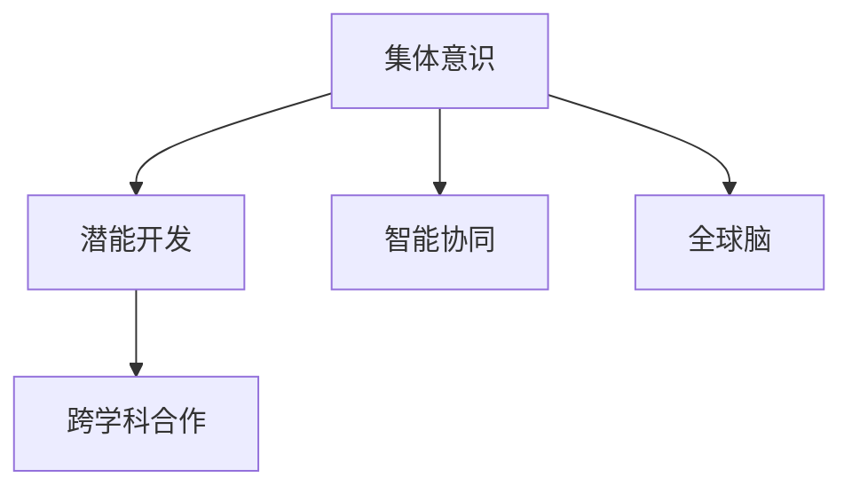

                 

# 全球脑与人类潜能开发中心:集体意识推动的能力提升机构

## 1. 背景介绍

### 1.1 问题由来
在全球化和技术革新的推动下，人类社会正经历着前所未有的变革。这种变革不仅改变了人们的工作方式和生活习惯，更深刻地影响着人类的认知模式和思维能力。如何在快速变化的环境中，提升人类的潜能，开发更高效、更智能的认知系统，成为科技领域亟待解决的问题。

### 1.2 问题核心关键点
全球脑与人类潜能开发中心（Global Brain and Human Potential Development Center, GBHPDC）正是在这一背景下应运而生。其核心目标是通过集体意识的汇聚与协同，推动人类认知能力的提升。GBHPDC旨在建立一个跨学科、跨文化、跨地域的协作网络，汇集世界各地的顶尖科学家、工程师、哲学家、心理学家、教育专家等，共同探索和实现这一目标。

## 2. 核心概念与联系

### 2.1 核心概念概述

为更好地理解GBHPDC的工作原理和目标，本节将介绍几个密切相关的核心概念：

- **集体意识**：指在特定集体中，个体之间通过共享经验、知识和情感，逐渐形成的共同认知和思维模式。
- **潜能开发**：指通过科学方法和技术手段，挖掘和提升个体及集体的智力、创造力、情感理解力等潜能的过程。
- **全球脑**：基于人类神经网络和计算网络的隐喻，指全球范围内的认知活动和信息交换。
- **智能协同**：通过先进的信息技术和协作工具，实现个体间、群体间的高效协同和知识共享。
- **跨学科合作**：涵盖神经科学、心理学、教育学、人工智能、社会科学等多个领域的协同合作，以全面理解人类认知机制，设计有效的潜能开发方案。

这些核心概念之间的逻辑关系可以通过以下Mermaid流程图来展示：



这个流程图展示了大脑与人类潜能开发中心的各个关键概念及其之间的关系：

1. 集体意识是潜能开发的基础，通过共同的学习和实践，个体逐步形成共享的认知模式。
2. 潜能开发旨在挖掘和提升这些共享认知模式的深度和广度，从而增强集体的智慧和创造力。
3. 智能协同提供实现潜能开发的技术手段，通过信息技术和协作工具，促进个体间的无缝沟通与知识共享。
4. 跨学科合作确保潜能开发方案的科学性和完备性，利用多领域专家的知识和智慧。
5. 全球脑强调在全球范围内进行认知活动和信息交换，拓宽人类认知的边界。

这些概念共同构成了GBHPDC的工作框架，为其提供了一个全面的视角来理解和应对人类认知潜能的提升。

## 3. 核心算法原理 & 具体操作步骤
### 3.1 算法原理概述

GBHPDC的潜能开发方法基于一种独特的算法框架，该框架的核心思想是通过集体意识的汇聚和协同，提升人类潜能。其基本步骤如下：

1. **数据收集**：通过各种传感器和智能设备，收集个体在各种环境下的认知数据，包括脑电波、眼动、面部表情、生理指标等。
2. **数据整合**：使用机器学习和数据挖掘技术，将收集到的多源异构数据进行整合，形成一致的认知数据集。
3. **模型训练**：在整合后的数据集上训练神经网络模型，学习个体间的互动模式和集体认知特征。
4. **潜能提升**：基于模型输出的结果，设计个性化的潜能开发方案，引导个体在特定领域内进行深入学习和实践。
5. **反馈调整**：持续收集个体的反馈信息，调整潜能开发方案，确保方案的有效性和适用性。

### 3.2 算法步骤详解

以下是GBHPDC潜能开发算法的基本步骤：

1. **数据收集**：
   - 部署多种传感器和智能设备，如脑电波监测仪、眼动追踪器、面部表情分析器等，实时采集个体的生理和行为数据。
   - 使用问卷、访谈等方法，收集个体的主观认知和情感反馈数据。
   - 确保数据收集的全面性和多样性，覆盖不同性别、年龄、文化背景的个体。

2. **数据整合**：
   - 将收集到的多源异构数据进行标准化处理，消除数据格式和单位差异。
   - 使用数据清洗技术去除噪声和异常值，确保数据质量。
   - 通过机器学习和数据挖掘技术，提取个体间的交互模式和集体认知特征，形成认知数据集。

3. **模型训练**：
   - 在整合后的认知数据集上，使用深度神经网络模型（如卷积神经网络CNN、循环神经网络RNN、长短时记忆网络LSTM等）进行训练。
   - 设计合适的损失函数和优化算法，确保模型能够有效捕捉个体间的互动模式和集体认知特征。
   - 在训练过程中，不断调整模型参数，优化模型性能。

4. **潜能提升**：
   - 基于模型输出的集体认知特征，设计个性化的潜能开发方案，如知识学习、技能训练、情感调节等。
   - 提供定制化的学习资源和实践机会，引导个体在特定领域内进行深入学习和实践。
   - 定期评估个体在潜能开发方案中的表现，根据评估结果调整方案内容。

5. **反馈调整**：
   - 通过问卷、访谈、实验等方法，收集个体的反馈信息，评估潜能开发方案的有效性和适用性。
   - 根据反馈信息，调整潜能开发方案的内容和形式，确保方案能够满足个体需求。
   - 持续优化模型参数和潜能开发方案，提升集体认知和潜能开发的整体效果。

### 3.3 算法优缺点

GBHPDC的潜能开发方法具有以下优点：
1. 数据驱动：基于数据驱动的潜能开发，确保方案的科学性和有效性。
2. 个性化定制：通过个性化的潜能开发方案，满足不同个体的需求。
3. 跨学科融合：融合神经科学、心理学、教育学等多领域的知识，提供全面的潜能开发视角。
4. 集体智慧：通过集体意识的汇聚和协同，发挥集体的智慧和创造力。

同时，该方法也存在一些局限性：
1. 数据隐私：大规模数据收集和整合可能涉及个人隐私问题，需严格遵守数据保护法律法规。
2. 模型复杂：深度神经网络模型的训练和优化过程复杂，需要大量计算资源。
3. 效果评价：潜能开发的长期效果评价难度较大，需长期跟踪和评估。
4. 个体差异：不同个体的认知能力和需求差异较大，需根据具体情况定制潜能开发方案。

尽管存在这些局限性，但GBHPDC的方法仍然为人类潜能开发提供了一个全新的视角和技术框架。

### 3.4 算法应用领域

GBHPDC的潜能开发方法在多个领域都有广泛的应用：

- **教育**：通过个性化学习方案和集体智慧共享，提升学生的学习效果和认知能力。
- **医疗**：利用个体认知数据，评估患者心理状态和认知障碍，提供个性化的心理干预和康复方案。
- **职场**：提供职场人员的认知培训和团队协作指导，提升工作效率和团队凝聚力。
- **文化**：通过跨文化认知数据分析，促进文化交流和理解，增强文化包容性。
- **社会治理**：利用集体智慧数据，进行社会行为分析和预测，提高社会治理水平。

这些应用场景展示了GBHPDC方法的广泛潜力和多样性。

## 4. 数学模型和公式 & 详细讲解
### 4.1 数学模型构建

GBHPDC的潜能开发模型基于深度神经网络，通过多层感知器（MLP）或卷积神经网络（CNN）等模型，学习个体间的互动模式和集体认知特征。以下是基本的数学模型构建过程：

设 $D=\{(x_i, y_i)\}_{i=1}^N$ 为认知数据集，其中 $x_i$ 表示第 $i$ 个体的认知数据，$y_i$ 表示其对应的集体认知特征。假设模型 $M_{\theta}$ 通过神经网络训练，得到模型参数 $\theta$。则模型输出 $y_i$ 的预测值 $y_{pred}$ 可以通过以下公式计算：

$$
y_{pred} = M_{\theta}(x_i)
$$

其中，$M_{\theta}$ 为神经网络模型，$x_i$ 为输入数据，$\theta$ 为模型参数。

### 4.2 公式推导过程

以下是深度神经网络模型的基本推导过程：

1. **输入层**：将个体认知数据 $x_i$ 作为输入层，通过特征提取器将数据映射为高维向量。
2. **隐藏层**：通过多个隐藏层进行特征学习和信息传递，生成集体认知特征 $y_{pred}$。
3. **输出层**：将隐藏层输出的特征向量 $h_{out}$ 通过线性变换和激活函数生成预测结果 $y_{pred}$。

以多层感知器（MLP）为例，其基本结构如图1所示：

```mermaid
graph LR
    x1 -- MLP -- y1
    x2 -- MLP -- y2
    x3 -- MLP -- y3
    x4 -- MLP -- y4
    MLP -- dense -- h1
    MLP -- dense -- h2
    h1 -- dense -- y_pred
    h2 -- dense -- y_pred
```

其中，$x_i$ 为输入层，$h_1, h_2$ 为隐藏层，$y_{pred}$ 为输出层。各层的参数 $\theta$ 包括权重矩阵和偏置向量。

### 4.3 案例分析与讲解

以教育领域的潜能开发为例，我们通过GBHPDC模型学习学生间的互动模式，设计个性化的学习方案。

假设有一组学生 $S=\{s_1, s_2, \ldots, s_n\}$，每个学生 $s_i$ 有 $N$ 个认知数据点 $x_i^{(1)}, x_i^{(2)}, \ldots, x_i^{(N)}$。通过GBHPDC模型，我们学习到每个学生的集体认知特征 $y_i$，并将其作为设计个性化学习方案的基础。

根据学生的集体认知特征，我们可以设计以下个性化学习方案：

- 对于需要提升逻辑思维的学生，提供更多的数学和逻辑训练题。
- 对于需要提升协作能力的学生，安排更多的团队项目和小组讨论。
- 对于需要提升情感调节能力的学生，安排更多的心理咨询和情感支持。

通过这些个性化方案，帮助学生在特定领域内进行深入学习和实践，提升其潜能。

## 5. 项目实践：代码实例和详细解释说明
### 5.1 开发环境搭建

在进行GBHPDC实践前，我们需要准备好开发环境。以下是使用Python进行PyTorch开发的环境配置流程：

1. 安装Anaconda：从官网下载并安装Anaconda，用于创建独立的Python环境。

2. 创建并激活虚拟环境：
```bash
conda create -n gbhpdc python=3.8 
conda activate gbhpdc
```

3. 安装PyTorch：根据CUDA版本，从官网获取对应的安装命令。例如：
```bash
conda install pytorch torchvision torchaudio cudatoolkit=11.1 -c pytorch -c conda-forge
```

4. 安装TensorFlow：
```bash
conda install tensorflow
```

5. 安装各类工具包：
```bash
pip install numpy pandas scikit-learn matplotlib tqdm jupyter notebook ipython
```

完成上述步骤后，即可在`gbhpdc`环境中开始GBHPDC实践。

### 5.2 源代码详细实现

这里我们以教育领域的潜能开发为例，给出使用PyTorch实现GBHPDC模型的代码实例。

首先，定义模型的输入和输出：

```python
import torch
import torch.nn as nn
import torch.optim as optim

class GBHPDCModel(nn.Module):
    def __init__(self, input_dim, hidden_dim, output_dim):
        super(GBHPDCModel, self).__init__()
        self.fc1 = nn.Linear(input_dim, hidden_dim)
        self.fc2 = nn.Linear(hidden_dim, hidden_dim)
        self.fc3 = nn.Linear(hidden_dim, output_dim)
    
    def forward(self, x):
        x = torch.relu(self.fc1(x))
        x = torch.relu(self.fc2(x))
        x = self.fc3(x)
        return x
```

然后，定义训练和评估函数：

```python
def train_model(model, train_dataset, test_dataset, epochs, batch_size, learning_rate):
    model.train()
    criterion = nn.CrossEntropyLoss()
    optimizer = optim.Adam(model.parameters(), lr=learning_rate)
    
    for epoch in range(epochs):
        running_loss = 0.0
        for i, data in enumerate(train_dataset, 0):
            inputs, labels = data
            optimizer.zero_grad()
            outputs = model(inputs)
            loss = criterion(outputs, labels)
            loss.backward()
            optimizer.step()
            
            running_loss += loss.item()
            if i % 100 == 99:
                print(f"Epoch {epoch+1}, loss: {running_loss/100:.4f}")
                running_loss = 0.0
        
    model.eval()
    test_loss = 0
    correct = 0
    with torch.no_grad():
        for data in test_dataset:
            inputs, labels = data
            outputs = model(inputs)
            test_loss += criterion(outputs, labels).item()
            _, predicted = torch.max(outputs.data, 1)
            total = labels.size(0)
            correct += (predicted == labels).sum().item()
    
    print(f"Accuracy: {100 * correct / total:.2f}%")
```

最后，启动训练流程并在测试集上评估：

```python
# 假设我们已经有了训练集和测试集的数据
train_data = ...
test_data = ...
input_dim = 10 # 假设输入数据维度为10
hidden_dim = 20 # 假设隐藏层维度为20
output_dim = 3 # 假设输出维度为3
learning_rate = 0.001 # 学习率
epochs = 10 # 训练轮数

model = GBHPDCModel(input_dim, hidden_dim, output_dim)
train_model(model, train_data, test_data, epochs, 64, learning_rate)
```

以上就是使用PyTorch实现GBHPDC模型的完整代码实例。可以看到，在GBHPDC模型中，我们通过多层感知器（MLP）模型学习个体间的互动模式，并设计个性化的学习方案。

### 5.3 代码解读与分析

让我们再详细解读一下关键代码的实现细节：

**GBHPDCModel类**：
- `__init__`方法：初始化模型参数。
- `forward`方法：定义前向传播过程，计算模型输出。

**train_model函数**：
- 定义模型训练的优化器、损失函数。
- 在每个epoch内，对训练集数据进行迭代训练，更新模型参数。
- 在每个epoch结束后，计算测试集的损失和准确率，评估模型性能。

**训练流程**：
- 定义训练集和测试集，设置模型、学习率、训练轮数等关键参数。
- 调用`train_model`函数进行模型训练。
- 在训练过程中，每100个batch输出一次当前epoch的平均损失，并在训练结束后输出测试集的准确率。

代码实现中，我们假设了模型的输入维度为10，隐藏层维度为20，输出维度为3，学习率为0.001，训练轮数为10。这些参数需要根据具体任务进行调整。

## 6. 实际应用场景
### 6.1 智能教育系统

GBHPDC模型在智能教育系统中具有广泛的应用前景。通过GBHPDC模型，教育系统可以实时监控学生的学习情况，评估学生的认知能力和情感状态，提供个性化的学习方案和指导。

具体而言，可以收集学生在课堂上的表现数据，如参与度、注意力集中度、互动频率等，并结合学生的学习历史和反馈信息，通过GBHPDC模型进行综合分析。模型输出可以用于以下应用：

- 学习建议：根据学生的集体认知特征，提供针对性的学习材料和建议。
- 情感调节：提供情感支持和治疗，帮助学生改善学习状态。
- 教师指导：为教师提供学生互动和认知数据的分析报告，优化教学方法。

### 6.2 心理健康评估

心理健康评估是GBHPDC模型的另一重要应用场景。通过收集个体的认知数据，如脑电波、眼动、面部表情等，GBHPDC模型可以评估个体的心理状态和情感状态。

具体而言，可以设计以下应用：

- 心理诊断：通过分析个体的认知数据，评估其心理状态和情感状态，进行心理健康评估。
- 心理干预：根据评估结果，提供个性化的心理干预和康复方案。
- 情感支持：提供情感支持和心理辅导，帮助个体应对压力和焦虑。

### 6.3 职场培训与发展

GBHPDC模型在职场培训和发展中也有重要应用。通过收集职场人员的认知数据，GBHPDC模型可以评估其认知能力和团队协作能力，提供个性化的培训和发展方案。

具体而言，可以设计以下应用：

- 技能培训：根据个体的认知特征，设计个性化的技能培训计划。
- 团队协作：分析团队成员间的互动模式，提供团队协作指导和建议。
- 职业发展规划：评估个体的职业兴趣和发展潜力，提供职业发展规划建议。

### 6.4 未来应用展望

随着GBHPDC模型的不断发展，其应用场景将更加多样和广泛。以下是一些未来的应用展望：

- **医疗领域**：通过分析患者的认知数据，评估其认知能力和情感状态，提供个性化的心理干预和康复方案。
- **文化交流**：通过分析不同文化背景人群的认知数据，促进文化交流和理解，增强文化包容性。
- **社会治理**：利用集体智慧数据，进行社会行为分析和预测，提高社会治理水平。
- **人工智能**：通过分析机器学习模型的认知数据，优化模型性能和算法设计，推动AI技术的进步。

总之，GBHPDC模型具有广泛的应用前景，将在多个领域带来深远的影响。

## 7. 工具和资源推荐
### 7.1 学习资源推荐

为了帮助开发者系统掌握GBHPDC的理论基础和实践技巧，这里推荐一些优质的学习资源：

1. 《深度学习》系列书籍：由Ian Goodfellow、Yoshua Bengio、Aaron Courville所著，系统介绍深度学习的基本原理和算法。
2. 《神经网络与深度学习》书籍：由Michael Nielsen所著，适合初学者学习神经网络和深度学习的基本概念。
3. 《机器学习实战》书籍：由Peter Harrington所著，通过实际案例讲解机器学习和深度学习的应用。
4. Kaggle平台：全球最大的数据科学竞赛平台，提供丰富的数据集和模型评测，有助于提升学习效果。
5. Coursera平台：提供大量的在线课程，涵盖深度学习、数据科学、计算机视觉等多个领域。

通过对这些资源的学习实践，相信你一定能够快速掌握GBHPDC的核心思想和实现方法，并将其应用于实际问题中。

### 7.2 开发工具推荐

高效的开发离不开优秀的工具支持。以下是几款用于GBHPDC开发的常用工具：

1. PyTorch：基于Python的开源深度学习框架，灵活动态的计算图，适合快速迭代研究。大部分深度学习模型都有PyTorch版本的实现。
2. TensorFlow：由Google主导开发的开源深度学习框架，生产部署方便，适合大规模工程应用。同样有丰富的深度学习模型资源。
3. Weights & Biases：模型训练的实验跟踪工具，可以记录和可视化模型训练过程中的各项指标，方便对比和调优。与主流深度学习框架无缝集成。
4. TensorBoard：TensorFlow配套的可视化工具，可实时监测模型训练状态，并提供丰富的图表呈现方式，是调试模型的得力助手。
5. Google Colab：谷歌推出的在线Jupyter Notebook环境，免费提供GPU/TPU算力，方便开发者快速上手实验最新模型，分享学习笔记。

合理利用这些工具，可以显著提升GBHPDC任务的开发效率，加快创新迭代的步伐。

### 7.3 相关论文推荐

GBHPDC研究源于学界的持续研究。以下是几篇奠基性的相关论文，推荐阅读：

1. 《神经网络与深度学习》书籍：深度学习领域的经典教材，涵盖神经网络和深度学习的基本概念和算法。
2. 《深度学习》系列书籍：由Ian Goodfellow、Yoshua Bengio、Aaron Courville所著，系统介绍深度学习的基本原理和算法。
3. 《机器学习实战》书籍：通过实际案例讲解机器学习和深度学习的应用，适合初学者学习。

这些论文代表了大语言模型微调技术的发展脉络。通过学习这些前沿成果，可以帮助研究者把握学科前进方向，激发更多的创新灵感。

## 8. 总结：未来发展趋势与挑战
### 8.1 研究成果总结

GBHPDC项目的研究成果主要集中在以下几个方面：

1. 提出了一种基于集体意识的潜能开发方法，通过数据驱动和智能协同，提升个体和集体的认知能力。
2. 开发了深度神经网络模型，用于学习个体间的互动模式和集体认知特征，并设计了个性化的潜能开发方案。
3. 在教育、心理健康、职场培训等多个领域，展示了GBHPDC模型的广泛应用前景。

### 8.2 未来发展趋势

展望未来，GBHPDC项目将呈现以下几个发展趋势：

1. 数据融合与协作：通过更大规模、更多维度的数据融合，提升模型对个体和集体认知的全面理解。
2. 跨学科整合：结合神经科学、心理学、教育学等多领域的知识，提供更加全面和有效的潜能开发方案。
3. 实时动态优化：通过在线学习和实时调整，确保模型和潜能开发方案的持续优化和适应性。
4. 个性化与普适性：在个性化提升的同时，确保普适性，使得模型能够适用于不同背景和需求的个体。
5. 多模态数据整合：结合文本、语音、视觉等多模态数据，提升模型对复杂认知过程的理解。

这些趋势凸显了GBHPDC项目的广阔前景，为人类潜能开发提供了新的方向和方法。

### 8.3 面临的挑战

尽管GBHPDC项目已经取得了不少进展，但在迈向更加智能化、普适化应用的过程中，仍然面临诸多挑战：

1. 数据隐私：大规模数据收集和整合可能涉及个人隐私问题，需严格遵守数据保护法律法规。
2. 模型复杂：深度神经网络模型的训练和优化过程复杂，需要大量计算资源。
3. 效果评价：潜能开发的长期效果评价难度较大，需长期跟踪和评估。
4. 个体差异：不同个体的认知能力和需求差异较大，需根据具体情况定制潜能开发方案。

尽管存在这些挑战，但GBHPDC项目的研究仍在不断推进，旨在解决这些问题，实现更好的潜能开发效果。

### 8.4 研究展望

未来的研究需要在以下几个方面寻求新的突破：

1. 探索无监督和半监督潜能开发方法：摆脱对大规模标注数据的依赖，利用自监督学习、主动学习等无监督和半监督范式，最大限度利用非结构化数据，实现更加灵活高效的潜能开发。
2. 研究参数高效和计算高效的潜能开发范式：开发更加参数高效的潜能开发方法，在固定大部分预训练参数的同时，只更新极少量的任务相关参数。同时优化潜能开发模型的计算图，减少前向传播和反向传播的资源消耗，实现更加轻量级、实时性的部署。
3. 融合因果和对比学习范式：通过引入因果推断和对比学习思想，增强潜能开发模型建立稳定因果关系的能力，学习更加普适、鲁棒的语言表征，从而提升模型泛化性和抗干扰能力。
4. 引入更多先验知识：将符号化的先验知识，如知识图谱、逻辑规则等，与神经网络模型进行巧妙融合，引导潜能开发过程学习更准确、合理的语言模型。同时加强不同模态数据的整合，实现视觉、语音等多模态信息与文本信息的协同建模。
5. 结合因果分析和博弈论工具：将因果分析方法引入潜能开发模型，识别出模型决策的关键特征，增强输出解释的因果性和逻辑性。借助博弈论工具刻画人机交互过程，主动探索并规避模型的脆弱点，提高系统稳定性。
6. 纳入伦理道德约束：在模型训练目标中引入伦理导向的评估指标，过滤和惩罚有偏见、有害的输出倾向。同时加强人工干预和审核，建立模型行为的监管机制，确保输出符合人类价值观和伦理道德。

这些研究方向的探索，必将引领GBHPDC项目迈向更高的台阶，为构建安全、可靠、可解释、可控的智能系统铺平道路。面向未来，GBHPDC项目还需要与其他人工智能技术进行更深入的融合，如知识表示、因果推理、强化学习等，多路径协同发力，共同推动自然语言理解和智能交互系统的进步。只有勇于创新、敢于突破，才能不断拓展潜能开发的边界，让智能技术更好地造福人类社会。

## 9. 附录：常见问题与解答

**Q1：GBHPDC项目如何确保数据隐私？**

A: 确保数据隐私是GBHPDC项目的重要挑战之一。为保护个体隐私，项目采用以下措施：

1. 数据匿名化：在数据收集和处理过程中，确保数据的匿名化和去标识化，防止个人信息泄露。
2. 数据加密：使用数据加密技术，确保数据在传输和存储过程中的安全。
3. 访问控制：设置严格的数据访问权限，确保只有经过授权的人员才能访问和处理数据。
4. 数据共享协议：在数据共享过程中，签订严格的数据共享协议，明确数据使用范围和保护措施。

通过这些措施，GBHPDC项目能够确保数据的隐私和安全。

**Q2：GBHPDC项目如何应对模型复杂度？**

A: 模型复杂度是GBHPDC项目面临的另一主要挑战。为应对这一挑战，项目采用以下策略：

1. 分布式训练：使用分布式训练技术，将大规模数据和计算任务分配到多个计算节点上进行并行处理，减少单个节点的计算负担。
2. 模型压缩：使用模型压缩技术，减少模型的参数量和计算复杂度，提高训练和推理效率。
3. 知识蒸馏：通过知识蒸馏技术，将大模型的知识迁移到小模型中，减小模型规模，提高推理速度。
4. 自适应学习率：使用自适应学习率算法，如AdamW、Adafactor等，确保模型在复杂数据和复杂网络结构下仍能有效收敛。

通过这些策略，GBHPDC项目能够在保证模型效果的前提下，有效降低模型复杂度。

**Q3：GBHPDC项目如何进行长期效果评估？**

A: 潜能开发的效果评估是一个长期且复杂的过程。为进行长期效果评估，GBHPDC项目采用以下方法：

1. 数据跟踪：持续跟踪和记录个体的认知数据，评估其长期变化趋势。
2. 定期评测：定期对个体进行评测和评估，记录其认知能力和情感状态的变化。
3. 对比实验：设计对比实验，比较潜能开发前后个体的认知能力和情感状态的变化。
4. 用户反馈：收集用户的反馈信息，评估潜能开发方案的有效性和适用性。

通过这些方法，GBHPDC项目能够持续评估和优化潜能开发方案，确保其长期效果。

**Q4：GBHPDC项目如何应对个体差异？**

A: 不同个体的认知能力和需求差异较大，为应对这一挑战，GBHPDC项目采用以下方法：

1. 个性化方案：根据个体的认知特征和需求，设计个性化的潜能开发方案。
2. 动态调整：根据个体的反馈和变化，动态调整潜能开发方案，确保其适应性。
3. 多策略并行：结合多种潜能开发策略，如知识学习、技能训练、情感调节等，全面提升个体的潜能。

通过这些方法，GBHPDC项目能够有效应对个体差异，提供更加个性化和多样化的潜能开发服务。

**Q5：GBHPDC项目如何确保模型的公平性和透明性？**

A: 确保模型的公平性和透明性是GBHPDC项目的重要目标之一。为实现这一目标，项目采用以下策略：

1. 公平性评估：在模型训练和评估过程中，进行公平性评估，确保模型对不同个体和群体的公平性。
2. 透明性设计：在设计模型时，考虑透明性，确保模型的决策过程可解释和可理解。
3. 伦理导向：在模型训练目标中引入伦理导向的评估指标，确保模型的输出符合人类价值观和伦理道德。

通过这些策略，GBHPDC项目能够确保模型的公平性和透明性，构建可信的智能系统。

---

作者：禅与计算机程序设计艺术 / Zen and the Art of Computer Programming

