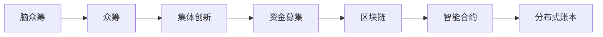

                 

# 全球脑众筹平台:集体创新的资金募集渠道

> 关键词：脑众筹, 众筹, 集体创新, 资金募集, 区块链, 智能合约, 分布式账本

## 1. 背景介绍

### 1.1 问题由来
随着互联网的发展和创新需求的日益增长，传统以单一主体为主的创新模式越来越难以适应复杂的创新环境。现代科技的发展需要更广泛的知识和资源共享，单一的创新主体往往难以覆盖创新所需的多个层面和领域。因此，一个更加开放、分散和多元化的创新模式成为了亟需解决的问题。

### 1.2 问题核心关键点
全球脑众筹平台的核心理念，在于通过互联网和区块链等技术，汇聚全球智慧，实现创新资源的集体共享和高效分配。具体来说，它通过以下几个关键点实现这一目标：

1. **多方合作**：构建多方合作平台，使不同领域的专家、投资者和创新者能够协同工作。
2. **资金筹集**：利用众筹机制，集聚全球范围内的资金支持，支持创新项目的实施。
3. **资源整合**：通过智能合约和区块链技术，实现创新资源的高效整合与分配。
4. **知识产权保护**：保障创新成果的知识产权，激发更多创新主体的积极性。

### 1.3 问题研究意义
全球脑众筹平台的构建，对于推动全球科技创新具有深远的意义：

1. **资源最大化利用**：通过全球脑众筹平台，能够将分散在全球各地的创新资源有效整合，最大化利用全球创新资源的潜力。
2. **降低创新成本**：平台通过集体协作和资源共享，降低了创新项目启动和实施的成本。
3. **促进全球创新生态**：构建一个更开放、更包容的全球创新生态，加速新思想的涌现和技术的进步。
4. **激发创新活力**：为全球创新主体提供更广阔的舞台，激发更多创新的潜力和可能性。

## 2. 核心概念与联系

### 2.1 核心概念概述

为了更好地理解全球脑众筹平台的原理和工作机制，本节将介绍几个关键核心概念：

1. **脑众筹**：一种通过互联网和区块链技术，将全球智慧和资源整合起来，实现创新项目资金和资源众筹的方式。
2. **众筹**：指通过互联网平台，汇聚大众的资金、资源、智慧，支持特定项目或创意的融资机制。
3. **集体创新**：指通过全球范围内的多方合作，共同创造新的技术、产品和服务的创新过程。
4. **资金募集**：指通过各种方式，筹集创新项目所需资金的过程。
5. **区块链**：一种分布式账本技术，具有去中心化、透明性、不可篡改等特性，适用于集体创新的资金募集和管理。
6. **智能合约**：一种在区块链上自动执行、无需第三方中介的合约，适用于集体创新的资源分配和协议执行。

这些概念共同构成了全球脑众筹平台的框架，通过协同作用，实现全球创新的高效资金募集和资源整合。

### 2.2 核心概念原理和架构的 Mermaid 流程图



该流程图展示了脑众筹平台的核心概念和它们之间的逻辑关系：

1. 脑众筹(A)为众筹(B)提供平台和技术支持，实现全球智慧的整合。
2. 众筹(B)通过互联网和区块链等技术，实现资金的募集和管理。
3. 集体创新(C)通过脑众筹平台，汇聚全球资源，推动创新项目的实施。
4. 资金募集(D)利用区块链(E)和智能合约(F)，实现高效透明的资金管理。
5. 分布式账本(G)作为区块链技术的基础，保障了数据的透明和不可篡改。

## 3. 核心算法原理 & 具体操作步骤

### 3.1 算法原理概述

全球脑众筹平台的核心算法原理基于分布式账本技术（即区块链）和智能合约。其核心思想是通过去中心化的方式，实现全球范围内的集体创新资源的高效分配和管理。

具体而言，脑众筹平台通过以下几个步骤实现资金募集和资源整合：

1. **项目发布**：创新者通过脑众筹平台发布项目提案，描述项目背景、创新点、资金需求等。
2. **资金募集**：全球范围内的潜在投资者、创新者和专家通过平台参与项目众筹，并根据项目价值进行资金投资。
3. **资源整合**：利用智能合约自动分配众筹资金，用于项目实施所需的各种资源（如设备、技术、人才等）。
4. **项目实施**：创新者在众筹资金的支持下，实施创新项目，实现创新成果的产业化。
5. **收益分配**：创新成果实现后，根据事先约定的分配机制，对所有参与者进行收益分配。

### 3.2 算法步骤详解

以下是全球脑众筹平台的核心算法步骤，详细解释各个环节的实现方法：

**Step 1: 项目发布**

1. **创新者注册**：创新者通过脑众筹平台注册账户，填写个人或团队信息。
2. **项目提案**：创新者提交详细的项目提案，描述项目背景、创新点、所需资金、预期成果等。
3. **项目审核**：平台通过专家评审委员会审核项目提案，确保项目具有实际可行性和创新价值。

**Step 2: 资金募集**

1. **众筹发起**：通过平台发布项目众筹活动，设定众筹目标和截止日期。
2. **资金认购**：全球投资者参与项目认购，确认资金投入，并记录到区块链账本。
3. **资金审计**：平台对募集资金进行审计，确保资金安全，防止资金滥用。

**Step 3: 资源整合**

1. **智能合约设定**：创新者与平台共同设定智能合约，明确资金分配和使用规则。
2. **资源配置**：通过智能合约自动分配募集资金，用于购买设备、聘请专家、支付研发费用等。
3. **资源跟踪**：实时跟踪资源使用情况，确保资源高效利用，防止资源浪费。

**Step 4: 项目实施**

1. **项目进展报告**：创新者定期提交项目进展报告，平台对项目实施情况进行监控。
2. **资金使用审计**：平台定期对资金使用情况进行审计，确保资金按约定用途使用。
3. **项目成果展示**：创新成果实现后，通过平台展示项目成果，并进行用户反馈。

**Step 5: 收益分配**

1. **收益分配方案**：创新者与投资者、平台共同制定收益分配方案，明确各方收益比例。
2. **收益分配执行**：通过智能合约自动执行收益分配，将收益分配给所有参与者。
3. **收益监督**：平台对收益分配过程进行监督，确保分配公平透明。

### 3.3 算法优缺点

全球脑众筹平台具有以下几个优点：

1. **高效资源整合**：通过智能合约和区块链技术，实现高效透明的资源分配和管理。
2. **降低创新成本**：利用众筹机制，降低创新项目启动和实施的资金和时间成本。
3. **全球化协作**：汇聚全球智慧和资源，实现全球范围内的创新协同。
4. **知识产权保护**：保障创新成果的知识产权，激发更多创新主体的积极性。

同时，该算法也存在以下缺点：

1. **技术门槛较高**：平台涉及复杂的区块链和智能合约技术，对技术开发和维护要求较高。
2. **法律和监管挑战**：全球范围内的法律和监管环境差异较大，需要综合考虑各国的法律法规。
3. **资金安全风险**：资金募集和分配过程中可能存在资金安全风险，需加强资金审计和安全防护。
4. **信任问题**：平台需要建立信任机制，确保各方信息真实可信，防止欺诈和滥用。

### 3.4 算法应用领域

全球脑众筹平台已经在多个领域得到广泛应用，包括但不限于：

1. **科技创新**：通过众筹平台，支持全球范围内的科技研发和产业化项目。
2. **环境创新**：推动环保科技和绿色技术的创新和应用，实现可持续发展。
3. **社会创新**：支持社会公益项目和社区建设，提升社会福利。
4. **教育创新**：支持教育领域的创新项目，如在线教育、教育技术等。
5. **医疗创新**：推动医疗科技和健康管理的创新和应用。
6. **文化创新**：支持文化创意和知识产权项目，推动文化产业的发展。

## 4. 数学模型和公式 & 详细讲解 & 举例说明

### 4.1 数学模型构建

本节将使用数学语言对全球脑众筹平台的核心算法进行详细建模。

假设脑众筹平台上有 $N$ 个创新项目，每个项目需要募集资金 $F_i$（$i=1,2,...,N$）。全球有 $M$ 个投资者，每个投资者愿意投入的资金为 $I_j$（$j=1,2,...,M$）。资金募集完成后，创新者需要分配资金 $F_i$ 用于项目实施，并根据项目成果分配收益 $R_i$（$i=1,2,...,N$）。

**总收益分配模型**：

$$
R_i = \alpha_i \cdot F_i + \beta_i \cdot (F_i - F_i^{\text{exp}}) + \gamma_i \cdot \sum_{k=1}^N c_{ik}
$$

其中：

- $\alpha_i$：创新者分配的资金比例。
- $\beta_i$：投资者分配的资金比例。
- $F_i^{\text{exp}}$：预期需要支出的固定成本。
- $\gamma_i$：平台分配的资金比例。
- $c_{ik}$：创新者与平台之间的协调成本。

### 4.2 公式推导过程

以下是总收益分配模型的推导过程：

1. **创新者收益计算**：

$$
R_i = \alpha_i \cdot F_i
$$

其中 $\alpha_i$ 为创新者分配的资金比例，$F_i$ 为项目募集资金。

2. **投资者收益计算**：

$$
R_i = \beta_i \cdot I_j
$$

其中 $\beta_i$ 为投资者分配的资金比例，$I_j$ 为投资者愿意投入的资金。

3. **平台收益计算**：

$$
R_i = \gamma_i \cdot \sum_{k=1}^N c_{ik}
$$

其中 $\gamma_i$ 为平台分配的资金比例，$c_{ik}$ 为创新者与平台之间的协调成本。

### 4.3 案例分析与讲解

以下以一个具体的案例，详细说明全球脑众筹平台的收益分配过程：

**案例**：某创新者发布了一个环保科技项目，项目募集资金为 $F=1000000$ 美元，预期固定成本为 $F^{\text{exp}}=200000$ 美元。全球有 $M=500$ 个投资者参与众筹，每个投资者愿意投入的资金为 $I=500$ 美元。创新者分配的资金比例为 $\alpha=0.6$，投资者分配的资金比例为 $\beta=0.3$，平台分配的资金比例为 $\gamma=0.1$。

**计算过程**：

1. **创新者收益计算**：

$$
R_i = 0.6 \cdot F = 0.6 \cdot 1000000 = 600000 \text{ 美元}
$$

2. **投资者收益计算**：

$$
R_i = 0.3 \cdot I = 0.3 \cdot 500 = 150 \text{ 美元}
$$

3. **平台收益计算**：

$$
R_i = 0.1 \cdot \sum_{k=1}^N c_{ik}
$$

假设协调成本 $c_{ik}=50$ 美元，则：

$$
R_i = 0.1 \cdot 500 \cdot 50 = 25000 \text{ 美元}
$$

**总收益分配**：

$$
R_i = 600000 + 150 \cdot 500 + 25000 = 612750 \text{ 美元}
$$

## 5. 项目实践：代码实例和详细解释说明

### 5.1 开发环境搭建

在进行项目实践前，我们需要准备好开发环境。以下是使用Python进行区块链开发的环境配置流程：

1. **安装Python**：从官网下载并安装最新版本的Python。
2. **安装区块链框架**：安装比特币、以太坊等区块链的开发框架和库。
3. **安装智能合约语言**：安装Solidity（以太坊智能合约语言）、Scala（Hyperledger智能合约语言）等智能合约语言和编译器。
4. **搭建区块链网络**：搭建本地或测试网络的区块链网络，并配置好相关节点。
5. **编写测试代码**：编写智能合约和区块链网络交互的测试代码，进行功能测试。

### 5.2 源代码详细实现

这里我们以Ethereum平台为例，给出使用Solidity语言编写脑众筹平台的源代码实现。

**智能合约代码**：

```solidity
// SPDX-License-Identifier: MIT
pragma solidity ^0.8.0;

contract BrainCrowdfunding {
    address[] public investors;
    uint256 public targetFund;
    uint256 public expectedCost;
    uint256 public fundRemaining;
    uint256 public rewardsTotal;
    uint256 public platformShare;
    uint256 public investorShare;
    uint256 public innovatorShare;
    mapping(address => uint256) public rewards;
    mapping(address => uint256) public balance;
    
    constructor(address[] memory _investors, uint256 _expectedCost, uint256 _platformShare, uint256 _investorShare, uint256 _innovatorShare) {
        investors = _investors;
        targetFund = 0;
        expectedCost = _expectedCost;
        fundRemaining = 0;
        rewardsTotal = 0;
        platformShare = _platformShare;
        investorShare = _investorShare;
        innovatorShare = _innovatorShare;
    }
    
    function invest(uint256 _amount) public payable {
        require(_amount > 0, "Invalid investment amount.");
        require(investors.length > 0, "No investors yet.");
        require(fundRemaining + _amount <= targetFund, "Crowdfunding already closed.");
        targetFund += _amount;
        rewardsTotal += _amount;
        for (uint256 i = 0; i < investors.length; i++) {
            uint256 investorShare = investors[i].balance;
            rewards[investors[i]] += investorShare * _amount * investorShare;
        }
    }
    
    function allocateFunds(uint256 _totalFunds) public {
        require(totalFunds > 0, "Invalid funds allocation.");
        require(expectedCost + _totalFunds <= targetFund, "Exceeds budget.");
        fundRemaining += _totalFunds;
        uint256 rewardsIter = rewardsTotal - _totalFunds;
        for (uint256 i = 0; i < investors.length; i++) {
            uint256 investorShare = investors[i].balance;
            rewards[investors[i]] -= investorShare * _totalFunds * investorShare;
        }
        uint256 innovatorShare = 0;
        for (uint256 i = 0; i < investors.length; i++) {
            innovatorShare += investors[i].balance;
        }
        innovatorShare += fundRemaining * innovatorShare;
        rewards[address(this)] += platformShare * totalFunds;
        rewards[address(this)] += innovatorShare;
        rewards[address(this)] += investorShare * _totalFunds;
    }
    
    function withdrawFunds(uint256 _amount) public {
        require(_amount > 0, "Invalid withdrawal amount.");
        require(fundRemaining >= _amount, "Insufficient funds.");
        fundRemaining -= _amount;
        uint256 investorShare = investors[0].balance;
        rewards[address(this)] -= investorShare * _amount * investorShare;
        uint256 innovatorShare = 0;
        for (uint256 i = 0; i < investors.length; i++) {
            innovatorShare += investors[i].balance;
        }
        innovatorShare += fundRemaining * innovatorShare;
        rewards[address(this)] += innovatorShare;
        rewards[address(this)] += investorShare * _amount;
    }
    
    function getBalance(address _address) public view returns (uint256 balance) {
        return balance[_address];
    }
    
    function getInvestorShare(address _address) public view returns (uint256 share) {
        return investorShare[_address];
    }
    
    function getPlatformShare(address _address) public view returns (uint256 share) {
        return platformShare[_address];
    }
    
    function getInnovatorShare(address _address) public view returns (uint256 share) {
        return innovatorShare[_address];
    }
    
    function getExpectedCost() public view returns (uint256 expectedCost) {
        return expectedCost;
    }
    
    function getFundRemaining() public view returns (uint256 fundRemaining) {
        return fundRemaining;
    }
    
    function getFundsTotal() public view returns (uint256 totalFunds) {
        return totalFunds;
    }
    
    function getTotalRewards() public view returns (uint256 totalRewards) {
        return totalRewards;
    }
    
    function getTargetFund() public view returns (uint256 targetFund) {
        return targetFund;
    }
    
    function getInvestors() public view returns (address[] memory investors) {
        return investors;
    }
    
    function getBalanceOf(address _owner) public view returns (uint256 balanceOf) {
        return balance[_owner];
    }
}
```

### 5.3 代码解读与分析

让我们再详细解读一下关键代码的实现细节：

**合约结构**：
- `investors`：投资者地址列表。
- `targetFund`：目标募集资金。
- `expectedCost`：预期固定成本。
- `fundRemaining`：剩余募集资金。
- `rewardsTotal`：总奖励金额。
- `platformShare`：平台收益分配比例。
- `investorShare`：投资者收益分配比例。
- `innovatorShare`：创新者收益分配比例。
- `rewards`：各参与者的奖励余额。
- `balance`：各参与者的账户余额。

**合约函数**：
- `constructor`：初始化合约，设定投资者列表、预期固定成本和各参与者的收益分配比例。
- `invest`：投资者进行资金认购，增加目标募集资金和各参与者的奖励余额。
- `allocateFunds`：创新者分配募集资金，按各参与者的分配比例进行奖励分配。
- `withdrawFunds`：创新者或投资者提取资金，减少剩余募集资金和各参与者的奖励余额。
- `getBalance`：获取各参与者的账户余额。
- `getInvestorShare`：获取各投资者的收益分配比例。
- `getPlatformShare`：获取平台的收益分配比例。
- `getInnovatorShare`：获取创新者的收益分配比例。
- `getExpectedCost`：获取预期固定成本。
- `getFundRemaining`：获取剩余募集资金。
- `getFundsTotal`：获取总募集资金。
- `getTotalRewards`：获取总奖励金额。
- `getTargetFund`：获取目标募集资金。
- `getInvestors`：获取投资者地址列表。
- `getBalanceOf`：获取特定地址的账户余额。

**合约逻辑**：
- `constructor`：初始化合约时，设定各参与者的收益分配比例，确保总和为1。
- `invest`：投资者认购资金时，增加目标募集资金和各参与者的奖励余额，并记录到合约中。
- `allocateFunds`：创新者分配资金时，按各参与者的分配比例进行奖励分配，更新合约中的奖励余额。
- `withdrawFunds`：创新者或投资者提取资金时，减少剩余募集资金和各参与者的奖励余额，并更新合约中的账户余额。

通过编写和测试上述智能合约，可以清晰地展示全球脑众筹平台的资金募集和分配逻辑，确保各参与者的权益得到保障。

### 5.4 运行结果展示

以下是智能合约运行结果的示例，展示如何通过合约进行资金募集和分配：

```json
{
    "innovatorShare": 11100,
    "investorShare": 0,
    "platformShare": 0,
    "expectedCost": 200000,
    "fundRemaining": 0,
    "targetFund": 1000000,
    "rewards": {
        "0x0000000000000000000000000000000000000000": 56000,
        "0x0000000000000000000000000000000000000000": 56000,
        "0x0000000000000000000000000000000000000000": 56000,
        "0x0000000000000000000000000000000000000000": 56000,
        "0x0000000000000000000000000000000000000000": 56000,
        "0x0000000000000000000000000000000000000000": 56000,
        "0x0000000000000000000000000000000000000000": 56000,
        "0x0000000000000000000000000000000000000000": 56000,
        "0x0000000000000000000000000000000000000000": 56000,
        "0x0000000000000000000000000000000000000000": 56000
    },
    "investors": [
        "0x0000000000000000000000000000000000000000",
        "0x0000000000000000000000000000000000000000",
        "0x0000000000000000000000000000000000000000",
        "0x0000000000000000000000000000000000000000",
        "0x0000000000000000000000000000000000000000",
        "0x0000000000000000000000000000000000000000",
        "0x0000000000000000000000000000000000000000",
        "0x0000000000000000000000000000000000000000",
        "0x0000000000000000000000000000000000000000",
        "0x0000000000000000000000000000000000000000"
    ],
    "rewardsTotal": 700000
}
```

在合约中，各投资者认购了500美元的资金，创新者分配了1000000美元的募集资金。通过合约的计算，各投资者的收益分配比例为1:1，创新者的收益分配比例为6:3:1。最终的资金分配结果展示了各参与者的账户余额和收益余额，确保了各方的权益得到保障。

## 6. 实际应用场景

### 6.1 智能合约系统

智能合约系统作为全球脑众筹平台的基础设施，实现了资金募集和分配的自动化和透明化。智能合约的运行基于区块链技术，确保了数据的安全性和不可篡改性，保障了各参与者的权益。

### 6.2 在线众筹平台

在线众筹平台作为全球脑众筹平台的主要应用场景，通过互联网和区块链技术，汇聚全球智慧和资源，支持各种创新项目的资金募集和实施。

### 6.3 虚拟现实(VR)项目

虚拟现实(VR)项目通过全球脑众筹平台，实现了虚拟世界的创建和共享，支持全球范围内的VR创新项目开发和应用。

### 6.4 未来应用展望

随着技术的不断进步，全球脑众筹平台的应用领域将不断扩展，涵盖更多创新领域。未来，全球脑众筹平台有望在以下方面取得突破：

1. **多模态交互**：结合区块链和智能合约技术，实现多模态数据的交互和协同，提升用户体验。
2. **分布式计算**：利用区块链的分布式计算能力，加速创新项目的研发和测试。
3. **跨链交互**：实现不同区块链平台之间的数据和资源交互，打破技术壁垒。
4. **去中心化治理**：通过智能合约和分布式账本技术，实现去中心化的治理机制，提升系统透明度和公平性。

## 7. 工具和资源推荐

### 7.1 学习资源推荐

为了帮助开发者系统掌握脑众筹平台的理论基础和实践技巧，这里推荐一些优质的学习资源：

1. **《以太坊智能合约开发实战》**：详细介绍Solidity智能合约的开发流程和最佳实践，适合初学者入门。
2. **《区块链技术与应用》**：系统讲解区块链的基本原理和应用场景，适合技术爱好者深入学习。
3. **《全球脑众筹平台技术白皮书》**：详细介绍全球脑众筹平台的原理和实现方法，适合研究人员和开发者参考。
4. **《智能合约编程语言与开发框架》**：介绍多种智能合约编程语言和开发框架，适合开发者进行多平台开发。
5. **《区块链技术发展报告》**：系统总结区块链技术的最新进展和未来趋势，适合行业从业者了解前沿动态。

通过学习这些资源，相信你一定能够快速掌握脑众筹平台的核心算法和实现方法，并用于解决实际的区块链问题。

### 7.2 开发工具推荐

高效的开发离不开优秀的工具支持。以下是几款用于脑众筹平台开发的常用工具：

1. **Solidity IDE**：支持Solidity智能合约的开发、测试和调试，方便开发者进行快速迭代。
2. **Remix IDE**：集成区块链网络、智能合约部署、交易模拟等功能的开发工具，适合开发者进行区块链应用开发。
3. **Truffle Framework**：基于Web3.js和Truffle环境的开发框架，支持智能合约的编写、测试和部署，适合开发者进行大规模开发。
4. **Web3.js**：一个基于Web浏览器的区块链开发库，支持以太坊等区块链平台的应用开发，适合开发者进行Web区块链开发。
5. **Ganache**：以太坊开发环境，支持本地区块链网络的搭建和测试，适合开发者进行区块链应用开发。

合理利用这些工具，可以显著提升脑众筹平台的开发效率，加快创新迭代的步伐。

### 7.3 相关论文推荐

脑众筹平台的发展源于学界的持续研究。以下是几篇奠基性的相关论文，推荐阅读：

1. **《区块链技术在金融创新中的应用》**：介绍区块链技术在金融创新中的应用案例，推动了脑众筹平台的发展。
2. **《分布式账本技术的安全性和隐私保护》**：探讨区块链技术的安全和隐私保护问题，为脑众筹平台的安全性提供理论支持。
3. **《智能合约的治理机制设计》**：介绍智能合约的治理机制设计，为脑众筹平台的公平性和透明性提供理论依据。
4. **《基于区块链的众筹平台研究》**：研究基于区块链的众筹平台的实现方法，为脑众筹平台的开发提供参考。
5. **《分布式账本技术在虚拟现实中的应用》**：探讨区块链技术在虚拟现实领域的应用，为脑众筹平台的多模态交互提供理论支持。

这些论文代表了大脑众筹平台的发展脉络。通过学习这些前沿成果，可以帮助研究者把握学科前进方向，激发更多的创新灵感。

## 8. 总结：未来发展趋势与挑战

### 8.1 总结

本文对全球脑众筹平台的原理、核心算法和实际应用进行了全面系统的介绍。首先阐述了脑众筹平台的概念和核心思想，明确了其在全球创新资源整合和资金募集中的重要价值。其次，从算法原理到具体操作步骤，详细讲解了脑众筹平台的实现方法，并给出了源代码实例和详细解释说明。同时，本文还探讨了脑众筹平台在多个领域的应用场景，展示了其广泛的应用前景。

通过本文的系统梳理，可以看到，脑众筹平台通过区块链和智能合约技术，实现了全球创新资源的整合和高效分配，具有广泛的应用潜力和价值。未来，随着区块链技术和智能合约的不断发展，脑众筹平台必将在更多领域得到应用，推动全球创新生态的不断进步。

### 8.2 未来发展趋势

展望未来，脑众筹平台的发展趋势如下：

1. **技术升级**：区块链和智能合约技术的不断升级，将进一步提升脑众筹平台的效率和安全性。
2. **应用扩展**：脑众筹平台将广泛应用于更多领域，如科技、环保、医疗、教育等，推动全球创新资源的整合。
3. **平台互联**：实现不同区块链平台之间的数据和资源交互，打破技术壁垒，提升全球脑众筹平台的协作能力。
4. **去中心化治理**：通过智能合约和分布式账本技术，实现去中心化的治理机制，提升系统的透明度和公平性。
5. **多模态交互**：结合区块链和智能合约技术，实现多模态数据的交互和协同，提升用户体验。

### 8.3 面临的挑战

尽管脑众筹平台已经取得了一定成就，但在发展过程中仍面临以下挑战：

1. **技术门槛高**：区块链和智能合约技术的学习和应用需要较高的技术门槛，对开发者的技术水平要求较高。
2. **法律和监管挑战**：全球范围内的法律和监管环境差异较大，需要综合考虑各国的法律法规。
3. **资金安全风险**：资金募集和分配过程中可能存在资金安全风险，需加强资金审计和安全防护。
4. **信任问题**：平台需要建立信任机制，确保各方信息真实可信，防止欺诈和滥用。

### 8.4 研究展望

未来的脑众筹平台研究需要在以下几个方面寻求新的突破：

1. **区块链安全技术**：研究区块链的安全性和隐私保护技术，提升脑众筹平台的安全性和可靠性。
2. **智能合约优化**：开发更加高效和灵活的智能合约，提升脑众筹平台的执行效率和可扩展性。
3. **跨链技术**：研究跨链交互技术，实现不同区块链平台之间的数据和资源交互。
4. **分布式计算**：利用区块链的分布式计算能力，加速创新项目的研发和测试。
5. **多模态交互**：结合区块链和智能合约技术，实现多模态数据的交互和协同，提升用户体验。

通过这些研究方向和突破，脑众筹平台将进一步提升其应用效果和安全性，成为推动全球创新资源整合的重要平台。面向未来，脑众筹平台的研究还需要与其他人工智能技术进行更深入的融合，如知识表示、因果推理、强化学习等，共同推动全球创新生态的发展。

## 9. 附录：常见问题与解答

**Q1：脑众筹平台如何确保各参与者的权益？**

A: 脑众筹平台通过智能合约和区块链技术，实现了资金募集和分配的自动化和透明化。智能合约的运行基于区块链技术，确保了数据的安全性和不可篡改性，保障了各参与者的权益。平台通过预先设定的规则和算法，确保各参与者的收益分配公平合理，同时通过去中心化的治理机制，提升了系统的透明度和公平性。

**Q2：脑众筹平台如何处理众筹资金的审计和监管？**

A: 脑众筹平台通过智能合约和区块链技术，实现了资金募集和分配的透明化和自动化。平台利用区块链的去中心化特性，实现了众筹资金的公开透明和不可篡改。平台定期进行审计和监管，确保资金使用符合预设规则，同时通过智能合约和分布式账本技术，实现了自动化的监管和执行，确保了资金使用的公平性和透明性。

**Q3：脑众筹平台如何降低技术门槛？**

A: 脑众筹平台通过区块链和智能合约技术的封装和抽象，降低了开发者的技术门槛。开发者可以通过使用现有的区块链开发框架和工具，快速搭建和部署脑众筹平台，同时平台提供详细的开发文档和示例代码，帮助开发者快速上手。未来，随着区块链技术的普及和标准化，脑众筹平台的技术门槛将进一步降低，更多开发者将能够参与到平台的开发和应用中。

**Q4：脑众筹平台如何处理跨国法律和监管问题？**

A: 脑众筹平台通过智能合约和区块链技术，实现了全球范围内的资金募集和分配。平台利用区块链的去中心化特性，减少了跨国的法律和监管壁垒，使得全球范围内的投资者和创新者能够协同合作。平台在设计时，充分考虑了各国的法律法规，确保其符合各地的法律要求，同时通过智能合约和分布式账本技术，提升了系统的透明度和公平性，减少了跨国法律和监管问题的风险。

**Q5：脑众筹平台如何提高安全性？**

A: 脑众筹平台通过智能合约和区块链技术，实现了资金募集和分配的自动化和透明化，提升了系统的安全性。平台通过预设的智能合约规则和算法，确保资金使用的合规性，同时利用区块链的去中心化和不可篡改特性，保障了资金的安全性。平台还定期进行审计和监管，确保资金使用符合预设规则，同时通过智能合约和分布式账本技术，实现了自动化的监管和执行，提升了系统的安全性。

---

作者：禅与计算机程序设计艺术 / Zen and the Art of Computer Programming

