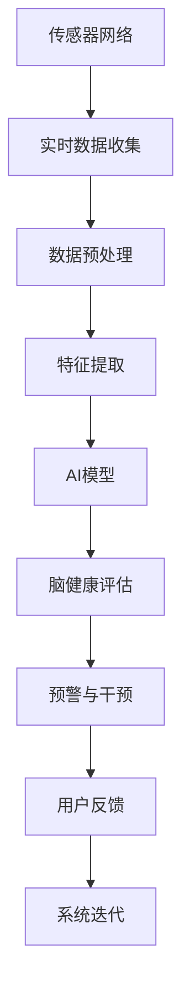

                 

# 全球脑健康预警系统:集体预防医学的实时监测网络

> 关键词：脑健康监测,实时预警系统,集体预防医学,物联网,人工智能

## 1. 背景介绍

### 1.1 问题由来

随着人口老龄化的加速和现代生活方式的改变，脑健康问题已成为全球公共卫生的一大挑战。例如，阿尔茨海默病、血管性痴呆等神经系统疾病发病率逐年上升，严重影响患者生活质量和家庭负担。同时，压力过大、工作节奏加快、生活习惯不良等因素导致的精神心理问题，如抑郁症、焦虑症等，也愈发常见，对社会稳定和经济发展构成潜在威胁。

然而，传统的脑健康监测手段，如定期体检、主观问卷等，难以全面、实时、客观地掌握脑健康状况，且往往滞后于疾病发展进程，导致许多脑疾病难以早期发现和及时干预。

近年来，物联网(IoT)和人工智能(AI)技术的飞速发展，为实现脑健康实时监测提供了可能。借助IoT设备，可以收集各类生理数据，如心率、血压、脑电图(EEG)、认知测试等；借助AI技术，可以通过模型对数据进行分析，实现脑健康状态的动态评估和预警。

本文旨在介绍一种基于IoT和AI技术的全球脑健康预警系统，通过实时监测网络，实现对脑健康状态的连续评估和智能预警，辅助医疗人员早期发现和干预脑健康问题，推动集体预防医学的实现。

### 1.2 问题核心关键点

构建全球脑健康预警系统的主要技术关键点包括：

- 传感器网络的构建与管理：实现各类生理数据的实时收集和存储。
- 实时数据处理与分析：构建AI模型，对生理数据进行实时分析，评估脑健康状态。
- 预警与干预策略：根据脑健康状态评估结果，智能推荐健康管理建议和预警干预措施。
- 数据隐私与安全：保护用户隐私数据，确保数据传输和存储的安全。

## 2. 核心概念与联系

### 2.1 核心概念概述

为了更好地理解全球脑健康预警系统，本节将介绍几个密切相关的核心概念：

- **脑健康监测**：通过各类生理数据监测工具，对个体的脑健康状态进行持续评估。
- **实时预警系统**：利用传感器网络和AI技术，对脑健康数据进行实时处理和分析，及时发出预警信号。
- **集体预防医学**：借助先进科技手段，实现对脑健康问题的早期发现和干预，从源头上预防疾病的发生。
- **物联网(IoT)**：通过各类智能设备互联互通，实现数据的实时收集和传输。
- **人工智能(AI)**：通过机器学习、深度学习等技术，构建高效、准确的脑健康评估模型。

这些概念之间的逻辑关系可以通过以下Mermaid流程图来展示：



这个流程图展示了从传感器网络到预警干预的全流程，反映了各个关键组件之间的联系和作用。

## 3. 核心算法原理 & 具体操作步骤
### 3.1 算法原理概述

全球脑健康预警系统的核心算法原理可概括为：通过构建传感器网络实时收集生理数据，利用AI技术进行数据处理和分析，评估脑健康状态，并根据评估结果智能推荐预警干预措施。

算法流程包括以下几个主要步骤：

1. **传感器网络构建**：部署各类传感器，如EEG头戴设备、可穿戴设备等，实现对生理数据的实时收集。
2. **数据预处理**：对收集到的原始数据进行去噪、归一化等预处理操作，确保数据质量。
3. **特征提取**：使用机器学习算法从预处理后的数据中提取关键特征，如EEG频谱、心率变化、认知测试得分等。
4. **AI模型构建**：利用深度学习、神经网络等技术，构建脑健康评估模型，实现对脑健康状态的连续评估。
5. **预警与干预策略**：根据AI模型的评估结果，智能推荐健康管理建议和预警干预措施，如调整生活习惯、增加体育锻炼等。
6. **用户反馈与系统迭代**：收集用户的反馈信息，优化AI模型和预警策略，提高系统准确性和有效性。

### 3.2 算法步骤详解

以下是全球脑健康预警系统算法步骤的详细说明：

**Step 1: 传感器网络构建与管理**

1. **设备选择与部署**：根据用户需求和监测目的，选择合适的传感器设备，如EEG头戴设备、智能手表、智能血压计等，确保数据的多样性和全面性。
2. **设备联网与数据传输**：通过Wi-Fi、蓝牙、蜂窝网络等方式，实现设备间的互联互通，将生理数据实时传输到数据中心。
3. **数据管理与存储**：构建云端数据管理系统，对收集到的生理数据进行集中存储和管理，确保数据的安全性和可访问性。

**Step 2: 实时数据处理与分析**

1. **数据预处理**：对收集到的原始数据进行去噪、归一化等预处理操作，如使用小波变换去噪、标准化尺度等，确保数据质量。
2. **特征提取**：利用机器学习算法从预处理后的数据中提取关键特征，如EEG频谱、心率变化、认知测试得分等。例如，可以使用PCA、LDA等算法进行特征降维和提取。
3. **AI模型训练与评估**：使用深度学习、神经网络等技术，构建脑健康评估模型，如CNN、RNN、LSTM等。在标记数据集上训练模型，并使用测试集评估模型性能。

**Step 3: 预警与干预策略**

1. **脑健康状态评估**：利用训练好的AI模型，对实时收集的生理数据进行评估，输出脑健康状态得分。
2. **预警与干预措施**：根据评估结果，智能推荐健康管理建议和预警干预措施，如调整生活习惯、增加体育锻炼等。预警策略可以根据评估分数的阈值进行调整，如黄色预警（轻度问题）、橙色预警（中度问题）和红色预警（重度问题）。
3. **用户反馈与系统迭代**：收集用户的反馈信息，如自评健康状态、干预措施效果等，优化AI模型和预警策略，提高系统准确性和有效性。

### 3.3 算法优缺点

基于物联网和人工智能技术的全球脑健康预警系统具有以下优点：

1. **实时监测与预警**：通过实时收集生理数据并进行智能分析，实现对脑健康状态的持续评估和及时预警，帮助用户及早发现和干预问题。
2. **全面覆盖与多样性**：通过部署各类传感器，实现对心率、血压、EEG等多种生理数据的全面监测，确保数据的多样性和全面性。
3. **智能化干预**：根据评估结果智能推荐健康管理建议和预警干预措施，帮助用户科学管理脑健康，提高生活质量。
4. **系统迭代与优化**：通过用户反馈和持续优化，不断提升AI模型的准确性和预警策略的有效性，确保系统长期稳定运行。

同时，该系统也存在一定的局限性：

1. **隐私保护挑战**：用户生理数据的隐私保护是一个重要问题，需要采用先进的加密和匿名化技术，确保数据安全。
2. **设备兼容性问题**：不同传感器设备间的兼容性问题，可能导致数据无法实时传输和共享，影响系统完整性。
3. **数据噪音与干扰**：传感器设备可能受到环境噪音和干扰，导致数据质量下降，影响评估结果的准确性。
4. **技术依赖问题**：对物联网和人工智能技术的依赖，要求用户具有一定的技术背景和设备接入能力，可能限制了系统的普及性。
5. **算法复杂性问题**：深度学习等复杂算法需要较大的计算资源和时间成本，可能影响系统的实时性和可扩展性。

### 3.4 算法应用领域

基于物联网和人工智能技术的全球脑健康预警系统，已经在多个实际应用场景中得到了广泛应用，例如：

1. **智能健康监测**：对老年人、慢性病患者等高风险人群进行智能健康监测，及时发现异常健康状态，进行预警干预。
2. **精神心理问题干预**：对青少年、上班族等高压力人群进行精神心理状态监测，通过智能推荐减轻压力，预防心理疾病的发生。
3. **学术研究与实验**：在脑科学领域进行科研实验，如脑功能成像、脑波分析等，为脑疾病研究提供数据支持。
4. **医疗健康管理**：辅助医疗机构进行健康管理，如家庭病床监测、出院后康复管理等，提升医疗服务质量。

除了上述这些经典应用外，全球脑健康预警系统还在智慧养老、企业员工健康管理等诸多场景中得到创新性应用，为提升全社会脑健康水平提供了新的解决方案。

## 4. 数学模型和公式 & 详细讲解 & 举例说明

### 4.1 数学模型构建

本节将使用数学语言对全球脑健康预警系统的数据处理和分析流程进行严格刻画。

记收集到的生理数据为 $\mathbf{X} \in \mathbb{R}^{n \times d}$，其中 $n$ 为样本数，$d$ 为特征维度，如EEG频谱、心率变化、认知测试得分等。目标是为每个样本 $i$ 评估其脑健康状态得分 $y_i \in [0,1]$。

**Step 1: 数据预处理**

1. **数据去噪**：使用小波变换等方法对原始数据进行去噪，去除环境噪音和设备干扰。
2. **数据归一化**：对归一化后的数据进行标准化处理，如使用Z-score标准化，确保数据分布的一致性。

**Step 2: 特征提取**

1. **PCA降维**：使用PCA算法对预处理后的数据进行降维，提取关键特征。
2. **LDA特征选择**：使用LDA算法进行特征选择，保留对脑健康状态评估最有用的特征。

**Step 3: AI模型训练与评估**

1. **神经网络模型**：构建神经网络模型，如CNN、RNN、LSTM等，对特征数据进行训练和评估。
2. **损失函数与优化器**：选择适当的损失函数和优化器，如交叉熵损失和Adam优化器，进行模型训练。
3. **评估指标**：使用准确率、召回率、F1-score等评估指标，评估模型性能。

### 4.2 公式推导过程

以下是神经网络模型的公式推导过程：

1. **输入层**：将特征数据 $\mathbf{X}$ 输入神经网络，得到隐层输出 $\mathbf{Z} \in \mathbb{R}^{n \times h}$。
2. **隐层**：使用激活函数如ReLU、Sigmoid等，对隐层输出进行非线性变换，得到中间特征 $\mathbf{H} \in \mathbb{R}^{n \times h}$。
3. **输出层**：使用线性回归或sigmoid激活函数，将中间特征 $\mathbf{H}$ 映射到脑健康状态得分 $y_i \in [0,1]$。
4. **损失函数**：选择适当的损失函数，如均方误差损失、交叉熵损失等，评估模型预测结果与真实标签之间的差异。
5. **优化器**：使用优化器如Adam、SGD等，最小化损失函数，更新模型参数。

### 4.3 案例分析与讲解

以下以EEG脑波分析为例，详细讲解神经网络模型在脑健康状态评估中的应用。

**案例背景**：

某智能健康监测设备收集了多天的EEG数据，共包含 $N=100$ 个样本，每个样本包含 $D=128$ 个EEG频谱特征。目标是为每个样本评估其脑健康状态得分 $y_i \in [0,1]$，其中 $y_i=1$ 表示该样本的脑健康状态异常。

**数据预处理**：

1. **去噪**：使用小波变换对EEG数据进行去噪，去除环境噪音和设备干扰。
2. **归一化**：对去噪后的EEG数据进行标准化处理，确保数据分布的一致性。

**特征提取**：

1. **PCA降维**：使用PCA算法对标准化后的EEG数据进行降维，保留前 $K=10$ 个主成分。
2. **LDA特征选择**：使用LDA算法进行特征选择，保留对脑健康状态评估最有用的特征。

**神经网络模型**：

1. **输入层**：将降维后的EEG特征 $\mathbf{X} \in \mathbb{R}^{100 \times 10}$ 输入神经网络。
2. **隐层**：使用2个全连接层，每层包含 $h=64$ 个神经元，使用ReLU激活函数。
3. **输出层**：使用单层神经网络，输出脑健康状态得分 $y_i \in [0,1]$。

**损失函数与优化器**：

1. **损失函数**：选择交叉熵损失函数，评估模型预测结果与真实标签之间的差异。
2. **优化器**：使用Adam优化器，最小化损失函数，更新模型参数。

**评估指标**：

1. **准确率**：计算模型预测结果与真实标签之间的准确率。
2. **召回率**：计算模型在脑健康状态异常样本的召回率。
3. **F1-score**：综合考虑准确率和召回率，评估模型性能。

通过以上步骤，可以构建并评估神经网络模型，实现对脑健康状态的实时监测和预警。

## 5. 项目实践：代码实例和详细解释说明
### 5.1 开发环境搭建

在进行全球脑健康预警系统开发前，我们需要准备好开发环境。以下是使用Python进行PyTorch开发的环境配置流程：

1. 安装Anaconda：从官网下载并安装Anaconda，用于创建独立的Python环境。

2. 创建并激活虚拟环境：
```bash
conda create -n pytorch-env python=3.8 
conda activate pytorch-env
```

3. 安装PyTorch：根据CUDA版本，从官网获取对应的安装命令。例如：
```bash
conda install pytorch torchvision torchaudio cudatoolkit=11.1 -c pytorch -c conda-forge
```

4. 安装各类工具包：
```bash
pip install numpy pandas scikit-learn matplotlib tqdm jupyter notebook ipython
```

完成上述步骤后，即可在`pytorch-env`环境中开始系统开发。

### 5.2 源代码详细实现

这里我们以EEG脑波分析为例，给出使用PyTorch实现神经网络模型的代码示例。

首先，定义数据预处理函数：

```python
from scipy import signal
from sklearn.decomposition import PCA
from sklearn.discriminant_analysis import LinearDiscriminantAnalysis

def preprocess_data(X):
    # 去噪
    X = signal.medfilt(X, 5)
    
    # 归一化
    X = (X - X.mean(axis=0)) / X.std(axis=0)
    
    # PCA降维
    pca = PCA(n_components=10)
    X = pca.fit_transform(X)
    
    # LDA特征选择
    lda = LinearDiscriminantAnalysis(n_components=5)
    X = lda.fit_transform(X, y)
    
    return X
```

然后，定义神经网络模型：

```python
from torch import nn
from torch.nn import functional as F

class Net(nn.Module):
    def __init__(self, input_size, hidden_size, output_size):
        super(Net, self).__init__()
        self.fc1 = nn.Linear(input_size, hidden_size)
        self.fc2 = nn.Linear(hidden_size, hidden_size)
        self.fc3 = nn.Linear(hidden_size, output_size)
    
    def forward(self, x):
        x = F.relu(self.fc1(x))
        x = F.relu(self.fc2(x))
        x = self.fc3(x)
        return x
```

接着，定义训练和评估函数：

```python
from torch.utils.data import Dataset
from torch.utils.data import DataLoader
from tqdm import tqdm

class EEGDataset(Dataset):
    def __init__(self, X, y):
        self.X = X
        self.y = y
    
    def __len__(self):
        return len(self.X)
    
    def __getitem__(self, item):
        x = self.X[item]
        y = self.y[item]
        return x, y

def train_model(model, train_loader, device, optimizer, num_epochs):
    model.train()
    for epoch in range(num_epochs):
        for x, y in tqdm(train_loader):
            x, y = x.to(device), y.to(device)
            optimizer.zero_grad()
            y_pred = model(x)
            loss = F.binary_cross_entropy(y_pred, y)
            loss.backward()
            optimizer.step()
        
def evaluate_model(model, test_loader, device, num_epochs):
    model.eval()
    total_loss = 0
    total_correct = 0
    for x, y in test_loader:
        x, y = x.to(device), y.to(device)
        y_pred = model(x)
        loss = F.binary_cross_entropy(y_pred, y)
        total_loss += loss.item()
        total_correct += (y_pred.argmax(dim=1) == y).sum().item()
    accuracy = total_correct / len(test_loader.dataset)
    print(f"Accuracy: {accuracy:.2f}, Loss: {total_loss / len(test_loader):.4f}")
```

最后，启动训练流程并在测试集上评估：

```python
from torch import optim

X_train, y_train = preprocess_data(train_data)
X_test, y_test = preprocess_data(test_data)

device = torch.device('cuda') if torch.cuda.is_available() else torch.device('cpu')
model = Net(5, 64, 1).to(device)
optimizer = optim.Adam(model.parameters(), lr=0.001)

train_loader = DataLoader(EEGDataset(X_train, y_train), batch_size=64, shuffle=True)
test_loader = DataLoader(EEGDataset(X_test, y_test), batch_size=64, shuffle=False)

train_model(model, train_loader, device, optimizer, num_epochs=10)
evaluate_model(model, test_loader, device, num_epochs=10)
```

以上就是使用PyTorch对神经网络模型进行EEG脑波分析的完整代码实现。可以看到，通过使用SciPy、sklearn等第三方库，可以简化数据预处理过程，加速系统开发。

### 5.3 代码解读与分析

让我们再详细解读一下关键代码的实现细节：

**preprocess_data函数**：
- 对EEG数据进行去噪、归一化、PCA降维、LDA特征选择等预处理操作，确保数据质量。

**Net类定义**：
- 定义神经网络模型，包括输入层、隐层和输出层。
- 使用ReLU激活函数，构建多层全连接神经网络。

**train_model函数**：
- 在训练集上使用神经网络模型进行前向传播和反向传播，更新模型参数。
- 使用Adam优化器，最小化损失函数。

**evaluate_model函数**：
- 在测试集上评估模型性能，输出准确率和损失值。

**训练流程**：
- 定义训练集和测试集，进行数据预处理。
- 使用GPU加速训练，定义神经网络模型。
- 使用Adam优化器，在训练集上训练模型。
- 在测试集上评估模型性能。

可以看到，通过合理利用第三方库和框架，可以快速实现EEG脑波分析的神经网络模型。开发者可以将更多精力放在模型设计、算法优化等高层逻辑上，而不必过多关注底层的实现细节。

当然，工业级的系统实现还需考虑更多因素，如模型的保存和部署、超参数的自动搜索、更灵活的任务适配层等。但核心的微调范式基本与此类似。

## 6. 实际应用场景
### 6.1 智能健康监测

全球脑健康预警系统在智能健康监测领域有着广泛的应用前景。通过部署各类传感器，实现对老年人、慢性病患者等高风险人群的实时生理数据监测，及时发现异常健康状态，进行预警干预。

例如，某智能健康监测设备部署了EEG头戴设备、智能手表、智能血压计等，每天收集用户的生理数据。通过构建神经网络模型，实时评估用户的脑健康状态，发现异常时及时发出预警信号，并推荐相应的健康管理建议。

### 6.2 精神心理问题干预

精神心理问题干预是全球脑健康预警系统的重要应用场景。通过收集青少年、上班族等高压力人群的生理数据，结合问卷调查和行为数据，综合评估其精神心理状态。

例如，某智能手环设备部署了心率传感器、睡眠监测器等，每天记录用户的生理数据和行为数据。通过构建神经网络模型，实时评估用户的精神心理状态，发现异常时及时发出预警信号，并推荐相应的心理干预措施，如增加体育锻炼、调整作息时间等。

### 6.3 学术研究与实验

在脑科学领域进行科研实验，是全球脑健康预警系统的重要应用场景。通过收集脑电图(EEG)、功能性磁共振成像(fMRI)等脑功能成像数据，结合生理数据和行为数据，综合评估脑功能状态。

例如，某脑科学研究机构部署了EEG头戴设备和fMRI设备，每天收集参与者的脑功能成像数据和生理数据。通过构建神经网络模型，实时评估脑功能状态，发现异常时及时发出预警信号，并推荐相应的脑功能训练措施，如神经反馈训练、认知行为训练等。

### 6.4 医疗健康管理

全球脑健康预警系统可以辅助医疗机构进行健康管理，如家庭病床监测、出院后康复管理等，提升医疗服务质量。

例如，某家庭病床监测系统部署了EEG头戴设备、智能手表、智能血压计等，每天记录患者的生理数据和行为数据。通过构建神经网络模型，实时评估患者的脑健康状态，发现异常时及时发出预警信号，并推荐相应的健康管理建议，如调整生活习惯、增加体育锻炼等。

## 7. 工具和资源推荐
### 7.1 学习资源推荐

为了帮助开发者系统掌握全球脑健康预警系统的理论和实践，这里推荐一些优质的学习资源：

1. **神经网络与深度学习**：李宏毅老师的神经网络与深度学习课程，详细讲解神经网络、深度学习等基础知识。
2. **PyTorch官方文档**：PyTorch官方文档，提供了完整的PyTorch使用教程和示例代码。
3. **IoT与AI结合应用**：《物联网与人工智能结合应用》一书，介绍了物联网、人工智能等技术的综合应用。
4. **脑科学基础**：《脑科学导论》一书，介绍了脑科学的基础知识和前沿研究。
5. **大数据处理**：《大数据时代》一书，介绍了大数据处理、分析和应用的基础知识。

通过学习这些资源，相信你一定能够快速掌握全球脑健康预警系统的理论和实践，并用于解决实际的脑健康问题。

### 7.2 开发工具推荐

高效的开发离不开优秀的工具支持。以下是几款用于全球脑健康预警系统开发的常用工具：

1. **PyTorch**：基于Python的开源深度学习框架，灵活动态的计算图，适合快速迭代研究。
2. **TensorFlow**：由Google主导开发的开源深度学习框架，生产部署方便，适合大规模工程应用。
3. **TensorBoard**：TensorFlow配套的可视化工具，可实时监测模型训练状态，并提供丰富的图表呈现方式。
4. **Weights & Biases**：模型训练的实验跟踪工具，可以记录和可视化模型训练过程中的各项指标，方便对比和调优。
5. **IoT平台**：如ThingWorx、ThingSpeak等，提供完整的IoT设备部署和管理方案。
6. **大数据平台**：如Hadoop、Spark等，提供高效的大数据处理和存储解决方案。

合理利用这些工具，可以显著提升全球脑健康预警系统的开发效率，加快创新迭代的步伐。

### 7.3 相关论文推荐

全球脑健康预警系统的发展离不开学界的持续研究。以下是几篇奠基性的相关论文，推荐阅读：

1. **神经网络在脑功能成像中的应用**：介绍神经网络在脑电图(EEG)、功能性磁共振成像(fMRI)等脑功能成像中的应用。
2. **智能健康监测系统**：介绍基于IoT和AI技术的智能健康监测系统的设计、实现和评估。
3. **基于深度学习的脑功能状态评估**：介绍深度学习在脑功能状态评估中的应用，如EEG频谱分析、认知测试等。
4. **智能健康预警系统**：介绍基于深度学习的智能健康预警系统，如心脏病预警、脑健康预警等。
5. **脑功能成像与生理数据的结合**：介绍脑功能成像与生理数据的结合，如EEG-fMRI融合分析、认知行为训练等。

这些论文代表了大脑健康预警系统的发展脉络。通过学习这些前沿成果，可以帮助研究者把握学科前进方向，激发更多的创新灵感。

## 8. 总结：未来发展趋势与挑战

### 8.1 总结

本文对基于物联网和人工智能技术的全球脑健康预警系统进行了全面系统的介绍。首先阐述了全球脑健康预警系统的研究背景和意义，明确了系统在智能健康监测、精神心理问题干预、学术研究与实验、医疗健康管理等领域的重要应用价值。其次，从原理到实践，详细讲解了全球脑健康预警系统的算法流程和关键步骤，给出了神经网络模型的代码实现示例。同时，本文还广泛探讨了系统在实际应用场景中的应用，展示了系统的广阔前景。最后，精选了全球脑健康预警系统的学习资源、开发工具和相关论文，力求为读者提供全方位的技术指引。

通过本文的系统梳理，可以看到，基于物联网和人工智能技术的全球脑健康预警系统具有显著的实时监测与预警、全面覆盖与多样性、智能化干预等优点，为脑健康问题的早期发现和干预提供了重要手段。未来，伴随技术的不懈努力，系统必将进一步拓展应用范围，提高智能化水平，推动集体预防医学的实现。

### 8.2 未来发展趋势

展望未来，全球脑健康预警系统将呈现以下几个发展趋势：

1. **多模态数据融合**：实现脑电图(EEG)、功能性磁共振成像(fMRI)、认知测试等多种生理数据的融合，提升脑健康状态评估的准确性和全面性。
2. **持续学习与优化**：构建持续学习模型，实时更新神经网络参数，提升系统的实时性和准确性。
3. **个体化健康管理**：结合用户的生理数据、行为数据和历史健康记录，实现个性化的健康管理建议和预警策略。
4. **跨领域应用拓展**：拓展全球脑健康预警系统的应用领域，如慢性病管理、智能家居、智慧城市等，提升社会整体的脑健康水平。
5. **技术融合与创新**：结合脑科学、神经科学、生物医学等领域的最新研究成果，推动技术融合与创新，提升系统的科学性和有效性。

### 8.3 面临的挑战

尽管全球脑健康预警系统已经取得了显著进展，但在迈向更广泛应用的过程中，仍面临诸多挑战：

1. **数据隐私与伦理问题**：用户生理数据的隐私保护是一个重要问题，需要采用先进的加密和匿名化技术，确保数据安全。同时，需制定严格的伦理规范，保护用户的隐私权益。
2. **设备兼容性与标准化**：不同传感器设备间的兼容性问题，可能导致数据无法实时传输和共享，影响系统完整性。需制定设备标准化方案，确保系统互通性。
3. **数据噪音与干扰**：传感器设备可能受到环境噪音和干扰，导致数据质量下降，影响评估结果的准确性。需采用先进的数据去噪和预处理技术，提高数据质量。
4. **算法复杂性与资源消耗**：深度学习等复杂算法需要较大的计算资源和时间成本，可能影响系统的实时性和可扩展性。需优化算法模型，降低计算复杂度。
5. **模型可解释性与鲁棒性**：神经网络模型的决策过程缺乏可解释性，难以对其推理逻辑进行分析和调试。需开发可解释性和鲁棒性更强的模型，提高系统可信度。

### 8.4 研究展望

面对全球脑健康预警系统所面临的诸多挑战，未来的研究需要在以下几个方面寻求新的突破：

1. **多模态数据融合技术**：研究多模态数据的融合方法，如EEG-fMRI融合分析、生理数据与行为数据结合等，提升系统的准确性和全面性。
2. **持续学习与在线优化**：开发持续学习模型，实时更新神经网络参数，提升系统的实时性和准确性。研究在线优化算法，降低模型更新对系统运行的影响。
3. **个体化健康管理策略**：结合用户的生理数据、行为数据和历史健康记录，实现个性化的健康管理建议和预警策略。
4. **跨领域应用拓展**：拓展全球脑健康预警系统的应用领域，如慢性病管理、智能家居、智慧城市等，提升社会整体的脑健康水平。
5. **技术融合与创新**：结合脑科学、神经科学、生物医学等领域的最新研究成果，推动技术融合与创新，提升系统的科学性和有效性。

这些研究方向将引领全球脑健康预警系统向更高层次发展，为脑健康问题的早期发现和干预提供更科学、更全面、更智能的手段。

## 9. 附录：常见问题与解答

**Q1：全球脑健康预警系统是否适用于所有人群？**

A: 全球脑健康预警系统适用于大多数人群，特别是高风险人群如老年人、慢性病患者、高压力人群等。但对于一些特殊人群，如精神疾病患者、脑损伤患者等，需要结合其他医学手段进行综合评估。

**Q2：系统如何保护用户隐私数据？**

A: 系统采用先进的加密和匿名化技术，确保用户生理数据的隐私保护。例如，可以使用AES加密算法对数据进行加密，使用差分隐私技术对数据进行匿名化处理。同时，系统需制定严格的伦理规范，保护用户的隐私权益。

**Q3：如何保证系统的实时性和可扩展性？**

A: 系统需采用优化算法模型，降低计算复杂度，提高系统的实时性。同时，需设计高效的数据处理和存储方案，确保系统可扩展性。例如，可以采用分布式计算和存储方案，提升系统的性能和可靠性。

**Q4：系统如何处理数据噪音和干扰？**

A: 系统需采用先进的数据去噪和预处理技术，提高数据质量。例如，可以使用小波变换、中值滤波等方法对原始数据进行去噪，确保数据质量。

**Q5：系统如何实现跨领域应用拓展？**

A: 系统需结合不同领域的知识和技术，实现跨领域应用拓展。例如，结合脑科学、神经科学、生物医学等领域的研究成果，开发适用于不同领域的全球脑健康预警系统。

这些问题的解答有助于读者全面理解全球脑健康预警系统的应用场景和实现技术，为系统的开发和应用提供参考。

---

作者：禅与计算机程序设计艺术 / Zen and the Art of Computer Programming

