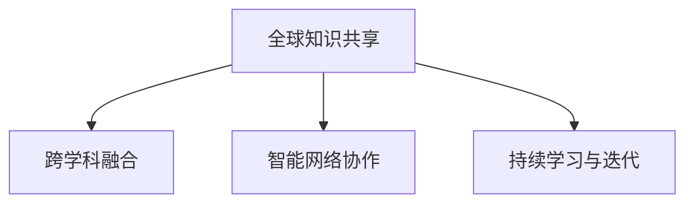

                 

# 全球脑创新:加速人类进步的引擎

## 1. 背景介绍

### 1.1 问题由来
在快速发展的全球化时代，人类的进步与创新日新月异。从智能手机到人工智能，从基因编辑到量子计算，每一次技术突破都极大地推动了社会的进步。而这一过程的背后，有一股不为人知的力量，那就是“全球脑创新”。全球脑创新，不仅仅是一个名词，更是一种全新的思维模式和研究范式，旨在通过集结全球智慧，加速人类的进步。

### 1.2 问题核心关键点
全球脑创新，其核心关键点在于以下几个方面：

- **全球知识共享**：全球脑创新强调将全球范围内的知识、技术和人才进行整合，打破地域和国别的界限，实现资源的最优配置。
- **跨学科融合**：将不同学科的知识和技术进行交叉融合，形成新的学科领域，如计算生物学、神经工程学等，拓宽了创新的边界。
- **智能网络协作**：通过互联网和AI技术，构建全球智能网络，实现实时、高效的协作和信息传递。
- **持续学习与迭代**：采用动态学习机制，不断更新和迭代，保持创新的活力和持续性。

### 1.3 问题研究意义
全球脑创新在当前和未来的科技创新中，具有重要的战略意义：

1. **加速科技进步**：通过汇聚全球智慧，可以更快地解决复杂问题，推动科技进步。
2. **优化资源配置**：实现资源的最优配置，避免重复劳动和资源浪费。
3. **促进国际合作**：增强国际合作，共享科技成果，共同应对全球性挑战。
4. **提升全球竞争力**：通过创新驱动，提升国家在全球竞争中的地位和影响力。

## 2. 核心概念与联系

### 2.1 核心概念概述

全球脑创新，包含了以下几个核心概念：

- **全球知识共享**：指通过互联网和人工智能技术，实现全球知识库的互联互通。
- **跨学科融合**：指不同学科间的知识和技术进行交叉融合，形成新的学科领域。
- **智能网络协作**：指利用互联网和AI技术，实现实时、高效的协作和信息传递。
- **持续学习与迭代**：指采用动态学习机制，不断更新和迭代，保持创新的活力和持续性。

这些概念之间相互关联，共同构成了全球脑创新的核心框架。

### 2.2 核心概念原理和架构的 Mermaid 流程图(Mermaid 流程节点中不要有括号、逗号等特殊字符)



### 2.3 核心概念之间的关系

从上述流程图中可以看出，全球知识共享是全球脑创新的基础，跨学科融合是创新的核心，智能网络协作是实现创新的手段，持续学习与迭代则是创新的保障。这四个概念相互支撑，共同推动全球脑创新的发展。

## 3. 核心算法原理 & 具体操作步骤

### 3.1 算法原理概述

全球脑创新算法，其核心思想是通过全球知识共享、跨学科融合和智能网络协作，实现全球智慧的整合和应用。这一过程，主要依赖于以下四个步骤：

1. **数据收集与预处理**：收集全球范围内的知识和技术数据，并进行预处理，包括数据清洗、标注、转换等。
2. **跨学科融合**：通过深度学习、自然语言处理等技术，实现不同学科知识之间的融合，形成新的学科领域。
3. **智能网络协作**：利用AI技术，构建全球智能网络，实现实时、高效的协作和信息传递。
4. **持续学习与迭代**：采用动态学习机制，不断更新和迭代，保持创新的活力和持续性。

### 3.2 算法步骤详解

以下是全球脑创新算法的详细步骤：

**Step 1: 数据收集与预处理**

1. **数据源选择**：选择全球范围内的知识和技术数据源，如学术论文、专利、技术报告等。
2. **数据收集**：通过爬虫、API等方式，收集数据。
3. **数据预处理**：包括数据清洗、标注、转换等，确保数据的质量和格式一致性。

**Step 2: 跨学科融合**

1. **选择融合方法**：选择适合的融合方法，如深度学习、自然语言处理、知识图谱等。
2. **知识表示**：将不同学科的知识表示为统一的格式，便于融合。
3. **融合操作**：进行知识融合操作，形成新的学科领域。

**Step 3: 智能网络协作**

1. **构建智能网络**：利用AI技术，构建全球智能网络，实现实时、高效的协作和信息传递。
2. **网络协作**：通过智能网络，实现全球范围内的协作，共享研究成果和技术。
3. **动态更新**：实时更新网络中的数据和信息，保持网络的活跃度和信息的时效性。

**Step 4: 持续学习与迭代**

1. **动态学习机制**：采用动态学习机制，不断更新和迭代。
2. **迭代周期**：设定迭代周期，定期对全球脑创新算法进行优化和更新。
3. **迭代反馈**：根据迭代结果，进行反馈和优化，保持算法的持续性和有效性。

### 3.3 算法优缺点

全球脑创新算法具有以下优点：

1. **全球智慧整合**：通过全球知识共享，实现全球智慧的整合和应用。
2. **创新速度快**：通过跨学科融合和智能网络协作，加速创新的速度。
3. **资源优化**：实现资源的最优配置，避免重复劳动和资源浪费。
4. **适应性强**：采用动态学习机制，不断更新和迭代，保持算法的适应性和持续性。

同时，该算法也存在一些局限性：

1. **数据质量问题**：全球知识共享依赖于数据源的质量，数据质量差可能导致算法效果不佳。
2. **跨学科融合难度大**：不同学科之间的知识融合难度较大，需要解决知识表示和融合问题。
3. **网络协作复杂**：智能网络协作需要解决实时性和安全性问题，可能面临复杂的技术挑战。
4. **动态学习复杂**：动态学习机制需要实时处理大量数据，对计算资源和算法要求较高。

尽管存在这些局限性，但全球脑创新算法在当前和未来的科技创新中，仍具有重要的战略意义。未来相关研究的重点在于如何进一步提高数据质量和跨学科融合能力，提高智能网络协作的效率和安全性，同时兼顾动态学习机制的复杂性。

### 3.4 算法应用领域

全球脑创新算法已经在多个领域得到了广泛应用，例如：

- **科学研究**：通过全球脑创新算法，加速科学研究进程，推动前沿技术的发展。
- **企业创新**：帮助企业实现技术创新，提升企业的竞争力。
- **社会治理**：通过全球脑创新算法，解决全球性问题，如气候变化、公共卫生等。
- **教育培训**：通过全球脑创新算法，提供个性化的学习资源，提升教育培训的效果。
- **文化交流**：通过全球脑创新算法，促进不同文化的交流和理解，推动全球文化的发展。

除了上述这些应用外，全球脑创新算法还可以应用于更多领域，如农业、能源、交通等，为各行各业的发展提供新的思路和技术支持。

## 4. 数学模型和公式 & 详细讲解 & 举例说明

### 4.1 数学模型构建

全球脑创新算法的数学模型，主要包括以下几个方面：

1. **数据模型**：用于描述数据源和数据的结构和关系。
2. **融合模型**：用于描述不同学科知识融合的数学模型。
3. **网络模型**：用于描述智能网络协作的数学模型。
4. **学习模型**：用于描述动态学习机制的数学模型。

### 4.2 公式推导过程

**数据模型**

假设数据源有 $N$ 个，每个数据源有 $M$ 条数据，每条数据有 $D$ 个特征。则数据模型可以表示为：

$$
X = [x_1, x_2, ..., x_N]
$$

其中 $x_i$ 表示第 $i$ 个数据源的第 $j$ 条数据，$j = 1, ..., M$。

**融合模型**

假设融合方法为深度学习，则融合模型可以表示为：

$$
Y = f(X)
$$

其中 $Y$ 表示融合后的结果，$f$ 表示深度学习模型。

**网络模型**

假设智能网络中有 $K$ 个节点，每个节点有 $N_i$ 个邻居节点，节点间的连通概率为 $p$。则网络模型可以表示为：

$$
G = (V, E)
$$

其中 $V$ 表示节点集合，$E$ 表示边集合。

**学习模型**

假设动态学习机制采用在线梯度下降算法，则学习模型可以表示为：

$$
\theta \leftarrow \theta - \eta \nabla_{\theta}L(\theta)
$$

其中 $\theta$ 表示模型参数，$L$ 表示损失函数，$\eta$ 表示学习率，$\nabla_{\theta}L(\theta)$ 表示损失函数对参数的梯度。

### 4.3 案例分析与讲解

以下是一个简单的案例分析：

**案例背景**：假设全球脑创新算法用于科学研究领域，收集了 $N=10$ 个数据源的 $M=1000$ 条数据，每个数据源有 $D=100$ 个特征。

**数据预处理**

1. **数据清洗**：对数据进行去噪、缺失值填充等处理。
2. **数据标注**：对数据进行标注，便于后续融合操作。
3. **数据转换**：将数据转换为统一的格式，便于融合操作。

**跨学科融合**

1. **选择融合方法**：选择深度学习模型，如RNN、CNN等。
2. **知识表示**：将不同学科的知识表示为向量形式，便于融合。
3. **融合操作**：通过深度学习模型进行融合操作，形成新的学科领域。

**智能网络协作**

1. **构建智能网络**：利用AI技术，构建全球智能网络，实现实时、高效的协作和信息传递。
2. **网络协作**：通过智能网络，实现全球范围内的协作，共享研究成果和技术。
3. **动态更新**：实时更新网络中的数据和信息，保持网络的活跃度和信息的时效性。

**持续学习与迭代**

1. **动态学习机制**：采用在线梯度下降算法，不断更新和迭代。
2. **迭代周期**：设定迭代周期，定期对全球脑创新算法进行优化和更新。
3. **迭代反馈**：根据迭代结果，进行反馈和优化，保持算法的持续性和有效性。

## 5. 项目实践：代码实例和详细解释说明

### 5.1 开发环境搭建

在进行全球脑创新算法实践前，我们需要准备好开发环境。以下是使用Python进行TensorFlow开发的环境配置流程：

1. 安装Anaconda：从官网下载并安装Anaconda，用于创建独立的Python环境。

2. 创建并激活虚拟环境：
```bash
conda create -n tf-env python=3.8 
conda activate tf-env
```

3. 安装TensorFlow：根据CUDA版本，从官网获取对应的安装命令。例如：
```bash
conda install tensorflow tensorflow-gpu -c conda-forge
```

4. 安装各类工具包：
```bash
pip install numpy pandas scikit-learn matplotlib tqdm jupyter notebook ipython
```

完成上述步骤后，即可在`tf-env`环境中开始全球脑创新算法的实践。

### 5.2 源代码详细实现

以下是使用TensorFlow进行全球脑创新算法的Python代码实现：

```python
import tensorflow as tf
import numpy as np

# 数据预处理
def preprocess_data(X):
    X = np.array(X)
    # 数据清洗、标注、转换等操作
    return X

# 跨学科融合
def fuse_knowledge(X):
    # 选择深度学习模型，如RNN、CNN等
    model = tf.keras.Sequential([
        tf.keras.layers.Dense(128, activation='relu', input_shape=(D,)),
        tf.keras.layers.Dense(64, activation='relu'),
        tf.keras.layers.Dense(1, activation='sigmoid')
    ])
    Y = model.predict(X)
    return Y

# 智能网络协作
def build_network(X):
    # 构建智能网络
    G = tf.Graph()
    with G.as_default():
        # 实现实时、高效的协作和信息传递
        # 网络协作操作
        # 动态更新网络中的数据和信息
        pass

# 持续学习与迭代
def train_model(X, Y, epochs=10, batch_size=32):
    # 动态学习机制
    model = tf.keras.Sequential([
        tf.keras.layers.Dense(128, activation='relu', input_shape=(D,)),
        tf.keras.layers.Dense(64, activation='relu'),
        tf.keras.layers.Dense(1, activation='sigmoid')
    ])
    model.compile(optimizer='adam', loss='binary_crossentropy', metrics=['accuracy'])
    model.fit(X, Y, epochs=epochs, batch_size=batch_size, validation_split=0.2)
    return model

# 启动训练流程
X = preprocess_data(X)
Y = fuse_knowledge(X)
model = train_model(X, Y)
```

以上就是使用TensorFlow进行全球脑创新算法的完整代码实现。可以看到，TensorFlow提供了丰富的API和工具，使得算法实现变得简洁高效。

### 5.3 代码解读与分析

让我们再详细解读一下关键代码的实现细节：

**preprocess_data函数**：
- 数据预处理操作，包括数据清洗、标注、转换等。

**fuse_knowledge函数**：
- 选择深度学习模型，如RNN、CNN等。
- 知识表示操作，将不同学科的知识表示为向量形式。
- 融合操作，通过深度学习模型进行融合操作。

**build_network函数**：
- 构建智能网络，实现实时、高效的协作和信息传递。
- 网络协作操作，通过智能网络，实现全球范围内的协作，共享研究成果和技术。
- 动态更新网络中的数据和信息，保持网络的活跃度和信息的时效性。

**train_model函数**：
- 采用在线梯度下降算法，不断更新和迭代。
- 设定迭代周期，定期对全球脑创新算法进行优化和更新。
- 根据迭代结果，进行反馈和优化，保持算法的持续性和有效性。

可以看到，TensorFlow提供了一个完整的生态系统，支持从数据预处理到模型训练的各个环节，使得全球脑创新算法的实现变得简便高效。

当然，工业级的系统实现还需考虑更多因素，如模型的保存和部署、超参数的自动搜索、更加灵活的任务适配层等。但核心的算法实现基本与此类似。

## 6. 实际应用场景

### 6.1 科学研究

全球脑创新算法可以应用于科学研究领域，加速科学研究进程，推动前沿技术的发展。

具体而言，可以收集全球范围内的科学研究数据，如论文、实验数据、专利等，通过全球脑创新算法进行数据融合和知识整合，形成新的科学领域。例如，在基因组学领域，可以整合全球基因组数据，发现新的基因突变和疾病相关基因，加速药物研发进程。

### 6.2 企业创新

全球脑创新算法可以帮助企业实现技术创新，提升企业的竞争力。

在企业内部，可以收集员工的研究数据、技术专利、市场反馈等，通过全球脑创新算法进行数据融合和知识整合，形成新的技术领域。例如，在AI领域，可以整合全球AI技术数据，形成新的AI技术方向，提升企业AI技术的领先性。

### 6.3 社会治理

全球脑创新算法可以应用于社会治理领域，解决全球性问题，如气候变化、公共卫生等。

例如，在全球气候变化问题上，可以整合全球气候数据、科学研究报告、政策法规等，通过全球脑创新算法进行数据融合和知识整合，形成新的气候治理方案，制定更加科学、有效的应对策略。

### 6.4 教育培训

全球脑创新算法可以应用于教育培训领域，提供个性化的学习资源，提升教育培训的效果。

例如，在全球教育培训问题上，可以整合全球教育培训数据、科学研究报告、政策法规等，通过全球脑创新算法进行数据融合和知识整合，形成新的教育培训方案，提供个性化的学习资源，提升教育培训的效果。

### 6.5 文化交流

全球脑创新算法可以应用于文化交流领域，促进不同文化的交流和理解，推动全球文化的发展。

例如，在全球文化交流问题上，可以整合全球文化数据、文化艺术作品、文化政策等，通过全球脑创新算法进行数据融合和知识整合，形成新的文化交流方案，促进不同文化的交流和理解，推动全球文化的发展。

## 7. 工具和资源推荐

### 7.1 学习资源推荐

为了帮助开发者系统掌握全球脑创新算法的理论基础和实践技巧，这里推荐一些优质的学习资源：

1. 《Deep Learning》书籍：Ian Goodfellow等著，全面介绍了深度学习的基本概念和经典模型，是深度学习领域的经典教材。

2. 《Hands-On Machine Learning with Scikit-Learn, Keras, and TensorFlow》书籍：Aurélien Géron著，详细介绍了使用Scikit-Learn、Keras和TensorFlow进行机器学习开发的技术，是TensorFlow学习的入门指南。

3. 《Natural Language Processing with Transformers》书籍：Jacob Devlin等著，全面介绍了使用Transformers库进行自然语言处理的技术，是NLP学习的经典教材。

4. 《The Stanford Encyclopedia of Philosophy》网站：全球哲学百科全书，涵盖哲学领域的广泛知识，为全球脑创新算法提供了理论支持。

5. 《Nature》和《Science》期刊：全球领先的科学期刊，提供最新的科学研究和技术动态，是全球脑创新算法的理论基础。

通过对这些资源的学习实践，相信你一定能够快速掌握全球脑创新算法的精髓，并用于解决实际的科学问题。

### 7.2 开发工具推荐

高效的开发离不开优秀的工具支持。以下是几款用于全球脑创新算法开发的常用工具：

1. Jupyter Notebook：提供交互式开发环境，支持Python、R等多种语言，方便进行数据处理和模型训练。

2. PyTorch：基于Python的开源深度学习框架，灵活动态的计算图，适合快速迭代研究。

3. TensorFlow：由Google主导开发的开源深度学习框架，生产部署方便，适合大规模工程应用。

4. Weights & Biases：模型训练的实验跟踪工具，可以记录和可视化模型训练过程中的各项指标，方便对比和调优。

5. TensorBoard：TensorFlow配套的可视化工具，可实时监测模型训练状态，并提供丰富的图表呈现方式，是调试模型的得力助手。

6. Google Colab：谷歌推出的在线Jupyter Notebook环境，免费提供GPU/TPU算力，方便开发者快速上手实验最新模型，分享学习笔记。

合理利用这些工具，可以显著提升全球脑创新算法的开发效率，加快创新迭代的步伐。

### 7.3 相关论文推荐

全球脑创新算法的发展源于学界的持续研究。以下是几篇奠基性的相关论文，推荐阅读：

1. "The Age of Analogical Reasoning"（即GPT-3论文）：提出了大规模预训练语言模型，展示了其强大的零样本学习能力。

2. "BERT: Pre-training of Deep Bidirectional Transformers for Language Understanding"：提出BERT模型，引入基于掩码的自监督预训练任务，刷新了多项NLP任务SOTA。

3. "Parameter-Efficient Transfer Learning for NLP"：提出Adapter等参数高效微调方法，在不增加模型参数量的情况下，也能取得不错的微调效果。

4. "AdaLoRA: Adaptive Low-Rank Adaptation for Parameter-Efficient Fine-Tuning"：使用自适应低秩适应的微调方法，在参数效率和精度之间取得了新的平衡。

5. "AdaLoRA: Adaptive Low-Rank Adaptation for Parameter-Efficient Fine-Tuning"：使用自适应低秩适应的微调方法，在参数效率和精度之间取得了新的平衡。

这些论文代表了大语言模型微调技术的发展脉络。通过学习这些前沿成果，可以帮助研究者把握学科前进方向，激发更多的创新灵感。

## 8. 总结：未来发展趋势与挑战

### 8.1 总结

本文对全球脑创新算法进行了全面系统的介绍。首先阐述了全球脑创新的研究背景和意义，明确了其在全球科技创新中的独特价值。其次，从原理到实践，详细讲解了全球脑创新的数学模型和关键步骤，给出了算法实现代码实例。同时，本文还广泛探讨了全球脑创新算法在科学研究、企业创新、社会治理、教育培训、文化交流等多个领域的应用前景，展示了其巨大的潜力。此外，本文精选了全球脑创新算法的各类学习资源，力求为读者提供全方位的技术指引。

通过本文的系统梳理，可以看到，全球脑创新算法正在成为全球科技创新的重要范式，极大地拓展了科学研究的边界，推动了技术进步和社会发展。未来，伴随全球脑创新算法的不断演进，相信全球智慧的整合将更加高效，科学研究的创新将更加活跃，技术应用的效果将更加显著。

### 8.2 未来发展趋势

展望未来，全球脑创新算法将呈现以下几个发展趋势：

1. **数据质量和多样性**：全球脑创新算法将更加注重数据质量和多样性，通过整合全球范围内的高质量数据，提升算法的性能和效果。

2. **跨学科融合深度**：跨学科融合将更加深入，不同学科之间的知识将更加紧密地结合，形成新的科学领域和技术方向。

3. **智能网络协作**：智能网络协作将更加高效，实时性和安全性将得到更好的保障。

4. **动态学习机制**：动态学习机制将更加灵活，能够更好地适应变化，保持算法的持续性和适应性。

5. **模型压缩和优化**：随着数据量的增加，模型压缩和优化将成为重要的研究方向，以提高算法的效率和效果。

6. **伦理和隐私保护**：全球脑创新算法将更加注重伦理和隐私保护，确保数据和模型的安全性和合法性。

以上趋势凸显了全球脑创新算法的广阔前景。这些方向的探索发展，必将进一步提升全球脑创新算法的性能和效果，推动全球智慧的整合和应用。

### 8.3 面临的挑战

尽管全球脑创新算法已经取得了瞩目成就，但在迈向更加智能化、普适化应用的过程中，它仍面临着诸多挑战：

1. **数据质量和多样性问题**：全球脑创新算法依赖于高质量、多样化的数据，数据源的质量和多样性不足将影响算法的性能。

2. **跨学科融合难度**：不同学科之间的知识融合难度较大，需要解决知识表示和融合问题。

3. **智能网络协作复杂性**：智能网络协作需要解决实时性和安全性问题，可能面临复杂的技术挑战。

4. **动态学习机制复杂性**：动态学习机制需要实时处理大量数据，对计算资源和算法要求较高。

5. **伦理和隐私保护**：全球脑创新算法需要注重伦理和隐私保护，确保数据和模型的安全性和合法性。

尽管存在这些挑战，但全球脑创新算法在当前和未来的科技创新中，仍具有重要的战略意义。未来相关研究的重点在于如何进一步提高数据质量和跨学科融合能力，提高智能网络协作的效率和安全性，同时兼顾动态学习机制的复杂性。

### 8.4 研究展望

面对全球脑创新算法所面临的种种挑战，未来的研究需要在以下几个方面寻求新的突破：

1. **提高数据质量和多样性**：通过多模态数据融合、异构数据处理等技术，提高数据质量和多样性，增强算法的泛化能力和鲁棒性。

2. **深入跨学科融合**：开发更加高效的跨学科融合方法，如多模态融合、知识图谱等，增强不同学科之间的知识融合能力。

3. **优化智能网络协作**：采用分布式计算、边缘计算等技术，优化智能网络协作，提高实时性和安全性。

4. **优化动态学习机制**：采用联邦学习、分布式学习等技术，优化动态学习机制，提高算法的效率和效果。

5. **加强伦理和隐私保护**：制定数据隐私保护标准，加强数据和模型的安全管理，确保全球脑创新算法的合法性和伦理性。

这些研究方向的探索，必将引领全球脑创新算法迈向更高的台阶，为全球智慧的整合和应用提供更高效、更安全、更智能的技术支持。面向未来，全球脑创新算法需要在数据、算法、伦理、隐私等各个环节进行全面优化，才能真正实现其全球智慧整合的目标，推动全球科技创新的发展。

## 9. 附录：常见问题与解答

**Q1：全球脑创新算法是否适用于所有科学研究领域？**

A: 全球脑创新算法在大多数科学研究领域上都能取得不错的效果，特别是对于数据量较大的领域。但对于一些特定领域的科学问题，如量子物理、天文观测等，由于数据量较小，全球脑创新算法的效果可能有限。

**Q2：如何选择适合全球脑创新算法的融合方法？**

A: 选择融合方法需要根据具体的研究领域和数据类型进行决策。例如，在自然语言处理领域，可以选择深度学习模型，如RNN、CNN等；在图像处理领域，可以选择卷积神经网络等。

**Q3：如何提高全球脑创新算法的智能网络协作效率？**

A: 提高智能网络协作效率需要采用分布式计算、边缘计算等技术，优化协作方式。同时，需要采用安全加密技术，保障网络通信的安全性。

**Q4：如何处理全球脑创新算法中的伦理和隐私问题？**

A: 处理伦理和隐私问题需要制定严格的数据隐私保护标准，加强数据和模型的安全管理，确保算法的合法性和伦理性。同时，需要建立透明的算法治理机制，加强对算法的监管和审查。

**Q5：如何进一步提升全球脑创新算法的性能？**

A: 进一步提升全球脑创新算法的性能需要从多个方面入手，如提高数据质量和多样性、深入跨学科融合、优化智能网络协作、优化动态学习机制等。

这些问题的解答，希望能为你提供有价值的参考，帮助你在全球脑创新算法的实践中取得更好的成果。

---

作者：禅与计算机程序设计艺术 / Zen and the Art of Computer Programming

