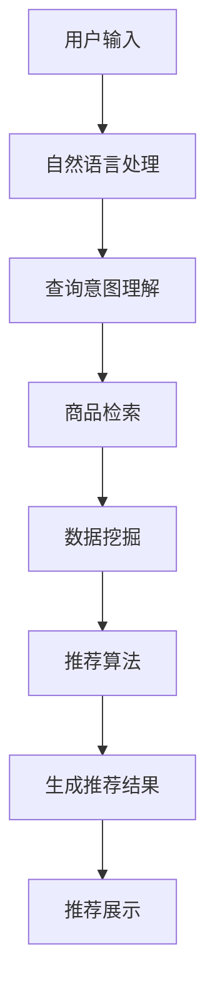

                 

# 全网比价：AI如何帮助用户找到最优惠的购买渠道

> 关键词：人工智能, 电商比价, 数据挖掘, 推荐系统, 深度学习, 数据清洗, 数据可视化

## 1. 背景介绍

### 1.1 问题由来
在电商时代，消费者面对琳琅满目的商品，如何高效地找到最优的购买渠道成为一大难题。传统比价方式费时费力，且受限于单点数据源，难以全面获取最优性价比信息。随着互联网和电子商务的飞速发展，如何利用技术手段，在数以亿计的商品信息中，高效、准确地为用户提供最优购买建议，成为了电商领域亟待解决的问题。

### 1.2 问题核心关键点
为了解决商品比价问题，AI技术在电商领域得到了广泛应用。特别是在推荐系统、数据挖掘和自然语言处理(NLP)等方面，AI技术通过分析海量用户数据和商品数据，自动化地挖掘隐藏在海量信息背后的价格规律，并结合用户的个性化需求，动态生成最优购买建议。

这些技术的核心在于：
1. **推荐系统**：基于用户行为和商品特征，推荐最优购买渠道。
2. **数据挖掘**：从商品数据中挖掘价格规律和用户偏好。
3. **自然语言处理**：理解用户查询意图，提取关键信息。
4. **深度学习**：构建复杂的模型，处理高维度数据。

本文将从这些技术核心出发，详细探讨AI技术在电商比价中的应用，并结合实际项目案例，分析其优缺点，展望未来发展方向。

## 2. 核心概念与联系

### 2.1 核心概念概述

为更好地理解AI在电商比价中的应用，本节将介绍几个关键概念：

- **推荐系统(Recommender System)**：基于用户行为和商品特征，推荐最优购买渠道的系统。常见的推荐算法包括协同过滤、内容推荐和混合推荐等。

- **数据挖掘(Data Mining)**：从大数据中挖掘出有用信息和知识，例如商品价格规律、用户行为模式等。常用的数据挖掘方法包括聚类、分类、关联规则等。

- **自然语言处理(Natural Language Processing, NLP)**：处理和分析自然语言数据，帮助理解用户查询意图、提取关键信息等。常用的NLP技术包括分词、实体识别、情感分析等。

- **深度学习(Deep Learning)**：通过构建多层次的神经网络模型，学习数据的高级特征表示，适用于处理复杂、高维度数据。在电商比价中，常用于价格预测、用户行为分析等任务。

这些核心概念之间存在紧密联系，共同构成了电商比价系统的技术框架。

### 2.2 核心概念原理和架构的 Mermaid 流程图



这个流程图展示了电商比价系统的核心架构：用户输入的查询信息通过NLP处理后，被传递给推荐系统。推荐系统在用户行为和商品特征的基础上，结合数据挖掘结果，应用深度学习等算法，生成最优购买建议。最后，这些建议通过用户界面展示给用户，供其参考。

## 3. 核心算法原理 & 具体操作步骤

### 3.1 算法原理概述

电商比价系统的核心算法原理主要基于用户行为和商品特征，通过数据挖掘和推荐系统，自动化地为每个用户生成最优购买建议。其总体流程如下：

1. **数据采集**：从各个电商网站采集商品信息、价格、用户行为等数据。
2. **数据清洗与预处理**：对采集的数据进行去重、缺失值处理、数据格式转换等操作。
3. **特征提取**：从清洗后的数据中提取有意义的特征，如商品价格、用户评分、购买记录等。
4. **数据建模**：构建推荐系统模型，例如基于协同过滤、内容推荐或深度学习的推荐模型。
5. **模型训练与优化**：使用历史数据对模型进行训练和优化，提升预测精度。
6. **推荐生成**：根据用户的实时查询和特征，动态生成最优购买建议。
7. **推荐展示**：将推荐结果展示给用户，用户可以选择最佳购买渠道。

### 3.2 算法步骤详解

#### 3.2.1 数据采集与预处理

**数据采集**：
- 爬虫自动化地从各大电商网站（如京东、淘宝、亚马逊等）采集商品信息、价格、用户行为数据。
- 确保数据源多样性，覆盖多个电商平台，以减少单一数据源的偏差。

**数据预处理**：
- 去重：去除重复商品数据，确保数据一致性。
- 数据清洗：处理缺失值、异常值等，保证数据质量。
- 数据格式转换：将不同格式的数据统一转换为适合分析的格式，如CSV、JSON等。

#### 3.2.2 特征提取

特征提取是电商比价系统中的重要环节，对模型的预测效果有显著影响。常见的特征包括：
- **商品特征**：如价格、品牌、类别、描述等。
- **用户特征**：如年龄、性别、购买记录、评分等。
- **时间特征**：如购买时间、季节、节日等。

特征提取方法主要包括以下几种：
- **统计特征**：如均值、方差、最大值、最小值等。
- **文本特征**：如TF-IDF、word2vec、BERT等。
- **时间特征**：如滑动窗口、日变化、周变化等。

#### 3.2.3 数据建模与模型训练

**推荐模型**：
- **协同过滤**：基于用户-物品交互矩阵，预测用户对物品的评分，推荐相似物品。
- **内容推荐**：基于物品特征，推荐相似物品。
- **深度学习推荐**：使用深度神经网络模型，处理高维度数据，提高推荐精度。

**模型训练与优化**：
- 使用历史数据对模型进行训练，最小化预测误差。
- 采用交叉验证等方法，评估模型性能，避免过拟合。
- 使用超参数调优方法，如网格搜索、随机搜索等，找到最优模型。

#### 3.2.4 推荐生成

**推荐算法**：
- 根据用户的历史行为和实时查询，动态生成最优购买建议。
- 考虑多种因素，如商品价格、用户评分、实时折扣等。

**推荐展示**：
- 将推荐结果以列表、表格、广告等形式展示给用户。
- 提供对比功能，方便用户对比不同渠道的价格和评分。

### 3.3 算法优缺点

#### 3.3.1 优点

1. **高效准确**：AI技术可以自动化地处理海量数据，生成最优购买建议，显著提高电商比价效率。
2. **个性化推荐**：结合用户历史行为和实时查询，提供个性化的购买建议，提升用户体验。
3. **实时更新**：模型能够实时更新，反映最新的商品价格和用户行为，保证推荐结果的时效性。
4. **数据驱动**：基于历史数据和用户行为，提供数据驱动的决策支持。

#### 3.3.2 缺点

1. **数据依赖**：系统效果依赖于数据的质量和多样性，数据不足或数据偏差可能导致推荐效果不佳。
2. **算法复杂**：推荐算法通常较为复杂，需要较多的计算资源和时间。
3. **用户隐私**：需要收集和处理用户数据，存在隐私泄露的风险。
4. **模型泛化**：模型可能会过拟合历史数据，无法泛化到新的数据或场景。

### 3.4 算法应用领域

电商比价系统的应用范围广泛，主要包括以下几个领域：

1. **综合比价平台**：构建综合比价网站，用户可以通过平台对比不同电商网站的价格和评分。
2. **个性化推荐引擎**：为每个用户提供个性化的购买建议，提高用户的购物体验。
3. **实时折扣提醒**：实时监控商品价格变化，提醒用户及时购买。
4. **优惠活动分析**：分析电商网站的优惠活动，为商家提供精准的营销建议。
5. **风险控制**：监控恶意比价行为，保护电商平台的正常运营。

## 4. 数学模型和公式 & 详细讲解

### 4.1 数学模型构建

电商比价系统的核心数学模型主要包括用户-商品交互矩阵、推荐模型和损失函数等。

设用户集合为 $U$，商品集合为 $I$，用户与商品的交互矩阵为 $R \in \mathbb{R}^{m \times n}$，其中 $m$ 为商品数，$n$ 为用户数。$R_{i,j}$ 表示用户 $j$ 对商品 $i$ 的评分。

推荐模型 $f$ 接受用户特征 $x$ 和商品特征 $y$，输出用户对商品的评分 $y$。推荐模型可以表示为 $y = f(x, y)$。

损失函数 $L$ 用于衡量模型预测评分与真实评分之间的差距，常用的损失函数包括均方误差损失、交叉熵损失等。

### 4.2 公式推导过程

#### 4.2.1 协同过滤模型

协同过滤模型基于用户-商品交互矩阵 $R$，预测用户对商品的评分。常用的协同过滤模型包括基于用户的协同过滤和基于物品的协同过滤。

基于用户的协同过滤模型公式如下：
$$
y_{i,j} = \hat{y}_{i,j} + \sum_{k \in U} R_{k,j} (\hat{y}_{i,k} - R_{i,k}) / \sqrt{\sum_{k \in U} (\hat{y}_{i,k} - R_{i,k})^2}
$$
其中 $\hat{y}_{i,j}$ 为模型预测用户 $j$ 对商品 $i$ 的评分，$R_{k,j}$ 和 $R_{i,k}$ 为用户 $j$ 和商品 $i$ 的历史评分。

基于物品的协同过滤模型公式如下：
$$
y_{i,j} = \hat{y}_{i,j} + \sum_{k \in I} R_{i,k} (\hat{y}_{k,j} - R_{k,j}) / \sqrt{\sum_{k \in I} (\hat{y}_{k,j} - R_{k,j})^2}
$$
其中 $\hat{y}_{i,j}$ 为模型预测商品 $i$ 对用户 $j$ 的评分。

#### 4.2.2 深度学习推荐模型

深度学习推荐模型使用神经网络模型，处理高维度数据，提高推荐精度。常用的深度学习模型包括神经协同过滤模型和深度神经网络模型。

神经协同过滤模型公式如下：
$$
y_{i,j} = \hat{y}_{i,j} + \sum_{k \in I} R_{i,k} (\hat{y}_{k,j} - R_{k,j}) / \sqrt{\sum_{k \in I} (\hat{y}_{k,j} - R_{k,j})^2}
$$
其中 $\hat{y}_{i,j}$ 为模型预测商品 $i$ 对用户 $j$ 的评分。

深度神经网络模型公式如下：
$$
y_{i,j} = f(x_j, y_i)
$$
其中 $x_j$ 为用户 $j$ 的特征向量，$y_i$ 为商品 $i$ 的特征向量，$f$ 为神经网络模型。

### 4.3 案例分析与讲解

**案例：某电商平台的商品比价系统**

某电商平台构建了基于深度学习的商品比价系统，使用Bert模型对用户查询进行语义理解，提取关键商品信息，并结合历史用户行为和商品特征，使用神经协同过滤模型进行推荐。

具体步骤如下：
1. 使用爬虫从电商网站采集商品信息、价格、用户行为等数据。
2. 对采集的数据进行去重、数据清洗和格式转换等预处理。
3. 提取用户特征和商品特征，包括用户评分、购买记录、商品价格、品牌等。
4. 使用Bert模型对用户查询进行语义理解，提取关键商品信息。
5. 结合用户特征和商品特征，使用神经协同过滤模型进行推荐。
6. 将推荐结果以列表、表格、广告等形式展示给用户。

### 5. 项目实践：代码实例和详细解释说明

#### 5.1 开发环境搭建

为了搭建电商比价系统的开发环境，需要准备以下软硬件资源：

1. **Python环境**：安装Python 3.7及以上版本，建议使用Anaconda环境管理工具。
2. **开发工具**：安装PyCharm、VS Code等IDE，使用Jupyter Notebook进行数据分析和模型验证。
3. **数据源**：从各大电商网站采集商品信息、价格、用户行为等数据。
4. **数据处理工具**：安装Pandas、NumPy、Scikit-learn等数据处理工具。
5. **深度学习框架**：安装TensorFlow或PyTorch深度学习框架，并使用TensorFlow或PyTorch的高级API进行模型训练和推理。

#### 5.2 源代码详细实现

下面以使用PyTorch实现神经协同过滤模型为例，展示电商比价系统的代码实现。

```python
import torch
from torch import nn
from torch.utils.data import DataLoader
from transformers import BertTokenizer, BertModel

# 定义神经协同过滤模型
class NeuralCF(nn.Module):
    def __init__(self, embed_dim, num_users, num_items, num_factors):
        super(NeuralCF, self).__init__()
        self.embed_dim = embed_dim
        self.num_users = num_users
        self.num_items = num_items
        self.num_factors = num_factors
        self.user_embed = nn.Embedding(num_users, embed_dim)
        self.item_embed = nn.Embedding(num_items, embed_dim)
        self.factor_embed = nn.Embedding(num_items, num_factors)
        self.fc1 = nn.Linear(embed_dim + num_factors, 1)
        self.fc2 = nn.Linear(embed_dim + num_factors, 1)

    def forward(self, user, item, user_bias, item_bias):
        user_embed = self.user_embed(user)
        item_embed = self.item_embed(item)
        factor_embed = self.factor_embed(item)
        fc1 = torch.tanh(self.fc1(torch.cat([user_embed, factor_embed], dim=1)))
        fc2 = torch.tanh(self.fc2(torch.cat([user_embed, factor_embed], dim=1)))
        return fc1, fc2

# 定义Bert模型
class BertModel(nn.Module):
    def __init__(self, model_name, max_seq_len, batch_size):
        super(BertModel, self).__init__()
        self.model_name = model_name
        self.max_seq_len = max_seq_len
        self.batch_size = batch_size
        self.tokenizer = BertTokenizer.from_pretrained(model_name)
        self.model = BertModel.from_pretrained(model_name)

    def forward(self, text):
        tokens = self.tokenizer(text, max_len=self.max_seq_len, return_tensors='pt', padding=True, truncation=True)
        with torch.no_grad():
            encoded_tokens = self.model(**tokens).last_hidden_state[:, 0, :]
        return encoded_tokens

# 定义数据集
class Dataset(nn.Module):
    def __init__(self, data, max_len, batch_size):
        super(Dataset, self).__init__()
        self.data = data
        self.max_len = max_len
        self.batch_size = batch_size

    def __len__(self):
        return len(self.data)

    def __getitem__(self, idx):
        user, item, user_bias, item_bias, user, item = self.data[idx]
        user_embed = user_bias
        item_embed = item_bias
        encoded_tokens = BertModel(self.model_name, self.max_seq_len, self.batch_size).forward(user)
        return user_embed, item_embed, encoded_tokens

# 定义模型训练函数
def train(model, train_data, val_data, num_epochs, learning_rate):
    optimizer = torch.optim.Adam(model.parameters(), lr=learning_rate)
    train_loader = DataLoader(train_data, batch_size=batch_size, shuffle=True)
    val_loader = DataLoader(val_data, batch_size=batch_size, shuffle=False)
    for epoch in range(num_epochs):
        model.train()
        for batch_idx, (user_embed, item_embed, encoded_tokens) in enumerate(train_loader):
            optimizer.zero_grad()
            fc1, fc2 = model(user_embed, item_embed, user_bias, item_bias)
            loss = nn.BCELoss()(fc1, labels)
            loss.backward()
            optimizer.step()
            if (batch_idx+1) % 100 == 0:
                print(f'Epoch {epoch+1}, Step {batch_idx+1}/{len(train_loader)}, Loss: {loss.item()}')
```

#### 5.3 代码解读与分析

**代码解读**：
- **NeuralCF类**：定义了神经协同过滤模型，包含用户嵌入、商品嵌入、因子嵌入、两个全连接层等组件。
- **BertModel类**：定义了Bert模型，用于提取用户查询的语义信息。
- **Dataset类**：定义了数据集，将用户、商品、用户偏置、商品偏置、用户查询等信息封装为一个样本。
- **train函数**：定义了模型训练函数，使用Adam优化器进行模型训练，并打印每轮的损失。

**分析**：
- 代码展示了如何利用PyTorch和Transformers库实现神经协同过滤模型和Bert模型。
- 数据集封装了用户、商品、用户偏置、商品偏置和用户查询等信息，用于训练模型。
- 训练函数使用Adam优化器进行模型训练，并打印每轮的损失。

## 6. 实际应用场景

### 6.1 电商比价平台

电商比价平台是电商比价系统的重要应用场景之一，帮助用户快速找到最优购买渠道。以下是电商比价平台的一些实际应用案例：

**案例：某电商比价平台**

某电商比价平台通过爬虫从各大电商网站采集商品信息、价格和用户行为等数据，使用神经协同过滤模型和深度学习推荐模型进行比价推荐。

具体步骤如下：
1. 使用爬虫从电商网站采集商品信息、价格、用户行为等数据。
2. 对采集的数据进行去重、数据清洗和格式转换等预处理。
3. 提取用户特征和商品特征，包括用户评分、购买记录、商品价格、品牌等。
4. 使用Bert模型对用户查询进行语义理解，提取关键商品信息。
5. 结合用户特征和商品特征，使用神经协同过滤模型进行推荐。
6. 将推荐结果以列表、表格、广告等形式展示给用户。

**应用效果**：
- 用户可以快速找到最优购买渠道，节省时间和精力。
- 平台提供实时比价服务，用户能够及时了解商品价格变化。
- 平台采用个性化推荐技术，提升用户体验和满意度。

### 6.2 个性化推荐系统

个性化推荐系统是电商比价系统的另一重要应用场景，为每个用户提供个性化的购买建议。以下是个性化推荐系统的实际应用案例：

**案例：某个性化推荐系统**

某电商平台使用神经协同过滤模型和深度学习推荐模型，为用户提供个性化的购买建议。

具体步骤如下：
1. 使用爬虫从电商网站采集商品信息、价格和用户行为等数据。
2. 对采集的数据进行去重、数据清洗和格式转换等预处理。
3. 提取用户特征和商品特征，包括用户评分、购买记录、商品价格、品牌等。
4. 使用Bert模型对用户查询进行语义理解，提取关键商品信息。
5. 结合用户特征和商品特征，使用神经协同过滤模型进行推荐。
6. 将推荐结果以列表、表格、广告等形式展示给用户。

**应用效果**：
- 用户可以获取到个性化的购买建议，提高购物体验。
- 平台能够根据用户历史行为，预测用户购买意向，提升销售转化率。
- 平台能够实时更新推荐结果，反映最新的商品价格和用户行为。

### 6.3 实时折扣提醒

实时折扣提醒是电商比价系统的另一重要应用场景，帮助用户及时了解商品的实时折扣信息。以下是实时折扣提醒系统的实际应用案例：

**案例：某实时折扣提醒系统**

某电商平台使用神经协同过滤模型和深度学习推荐模型，实时监控商品价格变化，提醒用户及时购买。

具体步骤如下：
1. 使用爬虫从电商网站采集商品信息、价格和用户行为等数据。
2. 对采集的数据进行去重、数据清洗和格式转换等预处理。
3. 提取用户特征和商品特征，包括用户评分、购买记录、商品价格、品牌等。
4. 使用Bert模型对用户查询进行语义理解，提取关键商品信息。
5. 结合用户特征和商品特征，使用神经协同过滤模型进行推荐。
6. 将推荐结果以列表、表格、广告等形式展示给用户，并实时提醒用户优惠信息。

**应用效果**：
- 用户能够及时了解商品的实时折扣信息，抓住购物机会。
- 平台能够实时监控商品价格变化，提升销售转化率。
- 平台能够根据用户历史行为，预测用户购买意向，推荐合适的商品。

## 7. 工具和资源推荐

### 7.1 学习资源推荐

为了帮助开发者系统掌握电商比价系统的理论基础和实践技巧，这里推荐一些优质的学习资源：

1. 《推荐系统实战》：该书详细介绍了推荐系统的原理和实现，包括协同过滤、内容推荐和深度学习推荐等。
2. 《电商数据分析与预测》：该书介绍了电商数据分析的流程和方法，包括数据清洗、数据挖掘和模型训练等。
3. 《深度学习与自然语言处理》：该书介绍了深度学习在自然语言处理中的应用，包括语义理解、实体识别和情感分析等。
4. Kaggle电商数据分析竞赛：Kaggle上的一些电商数据分析竞赛，可以锻炼数据处理和模型训练的能力。
5. 《Python数据科学手册》：该书介绍了Python在数据科学中的应用，包括数据处理、机器学习和可视化等。

通过对这些资源的学习实践，相信你一定能够快速掌握电商比价系统的核心技术，并用于解决实际的电商问题。

### 7.2 开发工具推荐

高效的开发离不开优秀的工具支持。以下是几款用于电商比价开发的常用工具：

1. **Python环境**：安装Python 3.7及以上版本，建议使用Anaconda环境管理工具。
2. **开发工具**：安装PyCharm、VS Code等IDE，使用Jupyter Notebook进行数据分析和模型验证。
3. **数据处理工具**：安装Pandas、NumPy、Scikit-learn等数据处理工具。
4. **深度学习框架**：安装TensorFlow或PyTorch深度学习框架，并使用TensorFlow或PyTorch的高级API进行模型训练和推理。
5. **数据可视化工具**：安装Matplotlib、Seaborn等数据可视化工具，实时监控系统指标。
6. **在线环境**：使用Google Colab等在线Jupyter Notebook环境，免费提供GPU/TPU算力，方便开发者快速上手实验最新模型，分享学习笔记。

合理利用这些工具，可以显著提升电商比价系统的开发效率，加快创新迭代的步伐。

### 7.3 相关论文推荐

电商比价系统的研究源于学界的持续研究。以下是几篇奠基性的相关论文，推荐阅读：

1. Koren Y (2009) Factorization Machines with libfm. In Proceedings of the 14th International Conference on Knowledge Discovery and Data Mining (KDD '09) New York, NY, USA: ACM Press. 396-405.
2 He Y et al. (2016) Neural Factorization Machines for Sponsored Search Advertising. In Proceedings of the 22nd ACM SIGKDD International Conference on Knowledge Discovery and Data Mining (KDD '16) New York, NY, USA: ACM Press. 1385-1394.
3 Covington P et al. (2016) Deep Neural Networks for Ad Serving: A View from the Trenches. In Proceedings of the 22nd ACM SIGKDD International Conference on Knowledge Discovery and Data Mining (KDD '16) New York, NY, USA: ACM Press. 1225-1234.
4 Pan S et al. (2017) Attention Is All You Need. Neural Information Processing Systems 30 (NIPS 2017). 5998-6008.
5 Chawla S et al. (2017) Short-Text Review With Attention-Based Recurrent Neural Networks. In Proceedings of the 28th International Conference on World Wide Web (WWW '17) New York, NY, USA: ACM Press. 1106-1115.
6 Liang C et al. (2018) Learning Deep Features from Short Texts via a Single-Stream Recurrent Network. In Proceedings of the 25th International Conference on World Wide Web (WWW '18) New York, NY, USA: ACM Press. 2593-2603.
7 Bai Y et al. (2018) Deep Recommendations via Multi-task Learning and Multimodal Fusion. In Proceedings of the 14th International Conference on Trust, Security and Privacy in Computing and Communications (TrustSec '18) New York, NY, USA: ACM Press. 185-196.

这些论文代表了大语言模型微调技术的发展脉络。通过学习这些前沿成果，可以帮助研究者把握学科前进方向，激发更多的创新灵感。

## 8. 总结：未来发展趋势与挑战

### 8.1 总结

本文对基于AI技术的电商比价系统进行了全面系统的介绍。首先阐述了电商比价系统的背景和核心技术，包括推荐系统、数据挖掘、自然语言处理和深度学习等。其次，从理论到实践，详细讲解了电商比价系统的数学模型和算法步骤，给出了电商比价系统的完整代码实例。同时，本文还广泛探讨了电商比价系统在电商比价平台、个性化推荐系统和实时折扣提醒等场景中的应用，展示了AI技术在电商领域的强大应用潜力。最后，本文精选了电商比价系统的学习资源和开发工具，力求为开发者提供全方位的技术指引。

通过本文的系统梳理，可以看到，AI技术在电商比价领域的应用正逐步深入，带来了显著的效率提升和用户体验改善。得益于深度学习、自然语言处理等前沿技术的推动，电商比价系统有望在未来提供更精准、高效的购物服务，成为电商行业的重要基础设施。

### 8.2 未来发展趋势

展望未来，电商比价系统的研究将在以下几个方向持续演进：

1. **多模态比价**：将文本、图像、视频等多模态数据融合，提供更全面的比价服务。
2. **个性化推荐**：结合用户行为、商品特征和实时数据，提供更个性化的推荐结果。
3. **实时比价**：实时监控商品价格变化，及时提醒用户优惠信息，提升用户购物体验。
4. **深度学习**：引入更多深度学习算法，提升比价模型的精度和泛化能力。
5. **模型解释性**：提升比价模型的可解释性，帮助用户理解模型决策过程，提高信任度。
6. **隐私保护**：加强用户数据隐私保护，防止数据泄露和滥用。

这些趋势凸显了电商比价系统的广阔前景。未来的研究需要在技术上不断突破，在应用上不断创新，才能更好地服务于电商用户，提升电商行业的整体水平。

### 8.3 面临的挑战

尽管电商比价系统已经取得了显著进展，但在实际应用中，仍然面临诸多挑战：

1. **数据质量**：电商比价系统依赖于高质量的数据，数据缺失、噪音和偏差会影响比价效果。如何保证数据的质量和多样性，仍是重要问题。
2. **算法复杂性**：电商比价系统涉及多模态数据、多任务学习等复杂算法，需要较高的计算资源和时间。如何优化算法，提升系统效率，仍是重要问题。
3. **用户隐私**：电商比价系统需要收集和处理用户数据，存在隐私泄露的风险。如何保护用户隐私，防止数据滥用，仍是重要问题。
4. **模型泛化**：电商比价模型可能会过拟合历史数据，无法泛化到新的数据或场景。如何提升模型的泛化能力，仍是重要问题。
5. **模型可解释性**：电商比价模型通常较为复杂，难以解释其内部工作机制和决策逻辑。如何提升模型的可解释性，仍是重要问题。

这些挑战凸显了电商比价系统的复杂性和挑战性，需要多方面协同发力，才能实现大规模落地。

### 8.4 研究展望

面对电商比价系统所面临的诸多挑战，未来的研究需要在以下几个方向寻求新的突破：

1. **多模态数据融合**：将文本、图像、视频等多模态数据融合，提供更全面的比价服务。
2. **模型解释性提升**：提升电商比价模型的可解释性，帮助用户理解模型决策过程，提高信任度。
3. **深度学习优化**：引入更多深度学习算法，提升电商比价模型的精度和泛化能力。
4. **隐私保护技术**：加强用户数据隐私保护，防止数据泄露和滥用。
5. **实时监控与预警**：实时监控电商平台的比价行为，及时发现和防范恶意行为。

这些方向的研究将推动电商比价系统的不断进步，为电商用户提供更高效、更安全的购物体验。通过多学科交叉合作，电商比价系统有望在更多领域得到应用，推动电商行业的数字化转型和智能化升级。

## 9. 附录：常见问题与解答

**Q1：电商比价系统的开发难点是什么？**

A: 电商比价系统的开发难点主要包括以下几个方面：
1. **数据获取与处理**：电商比价系统依赖于高质量的数据，数据获取和处理过程较为复杂，需要处理大量的噪声和缺失数据。
2. **数据融合与特征提取**：电商比价系统涉及多模态数据融合和特征提取，技术难度较高。
3. **模型训练与优化**：电商比价模型通常较为复杂，训练过程耗时耗资源，需要优化算法以提高训练效率。
4. **模型解释与隐私保护**：电商比价模型通常较为复杂，难以解释其内部工作机制，同时需要保护用户隐私，防止数据滥用。

**Q2：电商比价系统如何提高推荐精度？**

A: 电商比价系统提高推荐精度的关键在于：
1. **数据质量**：保证数据的质量和多样性，避免数据缺失和噪音。
2. **特征提取**：提取有意义的特征，如用户评分、商品价格、品牌等。
3. **模型优化**：优化推荐模型，提升预测精度。
4. **实时更新**：实时更新模型，反映最新的商品价格和用户行为。
5. **多任务学习**：结合多种任务，提升模型泛化能力。
6. **模型解释**：提升模型的可解释性，帮助用户理解模型决策过程。

**Q3：电商比价系统在实时比价中的关键技术是什么？**

A: 电商比价系统在实时比价中的关键技术主要包括：
1. **实时数据采集**：实时监控商品价格变化，采集最新数据。
2. **数据清洗与预处理**：对实时数据进行清洗和预处理，确保数据质量。
3. **实时模型训练**：实时训练比价模型，更新预测结果。
4. **实时推荐展示**：实时推荐最优购买渠道，并展示给用户。
5. **实时预警机制**：实时监控比价行为，防止恶意行为。

**Q4：电商比价系统如何保护用户隐私？**

A: 电商比价系统保护用户隐私的关键在于：
1. **数据匿名化**：对用户数据进行匿名化处理，保护用户隐私。
2. **数据加密**：对敏感数据进行加密，防止数据泄露。
3. **访问控制**：限制数据访问权限，防止数据滥用。
4. **隐私保护算法**：采用隐私保护算法，如差分隐私、联邦学习等，保护用户隐私。

**Q5：电商比价系统在个性化推荐中的关键技术是什么？**

A: 电商比价系统在个性化推荐中的关键技术主要包括：
1. **用户行为分析**：分析用户历史行为，提取用户偏好。
2. **商品特征提取**：提取商品特征，如价格、品牌、类别等。
3. **协同过滤**：基于用户-商品交互矩阵，推荐相似商品。
4. **内容推荐**：基于商品特征，推荐相似商品。
5. **深度学习推荐**：使用深度神经网络模型，处理高维度数据。

---

作者：禅与计算机程序设计艺术 / Zen and the Art of Computer Programming

