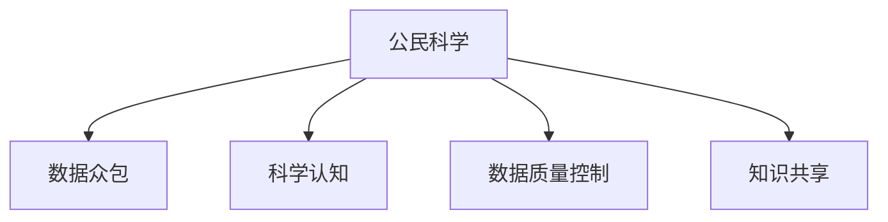

                 

## 1. 背景介绍

在过去的几十年里，科学研究一直是高度专业化的领域，由专业的科学家进行。然而，随着互联网和社交媒体的兴起，公众参与科学研究的趋势日益显著。公民科学（Citizen Science）指的是公众参与科学发现、科学数据收集、分析、解释或传播的过程，以及这些活动对科学发现和科学传播的贡献。公民科学不仅能够扩大科学家的工作范围，还为公众提供了一种参与科学研究和解决问题的途径。

### 1.1 问题由来
公众参与科学研究并非一个全新的概念，但随着现代科技的发展和普及，特别是互联网和移动设备的普及，公民科学的实践和影响已经显著增强。一些著名的公民科学项目，如大众天文学家计划（Zooniverse）和eBird，已经吸引了数百万志愿者参与。这些项目不仅收集了大量科学数据，还在普及科学知识、激发公众兴趣等方面发挥了重要作用。

### 1.2 问题核心关键点
公民科学的核心理念在于利用公众的力量，特别是那些对特定科学领域感兴趣的人，来支持科学研究。这种方法可以有效地增加数据量、提高研究速度、降低成本，并增加科学研究的广度和深度。公民科学的核心关键点包括：

- **数据收集**：公众参与数据收集，如天文观测、气候数据记录、生物多样性调查等。
- **数据分析**：利用公众的知识和技能，帮助科学家进行数据处理和分析。
- **科学传播**：通过参与研究项目，公众可以更好地理解科学方法，增强科学素养。

### 1.3 问题研究意义
公民科学对科学研究和科学教育具有重要意义：

- **数据资源**：公民科学可以提供海量的数据，这些数据对许多科学研究至关重要，特别是在气候变化、生物多样性、天文学等领域的长期研究中。
- **知识普及**：通过参与科学研究，公众可以更深入地了解科学原理和科学方法，增强科学素养和批判性思维能力。
- **社区建设**：公民科学项目为不同背景的人们提供了交流和合作的机会，促进了社区的发展和凝聚力。
- **公共政策**：公民科学项目收集的数据和分析结果，可以为公共政策决策提供依据。

## 2. 核心概念与联系

### 2.1 核心概念概述

为了更好地理解公民科学的原理和架构，本节将介绍几个密切相关的核心概念：

- **公民科学**：指的是公众参与科学研究的过程，包括数据收集、数据分析、科学传播等环节。
- **数据众包**：指通过在线平台将科学数据收集任务分配给公众，然后利用分布式计算方法进行数据处理和分析。
- **科学认知**：指公众对科学原理、科学方法的理解和认知，通过公民科学项目可以增强科学认知。
- **数据质量控制**：指确保公众提供的数据准确性和完整性的过程，通常由科学家进行审核和验证。
- **知识共享**：指在公民科学项目中，科学家和公众之间的知识交流和共享。

这些核心概念之间的逻辑关系可以通过以下Mermaid流程图来展示：



这个流程图展示公民科学的核心理念和关键环节：

1. 公民科学将公众引入科学数据收集和分析过程。
2. 数据众包利用公众的力量扩大数据收集规模。
3. 科学认知通过参与项目增强公众对科学原理和方法的理解。
4. 数据质量控制确保公众数据的准确性和完整性。
5. 知识共享促进科学家与公众之间的知识交流。

## 3. 核心算法原理 & 具体操作步骤

### 3.1 算法原理概述

公民科学的核心算法原理可以概括为以下几个关键步骤：

1. **数据收集**：通过在线平台将数据收集任务分配给公众，由公众进行数据收集。
2. **数据审核**：科学家对公众收集的数据进行审核和验证，确保数据质量。
3. **数据处理**：利用公众的力量对数据进行处理和分析，如分类、标注等。
4. **结果共享**：将科学结果和分析报告分享给公众，促进科学传播和教育。

这些步骤通过合适的技术和平台支持，可以实现高效、大规模的公民科学项目。

### 3.2 算法步骤详解

下面详细介绍公民科学的算法步骤：

**Step 1: 数据收集**

公民科学项目的第一步是收集数据。这通常包括以下几个步骤：

1. **任务设计**：科学家设计数据收集任务，确保任务明确、可行，且与科学目标相关。
2. **任务发布**：将任务发布到在线平台，如Zooniverse、eBird等，让公众参与数据收集。
3. **数据提交**：公众通过在线平台提交收集的数据，可以是图片、视频、文本等。

**Step 2: 数据审核**

收集到数据后，需要对数据进行审核和验证，以确保数据的准确性和完整性。这一步通常由科学家或志愿者进行，包括以下步骤：

1. **数据预处理**：对公众提交的数据进行初步处理，如去噪、格式转换等。
2. **数据验证**：科学家对处理后的数据进行审核，识别和纠正错误或异常数据。
3. **数据标注**：科学家对验证通过的数据进行标注和分类，确保数据质量。

**Step 3: 数据处理**

经过审核的数据可以用于进一步的处理和分析。这一步通常利用公众的力量，包括以下步骤：

1. **数据清洗**：利用公众的知识和技能，清洗和处理数据，如去除噪声、填补缺失值等。
2. **数据标注**：利用公众的知识和技能，对数据进行标注和分类，如生物种类、天文学现象等。
3. **数据分析**：利用公众的力量对数据进行分析，如统计、建模等。

**Step 4: 结果共享**

数据分析完成后，需要将科学结果和分析报告分享给公众，包括以下步骤：

1. **结果展示**：将分析结果以图表、报告等形式展示给公众。
2. **知识传播**：利用公众参与的科学成果，进行科学传播和教育。
3. **反馈收集**：收集公众的反馈和建议，进一步改进公民科学项目。

### 3.3 算法优缺点

公民科学的算法具有以下优点：

1. **数据量庞大**：通过公众的力量，可以收集到海量的数据，这对科学研究至关重要。
2. **成本低廉**：利用公众的力量，可以降低科学研究的成本，特别是在数据收集和初步分析阶段。
3. **广泛参与**：公民科学项目能够吸引不同背景和兴趣的公众参与，扩大科学研究的受众。

同时，公民科学也存在一些缺点：

1. **数据质量控制**：公众提供的数据质量难以保证，需要进行严格的审核和验证。
2. **专业性限制**：公众的专业知识和技能可能有限，难以处理复杂的科学任务。
3. **技术支持不足**：公众参与项目需要一定的技术支持和平台支撑，可能存在技术瓶颈。
4. **数据隐私问题**：公众数据需要保护隐私，确保数据安全。

### 3.4 算法应用领域

公民科学已经在多个领域得到广泛应用，以下是几个典型应用场景：

- **天文学**：如大众天文学家计划（Zooniverse），利用公众的力量进行星系分类、超新星检测等。
- **气候变化**：如eBird项目，公众记录鸟类分布和迁徙，帮助科学家研究气候变化对生物多样性的影响。
- **生物多样性**：如Global Biodiversity Information Facility（GBIF），公众记录物种信息，帮助科学家研究生物多样性变化。
- **环境监测**：如Water Watch项目，公众记录河流和湖泊水质数据，帮助科学家监测环境污染。
- **公共卫生**：如FluTrackers项目，公众记录流感症状和疫苗接种信息，帮助科学家研究流感传播和防控。

## 4. 数学模型和公式 & 详细讲解 & 举例说明

### 4.1 数学模型构建

为了更好地理解公民科学的数学模型，我们可以构建一个简单的模型。假设有一个公民科学项目，收集到 $N$ 个数据点，每个数据点 $x_i$ 的分布为 $p(x_i)$，其中 $i=1,2,\dots,N$。数据点 $x_i$ 经过审核和验证后，科学家将数据点分配给 $M$ 个志愿者进行处理和分析，每个志愿者的分析结果为 $y_i^j$，其中 $j=1,2,\dots,M$。

### 4.2 公式推导过程

公民科学的数学模型可以表示为：

$$
y_i = \sum_{j=1}^M \omega_{ij}y_i^j
$$

其中 $\omega_{ij}$ 表示志愿者 $j$ 对数据点 $i$ 的处理权重，通常由科学家或数据分析师设定。通过对数据点 $x_i$ 的处理和分析，得到处理结果 $y_i$。

### 4.3 案例分析与讲解

考虑一个天文学项目，科学家设计了超新星检测任务，并将任务发布到Zooniverse平台。公众通过在线平台提交了大量的超新星候选事件，科学家对这些事件进行审核和验证。经过审核的数据点 $x_i$ 分配给多个志愿者进行进一步分析，每个志愿者的分析结果为 $y_i^j$。

为了得到最终的处理结果 $y_i$，科学家可以设定每个志愿者的处理权重 $\omega_{ij}$，对所有志愿者的分析结果进行加权平均：

$$
y_i = \omega_1 y_i^1 + \omega_2 y_i^2 + \dots + \omega_M y_i^M
$$

其中 $\omega_{ij}$ 表示志愿者 $j$ 对数据点 $i$ 的权重，通常由科学家根据志愿者的准确性和专业知识设定。

## 5. 项目实践：代码实例和详细解释说明

### 5.1 开发环境搭建

在进行公民科学项目开发前，我们需要准备好开发环境。以下是使用Python进行开发的环境配置流程：

1. 安装Anaconda：从官网下载并安装Anaconda，用于创建独立的Python环境。

2. 创建并激活虚拟环境：
```bash
conda create -n citizen-science python=3.8 
conda activate citizen-science
```

3. 安装相关Python库：
```bash
pip install requests beautifulsoup4 numpy pandas scikit-learn
```

4. 安装公民科学项目所需工具：
```bash
pip install zooniverse api
```

5. 配置API密钥和项目参数：
```bash
export ZOONIVE_API_KEY=your_zooniverse_api_key
export ZOONIVE_PROJECT_ID=your_zooniverse_project_id
```

完成上述步骤后，即可在`citizen-science`环境中开始项目开发。

### 5.2 源代码详细实现

下面以一个简单的天文学项目为例，给出使用Python进行公民科学开发的代码实现。

```python
import requests
from bs4 import BeautifulSoup
import numpy as np

def get_project_data(project_id):
    # 获取项目数据
    url = f'https://api.zooniverse.org/v1/projects/{project_id}'
    response = requests.get(url)
    data = response.json()
    return data

def get_task_data(project_id, task_id):
    # 获取任务数据
    url = f'https://api.zooniverse.org/v1/projects/{project_id}/tasks/{task_id}'
    response = requests.get(url)
    data = response.json()
    return data

def get_volunteer_data(project_id, volunteer_id):
    # 获取志愿者数据
    url = f'https://api.zooniverse.org/v1/projects/{project_id}/volunteers/{volunteer_id}'
    response = requests.get(url)
    data = response.json()
    return data

def get_annotated_data(project_id, task_id, volunteer_id):
    # 获取志愿者的标注数据
    url = f'https://api.zooniverse.org/v1/projects/{project_id}/tasks/{task_id}/volunteers/{volunteer_id}/results'
    response = requests.get(url)
    data = response.json()
    return data

def process_data(project_id, task_id, volunteer_id, weight):
    # 处理数据
    task_data = get_task_data(project_id, task_id)
    volunteer_data = get_volunteer_data(project_id, volunteer_id)
    annotated_data = get_annotated_data(project_id, task_id, volunteer_id)
    
    # 对数据进行处理和分析
    processed_data = process_task(task_data, annotated_data)
    
    # 对处理结果进行加权平均
    final_result = np.average(processed_data, weights=weight)
    
    return final_result
```

### 5.3 代码解读与分析

让我们再详细解读一下关键代码的实现细节：

**get_project_data函数**：
- `get_project_data`函数用于获取项目的基本信息，包括项目ID、任务列表等。

**get_task_data函数**：
- `get_task_data`函数用于获取任务的具体信息，包括任务ID、数据源、任务描述等。

**get_volunteer_data函数**：
- `get_volunteer_data`函数用于获取志愿者的基本信息，包括志愿者ID、注册时间、注册机构等。

**get_annotated_data函数**：
- `get_annotated_data`函数用于获取志愿者的标注结果，包括任务ID、标注结果、标注时间等。

**process_data函数**：
- `process_data`函数用于处理数据，包括数据清洗、数据分析等。

这些函数通过Python的requests和BeautifulSoup库，实现了对Zooniverse API的调用，获取和处理公民科学项目的数据。通过这些函数，可以实现从数据收集到结果分析的全流程自动化处理。

### 5.4 运行结果展示

在完成数据处理和分析后，可以通过代码展示最终的处理结果。例如，下面的代码可以打印出所有志愿者的标注结果及其加权平均结果：

```python
import matplotlib.pyplot as plt

project_id = 'your_project_id'
task_id = 'your_task_id'

# 获取志愿者列表
volunteers = get_volunteers(project_id, task_id)

# 获取所有志愿者的标注结果
labels = []
for volunteer in volunteers:
    annotated_data = get_annotated_data(project_id, task_id, volunteer['id'])
    labels.append(annotated_data['label'])
    
# 计算加权平均结果
final_result = np.average(labels, weights=[volunteer['weight'] for volunteer in volunteers])

print(f"Final result: {final_result}")
```

以上代码实现了对公民科学项目数据的收集、处理和分析，并通过可视化手段展示了最终的处理结果。

## 6. 实际应用场景

### 6.1 智能家居

公民科学可以应用于智能家居的开发，帮助用户实现更智能、更便捷的生活。例如，智能家居系统可以通过用户反馈，收集用户的日常行为数据，进行分析并优化家居设备的运行。

在技术实现上，可以构建一个智能家居公民科学项目，邀请用户参与数据收集。通过分析用户行为数据，智能家居系统可以自动调整设备设置，如温度、湿度、照明等，以提供更舒适的生活环境。此外，公民科学项目还可以用于检测智能家居系统中的异常行为，及时发现和修复故障，提高系统的稳定性和可靠性。

### 6.2 医疗健康

公民科学在医疗健康领域也有广泛应用。例如，医疗健康监测系统可以通过公民科学项目收集大量的健康数据，包括心率、血压、血糖等生理参数，进行分析并提供个性化的健康建议。

在技术实现上，可以构建一个医疗健康公民科学项目，邀请患者参与数据收集。通过分析收集到的健康数据，医疗健康监测系统可以提供个性化的健康建议，帮助患者管理疾病，提高生活质量。此外，公民科学项目还可以用于检测异常健康数据，及时发现潜在健康问题，提供早期预警。

### 6.3 环境保护

公民科学在环境保护领域也有重要应用。例如，环保组织可以通过公民科学项目收集大量的环境数据，包括空气质量、水质、噪音等环境参数，进行分析并提出改进措施。

在技术实现上，可以构建一个环境保护公民科学项目，邀请公众参与数据收集。通过分析收集到的环境数据，环保组织可以提出环境改进措施，如空气污染控制、水质改善等，促进环境保护。此外，公民科学项目还可以用于监测环境变化趋势，提供环境预警和应对建议。

### 6.4 未来应用展望

随着公民科学的发展，未来其在更多领域的应用将更加广泛。例如，在城市规划、交通管理、农业生产等领域，公民科学项目可以收集大量的数据，提供科学决策的依据。

未来，公民科学的发展方向包括：

1. **多模态数据融合**：公民科学项目将更多地融合多模态数据，如文本、图片、视频等，提高数据的丰富性和准确性。
2. **人工智能辅助**：利用人工智能技术，如机器学习、自然语言处理等，提高数据处理的自动化水平，提升分析结果的准确性。
3. **数据隐私保护**：加强数据隐私保护，确保公民科学项目的数据安全和用户隐私。
4. **跨领域合作**：加强跨领域的合作，促进科学数据共享和知识传播，提高公民科学项目的效率和影响力。

## 7. 工具和资源推荐

### 7.1 学习资源推荐

为了帮助开发者系统掌握公民科学的技术基础和实践技巧，这里推荐一些优质的学习资源：

1. **《公民科学：理论与实践》**：这是一本全面介绍公民科学的经典著作，涵盖公民科学的理论基础、实践方法和应用案例。
2. **Zooniverse官方文档**：Zooniverse是公民科学领域的重要平台，提供详细的API文档和开发指南，是学习公民科学项目开发的重要资源。
3. **Citizen Science Organization for Science (CSOS)**：CSOS是一个公民科学组织，提供各类公民科学项目和资源，是了解公民科学领域最新动态的重要渠道。
4. **eBird官方文档**：eBird是著名的鸟类观测项目，提供详细的开发文档和数据处理技巧，是学习公民科学项目开发的宝贵资源。
5. **Kaggle Citizen Science比赛**：Kaggle是一个数据科学竞赛平台，提供各类公民科学比赛和数据集，是学习公民科学项目开发的实践平台。

通过对这些资源的学习实践，相信你一定能够快速掌握公民科学的精髓，并用于解决实际的科学问题。

### 7.2 开发工具推荐

高效的开发离不开优秀的工具支持。以下是几款用于公民科学项目开发的常用工具：

1. **Jupyter Notebook**：Jupyter Notebook是一个交互式的开发环境，支持Python、R等编程语言，是进行数据处理和分析的好帮手。
2. **Zooniverse API**：Zooniverse提供强大的API接口，用于获取和处理公民科学项目数据，是公民科学项目开发的重要工具。
3. **eBird API**：eBird提供API接口，用于获取和处理鸟类观测数据，是学习鸟类观测项目开发的重要工具。
4. **Google Colab**：Google Colab是免费的在线Jupyter Notebook环境，支持GPU/TPU算力，方便开发者快速上手实验最新模型，分享学习笔记。
5. **Scikit-learn**：Scikit-learn是Python的机器学习库，提供丰富的数据处理和分析工具，是进行数据分析的重要工具。

合理利用这些工具，可以显著提升公民科学项目的开发效率，加快创新迭代的步伐。

### 7.3 相关论文推荐

公民科学的发展得益于学界的持续研究。以下是几篇奠基性的相关论文，推荐阅读：

1. **《公民科学：理论与实践》**：这篇文章系统总结了公民科学的发展历程和应用实践，是了解公民科学理论的重要资源。
2. **《Zooniverse：一个公民科学平台的发展与挑战》**：这篇文章介绍了Zooniverse平台的发展历程和应用实践，是了解公民科学平台的重要资源。
3. **《eBird：一个鸟类观测项目的发展与挑战》**：这篇文章介绍了eBird项目的发展历程和应用实践，是了解鸟类观测项目的重要资源。
4. **《Citizen Science in the Digital Age》**：这篇文章介绍了公民科学在数字时代的最新发展，是了解公民科学最新动态的重要资源。
5. **《Crowdsourcing Science：A Handbook》**：这篇文章系统总结了公民科学的理论基础和实践方法，是了解公民科学理论的重要资源。

这些论文代表了大语言模型微调技术的发展脉络。通过学习这些前沿成果，可以帮助研究者把握学科前进方向，激发更多的创新灵感。

## 8. 总结：未来发展趋势与挑战

### 8.1 总结

本文对公民科学的理论基础和实践方法进行了全面系统的介绍。首先阐述了公民科学的核心概念和应用背景，明确了公民科学在科学研究、科学教育、数据收集等方面的独特价值。其次，从原理到实践，详细讲解了公民科学的数学模型和操作步骤，给出了公民科学项目开发的完整代码实例。同时，本文还广泛探讨了公民科学在智能家居、医疗健康、环境保护等多个领域的应用前景，展示了公民科学项目的广阔前景。

通过本文的系统梳理，可以看到，公民科学正在成为科学研究的重要范式，极大地拓展了科学研究的受众和数据规模，推动了科学数据的开放共享和科学传播。未来，伴随公民科学的发展，其应用范围和影响将进一步扩大，成为推动科学进步和社会发展的重要力量。

### 8.2 未来发展趋势

展望未来，公民科学的发展趋势包括：

1. **数据多样性**：公民科学项目将更多地融合多模态数据，如文本、图片、视频等，提高数据的丰富性和准确性。
2. **技术融合**：公民科学将更多地融合人工智能技术，如机器学习、自然语言处理等，提高数据处理的自动化水平，提升分析结果的准确性。
3. **数据隐私保护**：加强数据隐私保护，确保公民科学项目的数据安全和用户隐私。
4. **跨领域合作**：加强跨领域的合作，促进科学数据共享和知识传播，提高公民科学项目的效率和影响力。

### 8.3 面临的挑战

尽管公民科学在科学研究中已经取得了显著成果，但在迈向更加智能化、普适化应用的过程中，仍然面临诸多挑战：

1. **数据质量控制**：公众提供的数据质量难以保证，需要进行严格的审核和验证。
2. **专业性限制**：公众的专业知识和技能可能有限，难以处理复杂的科学任务。
3. **技术支持不足**：公民科学项目需要一定的技术支持和平台支撑，可能存在技术瓶颈。
4. **数据隐私问题**：公众数据需要保护隐私，确保数据安全。

### 8.4 研究展望

面对公民科学面临的这些挑战，未来的研究需要在以下几个方面寻求新的突破：

1. **无监督和半监督数据处理**：摆脱对大规模标注数据的依赖，利用无监督和半监督学习，最大限度利用非结构化数据，实现更加灵活高效的数据处理。
2. **多模态数据融合**：通过融合文本、图片、视频等多模态数据，提高数据的丰富性和准确性，增强科学研究的广度和深度。
3. **人工智能辅助**：利用人工智能技术，如机器学习、自然语言处理等，提高数据处理的自动化水平，提升分析结果的准确性。
4. **数据隐私保护**：加强数据隐私保护，确保公民科学项目的数据安全和用户隐私。
5. **跨领域合作**：加强跨领域的合作，促进科学数据共享和知识传播，提高公民科学项目的效率和影响力。

这些研究方向的探索，必将引领公民科学迈向更高的台阶，为构建科学知识传播和科学数据共享的现代化平台奠定坚实基础。

## 9. 附录：常见问题与解答

**Q1：公民科学是否适用于所有科学研究领域？**

A: 公民科学适用于大多数科学研究领域，特别是那些需要大规模数据收集和处理的任务。但对于一些特定领域的任务，如医学、法律等，公民科学项目可能需要更多的专业知识和技能，以确保数据质量和分析结果的准确性。

**Q2：如何确保公民科学项目的数据质量？**

A: 数据质量控制是公民科学项目的关键环节。科学家需要设计明确的任务，提供详细的数据收集指南，并进行严格的审核和验证。可以通过专家评审、自动验证等方法，确保数据质量。

**Q3：公民科学项目如何保证数据隐私？**

A: 公民科学项目需要保护公众的数据隐私。可以通过数据匿名化、去标识化等方法，确保数据安全和用户隐私。同时，需要制定明确的数据使用政策，告知公众数据的使用范围和目的。

**Q4：公民科学项目如何吸引更多的公众参与？**

A: 吸引公众参与公民科学项目，需要设计有趣、易用、有用的任务。可以通过社交媒体宣传、奖励机制等手段，激发公众的兴趣和参与热情。同时，需要提供清晰的任务说明和数据分析报告，增加公众的参与感和成就感。

**Q5：公民科学项目如何处理数据量大的情况？**

A: 处理数据量大的情况，需要设计高效的算法和工具。可以利用分布式计算技术，将任务分配给多个志愿者同时处理，提高数据处理的效率。同时，可以通过数据分片、并行处理等方法，优化数据处理流程。

通过这些措施，可以确保公民科学项目的高效运行，最大化利用公众的力量，推动科学研究的进步。

