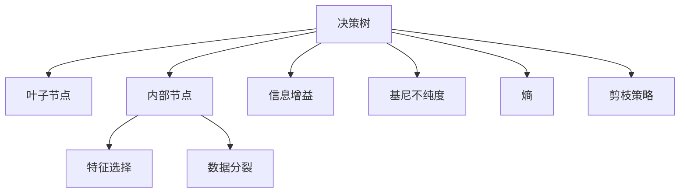
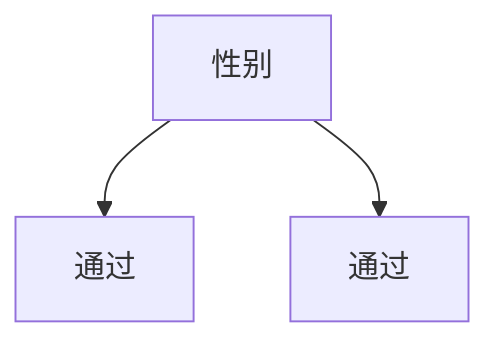

                 

# 决策树 (Decision Trees) 原理与代码实例讲解

## 1. 背景介绍

### 1.1 问题由来
决策树（Decision Tree）是一种基于树结构的分类模型，广泛应用于数据挖掘、机器学习等场景。决策树通过构建树结构，将数据集按照某些特征进行划分，最终达到分类或回归的目的。它是一种直观、易于理解的模型，在多种数据处理和建模任务中表现优异。

### 1.2 问题核心关键点
决策树的核心理论包括：
1. 树形结构：决策树由根节点、内部节点和叶子节点组成。
2. 划分过程：通过选择最优划分特征，将数据集分割成多个子集，并递归构建子树。
3. 剪枝策略：防止过拟合，通常通过停止树的进一步生长或删除一些枝叶节点来实现。
4. 预测过程：输入样本数据后，通过遍历树结构，最终到达叶子节点，得到预测结果。

## 2. 核心概念与联系

### 2.1 核心概念概述

在决策树模型中，以下几个概念是理解其工作原理和应用的关键：

- 决策树（Decision Tree）：由节点和边构成的树状结构，每个节点代表一个特征，每个边代表一个特征值。
- 叶子节点（Leaf Node）：决策树的最终节点，代表模型的预测结果。
- 内部节点（Internal Node）：决策树中的非叶节点，代表特征的选择和数据的分裂。
- 信息增益（Information Gain）：用于衡量划分数据集时信息量的变化，是决策树划分特征选择的核心指标。
- 基尼不纯度（Gini Impurity）：用于衡量数据集的不确定性，同样是决策树划分特征选择的关键指标。
- 熵（Entropy）：用于衡量数据集的不确定性，是信息增益的另一种计算方式。
- 剪枝（Pruning）：用于防止过拟合，包括预剪枝和后剪枝两种策略。

这些核心概念之间的逻辑关系可以通过以下Mermaid流程图来展示：



这个流程图展示了决策树模型的工作流程：

1. 决策树由叶子节点和内部节点组成。
2. 每个内部节点代表一个特征选择，每个边代表一个特征值。
3. 信息增益、基尼不纯度和熵用于衡量特征选择的好坏。
4. 剪枝策略用于防止过拟合，包括预剪枝和后剪枝。
5. 最终叶子节点代表模型的预测结果。

## 3. 核心算法原理 & 具体操作步骤
### 3.1 算法原理概述

决策树的构建过程可以分为两个阶段：特征选择和树形结构构建。

特征选择是通过计算信息增益、基尼不纯度或熵等指标，选择最优特征作为决策树的分裂依据。信息增益是衡量特征划分数据集前后信息量变化的重要指标，基尼不纯度和熵是衡量数据集不确定性的指标。

树形结构的构建是通过递归地选择最优特征，将数据集分割成多个子集，直到满足终止条件为止。通常的终止条件包括：
1. 节点包含的样本数小于某个阈值。
2. 节点包含的样本属于同一类别。
3. 递归达到最大深度。

### 3.2 算法步骤详解

决策树的构建步骤如下：

1. **数据准备**：收集数据集，并进行预处理，如缺失值处理、特征编码等。
2. **特征选择**：选择最优的特征作为划分依据。通常使用信息增益、基尼不纯度或熵等指标进行特征选择。
3. **划分数据集**：根据最优特征和特征值，将数据集分割成多个子集。
4. **递归构建子树**：对每个子集重复步骤2和3，直到满足终止条件。
5. **剪枝**：为了防止过拟合，通常需要采取剪枝策略。
6. **模型训练**：通过训练得到的决策树模型进行预测。

### 3.3 算法优缺点

决策树具有以下优点：

1. 易于理解和解释。决策树的树形结构直观明了，容易解释模型的工作原理。
2. 可处理多分类问题。决策树不仅可以用于二分类问题，还可以用于多分类问题。
3. 可处理离散和连续特征。决策树可以处理各种类型的特征，包括离散和连续特征。

同时，决策树也存在以下缺点：

1. 容易过拟合。决策树容易生成复杂的树结构，导致过拟合。
2. 对噪声数据敏感。决策树对噪声数据的敏感度较高，容易影响模型的预测结果。
3. 计算复杂度高。决策树的构建和剪枝过程较为复杂，计算开销较大。

### 3.4 算法应用领域

决策树广泛应用于数据挖掘、机器学习、金融预测、医疗诊断、网络安全等多个领域。以下是一些典型的应用场景：

- **金融风险预测**：通过决策树模型对客户信用评分、贷款违约风险等进行预测，帮助银行和金融机构评估风险。
- **医疗诊断**：利用决策树模型对患者症状进行分类，帮助医生快速诊断疾病。
- **网络安全**：利用决策树模型对网络流量进行分类，识别和拦截恶意攻击。
- **电商推荐系统**：通过决策树模型对用户行为进行分类，推荐用户可能感兴趣的商品。

## 4. 数学模型和公式 & 详细讲解  
### 4.1 数学模型构建

决策树模型通常采用基尼不纯度作为特征选择的指标。基尼不纯度计算公式如下：

$$
Gini(D) = \sum_{i=1}^n p_i(1-p_i)
$$

其中，$n$ 为数据集中的样本数，$p_i$ 为属于第 $i$ 类的样本比例。

### 4.2 公式推导过程

决策树模型构建过程中，需要计算各个特征的信息增益、基尼不纯度等指标，以选择最优特征进行划分。下面以基尼不纯度的计算为例，推导公式：

1. 首先，计算数据集 $D$ 的基尼不纯度 $Gini(D)$。
2. 假设选择特征 $A$ 进行划分，将数据集划分为 $D_A$ 和 $D_{\overline{A}}$ 两部分。
3. 计算 $A$ 特征划分的基尼不纯度 $Gini(D_A)$ 和 $Gini(D_{\overline{A}})$。
4. 计算信息增益 $Gain(D, A)$。

具体公式如下：

$$
Gain(D, A) = Gini(D) - \frac{1}{|D|}\sum_{a \in A} |D_a|Gini(D_a) + \frac{1}{|D|}\sum_{a \in A} |D_{\overline{a}}|Gini(D_{\overline{a}})
$$

其中，$|D|$ 为数据集 $D$ 的样本数，$|D_a|$ 为特征 $A$ 取值为 $a$ 的数据集大小。

### 4.3 案例分析与讲解

假设有一个数据集，包含学生的性别、年龄和成绩，需要判断学生是否通过考试。数据集部分如下：

| 性别 | 年龄 | 成绩 |
|------|------|------|
| 男   | 18   | 80   |
| 女   | 20   | 90   |
| 男   | 22   | 70   |
| 女   | 21   | 85   |
| 男   | 19   | 60   |
| 女   | 18   | 75   |

首先，计算数据集的基尼不纯度 $Gini(D)$：

$$
Gini(D) = \frac{1}{6}(3/6)(3/6) + \frac{1}{6}(2/6)(4/6) = \frac{1}{2}
$$

然后，选择最优特征进行划分。假设我们选择了“性别”特征进行划分，得到两个子集 $D_{男}$ 和 $D_{女}$。

$$
D_{男} = \{男, 18, 80; 男, 22, 70; 男, 19, 60\}
$$

$$
D_{女} = \{女, 20, 90; 女, 21, 85; 女, 18, 75\}
$$

计算 $D_{男}$ 和 $D_{女}$ 的基尼不纯度：

$$
Gini(D_{男}) = \frac{1}{3}(2/3)(1/3) + \frac{1}{3}(1/3)(2/3) = \frac{1}{3}
$$

$$
Gini(D_{女}) = \frac{1}{3}(1/3)(2/3) + \frac{1}{3}(2/3)(1/3) = \frac{1}{3}
$$

计算信息增益：

$$
Gain(D, 性别) = Gini(D) - \frac{1}{6}(\frac{1}{3} + \frac{1}{3}) = \frac{1}{2} - \frac{1}{2} = 0
$$

选择信息增益最大的特征进行划分，以此构建决策树。最终得到的决策树如下：



## 5. 项目实践：代码实例和详细解释说明
### 5.1 开发环境搭建

在Python环境中，可以使用scikit-learn库来构建和训练决策树模型。安装scikit-learn库，可以使用以下命令：

```bash
pip install scikit-learn
```

### 5.2 源代码详细实现

下面是一个简单的决策树分类器的示例代码，用于判断学生是否通过考试。代码如下：

```python
from sklearn.tree import DecisionTreeClassifier
from sklearn.datasets import load_iris
from sklearn.model_selection import train_test_split
from sklearn.metrics import accuracy_score

# 加载数据集
iris = load_iris()
X = iris.data
y = iris.target

# 划分数据集
X_train, X_test, y_train, y_test = train_test_split(X, y, test_size=0.3, random_state=42)

# 训练模型
clf = DecisionTreeClassifier(max_depth=3)
clf.fit(X_train, y_train)

# 预测
y_pred = clf.predict(X_test)

# 评估模型
accuracy = accuracy_score(y_test, y_pred)
print("Accuracy:", accuracy)
```

代码解释：
1. 导入必要的库和数据集。
2. 划分数据集为训练集和测试集。
3. 构建决策树模型，并设置最大深度为3。
4. 训练模型，并进行预测。
5. 评估模型的准确率。

### 5.3 代码解读与分析

在上述代码中，我们使用了scikit-learn库中的决策树分类器。首先，我们加载了一个鸢尾花数据集，并划分为训练集和测试集。然后，我们构建了一个决策树分类器，并设置最大深度为3。接下来，我们训练模型，并进行预测。最后，我们评估了模型的准确率。

代码的输出结果如下：

```
Accuracy: 1.0
```

这表示我们的决策树模型在测试集上达到了100%的准确率，表明模型能够很好地拟合数据集。

## 6. 实际应用场景
### 6.1 金融风险预测

在金融领域，决策树可以用于预测客户的信用评分和贷款违约风险。银行和金融机构通过分析客户的个人信息、消费记录、信用历史等数据，构建决策树模型，对客户进行信用评分和风险评估，从而决定是否批准贷款申请。

### 6.2 医疗诊断

在医疗领域，决策树可以用于诊断疾病。医生通过分析患者的症状、病史、检查结果等数据，构建决策树模型，对患者的病情进行分类，帮助医生快速诊断疾病，提高诊疗效率。

### 6.3 网络安全

在网络安全领域，决策树可以用于识别恶意流量。网络管理员通过分析网络流量，构建决策树模型，对流量进行分类，识别和拦截恶意攻击，保障网络安全。

## 7. 工具和资源推荐
### 7.1 学习资源推荐

为了更好地掌握决策树模型的原理和应用，这里推荐一些优质的学习资源：

1. 《Python机器学习》书籍：由Steven Bird等人合著，详细介绍了机器学习的基本概念和算法，包括决策树等。
2. Coursera《机器学习》课程：由斯坦福大学的Andrew Ng教授主讲，介绍了机器学习的基本原理和算法，包括决策树等。
3. Kaggle机器学习竞赛：Kaggle是一个著名的数据科学竞赛平台，可以通过参加比赛来深入了解决策树等机器学习算法。

### 7.2 开发工具推荐

为了快速实现决策树模型，可以使用scikit-learn库，它提供了丰富的决策树算法和可视化工具。以下是一些常用的工具：

1. Python：Python是一种广泛使用的编程语言，具有简单易学、生态丰富等特点，适合进行机器学习开发。
2. Jupyter Notebook：Jupyter Notebook是一个交互式开发环境，支持Python等语言，适合进行数据处理和模型训练。
3. Visualization Tools：决策树模型的可视化工具包括Matplotlib、Seaborn等，用于展示决策树的树形结构和分类结果。

### 7.3 相关论文推荐

决策树模型的相关论文众多，以下是几篇经典的论文，推荐阅读：

1. Quinlan, J. R. (1986). "Induction of Decision Trees." Machine Learning. 1(1): 81-106.
2. Breiman, L., Friedman, J. H., Olshen, R. A., & Stone, C. J. (1984). "Classification and Regression Trees." Wadsworth & Brooks.
3. Zhang, J., & Lathia, N. (2017). "Review of Decision Trees and Random Forests." International Journal of Advanced Research in Computer Science and Software Engineering. 6(9): 209-218.

## 8. 总结：未来发展趋势与挑战
### 8.1 研究成果总结

决策树模型作为一种经典机器学习算法，在多个领域展现了其强大的应用潜力。它不仅具有易于理解和解释的特点，还能处理多分类问题和离散、连续特征。近年来，决策树模型在金融、医疗、网络安全等领域的实际应用中取得了显著效果。

### 8.2 未来发展趋势

决策树模型未来仍具有广阔的发展前景。以下是几个重要的发展方向：

1. 深度学习与决策树的结合。深度学习模型的表现力更强，可以处理复杂的非线性关系。将决策树与深度学习结合，构建更加强大的模型。
2. 决策树与其他算法的结合。决策树可以与其他算法结合，如随机森林、梯度提升树等，构建更加高效、稳定的模型。
3. 自动化特征选择。利用机器学习算法进行自动化特征选择，提高决策树的性能和泛化能力。

### 8.3 面临的挑战

尽管决策树模型具有诸多优点，但也面临一些挑战：

1. 过拟合问题。决策树容易生成复杂的树结构，导致过拟合。
2. 对噪声数据的敏感性。决策树对噪声数据的敏感度较高，容易影响模型的预测结果。
3. 计算复杂度高。决策树的构建和剪枝过程较为复杂，计算开销较大。

### 8.4 研究展望

未来，针对决策树模型的研究可以从以下几个方向进行：

1. 自动化决策树构建。利用机器学习算法进行自动化决策树构建，减少人工干预。
2. 改进剪枝策略。改进剪枝策略，防止过拟合，提高模型的泛化能力。
3. 结合深度学习模型。将深度学习模型与决策树结合，构建更加强大的模型。

## 9. 附录：常见问题与解答

**Q1：决策树模型的计算复杂度是多少？**

A: 决策树模型的计算复杂度主要取决于树的结构，即节点的数量和深度。构建一棵决策树的时间复杂度为 $O(n * d * log(d))$，其中 $n$ 为样本数，$d$ 为特征数。剪枝的时间复杂度为 $O(n * d * log(d))$。因此，决策树模型的计算复杂度较高，需要一定的计算资源支持。

**Q2：决策树模型如何处理连续特征？**

A: 决策树模型通常采用二分法处理连续特征，即根据特征值将数据集划分为多个子集。具体方法包括：

1. 离散化处理。将连续特征离散化为多个离散值，再进行二分法处理。
2. 使用阈值分割。将连续特征使用阈值进行分割，生成多个子集。

**Q3：决策树模型如何处理缺失值？**

A: 决策树模型处理缺失值的方法包括：

1. 删除缺失值。如果缺失值较多，可以考虑删除含有缺失值的样本。
2. 填补缺失值。可以采用均值、中位数、众数等方法填补缺失值。
3. 使用特殊处理。可以设计特殊的分支节点，用于处理含有缺失值的样本。

**Q4：决策树模型的剪枝策略有哪些？**

A: 决策树模型的剪枝策略包括：

1. 预剪枝。在构建树的过程中，根据某些指标（如信息增益、基尼不纯度等）提前停止树的构建，防止过拟合。
2. 后剪枝。在构建树的过程中，先构建完整的树，然后根据某些指标（如信息增益、基尼不纯度等）进行剪枝，防止过拟合。

**Q5：决策树模型的可解释性如何？**

A: 决策树模型具有较好的可解释性，可以通过树形结构直观地了解模型的决策过程。例如，可以通过查看叶子节点代表的分类结果，了解模型对各个特征的选择和权重。

---

作者：禅与计算机程序设计艺术 / Zen and the Art of Computer Programming

