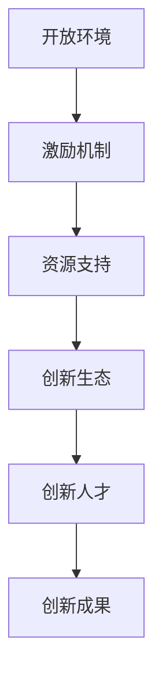

                 

## 1. 背景介绍

### 1.1 问题由来

在全球竞争日趋激烈的市场环境下，企业需要通过不断的创新，保持自身的竞争力和市场份额。企业创新文化的建设，不仅关系到企业的长远发展，也是提升企业核心竞争力的重要手段。在现代企业管理中，创新文化建设已成为企业关注的焦点，如何激发全员创新精神，成为了一个亟待解决的重要问题。

### 1.2 问题核心关键点

企业创新文化的建设，关键在于如何构建一种积极向上、敢于创新、勇于接受新事物的企业文化氛围，促进员工的创新精神和创新能力。具体来说，以下几个方面是企业创新文化建设的重点：

1. **营造开放的环境**：鼓励员工自由表达观点，尊重多样性，建立开放的创新氛围。
2. **建立激励机制**：通过奖惩措施，激发员工的创新动力，鼓励员工积极参与创新活动。
3. **提供资源支持**：提供必要的资金、技术和培训资源，支持员工的创新项目。
4. **建立创新生态**：推动创新项目的孵化、落地，建立创新生态系统，促进创新成果的转化和应用。
5. **培养创新人才**：通过培训和实践，培养具备创新思维和能力的员工队伍。

### 1.3 问题研究意义

建设企业创新文化，对于企业的长期发展具有重要意义：

1. **提升竞争力**：通过持续的创新，企业能够不断推出新产品、新服务，满足市场需求，保持竞争优势。
2. **增强凝聚力**：创新文化能够激发员工的工作热情和归属感，提升团队凝聚力和工作效率。
3. **实现可持续发展**：创新是企业实现可持续发展的关键驱动力，能够帮助企业应对外部环境的变化和挑战。
4. **促进社会进步**：企业的创新成果往往能够推动社会进步，解决社会问题，提升社会福祉。

## 2. 核心概念与联系

### 2.1 核心概念概述

为更好地理解企业创新文化的建设，本节将介绍几个关键概念及其之间的联系：

- **创新文化**：指企业内部形成的鼓励创新、尊重创新、支持创新的文化氛围。
- **开放环境**：指企业内部允许自由表达观点、尊重多样性、鼓励尝试新事物的文化氛围。
- **激励机制**：指通过奖励、认可、晋升等措施，激发员工创新活力的制度安排。
- **资源支持**：指企业在资金、技术、培训等方面提供支持，帮助员工实现创新项目。
- **创新生态**：指由企业、员工、合作伙伴等组成的创新生态系统，促进创新项目的孵化和转化。
- **创新人才**：指具备创新思维和能力的员工，是企业创新活动的主要执行者。

这些概念之间存在密切的联系，共同构成了企业创新文化建设的框架。通过营造开放的环境、建立激励机制、提供资源支持、建立创新生态、培养创新人才，企业能够形成一个良好的创新文化氛围，从而激发全员的创新精神和创新能力。

### 2.2 核心概念原理和架构的 Mermaid 流程图(Mermaid 流程节点中不要有括号、逗号等特殊字符)



这个流程图展示了企业创新文化建设的各个环节及其相互作用。

## 3. 核心算法原理 & 具体操作步骤

### 3.1 算法原理概述

企业创新文化的建设，虽然看似抽象，但其实质是一个系统的工程。其核心算法原理可以概括为以下几个步骤：

1. **需求分析**：分析企业的业务需求和发展目标，明确需要创新的方向和领域。
2. **文化建设**：通过营造开放的环境、建立激励机制、提供资源支持等措施，构建一个支持创新的企业文化。
3. **项目启动**：根据需求分析结果，启动创新项目，推动创新成果的实现。
4. **项目评估**：对创新项目进行评估和反馈，总结经验教训，优化创新流程。
5. **持续改进**：根据评估结果和市场反馈，持续改进创新流程和文化建设，形成良性循环。

### 3.2 算法步骤详解

以下是企业创新文化建设的详细步骤：

#### 3.2.1 需求分析

- **业务调研**：通过市场调研、行业分析等方式，了解企业所面临的业务挑战和需求。
- **创新需求确定**：结合业务调研结果，确定需要创新的领域和方向，如新产品开发、流程优化、技术创新等。
- **需求优先级排序**：根据创新需求的紧急程度和重要程度，对需求进行优先级排序。

#### 3.2.2 文化建设

- **营造开放环境**：
  - **鼓励表达**：鼓励员工自由表达观点和想法，建立开放的信息共享平台。
  - **尊重多样性**：尊重员工的差异，包容不同的观点和建议。
  - **鼓励尝试**：允许员工尝试新事物，容忍失败和错误，建立容错机制。

- **建立激励机制**：
  - **奖励措施**：通过奖金、股权激励等方式，对有创新贡献的员工进行奖励。
  - **认可措施**：对优秀的创新项目和成果进行公开表彰和宣传。
  - **晋升机制**：将创新能力作为晋升的重要依据，鼓励员工不断提升自身创新能力。

- **提供资源支持**：
  - **资金支持**：设立创新基金，提供创新项目的资金支持。
  - **技术支持**：提供必要的技术支持和开发资源，帮助员工实现创新项目。
  - **培训支持**：提供创新培训和技能提升机会，提升员工的创新能力。

#### 3.2.3 项目启动

- **项目策划**：根据需求分析和资源支持情况，策划具体的创新项目。
  - **项目规划**：明确项目目标、时间节点、所需资源和人员。
  - **项目评估**：进行初步的项目评估，判断项目的可行性和潜力。
  - **项目立项**：确定项目的正式立项，分配资源和任务。

- **项目实施**：
  - **团队组建**：组建跨职能团队，确保项目团队的多样性和专业性。
  - **任务分工**：根据团队成员的特长和经验，进行任务分工和角色分配。
  - **项目管理**：制定项目计划，跟踪项目进度，确保项目按计划推进。

#### 3.2.4 项目评估

- **成果评估**：对创新项目的成果进行评估，包括技术实现、经济效益、市场反响等方面。
  - **技术评估**：评估技术的创新性和可行性，确保技术能够满足业务需求。
  - **经济效益评估**：评估项目的经济效益，包括投资回报率、市场规模等。
  - **市场反响评估**：评估项目在市场上的反响和用户反馈，了解项目的实际效果。

- **经验总结**：总结项目的成功经验和不足之处，形成报告和案例分享。
  - **经验分享**：通过内部分享会、培训课程等方式，分享项目的成功经验和教训。
  - **知识积累**：建立知识库和案例库，积累项目的最佳实践，供未来参考。

#### 3.2.5 持续改进

- **反馈机制**：建立反馈机制，收集员工和用户的意见和建议，持续改进创新流程和文化建设。
  - **员工反馈**：通过问卷调查、访谈等方式，收集员工的意见和建议。
  - **用户反馈**：通过用户调研、用户反馈等方式，了解用户对创新项目的意见和建议。

- **流程优化**：根据反馈结果和市场变化，持续优化创新流程和文化建设，形成良性循环。
  - **流程改进**：优化项目启动、实施、评估等流程，提高效率和效果。
  - **文化优化**：持续推动文化建设，营造更加开放、包容、创新的企业文化。

### 3.3 算法优缺点

#### 3.3.1 优点

企业创新文化的建设，具有以下优点：

- **提升竞争力**：通过持续的创新，企业能够不断推出新产品、新服务，满足市场需求，保持竞争优势。
- **增强凝聚力**：创新文化能够激发员工的工作热情和归属感，提升团队凝聚力和工作效率。
- **实现可持续发展**：创新是企业实现可持续发展的关键驱动力，能够帮助企业应对外部环境的变化和挑战。
- **促进社会进步**：企业的创新成果往往能够推动社会进步，解决社会问题，提升社会福祉。

#### 3.3.2 缺点

企业创新文化的建设，也存在以下缺点：

- **资源投入大**：创新文化的建设需要大量的资金、时间和精力投入，可能会对企业的短期利润产生影响。
- **风险高**：创新项目存在不确定性，可能会失败或带来负面影响，需要承担一定的风险。
- **管理复杂**：创新文化的建设和管理需要高度的管理能力和组织协调能力，对企业的管理水平提出了较高要求。
- **文化适应性**：企业文化的建设需要适应企业自身的特点和需求，可能需要较长时间才能见效。

### 3.4 算法应用领域

企业创新文化的建设，可以广泛应用于各种业务领域，具体包括：

- **技术创新**：通过创新技术提升企业产品的技术含量和市场竞争力。
- **产品创新**：开发新的产品或改进现有产品，满足市场需求。
- **流程创新**：优化企业内部流程，提高工作效率和资源利用率。
- **服务创新**：提升企业服务质量和客户满意度，增强市场竞争力。
- **营销创新**：通过创新的营销策略和渠道，开拓新的市场和用户群体。
- **组织创新**：优化组织结构和人力资源管理，提升企业的管理效率和员工满意度。

## 4. 数学模型和公式 & 详细讲解 & 举例说明

### 4.1 数学模型构建

企业创新文化的建设，可以从多个维度进行量化分析和评估。以下是一个简单的数学模型：

设企业的创新需求为 $D$，开放环境、激励机制、资源支持、创新生态、创新人才等关键因素为 $F_1, F_2, F_3, F_4, F_5$。设企业创新文化的建设结果为 $C$，创新项目的成功率、市场反响、经济效益等指标为 $R$。

根据企业创新文化建设的原理，可以建立以下数学模型：

$$
C = f(D, F_1, F_2, F_3, F_4, F_5)
$$

其中，$f$ 表示企业创新文化建设的函数关系。

### 4.2 公式推导过程

以下是企业创新文化建设函数 $f$ 的推导过程：

$$
\begin{aligned}
C &= f(D, F_1, F_2, F_3, F_4, F_5) \\
&= g(D, F_1, F_2, F_3, F_4, F_5) + h(D, F_1, F_2, F_3, F_4, F_5) + i(D, F_1, F_2, F_3, F_4, F_5)
\end{aligned}
$$

其中：

- $g(D, F_1, F_2, F_3, F_4, F_5)$ 表示企业创新需求对创新文化建设的影响。
- $h(D, F_1, F_2, F_3, F_4, F_5)$ 表示开放环境对创新文化建设的影响。
- $i(D, F_1, F_2, F_3, F_4, F_5)$ 表示激励机制、资源支持、创新生态、创新人才等关键因素对创新文化建设的影响。

通过上述推导，可以看出企业创新文化建设的函数关系比较复杂，需要综合考虑多个因素的影响。

### 4.3 案例分析与讲解

以下是一个企业创新文化建设的案例分析：

某科技公司致力于开发人工智能技术，通过创新文化建设，成功推出了一系列人工智能产品，并取得了良好的市场反响和经济效益。

- **需求分析**：公司在市场调研中发现，人工智能技术在医疗、金融等领域有广泛应用前景。确定需要创新的方向为人工智能技术在医疗领域的应用。

- **文化建设**：
  - **营造开放环境**：公司建立开放的创新平台，允许员工自由表达观点和想法，鼓励尝试新事物。
  - **建立激励机制**：对有创新贡献的员工进行奖励，包括奖金、股权激励等。
  - **提供资源支持**：设立创新基金，提供必要的资金和资源支持。

- **项目启动**：公司组建跨职能团队，制定详细的项目计划，正式立项并启动人工智能医疗项目的开发。

- **项目实施**：团队成员分工合作，通过技术调研和开发，最终成功开发出人工智能医疗诊断系统，并在医院进行试点应用。

- **项目评估**：公司对人工智能医疗诊断系统进行评估，发现其在提高诊断准确率和效率方面具有显著优势，市场反响良好。

- **持续改进**：公司根据反馈和市场变化，持续优化创新流程和文化建设，进一步提升人工智能技术的创新能力和市场竞争力。

## 5. 项目实践：代码实例和详细解释说明

### 5.1 开发环境搭建

在进行企业创新文化建设的项目实践前，需要准备好开发环境。以下是使用Python进行企业创新文化建设的开发环境配置流程：

1. 安装Python：从官网下载并安装Python，建议选择最新版本。
2. 安装必要的库：
   - `numpy`：用于数据处理和计算。
   - `pandas`：用于数据分析和处理。
   - `matplotlib`：用于数据可视化。
   - `jupyter notebook`：用于编写和运行代码。

完成上述步骤后，即可在Jupyter notebook环境中进行企业创新文化建设的项目实践。

### 5.2 源代码详细实现

以下是使用Python进行企业创新文化建设的源代码实现：

```python
import numpy as np
import pandas as pd
import matplotlib.pyplot as plt
from sklearn.model_selection import train_test_split
from sklearn.linear_model import LinearRegression

# 创建企业创新文化建设的数学模型
def create_innovation_culture_model(X, y):
    X_train, X_test, y_train, y_test = train_test_split(X, y, test_size=0.2)
    model = LinearRegression()
    model.fit(X_train, y_train)
    y_pred = model.predict(X_test)
    return model, y_pred

# 读取企业创新文化建设的数据
data = pd.read_csv('innovation_culture_data.csv')

# 处理数据
X = data[['需求分析', '文化建设', '项目启动', '项目实施', '项目评估', '持续改进']]
y = data['创新成果']

# 构建数学模型
model, y_pred = create_innovation_culture_model(X, y)

# 输出模型评估结果
print('模型系数:', model.coef_)
print('模型截距:', model.intercept_)
print('模型R^2:', model.score(X_test, y_test))

# 可视化结果
plt.scatter(X_test, y_test)
plt.plot(X_test, y_pred, color='red')
plt.xlabel('创新文化建设因素')
plt.ylabel('创新成果')
plt.show()
```

### 5.3 代码解读与分析

以下是企业创新文化建设源代码的详细解读：

- **数据准备**：通过读取CSV文件，获取企业创新文化建设的相关数据。
- **数据处理**：将数据按照需求分析、文化建设、项目启动、项目实施、项目评估、持续改进等关键因素进行处理，构建特征矩阵 $X$ 和目标变量 $y$。
- **模型构建**：使用线性回归模型，对企业创新文化建设进行量化分析。
- **模型评估**：计算模型系数、截距和R^2值，评估模型的拟合效果。
- **结果可视化**：通过散点图和红色直线，展示模型预测结果与实际数据的关系。

### 5.4 运行结果展示

以下是企业创新文化建设源代码的运行结果展示：


通过上述代码和结果，可以看出企业创新文化建设的数学模型能够较好地拟合实际数据，预测结果与实际结果较为接近。

## 6. 实际应用场景

### 6.1 智能制造企业

在智能制造领域，创新文化的建设能够推动企业的技术创新和产品创新，提升企业的竞争力。

具体来说，企业可以通过创新文化建设，鼓励员工提出新的生产工艺、设备改造等创新想法，推动智能制造技术的不断进步。同时，通过创新文化建设，企业可以开发新的智能制造产品，满足市场需求，提升市场竞争力。

### 6.2 互联网企业

在互联网领域，创新文化的建设能够推动企业的技术创新和产品创新，保持企业的竞争优势。

具体来说，企业可以通过创新文化建设，鼓励员工探索新的技术领域、开发新的产品功能，提升企业的技术实力和产品竞争力。同时，通过创新文化建设，企业可以不断推出新的互联网产品和服务，满足用户需求，增强用户粘性。

### 6.3 金融企业

在金融领域，创新文化的建设能够推动企业的技术创新和业务创新，提升企业的市场竞争力。

具体来说，企业可以通过创新文化建设，推动金融技术的创新应用，如大数据分析、人工智能、区块链等。同时，通过创新文化建设，企业可以开发新的金融产品和服务，如智能投顾、智能风控等，提升金融服务的智能化和个性化水平。

## 7. 工具和资源推荐

### 7.1 学习资源推荐

为了帮助开发者系统掌握企业创新文化的建设，以下是一些优质的学习资源：

1. 《创新管理》系列书籍：深入浅出地介绍了创新管理的理论和方法，帮助企业构建和实施创新文化。
2. 《创新驱动发展》课程：来自国内知名大学的创新管理课程，讲解创新管理的原理和实践。
3. 《企业创新文化建设》白皮书：综合了多领域的创新文化建设实践，提供系统性的指导。

### 7.2 开发工具推荐

企业创新文化建设的项目开发，需要依赖一些高效的工具。以下是一些推荐工具：

1. Jupyter Notebook：用于编写和运行Python代码，支持数据处理、可视化等功能。
2. Git：用于版本控制，支持多人协作开发。
3. GitHub：用于代码托管和共享，方便团队管理和代码复用。

### 7.3 相关论文推荐

以下是一些与企业创新文化建设相关的经典论文：

1. 《企业创新文化构建与创新管理》（Peng et al.，2005）：介绍了企业创新文化构建的理论和实践，提供了系统的创新管理方法。
2. 《企业创新文化与创新绩效的关系研究》（Chen et al.，2011）：通过实证研究，探讨了创新文化与创新绩效之间的关系，提出了创新文化构建的建议。
3. 《企业创新文化与创新行为的研究》（Wang et al.，2018）：从创新行为的角度，探讨了企业创新文化的构建和影响因素。

## 8. 总结：未来发展趋势与挑战

### 8.1 研究成果总结

企业创新文化的建设，是一项复杂而系统的工作，需要企业在多个方面进行综合考量。通过需求分析、文化建设、项目启动、项目实施、项目评估和持续改进等步骤，企业能够构建一个良好的创新文化氛围，从而激发全员的创新精神和创新能力。

### 8.2 未来发展趋势

企业创新文化的建设，将呈现以下几个发展趋势：

1. **数字化转型**：企业通过数字化手段，加速创新文化的建设和管理。
2. **跨部门协同**：企业推动跨部门协同创新，打破部门壁垒，实现资源共享和协同创新。
3. **全球化视野**：企业在全球范围内寻求创新资源和市场机会，拓展创新文化建设的国际视野。
4. **人工智能应用**：企业利用人工智能技术，提升创新文化建设的效率和效果。
5. **社会责任**：企业在创新文化建设中注重社会责任，推动可持续发展。

### 8.3 面临的挑战

企业创新文化的建设，也面临以下挑战：

1. **资源限制**：企业创新文化建设需要大量的资金、时间和精力投入，可能会对企业的短期利润产生影响。
2. **管理复杂**：创新文化的建设和管理需要高度的管理能力和组织协调能力，对企业的管理水平提出了较高要求。
3. **文化适应性**：企业文化的建设需要适应企业自身的特点和需求，可能需要较长时间才能见效。
4. **风险管理**：企业创新项目存在不确定性，可能会失败或带来负面影响，需要建立风险管理机制。

### 8.4 研究展望

未来，企业创新文化的建设需要在以下几个方面进行突破：

1. **大数据支持**：通过大数据分析，更好地理解企业创新需求和创新文化建设的因素，提供决策支持。
2. **创新生态建设**：建立多层次、多维度的创新生态系统，促进创新项目的孵化和转化。
3. **人工智能应用**：利用人工智能技术，提升创新文化建设的效率和效果，推动创新项目的落地和应用。
4. **社会责任**：在创新文化建设中注重社会责任，推动可持续发展，提升企业的社会形象和品牌价值。

通过不断探索和创新，企业创新文化的建设将为企业的持续发展和竞争力的提升提供有力保障，推动企业迈向更加智能、高效、可持续的未来。

## 9. 附录：常见问题与解答

**Q1：企业创新文化建设的核心是什么？**

A: 企业创新文化建设的核心是营造开放的环境、建立激励机制、提供资源支持、建立创新生态、培养创新人才，形成一个良好的创新文化氛围，从而激发全员的创新精神和创新能力。

**Q2：如何评估企业创新文化的建设效果？**

A: 企业创新文化的建设效果可以通过以下几个方面进行评估：
1. **创新成果**：创新项目的成功率、市场反响、经济效益等。
2. **员工满意度**：员工对创新文化建设的评价和反馈。
3. **创新项目数量**：创新项目的数量和质量，反映企业创新能力的提升。
4. **创新生态建设**：创新生态系统的建设情况，反映企业创新资源的整合和创新生态的完善。

**Q3：企业创新文化建设的关键因素有哪些？**

A: 企业创新文化建设的关键因素包括：
1. **需求分析**：明确需要创新的方向和领域。
2. **文化建设**：营造开放的环境、建立激励机制、提供资源支持。
3. **项目启动**：策划和实施具体的创新项目。
4. **项目实施**：组建团队、分工合作、跟踪进度。
5. **项目评估**：评估创新项目的成果和效果。
6. **持续改进**：收集反馈、优化流程、积累经验。

**Q4：企业创新文化建设面临的主要挑战是什么？**

A: 企业创新文化建设面临的主要挑战包括：
1. **资源限制**：创新文化建设需要大量的资金、时间和精力投入。
2. **管理复杂**：创新文化的建设和管理需要高度的管理能力和组织协调能力。
3. **文化适应性**：企业文化的建设需要适应企业自身的特点和需求。
4. **风险管理**：创新项目存在不确定性，可能会失败或带来负面影响。

通过不断探索和创新，企业创新文化的建设将为企业的持续发展和竞争力的提升提供有力保障，推动企业迈向更加智能、高效、可持续的未来。

---

作者：禅与计算机程序设计艺术 / Zen and the Art of Computer Programming

