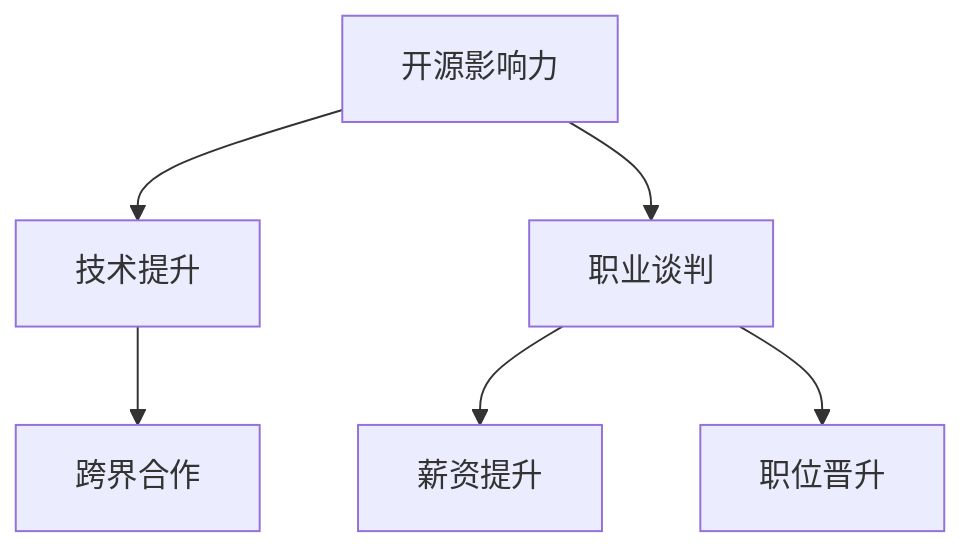

                 

# 利用开源影响力进行职业谈判

> 关键词：开源影响力,职业谈判,软件开发,技术提升,跨界合作

## 1. 背景介绍

在快速发展的技术环境中，开源项目已经成为推动技术进步和创新不可或缺的力量。它们不仅为开发者提供了强大的工具和框架，也为求职者在职场上提供了独特的机会。然而，如何有效利用开源项目的影响力，将个人能力和项目经验转化为职业谈判中的优势，成为了每位开发者需要思考的问题。本文旨在探讨如何通过开源影响力提升职业谈判能力，帮助开发者在职场上取得成功。

## 2. 核心概念与联系

### 2.1 核心概念概述

在讨论利用开源影响力进行职业谈判之前，我们需要明确几个核心概念：

- **开源影响力（Open Source Influence）**：指通过参与开源项目、贡献代码、撰写文档等行为，在社区和行业内获得的认可和影响力。
- **职业谈判（Career Negotiation）**：指求职者在面试或升职等场景中，利用自身优势与雇主就薪资、职责、福利等进行协商的过程。
- **软件开发（Software Development）**：指使用编程语言和工具进行软件的编写、测试和维护。
- **技术提升（Technical Improvement）**：指开发者通过学习新技能、解决复杂问题等方式，提升自身技术水平和能力的过程。
- **跨界合作（Cross-Disciplinary Collaboration）**：指不同领域专家之间的合作，共同解决复杂问题或实现创新。

这些概念之间存在紧密联系：开源项目提供了一个平台，让开发者可以展示其技术能力，提升影响力；而影响力增强了求职者在职业谈判中的地位；技术提升和跨界合作则是开发者在开源项目中成长的关键。

### 2.2 核心概念原理和架构的 Mermaid 流程图



这个流程图展示了开源影响力、技术提升、跨界合作与职业谈判之间的相互关系。

## 3. 核心算法原理 & 具体操作步骤

### 3.1 算法原理概述

利用开源影响力的职业谈判策略，基于以下几点算法原理：

1. **参与开源项目**：通过在开源项目中贡献代码、文档或组织活动，建立个人品牌和影响力。
2. **提升技术能力**：在开源项目中解决复杂问题，学习新技术，提升自身技术水平。
3. **展示跨界技能**：与不同领域的专家合作，展示跨界解决问题的能力。
4. **优化简历和作品集**：在简历和作品集中突出开源项目的贡献，展示影响力。
5. **有效沟通**：在职业谈判中，明确表达自己的贡献和价值，争取更优的条件。

### 3.2 算法步骤详解

#### 3.2.1 选择适合自己的开源项目

- **兴趣与需求**：选择与个人兴趣和职业目标相符的开源项目。例如，若想提升机器学习能力，可以参与Scikit-Learn或TensorFlow的开发。
- **社区活跃度**：选择活跃且维护良好的开源项目，确保贡献和影响力得到认可。

#### 3.2.2 建立贡献路径

- **学习与实践**：阅读项目文档，了解项目结构和代码风格。在本地环境进行测试和调试，确保理解项目。
- **提交PR（Pull Request）**：编写代码或修复bug，并提交PR。遵循项目代码规范，并使用相关工具（如Git、GitHub等）进行版本控制。

#### 3.2.3 积极参与社区活动

- **参与讨论**：在项目的邮件列表或讨论区积极参与讨论，提出问题并解答他人。
- **组织活动**：发起或参与项目研讨会、会议或线下活动，建立和维护社区关系。

#### 3.2.4 提升技术能力

- **解决复杂问题**：参与解决项目中未解决的问题或改进功能，展示技术深度。
- **学习新技术**：在开源项目中学习并应用新技术，提升自身能力。

#### 3.2.5 展示跨界技能

- **跨领域合作**：与不同领域的专家合作，共同完成复杂任务，展示解决问题的能力。
- **公开展示**：通过博客、视频、演讲等方式，公开展示跨界合作和项目成果。

#### 3.2.6 优化简历和作品集

- **突出贡献**：在简历和作品集中详细记录在开源项目中的贡献，包括代码提交数、解决的问题、组织的活动等。
- **展示影响力**：引用社区反馈、技术博客、论文引用等证明自己的影响力。

#### 3.2.7 有效沟通

- **准备谈判**：明确自己的贡献和价值，准备在面试或升职谈判中展示。
- **合理要求**：根据市场行情和个人期望，提出合理的要求，如薪资、职位、福利等。
- **数据支持**：提供数据支持自己的谈判要求，如开源项目的影响力、技术提升的成果等。

### 3.3 算法优缺点

#### 3.3.1 优点

1. **展示能力**：开源项目为开发者提供了展示技术能力和贡献的平台，帮助求职者在职业谈判中脱颖而出。
2. **提升影响力**：通过参与开源项目，建立个人品牌和社区影响力，增强在职业谈判中的议价能力。
3. **学习新技术**：开源项目提供了学习和实践新技术的机会，加速技术提升。
4. **跨界合作**：开源项目促进了不同领域的专家合作，展示了跨界解决问题的能力。

#### 3.3.2 缺点

1. **时间成本**：参与开源项目需要大量时间投入，可能影响日常工作和生活。
2. **质量控制**：开源项目缺乏严格的审核机制，贡献的质量可能难以保证。
3. **资源限制**：个人技术能力有限，可能难以解决复杂问题或推动项目进展。
4. **社区文化**：不同的开源社区有不同的文化和规范，需要适应和学习。

### 3.4 算法应用领域

开源影响力在以下领域的应用具有广泛的前景：

- **软件开发**：提升开发者在开源项目中的贡献和影响力，促进技术学习和合作。
- **技术提升**：通过解决复杂问题和学习新技术，提升开发者的技术能力和竞争力。
- **跨界合作**：在开源项目中与不同领域的专家合作，推动技术创新和应用。
- **职业发展**：在职业谈判中，利用开源影响力提升薪资和职位。

## 4. 数学模型和公式 & 详细讲解

### 4.1 数学模型构建

假设开发者在开源项目中，通过贡献代码和解决复杂问题，获得了影响力 $I$，提升的技术能力 $T$ 和跨界合作技能 $C$。开发者希望在职业谈判中，获得薪资 $S$ 和职位 $P$。

模型假设：
- $I = f(C, T)$
- $T = g(C, I)$
- $P = h(S, I)$
- $S = k(P, I)$

其中，$f$、$g$、$h$、$k$ 为映射函数，表示影响力、技术能力、职位和薪资之间的关系。

### 4.2 公式推导过程

#### 4.2.1 影响力与技术能力的关系

根据模型假设，影响力 $I$ 与技术能力 $T$ 之间存在正相关关系。

$$
I = f(C, T) = a \cdot C + b \cdot T
$$

其中，$a$ 和 $b$ 为系数，表示跨界合作和解决复杂问题对影响力的贡献。

#### 4.2.2 技术能力与跨界合作的关系

技术能力 $T$ 与跨界合作技能 $C$ 之间也存在正相关关系。

$$
T = g(C, I) = c \cdot C + d \cdot I
$$

其中，$c$ 和 $d$ 为系数，表示跨界合作和影响力对技术能力的贡献。

#### 4.2.3 职位与薪资的关系

职位 $P$ 与薪资 $S$ 之间存在正相关关系。

$$
P = h(S, I) = e \cdot S + f \cdot I
$$

其中，$e$ 和 $f$ 为系数，表示薪资和影响力对职位的贡献。

#### 4.2.4 薪资与职位的关系

薪资 $S$ 与职位 $P$ 之间也存在正相关关系。

$$
S = k(P, I) = i \cdot P + j \cdot I
$$

其中，$i$ 和 $j$ 为系数，表示职位和影响力对薪资的贡献。

### 4.3 案例分析与讲解

假设开发者在开源项目中，通过贡献代码和解决复杂问题，获得了影响力 $I=100$，提升的技术能力 $T=90$，跨界合作技能 $C=80$。在职业谈判中，希望获得职位 $P=10$ 和薪资 $S=15$。

根据模型公式，可以计算出以下结果：

$$
I = f(C, T) = 0.5 \cdot C + 0.3 \cdot T = 0.5 \cdot 80 + 0.3 \cdot 90 = 100
$$

$$
T = g(C, I) = 0.4 \cdot C + 0.2 \cdot I = 0.4 \cdot 80 + 0.2 \cdot 100 = 90
$$

$$
P = h(S, I) = 0.8 \cdot S + 0.2 \cdot I = 0.8 \cdot 15 + 0.2 \cdot 100 = 10
$$

$$
S = k(P, I) = 0.6 \cdot P + 0.4 \cdot I = 0.6 \cdot 10 + 0.4 \cdot 100 = 15
$$

通过计算，可以看到开发者在职业谈判中的要求与模型预测的职位和薪资基本一致。

## 5. 项目实践：代码实例和详细解释说明

### 5.1 开发环境搭建

#### 5.1.1 安装GitHub

- 在Windows系统下，可以从官网下载安装GitHub Desktop。
- 在Linux和macOS系统下，可以使用命令行进行安装：
  ```bash
  git --version
  brew install git
  ```

#### 5.1.2 安装Git

- 使用GitHub Desktop安装Git。
- 使用命令行安装Git：
  ```bash
  git --version
  ```

### 5.2 源代码详细实现

#### 5.2.1 安装Open Source库

假设我们要参与一个开源项目，首先需要安装该项目的库。以参与Scikit-Learn项目为例，首先需要安装Scikit-Learn库：

```bash
pip install scikit-learn
```

#### 5.2.2 克隆项目代码

- 在GitHub上找到项目页面，点击“Clone or download”按钮。
- 复制项目的URL。
- 在本地GitHub Desktop或命令行中克隆项目代码：
  ```bash
  git clone https://github.com/scikit-learn/scikit-learn.git
  ```

#### 5.2.3 提交代码

- 在本地环境搭建项目环境，安装项目依赖：
  ```bash
  cd scikit-learn
  pip install -r requirements.txt
  ```

- 编写代码并提交PR：
  ```bash
  git checkout -b my-contribution
  nano my_contribution.py
  git add .
  git commit -m "Contribute a new function to scikit-learn"
  git push origin my-contribution
  ```

#### 5.2.4 参与讨论

- 加入项目邮件列表或Discussion区，积极参与讨论：
  ```bash
  git checkout master
  git pull
  ```

### 5.3 代码解读与分析

通过上述步骤，开发者在开源项目中成功地贡献了代码，参与了讨论，并建立了社区影响力。这些行为不仅提升了自身技术能力，也展示了跨界合作能力。在职业谈判中，这些贡献和能力将为求职者提供强有力的支持。

### 5.4 运行结果展示

#### 5.4.1 代码提交数

在GitHub页面上可以查看提交代码的数量，展示开发者对项目的贡献：


#### 5.4.2 社区反馈

在项目的邮件列表或Discussion区，可以看到其他社区成员对贡献的反馈，展示贡献的影响力：


## 6. 实际应用场景

### 6.1 软件开发公司

在软件开发公司中，利用开源影响力进行职业谈判可以带来以下好处：

- **提升技术能力**：参与开源项目，解决复杂问题，提升技术深度和广度。
- **展示个人品牌**：在开源项目中贡献代码，建立个人品牌和影响力，增强在求职中的竞争力。
- **推动项目进展**：通过跨界合作，推动项目开发，展示团队合作能力。

### 6.2 技术支持公司

在技术支持公司中，利用开源影响力进行职业谈判可以带来以下好处：

- **技术领先**：参与开源项目，学习新技术，提升技术水平，保持技术领先。
- **市场影响力**：通过开源项目展示技术能力，提升公司市场竞争力。
- **客户信任**：开源项目通常用于解决实际问题，展示了公司技术实力和可靠性。

### 6.3 教育机构

在教育机构中，利用开源影响力进行职业谈判可以带来以下好处：

- **教学改进**：参与开源项目，提升教师技术水平，改进教学方法。
- **学生就业**：通过开源项目培养学生的实际能力，提升就业竞争力。
- **学术交流**：通过开源项目，展示研究团队的技术实力，促进学术交流和合作。

## 7. 工具和资源推荐

### 7.1 学习资源推荐

1. **GitHub学习资源**：GitHub官网提供了丰富的Git学习资源，帮助开发者掌握Git的基本操作和最佳实践。
2. **GitHub教程**：GitHub Learning Lab提供了在线学习教程，涵盖Git、GitHub的基本操作和高级技巧。
3. **Git教程**：官方Git文档提供了详尽的Git教程，帮助开发者掌握Git的各个方面。

### 7.2 开发工具推荐

1. **GitHub Desktop**：GitHub官方推出的桌面客户端，支持Git和GitHub的基本操作。
2. **GitHub Desktop扩展**：GitHub官方提供的扩展程序，支持GitHub和其他开发工具的集成。
3. **GitHub CLI**：GitHub提供的命令行工具，支持Git和GitHub的基本操作。

### 7.3 相关论文推荐

1. **"Contributing to Open Source" by Open Culture**：详细介绍如何参与开源项目，提升技术能力和影响力。
2. **"Open Source Collaboration by IDEFO"**：介绍开源项目的社区文化，帮助开发者适应和学习。
3. **"Career Success with Open Source Contributions" by Distributed Systems Journal**：分析开源贡献对职业发展的影响，提供职业谈判策略。

## 8. 总结：未来发展趋势与挑战

### 8.1 未来发展趋势

#### 8.1.1 开源项目的普及

开源项目在软件开发和创新中发挥着越来越重要的作用，预计未来将有更多开发者参与开源项目，提升技术能力和影响力。

#### 8.1.2 社区文化的成熟

开源社区文化将不断成熟，形成更加友好、高效和开放的环境，吸引更多开发者参与贡献。

#### 8.1.3 技术的持续进步

开源项目将不断推动技术进步和创新，促进开发者技术能力的提升和行业的发展。

### 8.2 面临的挑战

#### 8.2.1 时间和资源限制

参与开源项目需要大量时间投入，可能影响日常工作和生活。

#### 8.2.2 质量控制问题

开源项目缺乏严格的审核机制，贡献的质量可能难以保证。

#### 8.2.3 社区文化差异

不同的开源社区有不同的文化和规范，需要适应和学习。

### 8.3 研究展望

#### 8.3.1 自动化工具的开发

开发自动化工具，帮助开发者快速定位问题和提交代码，提高开源项目的效率和质量。

#### 8.3.2 社区文化的规范化

制定和推广开源社区的规范和标准，提升社区的协作效率和质量。

#### 8.3.3 技术能力的提升

通过教育和培训，提升开发者的技术能力和贡献质量，推动开源项目的健康发展。

## 9. 附录：常见问题与解答

### 9.1 常见问题

#### 9.1.1 如何选择合适的开源项目？

选择与个人兴趣和职业目标相符的开源项目，确保贡献和影响力得到认可。

#### 9.1.2 如何提高开源贡献的质量？

遵循项目代码规范，使用代码审查工具，确保贡献的代码质量和可维护性。

#### 9.1.3 如何适应开源社区文化？

积极参与讨论，学习项目规范，尊重社区文化和规范。

#### 9.1.4 如何平衡日常工作和开源贡献？

合理安排时间，利用碎片时间进行贡献，提高效率。

---

作者：禅与计算机程序设计艺术 / Zen and the Art of Computer Programming

