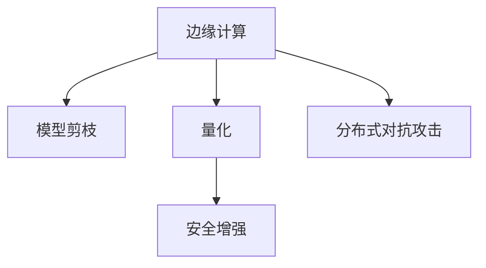

                 

# 剪枝技术在边缘计算安全中的角色

## 1. 背景介绍

### 1.1 问题由来

随着物联网设备和5G网络的普及，边缘计算正逐渐成为支持实时数据处理和决策的核心技术。然而，随着越来越多的数据在本地进行处理，计算资源的安全性、隐私保护和抗攻击性变得至关重要。攻击者可以借助这些设备进行分布式协同攻击，对网络产生巨大的威胁。因此，如何在边缘计算环境中高效安全地处理数据，成为了当前研究的热点问题。

### 1.2 问题核心关键点

边缘计算中的数据通常具有高度敏感性，因此如何在保证性能的同时实现高效、安全的计算资源利用，是一个亟待解决的问题。剪枝技术通过识别和移除模型中不必要的计算，可以有效降低计算复杂度，减少攻击面，提升模型安全性和性能。

## 2. 核心概念与联系

### 2.1 核心概念概述

为更好地理解剪枝技术在边缘计算安全中的角色，本节将介绍几个密切相关的核心概念：

- 边缘计算(Edge Computing)：指在数据源附近执行数据处理、存储和分析的一种计算模式。相比集中式计算，边缘计算能够有效减少延迟，提高数据处理效率。

- 模型剪枝(Model Pruning)：指通过对神经网络模型进行结构化或权重级别的压缩，去除冗余参数和计算资源，从而降低模型规模和计算复杂度的技术。

- 量化(Qantization)：通过将模型中的浮点参数转换为定点参数，减少模型存储和计算的精度，从而降低内存和计算资源消耗。

- 安全增强(Security Hardening)：通过加入特定的防御措施和算法，增强系统的安全性，防止恶意攻击。

- 分布式对抗攻击(Distributed Adversarial Attacks)：攻击者通过多台设备协同发起攻击，大幅提升攻击效果，提高攻击成功率。

这些核心概念之间的逻辑关系可以通过以下Mermaid流程图来展示：



这个流程图展示了几大核心概念之间的关系：

1. 边缘计算通过在本地设备上处理数据，减少了对中心节点的依赖，提高了数据处理效率。
2. 模型剪枝通过去除冗余参数，有效降低模型复杂度，提升计算性能。
3. 量化通过减少精度，进一步减小模型存储和计算资源消耗，提升效率。
4. 安全增强通过特定的防御措施，提升系统安全性，防止恶意攻击。
5. 分布式对抗攻击通过协同攻击，提升了攻击成功率，对系统安全性构成威胁。

## 3. 核心算法原理 & 具体操作步骤

### 3.1 算法原理概述

剪枝技术的核心思想是通过移除模型中的冗余参数或计算资源，降低模型复杂度，从而提升计算效率和安全性。剪枝的实现可以分为结构化剪枝和权重剪枝两大类。

结构化剪枝是指通过移除部分神经网络层，减少模型深度。权重剪枝则是通过移除部分网络参数，减少模型宽度。两种剪枝方式均可通过训练过程实现，例如，在训练中通过某种阈值规则选择保留哪些参数，移除哪些参数。

### 3.2 算法步骤详解

剪枝技术的实现一般包括以下几个关键步骤：

**Step 1: 选择剪枝策略**

根据任务特点和资源限制，选择最适合的剪枝策略。常用的剪枝策略包括：

- 基于网络结构的剪枝，如深度剪枝、宽度剪枝。
- 基于权重的剪枝，如全局剪枝、局部剪枝。
- 基于梯度的剪枝，如稀疏梯度剪枝、L1正则化。

**Step 2: 确定剪枝阈值**

确定一个合适的剪枝阈值，用于判定参数的重要性。阈值的选择一般通过实验确定，根据模型的性能和资源限制进行调参。

**Step 3: 实施剪枝**

基于选定的剪枝策略，对模型进行剪枝操作。结构化剪枝直接移除神经网络层，权重剪枝移除部分权重。

**Step 4: 微调优化**

剪枝后，模型的精度和泛化能力可能会下降，需要微调优化以提升模型性能。微调可以采用与训练时相同的方法，即通过反向传播更新参数，使其在剪枝后能够恢复部分精度。

**Step 5: 部署应用**

将剪枝后的模型部署到边缘设备上，以实现在本地高效、安全的计算。

### 3.3 算法优缺点

剪枝技术在边缘计算安全中具有以下优点：

1. 降低计算复杂度。通过移除冗余参数和计算资源，剪枝可以有效减少计算复杂度，提升计算效率。

2. 降低攻击面。剪枝后，模型的计算复杂度下降，攻击者需要破解的参数和计算资源减少，降低了攻击的难度和成功率。

3. 节省资源。剪枝后的模型体积减小，占用内存和计算资源降低，有助于节省边缘设备的计算资源。

然而，剪枝技术也存在一些局限性：

1. 精度损失。剪枝会降低模型的精度，在处理高精度需求的任务时，可能需要通过后续的微调优化来弥补精度损失。

2. 难以迁移。剪枝后的模型难以直接迁移到其他环境，需要重新训练和优化。

3. 复杂度高。剪枝需要根据任务特点和资源限制进行复杂的参数选择和调参，增加了计算复杂度。

4. 无法应对随机性攻击。剪枝无法应对随机性攻击，如对抗训练、对抗样本等。

尽管存在这些局限性，但就目前而言，剪枝技术仍是大规模模型压缩和优化，提升边缘计算安全性的重要手段。未来相关研究的重点在于如何进一步降低剪枝对模型精度的影响，提高剪枝策略的自动化程度，以及如何与量化技术等其他优化手段相结合。

### 3.4 算法应用领域

剪枝技术在边缘计算安全中的应用领域非常广泛，包括但不限于以下几个方面：

- 移动设备计算：剪枝可以有效降低移动设备的计算资源消耗，提升设备的电池续航和计算效率。

- 物联网设备：物联网设备通常计算能力有限，剪枝技术有助于提升设备的计算效率和响应速度。

- 安全监控：在监控视频、图像等数据处理中，剪枝技术可以降低设备的计算复杂度，提高数据处理速度。

- 智能家居：智能家居设备需要高效处理大量的传感数据，剪枝技术有助于提升设备的计算效率和响应速度。

- 自动化驾驶：在无人驾驶车辆中，剪枝技术可以有效降低计算复杂度，提升车辆的安全性和性能。

## 4. 数学模型和公式 & 详细讲解 & 举例说明

### 4.1 数学模型构建

在本节中，我们通过数学语言对剪枝技术在边缘计算安全中的角色进行更加严格的刻画。

记神经网络模型为 $f(\mathbf{x};\theta)$，其中 $\mathbf{x}$ 为输入向量，$\theta$ 为模型参数。

假设在剪枝前，模型包含 $M$ 个参数，每个参数的大小为 $w$，则模型的总大小为 $Mw$。剪枝后的模型包含 $N$ 个参数，每个参数的大小为 $w'$，则剪枝后模型的总大小为 $Nw'$。

设剪枝后的模型为 $f_{\text{pruned}}(\mathbf{x};\theta_{\text{pruned}})$，则模型剪枝的目标是最小化模型的计算复杂度，即最小化 $Mw-MNw'$。

### 4.2 公式推导过程

以下我们以全局剪枝为例，推导剪枝前后模型参数的变化。

设剪枝前的模型参数为 $\theta$，剪枝后的模型参数为 $\theta_{\text{pruned}}$。假设剪枝阈值为 $\tau$，则保留参数的条件为 $|\theta_i| > \tau$，移除参数的条件为 $|\theta_i| \leq \tau$。

根据剪枝条件，剪枝后的模型参数 $\theta_{\text{pruned}}$ 为：

$$
\theta_{\text{pruned}} = [\theta_i]_{i \in I}
$$

其中 $I$ 为保留参数的索引集合。

剪枝后模型的计算复杂度为 $Nw'$，其中 $N = |I|$ 为保留参数的个数。

模型剪枝的目标为：

$$
\min_{\tau} MNw - MNw' = MNw - MN|\theta_i > \tau|
$$

通过最小化该目标函数，即可得到最优的剪枝阈值 $\tau$。

### 4.3 案例分析与讲解

以MobileNet为例，说明剪枝技术在边缘计算中的应用。

MobileNet是Google提出的一种轻量级卷积神经网络，通过采用深度可分离卷积和瓶颈层等结构，有效减少了模型参数和计算复杂度。在剪枝技术的应用中，MobileNet表现出色，能够在保持较高精度的同时，显著减小模型体积。

假设在剪枝前，MobileNet模型包含 $M = 2.7$M 个参数，每个参数大小为 $w = 4$ bits。剪枝后，模型参数大小变为 $N = 0.85$M，每个参数大小变为 $w' = 4$ bits。此时，模型计算复杂度从 $Mw = 2.7 \times 4 = 10.8$ Mbits 降低为 $Nw' = 0.85 \times 4 = 3.4$ Mbits，下降了近70%。

同时，剪枝后的MobileNet模型在边缘计算环境中的表现也更加稳定和高效，有助于提升设备的计算效率和响应速度。

## 5. 项目实践：代码实例和详细解释说明

### 5.1 开发环境搭建

在进行剪枝实践前，我们需要准备好开发环境。以下是使用Python进行PyTorch开发的环境配置流程：

1. 安装Anaconda：从官网下载并安装Anaconda，用于创建独立的Python环境。

2. 创建并激活虚拟环境：
```bash
conda create -n pytorch-env python=3.8 
conda activate pytorch-env
```

3. 安装PyTorch：根据CUDA版本，从官网获取对应的安装命令。例如：
```bash
conda install pytorch torchvision torchaudio cudatoolkit=11.1 -c pytorch -c conda-forge
```

4. 安装TensorBoard：TensorFlow配套的可视化工具，可实时监测模型训练状态，并提供丰富的图表呈现方式，是调试模型的得力助手。

5. 安装Weights & Biases：模型训练的实验跟踪工具，可以记录和可视化模型训练过程中的各项指标，方便对比和调优。与主流深度学习框架无缝集成。

完成上述步骤后，即可在`pytorch-env`环境中开始剪枝实践。

### 5.2 源代码详细实现

我们以MobileNet为例，说明剪枝技术的实现流程。

首先，加载预训练的MobileNet模型：

```python
import torch
import torchvision
from torchvision.models import mobilenet_v2

model = mobilenet_v2(pretrained=True)
```

然后，选择剪枝策略，这里以全局剪枝为例，设定剪枝阈值 $\tau$：

```python
import torch.nn as nn

class PruneModel(nn.Module):
    def __init__(self, model, threshold=0.001):
        super(PruneModel, self).__init__()
        self.threshold = threshold
        self.model = model
        
    def forward(self, x):
        return self.model(x)
        
    def prune(self):
        for layer in self.model.children():
            if isinstance(layer, nn.Conv2d):
                weights = layer.weight.data
                thresholds = weights.abs().mean(dim=(1, 2, 3))
                mask = thresholds > self.threshold
                weights[mask] = 0
```

接着，定义微调优化器，并在剪枝后进行微调：

```python
import torch.optim as optim

criterion = nn.CrossEntropyLoss()
optimizer = optim.SGD(model.parameters(), lr=0.001, momentum=0.9)

for epoch in range(10):
    model.train()
    for images, labels in train_loader:
        optimizer.zero_grad()
        outputs = model(images)
        loss = criterion(outputs, labels)
        loss.backward()
        optimizer.step()
```

最后，保存剪枝后的模型：

```python
torch.save(model.state_dict(), 'pruned_model.pth')
```

### 5.3 代码解读与分析

让我们再详细解读一下关键代码的实现细节：

**PruneModel类**：
- `__init__`方法：初始化剪枝阈值，并加载预训练模型。
- `forward`方法：定义模型的前向传播过程。
- `prune`方法：实现剪枝操作，通过迭代模型中的每一层，筛选出重要参数，并将其权重置为0。

**剪枝过程**：
- 在 `prune`方法中，迭代模型中的每一层，计算每个参数的绝对值均值，并设定一个剪枝阈值 $\tau$。如果某个参数的均值大于阈值，则保留该参数；否则，将该参数的权重置为0。

**微调优化**：
- 在微调时，使用与训练时相同的优化器，并在剪枝后的模型上进行反向传播和参数更新。

**模型保存**：
- 在微调完成后，保存剪枝后的模型参数，以便后续的部署和应用。

可以看到，通过简单的代码实现，便可以在PyTorch中轻松进行模型剪枝。开发者可以根据具体任务，进一步优化剪枝策略和微调过程，以提升剪枝效果和模型性能。

当然，工业级的系统实现还需考虑更多因素，如模型的保存和部署、超参数的自动搜索、更灵活的剪枝策略等。但核心的剪枝范式基本与此类似。

## 6. 实际应用场景

### 6.1 移动设备计算

在移动设备中，剪枝技术可以有效降低设备的计算资源消耗，提升设备的计算效率和电池续航。例如，对于智能手机和智能手表等移动设备，剪枝技术可以将复杂的卷积神经网络模型转换为轻量级模型，从而在本地设备上高效处理图片、视频等数据。

### 6.2 物联网设备

物联网设备通常计算能力有限，剪枝技术有助于提升设备的计算效率和响应速度。例如，在智能家居、工业物联网等领域，通过剪枝技术优化模型，可以使得设备在本地高效处理传感器数据，减少对中心节点的依赖，提升系统的鲁棒性和安全性。

### 6.3 安全监控

在监控视频、图像等数据处理中，剪枝技术可以降低设备的计算复杂度，提高数据处理速度。例如，在视频监控系统中，剪枝技术可以将复杂的视频识别模型转换为轻量级模型，从而在本地设备上实时处理视频数据，提高系统的实时性和安全性。

### 6.4 未来应用展望

随着边缘计算和物联网技术的发展，剪枝技术将在更多领域得到应用，为设备计算带来新的变革。

在智慧城市治理中，剪枝技术可以帮助智能路灯、智能监控等设备高效处理大量的传感器数据，降低计算复杂度，提升系统的实时性和鲁棒性。

在自动驾驶汽车中，剪枝技术可以优化车辆内的视觉识别和决策模型，提升车辆的计算效率和响应速度，提高行车安全。

在医疗设备中，剪枝技术可以将复杂的医学图像识别模型转换为轻量级模型，从而在本地设备上高效处理医疗数据，提升系统的实时性和准确性。

## 7. 工具和资源推荐

### 7.1 学习资源推荐

为了帮助开发者系统掌握剪枝技术的理论基础和实践技巧，这里推荐一些优质的学习资源：

1. PyTorch官方文档：提供丰富的剪枝示例代码和文档，帮助开发者快速上手剪枝技术。

2. TensorFlow官网：提供大量剪枝技术相关的资源和样例代码，涵盖模型压缩、量化等技术。

3. MobileNet官方文档：介绍MobileNet剪枝的具体实现流程，并提供源码和样例代码。

4. Learning to Prune：介绍剪枝技术的原理和实现方法，并结合实际案例进行分析。

5. Model Pruning: The Ultimate Guide：提供全面深入的剪枝技术教程，涵盖剪枝策略、优化技巧等。

通过对这些资源的学习实践，相信你一定能够快速掌握剪枝技术的精髓，并用于解决实际的边缘计算问题。

### 7.2 开发工具推荐

高效的开发离不开优秀的工具支持。以下是几款用于剪枝开发的常用工具：

1. PyTorch：基于Python的开源深度学习框架，灵活动态的计算图，适合快速迭代研究。大部分剪枝算法都有PyTorch版本的实现。

2. TensorFlow：由Google主导开发的开源深度学习框架，生产部署方便，适合大规模工程应用。同样有丰富的剪枝算法资源。

3. Prune库：开源剪枝库，提供简单易用的剪枝接口和算法实现，支持多种剪枝策略。

4. ONNX：开源模型优化工具，可以将剪枝后的模型转换为其他格式，便于部署和优化。

5. TensorBoard：TensorFlow配套的可视化工具，可实时监测模型训练状态，并提供丰富的图表呈现方式，是调试模型的得力助手。

6. Weights & Biases：模型训练的实验跟踪工具，可以记录和可视化模型训练过程中的各项指标，方便对比和调优。

合理利用这些工具，可以显著提升剪枝开发的效率，加快创新迭代的步伐。

### 7.3 相关论文推荐

剪枝技术的发展源于学界的持续研究。以下是几篇奠基性的相关论文，推荐阅读：

1. Learning to Prune Deep Convolutional Neural Networks for Image Recognition（剪枝卷积神经网络论文）：提出剪枝算法的框架，详细介绍了剪枝方法、实验结果和应用场景。

2. Pruning Neural Networks to Reduce Memory and Computation without Accuracy Loss（剪枝神经网络论文）：提出剪枝方法的综合框架，涵盖结构化剪枝、权重剪枝等多种策略。

3. Deep Compression：A Textbook式介绍剪枝、量化、稀疏化等模型压缩方法，提供丰富的实现细节和优化技巧。

4. Quantization and Pruning of Deep Convolutional Networks for Real-Time Mobile Applications：研究剪枝技术在移动设备中的应用，提出多项量化和剪枝策略。

5. Pruning Convolutional Neural Networks for Collaborative Visual Recognition（剪枝卷积神经网络论文）：提出基于协同学习的剪枝算法，在多设备场景中提升剪枝效果。

这些论文代表了大规模模型压缩和优化技术的发展脉络。通过学习这些前沿成果，可以帮助研究者把握学科前进方向，激发更多的创新灵感。

## 8. 总结：未来发展趋势与挑战

### 8.1 总结

本文对剪枝技术在边缘计算安全中的角色进行了全面系统的介绍。首先阐述了剪枝技术的背景和重要性，明确了剪枝在边缘计算资源利用和安全防护中的独特价值。其次，从原理到实践，详细讲解了剪枝算法的实现流程，给出了剪枝任务开发的完整代码实例。同时，本文还广泛探讨了剪枝技术在移动设备、物联网、安全监控等多个领域的应用前景，展示了剪枝范式的广泛适用性。此外，本文精选了剪枝技术的各类学习资源，力求为读者提供全方位的技术指引。

通过本文的系统梳理，可以看到，剪枝技术正在成为边缘计算安全领域的重要手段，通过识别和移除冗余参数，有效降低计算复杂度，提升系统性能和安全性。未来，伴随剪枝方法的不断演进，边缘计算将能够更好地应对计算资源限制，保障数据隐私和安全，实现更高效的计算应用。

### 8.2 未来发展趋势

展望未来，剪枝技术在边缘计算安全中的应用将呈现以下几个发展趋势：

1. 模型压缩技术融合。未来剪枝技术将与量化、稀疏化等技术进一步融合，形成更加综合的模型压缩方案，提升边缘计算的计算效率和资源利用率。

2. 剪枝策略多样化。随着剪枝技术的发展，更多剪枝策略将被提出和应用，如梯度敏感性剪枝、迭代剪枝等，进一步降低剪枝对模型精度的影响。

3. 自动化剪枝流程。自动化剪枝流程将成为主流，通过自动化剪枝工具和算法，大大降低剪枝的复杂度和人工参与度，提升剪枝效率和效果。

4. 跨设备剪枝。跨设备剪枝技术将使得多个设备协同进行剪枝操作，提高剪枝效果和系统鲁棒性。

5. 多任务剪枝。多任务剪枝技术将允许同时进行多个任务的剪枝，提升边缘计算的并发能力和任务处理效率。

6. 模型硬件化。将剪枝后的模型硬件化，可以大幅降低模型存储和计算资源消耗，提升计算效率和设备性能。

以上趋势凸显了剪枝技术的广阔前景。这些方向的探索发展，必将进一步提升边缘计算的计算效率和安全性，为边缘计算技术的产业化进程提供重要支持。

### 8.3 面临的挑战

尽管剪枝技术在边缘计算安全中具有广泛应用，但在迈向更加智能化、普适化应用的过程中，它仍面临诸多挑战：

1. 模型精度损失。剪枝会导致模型精度下降，在处理高精度需求的任务时，可能需要通过后续的微调优化来弥补精度损失。

2. 复杂度高。剪枝策略的选择和参数调整需要耗费大量时间和计算资源，增加了计算复杂度。

3. 难以应对随机性攻击。剪枝无法应对随机性攻击，如对抗训练、对抗样本等。

4. 缺乏标准化。目前剪枝技术缺乏统一的标准和评估指标，不同算法的效果难以比较和量化。

5. 硬件兼容性。剪枝后的模型需要与不同硬件平台兼容，增加了部署难度和维护成本。

尽管存在这些挑战，但就目前而言，剪枝技术仍是大规模模型压缩和优化，提升边缘计算安全性的重要手段。未来相关研究的重点在于如何进一步降低剪枝对模型精度的影响，提高剪枝策略的自动化程度，以及如何与量化技术等其他优化手段相结合。

### 8.4 研究展望

面对剪枝技术面临的挑战，未来的研究需要在以下几个方面寻求新的突破：

1. 探索更高效的结构化剪枝方法。结构化剪枝是剪枝技术的重要组成部分，通过研究更高效的结构化剪枝方法，降低剪枝对模型精度的影响。

2. 引入更多先验知识。将符号化的先验知识，如知识图谱、逻辑规则等，与神经网络模型进行巧妙融合，引导剪枝过程学习更准确、合理的模型。

3. 实现自动化剪枝流程。通过自动化剪枝工具和算法，大大降低剪枝的复杂度和人工参与度，提升剪枝效率和效果。

4. 结合因果分析和博弈论工具。将因果分析方法引入剪枝模型，识别出模型决策的关键特征，增强输出解释的因果性和逻辑性。借助博弈论工具刻画人机交互过程，主动探索并规避模型的脆弱点，提高系统稳定性。

5. 纳入伦理道德约束。在剪枝目标中引入伦理导向的评估指标，过滤和惩罚有偏见、有害的输出倾向。同时加强人工干预和审核，建立模型行为的监管机制，确保输出符合人类价值观和伦理道德。

这些研究方向的探索，必将引领剪枝技术迈向更高的台阶，为构建安全、可靠、可解释、可控的智能系统铺平道路。面向未来，剪枝技术需要在保持计算效率和安全性的同时，更加注重系统的可解释性和鲁棒性，以应对复杂多变的实际应用场景。

## 9. 附录：常见问题与解答

**Q1：剪枝技术是否适用于所有深度学习模型？**

A: 剪枝技术适用于大多数深度学习模型，特别是那些具有大量冗余参数的模型。但对于某些特殊类型的模型，如基于图模型、树模型等，剪枝效果可能不如卷积和全连接网络显著。

**Q2：剪枝过程如何避免对模型性能的影响？**

A: 剪枝过程可以通过多次微调优化来恢复部分精度损失。同时，选择合适的剪枝策略和阈值，确保剪枝后模型保留重要参数，减少精度损失。

**Q3：剪枝技术如何应用于边缘计算设备？**

A: 剪枝技术可以应用于各种边缘计算设备，如智能家居设备、工业物联网设备、车载设备等。在部署剪枝后的模型时，需要考虑设备的计算资源和内存限制，进行适当的剪枝优化。

**Q4：剪枝技术如何与量化技术结合？**

A: 剪枝技术可以与量化技术结合，通过同时进行剪枝和量化，进一步减少模型存储和计算资源消耗。剪枝后的模型可以通过量化进一步压缩，从而实现更高的计算效率和资源利用率。

**Q5：剪枝技术在边缘计算中的应用有哪些？**

A: 剪枝技术可以应用于移动设备计算、物联网设备、安全监控、智能家居、自动驾驶、医疗设备等多个领域。在边缘计算环境中，剪枝技术可以有效降低计算资源消耗，提升系统的实时性和鲁棒性。

综上所述，剪枝技术作为边缘计算安全中的重要手段，通过识别和移除冗余参数，有效降低计算复杂度，提升模型安全性和性能。未来随着剪枝方法的不断演进，边缘计算将能够更好地应对计算资源限制，保障数据隐私和安全，实现更高效的计算应用。

