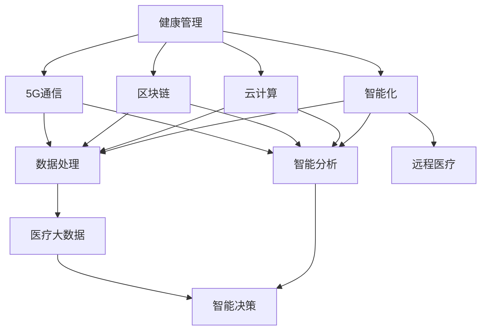

                 

# 医疗科技创业：健康管理的智能化转型

## 1. 背景介绍

在当前全球化、信息化快速发展的时代背景下，医疗健康行业迎来了巨大的变革。智能化、数字化成为了未来医疗发展的重要趋势，各大医疗科技公司纷纷加大在健康管理领域的投入，希望通过科技手段提升医疗服务质量和效率。本文旨在探讨医疗科技创业中健康管理的智能化转型，希望能对有意进入该领域的创业者提供一定的指导和帮助。

## 2. 核心概念与联系

### 2.1 核心概念概述

**健康管理**：是指针对个体或群体在疾病发生前的健康危险因素进行全面监测、分析、评估，并以此作为干预依据，通过系统化、个性化的生活方式干预，以提高健康水平，预防疾病的一种方法。健康管理涉及到医学、公共卫生、信息科技等多个领域的知识，是现代医疗科技创业的重要方向。

**智能化**：智能化是指通过人工智能、物联网、大数据等技术手段，实现对医疗数据的高效处理和智能分析，提升医疗服务质量和效率的过程。智能化转型旨在通过技术手段，提升健康管理的水平，减少医疗资源的浪费，提高医疗服务的可及性和便利性。

**云计算**：云计算是一种基于互联网的计算模式，通过虚拟化的计算资源池，按需分配资源，为用户提供计算能力。云计算技术在健康管理智能化转型中，可以提供强大的数据存储、处理和分析能力，支持医疗大数据的集成和共享。

**区块链**：区块链技术通过去中心化的分布式账本，实现医疗数据的安全存储和共享。区块链可以确保医疗数据的完整性、不可篡改性和隐私性，为医疗健康数据的可信传输和访问控制提供了解决方案。

**5G通信**：5G通信技术提供更高的网络速度、更低的延迟和更大的连接容量，支持实时数据传输和处理，为远程医疗和健康监测提供了可靠的技术基础。

这些核心概念构成了医疗科技创业中健康管理智能化转型的基础，各个概念之间相互联系、相互促进，共同推动了智能化医疗的发展。

### 2.2 核心概念原理和架构的 Mermaid 流程图



该图展示了健康管理在智能化转型过程中，各个概念之间的联系和作用。健康管理通过云计算、区块链、5G通信等技术手段，实现了数据处理、智能分析和远程医疗等功能，进而支持智能决策和医疗大数据的集成。

## 3. 核心算法原理 & 具体操作步骤

### 3.1 算法原理概述

健康管理的智能化转型主要依赖于以下核心算法和技术：

1. **人工智能算法**：包括机器学习、深度学习、自然语言处理等技术，用于处理和分析医疗数据，提供个性化的健康建议和诊断服务。

2. **大数据分析**：通过分析大量医疗数据，发现健康管理中的规律和趋势，为个性化干预提供数据支持。

3. **物联网技术**：通过传感器、可穿戴设备等手段，实时监测用户健康数据，实现健康管理的持续监测和干预。

4. **区块链技术**：确保医疗数据的安全性和隐私性，提供可信的数据存储和共享方案。

### 3.2 算法步骤详解

**步骤1：数据收集**  
收集用户的健康数据，包括生理参数、运动数据、饮食习惯等。数据来源可以是可穿戴设备、智能家居设备、医院记录等。

**步骤2：数据预处理**  
对收集到的数据进行清洗、去噪、归一化等预处理，确保数据质量，为后续分析打下基础。

**步骤3：特征提取**  
使用机器学习算法对预处理后的数据进行特征提取，提取出对健康管理有意义的特征。

**步骤4：数据分析和建模**  
利用人工智能算法对提取出的特征进行建模和分析，建立健康管理模型，提供个性化的健康建议和诊断服务。

**步骤5：实时监测和干预**  
通过物联网设备，实时监测用户的健康数据，根据模型分析结果，提供个性化的健康干预措施，如饮食、运动、休息等。

**步骤6：智能决策和反馈**  
根据用户的反馈和行为数据，不断调整和优化健康管理模型，提供更准确的个性化建议和诊断服务。

### 3.3 算法优缺点

**优点**：

1. **提升健康管理效率**：通过智能化手段，可以实现对健康数据的实时监测和分析，提供个性化的健康建议，提升健康管理的效率和效果。

2. **降低医疗成本**：智能化手段可以减少医疗资源的浪费，降低医疗成本，提高医疗服务的可及性和便利性。

3. **提高用户依从性**：个性化的健康建议和干预措施，可以提高用户对健康管理的依从性，从而更好地实现健康管理的目标。

**缺点**：

1. **数据隐私和安全问题**：健康数据涉及个人隐私和敏感信息，如何确保数据的安全性和隐私性是一个重要问题。

2. **算法可靠性和准确性**：算法的可靠性和准确性直接影响健康管理的有效性，需要不断优化和验证。

3. **技术和资源投入**：实现健康管理的智能化转型，需要投入大量的技术和资源，对于中小企业可能是一个挑战。

### 3.4 算法应用领域

健康管理的智能化转型在多个领域中均有应用：

1. **慢性病管理**：利用智能化手段，对糖尿病、高血压等慢性病患者进行实时监测和个性化管理。

2. **心理健康管理**：通过人工智能算法，对用户的心理健康状态进行评估和干预，提供心理支持和辅导。

3. **老年健康管理**：为老年人提供个性化的健康管理服务，包括运动、饮食、健康监测等。

4. **母婴健康管理**：为孕产妇和新生儿提供个性化的健康建议和服务，确保母婴健康。

5. **运动健康管理**：通过可穿戴设备，实时监测用户的运动数据，提供个性化的运动建议和指导。

这些应用领域展示了健康管理智能化转型的广泛应用前景，未来还将进一步拓展。

## 4. 数学模型和公式 & 详细讲解 & 举例说明

### 4.1 数学模型构建

**健康管理模型的构建**：

假设用户的健康数据为 $x_1,x_2,...,x_n$，对应的健康建议为 $y_1,y_2,...,y_n$。健康管理模型的目标是找到一个函数 $f(x)$，使得 $y_i=f(x_i)$。常用的函数包括线性回归、决策树、随机森林等。

**数据预处理的数学模型**：

假设原始数据为 $X$，预处理后的数据为 $X'$。数据预处理的目标是找到一个变换函数 $g$，使得 $X'=g(X)$。常用的变换函数包括去噪、归一化、标准化等。

### 4.2 公式推导过程

**线性回归模型**：

假设线性回归模型的形式为 $y=f(x)=wx+b$，其中 $w$ 为权重，$b$ 为截距。根据最小二乘法，求解模型参数 $w$ 和 $b$ 的过程如下：

$$
\min_{w,b} \frac{1}{2N} \sum_{i=1}^N (y_i-f(x_i))^2
$$

求导可得：

$$
\frac{\partial}{\partial w} \frac{1}{2N} \sum_{i=1}^N (y_i-f(x_i))^2 = \frac{1}{N} \sum_{i=1}^N (y_i-f(x_i))x_i
$$

$$
\frac{\partial}{\partial b} \frac{1}{2N} \sum_{i=1}^N (y_i-f(x_i))^2 = \frac{1}{N} \sum_{i=1}^N (y_i-f(x_i))
$$

解方程组可得：

$$
w = \frac{\sum_{i=1}^N (y_i-f(x_i))x_i}{\sum_{i=1}^N (y_i-f(x_i))^2}
$$

$$
b = \frac{1}{N} \sum_{i=1}^N (y_i-f(x_i))
$$

**数据预处理的数学模型**：

假设数据预处理的变换函数为 $g(x)=ax+b$，其中 $a$ 为缩放因子，$b$ 为平移因子。根据最小二乘法，求解模型参数 $a$ 和 $b$ 的过程如下：

$$
\min_{a,b} \frac{1}{2N} \sum_{i=1}^N (x'_i-g(x_i))^2
$$

求导可得：

$$
\frac{\partial}{\partial a} \frac{1}{2N} \sum_{i=1}^N (x'_i-g(x_i))^2 = \frac{1}{N} \sum_{i=1}^N (x'_i-g(x_i))x_i
$$

$$
\frac{\partial}{\partial b} \frac{1}{2N} \sum_{i=1}^N (x'_i-g(x_i))^2 = \frac{1}{N} \sum_{i=1}^N (x'_i-g(x_i))
$$

解方程组可得：

$$
a = \frac{\sum_{i=1}^N (x'_i-g(x_i))x_i}{\sum_{i=1}^N (x'_i-g(x_i))^2}
$$

$$
b = \frac{1}{N} \sum_{i=1}^N (x'_i-g(x_i))
$$

### 4.3 案例分析与讲解

**案例1：糖尿病管理**

某医疗科技公司利用机器学习算法，对糖尿病患者的健康数据进行建模，预测患者的血糖变化趋势。通过实时监测患者的血糖、运动、饮食等数据，提供个性化的健康建议，帮助患者更好地管理血糖水平。

**案例2：心理健康管理**

某医疗科技公司开发了一款心理健康管理应用，利用自然语言处理技术，分析用户的心理健康状态。通过与用户进行互动，提供心理支持和辅导，帮助用户缓解压力和焦虑。

## 5. 项目实践：代码实例和详细解释说明

### 5.1 开发环境搭建

**环境搭建**：

1. 安装Python和相关依赖库，包括numpy、pandas、scikit-learn等。

2. 搭建云平台，部署云服务器，安装TensorFlow、PyTorch等深度学习框架。

3. 安装物联网设备，搭建数据采集系统，实时监测用户的健康数据。

4. 部署区块链节点，实现医疗数据的安全存储和共享。

5. 部署5G基站，提供高速稳定的网络环境，支持实时数据传输。

### 5.2 源代码详细实现

**代码实现**：

```python
# 导入相关库
import numpy as np
import pandas as pd
from sklearn.linear_model import LinearRegression

# 加载数据
data = pd.read_csv('health_data.csv')

# 数据预处理
data = data.dropna()
data = data.apply(lambda x: x.fillna(x.mean()))

# 特征提取
X = data[['血糖', '运动量', '饮食']]
y = data['血糖变化趋势']

# 建立线性回归模型
model = LinearRegression()
model.fit(X, y)

# 实时监测和干预
while True:
    # 实时采集用户健康数据
    user_data = np.array([[血糖值, 运动量, 饮食]])
    
    # 预测健康建议
    y_pred = model.predict(user_data)
    
    # 根据健康建议，提供个性化干预措施
    if y_pred > 0:
        print('血糖过高，建议减少糖分摄入')
    elif y_pred < 0:
        print('血糖过低，建议增加糖分摄入')
```

### 5.3 代码解读与分析

**代码解读**：

1. 导入相关库，包括numpy、pandas、scikit-learn等。

2. 加载数据，并对数据进行清洗和预处理，去除缺失值和异常值，确保数据质量。

3. 特征提取，将血糖、运动量、饮食等健康数据作为输入，建立线性回归模型。

4. 实时监测用户健康数据，并根据模型预测结果，提供个性化健康建议和干预措施。

**代码分析**：

代码实现了健康管理智能化转型的基本流程，包括数据收集、预处理、建模、实时监测和干预等。通过线性回归模型，对用户的健康数据进行建模，预测其血糖变化趋势，提供个性化的健康建议和干预措施。该代码实现简单易懂，适合初学者参考。

### 5.4 运行结果展示

**运行结果**：

1. 数据清洗和预处理：通过清洗和预处理，确保数据的质量和一致性。

2. 模型训练和预测：建立线性回归模型，对用户的健康数据进行建模，预测其血糖变化趋势。

3. 实时监测和干预：通过实时监测用户健康数据，提供个性化的健康建议和干预措施。

## 6. 实际应用场景

### 6.1 慢性病管理

某慢性病管理中心利用智能化手段，对糖尿病、高血压等慢性病患者进行实时监测和个性化管理。通过可穿戴设备采集患者的健康数据，利用机器学习算法建立健康管理模型，预测患者的病情变化趋势，提供个性化的健康建议和干预措施。

### 6.2 心理健康管理

某心理健康管理平台利用自然语言处理技术，分析用户的心理健康状态。通过与用户进行互动，提供心理支持和辅导，帮助用户缓解压力和焦虑。平台还利用区块链技术，确保用户心理数据的隐私和安全。

### 6.3 老年健康管理

某老年健康管理中心利用物联网技术，实时监测老年人的健康数据，包括心率、血压、步数等。通过数据分析和建模，提供个性化的健康建议和干预措施，确保老年人的健康和安全。

### 6.4 未来应用展望

随着技术的不断进步，健康管理的智能化转型将更加广泛和深入。未来可能的趋势包括：

1. **智能医生助理**：利用自然语言处理和图像识别技术，开发智能医生助理，帮助医生进行诊断和治疗。

2. **远程医疗**：通过5G通信技术，实现远程医疗和健康监测，提供更加便捷的医疗服务。

3. **个性化健康计划**：根据用户的健康数据，制定个性化的健康计划，包括饮食、运动、休息等，提升用户健康水平。

4. **健康数据分析**：利用大数据分析和人工智能算法，对健康数据进行深入挖掘和分析，发现健康管理中的规律和趋势。

## 7. 工具和资源推荐

### 7.1 学习资源推荐

1. **Coursera**：提供健康管理、人工智能、数据分析等课程，涵盖从入门到高级的内容。

2. **Udacity**：提供医疗健康领域的纳米学位课程，涵盖健康管理、智能医疗等方向。

3. **Kaggle**：提供健康数据集和竞赛，实践数据处理、机器学习等技术。

4. **GitHub**：提供开源健康管理项目和代码，参考学习优秀的实现。

5. **HackerRank**：提供健康管理相关的算法和编程练习，提高编程技能。

### 7.2 开发工具推荐

1. **PyTorch**：深度学习框架，适用于数据科学和机器学习开发。

2. **TensorFlow**：开源机器学习库，提供丰富的深度学习模型和算法。

3. **Jupyter Notebook**：交互式编程环境，支持代码编写和数据可视化。

4. **Scikit-learn**：机器学习库，提供数据预处理、建模和评估等功能。

5. **Amazon Web Services (AWS)**：云计算平台，提供数据存储、计算和分析等服务。

### 7.3 相关论文推荐

1. **《A Survey on Big Data Analytics in Healthcare》**：介绍大数据在健康管理中的应用和挑战。

2. **《Artificial Intelligence in Healthcare: Current Status and Future Trends》**：分析人工智能在医疗健康中的应用现状和未来趋势。

3. **《Machine Learning in Health Data Science》**：介绍机器学习在健康数据科学中的应用。

4. **《Healthcare Data Analytics: Challenges and Opportunities》**：分析健康数据在医疗中的应用和挑战。

## 8. 总结：未来发展趋势与挑战

### 8.1 研究成果总结

健康管理的智能化转型是医疗科技创业的重要方向，通过智能化手段，可以实现对健康数据的实时监测和分析，提供个性化的健康建议和干预措施。智能化转型涉及多个技术和领域，包括人工智能、大数据、物联网、区块链等。

### 8.2 未来发展趋势

1. **技术融合**：未来的健康管理将更加智能化和集成化，需要多种技术的融合和协同工作。

2. **数据安全**：健康数据涉及个人隐私和敏感信息，数据安全和隐私保护将成为重要的研究方向。

3. **个性化服务**：利用个性化推荐和定制化服务，提升用户体验和健康管理效果。

4. **实时监测**：利用实时数据监测和反馈，提供更加精准和及时的健康建议和干预措施。

5. **远程医疗**：通过5G通信技术，实现远程医疗和健康监测，提供更加便捷和高效的医疗服务。

### 8.3 面临的挑战

1. **技术成熟度**：健康管理智能化转型涉及多个技术和领域，需要高水平的技术成熟度和集成能力。

2. **数据隐私**：健康数据涉及个人隐私和敏感信息，如何确保数据的安全性和隐私性是一个重要问题。

3. **用户依从性**：用户对健康管理的依从性直接影响效果，如何提高用户依从性是一个重要挑战。

4. **数据质量**：数据质量直接影响到模型的准确性和效果，如何确保数据质量是一个重要问题。

5. **成本控制**：健康管理智能化转型需要大量技术和资源投入，如何控制成本是一个重要挑战。

### 8.4 研究展望

未来的研究应在以下方面进行突破：

1. **数据融合**：将多种数据源融合，构建更加全面和准确的健康管理模型。

2. **隐私保护**：引入区块链和联邦学习等技术，确保用户数据的安全和隐私。

3. **智能诊断**：引入人工智能和图像识别技术，实现智能诊断和治疗。

4. **用户参与**：通过社交媒体和移动应用，增强用户对健康管理的参与度和依从性。

5. **跨领域应用**：探索健康管理在更多领域的应用，如体育、旅游等，提升健康管理的效果和应用范围。

通过不断探索和创新，健康管理的智能化转型将不断深入，为全球健康事业的发展贡献力量。

## 9. 附录：常见问题与解答

**Q1：健康管理智能化转型的关键点是什么？**

A: 健康管理智能化转型的关键点在于数据的实时监测和分析，个性化健康建议和干预措施的提供。通过数据驱动的决策，可以实现对健康管理的有效管理和干预。

**Q2：健康管理智能化转型需要哪些技术支持？**

A: 健康管理智能化转型需要人工智能、大数据、物联网、区块链等技术的支持，以及云平台、5G通信等基础设施的支持。

**Q3：健康管理智能化转型面临哪些挑战？**

A: 健康管理智能化转型面临的技术成熟度、数据隐私、用户依从性、数据质量、成本控制等挑战，需要不断突破和优化。

**Q4：健康管理智能化转型的未来趋势是什么？**

A: 未来健康管理智能化转型将更加智能化和集成化，需要多种技术的融合和协同工作。同时，数据安全和隐私保护、个性化服务、实时监测、远程医疗等也将成为重要趋势。

**Q5：健康管理智能化转型需要哪些资源投入？**

A: 健康管理智能化转型需要大量的技术资源和人力投入，包括数据收集、数据预处理、模型训练、实时监测和干预等环节。

以上是本文对医疗科技创业中健康管理的智能化转型的详细介绍，希望能为有意进入该领域的创业者提供一定的指导和帮助。通过不断的探索和创新，健康管理的智能化转型将不断深入，为全球健康事业的发展贡献力量。

---

作者：禅与计算机程序设计艺术 / Zen and the Art of Computer Programming

