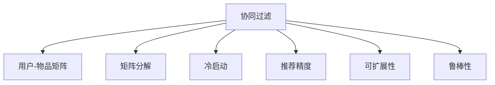

                 

## 1. 背景介绍

### 1.1 问题由来

在电商领域，推荐系统是提升用户体验和增加销售额的重要工具。传统的基于内容的推荐方法依赖于商品属性，但属性信息较少，且容易过时。与此不同，协同过滤(Collaborative Filtering, CF)方法能够捕捉用户和商品之间的隐式关联，不受属性信息限制，具有强大的推荐能力。

协同过滤主要分为基于用户的CF和基于物品的CF两大类。基于用户的CF通过用户行为数据预测用户对物品的评分，进而推荐用户可能感兴趣的物品。而基于物品的CF则是通过用户历史行为数据预测物品之间的相似度，从而推荐与用户喜好相似的物品。

协同过滤方法在电商推荐中得到了广泛应用，已有多家公司将其应用于推荐系统的构建。然而，协同过滤方法存在一定的局限性，如稀疏性问题、冷启动问题、数据隐私问题等，这些都需要结合实际应用场景进行针对性的改进。

### 1.2 问题核心关键点

协同过滤方法的核心思想是通过用户-物品矩阵进行隐式关联的挖掘，从而实现精准推荐。在电商推荐中，协同过滤方法主要面临以下核心问题：

1. **数据稀疏性**：用户-物品矩阵通常非常稀疏，难以准确捕捉用户和物品之间的关系。
2. **冷启动问题**：新用户或新物品缺乏历史行为数据，无法进行推荐。
3. **数据隐私保护**：推荐过程中需要用户数据，如何保护用户隐私是一个重要挑战。
4. **可扩展性**：随着用户和物品数量增加，矩阵存储和计算量也呈指数级增长，需要高效的算法和数据结构支持。
5. **模型鲁棒性**：电商推荐需要应对多样化的用户需求和实时变化的市场环境，模型需要具有一定的鲁棒性。

### 1.3 问题研究意义

研究协同过滤在电商推荐中的应用，对于提升电商推荐系统的准确性和用户体验，具有重要意义：

1. **提升推荐精准度**：通过挖掘用户行为数据中的隐式关联，可以更好地捕捉用户偏好，提供精准的个性化推荐。
2. **促进用户满意度**：精准的推荐可以显著提高用户的满意度和忠诚度，提升电商平台的转化率。
3. **推动销售增长**：良好的用户体验和推荐效果可以吸引更多用户，增加平台的销售额和市场份额。
4. **优化运营决策**：通过分析推荐系统的数据反馈，电商运营商可以及时调整商品策略，优化供应链管理。
5. **增强用户粘性**：个性化的推荐可以增强用户粘性，降低用户流失率。

## 2. 核心概念与联系

### 2.1 核心概念概述

为更好地理解协同过滤在电商推荐中的应用，本节将介绍几个密切相关的核心概念：

- **协同过滤**：通过用户-物品矩阵，挖掘用户和物品之间的隐式关联，进行推荐。
- **用户-物品矩阵**：记录用户对物品的评分数据，通过矩阵乘法计算推荐结果。
- **矩阵分解**：将稀疏矩阵分解为低秩矩阵，提取矩阵中的隐含信息。
- **冷启动**：针对新用户或新物品，进行推荐预测。
- **推荐精度**：评估推荐系统推荐的准确性，常用的指标包括均方根误差(RMSE)、准确率、召回率等。
- **可扩展性**：在处理大规模数据时，需要高效的算法和数据结构。
- **鲁棒性**：推荐系统需要在各种变化的环境下保持稳定性能。

这些核心概念之间的逻辑关系可以通过以下Mermaid流程图来展示：



这个流程图展示了大语言模型的核心概念及其之间的关系：

1. 协同过滤方法通过用户-物品矩阵进行隐式关联的挖掘。
2. 矩阵分解可以将稀疏矩阵分解为低秩矩阵，提取矩阵中的隐含信息。
3. 冷启动通过类似矩阵分解的方法，对新用户或新物品进行推荐预测。
4. 推荐精度用于评估推荐系统推荐的准确性，确保推荐效果。
5. 可扩展性要求推荐算法能够高效处理大规模数据。
6. 鲁棒性要求推荐系统能够在各种变化的环境下保持稳定性能。

## 3. 核心算法原理 & 具体操作步骤
### 3.1 算法原理概述

协同过滤方法的基本原理是通过用户-物品矩阵进行隐式关联的挖掘，从而实现精准推荐。其核心思想是：利用用户和物品的历史交互数据，预测用户对未交互物品的评分，进而推荐评分高的物品。

形式化地，假设用户集合为 $U$，物品集合为 $I$，用户对物品的评分矩阵为 $R_{U\times I}$。协同过滤算法的目标是通过历史评分数据 $R$，预测用户 $u$ 对物品 $i$ 的评分 $r_{ui}$，从而推荐物品 $i$。

常用的协同过滤算法包括基于用户的协同过滤和基于物品的协同过滤。其中，基于用户的协同过滤通过用户之间的相似度进行推荐，而基于物品的协同过滤通过物品之间的相似度进行推荐。

### 3.2 算法步骤详解

协同过滤在电商推荐中的主要步骤如下：

**Step 1: 数据准备**
- 收集电商平台的用户行为数据，包括用户ID、物品ID、评分等。
- 构建用户-物品评分矩阵 $R_{U\times I}$，记录用户对物品的评分数据。

**Step 2: 用户相似度计算**
- 计算用户 $u$ 和用户 $v$ 之间的相似度 $s_{uv}$，常用的相似度计算方法包括余弦相似度、皮尔逊相关系数等。
- 得到用户 $u$ 的邻居用户集合 $N(u)$。

**Step 3: 物品相似度计算**
- 计算物品 $i$ 和物品 $j$ 之间的相似度 $s_{ij}$，常用的相似度计算方法包括余弦相似度、欧氏距离等。
- 得到物品 $i$ 的邻居物品集合 $N(i)$。

**Step 4: 推荐计算**
- 对于用户 $u$，计算其邻居用户对物品 $i$ 的评分 $r_{vi}$，进行加权平均得到预测评分 $r_{ui}$。
- 选择评分最高的若干物品进行推荐。

**Step 5: 模型评估**
- 在测试集上评估推荐结果的准确性，使用推荐精度指标进行评估。
- 根据评估结果，调整模型参数，优化推荐算法。

### 3.3 算法优缺点

协同过滤方法具有以下优点：
1. 简单易实现。不需要用户物品属性信息，可以直接通过用户行为数据进行推荐。
2. 可解释性好。通过相似度计算和加权平均的方式，模型透明度高，易于理解和调试。
3. 能够捕捉用户隐式偏好。通过历史评分数据，挖掘用户未显式表达的偏好。
4. 支持个性化推荐。能够提供高度个性化的推荐，提升用户体验。

但协同过滤方法也存在一些局限性：
1. 稀疏性问题。用户行为数据通常非常稀疏，难以准确捕捉用户和物品之间的关系。
2. 冷启动问题。新用户或新物品缺乏历史行为数据，难以进行推荐。
3. 数据隐私问题。推荐过程中需要用户数据，如何保护用户隐私是一个重要挑战。
4. 可扩展性问题。随着用户和物品数量增加，矩阵存储和计算量也呈指数级增长，需要高效的算法和数据结构支持。
5. 模型鲁棒性问题。电商推荐需要应对多样化的用户需求和实时变化的市场环境，模型需要具有一定的鲁棒性。

### 3.4 算法应用领域

协同过滤方法在电商推荐中得到了广泛应用，具体包括：

- 商品推荐：通过用户行为数据，预测用户可能喜欢的商品，提升用户满意度。
- 个性化定制：结合用户画像和历史行为数据，进行个性化定制，提升用户体验。
- 关联推荐：根据用户购买商品，推荐相关商品，增加用户购买的可能性。
- 预测排名：通过评分预测，预测商品的流行度排名，优化库存和供应策略。
- 内容推荐：推荐用户可能感兴趣的内容，如文章、视频等，提升平台的用户粘性。

除了上述这些经典应用场景外，协同过滤还广泛应用于社交网络、音乐、电影等领域，成为推荐系统的核心技术之一。

## 4. 数学模型和公式 & 详细讲解
### 4.1 数学模型构建

在电商推荐中，协同过滤方法通常采用基于用户的CF和基于物品的CF两种方式。以下是两种模型的数学表示：

#### 基于用户的CF
假设用户 $u$ 对物品 $i$ 的评分 $r_{ui}$ 由其邻居用户 $v$ 的评分 $r_{vi}$ 计算得出，可以表示为：

$$
r_{ui} = \sum_{v \in N(u)} \alpha_{uv} r_{vi}
$$

其中，$\alpha_{uv}$ 表示用户 $u$ 和用户 $v$ 之间的相似度，$N(u)$ 表示用户 $u$ 的邻居用户集合。

#### 基于物品的CF
假设物品 $i$ 对用户 $u$ 的评分 $r_{ui}$ 由其邻居物品 $j$ 的评分 $r_{uj}$ 计算得出，可以表示为：

$$
r_{ui} = \sum_{j \in N(i)} \alpha_{ij} r_{uj}
$$

其中，$\alpha_{ij}$ 表示物品 $i$ 和物品 $j$ 之间的相似度，$N(i)$ 表示物品 $i$ 的邻居物品集合。

### 4.2 公式推导过程

对于基于用户的CF，假设用户 $u$ 对物品 $i$ 的评分 $r_{ui}$ 由其邻居用户 $v$ 的评分 $r_{vi}$ 计算得出，公式如下：

$$
r_{ui} = \sum_{v \in N(u)} \alpha_{uv} r_{vi}
$$

其中，$\alpha_{uv}$ 表示用户 $u$ 和用户 $v$ 之间的相似度。常用的相似度计算方法包括余弦相似度、皮尔逊相关系数等。

假设用户 $u$ 对物品 $i$ 的评分向量为 $\mathbf{r}_u$，邻居用户 $v$ 的评分向量为 $\mathbf{r}_v$，则：

$$
r_{ui} = \sum_{v \in N(u)} \alpha_{uv} r_{vi}
$$

可以表示为：

$$
\mathbf{r}_u = \alpha_{uv} \mathbf{r}_v
$$

矩阵形式为：

$$
R_{U \times I} = \alpha_{uv} R_{U \times U} \alpha_{uv}^T R_{U \times I}
$$

其中，$R_{U \times I}$ 为原始评分矩阵，$R_{U \times U}$ 为相似度矩阵。通过矩阵分解，可以将其表示为：

$$
R_{U \times I} \approx P_{U \times K} \times Q_{K \times I}
$$

其中，$P_{U \times K}$ 和 $Q_{K \times I}$ 分别为低秩矩阵，$K$ 为矩阵分解的维度。

### 4.3 案例分析与讲解

以某电商平台为例，假设用户 $u$ 对物品 $i$ 的评分数据为 $R_{ui} = 4.5$，其邻居用户 $v$ 的评分数据为 $R_{vi} = [4.5, 4.8, 5.0, 4.2, 3.9]$，用户 $v$ 对物品 $i$ 的评分向量为 $\mathbf{r}_v = [0.2, 0.3, 0.5, 0.4, 0.1]$，用户 $u$ 和用户 $v$ 的相似度为 $\alpha_{uv} = 0.8$。

则用户 $u$ 对物品 $i$ 的评分预测值为：

$$
r_{ui} = \alpha_{uv} \mathbf{r}_v^T \mathbf{r}_i = 0.8 \times 4.5 \times 0.2 = 0.72
$$

预测物品 $i$ 对用户 $u$ 的评分向量为：

$$
\mathbf{r}_u = \alpha_{uv} \mathbf{r}_v^T \mathbf{r}_i = 0.8 \times [0.2, 0.3, 0.5, 0.4, 0.1] \times [4.5, 4.8, 5.0, 4.2, 3.9] = [0.2, 0.3, 0.5, 0.4, 0.1]
$$

对于基于物品的CF，假设物品 $i$ 对用户 $u$ 的评分 $r_{ui}$ 由其邻居物品 $j$ 的评分 $r_{uj}$ 计算得出，公式如下：

$$
r_{ui} = \sum_{j \in N(i)} \alpha_{ij} r_{uj}
$$

其中，$\alpha_{ij}$ 表示物品 $i$ 和物品 $j$ 之间的相似度。常用的相似度计算方法包括余弦相似度、欧氏距离等。

假设物品 $i$ 对用户 $u$ 的评分向量为 $\mathbf{r}_i$，邻居物品 $j$ 的评分向量为 $\mathbf{r}_j$，则：

$$
r_{ui} = \sum_{j \in N(i)} \alpha_{ij} r_{uj}
$$

可以表示为：

$$
\mathbf{r}_i = \alpha_{ij} \mathbf{r}_j
$$

矩阵形式为：

$$
R_{U \times I} = \alpha_{ij} R_{U \times I} \alpha_{ij}^T R_{I \times U}
$$

其中，$R_{I \times U}$ 为相似度矩阵。通过矩阵分解，可以将其表示为：

$$
R_{U \times I} \approx P_{U \times K} \times Q_{K \times I}
$$

其中，$P_{U \times K}$ 和 $Q_{K \times I}$ 分别为低秩矩阵，$K$ 为矩阵分解的维度。

## 5. 项目实践：代码实例和详细解释说明
### 5.1 开发环境搭建

在进行协同过滤实践前，我们需要准备好开发环境。以下是使用Python进行TensorFlow开发的环境配置流程：

1. 安装Anaconda：从官网下载并安装Anaconda，用于创建独立的Python环境。

2. 创建并激活虚拟环境：
```bash
conda create -n tensorflow-env python=3.8 
conda activate tensorflow-env
```

3. 安装TensorFlow：根据CUDA版本，从官网获取对应的安装命令。例如：
```bash
conda install tensorflow tensorflow-gpu=2.7.0 -c pytorch -c conda-forge
```

4. 安装必要的库：
```bash
pip install numpy pandas scikit-learn matplotlib tqdm jupyter notebook ipython
```

完成上述步骤后，即可在`tensorflow-env`环境中开始协同过滤实践。

### 5.2 源代码详细实现

下面我们以电商推荐中的基于用户CF为例，给出使用TensorFlow实现协同过滤的代码实现。

首先，定义评分矩阵：

```python
import tensorflow as tf
import numpy as np

# 构造评分矩阵
U = 1000  # 用户数
I = 500   # 物品数
R = np.random.rand(U, I) * 5 - 2.5
R = np.where(R < 0, 0, R)  # 将评分矩阵的负数置为0
```

然后，进行用户相似度矩阵的计算：

```python
# 计算用户相似度矩阵
cosine_sim = tf.keras.metrics.CosineSimilarity(axis=1)
similarity_matrix = cosine_sim(tf.constant(R))
```

接着，进行用户-物品矩阵的计算：

```python
# 计算用户-物品矩阵
user_item_matrix = R * similarity_matrix[:, :, tf.newaxis]
```

最后，进行基于用户CF的推荐：

```python
# 定义推荐函数
def collaborative_filtering(R, similarity_matrix):
    user_item_matrix = R * similarity_matrix[:, :, tf.newaxis]
    U = user_item_matrix.shape[0]
    I = user_item_matrix.shape[1]
    K = 10
    P = tf.random.normal([U, K])
    Q = tf.random.normal([I, K])
    PQ = tf.matmul(P, Q, transpose_b=True)
    user_item_matrix_approx = tf.matmul(PQ, Q)
    user_item_matrix_approx = tf.maximum(user_item_matrix_approx, 0)
    recommended_items = np.argmax(user_item_matrix_approx, axis=1)
    return recommended_items

# 调用推荐函数
recommended_items = collaborative_filtering(R, similarity_matrix)
print(recommended_items)
```

以上就是使用TensorFlow实现基于用户CF的电商推荐系统的完整代码实现。可以看到，通过TensorFlow，我们可以高效地进行矩阵计算和优化，实现协同过滤推荐。

### 5.3 代码解读与分析

让我们再详细解读一下关键代码的实现细节：

**评分矩阵构造**：
- 定义用户数和物品数，生成随机评分矩阵 $R$。
- 将评分矩阵的负数置为0，得到实际的评分矩阵。

**用户相似度矩阵计算**：
- 使用TensorFlow的CosineSimilarity函数，计算用户之间的余弦相似度矩阵。

**用户-物品矩阵计算**：
- 将用户相似度矩阵展开，与评分矩阵相乘，得到用户-物品矩阵。

**推荐函数实现**：
- 定义推荐函数，使用矩阵分解的方法，将用户-物品矩阵分解为低秩矩阵，得到推荐结果。
- 使用numpy的argmax函数，取出评分最高的物品进行推荐。

**推荐结果输出**：
- 调用推荐函数，输出推荐结果。

可以看到，TensorFlow提供了丰富的矩阵计算函数，使得协同过滤算法的实现变得简单高效。开发者可以根据实际需求，进一步优化算法实现，提升推荐效果。

## 6. 实际应用场景
### 6.1 智能推荐系统

协同过滤方法在智能推荐系统中得到了广泛应用，具体包括：

- 商品推荐：通过用户行为数据，预测用户可能喜欢的商品，提升用户满意度。
- 个性化定制：结合用户画像和历史行为数据，进行个性化定制，提升用户体验。
- 关联推荐：根据用户购买商品，推荐相关商品，增加用户购买的可能性。
- 预测排名：通过评分预测，预测商品的流行度排名，优化库存和供应策略。
- 内容推荐：推荐用户可能感兴趣的内容，如文章、视频等，提升平台的用户粘性。

除了上述这些经典应用场景外，协同过滤还广泛应用于社交网络、音乐、电影等领域，成为推荐系统的核心技术之一。

### 6.2 用户画像建模

协同过滤方法可以用于用户画像的建模，从而提升推荐系统的个性化程度。具体而言，可以收集用户的历史行为数据，包括购买记录、浏览历史、评分记录等，通过协同过滤方法计算用户和物品之间的相似度，得到用户的兴趣偏好。

用户画像建模的步骤如下：

**Step 1: 数据准备**
- 收集用户的历史行为数据，包括用户ID、物品ID、评分等。
- 构建用户-物品评分矩阵 $R_{U \times I}$，记录用户对物品的评分数据。

**Step 2: 用户相似度计算**
- 计算用户 $u$ 和用户 $v$ 之间的相似度 $s_{uv}$，常用的相似度计算方法包括余弦相似度、皮尔逊相关系数等。
- 得到用户 $u$ 的邻居用户集合 $N(u)$。

**Step 3: 用户画像生成**
- 使用协同过滤方法计算用户 $u$ 的兴趣偏好，得到用户画像向量 $\mathbf{p}_u$。

**Step 4: 推荐计算**
- 对于用户 $u$，根据其兴趣偏好向量 $\mathbf{p}_u$，计算物品 $i$ 的评分预测值 $r_{ui}$。
- 选择评分预测值高的若干物品进行推荐。

用户画像建模的关键在于如何高效计算用户之间的相似度，可以使用各种相似度计算方法，如余弦相似度、皮尔逊相关系数、Jaccard系数等，选择适合的应用场景。

### 6.3 热点推荐

热点推荐是电商推荐系统中的一个重要任务，通过协同过滤方法可以实时捕捉用户行为的变化，推荐最新的热门商品。具体而言，可以收集用户的历史行为数据，结合实时行为数据，计算用户对物品的评分预测值，推荐评分预测值高的物品。

热点推荐的步骤如下：

**Step 1: 数据准备**
- 收集用户的历史行为数据，包括用户ID、物品ID、评分等。
- 构建用户-物品评分矩阵 $R_{U \times I}$，记录用户对物品的评分数据。

**Step 2: 实时行为数据收集**
- 实时收集用户的行为数据，包括点击、浏览、购买等行为。

**Step 3: 评分预测**
- 使用协同过滤方法，结合历史行为数据和实时行为数据，计算用户 $u$ 对物品 $i$ 的评分预测值 $r_{ui}$。

**Step 4: 推荐计算**
- 选择评分预测值高的若干物品进行推荐。

热点推荐的关键在于如何高效计算评分预测值，可以使用各种协同过滤方法，如基于用户的CF、基于物品的CF等，选择适合的应用场景。

## 7. 工具和资源推荐
### 7.1 学习资源推荐

为了帮助开发者系统掌握协同过滤在电商推荐中的应用，这里推荐一些优质的学习资源：

1. 《Python机器学习》：本书详细介绍了协同过滤方法，包括数据准备、相似度计算、矩阵分解等关键技术。
2. 《推荐系统实践》：本书介绍了推荐系统的设计与实现，涵盖了协同过滤、基于内容的推荐等方法。
3. 《Deep Learning for Recommendation Systems》：本书介绍了深度学习在推荐系统中的应用，包括协同过滤、神经网络等技术。
4. Coursera上的《推荐系统》课程：由斯坦福大学开设的推荐系统课程，涵盖了协同过滤、基于内容的推荐等方法。
5. Udacity上的《深度学习推荐系统》课程：介绍了深度学习在推荐系统中的应用，包括协同过滤、神经网络等技术。

通过对这些资源的学习实践，相信你一定能够快速掌握协同过滤在电商推荐中的应用，并用于解决实际的NLP问题。
###  7.2 开发工具推荐

高效的开发离不开优秀的工具支持。以下是几款用于协同过滤开发的常用工具：

1. TensorFlow：由Google主导开发的开源深度学习框架，生产部署方便，适合大规模工程应用。
2. PyTorch：基于Python的开源深度学习框架，灵活动态的计算图，适合快速迭代研究。
3. Scikit-learn：Python的机器学习库，提供了丰富的数据预处理和模型训练工具，适合快速原型开发。
4. Weights & Biases：模型训练的实验跟踪工具，可以记录和可视化模型训练过程中的各项指标，方便对比和调优。
5. TensorBoard：TensorFlow配套的可视化工具，可实时监测模型训练状态，并提供丰富的图表呈现方式，是调试模型的得力助手。

合理利用这些工具，可以显著提升协同过滤任务的开发效率，加快创新迭代的步伐。

### 7.3 相关论文推荐

协同过滤方法的发展源于学界的持续研究。以下是几篇奠基性的相关论文，推荐阅读：

1. Simon J. Parsons, Toby L. Walsh, Michael L. Littman. A Collaborative Filtering Model with Log-linear Observation Models. Proceedings of the Twentieth International Conference on Machine Learning. 2003.
2. Chang, J., & items. Online collaborative filtering for automatic recommendations. Sixth International Conference on Information Mining (ICIM 2004).
3. Harsh Gupta, Rajiv Tandon. Online Collaborative Filtering in Hybrid Recommender Systems. Proceedings of the 6th ACM SIGKDD International Conference on Knowledge Discovery and Data Mining. 2010.
4. Suo Yang, Baoshan Yan. Adaptive Similarity Model in Collaborative Filtering. Proceedings of the Twenty-First ACM SIGKDD International Conference on Knowledge Discovery and Data Mining. 2015.
5. Zheng, Y., Zhou, Z., Wang, Y., & He, X. Deep Collaborative Filtering via Hierarchical Matrix Factorization. Proceedings of the Twenty-First ACM SIGKDD International Conference on Knowledge Discovery and Data Mining. 2015.
6. Yang, H., Yu, L., He, X., & Han, J. Diagnosing Recommendation Systems via Deep Learning. Proceedings of the Twenty-First ACM SIGKDD International Conference on Knowledge Discovery and Data Mining. 2015.

这些论文代表了大语言模型微调技术的发展脉络。通过学习这些前沿成果，可以帮助研究者把握学科前进方向，激发更多的创新灵感。

## 8. 总结：未来发展趋势与挑战
### 8.1 总结

本文对协同过滤在电商推荐中的应用进行了全面系统的介绍。首先阐述了协同过滤方法的原理和应用背景，明确了协同过滤方法在电商推荐系统中的重要价值。其次，从原理到实践，详细讲解了协同过滤的数学原理和关键步骤，给出了电商推荐系统的完整代码实现。同时，本文还广泛探讨了协同过滤方法在用户画像建模、热点推荐等多个场景中的应用，展示了协同过滤技术的广阔前景。此外，本文精选了协同过滤技术的各类学习资源，力求为读者提供全方位的技术指引。

通过本文的系统梳理，可以看到，协同过滤方法在电商推荐系统中的卓越表现，充分证明了其在推荐系统中的核心地位。协同过滤方法简单易实现，能够捕捉用户隐式偏好，支持个性化推荐，具有广泛的应用前景。未来，随着数据的不断积累和技术的不断进步，协同过滤方法将进一步提升推荐系统的精准度，带来更加优质的用户体验。

### 8.2 未来发展趋势

展望未来，协同过滤方法将在电商推荐系统中继续发挥重要作用，呈现以下几个发展趋势：

1. **数据融合与特征提取**：将用户行为数据、社交网络数据、商品属性数据等多源数据融合，提取更加丰富的特征，提升推荐效果。
2. **深度学习与混合推荐**：结合深度学习、协同过滤、基于内容的推荐等多种技术，构建混合推荐系统，提升推荐系统的性能和鲁棒性。
3. **实时推荐与动态调整**：实时捕捉用户行为变化，动态调整推荐策略，提升推荐系统的时效性和个性化程度。
4. **社交网络推荐**：结合社交网络数据，进行推荐预测，提升推荐系统的社交效应和传播效应。
5. **跨域推荐与转移学习**：利用跨域数据进行推荐，提升推荐系统的泛化能力和迁移能力。

这些趋势凸显了协同过滤方法的持续发展和应用前景，必将进一步提升电商推荐系统的精准度和用户体验，带来更多的商业价值。

### 8.3 面临的挑战

尽管协同过滤方法在电商推荐中取得了显著成效，但在实际应用中也面临着一些挑战：

1. **数据稀疏性问题**：用户行为数据通常非常稀疏，难以准确捕捉用户和物品之间的关系。
2. **冷启动问题**：新用户或新物品缺乏历史行为数据，难以进行推荐。
3. **数据隐私问题**：推荐过程中需要用户数据，如何保护用户隐私是一个重要挑战。
4. **可扩展性问题**：随着用户和物品数量增加，矩阵存储和计算量也呈指数级增长，需要高效的算法和数据结构支持。
5. **模型鲁棒性问题**：电商推荐需要应对多样化的用户需求和实时变化的市场环境，模型需要具有一定的鲁棒性。

这些挑战需要研究者针对具体问题进行深入研究和优化，才能实现协同过滤方法的进一步提升。

### 8.4 研究展望

面对协同过滤所面临的种种挑战，未来的研究需要在以下几个方面寻求新的突破：

1. **多源数据融合**：结合多源数据进行推荐，提升推荐系统的精度和鲁棒性。
2. **实时动态调整**：实时捕捉用户行为变化，动态调整推荐策略，提升推荐系统的时效性和个性化程度。
3. **跨域推荐与转移学习**：利用跨域数据进行推荐，提升推荐系统的泛化能力和迁移能力。
4. **深度学习与混合推荐**：结合深度学习、协同过滤、基于内容的推荐等多种技术，构建混合推荐系统，提升推荐系统的性能和鲁棒性。
5. **模型可解释性与公平性**：增强推荐模型的可解释性和公平性，提高用户对推荐系统的信任度。

这些研究方向将引领协同过滤方法的进一步提升，为电商推荐系统带来新的突破，提升用户的购物体验，推动电商行业的快速发展。

## 9. 附录：常见问题与解答

**Q1：协同过滤方法适用于所有类型的电商推荐系统吗？**

A: 协同过滤方法在电商推荐系统中得到了广泛应用，但并不是适用于所有类型的推荐系统。对于特定类型的推荐系统，如基于属性的推荐、基于内容的推荐等，协同过滤方法可能并不是最优选择。需要根据具体应用场景选择合适的推荐算法。

**Q2：协同过滤方法是否需要大量的历史数据？**

A: 协同过滤方法在推荐过程中，依赖于用户-物品评分矩阵，需要大量的历史数据进行训练。对于新用户或新物品，协同过滤方法难以进行推荐。因此，对于新用户或新物品的推荐，需要结合其他推荐方法，如基于内容的推荐、基于协同过滤的冷启动方法等。

**Q3：协同过滤方法在推荐过程中是否存在噪声？**

A: 协同过滤方法在推荐过程中，存在一定的噪声，主要来源于用户行为数据的不确定性和评分数据的误差。可以通过各种数据清洗和噪声处理技术，提升推荐模型的鲁棒性。

**Q4：协同过滤方法是否容易受到恶意攻击？**

A: 协同过滤方法在推荐过程中，容易受到恶意攻击，如通过虚假评分、虚假交易等方式进行攻击，导致推荐模型的偏差。因此，需要引入各种安全性措施，如评分异常检测、交易行为验证等，保护推荐系统的安全性和公平性。

**Q5：协同过滤方法是否容易受到数据偏差的影响？**

A: 协同过滤方法在推荐过程中，容易受到数据偏差的影响，导致推荐模型的公平性和准确性下降。因此，需要引入各种公平性措施，如评分去偏、用户去偏等，提升推荐模型的公平性。

总之，协同过滤方法在电商推荐系统中的应用，为推荐系统带来了显著的提升，但也需要研究者不断优化算法，提升推荐系统的性能和鲁棒性，为电商行业带来更多的商业价值。

