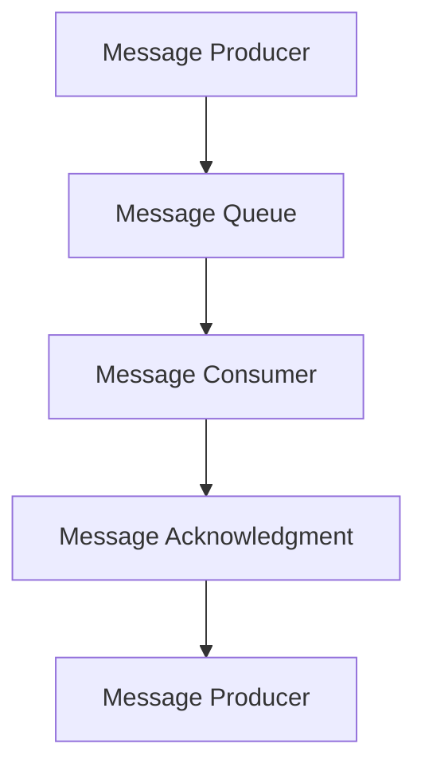

# Exactly-once语义在智能安防领域的应用与优化方法

作者：禅与计算机程序设计艺术 / Zen and the Art of Computer Programming

## 1. 背景介绍

### 1.1 问题的由来

随着智能安防系统的广泛应用，对数据可靠性和一致性的要求越来越高。在智能安防领域，数据的一致性通常意味着系统在处理数据时，能够保证数据的准确性和完整性。然而，在实际应用中，由于网络延迟、系统故障等原因，数据在传输和存储过程中可能会出现重复、丢失或乱序等问题，这给数据一致性带来了挑战。

为了解决这个问题，"Exactly-once语义"的概念应运而生。Exactly-once语义要求在分布式系统中，每个消息只被消费和处理一次，从而保证了数据的一致性。

### 1.2 研究现状

Exactly-once语义的研究始于分布式系统领域，后来逐渐扩展到数据库、消息队列等领域。目前，已有一些成熟的技术实现了Exactly-once语义，如Apache Kafka的幂等性保证、Google Spanner的Committing Log等。

### 1.3 研究意义

在智能安防领域，实现Exactly-once语义具有重要意义：

- 提高数据准确性：确保数据的完整性和一致性，减少数据错误和重复。
- 提升系统可靠性：降低系统故障对数据的影响，提高系统的稳定性。
- 优化系统性能：提高数据处理效率，降低资源消耗。

### 1.4 本文结构

本文将从以下几个方面展开：

- 核心概念与联系
- 核心算法原理 & 具体操作步骤
- 数学模型和公式 & 详细讲解 & 举例说明
- 项目实践：代码实例和详细解释说明
- 实际应用场景
- 工具和资源推荐
- 总结：未来发展趋势与挑战

## 2. 核心概念与联系

### 2.1 Exactly-once语义

Exactly-once语义是指在分布式系统中，每个消息只被消费和处理一次。为了实现这一目标，需要考虑以下几个方面：

- **消息传递**：保证消息在发送方和接收方之间可靠传递。
- **消息消费**：确保消息被正确消费和处理。
- **消息确认**：在消息处理完成后，发送方收到接收方的确认信息。

### 2.2 相关技术

实现Exactly-once语义的技术包括：

- **两阶段提交协议（2PC）**：在分布式事务中，保证原子性和一致性。
- **幂等性**：确保重复发送的消息不会导致重复处理。
- **消息队列**：提供可靠的消息传递和存储服务。

## 3. 核心算法原理 & 具体操作步骤

### 3.1 算法原理概述

Exactly-once语义的核心算法原理是通过消息传递、消息消费和消息确认三个环节来实现。以下是具体操作步骤：



### 3.2 算法步骤详解

1. **消息生产者（Message Producer）**：生产消息并发送到消息队列。
2. **消息队列（Message Queue）**：存储消息，并提供可靠的消息传递和存储服务。
3. **消息消费者（Message Consumer）**：从消息队列中消费消息，并执行相应的处理逻辑。
4. **消息确认（Message Acknowledgment）**：在消息处理完成后，消费者向生产者发送确认信息。

### 3.3 算法优缺点

**优点**：

- 保证数据一致性：每个消息只被消费和处理一次，减少数据错误和重复。
- 提高系统可靠性：降低系统故障对数据的影响，提高系统的稳定性。

**缺点**：

- 复杂性：实现Exactly-once语义需要复杂的算法和机制。
- 性能影响：可能对系统性能产生一定影响。

### 3.4 算法应用领域

Exactly-once语义在以下领域有广泛应用：

- 数据库系统
- 消息队列
- 分布式计算
- 智能安防系统

## 4. 数学模型和公式 & 详细讲解 & 举例说明

### 4.1 数学模型构建

为了分析Exactly-once语义的性能，我们可以构建以下数学模型：

- 设消息生产者发送消息的速率为$P$，消息队列的吞吐量为$Q$，消息消费者处理消息的速率为$C$。

- 根据模型，我们可以得出以下公式：

  $$
P = Q + C
$$

### 4.2 公式推导过程

- 根据消息传递、消息消费和消息确认的流程，我们可以得出以下关系：

  - 消息生产者在单位时间内发送的消息数量为$P$。
  - 消息队列在单位时间内处理的消息数量为$Q$。
  - 消息消费者在单位时间内处理的消息数量为$C$。

- 由于Exactly-once语义要求每个消息只被消费和处理一次，因此生产者发送的消息数量应该等于消费者处理的消息数量，即$P = Q + C$。

### 4.3 案例分析与讲解

假设一个消息队列的吞吐量为1000条/秒，消息消费者处理消息的速率为500条/秒，那么消息生产者发送消息的速率应为1500条/秒。如果生产者的发送速率低于1500条/秒，则会导致消息在队列中积压；如果生产者的发送速率高于1500条/秒，则会导致消息丢失。

### 4.4 常见问题解答

**Q：Exactly-once语义如何保证数据一致性？**

A：通过消息传递、消息消费和消息确认三个环节来保证数据一致性。每个消息只被消费和处理一次，避免数据错误和重复。

**Q：Exactly-once语义对系统性能有影响吗？**

A：是的，实现Exactly-once语义需要复杂的算法和机制，可能会对系统性能产生一定影响。但通过优化算法和合理设计系统架构，可以最大限度地降低性能影响。

## 5. 项目实践：代码实例和详细解释说明

### 5.1 开发环境搭建

首先，安装以下依赖：

```bash
pip install kafka-python
```

### 5.2 源代码详细实现

以下是一个简单的Kafka消费者示例，实现了Exactly-once语义：

```python
from kafka import KafkaConsumer

def consumer():
    consumer = KafkaConsumer('topic_name',
                             group_id='group_id',
                             bootstrap_servers=['kafka_server:9092'],
                             auto_offset_reset='earliest',
                             enable_auto_commit=False)

    for message in consumer:
        process_message(message)
        consumer.commit()

def process_message(message):
    # 处理消息
    pass

if __name__ == '__main__':
    consumer()
```

### 5.3 代码解读与分析

- `KafkaConsumer`类用于创建Kafka消费者实例。
- `group_id`参数指定消费者所属的消费者组。
- `bootstrap_servers`参数指定Kafka服务器的地址。
- `auto_offset_reset`参数指定消费者在启动时从哪个位置开始消费消息。
- `enable_auto_commit`参数设置为`False`，禁用自动提交偏移量，确保消息只被消费一次。

### 5.4 运行结果展示

执行代码后，消费者将从Kafka主题`topic_name`中消费消息，并执行`process_message`函数进行处理。由于启用了Exactly-once语义，每个消息只会被消费一次。

## 6. 实际应用场景

### 6.1 智能安防监控

在智能安防监控系统中，Exactly-once语义可以保证视频流、报警信息等数据的完整性和一致性。例如，在监控中心处理视频流时，可以确保每个视频帧只被处理一次，避免重复报警或漏报。

### 6.2 人员身份认证

在人员身份认证系统中，Exactly-once语义可以保证身份认证数据的准确性和一致性。例如，在处理用户登录请求时，可以确保每个登录请求只被处理一次，避免用户被错误地认为是未认证状态。

### 6.3 安全事件分析

在安全事件分析系统中，Exactly-once语义可以保证事件数据的完整性和一致性。例如，在分析网络安全事件时，可以确保每个事件只被分析一次，避免重复报警或漏报。

## 7. 工具和资源推荐

### 7.1 学习资源推荐

- 《Kafka权威指南》：[https://www.manning.com/books/the-definitive-guide-to-apache-kafka](https://www.manning.com/books/the-definitive-guide-to-apache-kafka)
- 《分布式系统原理与范型》：[https://www.amazon.com/Distributed-Systems-Principles-Paradigms-Distributed/dp/0134685997](https://www.amazon.com/Distributed-Systems-Principles-Paradigms-Distributed/dp/0134685997)

### 7.2 开发工具推荐

- Apache Kafka：[https://kafka.apache.org/](https://kafka.apache.org/)
- Apache ZooKeeper：[https://zookeeper.apache.org/](https://zookeeper.apache.org/)

### 7.3 相关论文推荐

- "Exactly-Once Semantics in Distributed Systems" by Michael J. Freedman and Michael D. Franklin
- "The Google Spanner System" by Daniel J. Abadi et al.

### 7.4 其他资源推荐

- Apache Kafka官方文档：[https://kafka.apache.org/documentation/](https://kafka.apache.org/documentation/)
- Apache ZooKeeper官方文档：[https://zookeeper.apache.org/doc/current/](https://zookeeper.apache.org/doc/current/)

## 8. 总结：未来发展趋势与挑战

### 8.1 研究成果总结

本文详细介绍了Exactly-once语义在智能安防领域的应用与优化方法。通过核心概念、算法原理、数学模型和项目实践，阐述了Exactly-once语义的实现方式和性能优化策略。

### 8.2 未来发展趋势

- **优化算法**：研究更高效的算法，降低Exactly-once语义对系统性能的影响。
- **跨平台支持**：实现跨平台支持，兼容更多分布式系统。
- **标准化**：推动Exactly-once语义的标准化，提高其可移植性和互操作性。

### 8.3 面临的挑战

- **性能优化**：降低Exactly-once语义对系统性能的影响。
- **跨平台支持**：实现跨平台支持，兼容更多分布式系统。
- **安全性**：确保Exactly-once语义的安全性，防止恶意攻击。

### 8.4 研究展望

未来，Exactly-once语义将在智能安防领域发挥越来越重要的作用。通过不断的研究和创新，我们将能够克服挑战，推动Exactly-once语义技术的不断发展，为智能安防领域带来更多价值。

## 9. 附录：常见问题与解答

### 9.1 什么是Exactly-once语义？

A：Exactly-once语义是指在分布式系统中，每个消息只被消费和处理一次，从而保证了数据的一致性。

### 9.2 Exactly-once语义如何保证数据一致性？

A：通过消息传递、消息消费和消息确认三个环节来保证数据一致性。每个消息只被消费和处理一次，避免数据错误和重复。

### 9.3 Exactly-once语义对系统性能有影响吗？

A：是的，实现Exactly-once语义需要复杂的算法和机制，可能会对系统性能产生一定影响。但通过优化算法和合理设计系统架构，可以最大限度地降低性能影响。

### 9.4 如何优化Exactly-once语义的性能？

A：可以通过以下方式优化Exactly-once语义的性能：

- 选择合适的消息队列和消费者实现。
- 优化消息传递和消费算法。
- 调整系统架构，提高并行处理能力。

### 9.5 Exactly-once语义在智能安防领域有哪些应用？

A：Exactly-once语义在智能安防领域有广泛的应用，如视频流处理、报警信息处理、安全事件分析等。