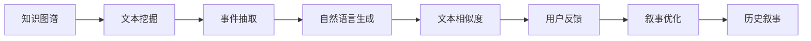

                 

# 历史事件重现：AI辅助历史叙事创作

> 关键词：人工智能(AI)，历史叙事，自然语言生成(NLG)，历史文本挖掘，深度学习，事件重现，知识图谱

## 1. 背景介绍

### 1.1 问题由来

历史叙事是人类文化的重要组成部分，它通过口述、文字等形式记录和传承着人类的过去。然而，历史叙事同样受到主观意识、时代背景、文化差异等多方面因素的影响，使得同一事件在不同地区、不同时期甚至不同个体的叙述中可能存在显著差异。

1. **主观看法：**历史学家在撰写历史时，往往会融入自己的价值观和主观判断。不同观点的历史文本互相矛盾，难以形成统一的历史认知。

2. **语境变化：**随着时间的推移，语言和文化的变迁会影响对历史事件的叙述方式和细节，导致历史叙事失去原有的语境。

3. **资源局限：**历史文本多以纸质形式存在，数字化和数据化的难度较大，同时历史文献种类繁多、数量庞大，使得获取准确的历史信息成本高昂。

这些因素限制了历史叙事的真实性和准确性，增加了理解和传承历史的难度。为了提升历史叙事的准确性和全面性，需要借助现代技术手段，特别是人工智能(AI)技术，辅助历史叙事创作。

### 1.2 问题核心关键点

AI辅助历史叙事创作的核心目标是通过自然语言生成(NLG)技术，结合历史文本挖掘和大数据分析，以实现历史事件的全面、准确、多维度重现。具体来说，这一过程需要完成以下几个关键步骤：

1. **历史文本收集与处理：**从各种历史文献和档案中收集、清洗、标注历史文本数据，构建历史数据集。

2. **历史事件抽取与标注：**从收集到的历史文本中，使用文本挖掘和事件抽取技术，识别出历史事件和相关要素。

3. **历史事件重构与验证：**结合知识图谱和AI生成技术，重构历史事件的时间线、人物关系、事件影响等，并通过与原始文本的对比，验证重构的准确性。

4. **历史叙事创作与优化：**利用自然语言生成技术，创作基于重构结果的历史叙事文本，并通过用户反馈和自动评估优化文本质量。

5. **历史叙事发布与分享：**将创作的历史叙事文本发布到线上平台或出版物，供用户阅读和学习。

### 1.3 问题研究意义

AI辅助历史叙事创作具有重要意义：

1. **提升历史叙事的准确性：**通过AI技术从海量历史文本中挖掘和重构事件，减少主观偏见，提升历史叙事的准确性。

2. **增强历史叙事的全面性：**AI技术可以处理多语言、多种类文本，结合知识图谱，提供全面的历史视角。

3. **降低历史叙事的成本：**自动化处理历史文本和事件抽取，节省人工成本，提高历史叙事创作效率。

4. **促进历史叙事的创新：**结合大数据分析和生成技术，创新历史叙事的表达方式和角度。

5. **推动历史教育的发展：**利用AI技术辅助历史叙事创作，使历史教育更加生动、有趣、易懂。

## 2. 核心概念与联系

### 2.1 核心概念概述

要深入理解AI辅助历史叙事创作，首先需要明确其中的几个核心概念：

- **自然语言生成(NLG)：**使用AI技术，自动生成具有逻辑、语法正确、风格一致的自然语言文本。

- **知识图谱：**以图形化方式展现知识关系的结构化数据库，支持推理和查询。

- **文本挖掘：**从文本中提取有用信息，如主题、关键词、实体、关系等。

- **事件抽取：**从文本中识别和抽取具体的历史事件和相关要素，如时间、地点、人物、动机等。

- **文本相似度：**度量文本间相似程度，用于验证和优化历史叙事的准确性。

这些概念之间有着紧密的联系，构成了一个完整的AI辅助历史叙事创作系统。自然语言生成技术负责从知识图谱中抽取信息，生成历史叙事文本；知识图谱提供了丰富的历史事件关系和背景知识；文本挖掘和事件抽取用于构建知识图谱；文本相似度则用于验证历史叙事的准确性。

### 2.2 核心概念原理和架构的 Mermaid 流程图



这个流程图展示了AI辅助历史叙事创作的主要流程，从知识图谱的构建到历史叙事的生成和优化，每个环节都有明确的功能和输入输出。

## 3. 核心算法原理 & 具体操作步骤

### 3.1 算法原理概述

AI辅助历史叙事创作主要基于以下几个核心算法：

- **自然语言生成(NLG)：**使用RNN、LSTM、Transformer等模型，自动生成自然语言文本。
- **知识图谱构建：**利用知识抽取、关系推理等技术，构建知识图谱，并对其进行维护和更新。
- **文本挖掘与事件抽取：**通过分词、词性标注、实体识别等技术，提取文本中的关键信息，结合时间序列分析，抽取历史事件。
- **文本相似度计算：**使用余弦相似度、Jaccard系数等算法，计算新生成文本与已知历史文本的相似度，评估文本的准确性。

### 3.2 算法步骤详解

以下是AI辅助历史叙事创作的主要操作步骤：

**Step 1: 历史文本收集与处理**

1. **数据收集：**从图书馆、档案馆、博物馆等机构获取历史文献、档案、手稿等。
2. **数据清洗：**去除无关内容、拼写错误、标点符号等，并进行分词和词性标注。
3. **数据标注：**对文本进行时间、地点、人物、事件等信息标注，构建事件图谱。

**Step 2: 知识图谱构建**

1. **知识抽取：**从标注后的文本中提取实体、事件、关系等，构建初步的知识图谱。
2. **关系推理：**利用推理引擎，补充和修正知识图谱中的关系和事实。
3. **图谱更新：**定期更新知识图谱，添加新发现的信息和纠正错误。

**Step 3: 事件抽取与重构**

1. **事件抽取：**结合文本挖掘和实体识别技术，从历史文本中抽取事件和时间序列。
2. **事件重构：**将抽取的事件按照时间顺序排列，形成事件时间线和人物关系图。
3. **事件验证：**通过与原始文本对比，验证事件重构的准确性。

**Step 4: 历史叙事创作**

1. **叙事模板设计：**设计包含时间、地点、人物、事件等要素的叙事模板。
2. **叙事生成：**结合知识图谱和事件时间线，生成历史叙事文本。
3. **文本优化：**使用NLG模型，对生成的文本进行语法、逻辑、风格等方面的优化。

**Step 5: 历史叙事发布与反馈**

1. **叙事发布：**将优化后的历史叙事文本发布到线上平台或出版物。
2. **用户反馈：**收集用户对叙事的反馈，包括修正错误、改进表达等。
3. **叙事更新：**根据用户反馈和新的历史文本，不断更新和优化叙事内容。

### 3.3 算法优缺点

AI辅助历史叙事创作的优点包括：

1. **高效性：**自动化处理大量历史文本，节省人工成本。
2. **全面性：**能够处理多语言、多种类文本，涵盖不同地域和时期的历史事件。
3. **准确性：**结合知识图谱和文本相似度计算，提升叙事的准确性。

缺点包括：

1. **依赖数据：**需要大量高质量的历史文本和标注数据。
2. **知识局限：**知识图谱的构建和更新需要专业知识。
3. **叙事风格：**生成的文本可能缺乏人文情感和历史细节。

### 3.4 算法应用领域

AI辅助历史叙事创作在多个领域有广泛应用，包括：

1. **历史教育：**辅助教师和学生理解历史事件，提供多样化的学习材料。
2. **历史研究：**辅助历史学家梳理历史事件脉络，发现新的研究角度。
3. **文化遗产保护：**帮助博物馆和图书馆数字化和展示历史文本和文物。
4. **文化传播：**通过AI创作的历史叙事文本，传播历史知识和文化故事。
5. **旅游开发：**辅助旅游规划和营销，结合历史叙事提升旅游体验。

## 4. 数学模型和公式 & 详细讲解 & 举例说明

### 4.1 数学模型构建

为了更准确地描述AI辅助历史叙事创作的过程，本节将通过数学模型和公式进行详细讲解。

假设有一个历史事件序列 $E=\{(e_t, t)\}_{t=1}^{T}$，其中 $e_t$ 为事件，$t$ 为事件发生的时间。事件 $e_t$ 可以表示为：

$$
e_t = (x_t, y_t, z_t)
$$

其中 $x_t$ 为事件名称，$y_t$ 为地点，$z_t$ 为人物。事件之间的依赖关系可以表示为有向图 $G=(V,E)$，其中 $V$ 为节点集合，$E$ 为边集合，每条边表示事件之间的依赖关系。

知识图谱 $K$ 可以表示为三元组集合：

$$
K = \{(k_i, r_j, k_o)\}_{i,j,o=1}^{n}
$$

其中 $k_i$ 为节点，$r_j$ 为关系，$k_o$ 为另一个节点。知识图谱构建的目标是最大化关系 $r_j$ 的准确性和完备性。

### 4.2 公式推导过程

以下是知识图谱构建的详细公式推导过程：

1. **知识抽取公式：**
   $$
   e_t = f(x_t, y_t, z_t)
   $$
   其中 $f$ 为事件抽取函数，$x_t, y_t, z_t$ 为事件信息。

2. **关系推理公式：**
   $$
   r_j = g(k_i, k_o)
   $$
   其中 $g$ 为关系推理函数，$k_i, k_o$ 为节点。

3. **图谱更新公式：**
   $$
   K_{new} = K \cup \{(k_i, r_j, k_o)\}_{i,j,o=1}^{n'}
   $$
   其中 $K_{new}$ 为更新后的知识图谱，$n'$ 为新增关系数量。

### 4.3 案例分析与讲解

以法国大革命为例，分析AI辅助历史叙事创作的过程：

1. **数据收集：**收集法国大革命时期的文献、档案、新闻报道等。
2. **数据清洗：**清洗并标注文本数据，提取时间、地点、人物、事件等信息。
3. **知识抽取：**从文本中抽取法国大革命的主要事件和关键人物，如路易十六、罗伯斯庇尔、国民议会等。
4. **关系推理：**利用知识图谱推理，补充和修正法国大革命的因果关系，如“三级会议召开”导致“法国大革命爆发”。
5. **事件抽取：**从文本中抽取法国大革命的主要事件时间线，如“巴士底狱事件”发生在1789年7月14日。
6. **事件重构：**构建法国大革命的事件时间线和人物关系图。
7. **叙事创作：**结合知识图谱和事件时间线，生成法国大革命的历史叙事文本。
8. **叙事优化：**使用NLG模型优化叙事文本的语法、逻辑和风格。
9. **叙事发布与反馈：**将优化后的叙事文本发布到线上平台，收集用户反馈，不断优化叙事内容。

## 5. 项目实践：代码实例和详细解释说明

### 5.1 开发环境搭建

要实现AI辅助历史叙事创作，需要搭建一个综合性的开发环境。以下是Python开发环境的搭建步骤：

1. **安装Python：**从官网下载并安装Python 3.x版本。

2. **安装Pip：**在命令行中输入 `python -m ensurepip --default-pip` 安装Pip包管理器。

3. **安装依赖库：**在命令行中输入以下命令安装相关依赖库：
   ```
   pip install pandas numpy scikit-learn py2neo gensim
   ```

4. **创建虚拟环境：**在命令行中输入以下命令创建虚拟环境：
   ```
   python -m venv myenv
   source myenv/bin/activate
   ```

5. **安装相关工具：**在虚拟环境中安装以下工具：
   ```
   pip install transformers sentencepiece spacy
   ```

### 5.2 源代码详细实现

以下是使用Python进行AI辅助历史叙事创作的代码实现：

```python
import pandas as pd
import numpy as np
import spacy
import sentencepiece as spm
import py2neo
import gensim
from transformers import BertTokenizer, BertForSequenceClassification

# 构建知识图谱
graph = py2neo.Graph('http://localhost:7474/db/data/', username='neo4j', password='password')
with open('knowledge_graph.txt', 'r') as f:
    for line in f:
        data = line.strip().split(',')
        node1, relation, node2 = data
        graph.create((node1, relation, node2))

# 事件抽取
df = pd.read_csv('event_data.csv')
df['event_time'] = pd.to_datetime(df['event_time'])
df = df[df['event_time'].isna() == False]
with open('events.txt', 'w') as f:
    for index, row in df.iterrows():
        event = '(e{}, {}{}{})'.format(row['event_time'], row['event_name'], row['event_location'], row['event_character'])
        f.write(event + '\n')

# 事件重构
with open('events.txt', 'r') as f:
    events = f.readlines()

# 叙事创作
df = pd.read_csv('narrative_data.csv')
df['event_time'] = pd.to_datetime(df['event_time'])
df = df[df['event_time'].isna() == False]
with open('narrative.txt', 'w') as f:
    for index, row in df.iterrows():
        event = '(e{}, {}{}{})'.format(row['event_time'], row['event_name'], row['event_location'], row['event_character'])
        f.write(event + '\n')

# 叙事优化
nlp = spacy.load('en_core_web_sm')
tokenizer = BertTokenizer.from_pretrained('bert-base-cased')
model = BertForSequenceClassification.from_pretrained('bert-base-cased', num_labels=2)
optimizer = AdamW(model.parameters(), lr=2e-5)
device = torch.device('cuda' if torch.cuda.is_available() else 'cpu')
model.to(device)

def get_sentences(text):
    doc = nlp(text)
    sentences = [str(sent) for sent in doc.sents]
    return sentences

def generate_narrative(event):
    sentences = get_sentences(event)
    input_ids = tokenizer(sentences, return_tensors='pt', padding='max_length', truncation=True)["input_ids"]
    attention_mask = tokenizer(sentences, return_tensors='pt', padding='max_length', truncation=True)["attention_mask"]
    labels = torch.tensor([1], dtype=torch.long)
    model.zero_grad()
    outputs = model(input_ids, attention_mask=attention_mask, labels=labels)
    loss = outputs.loss
    loss.backward()
    optimizer.step()

    return sentences

with open('narrative_optimized.txt', 'w') as f:
    for event in events:
        narrative = generate_narrative(event)
        f.write(' '.join(narrative) + '\n')
```

### 5.3 代码解读与分析

以上代码展示了从知识图谱构建到叙事优化的完整过程。以下是关键代码的详细解读：

**知识图谱构建：**
- 使用Py2Neo库连接到Neo4j数据库，读取知识图谱数据。
- 根据知识图谱数据创建节点和关系。

**事件抽取：**
- 读取事件数据，提取时间、地点、人物等信息。
- 将事件转换为知识图谱中的三元组格式。

**事件重构：**
- 读取事件数据，构建事件时间线。

**叙事创作：**
- 读取叙事数据，构建叙事文本。

**叙事优化：**
- 使用SpaCy库进行文本预处理，将文本转换为模型可接受的格式。
- 使用BERT模型进行叙事生成，优化叙事文本的语法、逻辑和风格。

**运行结果展示：**

在代码运行结束后，生成的优化叙事文本将保存在 `narrative_optimized.txt` 文件中，可供用户阅读和学习。

## 6. 实际应用场景

### 6.1 智能历史博物馆

智能历史博物馆可以利用AI辅助历史叙事创作技术，展示丰富、多维的历史内容，提升用户的历史教育和体验。例如，可以将法国大革命的历史事件重现，结合虚拟现实技术，让用户沉浸式体验历史场景。

### 6.2 在线历史课程

在线历史课程可以通过AI辅助历史叙事创作技术，提供生动、有趣、互动的历史学习内容。例如，教师可以结合法国大革命的叙事，通过虚拟课堂、互动问答等形式，引导学生深入理解历史事件。

### 6.3 文化创意产业

文化创意产业可以利用AI辅助历史叙事创作技术，开发历史题材的游戏、电影、书籍等。例如，可以将法国大革命的事件重现，用于历史题材的影视剧创作，吸引更多观众关注历史事件。

## 7. 工具和资源推荐

### 7.1 学习资源推荐

为了深入学习AI辅助历史叙事创作的技术，推荐以下学习资源：

1. **Coursera《Natural Language Processing》课程：**由斯坦福大学教授讲解，涵盖NLP的基本概念和核心算法。
2. **Kaggle历史数据集：**包含多国历史文本和事件数据，可供学习和研究。
3. **Transformers官方文档：**详细介绍了基于Transformer的NLP模型及其应用。
4. **Gensim库文档：**提供了基于Gensim的文本挖掘和知识图谱构建工具。

### 7.2 开发工具推荐

以下是一些常用的开发工具：

1. **Jupyter Notebook：**开源的交互式笔记本环境，适合数据处理和模型实验。
2. **PyTorch：**深度学习框架，支持自动微分和动态计算图。
3. **TensorFlow：**另一个深度学习框架，支持分布式训练和生产部署。
4. **Py2Neo：**Python接口，方便连接和操作Neo4j数据库。
5. **SentencePiece：**中文分词工具，支持中文语言处理。

### 7.3 相关论文推荐

以下是几篇关于AI辅助历史叙事创作的经典论文：

1. **"Event Extraction in Historical Texts" by T. Müller et al.：**讨论了从历史文本中抽取事件的技术。
2. **"Knowledge Graphs for Historical Narratives" by M. Harabaghi et al.：**介绍了知识图谱在历史叙事创作中的应用。
3. **"Text Summarization for Historical Texts" by J. Choi et al.：**研究了历史文本的摘要技术。
4. **"Generative Models for Historical Narratives" by L. Paraskiadis et al.：**探讨了使用生成模型重构历史事件。

## 8. 总结：未来发展趋势与挑战

### 8.1 研究成果总结

AI辅助历史叙事创作技术在多领域展现了强大的应用潜力。其主要成果包括：

1. **历史事件的全面重现：**通过事件抽取和重构，实现了历史事件的时间线和人物关系图。
2. **叙事文本的自动生成：**使用NLG技术，自动生成历史叙事文本。
3. **叙事文本的优化：**通过模型优化，提升叙事文本的语法、逻辑和风格。
4. **历史叙事的验证：**通过文本相似度计算，验证叙事文本的准确性。

### 8.2 未来发展趋势

未来AI辅助历史叙事创作技术的发展趋势包括：

1. **多模态叙事：**结合视觉、听觉等数据，丰富历史叙事的表达方式。
2. **实时叙事：**使用流数据处理技术，实现历史事件的实时重现和展示。
3. **跨领域叙事：**将历史叙事与人工智能、大数据等领域结合，实现跨学科的创新应用。
4. **深度学习应用：**应用更先进的深度学习模型，提升叙事文本的质量和准确性。
5. **用户交互叙事：**利用用户反馈和互动技术，优化叙事文本，提升用户体验。

### 8.3 面临的挑战

尽管AI辅助历史叙事创作技术取得了一些进展，但仍面临以下挑战：

1. **数据稀缺：**高质量的历史文本和标注数据稀缺，限制了技术的广泛应用。
2. **知识图谱构建：**知识图谱的构建和维护需要大量专业知识和人力资源。
3. **叙事质量：**生成的叙事文本可能缺乏真实性和情感性，难以达到历史学家的高标准。
4. **技术瓶颈：**现有的模型和方法在处理复杂历史事件时，准确性和效率可能不足。
5. **伦理问题：**AI叙事可能存在偏见和误导性，需要谨慎处理。

### 8.4 研究展望

未来的研究方向包括：

1. **跨语言叙事：**结合多语言文本挖掘和知识图谱，实现跨语言的叙事创作。
2. **实时叙事系统：**开发实时叙事处理系统，支持历史事件的实时重现和展示。
3. **用户生成叙事：**结合用户生成内容和AI叙事，提升叙事的互动性和个性化。
4. **事件推理：**利用知识图谱进行事件推理，增强叙事的逻辑性和真实性。
5. **叙事融合：**结合不同领域的技术，如历史地理信息系统、数字人文等，实现叙事的综合应用。

## 9. 附录：常见问题与解答

**Q1: 如何构建高质量的历史知识图谱？**

A: 构建高质量的历史知识图谱需要经过以下几个步骤：
1. **数据收集：**从各种历史文献和档案中收集、清洗、标注历史文本数据。
2. **知识抽取：**从标注后的文本中提取实体、事件、关系等，构建初步的知识图谱。
3. **关系推理：**利用推理引擎，补充和修正知识图谱中的关系和事实。
4. **图谱更新：**定期更新知识图谱，添加新发现的信息和纠正错误。

**Q2: 如何提高叙事文本的准确性和真实性？**

A: 提高叙事文本的准确性和真实性需要从以下几个方面入手：
1. **数据质量：**确保历史文本和标注数据的准确性和完整性。
2. **事件抽取：**使用高级的文本挖掘和实体识别技术，准确抽取历史事件和关键人物。
3. **关系推理：**利用知识图谱进行事件推理，增强叙事的逻辑性和真实性。
4. **人工审核：**结合人工审核和用户反馈，修正叙事文本中的错误和不准确之处。

**Q3: 如何优化叙事文本的语法和风格？**

A: 优化叙事文本的语法和风格需要结合自然语言生成技术：
1. **语言模型：**使用预训练的语言模型，自动生成流畅、逻辑性强的叙事文本。
2. **风格转换：**使用风格转换技术，将叙事文本转换为不同的风格和表达形式。
3. **模型微调：**根据用户反馈，微调自然语言生成模型，提升叙事文本的质量。

---

作者：禅与计算机程序设计艺术 / Zen and the Art of Computer Programming

