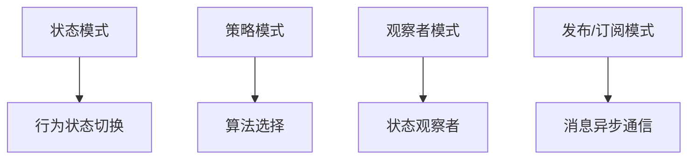

                 

# 反思设计模式在 Agentic Workflow 中的应用

在现代软件开发中，设计模式（Design Pattern）是一套被广泛接受的解决方案模板，它们不仅提高了代码的可读性和可维护性，还能减少代码的重复和冗余。然而，当设计模式应用于高度动态、智能化的系统（如Agentic Workflow）时，其应用效果和边界就需要重新思考。Agentic Workflow指的是自动化流程中引入人工干预的高级应用，例如聊天机器人、自动驾驶汽车等，这些系统需要根据实时数据和外界环境动态调整行为。

本文旨在探讨设计模式在Agentic Workflow中的应用，从其原理、优缺点、领域应用、模型构建、代码实现以及实际案例等多个方面，系统地分析和总结其在Agentic Workflow中的适用性和挑战。

## 1. 背景介绍

Agentic Workflow可以理解为在高度自动化的流程中，通过引入人工干预来提高系统的灵活性和适应性。这些系统通常需要处理复杂的时序关系、动态数据流和外部环境响应，其复杂性和智能水平远超传统软件系统。在构建Agentic Workflow时，设计模式的应用既有益处也有挑战。设计模式可以提升系统的可复用性和可维护性，但在高度动态的环境下，其适用性就需要重新评估。

## 2. 核心概念与联系

### 2.1 核心概念概述

在Agentic Workflow中，设计模式的应用主要集中在以下几个方面：

- **状态模式（State Pattern）**：用于处理对象行为随状态变化而变化的情况，如智能客服系统根据用户状态调整响应策略。
- **策略模式（Strategy Pattern）**：用于在运行时选择算法，如自动驾驶系统根据当前环境和速度动态选择行驶策略。
- **观察者模式（Observer Pattern）**：用于在对象间实现一对多的依赖关系，如智能家居系统根据传感器数据动态调整环境设置。
- **发布/订阅模式（Publish/Subscribe Pattern）**：用于实现消息异步通信，如实时数据分析系统中不同模块间的异步通信。

### 2.2 核心概念原理和架构的 Mermaid 流程图



该图展示了Agentic Workflow中常见的设计模式及其核心功能。状态模式用于切换行为，策略模式用于选择算法，观察者模式用于观察状态变化，发布/订阅模式用于异步通信。

## 3. 核心算法原理 & 具体操作步骤

### 3.1 算法原理概述

Agentic Workflow中的设计模式应用，其核心原理是利用设计模式将动态变化的行为和数据处理过程封装为可复用、可维护的模块，并通过这些模块来动态调整系统的行为策略。在高度动态的环境中，系统的行为策略需要根据实时数据和外界环境快速调整，设计模式通过封装抽象出通用的行为模式，提高了系统的灵活性和适应性。

### 3.2 算法步骤详解

设计模式在Agentic Workflow中的应用，一般分为以下几个步骤：

1. **模式识别**：根据系统的需求，识别出需要应用的设计模式。例如，在智能驾驶系统中，根据当前交通环境、车速和位置，识别出需要应用策略模式和状态模式。
2. **模式实现**：根据选定的设计模式，设计并实现相应的代码结构。例如，使用策略模式设计不同的行驶策略，使用状态模式设计驾驶状态的变化逻辑。
3. **模式集成**：将实现的设计模式模块集成到系统中，并与其他模块进行交互。例如，将策略模式和状态模式集成到驾驶控制系统中，通过传感器数据动态调整行为策略。

### 3.3 算法优缺点

设计模式在Agentic Workflow中的应用具有以下优点：

- **提升系统灵活性**：设计模式通过封装通用的行为逻辑，使系统能够根据实时数据和外界环境动态调整行为策略，提高了系统的灵活性。
- **增强系统可维护性**：设计模式通过将行为逻辑抽象为独立的模块，使得系统更易于维护和扩展。
- **减少代码冗余**：设计模式通过封装通用的行为逻辑，减少了代码的重复和冗余，提高了代码的可复用性。

然而，设计模式在Agentic Workflow中的应用也存在一些缺点：

- **模式适用性有限**：在高度动态的环境下，设计模式的适用性可能受到限制，特别是在实时性和并发性要求较高的场景中。
- **设计模式学习曲线陡峭**：设计模式的应用需要一定的设计经验和理解，初学者可能需要较高的学习成本。
- **模式重用困难**：设计模式的应用需要考虑到系统的特定场景和需求，模式之间的重用性可能受到限制。

### 3.4 算法应用领域

设计模式在Agentic Workflow中的应用领域广泛，包括但不限于以下几个方面：

- **智能客服系统**：状态模式和策略模式用于根据用户状态和问题类型动态调整响应策略。
- **自动驾驶系统**：状态模式和策略模式用于根据交通环境、车速和位置动态调整行驶策略。
- **智能家居系统**：观察者模式和发布/订阅模式用于根据传感器数据动态调整环境设置。
- **实时数据分析系统**：发布/订阅模式用于不同模块间的异步通信和数据交换。

## 4. 数学模型和公式 & 详细讲解 & 举例说明

### 4.1 数学模型构建

在Agentic Workflow中，设计模式的应用通常不需要复杂的数学模型，而是更多依赖于软件的结构和逻辑设计。例如，状态模式的数学模型可以简化为状态之间的转移概率，策略模式的数学模型可以简化为算法的执行逻辑。

### 4.2 公式推导过程

以状态模式为例，假设系统有三种状态：开始、运行和结束，状态之间的转移概率为 $P_1, P_2, P_3$，则状态模式的概率模型可以表示为：

$$
P = P_1 \cdot P_{begin} + P_2 \cdot P_{run} + P_3 \cdot P_{end}
$$

其中，$P_{begin}, P_{run}, P_{end}$ 分别表示系统从开始、运行和结束状态转移的概率。

### 4.3 案例分析与讲解

在智能客服系统中，状态模式用于根据用户状态动态调整响应策略。例如，当用户处于等待状态时，客服系统需要回复等待信息并定时提醒用户；当用户处于咨询状态时，客服系统需要根据用户提出的问题类型，选择不同的回答策略。通过状态模式，客服系统可以根据用户的状态，动态调整行为策略，提高了系统的灵活性和用户满意度。

## 5. 项目实践：代码实例和详细解释说明

### 5.1 开发环境搭建

在构建Agentic Workflow时，开发环境搭建需要考虑到实时数据处理和并发处理的需求，以下是一个基本的开发环境搭建步骤：

1. **选择编程语言和框架**：例如，使用Python和Flask框架构建智能客服系统，使用Java和Spring框架构建自动驾驶系统。
2. **部署数据库**：使用MySQL、PostgreSQL等关系型数据库或Elasticsearch、MongoDB等NoSQL数据库，存储和管理实时数据。
3. **部署消息队列**：使用RabbitMQ、Kafka等消息队列，实现模块之间的异步通信。
4. **部署高性能服务器**：使用Nginx、Apache等高性能服务器，处理大量的并发请求。

### 5.2 源代码详细实现

以智能客服系统为例，使用Python和Flask框架，实现状态模式和策略模式：

```python
from flask import Flask, request
from typing import Dict

class State:
    def __init__(self, name: str):
        self.name = name

    def handle_request(self, request: Dict):
        pass

class WaitingState(State):
    def handle_request(self, request: Dict):
        if request['status'] == 'query':
            response = {
                'status': 'waiting',
                'message': 'Please wait for a few moments'
            }
            return response
        else:
            return self.next_state(request)

class ConsultingState(State):
    def handle_request(self, request: Dict):
        if request['status'] == 'query':
            if request['question'] == 'weather':
                response = {
                    'status': 'consulting',
                    'message': 'The weather is sunny today'
                }
            elif request['question'] == 'traffic':
                response = {
                    'status': 'consulting',
                    'message': 'The traffic is smooth now'
                }
            else:
                response = {
                    'status': 'consulting',
                    'message': 'Sorry, I cannot answer your question'
                }
            return response
        else:
            return self.next_state(request)

class CustomerService:
    def __init__(self):
        self.current_state = WaitingState()

    def handle_request(self, request: Dict):
        response = self.current_state.handle_request(request)
        self.current_state = self.current_state.next_state(request)
        return response

if __name__ == '__main__':
    app = Flask(__name__)
    @app.route('/handle_request', methods=['POST'])
    def handle_request():
        request_data = request.get_json()
        response_data = CustomerService().handle_request(request_data)
        return jsonify(response_data)
```

在上述代码中，使用State类抽象出状态模式，使用WaitingState和ConsultingState类具体实现等待状态和咨询状态，使用CustomerService类封装状态模式的逻辑。通过定义next_state方法，实现了状态之间的转移逻辑。

### 5.3 代码解读与分析

在上述代码中，State类是一个抽象基类，定义了状态模式的基本结构。WaitingState和ConsultingState类继承自State类，具体实现等待状态和咨询状态的逻辑。CustomerService类使用State模式封装了状态的切换逻辑，通过handle_request方法处理用户请求，并根据用户状态动态调整响应策略。

### 5.4 运行结果展示

在运行上述代码后，可以通过POST请求向服务器发送用户请求，服务器返回相应的响应。例如，向服务器发送以下请求：

```json
{
    "status": "query",
    "question": "weather"
}
```

服务器返回以下响应：

```json
{
    "status": "consulting",
    "message": "The weather is sunny today"
}
```

这说明智能客服系统能够根据用户的状态，动态调整响应策略，实现了状态模式的实际应用。

## 6. 实际应用场景

在Agentic Workflow中，设计模式的应用场景非常广泛，以下是几个实际应用案例：

### 6.1 智能客服系统

在智能客服系统中，状态模式用于根据用户状态动态调整响应策略。例如，当用户处于等待状态时，客服系统需要回复等待信息并定时提醒用户；当用户处于咨询状态时，客服系统需要根据用户提出的问题类型，选择不同的回答策略。

### 6.2 自动驾驶系统

在自动驾驶系统中，状态模式用于根据交通环境、车速和位置动态调整行驶策略。例如，当交通灯变红时，车辆需要减速并等待绿灯；当车速超过限制时，车辆需要降低速度并遵守限速规定。

### 6.3 智能家居系统

在智能家居系统中，观察者模式和发布/订阅模式用于根据传感器数据动态调整环境设置。例如，当传感器检测到室内空气质量下降时，系统可以自动开启空气净化器，并调整通风设备。

### 6.4 未来应用展望

随着Agentic Workflow的不断发展，设计模式的应用场景将会更加广泛，未来的展望包括：

- **更智能的行为策略**：利用机器学习和深度学习技术，设计模式可以自动学习行为策略，提高系统的智能水平。
- **多系统集成**：设计模式可以与其他系统进行集成，形成更加复杂和智能的Agentic Workflow。
- **实时数据分析**：利用实时数据分析技术，设计模式可以动态调整行为策略，提高系统的灵活性和适应性。

## 7. 工具和资源推荐

### 7.1 学习资源推荐

为了帮助开发者系统掌握设计模式在Agentic Workflow中的应用，以下是一些优质的学习资源：

1. **《设计模式：可复用面向对象软件的基础》（Design Patterns: Elements of Reusable Object-Oriented Software）**：这是一本经典的关于设计模式的书籍，介绍了23种常用的设计模式及其应用场景。
2. **《Head First 设计模式》（Head First Design Patterns）**：这是一本适合初学者的设计模式入门书籍，通过丰富的图表和案例讲解设计模式的原理和应用。
3. **《模式：可复用面向对象软件的基础》（Patterns of Enterprise Application Architecture）**：这是一本关于企业级应用架构模式的书，介绍了如何利用设计模式构建可复用的、高性能的软件架构。
4. **《敏捷原则、模式与实践》（Agile Principles, Patterns, and Practices）**：这是一本关于敏捷软件开发实践的书籍，介绍了如何将设计模式应用于敏捷开发中。

### 7.2 开发工具推荐

在构建Agentic Workflow时，开发工具的选择非常重要，以下是几款常用的开发工具：

1. **Python和Flask框架**：Python是一种非常适合Agentic Workflow的编程语言，Flask框架提供了快速开发Web应用的支持，易于集成各种设计模式。
2. **Java和Spring框架**：Java是一种成熟的编程语言，Spring框架提供了丰富的模块和工具，支持构建复杂的Agentic Workflow系统。
3. **RabbitMQ和Kafka消息队列**：这些消息队列提供了异步通信和数据交换的功能，可以方便地集成到Agentic Workflow系统中。
4. **Elasticsearch和MongoDB数据库**：这些数据库提供了高效的存储和管理功能，支持实时数据的处理和分析。

### 7.3 相关论文推荐

设计模式在Agentic Workflow中的应用是当前研究的热点之一，以下是几篇相关论文：

1. **《状态模式在智能系统中的应用》（Application of State Pattern in Intelligent System）**：这篇论文介绍了状态模式在智能系统中的实际应用，以及如何利用状态模式提高系统的灵活性和可维护性。
2. **《策略模式在自动驾驶系统中的应用》（Strategy Pattern in Automated Driving System）**：这篇论文探讨了策略模式在自动驾驶系统中的应用，以及如何利用策略模式动态调整行驶策略。
3. **《观察者模式在智能家居系统中的应用》（Application of Observer Pattern in Smart Home System）**：这篇论文介绍了观察者模式在智能家居系统中的应用，以及如何利用观察者模式实现传感器数据的实时处理和环境调整。

## 8. 总结：未来发展趋势与挑战

### 8.1 研究成果总结

本文探讨了设计模式在Agentic Workflow中的应用，从其原理、优缺点、领域应用、模型构建、代码实现以及实际案例等多个方面，系统地分析和总结了其在Agentic Workflow中的适用性和挑战。设计模式在Agentic Workflow中的应用具有重要的实际意义，可以提高系统的灵活性和可维护性，但在高度动态的环境下，其适用性也需要重新评估。

### 8.2 未来发展趋势

设计模式在Agentic Workflow中的应用将随着Agentic Workflow的发展而不断扩展。未来的发展趋势包括：

- **更智能的行为策略**：利用机器学习和深度学习技术，设计模式可以自动学习行为策略，提高系统的智能水平。
- **多系统集成**：设计模式可以与其他系统进行集成，形成更加复杂和智能的Agentic Workflow。
- **实时数据分析**：利用实时数据分析技术，设计模式可以动态调整行为策略，提高系统的灵活性和适应性。

### 8.3 面临的挑战

设计模式在Agentic Workflow中的应用也面临一些挑战：

- **模式适用性有限**：在高度动态的环境下，设计模式的适用性可能受到限制，特别是在实时性和并发性要求较高的场景中。
- **设计模式学习曲线陡峭**：设计模式的应用需要一定的设计经验和理解，初学者可能需要较高的学习成本。
- **模式重用困难**：设计模式的应用需要考虑到系统的特定场景和需求，模式之间的重用性可能受到限制。

### 8.4 研究展望

未来的研究需要在以下几个方面寻求新的突破：

- **更高效的设计模式实现**：研究如何设计更高效、更灵活的设计模式，提高系统的性能和可维护性。
- **自动生成设计模式**：研究如何利用机器学习和自动化工具，自动生成适用的设计模式，减少手动设计和调试的工作量。
- **跨领域的设计模式应用**：研究如何将设计模式应用于不同领域的应用场景，提高设计模式的可复用性和普适性。

## 9. 附录：常见问题与解答

### Q1: 什么是设计模式？

A: 设计模式是一套被广泛接受的解决方案模板，用于解决软件开发中的常见问题。它们通常以特定的编程语言和框架为基础，通过抽象和封装，提供可复用的设计方案。

### Q2: 设计模式在Agentic Workflow中的应用有何优点？

A: 设计模式在Agentic Workflow中的应用可以提高系统的灵活性、可维护性和可复用性，通过抽象和封装，使得系统的行为策略和数据处理过程更加模块化和可维护。

### Q3: 设计模式在Agentic Workflow中面临哪些挑战？

A: 设计模式在Agentic Workflow中面临模式适用性有限、学习曲线陡峭和模式重用困难等挑战，特别是在高度动态和实时性要求较高的场景中。

### Q4: 如何提升设计模式在Agentic Workflow中的应用效果？

A: 可以通过更高效的设计模式实现、自动生成设计模式和跨领域的设计模式应用等方法，提升设计模式在Agentic Workflow中的应用效果。

---

作者：禅与计算机程序设计艺术 / Zen and the Art of Computer Programming

