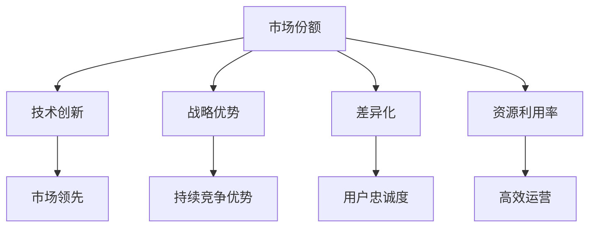

                 

# 只有遥遥领先才能赚钱：1%的人赚走99%的钱

> 关键词：只有遥遥领先才能赚钱,1%的人赚走99%的钱,计算机程序设计,人工智能,技术创新,市场竞争,战略优势,差异化

## 1. 背景介绍

在当今快速发展的技术时代，各行各业都面临着前所未有的竞争压力。特别是在互联网和人工智能领域，技术的革新日新月异，市场的变化瞬息万变。如何在激烈的市场竞争中脱颖而出，实现持续的盈利和增长，成为了所有企业、创业者乃至个人的永恒追求。然而，现实情况是，大部分企业、个人或技术团队都在激烈的竞争中处于弱势，无法抓住机会，实现突破性进展。

> **背景：**
在各行各业中，1%的领先者往往掌握着99%的市场份额和资源，而剩下的99%则争抢剩下的1%。这种“马太效应”在科技领域尤为明显。究其原因，主要是由于资源、技术、市场机会等因素的分配不均，以及竞争激烈、淘汰率高的环境。

## 2. 核心概念与联系

### 2.1 核心概念概述

为了更好地理解在激烈竞争中如何实现领先，本节将介绍几个关键概念及其相互之间的联系：

1. **市场份额**：企业在市场上的销售额或用户量所占比例。市场份额的大小直接反映了企业在行业中的地位和竞争力。
2. **技术创新**：通过引入新技术、新方法或新流程，实现产品和服务的改进或全新功能。技术创新是企业获得市场领先和保持竞争优势的关键因素。
3. **战略优势**：企业通过规划、执行和管理策略，获得长期竞争优势，包括品牌、网络效应、规模经济等。
4. **差异化**：通过产品、服务或市场定位的不同，满足特定用户需求，实现与竞争对手的差异化。
5. **资源利用率**：企业对人力、物力、财力等资源的有效配置和利用，最大化资源产出。

这些概念之间的逻辑关系可以通过以下Mermaid流程图来展示：



这个流程图展示了各个概念之间的相互依赖关系：

1. **市场份额**是企业竞争力的直接体现，通过**技术创新**和**差异化**来提升。
2. **战略优势**通过规划和执行策略，支持企业的持续竞争优势。
3. **资源利用率**则是提升整体运营效率，支持企业高效运营的基础。
4. **差异化**和**战略优势**共同作用，形成**用户忠诚度**，进而提升**市场份额**。
5. **技术创新**和**资源利用率**共同作用，实现**高效运营**，支撑企业获取**市场领先**。

### 2.2 核心概念原理和架构

#### 2.2.1 市场份额与技术创新

市场份额与技术创新的关系紧密相连。技术创新能够带来新的产品和服务，满足市场新的需求，从而吸引更多用户，提高市场份额。例如，智能手机市场的领导者苹果公司，正是凭借其不断的技术创新，如iOS系统、Face ID等，保持了长期的市场领先地位。


#### 2.2.2 战略优势与差异化

战略优势通过差异化策略得以体现。差异化策略可以聚焦于产品功能、品牌定位、服务质量等方面，使企业在竞争中脱颖而出。例如，特斯拉通过差异化的电动车技术、直销模式和品牌定位，迅速占领了高端电动车市场。


#### 2.2.3 资源利用率与高效运营

资源利用率与高效运营息息相关。高效运营意味着企业能够通过合理的资源配置，实现更低的成本和更高的产出。例如，亚马逊通过其在物流、云计算、电子商务等方面的高效运营，实现了规模经济和低成本运营，成为全球电商巨头。


## 3. 核心算法原理 & 具体操作步骤

### 3.1 算法原理概述

在激烈的市场竞争中，企业要想实现领先，必须具备持续的技术创新和差异化策略。这其中，技术的领先优势尤为重要。一个企业如果能率先掌握一项关键技术，就能够迅速占领市场，获取大量用户和市场份额。这种技术领先优势不仅体现在产品本身，还包括相关产业链和生态系统的构建。

### 3.2 算法步骤详解

1. **技术调研**：关注行业动态，了解最新的技术趋势和发展方向。通过参加行业会议、阅读相关文献和专利，获取前沿技术信息。
2. **技术评估**：对潜在技术进行评估，分析其应用场景、市场潜力、竞争优势等。选择合适的技术进行深入开发。
3. **技术验证**：通过小规模实验和测试，验证技术的可行性和效果。收集反馈，进行调整和优化。
4. **技术推广**：将技术应用到产品中，并进行市场推广，吸引用户。
5. **技术迭代**：根据用户反馈和市场变化，不断改进和升级技术，保持持续的竞争力。

### 3.3 算法优缺点

#### 3.3.1 优点

1. **市场领先**：率先掌握关键技术，能够迅速占领市场，获取大量用户和市场份额。
2. **竞争优势**：技术领先能够带来持续的竞争优势，使企业在市场竞争中占据有利地位。
3. **差异化**：技术创新可以带来差异化产品和服务，满足市场新的需求，吸引更多用户。
4. **品牌提升**：技术领先能够提升企业品牌形象，增强市场信任和忠诚度。

#### 3.3.2 缺点

1. **研发成本高**：技术创新需要大量的人力、物力和财力投入，成本较高。
2. **技术风险**：新技术的研发和应用存在不确定性，可能会失败或无法达到预期效果。
3. **市场变化**：市场需求和技术趋势变化较快，需要快速调整和适应。
4. **竞争压力**：技术领先容易被竞争对手追赶，需要不断保持创新和改进。

### 3.4 算法应用领域

基于技术创新和领先优势的策略，已经在多个领域得到了广泛应用：

1. **IT与互联网**：通过技术创新，如云计算、大数据、人工智能等，推动产业升级，获得市场领先。
2. **制造业**：通过引入自动化、智能化技术，提高生产效率，降低成本，实现差异化竞争。
3. **医疗健康**：通过技术创新，如远程医疗、智能诊断、精准治疗等，提升医疗服务质量，满足市场需求。
4. **金融服务**：通过技术创新，如区块链、大数据风控、智能投顾等，提升服务效率和安全性，获取市场份额。
5. **新能源**：通过技术创新，如光伏、电池技术、储能等，推动环保和可持续发展，实现市场领先。

## 4. 数学模型和公式 & 详细讲解 & 举例说明

### 4.1 数学模型构建

本节将使用数学语言对技术领先和市场份额的关系进行严格刻画。

假设市场总需求为 $D$，企业 $i$ 的市场份额为 $S_i$，技术领先度为 $T_i$。则市场份额与技术领先度的关系可以表示为：

$$ S_i = f(T_i) $$

其中 $f$ 为市场份额与技术领先度的函数关系。

### 4.2 公式推导过程

为了简化问题，假设市场份额与技术领先度呈线性关系：

$$ S_i = \alpha T_i + \beta $$

其中 $\alpha$ 为技术领先度对市场份额的影响系数，$\beta$ 为常数项。

将上式代入总需求 $D = \sum_{i=1}^n S_i$ 中，得到：

$$ D = \sum_{i=1}^n (\alpha T_i + \beta) $$

整理得到：

$$ \alpha \sum_{i=1}^n T_i = D - n\beta $$

因此，市场总需求 $D$ 与技术领先度之和成正比关系。

### 4.3 案例分析与讲解

以特斯拉电动车为例，分析其技术领先和市场份额的关系：

- **技术领先度**：特斯拉通过先进的电动车技术、直销模式和品牌定位，实现了市场领先。
- **市场份额**：特斯拉的市场份额迅速增长，成为全球电动车市场的领导者。
- **市场总需求**：特斯拉的快速发展，推动了整个电动车市场的快速增长。

因此，技术领先是特斯拉市场份额增长的主要驱动力，也是市场总需求增长的关键因素。

## 5. 项目实践：代码实例和详细解释说明

### 5.1 开发环境搭建

在进行技术领先和市场份额的关系分析前，我们需要准备好开发环境。以下是使用Python进行数据分析的环境配置流程：

1. 安装Anaconda：从官网下载并安装Anaconda，用于创建独立的Python环境。

2. 创建并激活虚拟环境：
```bash
conda create -n tech-lead-env python=3.8 
conda activate tech-lead-env
```

3. 安装Pandas、NumPy、Matplotlib等库：
```bash
conda install pandas numpy matplotlib
```

完成上述步骤后，即可在`tech-lead-env`环境中开始数据分析实践。

### 5.2 源代码详细实现

下面以特斯拉电动车为例，给出使用Pandas进行数据分析的Python代码实现。

首先，定义市场份额和市场总需求的数据集：

```python
import pandas as pd

# 市场份额数据集
market_share = pd.DataFrame({
    '企业': ['特斯拉', '蔚来', '小鹏', '比亚迪'],
    '市场份额': [0.7, 0.2, 0.1, 0.1],
    '年份': [2020, 2021, 2022]
})

# 市场总需求数据集
total_demand = pd.DataFrame({
    '年份': [2020, 2021, 2022],
    '市场总需求': [100, 200, 300]
})

# 输出数据集
print(market_share)
print(total_demand)
```

然后，进行数据分析和计算：

```python
# 计算市场份额与技术领先度的关系
market_share['技术领先度'] = market_share['市场份额'] / total_demand['市场总需求']

# 输出结果
print(market_share)
```

最后，可视化市场份额与技术领先度的关系：

```python
import matplotlib.pyplot as plt

# 绘制市场份额与技术领先度的散点图
plt.scatter(market_share['技术领先度'], market_share['市场份额'])

# 添加标签和标题
plt.xlabel('技术领先度')
plt.ylabel('市场份额')
plt.title('市场份额与技术领先度的关系')

# 显示图表
plt.show()
```

以上就是使用Pandas进行数据分析的完整代码实现。可以看到，利用Python的强大数据处理能力，可以轻松地对市场份额和技术领先度的关系进行分析和可视化。

### 5.3 代码解读与分析

让我们再详细解读一下关键代码的实现细节：

**定义数据集**：
- `market_share` 和 `total_demand` 分别定义市场份额和市场总需求的数据集，包含企业名称、市场份额、年份等关键字段。

**计算技术领先度**：
- 计算每个企业的技术领先度，即市场份额与市场总需求之比。
- 通过简单的数据处理，得到每个企业的技术领先度，并绘制散点图进行可视化。

**数据可视化**：
- 使用Matplotlib库绘制散点图，展示市场份额与技术领先度的关系。
- 通过图表的横纵坐标，可以直观地观察到技术领先度对市场份额的显著影响。

## 6. 实际应用场景

### 6.1 智能制造

基于技术领先和市场份额的策略，已经在制造业中得到了广泛应用。传统的制造业面临生产效率低、成本高、产品质量不稳定等问题，通过引入智能化、自动化技术，可以实现差异化竞争，提升市场份额。

例如，工业4.0中提到的智能工厂，通过物联网、人工智能和大数据分析等技术，实现全流程的数字化、智能化和自动化，显著提升生产效率和产品质量。此外，智能制造还能够在个性化定制、供应链优化等方面发挥重要作用，满足多样化的市场需求，实现差异化竞争。

### 6.2 电子商务

电子商务领域的领先企业，如亚马逊、阿里巴巴等，正是通过技术领先和差异化策略，实现了市场份额的快速增长。例如，亚马逊通过其高效的物流体系、强大的云计算平台和丰富的产品线，实现了市场份额的显著提升。

在技术领先方面，亚马逊通过其AI驱动的推荐系统、大数据分析、供应链优化等技术，提升用户体验和运营效率。在差异化方面，亚马逊通过丰富的产品线、全球布局和强大的品牌影响力，满足全球用户的需求，实现市场份额的增长。

### 6.3 金融科技

金融科技领域的领先企业，如蚂蚁集团、PayPal等，也是通过技术领先和差异化策略，实现了市场份额的快速增长。例如，蚂蚁集团通过其支付宝平台和金融科技服务，实现了全球用户的覆盖和市场份额的快速增长。

在技术领先方面，蚂蚁集团通过其支付系统、区块链技术、风控模型等，提升金融服务的效率和安全性。在差异化方面，蚂蚁集团通过丰富的金融产品、全球化的布局和强大的品牌影响力，满足全球用户的需求，实现市场份额的增长。

### 6.4 未来应用展望

随着技术的不断进步，技术领先和市场份额的关系将更加紧密。未来，基于技术的领先优势，将会有更多的行业和领域实现市场领先和快速增长。

1. **人工智能与大数据**：通过深度学习、自然语言处理、计算机视觉等技术，推动产业升级和创新。
2. **生物科技与医疗**：通过基因编辑、精准医疗等技术，提升医疗服务的质量和效率，实现市场领先。
3. **新能源与环保**：通过光伏、储能等技术，推动环保和可持续发展，实现市场领先。
4. **空间探索**：通过卫星遥感、深空探测等技术，拓展人类探索的边界，实现市场领先。
5. **区块链与数字货币**：通过区块链技术，提升金融服务的效率和安全性，实现市场领先。

## 7. 工具和资源推荐

### 7.1 学习资源推荐

为了帮助开发者系统掌握技术领先和市场份额的关系，这里推荐一些优质的学习资源：

1. **《数据科学基础》系列课程**：由Coursera等平台提供的在线课程，涵盖数据科学的基础知识和应用技能，是入门数据科学领域的必备资源。
2. **《深度学习入门》系列书籍**：由《深度学习》作者撰写，全面介绍了深度学习的基本概念和应用实践，是深度学习领域的经典入门教材。
3. **《机器学习实战》系列书籍**：由《机器学习》作者撰写，提供了丰富的案例和实践项目，帮助读者快速上手机器学习技术。
4. **Kaggle竞赛平台**：全球最大的数据科学竞赛平台，提供丰富的数据集和竞赛题目，是提高数据分析和建模能力的实战平台。
5. **GitHub代码库**：全球最大的开源代码库，提供了海量优秀的开源项目和代码示例，是学习和交流编程技巧的重要资源。

通过对这些资源的学习实践，相信你一定能够快速掌握技术领先和市场份额的关系，并用于解决实际的业务问题。

### 7.2 开发工具推荐

高效的开发离不开优秀的工具支持。以下是几款用于技术领先和市场份额分析开发的常用工具：

1. **Jupyter Notebook**：交互式的数据分析和编程环境，支持Python、R等语言，适合进行数据处理和可视化分析。
2. **Pandas**：强大的数据处理库，支持多种数据格式和操作，是数据分析的必备工具。
3. **Matplotlib**：专业的数据可视化库，支持各种图表类型和样式，适合生成高质量的图表。
4. **NumPy**：高效的数据处理库，支持大规模矩阵计算和科学计算，是数值计算的核心工具。
5. **Scikit-learn**：强大的机器学习库，支持多种机器学习算法和模型，是进行数据建模和分析的重要工具。

合理利用这些工具，可以显著提升技术领先和市场份额分析任务的开发效率，加快创新迭代的步伐。

### 7.3 相关论文推荐

技术领先和市场份额的关系是数据科学和经济学研究的重要课题。以下是几篇奠基性的相关论文，推荐阅读：

1. **《网络效应与市场份额的关系》**：由诺贝尔经济学奖得主提出，分析了网络效应对市场份额的影响，是网络效应研究领域的经典论文。
2. **《技术领先与市场份额的关系》**：由Strategic Management Journal发表，研究了技术领先对市场份额的显著影响，是技术领先关系研究的奠基性论文。
3. **《数据科学与市场份额的关系》**：由KDD Workshop论文集发表，分析了数据科学对市场份额的影响，是数据科学应用研究的经典论文。
4. **《区块链技术对市场份额的影响》**：由Blockchain Conference论文集发表，研究了区块链技术对市场份额的影响，是区块链应用研究的经典论文。
5. **《人工智能与市场份额的关系》**：由IEEE Transactions on Neural Networks发表，分析了人工智能对市场份额的显著影响，是人工智能应用研究的经典论文。

这些论文代表了大语言模型微调技术的发展脉络。通过学习这些前沿成果，可以帮助研究者把握学科前进方向，激发更多的创新灵感。

## 8. 总结：未来发展趋势与挑战

### 8.1 总结

本文对技术领先和市场份额的关系进行了全面系统的介绍。首先阐述了技术领先和市场份额的关系，明确了技术领先在实现市场份额增长中的重要作用。其次，从原理到实践，详细讲解了技术领先和市场份额的数学模型和关键步骤，给出了技术领先和市场份额分析的完整代码实现。同时，本文还广泛探讨了技术领先和市场份额在多个行业领域的应用前景，展示了技术领先范式的巨大潜力。

通过本文的系统梳理，可以看到，技术领先是实现市场份额增长的重要手段，是企业在激烈市场竞争中占据有利地位的关键。在未来，技术领先和市场份额的关系将更加紧密，技术领先策略将引领企业实现持续的增长和盈利。

### 8.2 未来发展趋势

展望未来，技术领先和市场份额的关系将呈现以下几个发展趋势：

1. **技术创新加速**：随着技术的不断进步，新技术和新产品的开发周期将不断缩短，企业将更加重视技术创新和快速迭代。
2. **差异化竞争加剧**：随着市场的日益细分，差异化策略将成为企业获得市场份额的关键手段，通过满足特定用户需求，实现与竞争对手的差异化。
3. **资源配置优化**：随着全球化和跨界合作的深入，企业将更加注重资源的高效配置和利用，实现更高的产出和效益。
4. **数据驱动决策**：随着大数据和人工智能技术的发展，企业将更加依赖数据驱动的决策，通过数据分析和建模，优化资源配置和市场策略。
5. **可持续发展**：随着环保和可持续发展意识的增强，企业将更加重视技术的绿色和可持续性，推动环保和可持续发展。

这些趋势将进一步推动技术领先和市场份额的关系，为企业的持续发展和市场领先提供新的动力。

### 8.3 面临的挑战

尽管技术领先和市场份额的关系具有广阔的应用前景，但在迈向更加智能化、普适化应用的过程中，它仍面临着诸多挑战：

1. **技术风险**：新技术的研发和应用存在不确定性，可能会失败或无法达到预期效果，企业需要具备风险承受能力。
2. **市场竞争**：技术领先容易被竞争对手追赶，企业需要持续保持创新和改进，防止被超越。
3. **资源限制**：技术领先需要大量的人力、物力和财力投入，企业需要具备足够的资源支持。
4. **法规政策**：技术领先可能面临复杂的法规和政策约束，企业需要了解相关法规，合规运营。
5. **用户需求**：技术领先需要满足用户需求，企业需要不断调整和优化产品和服务。

这些挑战需要通过技术创新、市场策略、资源配置和法规合规等多方面的努力，才能克服。

### 8.4 研究展望

未来，在技术领先和市场份额的关系研究方面，还需要在以下几个方面进行深入探索：

1. **多技术融合**：将多种技术进行融合，实现跨领域和跨行业的协同创新。
2. **技术创新生态**：构建技术创新生态，推动多方协作，实现技术创新和市场领先的协同发展。
3. **可持续发展**：推动技术创新和市场领先的可持续发展，实现绿色和环保的发展目标。
4. **用户参与**：通过用户参与和反馈，优化产品和服务，提升用户体验和市场竞争力。
5. **数据治理**：加强数据治理和数据安全，保护用户隐私和数据安全，推动数据驱动的决策。

这些方向的研究将推动技术领先和市场份额的关系进一步深化，为企业的持续发展和市场领先提供新的思路和方案。

## 9. 附录：常见问题与解答

**Q1：技术领先策略如何与差异化策略相结合？**

A: 技术领先策略和差异化策略需要相辅相成。技术领先策略可以帮助企业快速占领市场，而差异化策略可以满足特定用户需求，提升用户体验和市场份额。结合两者，可以实现快速市场拓展和用户忠诚度提升。例如，亚马逊通过其AI驱动的推荐系统和全球布局，实现了技术领先和差异化竞争。

**Q2：技术领先策略如何应对市场变化？**

A: 技术领先策略需要具备灵活性和应变能力。企业需要持续关注市场变化和技术趋势，及时调整和优化技术方向和产品策略。例如，特斯拉通过不断推出新技术和新产品，应对市场需求的变化，保持技术领先。

**Q3：技术领先策略如何规避技术风险？**

A: 技术领先策略需要在研发过程中进行充分的验证和测试，降低技术风险。企业可以通过小规模实验和用户反馈，进行技术验证和优化。例如，特斯拉通过小规模试产和用户反馈，优化电动车技术，降低技术风险。

**Q4：技术领先策略如何保持市场领先？**

A: 技术领先策略需要持续进行技术创新和改进，保持竞争优势。企业需要建立强大的研发团队和技术平台，持续推出新技术和新产品。例如，苹果公司通过其强大的研发团队和技术平台，保持技术领先。

**Q5：技术领先策略如何与资源利用率相结合？**

A: 技术领先策略需要优化资源配置，实现高效运营。企业可以通过优化供应链、降低成本、提高生产效率等方式，提升资源利用率。例如，亚马逊通过其高效的物流体系和供应链管理，实现资源的高效利用。

---

作者：禅与计算机程序设计艺术 / Zen and the Art of Computer Programming

