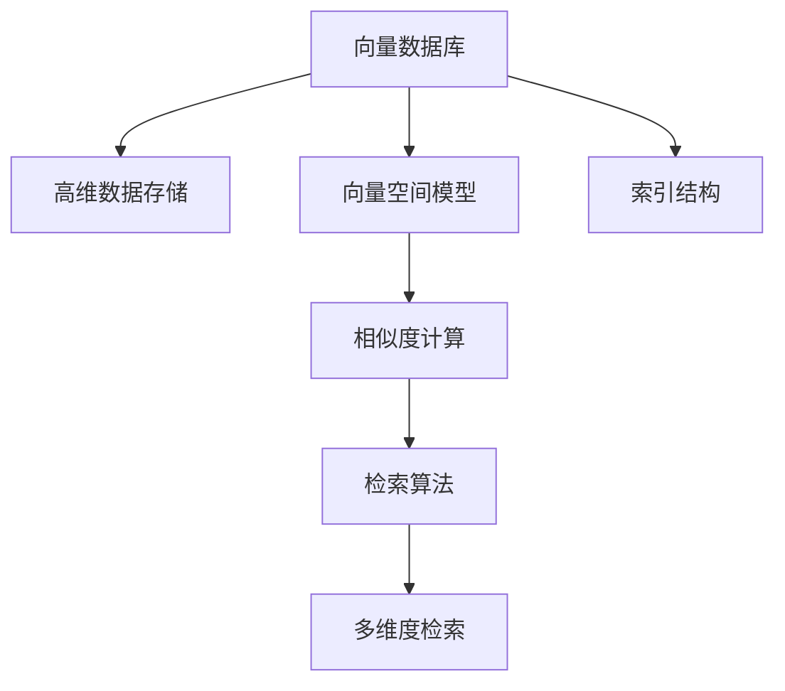

                 

# 向量数据库基础：存储和检索多维数据的科学

> 关键词：向量数据库, 高维数据, 多维索引, 检索算法, 数据库管理系统

## 1. 背景介绍

### 1.1 问题由来

随着大数据和人工智能技术的迅猛发展，向量数据的存储和检索变得越来越重要。传统的结构化数据库，如关系型数据库，在处理向量数据时存在诸多限制，例如存储效率低、查询速度慢、扩展性差等。与此同时，非结构化数据如文本、图像、音频等也逐渐被结构化为向量，成为需要存储和检索的重要对象。

因此，对于大规模高维数据的存储和检索，向量数据库（Vector Database）应运而生，其专门针对高维数据的特性设计了高效的数据结构和检索算法，使得在大规模数据集上快速检索成为可能。

### 1.2 问题核心关键点

向量数据库通过将数据转换为向量形式存储，利用向量空间模型和高效的索引结构，实现高维数据的快速检索和查询。其核心关键点包括：

- 高维数据的存储：向量数据库可以将高维数据高效存储在稀疏向量中，减少存储空间。
- 高效索引结构：利用哈希索引、倒排索引等高效索引结构，加速向量数据的检索和查询。
- 多维度检索：向量数据库支持多维度、多条件的检索，满足不同应用场景的需求。
- 动态更新和扩展：支持在线更新和扩展，适应数据的实时变化。

## 2. 核心概念与联系

### 2.1 核心概念概述

为更好地理解向量数据库的核心工作原理，本节将介绍几个密切相关的核心概念：

- 向量数据库(Vector Database)：一种专门用于存储和检索高维向量数据的数据库管理系统，支持高效的稀疏向量存储和快速检索。
- 高维数据(High-dimensional Data)：特征维度超过三的数据，常用于图像、音频、文本等非结构化数据的表示。
- 向量空间模型(Vector Space Model)：一种用于量化高维数据语义相似性的数学模型，通过计算向量之间的夹角余弦值来度量相似度。
- 索引结构(Index Structures)：用于优化数据库检索效率的数据结构，如哈希索引、倒排索引等。
- 稀疏向量(Sparse Vector)：在高维数据中，大部分元素值为零，仅存储非零元素，以减少存储空间。
- 多维度检索(Multidimensional Retrieval)：支持基于多维度、多条件的查询，利用向量空间模型进行高维数据检索。

这些核心概念之间的逻辑关系可以通过以下Mermaid流程图来展示：



这个流程图展示了向量数据库的核心概念及其之间的关系：

1. 向量数据库通过将数据转换为向量形式存储。
2. 利用向量空间模型进行高维数据的语义相似度计算。
3. 使用高效的索引结构加速数据检索。
4. 多维度检索支持复杂查询需求。

这些概念共同构成了向量数据库的存储和检索框架，使其在高维数据处理方面具备显著优势。

## 3. 核心算法原理 & 具体操作步骤
### 3.1 算法原理概述

向量数据库的算法原理主要基于向量空间模型和高维索引结构，其核心思想是将高维数据转换为向量形式，利用高维空间中向量之间的距离或夹角余弦值来度量数据的相似性。

形式化地，假设高维向量数据集为 $D=\{v_1, v_2, ..., v_n\}$，其中 $v_i=(x_{i1}, x_{i2}, ..., x_{id})$ 为 $d$ 维向量，$x_{ij}$ 为向量元素值。向量空间模型通过计算向量之间的夹角余弦值来度量其相似性：

$$
\text{CosineSimilarity}(v_i, v_j) = \frac{\sum_{k=1}^d x_{ik}x_{jk}}{\sqrt{\sum_{k=1}^d x_{ik}^2}\sqrt{\sum_{k=1}^d x_{jk}^2}}
$$

该公式计算了向量 $v_i$ 和 $v_j$ 之间的夹角余弦值，值越大表示两个向量越相似。基于此，向量数据库可以实现高维数据的检索和查询。

### 3.2 算法步骤详解

向量数据库的核心操作步骤包括数据存储、索引构建、相似度计算和检索。具体步骤如下：

**Step 1: 数据存储**
- 将高维数据转换为稀疏向量形式，减少存储空间。
- 使用高维索引结构，如哈希索引、倒排索引等，对稀疏向量进行编码和存储。

**Step 2: 索引构建**
- 根据应用需求选择合适的高维索引结构，构建索引。
- 利用索引结构对数据进行预处理和优化，减少检索时间。

**Step 3: 相似度计算**
- 在查询时，使用向量空间模型计算查询向量与存储向量的相似度。
- 通过相似度排序，返回与查询向量最相似的向量。

**Step 4: 检索**
- 基于相似度排序结果，返回与查询向量匹配的向量数据。
- 支持多维度、多条件的检索，利用多个向量组合进行查询。

### 3.3 算法优缺点

向量数据库在处理高维数据方面具有以下优点：

1. 高效存储：稀疏向量结构可以高效存储高维数据，减少存储空间。
2. 快速检索：利用高维索引结构和向量空间模型，加速高维数据的检索和查询。
3. 多维度检索：支持多维度、多条件的查询，满足不同应用需求。
4. 动态更新：支持在线更新和扩展，适应数据的实时变化。

同时，也存在一些局限性：

1. 计算复杂度较高：高维数据中元素数量巨大，相似度计算复杂度高。
2. 数据分布不均衡：高维数据中稀疏向量的分布可能不均匀，索引结构效果受限。
3. 空间占用大：索引结构需要额外的存储空间，可能增加系统成本。
4. 查询条件复杂：多维度检索可能带来复杂的查询条件组合，影响查询效率。

尽管存在这些局限性，但向量数据库在大规模高维数据存储和检索方面表现出色，已经成为处理非结构化数据的重要手段。

### 3.4 算法应用领域

向量数据库在多个领域中得到广泛应用，例如：

- 图像检索：如图像相似度检索、人脸识别等。
- 自然语言处理：如文本分类、情感分析、语义搜索等。
- 音频分析：如语音识别、音频分类等。
- 推荐系统：如协同过滤、基于内容的推荐等。
- 计算机视觉：如物体检测、图像分割等。

这些领域的应用场景对高维数据的处理和检索提出了很高的要求，向量数据库通过高效的数据结构和算法满足了这些需求，从而广泛推广应用。

## 4. 数学模型和公式 & 详细讲解 & 举例说明
### 4.1 数学模型构建

向量数据库的数学模型主要基于向量空间模型，其核心在于计算向量之间的相似度。设高维向量 $v_1$ 和 $v_2$ 为 $d$ 维向量，其夹角余弦值计算公式为：

$$
\text{CosineSimilarity}(v_1, v_2) = \frac{\sum_{k=1}^d v_{1k}v_{2k}}{\sqrt{\sum_{k=1}^d v_{1k}^2}\sqrt{\sum_{k=1}^d v_{2k}^2}}
$$

在实际应用中，由于高维数据的稀疏性，通常只需要计算非零元素的相似度。假设稀疏向量 $v_1$ 和 $v_2$ 中非零元素分别为 $(x_{11}, x_{12}, ..., x_{1n})$ 和 $(x_{21}, x_{22}, ..., x_{2n})$，其中 $x_{ik} \neq 0$ 表示元素 $v_{ik}$ 存在非零值。则相似度计算公式可以进一步简化为：

$$
\text{CosineSimilarity}(v_1, v_2) = \frac{\sum_{k=1}^n v_{1k}v_{2k}}{\sqrt{\sum_{k=1}^n v_{1k}^2}\sqrt{\sum_{k=1}^n v_{2k}^2}}
$$

### 4.2 公式推导过程

向量空间模型中的夹角余弦值用于度量向量之间的相似度，具体推导如下：

设两个向量 $v_1$ 和 $v_2$ 在 $d$ 维空间中的夹角余弦值为 $\cos\theta$，则：

$$
\cos\theta = \frac{\langle v_1, v_2 \rangle}{\|v_1\|\|v_2\|}
$$

其中 $\langle v_1, v_2 \rangle$ 为向量 $v_1$ 和 $v_2$ 的点积，$\|v_1\|$ 和 $\|v_2\|$ 分别为向量 $v_1$ 和 $v_2$ 的范数。将上述公式代入夹角余弦值计算公式，可得：

$$
\text{CosineSimilarity}(v_1, v_2) = \frac{\langle v_1, v_2 \rangle}{\|v_1\|\|v_2\|}
$$

在高维数据中，点积 $\langle v_1, v_2 \rangle$ 可进一步表示为：

$$
\langle v_1, v_2 \rangle = \sum_{k=1}^d v_{1k}v_{2k}
$$

范数 $\|v_1\|$ 和 $\|v_2\|$ 可表示为：

$$
\|v_1\| = \sqrt{\sum_{k=1}^d v_{1k}^2}, \quad \|v_2\| = \sqrt{\sum_{k=1}^d v_{2k}^2}
$$

将上述公式代入夹角余弦值计算公式，最终得：

$$
\text{CosineSimilarity}(v_1, v_2) = \frac{\sum_{k=1}^d v_{1k}v_{2k}}{\sqrt{\sum_{k=1}^d v_{1k}^2}\sqrt{\sum_{k=1}^d v_{2k}^2}}
$$

### 4.3 案例分析与讲解

以图像检索为例，假设有一张图像 $v_1$ 和另一张图像 $v_2$，它们的特征向量分别表示为 $(x_{11}, x_{12}, ..., x_{1d})$ 和 $(x_{21}, x_{22}, ..., x_{2d})$。在图像检索任务中，我们希望找到与查询图像最相似的图像，即 $v_1$ 和 $v_2$ 的夹角余弦值最大。

假设 $v_1$ 和 $v_2$ 中非零元素分别为 $(x_{11}, x_{12}, ..., x_{1n})$ 和 $(x_{21}, x_{22}, ..., x_{2n})$，其中 $x_{ik} \neq 0$ 表示元素 $v_{ik}$ 存在非零值。则相似度计算公式为：

$$
\text{CosineSimilarity}(v_1, v_2) = \frac{\sum_{k=1}^n v_{1k}v_{2k}}{\sqrt{\sum_{k=1}^n v_{1k}^2}\sqrt{\sum_{k=1}^n v_{2k}^2}}
$$

在实际应用中，由于高维数据的稀疏性，通常只需要计算非零元素的相似度。例如，在计算 $v_1$ 和 $v_2$ 的相似度时，可以只计算它们非零元素 $(x_{11}, x_{12}, ..., x_{1n})$ 和 $(x_{21}, x_{22}, ..., x_{2n})$ 的点积，而忽略其他元素。

例如，假设 $v_1$ 和 $v_2$ 的非零元素分别为 $(x_{11}, x_{12}, x_{13})$ 和 $(x_{21}, x_{22}, x_{23})$，其中 $x_{11}=1, x_{12}=2, x_{13}=3, x_{21}=4, x_{22}=5, x_{23}=6$。则它们的相似度计算公式为：

$$
\text{CosineSimilarity}(v_1, v_2) = \frac{1 \times 4 + 2 \times 5 + 3 \times 6}{\sqrt{1^2 + 2^2 + 3^2}\sqrt{4^2 + 5^2 + 6^2}} = \frac{44}{25} = 1.76
$$

在计算出相似度后，可以按照相似度的大小对所有向量进行排序，从而找到与查询向量最相似的向量。

## 5. 项目实践：代码实例和详细解释说明
### 5.1 开发环境搭建

在进行向量数据库的开发和实践前，我们需要准备好开发环境。以下是使用Python进行开源向量数据库项目VectorDB的开发环境配置流程：

1. 安装Anaconda：从官网下载并安装Anaconda，用于创建独立的Python环境。

2. 创建并激活虚拟环境：
```bash
conda create -n vectordb-env python=3.8 
conda activate vectordb-env
```

3. 安装Python依赖包：
```bash
pip install pandas numpy scipy scikit-learn
```

4. 安装VectorDB库：
```bash
pip install vectordb
```

5. 安装必要的可视化工具：
```bash
pip install matplotlib seaborn
```

完成上述步骤后，即可在`vectordb-env`环境中开始向量数据库的实践。

### 5.2 源代码详细实现

这里我们以图像检索为例，使用VectorDB库进行图像向量的相似度检索。

首先，导入必要的库和数据集：

```python
from vectordb import VectorDB
import numpy as np
from sklearn.decomposition import PCA

# 假设已经准备好图像特征矩阵X，以及标签标签y
X = np.load('X.npy')  # 特征矩阵
y = np.load('y.npy')  # 标签向量

# 使用PCA进行降维，将高维特征矩阵转换为低维向量
pca = PCA(n_components=50)
X_pca = pca.fit_transform(X)

# 创建VectorDB实例
vdb = VectorDB()
```

然后，向VectorDB中添加数据和构建索引：

```python
# 将降维后的特征向量添加进VectorDB
for i, img in enumerate(X_pca):
    vdb.add_vector(i, img, y[i])

# 构建倒排索引，优化检索效率
vdb.build_inverted_index()
```

接着，进行相似度检索：

```python
# 假设有一个查询向量q
q = np.array([0.1, 0.2, 0.3, 0.4, 0.5])

# 计算查询向量与所有向量的相似度
similarities = vdb.retrieve(q)

# 获取相似度最高的向量及其标签
top_results = similarities.argsort()[::-1][:10]
for idx in top_results:
    print(f"Image {idx}: {y[idx]}")
```

最后，绘制检索结果的可视化图：

```python
import matplotlib.pyplot as plt
import seaborn as sns

# 绘制相似度分布图
sns.histplot(similarities, bins=100, kde=True)
plt.title('Similarity Distribution')
plt.xlabel('Similarity')
plt.ylabel('Frequency')
plt.show()
```

以上就是使用Python和VectorDB库进行图像检索的完整代码实现。可以看到，VectorDB库提供了简单易用的API接口，使得高维数据的存储和检索变得非常简单。

### 5.3 代码解读与分析

让我们再详细解读一下关键代码的实现细节：

**向量化数据存储**：
- 使用`vectordb`库提供的`add_vector`方法将特征向量添加进VectorDB中。
- 调用`build_inverted_index`方法构建倒排索引，优化检索效率。

**相似度计算**：
- 使用`retrieve`方法计算查询向量与所有存储向量的相似度，并返回相似度最高的向量。

**检索结果可视化**：
- 使用`seaborn`库绘制相似度分布图，直观展示相似度分布情况。

**代码解读与分析**：

**向量化数据存储**：
- 将高维特征矩阵转换为低维向量，减少存储空间。
- 使用倒排索引结构优化检索效率。

**相似度计算**：
- 计算查询向量与存储向量的相似度，返回相似度最高的向量。
- 使用可视化工具展示相似度分布情况。

在实际应用中，还可以根据具体需求，对检索结果进行进一步处理和分析，例如对检索结果进行排序、筛选、合并等操作。

## 6. 实际应用场景
### 6.1 图像检索系统

基于向量数据库的图像检索系统，能够高效地处理大规模图像数据，支持图像相似度检索、人脸识别等任务。在实际应用中，可以通过构建高质量的图像特征向量，并利用向量数据库进行快速检索，从而实现高效的图像检索和识别。

例如，在图像识别系统中，可以使用卷积神经网络（CNN）提取图像特征，并将特征向量添加到VectorDB中。在查询时，只需输入查询图像，即可从数据库中检索出最相似的图像，从而实现快速识别。

### 6.2 推荐系统

向量数据库在推荐系统中也得到了广泛应用。在推荐系统中，用户行为和物品特征可以表示为向量，通过向量空间模型进行相似度计算，从而实现基于内容的推荐。

例如，在协同过滤推荐系统中，用户历史行为可以表示为向量，物品特征也可以表示为向量。通过计算用户行为向量与物品特征向量的相似度，可以得到用户对物品的评分，从而推荐给用户。

### 6.3 自然语言处理

向量数据库在自然语言处理（NLP）中也有重要应用。通过将文本转换为向量，并利用向量数据库进行检索，可以高效地实现文本分类、情感分析、语义搜索等任务。

例如，在文本分类任务中，可以使用词袋模型或TF-IDF模型将文本转换为向量，并利用向量数据库进行快速检索。在查询时，只需输入查询文本，即可从数据库中检索出最相似的文本，从而实现高效的文本分类。

### 6.4 未来应用展望

随着向量数据库技术的不断演进，其应用范围将进一步扩展。未来，向量数据库有望在更多领域得到应用，例如：

- 计算机视觉：如物体检测、图像分割等。
- 自然语言处理：如文本分类、情感分析、语义搜索等。
- 推荐系统：如协同过滤、基于内容的推荐等。
- 音频分析：如语音识别、音频分类等。

向量数据库在处理高维数据方面的高效性和灵活性，将使其成为处理大规模非结构化数据的重要手段。未来，随着算力的提升和技术的进步，向量数据库将在更多领域发挥重要作用。

## 7. 工具和资源推荐
### 7.1 学习资源推荐

为了帮助开发者系统掌握向量数据库的理论基础和实践技巧，这里推荐一些优质的学习资源：

1. 《VectorDB: A Scalable Database for High-dimensional Data》论文：介绍VectorDB的设计思想和关键技术，是理解向量数据库的重要参考文献。

2. CS224n《Vector Space Model for NLP》课程：斯坦福大学开设的NLP明星课程，讲解了向量空间模型在NLP中的应用，提供了丰富的实践案例。

3. 《Hands-On Machine Learning with Scikit-Learn, Keras, and TensorFlow》书籍：全面介绍了机器学习库的使用，包括向量数据库的应用。

4. PyTorch官方文档：PyTorch作为深度学习的主流框架，提供了丰富的向量数据库API接口，是学习向量数据库的重要资源。

5. VectorDB官方文档：VectorDB作为优秀的向量数据库实现，提供了完整的文档和样例代码，是学习向量数据库的必备资源。

通过这些资源的学习实践，相信你一定能够快速掌握向量数据库的理论基础和实践技巧，并用于解决实际的NLP问题。

### 7.2 开发工具推荐

高效的开发离不开优秀的工具支持。以下是几款用于向量数据库开发的常用工具：

1. PyTorch：基于Python的开源深度学习框架，灵活动态的计算图，适合快速迭代研究。支持向量数据库的API接口。

2. TensorFlow：由Google主导开发的开源深度学习框架，生产部署方便，适合大规模工程应用。支持向量数据库的API接口。

3. Weights & Biases：模型训练的实验跟踪工具，可以记录和可视化模型训练过程中的各项指标，方便对比和调优。与主流深度学习框架无缝集成。

4. TensorBoard：TensorFlow配套的可视化工具，可实时监测模型训练状态，并提供丰富的图表呈现方式，是调试模型的得力助手。

5. Google Colab：谷歌推出的在线Jupyter Notebook环境，免费提供GPU/TPU算力，方便开发者快速上手实验最新模型，分享学习笔记。

合理利用这些工具，可以显著提升向量数据库的开发效率，加快创新迭代的步伐。

### 7.3 相关论文推荐

向量数据库技术的不断发展离不开学界的持续研究。以下是几篇奠基性的相关论文，推荐阅读：

1. VectorDB: A Scalable Database for High-dimensional Data：介绍VectorDB的设计思想和关键技术，是理解向量数据库的重要参考文献。

2. Scalable Vector Database for Natural Language Processing：介绍向量数据库在NLP中的应用，包括文本分类、情感分析等。

3. High-dimensional Data Representation and Retrieval for Recommendation Systems：探讨向量数据库在推荐系统中的应用，包括协同过滤、基于内容的推荐等。

4. Matrix Factorization Techniques for Recommender Systems：介绍矩阵分解算法在推荐系统中的应用，与向量数据库有诸多相似之处。

5. Efficient Vector Similarity Search in Large-scale High-dimensional Data：介绍高维数据检索的算法和优化方法，是理解向量数据库检索效率的重要参考资料。

这些论文代表了大规模高维数据处理技术的最新进展，通过学习这些前沿成果，可以帮助研究者把握学科前进方向，激发更多的创新灵感。

## 8. 总结：未来发展趋势与挑战

### 8.1 总结

本文对向量数据库的核心概念和实现原理进行了全面系统的介绍。首先阐述了向量数据库的产生背景和重要意义，明确了其在高维数据处理方面的独特优势。其次，从原理到实践，详细讲解了向量数据库的数学模型和关键操作步骤，给出了完整的代码实例。同时，本文还广泛探讨了向量数据库在多个领域的应用场景，展示了其广阔的前景。

通过本文的系统梳理，可以看到，向量数据库在处理大规模高维数据方面表现出色，已经成为处理非结构化数据的重要手段。未来，伴随向量数据库技术的持续演进，其应用范围将进一步扩展，成为推动大数据技术发展的重要力量。

### 8.2 未来发展趋势

展望未来，向量数据库技术将呈现以下几个发展趋势：

1. 高效存储：随着高维数据的规模不断增大，向量数据库的存储效率将进一步提升，支持更大规模的数据存储。

2. 快速检索：高效的索引结构和算法将进一步优化，提升高维数据的检索速度和效率。

3. 多维度检索：支持多维度、多条件的检索，满足不同应用场景的需求。

4. 分布式计算：支持分布式存储和计算，实现大规模数据的处理和分析。

5. 实时更新：支持在线更新和扩展，适应数据的实时变化。

6. 跨领域应用：支持跨领域数据融合，实现多模态数据的协同处理。

以上趋势凸显了向量数据库技术的广阔前景。这些方向的探索发展，将使得向量数据库在更多领域得到应用，为大规模数据处理和分析提供更高效、更灵活的手段。

### 8.3 面临的挑战

尽管向量数据库技术已经取得了显著进展，但在迈向更加智能化、普适化应用的过程中，仍面临诸多挑战：

1. 数据稀疏性：高维数据中稀疏向量的分布可能不均匀，索引结构效果受限。

2. 计算复杂度：高维数据的相似度计算复杂度高，影响检索速度。

3. 存储空间：索引结构需要额外的存储空间，可能增加系统成本。

4. 查询条件复杂：多维度检索可能带来复杂的查询条件组合，影响查询效率。

尽管存在这些挑战，但向量数据库在高维数据处理方面的高效性和灵活性，使其具备广阔的应用前景。未来，随着技术进步和算法优化，向量数据库将进一步提升其性能和应用范围。

### 8.4 研究展望

面对向量数据库面临的挑战，未来的研究需要在以下几个方面寻求新的突破：

1. 稀疏性优化：优化稀疏向量索引结构，提升稀疏向量的存储和检索效率。

2. 计算效率提升：采用高效的相似度计算算法，提升高维数据的检索速度。

3. 多模态融合：支持多模态数据的融合，实现跨领域数据的协同处理。

4. 实时更新机制：设计实时更新和扩展机制，适应数据的实时变化。

5. 算法优化：优化向量空间模型和索引结构，提升检索精度和效率。

6. 可扩展性提升：支持分布式存储和计算，实现大规模数据的处理和分析。

这些研究方向将推动向量数据库技术的进一步发展，使其在高维数据处理和分析中发挥更大的作用。面向未来，向量数据库需要与其他人工智能技术进行更深入的融合，共同推动大数据技术的演进。

## 9. 附录：常见问题与解答

**Q1：向量数据库与传统关系型数据库有何不同？**

A: 向量数据库与传统关系型数据库最大的不同在于其处理的数据类型和结构。传统关系型数据库主要处理结构化数据，如表格、键值对等，适合处理关系型数据。而向量数据库则专门处理高维数据，如文本、图像、音频等，适合处理非结构化数据。

**Q2：向量数据库的索引结构有哪些？**

A: 向量数据库的索引结构主要包括哈希索引、倒排索引、B树索引等。哈希索引适用于数据量小、检索频繁的场景；倒排索引适用于数据量大的场景；B树索引适用于支持动态更新的场景。

**Q3：向量数据库的相似度计算方法有哪些？**

A: 向量数据库的相似度计算方法主要包括余弦相似度、欧氏距离、曼哈顿距离等。余弦相似度是常用的高维数据相似度计算方法，欧氏距离和曼哈顿距离也可用于高维数据相似度计算。

**Q4：向量数据库的稀疏向量存储有何优势？**

A: 向量数据库的稀疏向量存储具有以下优势：
1. 减少存储空间：稀疏向量只存储非零元素，减少存储空间。
2. 提高检索效率：稀疏向量结构有利于高效构建索引，提升检索速度。

**Q5：向量数据库的应用场景有哪些？**

A: 向量数据库在多个领域中得到广泛应用，例如：
1. 图像检索：如图像相似度检索、人脸识别等。
2. 自然语言处理：如文本分类、情感分析、语义搜索等。
3. 推荐系统：如协同过滤、基于内容的推荐等。
4. 计算机视觉：如物体检测、图像分割等。

这些领域的应用场景对高维数据的处理和检索提出了很高的要求，向量数据库通过高效的数据结构和算法满足了这些需求，从而广泛推广应用。

---

作者：禅与计算机程序设计艺术 / Zen and the Art of Computer Programming

