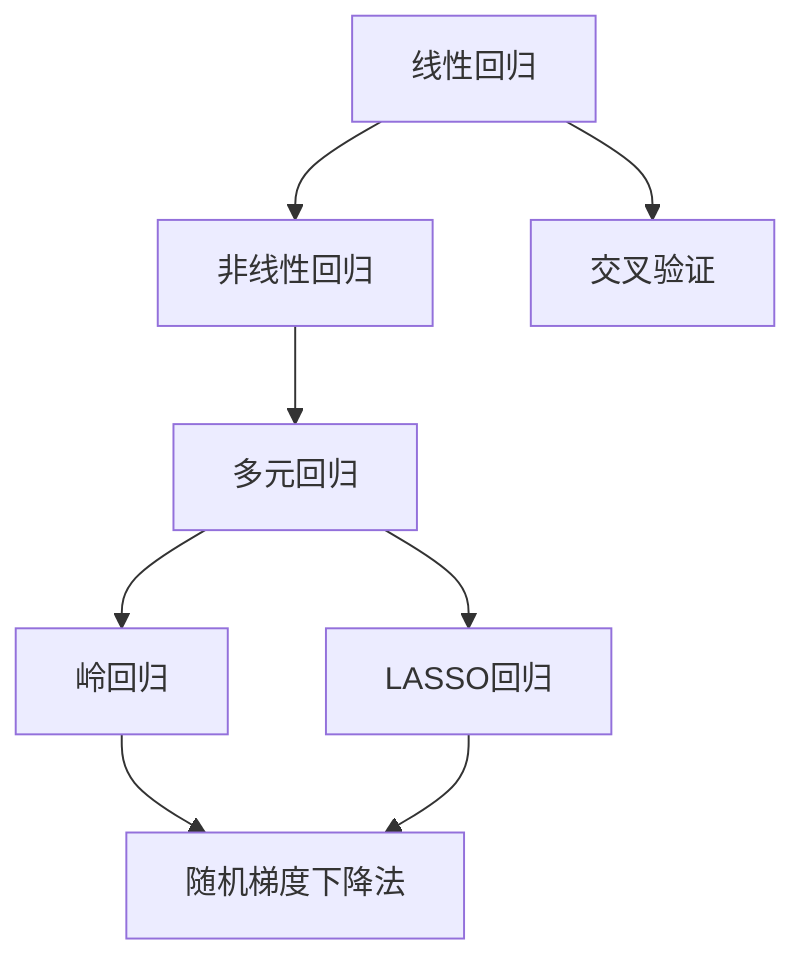

                 

# 回归(Regression) - 原理与代码实例讲解

> 关键词：回归模型,梯度下降法,交叉验证,特征工程,正则化,机器学习

## 1. 背景介绍

### 1.1 问题由来
回归是机器学习中非常基础且重要的任务之一，它的目标是建立输入特征和输出值之间的映射关系。在实际应用中，回归模型被广泛应用于预测、建模和控制等领域，如股票价格预测、房价预测、市场分析等。然而，随着数据规模和复杂度的不断增大，传统的线性回归模型已无法满足现代数据处理的需求，因此引入非线性回归模型和高级回归技术势在必行。

### 1.2 问题核心关键点
本节将介绍回归模型的基本概念、原理及其在实际应用中的关键点，以便读者能够深入理解回归模型的工作机制，并掌握其实现方法。

### 1.3 问题研究意义
回归模型在数据科学和机器学习领域具有广泛的应用，掌握其原理和实现方法对从事数据科学和机器学习的从业者来说至关重要。本博客旨在通过深入浅出的方式，帮助读者系统了解回归模型的基本原理、常用算法以及实际应用，并给出具体的代码实例，以便读者能够更好地理解和使用回归模型。

## 2. 核心概念与联系

### 2.1 核心概念概述

回归模型是通过建立一个或多个输入特征与输出值之间的映射关系，预测或控制未来的输出值的机器学习模型。在回归模型中，输入特征和输出值之间通常是非线性的关系。

- **线性回归**：最简单的回归模型，它假设输入特征和输出值之间存在线性关系。
- **非线性回归**：通过引入多项式或非线性函数，建立输入特征和输出值之间的非线性关系。
- **多元回归**：处理多个输入特征和输出值之间的复杂关系。
- **岭回归**：一种正则化方法，通过引入L2正则项，避免过拟合。
- **LASSO回归**：另一种正则化方法，通过引入L1正则项，实现特征选择。
- **随机梯度下降法**：一种常用的优化算法，用于最小化损失函数，以更新模型参数。
- **交叉验证**：一种评估模型性能的方法，通过分割数据集进行训练和验证，提高模型泛化能力。

这些概念之间的逻辑关系可以通过以下Mermaid流程图来展示：



这个流程图展示了回归模型从简单到复杂的演变过程，以及各种正则化方法和优化算法的应用。通过理解这些概念，我们可以更好地掌握回归模型的基本原理和应用方法。

## 3. 核心算法原理 & 具体操作步骤
### 3.1 算法原理概述

回归模型的核心思想是建立一个或多个输入特征与输出值之间的映射关系，通过最小化损失函数，更新模型参数，从而提高模型预测的准确性。回归模型通常分为线性回归和非线性回归两种，其中线性回归是最基本的回归模型，而非线性回归通过引入非线性项或多项式项，建立更加复杂的输入输出关系。

线性回归模型通常采用最小二乘法（Ordinary Least Squares, OLS）来最小化损失函数，而非线性回归则采用最小化均方误差（Mean Squared Error, MSE）来优化模型。在回归模型中，常见的损失函数包括均方误差、平均绝对误差（Mean Absolute Error, MAE）和Huber损失等。

### 3.2 算法步骤详解

回归模型的实现通常包括以下几个关键步骤：

**Step 1: 数据准备**

- 收集并预处理数据集，确保数据集的完整性和一致性。
- 对数据集进行分割，划分为训练集和验证集，以便进行交叉验证和模型评估。

**Step 2: 模型选择与设计**

- 根据任务需求选择合适的回归模型，如线性回归、岭回归、LASSO回归等。
- 设计模型的输入特征和输出值，确定模型参数的初始值。

**Step 3: 模型训练**

- 使用训练集对模型进行训练，通过优化算法最小化损失函数，更新模型参数。
- 在训练过程中，使用交叉验证方法进行模型评估，调整模型参数，防止过拟合。

**Step 4: 模型评估**

- 使用验证集对模型进行评估，计算模型的误差和性能指标。
- 根据评估结果，对模型进行优化调整，如增加正则项、调整学习率等。

**Step 5: 模型应用**

- 使用训练好的模型进行预测或控制，根据需求调整模型的参数。
- 对预测结果进行后处理，如阈值调整、插值等，提高模型性能。

### 3.3 算法优缺点

回归模型具有以下优点：

- 模型简单，易于理解和实现。
- 适用范围广，适用于多种数据类型和预测任务。
- 预测结果具有较好的可解释性。

同时，回归模型也存在一些缺点：

- 对异常值敏感，容易受到噪声数据的影响。
- 模型的泛化能力有限，难以处理非线性关系。
- 模型评估需要大量标注数据，标注成本较高。

## 4. 数学模型和公式 & 详细讲解 & 举例说明

### 4.1 数学模型构建

回归模型的数学模型通常采用线性回归模型，其公式如下：

$$
y = \theta_0 + \theta_1 x_1 + \theta_2 x_2 + ... + \theta_n x_n
$$

其中，$y$ 为输出值，$x_1, x_2, ..., x_n$ 为输入特征，$\theta_0, \theta_1, ..., \theta_n$ 为模型参数。

在多元回归模型中，公式扩展为：

$$
y = \beta_0 + \beta_1 x_1 + \beta_2 x_2 + ... + \beta_n x_n
$$

其中，$\beta_0, \beta_1, ..., \beta_n$ 为模型参数。

### 4.2 公式推导过程

在线性回归模型中，最小化均方误差（MSE）的目标函数为：

$$
\min_{\theta} \sum_{i=1}^n (y_i - \theta_0 - \theta_1 x_{1,i} - \theta_2 x_{2,i} - ... - \theta_n x_{n,i})^2
$$

其中，$y_i$ 为第 $i$ 个样本的输出值，$x_{j,i}$ 为第 $i$ 个样本的第 $j$ 个输入特征。

通过求偏导数，可以得到模型参数的更新公式：

$$
\theta_j = \frac{\sum_{i=1}^n (y_i - \hat{y}_i)x_{j,i}}{\sum_{i=1}^n x_{j,i}^2}, j=1,2,...,n
$$

其中，$\hat{y}_i$ 为第 $i$ 个样本的预测值。

在多元回归模型中，目标函数扩展为：

$$
\min_{\beta} \sum_{i=1}^n (y_i - \beta_0 - \beta_1 x_{1,i} - \beta_2 x_{2,i} - ... - \beta_n x_{n,i})^2
$$

通过求偏导数，可以得到模型参数的更新公式：

$$
\beta_j = \frac{\sum_{i=1}^n (y_i - \hat{y}_i)x_{j,i}}{\sum_{i=1}^n x_{j,i}^2}, j=1,2,...,n
$$

### 4.3 案例分析与讲解

以房价预测为例，回归模型可以预测给定特征（如房屋面积、位置等）下的房价。具体步骤如下：

- **数据准备**：收集历史房价数据，提取房屋面积、位置等特征。
- **模型选择与设计**：选择线性回归模型，设定输入特征和输出值。
- **模型训练**：使用训练集对模型进行训练，最小化MSE损失函数，更新模型参数。
- **模型评估**：使用验证集对模型进行评估，计算模型的误差和性能指标。
- **模型应用**：使用训练好的模型对新的房屋数据进行预测，根据预测结果进行价格调整。

## 5. 项目实践：代码实例和详细解释说明

### 5.1 开发环境搭建

在开始代码实现之前，我们需要准备好开发环境。以下是使用Python进行Scikit-learn开发的环境配置流程：

1. 安装Anaconda：从官网下载并安装Anaconda，用于创建独立的Python环境。
2. 创建并激活虚拟环境：
```bash
conda create -n sklearn-env python=3.8 
conda activate sklearn-env
```

3. 安装Scikit-learn：
```bash
pip install scikit-learn
```

4. 安装NumPy、Pandas、Matplotlib等辅助工具包：
```bash
pip install numpy pandas matplotlib
```

完成上述步骤后，即可在`sklearn-env`环境中开始回归模型的开发。

### 5.2 源代码详细实现

以下是一个简单的线性回归模型代码示例，用于预测房价：

```python
from sklearn.linear_model import LinearRegression
from sklearn.model_selection import train_test_split
from sklearn.metrics import mean_squared_error
import pandas as pd
import numpy as np

# 加载数据集
data = pd.read_csv('house_prices.csv')

# 数据预处理
X = data[['area', 'location']]
y = data['price']

# 分割数据集
X_train, X_test, y_train, y_test = train_test_split(X, y, test_size=0.2, random_state=42)

# 实例化模型
model = LinearRegression()

# 模型训练
model.fit(X_train, y_train)

# 模型评估
y_pred = model.predict(X_test)
mse = mean_squared_error(y_test, y_pred)
print('MSE:', mse)

# 模型应用
new_data = pd.DataFrame({'area': [1200], 'location': ['new location']})
new_data['price'] = model.predict(new_data)
print(new_data)
```

### 5.3 代码解读与分析

让我们再详细解读一下关键代码的实现细节：

**数据加载与预处理**：
- `pd.read_csv`：从文件中加载数据集。
- `X` 和 `y`：分别表示输入特征和输出值。

**模型训练**：
- `train_test_split`：将数据集划分为训练集和测试集。
- `LinearRegression`：实例化线性回归模型。
- `fit`：使用训练集对模型进行训练，最小化MSE损失函数，更新模型参数。

**模型评估**：
- `mean_squared_error`：计算模型在测试集上的MSE误差。

**模型应用**：
- `predict`：对新的数据进行预测。
- `print`：输出预测结果。

可以看到，Scikit-learn库提供了简单易用的接口，使得回归模型的实现变得相对容易。开发者只需关注模型设计、数据处理等高层逻辑，而不必过多关注底层实现细节。

## 6. 实际应用场景

### 6.1 房价预测

房价预测是回归模型的典型应用之一，通过回归模型可以预测给定特征（如房屋面积、位置等）下的房价，为房地产投资和交易提供决策依据。

### 6.2 股票价格预测

股票价格预测是回归模型的另一个重要应用，通过回归模型可以预测股票的涨跌幅度和趋势，帮助投资者制定投资策略。

### 6.3 电力负荷预测

电力负荷预测是回归模型在工业应用中的一个重要场景，通过回归模型可以预测电力负荷的变化趋势，为电网调度和电力分配提供依据。

### 6.4 未来应用展望

随着回归模型和机器学习技术的不断发展，其在各个领域的应用将会更加广泛和深入。未来，回归模型将在更多场景中发挥其预测和控制作用，为人类生产和生活带来新的变革。

## 7. 工具和资源推荐

### 7.1 学习资源推荐

为了帮助开发者系统掌握回归模型的理论基础和实践技巧，这里推荐一些优质的学习资源：

1. 《机器学习实战》：是一本非常经典的书，介绍了机器学习的基本概念和常用算法，包括回归模型。
2. Coursera的《机器学习》课程：由斯坦福大学Andrew Ng教授讲授，内容涵盖了机器学习的基本原理和常用算法，是学习机器学习的好资源。
3. Kaggle的回归竞赛：Kaggle是一个数据科学竞赛平台，通过参与回归竞赛可以实践和学习回归模型。
4. Scikit-learn官方文档：Scikit-learn是Python中常用的机器学习库，其官方文档详细介绍了回归模型的实现方法。

通过对这些资源的学习实践，相信你一定能够快速掌握回归模型的精髓，并用于解决实际的预测和控制问题。

### 7.2 开发工具推荐

高效的开发离不开优秀的工具支持。以下是几款用于回归模型开发的常用工具：

1. Jupyter Notebook：一个交互式的编程环境，适合编写和执行Python代码。
2. Matplotlib：一个用于绘制图形的Python库，可以绘制各种类型的图表，便于数据分析和可视化。
3. Pandas：一个用于数据处理和分析的Python库，支持数据清洗、转换和分析。
4. Scikit-learn：一个用于机器学习的Python库，提供了多种回归模型的实现。

合理利用这些工具，可以显著提升回归模型的开发效率，加快创新迭代的步伐。

### 7.3 相关论文推荐

回归模型在数据科学和机器学习领域的发展经历了多年的沉淀，以下是几篇奠基性的相关论文，推荐阅读：

1. "Linear Regression: Concepts and Applications"：介绍线性回归的基本概念和应用。
2. "Ridge Regression: A Machine Learning Technique for Better Predictions"：介绍岭回归的基本原理和实现方法。
3. "LASSO: The Lasso Method for Variable Selection"：介绍LASSO回归的基本原理和实现方法。
4. "Stochastic Gradient Descent: A Tutorial"：介绍随机梯度下降法的基本原理和实现方法。
5. "Cross-validation: Concepts and Applications"：介绍交叉验证的基本概念和实现方法。

这些论文代表了大回归模型发展的重要阶段，通过学习这些前沿成果，可以帮助研究者把握学科前进方向，激发更多的创新灵感。

## 8. 总结：未来发展趋势与挑战

### 8.1 总结

本文对回归模型的基本原理、常用算法及其在实际应用中的关键点进行了全面系统的介绍。首先，阐述了回归模型的背景和重要性，明确了回归模型在数据处理和控制中的独特价值。其次，从原理到实践，详细讲解了回归模型的数学原理和关键步骤，给出了回归模型开发的完整代码实例。同时，本文还探讨了回归模型在房价预测、股票价格预测、电力负荷预测等多个实际应用场景中的表现，展示了回归模型的广泛应用前景。此外，本文精选了回归模型的各类学习资源，力求为读者提供全方位的技术指引。

通过本文的系统梳理，可以看到，回归模型在数据科学和机器学习领域具有广泛的应用，掌握其原理和实现方法对从事数据科学和机器学习的从业者来说至关重要。本博客旨在通过深入浅出的方式，帮助读者系统了解回归模型的基本原理和应用方法，并给出具体的代码实例，以便读者能够更好地理解和使用回归模型。

### 8.2 未来发展趋势

展望未来，回归模型将呈现以下几个发展趋势：

1. 模型复杂度增加：随着数据规模和复杂度的不断增大，回归模型的复杂度将进一步增加，处理非线性关系的能力将得到提升。
2. 多模态数据融合：未来的回归模型将越来越多地处理多模态数据，如文本、图像、声音等，从而实现更全面、更准确的数据建模。
3. 深度学习回归：基于神经网络的深度学习回归模型将逐步取代传统的回归模型，成为未来的主流。
4. 在线回归：随着实时数据流的不断增加，在线回归技术将得到广泛应用，实时处理和预测数据。
5. 自动机器学习（AutoML）：自动机器学习将自动化回归模型的设计和调参过程，提高模型的开发效率和性能。

以上趋势凸显了回归模型在数据科学和机器学习领域的发展前景。这些方向的探索发展，必将进一步提升回归模型的性能和应用范围，为人类生产和生活带来新的变革。

### 8.3 面临的挑战

尽管回归模型已经取得了瞩目成就，但在迈向更加智能化、普适化应用的过程中，它仍面临着诸多挑战：

1. 数据预处理复杂：回归模型对数据预处理的要求较高，需要处理缺失值、异常值等复杂情况。
2. 模型调参困难：回归模型的调参过程繁琐，需要大量的实验和经验。
3. 模型泛化能力有限：回归模型对数据的分布和特征敏感，泛化能力有限。
4. 过拟合风险高：回归模型在处理复杂数据时容易出现过拟合现象。
5. 计算资源消耗大：回归模型通常需要较大的计算资源，对硬件设备要求较高。

### 8.4 研究展望

面对回归模型面临的挑战，未来的研究需要在以下几个方面寻求新的突破：

1. 数据增强技术：通过数据增强技术，提升回归模型的泛化能力和处理异常值的能力。
2. 自动调参技术：通过自动化调参技术，简化回归模型的调参过程，提高模型的开发效率。
3. 模型融合技术：通过模型融合技术，将多种回归模型进行组合，提高模型的预测精度和鲁棒性。
4. 在线回归技术：通过在线回归技术，实现实时处理和预测数据，满足实时应用的需求。
5. 深度学习回归：通过深度学习回归模型，提升回归模型的复杂度和预测能力。

这些研究方向的探索，必将引领回归模型迈向更高的台阶，为数据科学和机器学习的发展注入新的活力。总之，回归模型作为数据处理和控制的重要工具，在未来将具有更加广泛的应用前景和重要的研究价值。

## 9. 附录：常见问题与解答

**Q1：回归模型是否适用于所有数据类型？**

A: 回归模型适用于连续型数据的预测和控制任务，但对于非连续型数据（如分类数据）不适用。在选择回归模型时，需要根据数据类型和任务需求进行选择。

**Q2：如何处理缺失值和异常值？**

A: 处理缺失值和异常值是回归模型预处理的重要步骤。常用的处理方法包括插值法、删除法、填补法等。在实际应用中，需要根据数据特点选择合适的方法进行处理。

**Q3：如何选择回归模型的正则化参数？**

A: 正则化参数的选择对回归模型的性能和泛化能力有很大影响。常用的选择方法包括交叉验证、网格搜索、贝叶斯优化等。通过实验和比较，选择最优的正则化参数。

**Q4：回归模型在实际应用中是否需要调参？**

A: 回归模型在实际应用中通常需要调参，以优化模型的性能和泛化能力。常用的调参方法包括网格搜索、贝叶斯优化等。

**Q5：如何评估回归模型的性能？**

A: 评估回归模型的性能通常使用均方误差（MSE）、平均绝对误差（MAE）、R²系数等指标。通过实验和比较，选择最优的模型和参数组合。

---

作者：禅与计算机程序设计艺术 / Zen and the Art of Computer Programming

